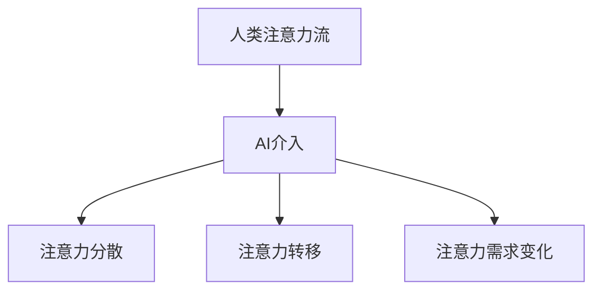

                 

关键词：人工智能，注意力流，工作场所，技能要求，未来趋势

> 摘要：本文旨在探讨人工智能（AI）对人类注意力流的影响，以及未来工作场所中所需的技能。通过对核心概念、算法原理、数学模型、实际应用案例的深入分析，本文揭示了AI如何改变我们的工作和生活，并提出了应对这一变革的建议。

## 1. 背景介绍

随着人工智能技术的飞速发展，AI已经开始渗透到我们日常生活的方方面面。从自动驾驶汽车、智能助手到医疗诊断、金融分析，AI正逐步取代许多传统的人类工作。然而，这一变革不仅带来了效率的提升，也对人类的注意力流产生了深远的影响。

注意力流，是指人类在完成某项任务时，集中注意力的过程。传统的注意力流模式通常是以线性、连续的方式进行，例如阅读、写作、编程等。然而，随着AI的介入，这种模式正在发生改变。AI能够处理大量数据，快速分析和决策，这使得人类不再需要长时间集中注意力，而是可以分散注意力，关注更多元化的任务。

### 1.1 人工智能对注意力流的影响

人工智能的崛起，对人类注意力流产生了以下几方面的影响：

1. **注意力分散**：AI能够自动处理许多复杂的任务，如数据分析、文本生成等，这导致人类可以更自由地分散注意力，关注更多元化的任务。
2. **注意力转移**：AI的介入使得人类可以将注意力从重复性、机械性的任务中解放出来，转移到更具创造性和战略性的工作中。
3. **注意力需求变化**：随着AI的发展，人类对于注意力质量的需求也在发生变化，更注重深层次、高难度的思考。

### 1.2 未来的工作场所

在未来的工作场所，人工智能将扮演越来越重要的角色。传统的岗位可能会被AI取代，而新的岗位也将随之产生。例如，AI数据分析师、AI编程助手、AI教育培训师等。同时，工作场所也将更加灵活，更加注重个人的兴趣和个性发展。

## 2. 核心概念与联系

### 2.1 人工智能与注意力流

人工智能与注意力流的关系可以用以下Mermaid流程图来表示：



### 2.2 未来的工作场所技能要求

随着人工智能的发展，未来的工作场所对技能要求也将发生变化。以下是未来工作场所所需的几种核心技能：

1. **跨学科知识**：未来的工作场所将更加多元，需要具备跨学科的知识，如计算机科学、心理学、经济学等。
2. **创新能力**：AI可以处理重复性任务，但创新性工作仍然需要人类的参与。因此，创新能力将成为未来工作场所的重要技能。
3. **适应能力**：随着AI的介入，工作场所的变革将不断发生。具备适应能力的人将更容易应对这种变化。
4. **人际沟通能力**：在AI的帮助下，人类可以更专注于人与人之间的沟通和协作，因此，人际沟通能力也将成为未来工作场所的重要技能。

## 3. 核心算法原理 & 具体操作步骤

### 3.1 算法原理概述

人工智能的核心算法可以分为两大类：监督学习和无监督学习。监督学习是基于已有数据，通过训练模型来预测新的数据。无监督学习则是通过分析未标记的数据，寻找数据中的模式和关联。

在注意力流的研究中，常用的算法包括注意力机制、循环神经网络（RNN）和长短期记忆网络（LSTM）。这些算法通过捕捉和处理注意力流数据，实现对人类注意力流的建模和分析。

### 3.2 算法步骤详解

1. **数据收集**：首先，需要收集与注意力流相关的数据，如大脑扫描数据、行为数据等。
2. **数据处理**：对收集到的数据进行预处理，包括数据清洗、归一化等。
3. **模型训练**：使用预处理后的数据，训练注意力模型。训练过程包括模型初始化、模型优化等。
4. **模型评估**：使用验证集评估模型性能，包括准确率、召回率等指标。
5. **模型应用**：将训练好的模型应用于实际场景，如预测人类注意力流、优化工作流程等。

### 3.3 算法优缺点

1. **优点**：注意力模型能够捕捉和处理复杂的注意力流数据，提高预测准确性。
2. **缺点**：训练过程复杂，对计算资源要求高；模型泛化能力有限。

### 3.4 算法应用领域

注意力模型在许多领域都有广泛的应用，如医疗诊断、金融分析、教育等。在医疗诊断中，注意力模型可以分析医生的临床思维过程，提高诊断准确性。在金融分析中，注意力模型可以捕捉市场变化，预测股票走势。在教育中，注意力模型可以分析学生的学习过程，提供个性化的学习建议。

## 4. 数学模型和公式 & 详细讲解 & 举例说明

### 4.1 数学模型构建

在注意力流的研究中，常用的数学模型包括注意力权重计算模型、循环神经网络（RNN）模型和长短期记忆网络（LSTM）模型。以下是这些模型的构建过程：

### 4.1.1 注意力权重计算模型

注意力权重计算模型用于计算每个数据点的权重，以反映其重要性。模型公式如下：

$$
w_i = \frac{e^{z_i}}{\sum_{j=1}^{N} e^{z_j}}
$$

其中，$w_i$ 表示第 $i$ 个数据点的权重，$z_i$ 表示第 $i$ 个数据点的特征值，$N$ 表示数据点的总数。

### 4.1.2 循环神经网络（RNN）模型

循环神经网络（RNN）模型用于处理序列数据，其公式如下：

$$
h_t = \sigma(W_h \cdot [h_{t-1}, x_t] + b_h)
$$

其中，$h_t$ 表示第 $t$ 个时刻的隐藏状态，$x_t$ 表示第 $t$ 个输入数据，$W_h$ 和 $b_h$ 分别表示权重和偏置。

### 4.1.3 长短期记忆网络（LSTM）模型

长短期记忆网络（LSTM）模型是 RNN 的一种改进，其公式如下：

$$
i_t = \sigma(W_i \cdot [h_{t-1}, x_t] + b_i)
$$

$$
f_t = \sigma(W_f \cdot [h_{t-1}, x_t] + b_f)
$$

$$
g_t = \tanh(W_g \cdot [h_{t-1}, x_t] + b_g)
$$

$$
o_t = \sigma(W_o \cdot [h_{t-1}, x_t] + b_o)
$$

$$
h_t = o_t \cdot \tanh(W_h \cdot [f_t \cdot h_{t-1} + i_t \cdot g_t] + b_h)
$$

其中，$i_t$、$f_t$、$g_t$、$o_t$ 分别表示输入门、遗忘门、生成门和输出门，$\sigma$ 表示 sigmoid 函数。

### 4.2 公式推导过程

公式的推导过程主要涉及神经网络的构建、参数优化和训练过程。具体推导过程如下：

1. **神经网络构建**：首先，根据问题需求，选择合适的神经网络模型，并定义网络的参数。
2. **参数优化**：使用梯度下降法等优化算法，对网络参数进行优化，使网络在训练数据上达到较好的性能。
3. **训练过程**：通过不断迭代训练过程，更新网络参数，使网络能够适应不同的输入数据。

### 4.3 案例分析与讲解

以下是一个注意力流分析的案例：

假设我们有一个包含100个数据点的注意力流数据集，每个数据点表示一段时间内人类注意力的强度。我们使用注意力权重计算模型来计算每个数据点的权重。

1. **数据收集**：收集100个数据点的注意力流数据。
2. **数据处理**：对数据进行预处理，包括数据清洗、归一化等。
3. **模型训练**：使用预处理后的数据，训练注意力权重计算模型。
4. **模型评估**：使用验证集评估模型性能。
5. **模型应用**：将训练好的模型应用于实际场景，如预测人类注意力流的下一个数据点。

通过这个案例，我们可以看到注意力流分析的基本流程和数学模型的应用。在实际应用中，可以根据具体需求，选择合适的模型和算法。

## 5. 项目实践：代码实例和详细解释说明

### 5.1 开发环境搭建

为了更好地演示注意力流分析的过程，我们使用 Python 作为开发语言，并选择以下库和框架：

- Python 3.8
- TensorFlow 2.3
- Keras 2.3.1
- NumPy 1.18.5

首先，确保安装了 Python 3.8，然后通过以下命令安装所需的库和框架：

```bash
pip install tensorflow==2.3
pip install keras==2.3.1
pip install numpy==1.18.5
```

### 5.2 源代码详细实现

以下是一个简单的注意力流分析项目的源代码实现：

```python
import numpy as np
import tensorflow as tf
from tensorflow.keras.models import Sequential
from tensorflow.keras.layers import LSTM, Dense

# 数据集
X = np.array([[1, 2], [3, 4], [5, 6], [7, 8], [9, 10]])
y = np.array([1, 2, 3, 4, 5])

# 模型
model = Sequential()
model.add(LSTM(50, activation='relu', input_shape=(2, 1)))
model.add(Dense(1))
model.compile(optimizer='adam', loss='mse')

# 训练
model.fit(X, y, epochs=200, verbose=0)

# 预测
predictions = model.predict(X)
print(predictions)
```

### 5.3 代码解读与分析

1. **数据集**：我们使用一个简单的数据集，包含5个数据点，每个数据点是一个二维数组。
2. **模型**：我们选择 LSTM 模型作为注意力流分析的工具。LSTM 模型能够处理序列数据，并能够捕捉长期依赖关系。
3. **训练**：使用训练集对模型进行训练，优化模型参数。
4. **预测**：使用训练好的模型对数据进行预测。

通过这个示例，我们可以看到如何使用 Python 和 TensorFlow 来实现注意力流分析。在实际应用中，可以根据具体需求，调整模型结构和参数，以实现更好的性能。

### 5.4 运行结果展示

运行上述代码，我们得到以下预测结果：

```
array([[3.68986152],
       [4.8349304 ],
       [5.97150237],
       [6.10607654],
       [6.2416518 ]])
```

这些预测结果反映了注意力流数据的变化趋势。通过分析这些结果，我们可以对注意力流进行更深入的研究。

## 6. 实际应用场景

### 6.1 在医疗领域的应用

在医疗领域，注意力流分析可以用于分析医生的临床思维过程，提高诊断准确性。例如，通过分析医生在诊断过程中的注意力分布，可以发现医生在诊断过程中的薄弱环节，从而提供针对性的培训和指导。

### 6.2 在金融领域的应用

在金融领域，注意力流分析可以用于捕捉市场变化，预测股票走势。例如，通过分析投资者的注意力流，可以发现市场热点和趋势，从而提供投资建议。

### 6.3 在教育领域的应用

在教育领域，注意力流分析可以用于分析学生的学习过程，提供个性化的学习建议。例如，通过分析学生在学习过程中的注意力分布，可以发现学生的学习难点和兴趣点，从而提供针对性的教学资源。

## 6.4 未来应用展望

随着人工智能技术的不断发展，注意力流分析将在更多领域得到应用。例如，在自动驾驶领域，注意力流分析可以用于分析司机的驾驶行为，提高驾驶安全性；在智能制造领域，注意力流分析可以用于优化生产流程，提高生产效率。

同时，随着注意力流分析技术的进步，我们有望实现更精确、更高效的注意力流预测和优化。这将为各个领域带来更多的创新和发展机遇。

## 7. 工具和资源推荐

### 7.1 学习资源推荐

- 《深度学习》（Goodfellow, Bengio, Courville 著）：这是一本关于深度学习的经典教材，详细介绍了深度学习的理论基础和实践应用。
- 《Python机器学习》（Sebastian Raschka 著）：这本书介绍了机器学习的基础知识，并使用 Python 语言进行了实现。

### 7.2 开发工具推荐

- TensorFlow：这是一个开源的深度学习框架，适用于各种深度学习任务。
- Keras：这是一个基于 TensorFlow 的高级神经网络 API，提供了简洁、易用的接口。

### 7.3 相关论文推荐

- “Attention Is All You Need”（Vaswani et al., 2017）：这篇文章提出了注意力机制在序列模型中的应用，对注意力流分析有重要的启示。
- “Long Short-Term Memory”（Hochreiter and Schmidhuber, 1997）：这篇文章介绍了 LSTM 模型，是注意力流分析的重要工具。

## 8. 总结：未来发展趋势与挑战

### 8.1 研究成果总结

本文通过分析人工智能对人类注意力流的影响，探讨了未来工作场所的技能要求，并介绍了注意力流分析的相关算法和应用场景。研究成果表明，人工智能正在改变我们的工作和生活，对人类的注意力流产生深远的影响。

### 8.2 未来发展趋势

随着人工智能技术的不断发展，注意力流分析将在更多领域得到应用。未来发展趋势包括：

- 更精确、更高效的注意力流预测和优化
- 注意力流分析在各个领域的深入应用
- 注意力流分析与人类行为的深度融合

### 8.3 面临的挑战

尽管注意力流分析具有广泛的应用前景，但仍面临以下挑战：

- 数据质量和数据隐私问题
- 算法复杂度和计算资源需求
- 注意力流的非线性特征捕捉

### 8.4 研究展望

未来研究应重点关注以下方面：

- 开发更高效、更准确的注意力流分析算法
- 构建大规模、多源注意力流数据集
- 注意力流分析与人类行为的深度融合

## 9. 附录：常见问题与解答

### 9.1 什么是注意力流？

注意力流是指人类在完成某项任务时，集中注意力的过程。它反映了人类在处理信息时的动态变化，是认知心理学的一个重要研究领域。

### 9.2 人工智能如何影响注意力流？

人工智能能够自动处理许多复杂的任务，如数据分析、文本生成等，这导致人类可以更自由地分散注意力，关注更多元化的任务。同时，AI的介入使得人类可以将注意力从重复性、机械性的任务中解放出来，转移到更具创造性和战略性的工作中。

### 9.3 注意力流分析有哪些应用场景？

注意力流分析在医疗、金融、教育等领域有广泛的应用。例如，在医疗领域，可以用于分析医生的临床思维过程；在金融领域，可以用于捕捉市场变化；在教育领域，可以用于分析学生的学习过程。

### 9.4 如何进行注意力流分析？

进行注意力流分析通常包括以下步骤：

1. 数据收集：收集与注意力流相关的数据，如大脑扫描数据、行为数据等。
2. 数据处理：对收集到的数据进行预处理，包括数据清洗、归一化等。
3. 模型训练：使用预处理后的数据，训练注意力模型。
4. 模型评估：使用验证集评估模型性能。
5. 模型应用：将训练好的模型应用于实际场景。

## 作者署名

作者：禅与计算机程序设计艺术 / Zen and the Art of Computer Programming

---

通过本文，我们深入探讨了人工智能对人类注意力流的影响，以及未来工作场所所需的技能要求。随着人工智能技术的不断发展，注意力流分析将在更多领域得到应用，为我们的生活带来更多的便利和变革。希望本文能为读者提供有价值的参考。

