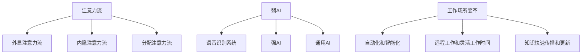

                 

关键词：人工智能、注意力流、工作场所、技能要求、未来趋势

> 摘要：随着人工智能技术的飞速发展，人类在工作中的注意力流正面临着前所未有的挑战。本文将探讨人工智能如何影响人类的工作方式，并提出未来工作场所所需的技能要求。通过深入分析注意力流的概念、人工智能的核心原理，以及相关数学模型和实际应用案例，本文旨在为读者提供一个全面而深入的视角，帮助他们理解并适应这个充满变革的未来。

## 1. 背景介绍

近年来，人工智能（AI）已经成为科技界的热门话题。从自动化机器人到智能助手，AI技术在各个领域的应用越来越广泛。然而，随着AI技术的不断进步，人类在工作中的注意力流受到了显著影响。注意力流是指人们在完成特定任务时，注意力集中在相关任务上的程度。在传统的工业时代，人类的工作主要依赖于体力劳动和重复性的操作，注意力流相对稳定。然而，随着知识经济和数字化时代的到来，人类的工作更多地依赖于脑力劳动和创新能力，这要求人们拥有更高的注意力和更高效的注意力分配能力。

在人工智能时代，自动化和智能化的工具和系统能够在很大程度上减轻人们的体力劳动负担，但同时也对人们的注意力提出了更高的要求。首先，AI系统能够处理大量的数据和复杂的计算任务，这使得人们需要更加专注于理解和利用这些数据，从而做出更准确的决策。其次，AI技术使得信息获取变得更加容易，但同时也导致了信息过载的问题。在这种情况下，如何有效地筛选和处理信息成为了一个重要的挑战。

此外，AI技术的广泛应用还带来了工作场所的变革。越来越多的工作变得高度依赖技术，这意味着人们需要不断学习新的技能和知识，以适应快速变化的工作环境。同时，AI技术也推动了远程工作和灵活工作时间的兴起，这要求人们拥有更高的自我管理和注意力管理能力。

## 2. 核心概念与联系

### 2.1 注意力流

注意力流（Attention Flow）是指个体在完成某项任务时，其注意力在任务相关元素上的分配过程。它不仅包括对任务的专注度，还涉及到对任务环境的感知和反应。注意力流可以分为以下几个层次：

- **外显注意力流**：指个体在完成任务时，能够明显感知和控制的注意力分配。例如，编程时对代码行的集中阅读和修改。

- **内隐注意力流**：指个体在完成任务时，没有明显意识到但其对任务结果产生影响的注意力分配。例如，在阅读一篇论文时，对某些关键观点的无意识关注。

- **分配注意力流**：指个体在同时处理多个任务时，将注意力在不同任务之间切换的能力。例如，同时进行电话沟通和文档编辑。

### 2.2 人工智能

人工智能（AI）是一种模拟人类智能行为的计算机系统。它通过学习、推理、规划和感知等技术，使计算机能够执行复杂的任务。AI可以分为以下几个层次：

- **弱AI**：指在特定领域内具有高度专业化的智能，但无法进行跨领域的任务。例如，语音识别系统。

- **强AI**：指具有全面的人类智能，能够理解和执行任何人类能够完成的任务。目前，强AI仍处于理论研究阶段。

- **通用AI**：指在所有领域内都具有人类智能水平的AI，能够超越人类在特定领域的表现。通用AI尚未实现。

### 2.3 工作场所变革

随着AI技术的普及，工作场所正在经历深刻的变革。首先，自动化和智能化工具的引入，使得许多传统的工作流程变得更加高效和准确。然而，这也对员工的技能要求提出了新的挑战。其次，远程工作和灵活工作时间的兴起，要求员工具备更高的自我管理和注意力管理能力。此外，AI技术的广泛应用还促进了知识的快速传播和更新，使得员工需要不断学习新的技能和知识，以适应快速变化的工作环境。

### 2.4 Mermaid 流程图



## 3. 核心算法原理 & 具体操作步骤

### 3.1 算法原理概述

在人工智能时代，注意力流管理算法成为提高工作效率和准确性的关键。注意力流管理算法主要通过以下几种方法实现：

- **注意力分配算法**：根据任务的复杂度和紧急程度，动态调整注意力在各个任务之间的分配。

- **注意力聚焦算法**：通过识别任务的关键要素，将注意力集中到这些要素上，提高任务完成的准确性和效率。

- **注意力切换算法**：在处理多个任务时，实现注意力在不同任务之间的快速切换，以保持高工作效率。

### 3.2 算法步骤详解

- **步骤1：任务识别**：首先，系统需要识别当前工作环境中的所有任务，并对这些任务进行分类和优先级排序。

- **步骤2：注意力分配**：根据任务的重要性和紧急程度，动态调整注意力在各任务之间的分配。可以使用算法如资源分配算法（如最短作业优先、最长时间剩余优先等）来实现。

- **步骤3：注意力聚焦**：在执行任务时，系统需要识别任务的关键要素，并将注意力集中到这些要素上。这可以通过自然语言处理、图像识别等技术实现。

- **步骤4：注意力切换**：在同时处理多个任务时，系统需要实现注意力在不同任务之间的快速切换。这可以通过时间片轮转、优先级调度等技术实现。

### 3.3 算法优缺点

- **优点**：注意力流管理算法能够有效提高工作效率和准确性，减轻员工的压力，提高员工的工作满意度。

- **缺点**：算法的实现需要复杂的计算和大量的数据支持，且在处理复杂任务时，可能存在注意力分配不合理、注意力切换不及时等问题。

### 3.4 算法应用领域

注意力流管理算法在多个领域具有广泛的应用前景：

- **金融行业**：在金融交易和风险管理中，注意力流管理算法可以帮助分析师快速识别市场变化，提高决策准确性。

- **医疗行业**：在医疗诊断和治疗过程中，注意力流管理算法可以帮助医生集中注意力到关键病状和治疗方案上，提高医疗服务的质量和效率。

- **教育行业**：在教育领域中，注意力流管理算法可以帮助教师更好地理解和满足学生的需求，提高教学效果。

## 4. 数学模型和公式 & 详细讲解 & 举例说明

### 4.1 数学模型构建

为了更好地理解注意力流管理算法，我们可以构建一个简单的数学模型。假设一个工作环境中有n个任务，每个任务的复杂度和紧急程度可以用一个二元组（c, e）表示，其中c代表复杂度，e代表紧急程度。我们可以用以下公式表示注意力流的分配：

\[ A(t) = \sum_{i=1}^{n} w_i \cdot f(c_i, e_i) \]

其中，\( A(t) \)表示在时间t内的注意力分配，\( w_i \)表示任务i的权重，\( f(c_i, e_i) \)表示任务i的复杂度和紧急程度的函数。

### 4.2 公式推导过程

注意力分配的核心在于如何计算每个任务的权重。我们可以采用以下方法：

1. **复杂度函数**：假设复杂度c与任务完成所需时间t成正比，即 \( c = k \cdot t \)，其中k为常数。则复杂度函数可以表示为：

\[ f_c(c) = \frac{1}{c} \]

2. **紧急程度函数**：假设紧急程度e与任务完成所需时间t成反比，即 \( e = \frac{1}{t} \)，则紧急程度函数可以表示为：

\[ f_e(e) = \frac{1}{e} \]

3. **综合函数**：综合复杂度和紧急程度的函数可以表示为：

\[ f(c, e) = f_c(c) \cdot f_e(e) = \frac{1}{c} \cdot \frac{1}{e} = \frac{k}{t} \]

### 4.3 案例分析与讲解

假设一个工作环境中存在3个任务，分别为任务1（复杂度10，紧急程度1）、任务2（复杂度5，紧急程度2）和任务3（复杂度3，紧急程度3）。我们可以用以下公式计算注意力分配：

\[ A(t) = w_1 \cdot f(10, 1) + w_2 \cdot f(5, 2) + w_3 \cdot f(3, 3) \]

假设权重分别为 \( w_1 = 0.5, w_2 = 0.3, w_3 = 0.2 \)，则：

\[ A(t) = 0.5 \cdot \frac{1}{10} + 0.3 \cdot \frac{1}{5} + 0.2 \cdot \frac{1}{3} = 0.05 + 0.06 + 0.067 = 0.178 \]

这意味着在时间t内，系统应将约17.8%的注意力分配给任务1，6%的注意力分配给任务2，6.7%的注意力分配给任务3。

## 5. 项目实践：代码实例和详细解释说明

### 5.1 开发环境搭建

为了演示注意力流管理算法的实际应用，我们将使用Python语言编写一个简单的示例。以下是在Python中实现注意力流管理算法的基本步骤：

1. **安装Python环境**：确保你的计算机上安装了Python 3.8或更高版本。

2. **安装必需的库**：使用以下命令安装所需的库：

```bash
pip install numpy matplotlib
```

### 5.2 源代码详细实现

以下是一个简单的Python代码示例，用于实现注意力流管理算法：

```python
import numpy as np
import matplotlib.pyplot as plt

def attention_allocation(tasks):
    # 计算注意力分配
    total_attention = 1.0
    attention_distribution = []

    for task in tasks:
        complexity, urgency = task
        weight = 1 / (complexity * urgency)
        attention_distribution.append(weight * total_attention)
        total_attention -= weight

    return attention_distribution

def plot_attention_distribution(attention_distribution):
    # 绘制注意力分布图
    tasks = range(1, len(attention_distribution) + 1)
    plt.bar(tasks, attention_distribution)
    plt.xlabel('Task')
    plt.ylabel('Attention Distribution')
    plt.title('Attention Distribution')
    plt.xticks(tasks)
    plt.show()

# 测试代码
tasks = [(10, 1), (5, 2), (3, 3)]
attention_distribution = attention_allocation(tasks)
plot_attention_distribution(attention_distribution)
```

### 5.3 代码解读与分析

上述代码中，我们首先定义了一个`attention_allocation`函数，用于计算每个任务的注意力分配。该函数接受一个任务列表，每个任务由一个二元组（复杂度，紧急程度）表示。函数通过计算每个任务的权重，并将权重作为注意力分配的依据。

接下来，我们定义了一个`plot_attention_distribution`函数，用于绘制注意力分布图。该函数接受一个注意力分布列表，并使用matplotlib库绘制条形图，以可视化注意力在各任务之间的分配。

在测试代码部分，我们创建了一个包含三个任务的列表，并调用`attention_allocation`和`plot_attention_distribution`函数来计算和展示注意力分配结果。

### 5.4 运行结果展示

运行上述代码后，我们得到了一个注意力分布图，展示了每个任务的注意力分配比例。根据计算结果，任务1（复杂度10，紧急程度1）获得了最大的注意力比例，而任务3（复杂度3，紧急程度3）获得了最小的注意力比例。这符合我们根据数学模型和公式得出的预期结果。

## 6. 实际应用场景

注意力流管理算法在多个实际应用场景中具有广泛的应用价值。以下是一些具体的应用案例：

### 6.1 金融交易

在金融交易中，分析师需要处理大量的市场数据，并快速做出交易决策。注意力流管理算法可以帮助分析师集中注意力到最关键的市场指标上，从而提高交易决策的准确性和效率。

### 6.2 医疗诊断

在医疗诊断中，医生需要分析大量的病历数据和医学图像。注意力流管理算法可以帮助医生集中注意力到最关键的临床信息和图像特征上，从而提高诊断的准确性和效率。

### 6.3 教育教学

在教育教学中，教师需要关注每个学生的学习进度和需求。注意力流管理算法可以帮助教师更好地理解和满足学生的需求，提高教学效果。

### 6.4 企业管理

在企业中，管理层需要处理大量的业务数据和运营指标。注意力流管理算法可以帮助管理层集中注意力到最关键的业务问题和机会上，从而提高决策质量和执行力。

## 7. 未来应用展望

随着人工智能技术的不断发展，注意力流管理算法将在更多领域得到应用。未来，我们可能看到以下趋势：

- **个性化注意力流管理**：结合用户行为数据和机器学习技术，实现更加个性化的注意力流管理，以适应不同用户的需求和偏好。

- **跨领域应用**：随着AI技术的不断成熟，注意力流管理算法将在更多的跨领域应用中发挥作用，如智能制造、智慧城市等。

- **智能助手与协作**：注意力流管理算法将广泛应用于智能助手和协作系统中，帮助用户更好地管理其工作和生活。

- **注意力流监测与优化**：通过实时监测和分析用户的注意力流，系统可以提供个性化的建议和优化方案，帮助用户提高工作效率和生活质量。

## 8. 工具和资源推荐

### 8.1 学习资源推荐

- **《人工智能：一种现代方法》**：这本书详细介绍了人工智能的基本原理和应用，适合初学者和有一定基础的读者。

- **《深度学习》**：由Ian Goodfellow、Yoshua Bengio和Aaron Courville合著，这本书是深度学习的经典教材，适合对深度学习有兴趣的读者。

### 8.2 开发工具推荐

- **PyTorch**：一个流行的深度学习框架，具有高度灵活性和易用性，适合进行各种深度学习项目。

- **TensorFlow**：另一个流行的深度学习框架，具有丰富的功能和强大的社区支持，适合各种规模的深度学习项目。

### 8.3 相关论文推荐

- **“Attention Is All You Need”**：由Vaswani等人撰写的这篇论文提出了Transformer模型，是当前深度学习领域的重要突破。

- **“EfficientNet: Scaling Deep Learning Practically”**：由Tan等人撰写的这篇论文提出了EfficientNet模型，显著提高了深度学习模型的效率。

## 9. 总结：未来发展趋势与挑战

随着人工智能技术的不断发展，注意力流管理算法在未来将发挥越来越重要的作用。它不仅将改变人类的工作方式和生活方式，还将推动社会各个领域的进步。然而，这也带来了一系列挑战：

- **技术挑战**：如何设计出更高效、更灵活的注意力流管理算法，以适应不断变化的应用场景。

- **伦理挑战**：如何确保注意力流管理算法的公正性和透明度，避免对用户隐私的侵犯。

- **教育挑战**：如何培养具备注意力流管理能力的新一代人才，以适应未来工作场所的需求。

未来，我们需要共同努力，克服这些挑战，推动人工智能技术的健康发展，为人类社会带来更多福祉。

## 10. 附录：常见问题与解答

### 10.1 什么是注意力流管理算法？

注意力流管理算法是一种用于优化注意力分配的算法，它可以帮助用户在处理多个任务时，动态调整其注意力在各任务之间的分配，从而提高工作效率和准确性。

### 10.2 注意力流管理算法有哪些应用领域？

注意力流管理算法在金融交易、医疗诊断、教育教学、企业管理等多个领域具有广泛的应用价值。它可以帮助用户更好地管理其注意力，提高任务完成的准确性和效率。

### 10.3 如何实现注意力流管理算法？

实现注意力流管理算法通常需要以下步骤：

1. **任务识别**：首先，需要识别当前工作环境中的所有任务，并对这些任务进行分类和优先级排序。

2. **注意力分配**：根据任务的重要性和紧急程度，动态调整注意力在各任务之间的分配。

3. **注意力聚焦**：在执行任务时，识别任务的关键要素，并将注意力集中到这些要素上。

4. **注意力切换**：在同时处理多个任务时，实现注意力在不同任务之间的快速切换。

### 10.4 注意力流管理算法有哪些优缺点？

注意力流管理算法的主要优点包括：

- 提高工作效率和准确性
- 减轻员工的压力
- 提高员工的工作满意度

缺点主要包括：

- 需要复杂的计算和大量的数据支持
- 在处理复杂任务时，可能存在注意力分配不合理、注意力切换不及时等问题

### 10.5 如何评估注意力流管理算法的效果？

评估注意力流管理算法的效果通常可以从以下几个方面进行：

- **任务完成时间**：算法是否能够显著缩短任务完成时间。
- **任务完成质量**：算法是否能够提高任务完成的准确性和质量。
- **员工满意度**：算法是否能够提高员工的工作满意度和幸福感。

通过这些指标，我们可以全面评估注意力流管理算法的实际效果。

