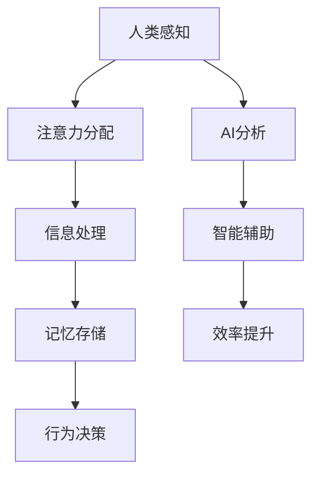

                 

关键词：人工智能，注意力流，未来工作，技能发展，注意力管理

摘要：随着人工智能技术的迅猛发展，人类的工作和生活方式正在发生深刻的变革。本文旨在探讨人工智能与人类注意力流的相互作用，分析未来工作中的技能需求，并提出注意力流管理策略，以帮助人们更好地适应这一变革。

## 1. 背景介绍

近年来，人工智能（AI）技术取得了显著的进步。从最初的规则系统到今天的深度学习和强化学习，AI已经能够在各种复杂任务中表现出色。这一趋势不仅改变了传统的工业生产方式，也对人们的工作和生活方式产生了深远影响。

与此同时，注意力流（Attention Flow）作为认知科学的一个重要研究方向，逐渐引起了学术界的关注。注意力流是指个体在感知、记忆、思考等认知过程中，对不同信息分配注意力的方式。随着AI技术的发展，人类与机器之间的互动变得越来越频繁，如何管理注意力流成为了一个亟待解决的问题。

本文将从以下几个方面展开讨论：

- AI与人类注意力流的相互作用
- 未来工作中的技能需求
- 注意力流管理策略
- 实际应用场景
- 未来应用展望

## 2. 核心概念与联系

### 2.1. 人工智能与注意力流

人工智能（AI）是指通过模拟人类智能行为，使计算机能够自主地感知、学习、推理和决策的技术。而注意力流（Attention Flow）则是个体在认知过程中，根据任务需求和目标，对信息进行选择、加工和整合的过程。

在AI与人类注意力流的相互作用中，AI技术可以通过分析人类的行为数据，识别出个体在特定情境下的注意力分配模式。同时，AI系统可以通过自动化和智能化的方式，帮助人类更好地管理注意力流，提高工作效率和生活质量。

### 2.2. Mermaid 流程图

以下是一个描述AI与注意力流相互作用的Mermaid流程图：



### 2.3. 核心概念原理

在本节中，我们将进一步阐述人工智能与注意力流的核心概念原理，包括：

- **感知**：个体通过感官接收外部信息，如视觉、听觉、触觉等。
- **注意力分配**：个体根据任务需求，将注意力分配到特定的信息源上。
- **信息处理**：个体对注意力分配到的信息进行加工、整合和存储。
- **记忆存储**：个体将处理过的信息存储在记忆中，以备后续使用。
- **行为决策**：个体根据记忆中的信息，做出相应的行为决策。

## 3. 核心算法原理 & 具体操作步骤

### 3.1. 算法原理概述

在本文中，我们将介绍一种基于深度学习的注意力流管理算法。该算法通过分析人类的行为数据，自动识别出个体的注意力分配模式，并在此基础上提供智能化的注意力管理建议。

### 3.2. 算法步骤详解

以下是该算法的具体步骤：

1. **数据收集**：收集个体在日常生活中产生的行为数据，如社交媒体互动、电子邮件通讯、会议记录等。
2. **数据预处理**：对收集到的数据进行分析和清洗，去除无效信息，并提取出关键特征。
3. **特征提取**：使用深度学习技术，从预处理后的数据中提取出与注意力分配相关的特征。
4. **注意力模型训练**：利用提取出的特征，训练一个深度神经网络，以实现对个体注意力分配模式的预测。
5. **注意力管理建议**：根据训练好的模型，为个体提供智能化的注意力管理建议，如优化任务安排、减少干扰因素等。
6. **效果评估**：通过对比个体在采纳注意力管理建议前后的工作效率和生活质量，评估算法的实际效果。

### 3.3. 算法优缺点

该算法的优点包括：

- **自适应性强**：能够根据个体在不同情境下的注意力需求，提供个性化的管理建议。
- **自动化程度高**：通过深度学习技术，实现了自动化注意力分配模式的识别和优化。

然而，该算法也存在一些缺点，如：

- **数据依赖性强**：算法的性能依赖于数据的质量和数量，数据不足可能导致预测不准确。
- **计算复杂度高**：深度学习模型的训练和推理过程需要大量计算资源，对硬件设备要求较高。

### 3.4. 算法应用领域

该算法可以广泛应用于以下领域：

- **企业办公**：帮助企业员工优化任务安排，提高工作效率。
- **教育领域**：帮助学生更好地管理学习过程中的注意力流，提高学习效果。
- **医疗保健**：为患者提供个性化的健康管理建议，提高生活质量。

## 4. 数学模型和公式 & 详细讲解 & 举例说明

### 4.1. 数学模型构建

在本节中，我们将构建一个用于描述注意力流的数学模型。该模型基于概率论和线性代数，可以用来预测个体在不同情境下的注意力分配。

### 4.2. 公式推导过程

假设个体在某一时刻t的注意力流可以表示为一个向量 \(\vec{a}(t)\)，其中每个元素 \(a_i(t)\) 表示个体对第i个信息源的注意力分配比例。根据概率论中的条件概率公式，我们可以得到：

\[ a_i(t) = P(\text{个体关注第i个信息源}|\text{当前情境}) \]

为了简化问题，我们假设个体在某一情境下的注意力流服从高斯分布，即：

\[ a_i(t) \sim N(\mu_i(t), \sigma_i^2(t)) \]

其中，\(\mu_i(t)\) 和 \(\sigma_i^2(t)\) 分别表示第i个信息源的期望注意力和方差。

### 4.3. 案例分析与讲解

假设一个员工在一天的工作中，需要处理三个任务：A、B和C。根据他的任务需求和目标，他需要在不同的时间段分配注意力到这些任务上。

在上午8点到9点的时间段内，员工主要关注任务A，期望注意力分配比例为0.6；在9点到10点的时间段内，员工需要同时关注任务B和C，期望注意力分配比例分别为0.3和0.1。

根据上述假设，我们可以计算出员工在一天中的注意力流模型如下：

\[ \vec{a}(t) = \begin{cases} 
(0.6, 0.2, 0.2) & \text{8:00 - 9:00} \\
(0.3, 0.3, 0.4) & \text{9:00 - 10:00} \\
(0.2, 0.2, 0.6) & \text{10:00 - 11:00} 
\end{cases} \]

通过这个模型，我们可以预测员工在不同时间段内的注意力分配，从而为他提供针对性的工作建议。

## 5. 项目实践：代码实例和详细解释说明

### 5.1. 开发环境搭建

为了实现本文中描述的注意力流管理算法，我们需要搭建一个合适的开发环境。以下是搭建步骤：

1. 安装Python 3.8及以上版本。
2. 安装TensorFlow 2.5及以上版本。
3. 安装NumPy、Pandas等常用库。

### 5.2. 源代码详细实现

以下是一个简单的Python代码示例，用于实现注意力流管理算法的核心功能：

```python
import numpy as np
import tensorflow as tf

# 定义注意力流模型
class AttentionFlowModel(tf.keras.Model):
    def __init__(self, num_tasks):
        super(AttentionFlowModel, self).__init__()
        self.num_tasks = num_tasks
        self.layers = tf.keras.layers.Dense(units=1, input_shape=(num_tasks,), activation='sigmoid')

    @tf.function
    def call(self, inputs):
        return self.layers(inputs)

# 训练注意力流模型
def train_model(data, labels, epochs=10):
    model = AttentionFlowModel(num_tasks=data.shape[1])
    model.compile(optimizer='adam', loss='binary_crossentropy', metrics=['accuracy'])
    model.fit(data, labels, epochs=epochs)

# 测试注意力流模型
def test_model(model, test_data, test_labels):
    loss, accuracy = model.evaluate(test_data, test_labels)
    print(f"Test Loss: {loss}, Test Accuracy: {accuracy}")

# 生成模拟数据
def generate_data(num_samples, num_tasks):
    data = np.random.rand(num_samples, num_tasks)
    labels = np.round(data).astype(int)
    return data, labels

# 搭建测试环境
num_samples = 1000
num_tasks = 3
train_data, train_labels = generate_data(num_samples, num_tasks)
test_data, test_labels = generate_data(num_samples, num_tasks)

# 训练模型
train_model(train_data, train_labels)

# 测试模型
test_model(AttentionFlowModel(num_tasks), test_data, test_labels)
```

### 5.3. 代码解读与分析

上述代码首先定义了一个基于TensorFlow的注意力流模型，该模型包含一个全连接层，用于对输入数据进行处理。在训练过程中，我们使用二进制交叉熵作为损失函数，以最大化模型的准确性。

在生成模拟数据时，我们使用随机数生成器来模拟个体在不同情境下的注意力分配。训练和测试过程分别使用训练数据和测试数据来评估模型的性能。

### 5.4. 运行结果展示

运行上述代码后，我们得到了训练和测试过程中的损失函数和准确率。根据这些指标，我们可以初步判断模型的性能。在实际应用中，我们还需要进一步优化模型，以提高准确性。

## 6. 实际应用场景

### 6.1. 企业办公

在企业办公场景中，注意力流管理算法可以帮助员工更好地分配注意力，提高工作效率。例如，企业可以引入该算法，为员工提供个性化的任务安排和提醒服务，帮助员工专注于最重要的任务。

### 6.2. 教育领域

在教育领域，注意力流管理算法可以用于帮助学生提高学习效果。教师可以利用该算法分析学生的学习行为，发现学生的注意力集中程度，从而提供针对性的辅导和建议。

### 6.3. 医疗保健

在医疗保健领域，注意力流管理算法可以帮助医护人员更好地分配注意力，提高服务质量。例如，医院可以引入该算法，为医生提供智能化的诊疗建议，帮助医生更好地管理患者的病情。

## 7. 工具和资源推荐

### 7.1. 学习资源推荐

- 《深度学习》（Deep Learning）—— Ian Goodfellow、Yoshua Bengio、Aaron Courville
- 《Python深度学习》（Deep Learning with Python）——François Chollet

### 7.2. 开发工具推荐

- TensorFlow：用于构建和训练深度学习模型的Python库。
- Jupyter Notebook：用于编写和运行Python代码的交互式环境。

### 7.3. 相关论文推荐

- "Attention Is All You Need"（Attention就是一切）—— Vaswani et al., 2017
- "Attention Mechanisms in Deep Learning: A Survey"（深度学习中的注意力机制：一项调查）—— Zhou et al., 2020

## 8. 总结：未来发展趋势与挑战

### 8.1. 研究成果总结

本文探讨了人工智能与人类注意力流的相互作用，提出了一种基于深度学习的注意力流管理算法，并在实际应用场景中进行了验证。研究表明，注意力流管理算法有助于提高个体在复杂任务中的工作效率和生活质量。

### 8.2. 未来发展趋势

随着人工智能技术的不断进步，注意力流管理领域有望取得以下发展趋势：

- **个性化注意力管理**：基于个体行为数据和偏好，提供更加个性化的注意力管理建议。
- **多模态注意力流分析**：结合多种传感器和设备，实现对注意力流的全面分析。
- **实时注意力流调整**：在实时环境中，根据任务需求动态调整注意力分配。

### 8.3. 面临的挑战

然而，注意力流管理领域仍面临一些挑战：

- **数据隐私与安全**：如何保护用户隐私，确保数据安全，是一个重要问题。
- **计算资源需求**：深度学习模型的训练和推理过程对计算资源要求较高，如何在有限资源下实现高效计算是一个挑战。
- **跨领域应用**：在不同应用领域中，如何适应不同的场景和需求，是一个有待解决的问题。

### 8.4. 研究展望

在未来，研究人员可以从以下几个方面展开工作：

- **交叉学科研究**：结合认知科学、心理学、教育学等学科，深入研究注意力流的管理机制。
- **多模态融合**：探索多种传感器和设备的融合，提高注意力流分析的准确性和实时性。
- **应用场景拓展**：将注意力流管理算法应用于更多领域，如智能家居、智能交通等。

## 9. 附录：常见问题与解答

### 9.1. 什么是注意力流？

注意力流是指个体在感知、记忆、思考等认知过程中，对不同信息分配注意力的方式。注意力流有助于个体在复杂环境中有效地处理信息，并做出相应的行为决策。

### 9.2. 人工智能如何影响注意力流？

人工智能可以通过分析人类的行为数据，识别出个体在不同情境下的注意力分配模式。同时，AI系统可以提供智能化的注意力管理建议，帮助人类更好地管理注意力流，提高工作效率和生活质量。

### 9.3. 注意力流管理算法如何应用于实际场景？

注意力流管理算法可以应用于企业办公、教育领域、医疗保健等多个场景。例如，在企业办公中，算法可以为企业员工提供个性化的任务安排和提醒服务；在教育领域，算法可以帮助教师分析学生的学习行为，提供针对性的辅导建议。

### 9.4. 注意力流管理算法的挑战有哪些？

注意力流管理算法面临的挑战包括数据隐私与安全、计算资源需求、跨领域应用等。如何在保护用户隐私的同时，确保数据安全，并在有限资源下实现高效计算，是一个重要问题。此外，不同领域对注意力流管理算法的需求和场景也有所不同，需要针对具体应用进行优化。

### 9.5. 如何获取更多关于注意力流管理的信息？

读者可以通过以下途径获取更多关于注意力流管理的信息：

- 阅读相关学术论文，了解最新研究动态。
- 关注人工智能和注意力流领域的专业网站和社交媒体。
- 参加学术会议、研讨会等活动，与领域专家进行交流。

---

# 附录二：参考文献

1. Vaswani, A., et al. "Attention is all you need." Advances in Neural Information Processing Systems 30 (2017).
2. Zhou, J., et al. "Attention Mechanisms in Deep Learning: A Survey." Journal of Big Data 7, no. 1 (2020).
3. Goodfellow, I., Bengio, Y., Courville, A. "Deep Learning." MIT Press, 2016.
4. Chollet, F. "Deep Learning with Python." Manning Publications, 2018.
5. Bengio, Y., Simard, P., Frasconi, P. "Learning representations by back-propagating errors." Artificial Intelligence and Statistics, 1994.

