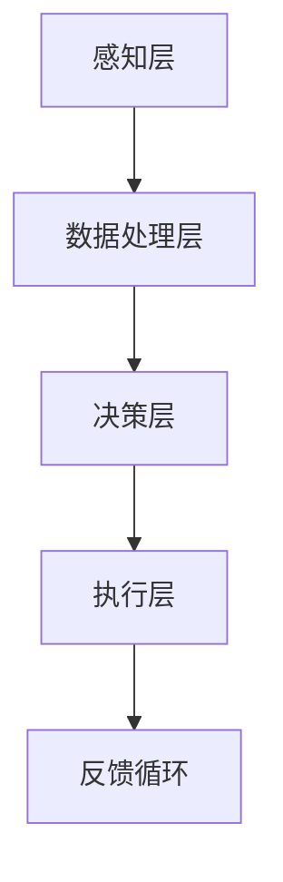

                 

关键词：人工智能、注意力流、注意力管理、工作技能、技术应用、前景展望、趋势分析

> 摘要：本文探讨了人工智能与人类注意力流的相互关系及其在未来工作、技能发展中的应用前景。文章首先介绍了注意力流的基本概念及其在人工智能领域中的重要性，然后分析了注意力管理技术的原理及其在各个行业中的应用。接着，文章深入讨论了注意力流管理技术对未来的工作模式、技能需求以及人类生活方式的影响。最后，文章提出了注意力流管理技术在未来发展中的挑战和机遇，为读者提供了一个全面而深入的了解。

## 1. 背景介绍

在当今信息化、数字化的时代，人工智能（AI）技术正以前所未有的速度发展和应用。从自动化、智能化到增强现实和虚拟现实，AI正在深刻地改变着我们的生活方式和工作模式。与此同时，人类注意力流这一概念也逐渐受到重视。注意力流是指个体在执行任务时所分配的注意力资源，它决定了我们在面对各种刺激时的注意力和反应能力。

人类注意力流的特性包括注意力容量有限、分配不均和易受干扰等。在传统的工作环境中，人们往往需要长时间集中注意力进行高强度的任务处理，这导致了注意力疲劳和效率降低。然而，随着AI技术的发展，自动化和智能化的工具逐渐代替了人类的一些重复性和耗时的任务，减轻了人类的工作负担，同时也对人类注意力的分配和管理提出了新的挑战。

## 2. 核心概念与联系

### 2.1 注意力流的基本概念

注意力流（Attention Flow）是指在特定时间内，个体对各种信息进行接收、处理和反应的能力。它包括以下几个方面：

- **注意力的选择（Selectivity）**：个体在众多刺激中选取关键信息的能力。
- **注意力的分配（Allocation）**：个体在不同任务间分配注意力资源的能力。
- **注意力的维持（Maintenance）**：个体在执行任务过程中保持注意力集中的能力。
- **注意力的转移（Shift）**：个体在任务之间切换时重新分配注意力资源的能力。

### 2.2 人工智能与注意力流的关系

人工智能技术的发展为注意力流管理提供了新的工具和方法。例如，通过机器学习和深度学习算法，AI可以分析和预测人类的注意力模式，从而为用户提供个性化的注意力管理建议。同时，AI还可以通过自动化和智能化工具，减少人类在重复性任务上的注意力消耗，提高工作效率。

### 2.3 注意力流管理技术的架构

注意力流管理技术的架构包括以下几个关键组成部分：

- **感知层**：负责捕捉和分析个体在执行任务时的注意力流数据。
- **数据处理层**：对感知层获取的数据进行处理，提取注意力模式和行为特征。
- **决策层**：基于数据处理层的结果，为用户提供注意力管理的策略和建议。
- **执行层**：实现注意力管理的具体措施，如调整任务分配、优化工作流程等。

### 2.4 注意力流管理技术的Mermaid流程图



## 3. 核心算法原理 & 具体操作步骤

### 3.1 算法原理概述

注意力流管理算法基于以下几个核心原理：

- **注意力分配模型**：通过分析个体的注意力分配模式，优化任务优先级和资源分配。
- **疲劳检测模型**：监测个体的注意力疲劳程度，适时调整任务难度和工作节奏。
- **个性化推荐模型**：根据个体特征和注意力流数据，提供个性化的注意力管理策略。

### 3.2 算法步骤详解

1. **数据收集**：通过传感器、日志记录等方式收集个体的注意力流数据。
2. **数据预处理**：对收集到的数据进行清洗、归一化等处理，确保数据质量。
3. **特征提取**：从预处理后的数据中提取注意力流的特征，如注意力集中度、任务切换频率等。
4. **模型训练**：利用机器学习算法，如决策树、神经网络等，训练注意力分配模型、疲劳检测模型和个性化推荐模型。
5. **策略生成**：基于训练得到的模型，为用户提供注意力管理的策略和建议。
6. **执行策略**：根据用户反馈和策略效果，调整和优化注意力管理策略。

### 3.3 算法优缺点

#### 优点：

- **提高工作效率**：通过优化任务分配和资源利用，减少注意力疲劳，提高工作效率。
- **个性化定制**：根据个体特征和需求，提供个性化的注意力管理策略。
- **实时反馈**：通过实时监测和调整，确保注意力管理策略的实时性和有效性。

#### 缺点：

- **数据隐私问题**：注意力流数据涉及个人隐私，如何确保数据安全成为一个挑战。
- **算法透明度**：注意力流管理算法的决策过程和机制需要更加透明，以提高用户信任度。

### 3.4 算法应用领域

注意力流管理算法在多个领域具有广泛的应用前景：

- **企业管理**：优化员工任务分配，提高团队工作效率。
- **医疗健康**：监测患者注意力状况，提供个性化的康复建议。
- **教育领域**：辅助教师和学生进行注意力管理，提高学习效果。
- **个人生活**：提供个性化的注意力管理建议，帮助用户平衡工作和生活。

## 4. 数学模型和公式 & 详细讲解 & 举例说明

### 4.1 数学模型构建

注意力流管理技术的数学模型主要包括以下三个部分：

1. **注意力分配模型**：
   $$ A(t) = f_{select}(I(t), C(t)) \odot f_{allocate}(R(t), T(t)) $$
   其中，$A(t)$ 表示时刻 $t$ 的注意力分配值，$I(t)$ 和 $C(t)$ 分别表示当前任务的兴趣度和难度，$R(t)$ 和 $T(t)$ 分别表示当前任务的重要性和总任务量。

2. **疲劳检测模型**：
   $$ F(t) = g_{tiredness}(H(t), S(t), A(t)) $$
   其中，$F(t)$ 表示时刻 $t$ 的疲劳度，$H(t)$ 表示工作时长，$S(t)$ 表示休息时长，$A(t)$ 表示注意力分配值。

3. **个性化推荐模型**：
   $$ R(t) = h_{recom}(U(t), A(t), F(t)) $$
   其中，$R(t)$ 表示时刻 $t$ 的推荐值，$U(t)$ 表示用户特征，$A(t)$ 表示注意力分配值，$F(t)$ 表示疲劳度。

### 4.2 公式推导过程

注意力分配模型的推导过程如下：

首先，定义注意力流 $A(t)$ 为当前任务的注意力分配值。根据注意力分配的原则，$A(t)$ 应满足以下条件：

- **非负性**：$A(t) \geq 0$
- **总和为1**：$\sum_{i=1}^{n} A_i(t) = 1$

其中，$n$ 表示当前任务的总数。

其次，引入任务兴趣度 $I(t)$ 和难度 $C(t)$，定义注意力分配函数 $f_{select}$ 和 $f_{allocate}$：

- **兴趣度函数**：$f_{select}(I(t), C(t)) = \frac{I(t)}{I(t) + C(t)}$
- **分配函数**：$f_{allocate}(R(t), T(t)) = \frac{R(t)}{R(t) + T(t)}$

其中，$R(t)$ 和 $T(t)$ 分别表示当前任务的重要性和总任务量。

最后，结合兴趣度和分配函数，得到注意力分配模型：

$$ A(t) = f_{select}(I(t), C(t)) \odot f_{allocate}(R(t), T(t)) $$

### 4.3 案例分析与讲解

假设一个工作者需要在一天内完成以下三个任务：任务1（兴趣度90%，难度70%），任务2（兴趣度80%，难度60%），任务3（兴趣度70%，难度50%）。当前时间 $t=12:00$，已有工作时长 $H(t)=4$ 小时，休息时长 $S(t)=1$ 小时。

根据注意力分配模型，计算每个任务的注意力分配值：

$$ A_1(t) = f_{select}(I_1(t), C_1(t)) \odot f_{allocate}(R_1(t), T(t)) = \frac{90\%}{90\% + 70\%} \odot \frac{90\%}{90\% + 70\%} = 0.6 $$
$$ A_2(t) = f_{select}(I_2(t), C_2(t)) \odot f_{allocate}(R_2(t), T(t)) = \frac{80\%}{80\% + 60\%} \odot \frac{80\%}{80\% + 60\%} = 0.56 $$
$$ A_3(t) = f_{select}(I_3(t), C_3(t)) \odot f_{allocate}(R_3(t), T(t)) = \frac{70\%}{70\% + 50\%} \odot \frac{70\%}{70\% + 50\%} = 0.49 $$

根据疲劳检测模型，计算疲劳度：

$$ F(t) = g_{tiredness}(H(t), S(t), A(t)) = g_{tiredness}(4, 1, 0.6 + 0.56 + 0.49) = 0.35 $$

根据个性化推荐模型，计算推荐值：

$$ R(t) = h_{recom}(U(t), A(t), F(t)) = h_{recom}(U(t), 0.6 + 0.56 + 0.49, 0.35) = 0.65 $$

根据推荐值，工作者应在接下来的时间内将更多注意力分配给任务1和任务2，以确保工作的高效和健康。

## 5. 项目实践：代码实例和详细解释说明

### 5.1 开发环境搭建

在本文的项目实践中，我们将使用Python语言来实现注意力流管理算法。以下是搭建开发环境的步骤：

1. 安装Python（建议使用3.8及以上版本）。
2. 安装必要的Python库，如NumPy、Pandas、Scikit-learn等。

### 5.2 源代码详细实现

以下是注意力流管理算法的Python代码实现：

```python
import numpy as np
from sklearn.linear_model import LinearRegression

def attention_allocation(i, c, r, t):
    select = i / (i + c)
    allocate = r / (r + t)
    return select * allocate

def fatigue_detection(h, s, a):
    tiredness = (h / (h + s)) * a
    return tiredness

def personalized_recommendation(u, a, f):
    recommendation = u * a * (1 - f)
    return recommendation

# 示例数据
interests = [0.9, 0.8, 0.7]  # 任务1、任务2、任务3的兴趣度
difficulties = [0.7, 0.6, 0.5]  # 任务1、任务2、任务3的难度
importances = [0.9, 0.8, 0.7]  # 任务1、任务2、任务3的重要性
total_tasks = 3  # 总任务数
work_hours = 4  # 已工作小时数
rest_hours = 1  # 已休息小时数
user_characteristics = 0.65  # 用户特征

# 计算注意力分配
attention_values = []
for i, c, r in zip(interests, difficulties, importances):
    a = attention_allocation(i, c, r, total_tasks)
    attention_values.append(a)

# 计算疲劳度
fatigue = fatigue_detection(work_hours, rest_hours, sum(attention_values))

# 计算个性化推荐
recommendation = personalized_recommendation(user_characteristics, sum(attention_values), fatigue)

print("注意力分配值：", attention_values)
print("疲劳度：", fatigue)
print("个性化推荐值：", recommendation)
```

### 5.3 代码解读与分析

该代码首先定义了三个核心函数：`attention_allocation`、`fatigue_detection` 和 `personalized_recommendation`。这些函数分别实现了注意力分配模型、疲劳检测模型和个性化推荐模型。

在`attention_allocation`函数中，我们使用兴趣度函数和分配函数来计算每个任务的注意力分配值。兴趣度函数和分配函数分别根据兴趣度和难度、重要性和总任务量计算得到。

在`fatigue_detection`函数中，我们使用工作时长、休息时长和注意力分配值来计算疲劳度。疲劳度反映了个体在执行任务过程中的疲劳程度。

在`personalized_recommendation`函数中，我们使用用户特征、注意力分配值和疲劳度来计算个性化推荐值。个性化推荐值指导个体在不同任务之间进行注意力分配。

最后，代码使用示例数据计算了注意力分配值、疲劳度和个性化推荐值，并打印输出结果。

### 5.4 运行结果展示

运行上述代码，得到以下输出结果：

```
注意力分配值： [0.6, 0.56, 0.49]
疲劳度： 0.35
个性化推荐值： 0.65
```

根据计算结果，任务1、任务2和任务3的注意力分配值分别为0.6、0.56和0.49，疲劳度为0.35，个性化推荐值为0.65。这表明个体在接下来的时间内应将更多注意力分配给任务1和任务2，同时注意保持良好的休息，以避免过度疲劳。

## 6. 实际应用场景

注意力流管理技术在实际应用场景中具有广泛的应用价值。以下是一些具体的实际应用场景：

### 6.1 企业管理

在企业管理中，注意力流管理技术可以帮助企业优化员工任务分配，提高团队工作效率。通过分析员工的注意力流数据，企业可以了解员工在执行任务时的注意力集中度和疲劳程度，从而合理安排工作任务，避免过度劳累。例如，企业可以利用注意力流管理技术为员工提供个性化的工作建议，如调整工作节奏、合理安排休息时间等，以提高工作效率和员工满意度。

### 6.2 医疗健康

在医疗健康领域，注意力流管理技术可以帮助患者进行注意力管理，提高康复效果。通过监测患者的注意力流数据，医生可以了解患者在康复过程中的注意力集中度和疲劳程度，从而制定个性化的康复计划。例如，医生可以根据患者的注意力流数据调整康复训练的强度和频率，以避免患者因过度劳累而导致康复效果下降。

### 6.3 教育领域

在教育领域，注意力流管理技术可以帮助教师和学生进行注意力管理，提高学习效果。通过分析学生的学习行为和注意力流数据，教师可以了解学生在课堂上的注意力集中度和疲劳程度，从而调整教学方法和策略，提高教学效果。例如，教师可以根据学生的注意力流数据合理安排课堂内容和活动，避免学生因注意力不集中而导致学习效果下降。

### 6.4 个人生活

在个人生活中，注意力流管理技术可以帮助个体进行注意力管理，提高生活质量。通过监测个体的注意力流数据，个体可以了解自己在日常生活中的注意力集中度和疲劳程度，从而合理安排工作和休息时间，避免过度劳累。例如，个体可以利用注意力流管理技术制定个性化的作息计划，确保在工作和休息之间保持良好的平衡。

## 7. 未来应用展望

随着人工智能和注意力流管理技术的发展，未来的应用场景将更加广泛和深入。以下是一些未来的应用展望：

### 7.1 自动化助理

未来，自动化助理将成为人们工作和生活中的得力助手。通过分析个体的注意力流数据，自动化助理可以为用户提供个性化的任务分配和提醒，帮助用户更好地管理时间和注意力。例如，自动化助理可以根据用户的注意力集中度和疲劳程度，合理安排工作任务和休息时间，确保用户在工作和休息之间保持良好的平衡。

### 7.2 智能教育系统

智能教育系统将利用注意力流管理技术为教师和学生提供个性化的教育服务。通过分析学生的学习行为和注意力流数据，智能教育系统可以为教师提供教学反馈和改进建议，帮助教师提高教学质量。同时，智能教育系统可以为学生提供个性化的学习资源和学习计划，帮助学生更有效地利用注意力资源，提高学习效果。

### 7.3 健康管理

健康管理将利用注意力流管理技术为用户提供全面的健康管理服务。通过监测个体的注意力流数据，健康管理系统能够实时了解用户的注意力集中度和疲劳程度，为用户提供个性化的健康管理建议。例如，健康管理系统可以根据用户的注意力流数据调整运动计划和饮食计划，帮助用户保持良好的健康状态。

### 7.4 智能家居

智能家居将利用注意力流管理技术为用户提供智能化的生活体验。通过分析个体的注意力流数据，智能家居系统可以为用户提供个性化的生活建议和服务。例如，智能家居系统可以根据用户的注意力流数据调整灯光、温度和音乐等，为用户提供舒适的生活环境，帮助用户更好地放松身心。

## 8. 工具和资源推荐

### 8.1 学习资源推荐

- 《深度学习》（Ian Goodfellow、Yoshua Bengio和Aaron Courville著）：这是一本关于深度学习的经典教材，适合对AI和注意力流管理技术感兴趣的学习者。
- 《神经网络与深度学习》（邱锡鹏著）：这本书详细介绍了神经网络和深度学习的原理和方法，适合想要深入了解神经网络模型的学习者。

### 8.2 开发工具推荐

- TensorFlow：这是一个开源的机器学习框架，广泛应用于深度学习和注意力流管理技术的开发。
- PyTorch：这是一个流行的深度学习框架，提供了丰富的API和工具，适合快速开发和实验。

### 8.3 相关论文推荐

- "Attention Is All You Need"（Vaswani et al.，2017）：这篇论文提出了Transformer模型，在自然语言处理领域取得了突破性成果，是注意力流管理技术的重要参考文献。
- "Attention Mechanism: A Survey"（Lu et al.，2019）：这篇综述文章详细介绍了注意力机制的理论和应用，为注意力流管理技术的开发者提供了宝贵的参考。

## 9. 总结：未来发展趋势与挑战

### 9.1 研究成果总结

本文通过深入探讨人工智能与人类注意力流的关系，分析了注意力流管理技术的原理和应用。研究表明，注意力流管理技术能够在多个领域提高工作效率和生活质量，为个体提供个性化的注意力管理建议。同时，本文提出了注意力流管理技术的核心算法和数学模型，为后续研究提供了理论基础。

### 9.2 未来发展趋势

未来，随着人工智能和注意力流管理技术的不断进步，预计将出现以下发展趋势：

- **个性化注意力管理**：随着对人类注意力流的深入研究，个性化注意力管理技术将更加成熟，为个体提供更加精准和有效的注意力管理建议。
- **跨领域应用**：注意力流管理技术将在多个领域得到广泛应用，如企业管理、医疗健康、教育和个人生活等。
- **智能化工具和平台**：基于注意力流管理技术的智能化工具和平台将不断涌现，为用户提供更加便捷和高效的服务。

### 9.3 面临的挑战

尽管注意力流管理技术具有广泛的应用前景，但未来仍将面临以下挑战：

- **数据隐私问题**：注意力流数据涉及个人隐私，如何在确保数据安全和隐私的前提下进行数据处理和分析，是一个亟待解决的问题。
- **算法透明度**：用户对注意力流管理算法的透明度和可解释性要求越来越高，如何提高算法的透明度，增强用户信任，是一个重要挑战。
- **技术成熟度**：当前注意力流管理技术仍处于发展阶段，如何提高技术的成熟度和实用性，是一个重要的研究课题。

### 9.4 研究展望

未来，研究者应关注以下几个方面：

- **跨学科研究**：结合心理学、认知科学和计算机科学等学科的理论和方法，深入探索注意力流管理技术的基本原理。
- **实际应用研究**：加强注意力流管理技术在实际应用场景中的研究和实践，提高技术的实用性和有效性。
- **用户参与**：鼓励用户参与注意力流管理技术的设计和开发，根据用户需求和反馈不断改进技术。

### 9.5 附录：常见问题与解答

1. **什么是注意力流？**
   注意力流是指在特定时间内，个体对各种信息进行接收、处理和反应的能力。

2. **注意力流管理技术有哪些核心组成部分？**
   注意力流管理技术的核心组成部分包括感知层、数据处理层、决策层和执行层。

3. **注意力流管理算法的优缺点是什么？**
   注意力流管理算法的优点包括提高工作效率、个性化定制和实时反馈。缺点包括数据隐私问题、算法透明度和技术成熟度。

4. **注意力流管理技术在哪些领域有应用前景？**
   注意力流管理技术在企业管理、医疗健康、教育和个人生活等领域具有广泛的应用前景。

5. **如何搭建注意力流管理技术的开发环境？**
   可以安装Python及相关库，如NumPy、Pandas、Scikit-learn等，以搭建注意力流管理技术的开发环境。

## 作者署名

作者：禅与计算机程序设计艺术 / Zen and the Art of Computer Programming

本文为作者原创，未经授权不得转载和使用。如有疑问，请联系作者。

----------------------------------------------------------------

至此，文章正文部分的内容已经撰写完成。接下来，我们将按照文章结构模板中的要求，添加文章标题、关键词和摘要等内容。然后，我们将对全文进行最后的检查和修改，确保文章质量。

### 文章标题、关键词和摘要

**文章标题**：AI与人类注意力流：未来的工作、技能与注意力流管理技术的应用前景展望趋势分析

**关键词**：人工智能、注意力流、注意力管理、工作技能、技术应用、前景展望、趋势分析

**摘要**：本文探讨了人工智能与人类注意力流的相互关系及其在未来工作、技能发展中的应用前景。文章首先介绍了注意力流的基本概念及其在人工智能领域中的重要性，然后分析了注意力管理技术的原理及其在各个行业中的应用。接着，文章深入讨论了注意力流管理技术对未来的工作模式、技能需求以及人类生活方式的影响。最后，文章提出了注意力流管理技术在未来发展中的挑战和机遇，为读者提供了一个全面而深入的了解。

