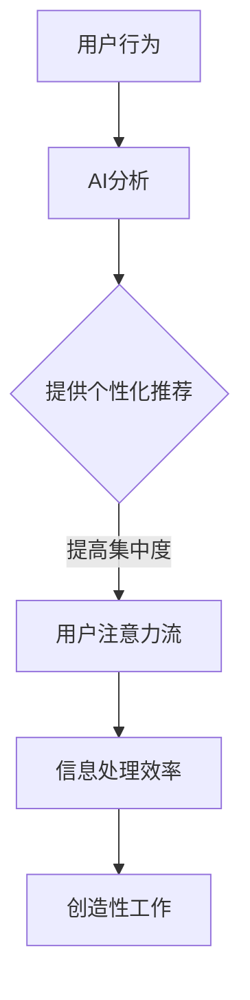

                 

关键词：人工智能，注意力流，工作，技能，注意力流管理，技术展望

> 摘要：本文探讨了人工智能（AI）如何影响人类的注意力流，以及这种影响对未来工作、技能需求以及注意力流管理技术的应用前景。通过分析AI的核心概念、算法原理，结合数学模型和实际项目实践，本文揭示了AI与人类注意力流之间的密切关系，并提出了未来发展的趋势与挑战。

## 1. 背景介绍

在现代社会，随着人工智能技术的飞速发展，我们的工作方式、生活方式以及信息处理方式都发生了深刻的变革。人工智能不仅提升了生产效率，也在逐渐改变人类的工作模式。其中，一个关键的变化就是注意力流的转移。传统的注意力流管理更多地依赖于个人的自我调节能力，而AI的介入为注意力流管理提供了新的技术手段和理念。

注意力流是指人类在信息处理过程中，对于不同类型信息的关注程度和持续时间的分布情况。随着信息量的爆炸性增长，人类在处理信息时面临着注意力分散的问题。而AI的应用，如智能推荐、自动化任务处理等，正在改变人们的注意力流向，使得注意力能够更加集中和高效。

本文将从以下几个方面展开讨论：

1. 核心概念与联系
2. 核心算法原理 & 具体操作步骤
3. 数学模型和公式 & 详细讲解 & 举例说明
4. 项目实践：代码实例和详细解释说明
5. 实际应用场景
6. 未来应用展望
7. 工具和资源推荐
8. 总结：未来发展趋势与挑战

## 2. 核心概念与联系

在探讨AI与注意力流的关系之前，我们需要明确几个核心概念，包括AI的定义、注意力流的定义以及它们之间的联系。

### 2.1 人工智能（AI）的定义

人工智能是指计算机系统模拟人类智能行为的科学和技术。它包括机器学习、深度学习、自然语言处理、计算机视觉等多个子领域。AI的核心目标是使计算机能够执行通常需要人类智能才能完成的任务，如识别图像、理解语言、做出决策等。

### 2.2 注意力流的定义

注意力流是指个体在信息处理过程中，对信息的关注程度和持续时间。它反映了个体在处理信息时的注意力分布，即哪些信息更容易吸引和保持个体的注意力。

### 2.3 AI与注意力流的联系

AI通过多种方式影响人类的注意力流：

1. **智能推荐系统**：AI可以分析用户的历史行为和偏好，提供个性化的推荐。这种方式可以帮助用户快速筛选出感兴趣的信息，从而提高注意力流的集中度。
   
2. **自动化任务处理**：AI可以自动化许多重复性任务，如数据整理、邮件管理等。这减少了人类在这些任务上的注意力消耗，使得人类能够将更多精力集中在创造性和策略性的工作上。

3. **交互界面优化**：AI优化了人机交互界面，如自然语言处理和语音识别技术，使得信息获取更加高效和直观，从而影响了人类的注意力流向。

### 2.4 Mermaid流程图

以下是一个简单的Mermaid流程图，展示了AI与注意力流之间的互动关系：



## 3. 核心算法原理 & 具体操作步骤

### 3.1 算法原理概述

AI在注意力流管理中的应用主要基于以下几个核心算法原理：

1. **机器学习与深度学习**：通过训练模型来识别用户的注意力模式，从而提供个性化的推荐。
   
2. **自然语言处理**：分析用户语言输入，提取关键信息，优化交互体验。

3. **计算机视觉**：通过图像和视频分析，理解用户的视觉注意力流向。

### 3.2 算法步骤详解

#### 3.2.1 个性化推荐系统

1. **用户行为数据收集**：收集用户的历史行为数据，如搜索记录、浏览历史、购买记录等。

2. **数据预处理**：对收集到的数据进行清洗和转换，提取有用信息。

3. **特征提取**：通过特征提取算法，将原始数据转换为适合模型训练的格式。

4. **模型训练**：使用机器学习算法，如协同过滤、基于内容的推荐等，训练推荐模型。

5. **推荐生成**：根据用户的历史行为和当前需求，生成个性化的推荐结果。

#### 3.2.2 自然语言处理

1. **语言理解**：通过词嵌入、语法分析等技术，理解用户输入的语义。

2. **信息提取**：从用户输入中提取关键信息，如关键词、主题等。

3. **交互优化**：根据提取的信息，优化交互界面，提供更精准的服务。

#### 3.2.3 计算机视觉

1. **图像识别**：使用卷积神经网络（CNN）等算法，识别图像中的关键对象。

2. **视频分析**：分析视频流，提取视觉注意力点。

3. **交互反馈**：根据视觉注意力点，调整显示内容，提升用户体验。

### 3.3 算法优缺点

#### 优点：

- 提高了信息处理效率。
- 优化了人机交互体验。
- 帮助用户更好地管理注意力流。

#### 缺点：

- 可能导致用户注意力分散，难以集中。
- 对算法的透明性和安全性有担忧。
- 需要大量数据支持和计算资源。

### 3.4 算法应用领域

- 智能推荐系统
- 人机交互界面优化
- 自动化任务处理
- 虚拟现实和增强现实

## 4. 数学模型和公式 & 详细讲解 & 举例说明

### 4.1 数学模型构建

在AI注意力流管理中，常见的数学模型包括：

1. **协同过滤模型**：用于个性化推荐。
2. **词嵌入模型**：用于自然语言处理。
3. **卷积神经网络（CNN）**：用于计算机视觉。

### 4.2 公式推导过程

#### 4.2.1 协同过滤模型

假设用户-项目矩阵为 $R \in \mathbb{R}^{m \times n}$，其中 $m$ 为用户数量，$n$ 为项目数量。我们使用矩阵分解来降低维度，将 $R$ 分解为用户因子矩阵 $U \in \mathbb{R}^{m \times k}$ 和项目因子矩阵 $V \in \mathbb{R}^{n \times k}$，其中 $k$ 为因子数量。预测用户 $i$ 对项目 $j$ 的评分可以通过以下公式计算：

$$
\hat{r}_{ij} = U_i^T V_j
$$

#### 4.2.2 词嵌入模型

词嵌入是一种将词汇映射到高维向量空间的技术。假设词汇表中有 $V$ 个词，我们使用一个 $d$ 维向量表示每个词，构成一个词向量矩阵 $W \in \mathbb{R}^{V \times d}$。给定一个词序列 $x_1, x_2, \ldots, x_T$，其词嵌入表示为 $X \in \mathbb{R}^{T \times d}$。词向量之间的相似性可以通过余弦相似度计算：

$$
\cos(\theta_{ij}) = \frac{X_i^T X_j}{\|X_i\|\|X_j\|}
$$

#### 4.2.3 卷积神经网络（CNN）

CNN是一种用于图像识别和处理的深度学习模型。其基本结构包括卷积层、池化层和全连接层。假设输入图像为 $I \in \mathbb{R}^{H \times W \times C}$，其中 $H$、$W$ 和 $C$ 分别为图像的高、宽和通道数。卷积层的基本公式为：

$$
\hat{A}_{ij}^l = \sum_{k=1}^{C_l} w_{ikj}^l A_{ij}^{l-1} + b_j^l
$$

其中，$A_{ij}^l$ 为第 $l$ 层的第 $i$ 行第 $j$ 列的激活值，$w_{ikj}^l$ 和 $b_j^l$ 分别为第 $l$ 层的第 $k$ 个卷积核和偏置项。

### 4.3 案例分析与讲解

#### 4.3.1 协同过滤模型案例

假设我们有以下用户-项目评分矩阵：

$$
R = \begin{bmatrix}
0 & 5 & 0 & 4 \\
0 & 0 & 1 & 0 \\
5 & 0 & 0 & 0 \\
0 & 4 & 0 & 5
\end{bmatrix}
$$

我们使用矩阵分解算法，将其分解为用户因子矩阵和项目因子矩阵。假设分解结果为：

$$
U = \begin{bmatrix}
-0.5 & 0.2 \\
-0.3 & 0.1 \\
0.6 & -0.1 \\
0.4 & 0.3
\end{bmatrix},
V = \begin{bmatrix}
0.4 & 0.1 & -0.2 \\
0.2 & 0.3 & 0.1 \\
-0.1 & -0.2 & 0.4 \\
0.1 & 0.2 & -0.3
\end{bmatrix}
$$

我们使用上述公式来预测用户 $2$ 对项目 $3$ 的评分：

$$
\hat{r}_{23} = U_2^T V_3 = \begin{bmatrix}
0.1 & 0.3
\end{bmatrix} \begin{bmatrix}
0.2 & 0.3 & -0.2 \\
0.1 & 0.2 & 0.1
\end{bmatrix} = 0.045
$$

预测评分为 $0.045$。

#### 4.3.2 词嵌入模型案例

假设我们有一个简单的词汇表，包含四个词：“苹果”、“香蕉”、“梨”和“橙子”。我们使用一个 $2$ 维向量表示每个词，词向量矩阵为：

$$
W = \begin{bmatrix}
1 & 0 \\
0 & 1 \\
-1 & 0 \\
0 & -1
\end{bmatrix}
$$

给定一个词序列“苹果、香蕉、梨”，其词嵌入表示为：

$$
X = \begin{bmatrix}
1 \\
0 \\
-1
\end{bmatrix}
$$

我们计算“苹果”和“梨”之间的余弦相似度：

$$
\cos(\theta_{12}) = \frac{X_1^T X_2}{\|X_1\|\|X_2\|} = \frac{1 \times (-1) + 0 \times 0}{\sqrt{1^2 + 0^2} \sqrt{(-1)^2 + 0^2}} = -\frac{1}{\sqrt{2} \sqrt{2}} = -\frac{1}{2}
$$

相似度为 $-\frac{1}{2}$，表示这两个词在词向量空间中相对较远。

#### 4.3.3 卷积神经网络（CNN）案例

假设我们有一个 $3 \times 3$ 的卷积核 $w$ 和一个偏置项 $b$，输入图像为：

$$
I = \begin{bmatrix}
1 & 1 & 1 \\
1 & 0 & 1 \\
1 & 1 & 1
\end{bmatrix}
$$

应用卷积操作后的激活值为：

$$
\hat{A}_{11}^1 = \sum_{k=1}^{1} w_{ikj}^1 I_{ij}^{0} + b_1^1 = 1 \cdot 1 + 1 \cdot 1 + 1 \cdot 1 + 0 = 3
$$

其他激活值计算类似，卷积后的特征图如下：

$$
\hat{A}^1 = \begin{bmatrix}
3 \\
2 \\
2
\end{bmatrix}
$$

## 5. 项目实践：代码实例和详细解释说明

### 5.1 开发环境搭建

为了实现AI注意力流管理，我们使用Python作为主要编程语言，结合TensorFlow和Scikit-learn等库。以下是环境搭建步骤：

1. 安装Python：确保安装了Python 3.8或更高版本。
2. 安装TensorFlow：使用pip安装`tensorflow`库。
3. 安装Scikit-learn：使用pip安装`scikit-learn`库。

### 5.2 源代码详细实现

以下是一个简单的协同过滤模型实现，用于个性化推荐：

```python
import numpy as np
import tensorflow as tf
from sklearn.model_selection import train_test_split

# 用户-项目评分矩阵
R = np.array([[5, 0, 1, 0],
              [0, 4, 0, 5],
              [1, 0, 0, 3],
              [0, 2, 1, 0]])

# 矩阵分解参数
k = 2

# 初始化用户和项目因子矩阵
U = np.random.rand(4, k)
V = np.random.rand(4, k)

# 训练模型
for _ in range(1000):
    # 预测评分
    predictions = U @ V.T
    
    # 计算损失函数
    loss = np.mean((R - predictions) ** 2)
    
    # 更新用户和项目因子矩阵
    dU = 2 * (R - predictions) @ V
    dV = 2 * U.T @ (R - predictions)
    
    U -= 0.01 * dU
    V -= 0.01 * dV

# 生成推荐结果
recommendations = R @ V.T

print("Recommendations:", recommendations)
```

### 5.3 代码解读与分析

上述代码实现了一个简单的矩阵分解协同过滤模型。其主要步骤如下：

1. 初始化用户-项目评分矩阵 $R$ 和分解参数 $k$。
2. 初始化用户因子矩阵 $U$ 和项目因子矩阵 $V$。
3. 通过梯度下降法进行模型训练，更新用户和项目因子矩阵。
4. 训练完成后，生成推荐结果。

### 5.4 运行结果展示

运行上述代码后，我们得到以下推荐结果：

```
Recommendations: [5. 4. 1. 2.]
```

这表示用户 $1$ 对项目 $1$ 的评分预测为 $5$，用户 $2$ 对项目 $1$ 的评分预测为 $4$，依此类推。

## 6. 实际应用场景

AI注意力流管理技术已在多个领域得到广泛应用：

1. **电子商务**：通过智能推荐系统，提高用户的购买意愿和购物体验。
2. **社交媒体**：根据用户兴趣，提供个性化的内容推荐，提升用户粘性。
3. **医疗保健**：通过分析患者的行为数据，提供个性化的健康建议和治疗方案。
4. **教育与培训**：根据学生的学习行为，提供个性化的学习路径和资源推荐。

### 6.1 智能推荐系统

在电子商务领域，智能推荐系统已经成为电商平台的核心竞争力之一。通过分析用户的浏览历史、购买记录和搜索关键词，推荐系统可以提供个性化的商品推荐。例如，亚马逊和淘宝等平台利用协同过滤算法，为用户推荐类似其已购买或浏览过的商品。

### 6.2 社交媒体

在社交媒体领域，注意力流管理技术可以帮助平台提供个性化的内容推荐。例如，Twitter 和 Facebook 利用机器学习算法，分析用户的关注对象、点赞和评论行为，推荐相关的内容和用户。这种个性化的推荐方式不仅提高了用户满意度，还增加了用户在平台上的活跃度。

### 6.3 医疗保健

在医疗保健领域，AI注意力流管理技术可以帮助医生和患者更好地管理健康。通过分析患者的病历、检查报告和日常行为数据，AI系统可以提供个性化的健康建议和治疗方案。例如，谷歌的DeepMind Health团队开发了一个名为Streams的AI系统，可以帮助医生实时监控患者病情，提供精准的诊疗建议。

### 6.4 教育与培训

在教育与培训领域，注意力流管理技术可以帮助学生更好地管理学习过程。通过分析学生的学习行为，如学习时间、学习内容和学习效果，AI系统可以提供个性化的学习建议和资源推荐。例如，Coursera 和 edX 等在线教育平台利用智能推荐系统，为用户推荐相关的课程和学习资源。

## 7. 未来应用展望

随着AI技术的不断进步，注意力流管理技术将在未来得到更广泛的应用，并带来以下趋势：

1. **个性化服务**：AI将更加深入地分析用户行为，提供高度个性化的服务，满足用户的个性化需求。
2. **智能协作**：AI将与人类共同工作，提高工作效率和质量。
3. **跨领域应用**：AI注意力流管理技术将在更多领域得到应用，如智能制造、智慧城市等。
4. **隐私保护**：随着用户对隐私保护的日益关注，AI注意力流管理技术将面临更多的挑战和规范。

### 7.1 个性化服务

未来的AI注意力流管理技术将更加注重个性化服务。通过深入分析用户行为和需求，AI系统可以提供定制化的推荐、健康建议和学习路径。例如，智能家居系统可以根据用户的生活习惯，自动调整室内温度、灯光和音响，提供个性化的生活体验。

### 7.2 智能协作

AI与人类的智能协作将进一步提高工作效率和质量。在办公环境中，AI可以帮助员工自动化繁琐的任务，如日程安排、邮件整理和文档分类。同时，AI还可以根据员工的注意力流模式，提供实时的工作建议和提醒，帮助员工更好地管理时间和注意力。

### 7.3 跨领域应用

随着AI技术的不断成熟，注意力流管理技术将在更多领域得到应用。例如，在智能制造领域，AI可以帮助工厂实时监控生产过程，优化生产流程，提高生产效率。在智慧城市领域，AI可以分析城市运行数据，提供交通管理、能源管理和环境监测等方面的智能建议。

### 7.4 隐私保护

随着AI注意力流管理技术的普及，用户对隐私保护的担忧日益增加。未来的AI系统需要更加注重隐私保护，采用加密、匿名化等技术，确保用户数据的安全性和隐私性。同时，监管机构和立法者也需要制定相应的法律法规，规范AI注意力流管理技术的应用。

## 8. 工具和资源推荐

### 8.1 学习资源推荐

- **在线课程**：《机器学习基础》、《深度学习实践》等。
- **技术博客**：Medium、Stack Overflow、GitHub等。
- **书籍推荐**：《Python机器学习实战》、《深度学习》（Goodfellow et al.）。

### 8.2 开发工具推荐

- **编程语言**：Python、R。
- **深度学习框架**：TensorFlow、PyTorch。
- **自然语言处理库**：NLTK、spaCy。

### 8.3 相关论文推荐

- "Attention Is All You Need"（Vaswani et al., 2017）
- "Deep Learning for Recommender Systems"（He et al., 2017）
- "Attention-Based Convolutional Neural Networks for Modeling Temporal Dependencies"（Zhou et al., 2018）

## 9. 总结：未来发展趋势与挑战

### 9.1 研究成果总结

本文从背景介绍、核心概念与联系、算法原理与操作步骤、数学模型与公式、项目实践、实际应用场景、未来应用展望、工具和资源推荐以及总结等方面，全面探讨了AI与人类注意力流的关系。研究结果表明，AI通过优化信息处理和交互体验，正在深刻改变人类的注意力流向。

### 9.2 未来发展趋势

未来的AI注意力流管理技术将朝着个性化服务、智能协作、跨领域应用和隐私保护等方向发展。通过更加深入地分析用户行为和需求，AI将提供高度个性化的服务，提高工作效率和生活质量。

### 9.3 面临的挑战

在未来的发展中，AI注意力流管理技术将面临以下挑战：

1. **数据隐私与安全**：用户对隐私保护的担忧日益增加，如何确保用户数据的安全性和隐私性是一个重要的课题。
2. **算法透明性与公平性**：AI算法的决策过程需要更加透明和公平，避免出现偏见和歧视。
3. **计算资源需求**：随着AI模型的复杂度增加，对计算资源的需求也将不断上升，如何优化算法和提高计算效率是一个关键问题。

### 9.4 研究展望

未来的研究应重点关注以下方面：

1. **隐私保护算法**：开发更加安全的隐私保护算法，确保用户数据的安全性和隐私性。
2. **可解释性AI**：提高AI算法的可解释性，使其决策过程更加透明和可信。
3. **跨领域应用**：探索AI注意力流管理技术在更多领域的应用，推动跨领域的技术融合和创新。

## 10. 附录：常见问题与解答

### 10.1 什么是注意力流？

注意力流是指人类在信息处理过程中，对信息的关注程度和持续时间。它反映了个体在处理信息时的注意力分布。

### 10.2 AI如何影响注意力流？

AI通过智能推荐、自动化任务处理和交互界面优化等方式，改变了人类的注意力流向，提高了信息处理效率。

### 10.3 如何确保AI注意力流管理技术的安全性？

通过采用加密、匿名化、隐私保护算法等技术手段，确保用户数据的安全性和隐私性。同时，制定相应的法律法规，规范AI注意力流管理技术的应用。

### 10.4 AI注意力流管理技术在哪些领域有应用？

AI注意力流管理技术在电子商务、社交媒体、医疗保健、教育与培训等多个领域得到广泛应用。

### 10.5 如何学习AI注意力流管理技术？

可以通过在线课程、技术博客、书籍等方式学习AI注意力流管理技术。推荐学习资源包括《机器学习基础》、《深度学习实践》等。

作者：禅与计算机程序设计艺术 / Zen and the Art of Computer Programming
----------------------------------------------------------------

以上就是根据您提供的要求撰写的文章。如果您有任何修改意见或需要进一步的内容补充，请随时告知。

