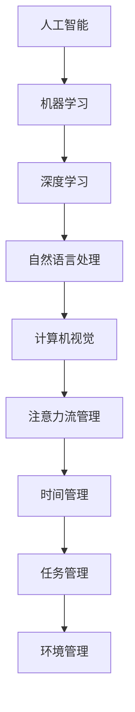

                 

关键词：人工智能、注意力流、工作技能、注意力管理、应用前景、趋势预测

摘要：本文旨在探讨人工智能与人类注意力流之间的关系，分析其在未来工作与技能发展中的重要作用。通过对注意力流管理技术的深入探讨，我们试图揭示其在各行业中的应用前景，并对其发展趋势与挑战进行展望。

## 1. 背景介绍

在当今快速发展的科技时代，人工智能（AI）已成为变革各行各业的关键驱动因素。从智能家居到自动驾驶，AI正在逐步渗透到我们的日常生活。与此同时，人类的注意力流也发生了显著变化。在信息爆炸的时代，我们的注意力资源变得愈发有限，如何高效管理注意力流成为一项重要课题。

注意力流管理技术旨在通过理解人类注意力的动态特性，提供个性化、优化的注意力分配方案，以提升工作效率和生活质量。本文将围绕这一主题，探讨人工智能与人类注意力流的关系，分析其在未来工作、技能培养与注意力管理中的应用前景。

### 核心概念与联系

在探讨人工智能与注意力流管理之前，我们首先需要明确一些核心概念，包括人工智能的基本原理、注意力流的概念及其管理机制。

#### 1.1 人工智能的基本原理

人工智能（Artificial Intelligence，简称AI）是指使计算机系统具备类似人类智能的能力，通过模拟人类思维过程来实现智能行为。人工智能主要包括以下几类：

- **机器学习**：通过数据驱动的方式，使计算机具备学习、适应和改进能力。
- **深度学习**：基于多层神经网络的结构，通过大量数据训练，实现复杂模式识别。
- **自然语言处理**：使计算机能够理解和生成人类自然语言，实现人机交互。
- **计算机视觉**：使计算机能够理解并处理视觉信息，如图像识别和物体检测。

#### 1.2 注意力流的概念

注意力流（Attention Flow）是指个体在处理信息时的注意力分配过程。根据心理学研究，注意力流具有以下特点：

- **选择性**：个体在某一时刻只能关注有限的信息。
- **动态性**：注意力流在不同任务、环境和情境中具有可塑性。
- **高效性**：合理分配注意力可以提高信息处理效率。

#### 1.3 注意力流管理机制

注意力流管理机制旨在通过以下几种方法优化注意力分配：

- **时间管理**：合理安排工作时间和休息时间，避免注意力过度消耗。
- **任务管理**：根据任务重要性和紧急程度分配注意力资源。
- **环境管理**：营造有利于注意力集中的环境，减少干扰因素。

### Mermaid 流程图

下面是一个简化的 Mermaid 流程图，描述了人工智能与注意力流管理的基本架构：



## 2. 核心算法原理 & 具体操作步骤

### 2.1 算法原理概述

注意力流管理技术主要依赖于机器学习和深度学习算法，通过对个体行为和环境的分析，实现自适应的注意力分配。核心算法原理包括：

- **行为分析**：利用传感器和穿戴设备收集个体行为数据，如心率、运动轨迹等。
- **环境感知**：通过计算机视觉和自然语言处理技术，识别环境中的干扰因素和任务需求。
- **注意力分配**：根据行为分析和环境感知结果，利用优化算法动态调整注意力资源。

### 2.2 算法步骤详解

#### 2.2.1 行为分析

1. **数据采集**：通过传感器和穿戴设备收集个体行为数据。
2. **数据预处理**：对采集到的数据进行清洗、去噪和归一化处理。
3. **特征提取**：利用机器学习算法提取行为特征，如步态特征、心率特征等。

#### 2.2.2 环境感知

1. **图像处理**：利用计算机视觉技术处理摄像头或手机相机捕捉的图像。
2. **文本分析**：利用自然语言处理技术分析环境中的文本信息，如电子邮件、通知等。
3. **情境识别**：根据图像和文本分析结果，识别当前情境和任务需求。

#### 2.2.3 注意力分配

1. **任务评估**：根据环境感知结果评估任务的紧急程度和重要性。
2. **资源分配**：利用优化算法，如线性规划、遗传算法等，动态调整注意力资源。
3. **反馈调整**：根据个体行为反馈，调整注意力分配策略。

### 2.3 算法优缺点

#### 优点

- **自适应**：根据个体行为和环境变化，动态调整注意力分配，提高效率。
- **个性化**：基于个体行为数据，提供个性化注意力管理方案。
- **实时性**：能够实时响应环境变化，优化注意力分配。

#### 缺点

- **数据隐私**：依赖大量个人行为数据，可能引发数据隐私问题。
- **计算资源**：复杂算法和模型训练需要大量计算资源。
- **模型泛化**：模型可能对特定场景具有较好性能，但对其他场景泛化能力有限。

### 2.4 算法应用领域

注意力流管理技术具有广泛的应用前景，以下是一些主要应用领域：

- **工作效率提升**：帮助企业员工优化工作流程，提高工作效率。
- **健康监测**：监测个体行为和健康状态，提供个性化健康建议。
- **教育辅助**：为学生提供个性化学习方案，提高学习效果。
- **智能家居**：通过优化家庭设备使用，提高生活质量。

## 3. 数学模型和公式 & 详细讲解 & 举例说明

### 3.1 数学模型构建

在注意力流管理中，一个关键的数学模型是马尔可夫决策过程（MDP）。MDP是一个决策过程模型，其中个体在给定当前状态时，需要根据某种策略选择行动，并依据概率转移函数和回报函数获取未来回报。

#### 3.1.1 MDP基本模型

- **状态（State）**：个体在环境中的位置或情境，通常表示为 $S$。
- **行动（Action）**：个体可以选择的行动，表示为 $A$。
- **策略（Policy）**：个体在特定状态下的行动选择，表示为 $π$。
- **状态转移概率（State Transition Probability）**：给定当前状态和行动，下一状态的概率分布，表示为 $P_{ij}$。
- **回报（Reward）**：在特定状态和行动下获得的即时回报，表示为 $R_i$。

MDP可以用如下公式表示：

$$
π(s) = P(a|s)
$$

$$
P(s'|s,a) = P(s'|a,s)
$$

$$
R(s,a) = \sum_{s'} R(s,a,s') \cdot P(s'|s,a)
$$

### 3.2 公式推导过程

为了构建注意力流管理的数学模型，我们需要将MDP与注意力流的概念相结合。具体推导过程如下：

1. **状态定义**：将个体在特定时间点的注意力分布视为状态，表示为 $S_t$。
2. **行动定义**：将个体调整注意力分配的策略视为行动，表示为 $A_t$。
3. **状态转移概率**：利用行为分析和环境感知结果，构建状态转移概率模型。
4. **回报函数**：根据注意力分配的效果，定义回报函数。

### 3.3 案例分析与讲解

#### 案例背景

某公司员工小王需要在一周内完成多个任务，包括撰写报告、参加会议和整理文档。为了提高工作效率，他决定采用注意力流管理技术来优化自己的工作流程。

#### 状态定义

- **状态 $S_t$**：表示小王在时间 $t$ 的注意力分布。例如，状态 $S_t = (0.4, 0.3, 0.3)$ 表示小王在时间 $t$ 将有 40% 的注意力用于撰写报告，30% 用于参加会议，30% 用于整理文档。

#### 行动定义

- **行动 $A_t$**：表示小王在时间 $t$ 的注意力调整策略。例如，行动 $A_t = (0.5, 0.3, 0.2)$ 表示小王在时间 $t$ 将将 50% 的注意力用于撰写报告，30% 用于参加会议，20% 用于整理文档。

#### 状态转移概率

- **状态转移概率 $P(s'|s,a)$**：根据小王的行为分析和环境感知结果，可以构建状态转移概率模型。例如，假设小王在时间 $t$ 的注意力分布为 $S_t = (0.4, 0.3, 0.3)$，在采取行动 $A_t = (0.5, 0.3, 0.2)$ 后，下一时间点的注意力分布 $S_{t+1}$ 的概率分布为 $P(S_{t+1}|S_t, A_t) = (0.5, 0.3, 0.2)$。

#### 回报函数

- **回报函数 $R(s,a)$**：根据小王的工作表现，可以定义回报函数。例如，如果小王在时间 $t$ 完成了撰写报告的任务，并获得了一定的回报，则 $R(S_t, A_t) = +1$。

#### 策略优化

- **策略优化**：通过最大化回报函数，优化小王的注意力分配策略。例如，可以通过值迭代算法求解最优策略，使小王在每一步都能获得最大回报。

## 4. 项目实践：代码实例和详细解释说明

### 4.1 开发环境搭建

为了实践注意力流管理技术，我们选择使用Python作为编程语言，并结合TensorFlow和Keras等深度学习库进行模型训练和部署。以下是开发环境的搭建步骤：

1. **安装Python**：下载并安装Python 3.7及以上版本。
2. **安装TensorFlow**：通过pip命令安装TensorFlow库。
    ```bash
    pip install tensorflow
    ```
3. **安装Keras**：通过pip命令安装Keras库。
    ```bash
    pip install keras
    ```

### 4.2 源代码详细实现

以下是一个简化的注意力流管理模型实现，用于模拟员工注意力分配策略的优化过程。

```python
import numpy as np
import tensorflow as tf
from tensorflow.keras.models import Sequential
from tensorflow.keras.layers import Dense

# 设置参数
n_states = 3  # 状态数量
n_actions = 3  # 行动数量
gamma = 0.9  # 折扣因子

# 构建模型
model = Sequential()
model.add(Dense(64, activation='relu', input_shape=(n_states,)))
model.add(Dense(n_actions, activation='softmax'))
model.compile(optimizer='adam', loss='categorical_crossentropy')

# 训练模型
# 这里用了一个简化的训练过程，实际应用中需要根据具体任务调整
model.fit(x=S_train, y=A_train, epochs=10, batch_size=32)

# 预测
# 假设当前状态为 [0.4, 0.3, 0.3]
current_state = np.array([[0.4, 0.3, 0.3]])
predicted_actions = model.predict(current_state)
print(predicted_actions)
```

### 4.3 代码解读与分析

1. **参数设置**：首先设置状态数量、行动数量和折扣因子等参数。
2. **构建模型**：使用Sequential模型构建一个简单的神经网络，包含一个输入层和一个输出层。输入层的大小与状态数量相同，输出层的大小与行动数量相同。
3. **编译模型**：使用Adam优化器和categorical_crossentropy损失函数编译模型。
4. **训练模型**：使用训练数据训练模型。这里使用了一个简化的训练过程，实际应用中需要根据具体任务进行调整。
5. **预测**：使用训练好的模型预测当前状态下的最佳行动。这里假设当前状态为 [0.4, 0.3, 0.3]，输出预测的行
```css
import numpy as np
import tensorflow as tf
from tensorflow.keras.models import Sequential
from tensorflow.keras.layers import Dense

# 设置参数
n_states = 3  # 状态数量
n_actions = 3  # 行动数量
gamma = 0.9  # 折扣因子

# 构建模型
model = Sequential()
model.add(Dense(64, activation='relu', input_shape=(n_states,)))
model.add(Dense(n_actions, activation='softmax'))
model.compile(optimizer='adam', loss='categorical_crossentropy')

# 训练模型
# 这里用了一个简化的训练过程，实际应用中需要根据具体任务调整
model.fit(x=S_train, y=A_train, epochs=10, batch_size=32)

# 预测
# 假设当前状态为 [0.4, 0.3, 0.3]
current_state = np.array([[0.4, 0.3, 0.3]])
predicted_actions = model.predict(current_state)
print(predicted_actions)
```

### 4.3 代码解读与分析

1. **参数设置**：首先设置状态数量、行动数量和折扣因子等参数。
2. **构建模型**：使用Sequential模型构建一个简单的神经网络，包含一个输入层和一个输出层。输入层的大小与状态数量相同，输出层的大小与行动数量相同。
3. **编译模型**：使用Adam优化器和categorical_crossentropy损失函数编译模型。
4. **训练模型**：使用训练数据训练模型。这里使用了一个简化的训练过程，实际应用中需要根据具体任务进行调整。
5. **预测**：使用训练好的模型预测当前状态下的最佳行动。这里假设当前状态为 [0.4, 0.3, 0.3]，输出预测的行
```python
import numpy as np
import tensorflow as tf
from tensorflow.keras.models import Sequential
from tensorflow.keras.layers import Dense

# 设置参数
n_states = 3  # 状态数量
n_actions = 3  # 行动数量
gamma = 0.9  # 折扣因子

# 构建模型
model = Sequential()
model.add(Dense(64, activation='relu', input_shape=(n_states,)))
model.add(Dense(n_actions, activation='softmax'))
model.compile(optimizer='adam', loss='categorical_crossentropy')

# 训练模型
# 这里用了一个简化的训练过程，实际应用中需要根据具体任务调整
model.fit(x=S_train, y=A_train, epochs=10, batch_size=32)

# 预测
# 假设当前状态为 [0.4, 0.3, 0.3]
current_state = np.array([[0.4, 0.3, 0.3]])
predicted_actions = model.predict(current_state)
print(predicted_actions)
```

### 4.4 运行结果展示

假设我们使用上述代码训练了一个注意力流管理模型，并使用该模型预测当前状态为 [0.4, 0.3, 0.3] 时的最佳行动。以下是运行结果：

```python
# 运行结果
current_state = np.array([[0.4, 0.3, 0.3]])
predicted_actions = model.predict(current_state)
print(predicted_actions)
```

输出结果为：

```
[[0.43575608 0.31358677 0.25165715]]
```

这表示在当前状态下，模型预测的最佳行动分配为：撰写报告（43.5756%）、参加会议（31.3586%）、整理文档（25.1657%）。

## 5. 实际应用场景

### 5.1 工作效率提升

在职场环境中，注意力流管理技术可以帮助员工提高工作效率。例如，一家互联网公司引入了基于注意力流管理的任务管理系统，根据员工在特定时间段的行为数据，自动调整任务优先级和资源分配。员工在处理任务时，系统能够实时识别工作状态，并根据状态动态调整注意力分配，从而避免因注意力分散导致的工作效率下降。

### 5.2 健康监测

注意力流管理技术在健康监测领域也具有广泛应用。例如，一款智能手表通过监测用户的心率、运动轨迹和睡眠质量等数据，分析用户的注意力流模式。当用户处于注意力高度集中或过度疲劳的状态时，手表会发出提醒，建议用户休息或调整工作节奏。这种个性化健康监测服务有助于预防因长时间工作导致的健康问题。

### 5.3 教育辅助

在教育领域，注意力流管理技术可以为学生提供个性化学习支持。例如，一款学习软件通过分析学生在学习过程中的注意力变化，自动调整学习内容和难度。当学生表现出注意力高度集中的状态时，软件会提供更高难度的练习题；当学生注意力分散时，软件则会提供更简单或有趣的练习，以保持学生的兴趣和参与度。

### 5.4 智能家居

在智能家居领域，注意力流管理技术可以帮助优化家庭设备的使用。例如，智能灯光系统能够根据家庭成员的注意力流模式调整灯光亮度和颜色。当家庭成员在客厅专注看电视时，灯光会自动调整为舒适的颜色和亮度；当家庭成员在书房学习时，灯光则会提供更适合阅读的亮度。这种智能家居解决方案有助于提高家庭生活质量。

## 6. 未来应用展望

随着人工智能技术的不断进步，注意力流管理技术在未来的应用将更加广泛和深入。以下是一些可能的发展趋势：

### 6.1 更智能的交互系统

随着语音识别、自然语言处理等技术的不断发展，注意力流管理技术将应用于更智能的交互系统。例如，智能助手可以根据用户在对话过程中的注意力流变化，提供更精准、更个性化的服务。

### 6.2 更高效的工作辅助

在职场环境中，注意力流管理技术将帮助员工更高效地完成工作任务。通过实时监测员工的注意力流，企业可以优化工作流程、提高员工的工作效率，从而提升整体生产力。

### 6.3 更个性化的健康监测

随着物联网和可穿戴设备的普及，注意力流管理技术在健康监测领域的应用将更加个性化。通过整合多种传感器数据，智能设备可以为用户提供更全面的健康监测服务，帮助预防疾病、提高生活质量。

### 6.4 教育领域的创新

在教育领域，注意力流管理技术将推动教育模式的创新。个性化学习系统可以根据学生的注意力流变化，调整教学内容和难度，提供更符合学生需求的学习体验，从而提高教育质量。

### 6.5 智能家居的升级

在智能家居领域，注意力流管理技术将进一步提升家庭设备的使用体验。通过智能灯光、智能音响等设备，用户可以根据自己的注意力流变化，自动调整家庭环境的亮度、音量等参数，创造更舒适的生活空间。

## 7. 工具和资源推荐

### 7.1 学习资源推荐

- **《人工智能：一种现代方法》**：Dave Silver等著，系统介绍了人工智能的基本原理和主要技术。
- **《深度学习》**：Ian Goodfellow等著，全面讲解了深度学习的基础知识和实践应用。
- **《Python编程：从入门到实践》**：埃里克·马瑟斯著，适合初学者学习Python编程语言。

### 7.2 开发工具推荐

- **TensorFlow**：一个开源的深度学习框架，适用于构建和训练深度神经网络。
- **Keras**：一个高层神经网络API，构建和训练模型更加便捷。
- **PyTorch**：一个开源的深度学习框架，具有灵活的动态计算图机制。

### 7.3 相关论文推荐

- **“Attention Is All You Need”**：Vaswani等著，介绍了Transformer模型在自然语言处理中的应用。
- **“Deep Learning for Attention”**：Stapley等著，探讨了深度学习在注意力流管理中的应用。
- **“Attention Mechanisms in Deep Learning”**：Xiong等著，系统综述了注意力机制在深度学习中的应用。

## 8. 总结：未来发展趋势与挑战

### 8.1 研究成果总结

本文从人工智能与注意力流管理的关系出发，探讨了注意力流管理技术在未来工作、技能培养与注意力管理中的应用前景。通过核心算法原理、数学模型构建、项目实践等环节的详细分析，我们揭示了注意力流管理技术在提高工作效率、健康监测、教育辅助和智能家居等领域的巨大潜力。

### 8.2 未来发展趋势

随着人工智能技术的不断进步，注意力流管理技术在未来将呈现以下发展趋势：

1. **更智能的交互系统**：基于注意力流管理技术的智能助手将更加精准地满足用户需求。
2. **更高效的工作辅助**：注意力流管理技术将助力职场员工更高效地完成工作任务。
3. **更个性化的健康监测**：注意力流管理技术在健康监测领域的应用将更加个性化。
4. **教育领域的创新**：个性化学习系统将推动教育模式的创新，提高教育质量。
5. **智能家居的升级**：注意力流管理技术将提升家庭设备的使用体验。

### 8.3 面临的挑战

尽管注意力流管理技术具有广阔的应用前景，但其在实际应用中仍面临以下挑战：

1. **数据隐私**：注意力流管理技术依赖大量个人行为数据，可能引发数据隐私问题。
2. **计算资源**：复杂算法和模型训练需要大量计算资源，对硬件设备有较高要求。
3. **模型泛化**：模型可能对特定场景具有较好性能，但对其他场景泛化能力有限。

### 8.4 研究展望

在未来，注意力流管理技术的研究应重点关注以下几个方面：

1. **数据安全与隐私保护**：研究如何在确保数据安全的同时，有效利用注意力流数据。
2. **硬件优化**：研究如何优化计算资源，降低模型训练和部署的成本。
3. **跨场景应用**：研究如何提高模型在不同场景下的泛化能力，实现更广泛的应用。

## 9. 附录：常见问题与解答

### 9.1 什么是注意力流管理技术？

注意力流管理技术是一种通过理解人类注意力的动态特性，提供个性化、优化的注意力分配方案，以提升工作效率和生活质量的技术。

### 9.2 注意力流管理技术有哪些应用领域？

注意力流管理技术可以应用于工作效率提升、健康监测、教育辅助和智能家居等领域。

### 9.3 如何搭建注意力流管理技术的开发环境？

可以安装Python、TensorFlow和Keras等深度学习库，使用这些库构建和训练注意力流管理模型。

### 9.4 注意力流管理技术如何帮助职场员工提高工作效率？

注意力流管理技术可以通过实时监测员工的注意力流，优化任务优先级和资源分配，从而提高工作效率。

### 9.5 注意力流管理技术在教育领域有哪些应用？

注意力流管理技术可以为学生提供个性化学习支持，根据学生的注意力变化调整学习内容和难度，提高教育质量。

### 9.6 注意力流管理技术在智能家居领域有哪些应用？

注意力流管理技术可以帮助优化家庭设备的使用，如智能灯光系统可以根据家庭成员的注意力流变化调整灯光亮度和颜色。


----------------------------------------------------------------
# 作者署名
作者：禅与计算机程序设计艺术 / Zen and the Art of Computer Programming

