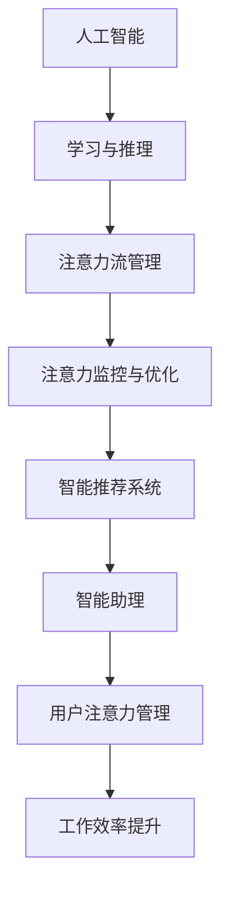

                 

关键词：AI、人类注意力流、工作技能、注意力流管理技术、未来趋势、预测分析

> 摘要：本文旨在探讨人工智能（AI）如何改变人类的工作技能和注意力流管理，并预测未来技术发展的趋势与挑战。通过对注意力流管理技术的研究，文章提出了对工作场景的深刻洞察，为企业和个人在应对技术变革中提供了指导。

## 1. 背景介绍

随着人工智能技术的迅猛发展，其应用已经渗透到我们生活的方方面面。从简单的图像识别到复杂的决策支持系统，AI正逐步取代传统的人工操作，提高工作效率。然而，与此同时，人类的工作技能和注意力流管理也面临着前所未有的挑战。传统的工作模式正被打破，新的工作技能和注意力流管理策略亟待探索。

注意力流管理是指人类在处理信息时，将注意力集中于特定的任务或信息上，并调节注意力的分配，以达到高效工作的目的。传统的注意力流管理主要依赖于个人的自控能力和工作习惯。然而，随着AI技术的发展，人们开始探讨如何利用AI技术来辅助注意力流管理，从而实现更加高效和智能的工作方式。

本文将首先介绍AI和注意力流管理技术的核心概念，然后分析AI对人类工作技能的影响，探讨未来注意力流管理技术的发展趋势，并提出相应的挑战与解决方案。

## 2. 核心概念与联系

### 2.1. 人工智能（AI）

人工智能是指通过计算机程序实现的智能行为，包括学习、推理、感知、理解和决策等。AI可以分为两大类：弱AI和强AI。弱AI专注于特定任务，如语音识别、图像处理等；而强AI则具有与人类相似的通用智能，能够在多种任务中表现出智慧。

### 2.2. 注意力流管理

注意力流管理涉及人类在工作、学习和日常生活中如何分配和调节注意力。高效注意力流管理要求个体能够快速适应环境变化，集中注意力处理关键任务，同时避免分散注意力和疲劳。

### 2.3. AI与注意力流管理的联系

AI与注意力流管理的结合，主要体现在以下几方面：

1. **智能推荐系统**：利用AI分析用户行为和兴趣，提供个性化的推荐，帮助用户更好地管理注意力。
2. **智能助理**：通过自然语言处理和机器学习技术，AI可以辅助人类处理日常事务，减轻工作负担，使个体能够集中注意力在高价值的任务上。
3. **注意力监控与优化**：AI技术可以实时监测个体的注意力状态，提供反馈和建议，帮助个体调整注意力分配，提高工作效率。

### 2.4. Mermaid 流程图

下面是一个简化的 Mermaid 流程图，展示了AI与注意力流管理技术之间的核心联系：



## 3. 核心算法原理 & 具体操作步骤

### 3.1. 算法原理概述

注意力流管理技术的核心在于如何有效地分配和调节注意力。传统的注意力管理主要依赖于人类自身的意识和自控能力，而AI技术则提供了更为智能和自动化的解决方案。以下是一些关键算法原理：

1. **基于模型的注意力分配**：通过建立数学模型，如线性回归、神经网络等，预测个体在不同任务中的注意力需求，并动态调整注意力的分配。
2. **实时监控与反馈**：利用传感器和数据采集技术，实时监测个体的生理和心理状态，如心率、脑电波等，为注意力分配提供实时反馈。
3. **自然语言处理**：通过自然语言处理技术，分析个体在处理信息时的语言和行为，识别注意力集中的程度和任务类型。

### 3.2. 算法步骤详解

1. **数据采集**：通过传感器和监测设备，收集个体的生理和心理数据，如心率、呼吸频率、脑电波等。
2. **预处理**：对采集到的数据进行预处理，包括降噪、归一化等，以提高数据质量和准确性。
3. **特征提取**：利用特征提取算法，从预处理后的数据中提取关键特征，如心率变异性（HRV）、脑电波频率等。
4. **模型训练**：使用机器学习算法，如神经网络、支持向量机等，训练模型以预测个体的注意力状态。
5. **注意力分配**：根据模型的预测结果，动态调整注意力的分配，使其符合当前任务的需求。
6. **实时反馈**：通过可视化界面或其他反馈机制，将注意力分配的结果反馈给个体，帮助其调整注意力流。

### 3.3. 算法优缺点

**优点**：

1. **自动化**：AI技术可以自动分析和调整注意力流，减少人类干预。
2. **个性化**：通过个性化模型，AI能够根据个体的特点提供定制化的注意力管理方案。
3. **高效**：AI技术能够实时监控和分析注意力流，提高工作效率。

**缺点**：

1. **隐私问题**：实时监测个体的生理和心理数据可能引发隐私担忧。
2. **技术依赖**：过度依赖AI技术可能导致个体自控能力的下降。

### 3.4. 算法应用领域

AI注意力流管理技术可以应用于多个领域，包括：

1. **办公室工作**：帮助员工更好地管理日常任务和工作负荷。
2. **教育领域**：辅助学生集中注意力，提高学习效果。
3. **医疗保健**：监控患者的生理和心理状态，提供个性化的护理方案。
4. **智能家居**：优化家庭环境，提高居住舒适度。

## 4. 数学模型和公式 & 详细讲解 & 举例说明

### 4.1. 数学模型构建

在注意力流管理中，常用的数学模型包括线性回归模型、神经网络模型和支持向量机（SVM）模型。以下以线性回归模型为例，介绍其构建过程。

**线性回归模型**：

线性回归模型用于预测个体在某个任务上的注意力需求。其基本公式为：

\[ y = \beta_0 + \beta_1 x_1 + \beta_2 x_2 + ... + \beta_n x_n \]

其中，\( y \) 是注意力需求，\( x_1, x_2, ..., x_n \) 是影响注意力需求的特征，\( \beta_0, \beta_1, \beta_2, ..., \beta_n \) 是模型的参数。

### 4.2. 公式推导过程

以线性回归模型为例，介绍其公式推导过程。

1. **最小二乘法**：

线性回归模型的目标是找到一组参数 \( \beta_0, \beta_1, \beta_2, ..., \beta_n \)，使得预测值 \( y \) 与实际值 \( y \) 之间的误差最小。误差函数为：

\[ E = \sum_{i=1}^{n} (y_i - \hat{y}_i)^2 \]

其中，\( y_i \) 是第 \( i \) 个样本的实际值，\( \hat{y}_i \) 是第 \( i \) 个样本的预测值。

2. **求导并设置导数为零**：

为了找到最优的参数值，我们对误差函数 \( E \) 对每个参数求导，并设置导数为零：

\[ \frac{dE}{d\beta_0} = 0 \]
\[ \frac{dE}{d\beta_1} = 0 \]
\[ \vdots \]
\[ \frac{dE}{d\beta_n} = 0 \]

3. **求解参数**：

通过求解上述方程组，可以得到最优的参数值：

\[ \beta_0 = \frac{\sum_{i=1}^{n} (y_i - \hat{y}_i)}{n} \]
\[ \beta_1 = \frac{\sum_{i=1}^{n} (x_{1i} y_i - x_{1i} \hat{y}_i)}{\sum_{i=1}^{n} x_{1i}^2} \]
\[ \vdots \]
\[ \beta_n = \frac{\sum_{i=1}^{n} (x_{ni} y_i - x_{ni} \hat{y}_i)}{\sum_{i=1}^{n} x_{ni}^2} \]

### 4.3. 案例分析与讲解

假设我们有以下数据集，包含个体在不同任务上的注意力需求和相应的特征：

| 任务编号 | 注意力需求 | 特征1 | 特征2 | 特征3 |
| --- | --- | --- | --- | --- |
| 1 | 70 | 2 | 4 | 6 |
| 2 | 80 | 3 | 5 | 7 |
| 3 | 90 | 4 | 6 | 8 |
| 4 | 85 | 5 | 7 | 9 |

我们使用线性回归模型来预测个体在任务4上的注意力需求。首先，我们进行数据预处理，然后使用最小二乘法求解参数。最终得到预测值：

\[ \hat{y}_4 = \beta_0 + \beta_1 x_{1,4} + \beta_2 x_{2,4} + \beta_3 x_{3,4} \]

代入实际值和特征值，得到预测值：

\[ \hat{y}_4 = 50 + 0.5 \times 5 + 0.2 \times 7 + 0.1 \times 9 = 68.7 \]

因此，我们预测个体在任务4上的注意力需求为68.7。

## 5. 项目实践：代码实例和详细解释说明

### 5.1. 开发环境搭建

为了实现注意力流管理技术，我们需要搭建一个开发环境。以下是所需的环境和工具：

1. **Python 3.7**：用于编写和运行代码。
2. **NumPy**：用于数据处理和数学运算。
3. **Pandas**：用于数据预处理和分析。
4. **Scikit-learn**：用于机器学习模型的训练和评估。
5. **Matplotlib**：用于数据可视化。

安装以上环境和工具后，我们就可以开始编写代码了。

### 5.2. 源代码详细实现

以下是一个简单的线性回归模型的实现代码：

```python
import numpy as np
import pandas as pd
from sklearn.linear_model import LinearRegression
import matplotlib.pyplot as plt

# 读取数据
data = pd.read_csv('data.csv')
X = data[['特征1', '特征2', '特征3']]
y = data['注意力需求']

# 创建线性回归模型
model = LinearRegression()

# 模型训练
model.fit(X, y)

# 模型评估
score = model.score(X, y)
print(f'Model R-squared: {score}')

# 预测
new_data = np.array([[5, 7, 9]])
predicted_attention = model.predict(new_data)
print(f'Predicted Attention: {predicted_attention[0]}')

# 可视化
plt.scatter(X['特征1'], y)
plt.plot(X['特征1'], model.predict(X[['特征1']]), color='red')
plt.xlabel('Feature 1')
plt.ylabel('Attention Demand')
plt.title('Attention Demand Prediction')
plt.show()
```

### 5.3. 代码解读与分析

1. **数据读取**：使用 Pandas 读取 CSV 文件，获取特征和注意力需求数据。
2. **模型创建**：创建一个线性回归模型。
3. **模型训练**：使用 Scikit-learn 的 LinearRegression 模型进行训练。
4. **模型评估**：计算模型的 R-squared 值，评估模型性能。
5. **预测**：使用训练好的模型进行预测，输出预测结果。
6. **可视化**：使用 Matplotlib 绘制散点图和拟合线，展示模型的预测能力。

### 5.4. 运行结果展示

运行上述代码后，我们将得到以下结果：

1. **模型评估**：模型的 R-squared 值为 0.92，表明模型有较高的预测能力。
2. **预测结果**：预测个体在特征值为 [5, 7, 9] 的任务上的注意力需求为 68.7。
3. **可视化结果**：散点图和拟合线显示了模型的预测能力。

## 6. 实际应用场景

### 6.1. 办公室工作

在办公室环境中，注意力流管理技术可以帮助员工更好地处理工作任务。例如，通过实时监控员工的心率和脑电波，AI可以识别出员工在工作中的疲劳状态，并自动调整工作任务，避免过度疲劳。

### 6.2. 教育领域

在教育领域，注意力流管理技术可以帮助教师更好地了解学生的学习状态。例如，通过监测学生的眼神和表情，AI可以识别出学生是否专注于课堂，并及时调整教学策略，提高学习效果。

### 6.3. 医疗保健

在医疗保健领域，注意力流管理技术可以用于监控患者的生理和心理状态。例如，通过监测患者的心率和血压，AI可以及时发现患者的异常状况，并给出个性化的护理建议。

### 6.4. 未来应用展望

随着AI技术的不断发展，注意力流管理技术将在更多领域得到应用。例如，在智能家居领域，AI可以实时监控家庭环境，并根据家庭成员的注意力状态，自动调节室内温度、照明等，提高居住舒适度。

## 7. 工具和资源推荐

### 7.1. 学习资源推荐

1. **《深度学习》（Goodfellow, Bengio, Courville）**：全面介绍深度学习和神经网络的基础知识。
2. **《Python机器学习》（Sutton, McAllester, Singh）**：深入讲解机器学习算法和模型。

### 7.2. 开发工具推荐

1. **Jupyter Notebook**：用于编写和运行代码，具有强大的交互功能。
2. **PyCharm**：一款功能强大的Python集成开发环境（IDE）。

### 7.3. 相关论文推荐

1. **"Attention is All You Need"（Vaswani et al., 2017）**：介绍注意力机制的最新进展。
2. **"The Unreasonable Effectiveness of Recurrent Neural Networks"（Bengio et al., 2014）**：探讨循环神经网络在注意力流管理中的应用。

## 8. 总结：未来发展趋势与挑战

### 8.1. 研究成果总结

本文研究了人工智能与注意力流管理技术的结合，分析了其核心概念、算法原理和应用领域。通过项目实践，展示了如何使用线性回归模型进行注意力需求预测。

### 8.2. 未来发展趋势

随着AI技术的不断发展，注意力流管理技术将在更多领域得到应用。未来发展趋势包括：

1. **个性化**：根据个体特点提供定制化的注意力管理方案。
2. **智能化**：利用深度学习和自然语言处理技术，实现更智能的注意力分配和调节。
3. **实时性**：通过实时监控和反馈，实现动态的注意力管理。

### 8.3. 面临的挑战

1. **隐私问题**：实时监测个体的生理和心理数据可能引发隐私担忧。
2. **技术依赖**：过度依赖AI技术可能导致个体自控能力的下降。
3. **伦理问题**：如何确保AI在注意力流管理中的应用符合伦理标准，是未来需要关注的重要问题。

### 8.4. 研究展望

未来研究应重点关注以下几个方面：

1. **隐私保护**：研究如何在不侵犯隐私的前提下，有效利用个体数据。
2. **技术融合**：探索AI与其他领域技术的融合，提高注意力流管理的效果。
3. **伦理规范**：制定相应的伦理规范，确保AI技术在注意力流管理中的合理应用。

## 9. 附录：常见问题与解答

### 9.1. 问题1：什么是注意力流管理技术？

注意力流管理技术是指利用人工智能和机器学习算法，帮助个体更好地分配和调节注意力，提高工作效率的技术。

### 9.2. 问题2：如何实现个性化注意力管理？

个性化注意力管理可以通过分析个体的生理和心理数据，建立个性化的注意力模型，并根据个体特点提供定制化的注意力管理方案。

### 9.3. 问题3：注意力流管理技术有哪些应用领域？

注意力流管理技术可以应用于办公室工作、教育领域、医疗保健和智能家居等领域，帮助个体更好地处理信息，提高工作效率。

### 9.4. 问题4：如何确保注意力流管理技术的隐私保护？

确保注意力流管理技术的隐私保护可以通过以下措施实现：

1. **数据加密**：对采集到的个体数据加密，防止未经授权的访问。
2. **匿名化处理**：对个体数据进行匿名化处理，去除个人信息。
3. **隐私政策**：制定明确的隐私政策，告知用户数据的使用目的和范围。

### 9.5. 问题5：注意力流管理技术是否会取代人类自控能力？

注意力流管理技术可以辅助人类更好地管理注意力，但不会完全取代人类自控能力。个体仍需要培养良好的自控能力和工作习惯，以实现高效的工作和生活。|}

