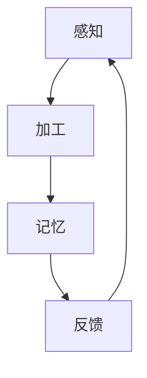

                 

关键词：人工智能，注意力流，工作技能，注意力流管理技术，未来发展

> 摘要：本文探讨了人工智能与人类注意力流的相互关系，分析了在技术进步推动下，人类工作技能的变革及其对注意力流管理技术的需求。文章旨在为读者揭示未来发展趋势，提供实用的技能培养和注意力管理策略，助力读者在智能时代中更好地应对挑战。

## 1. 背景介绍

随着人工智能（AI）技术的飞速发展，智能机器正在逐步替代人类完成某些重复性和复杂的任务。这一变革不仅影响了传统行业的工作模式，也对人类的工作技能和注意力管理提出了新的要求。注意力流，作为人类认知过程中的核心要素，成为理解未来工作变革的重要切入点。

注意力流是指个体在不同任务和环境之间分配注意力资源的过程。在人工智能时代，人类需要处理的信息量呈指数级增长，这要求人们具备更高的注意力管理能力。传统的注意力管理方法已无法满足现代工作的需求，因此，研究如何利用技术手段优化人类注意力流，成为当务之急。

本文旨在探讨人工智能与人类注意力流的关系，分析未来工作技能的变革，以及注意力流管理技术的未来发展。通过这篇文章，读者将了解如何在未来智能时代中更好地适应和利用人工智能技术，提高工作效率和注意力管理水平。

## 2. 核心概念与联系

### 2.1. 人工智能与注意力流

人工智能（AI）是指由计算机实现的模拟人类智能的系统。其核心技术包括机器学习、深度学习、自然语言处理等。而注意力流（Attention Flow）是指人类在执行任务时，大脑对各种信息进行选择、加工和记忆的过程。

人工智能与注意力流之间的联系主要体现在以下几个方面：

1. **信息处理能力的提升**：人工智能技术能够高效地处理大量数据，这使得人类能够从繁琐的信息筛选任务中解脱出来，将注意力集中在更高价值的任务上。
   
2. **注意力分配的优化**：人工智能系统可以根据任务需求动态调整注意力的分配，帮助人类更好地管理注意力流，提高工作效率。

3. **学习与适应能力的增强**：人工智能可以通过机器学习不断优化自身，从而帮助人类学习新的工作技能和注意力管理策略。

### 2.2. 注意力流的原理与架构

注意力流可以分为三个主要阶段：感知、加工和记忆。

1. **感知阶段**：个体在执行任务时，接收外界信息，并将其转化为神经信号。这一阶段涉及感官系统的运作和大脑对信息的初步处理。

2. **加工阶段**：大脑对感知到的信息进行筛选、整合和分析，形成对任务的认知和判断。这一阶段是注意力流的核心，决定了个体对任务的注意力集中程度。

3. **记忆阶段**：大脑将加工后的信息存储在长期记忆中，以便后续使用。这一阶段涉及记忆编码、存储和提取过程。

### 2.3. Mermaid 流程图

下面是一个简化的 Mermaid 流程图，展示了注意力流的三个主要阶段及其相互关系：



在此流程图中，每个节点都代表注意力流的一个阶段，节点之间的箭头表示信息流动的方向。反馈节点（D）表示个体对任务的反馈和调整，这一过程是注意力流循环的重要组成部分。

## 3. 核心算法原理 & 具体操作步骤

### 3.1. 算法原理概述

在人工智能与注意力流管理技术中，一种重要的算法是注意力加权模型（Attention Weighted Model）。该模型通过分析任务特点和个体注意力流，动态调整注意力分配，以达到最优的工作效率。

注意力加权模型的基本原理如下：

1. **任务特征分析**：对任务进行详细分析，识别任务的关键特征和复杂度。
   
2. **注意力流评估**：通过传感器和脑电图（EEG）等设备，实时监测个体的注意力流，评估其注意力水平。

3. **动态调整**：根据任务特征和注意力流评估结果，动态调整注意力的分配，确保个体在执行任务时能够集中注意力。

### 3.2. 算法步骤详解

1. **任务特征分析**：
   - 收集任务相关数据，如任务描述、任务流程、任务难度等。
   - 使用自然语言处理（NLP）技术，对任务描述进行语义分析，提取关键信息。
   - 构建任务特征向量，用于后续分析。

2. **注意力流评估**：
   - 使用脑电图（EEG）传感器，实时监测个体的脑电信号。
   - 利用信号处理技术，提取注意力相关的特征，如Alpha波、Beta波等。
   - 使用机器学习算法，对注意力特征进行分类和评估，得出当前的注意力水平。

3. **动态调整**：
   - 根据任务特征和注意力水平，构建注意力加权模型。
   - 动态调整注意力的分配，确保关键任务得到足够的注意力资源。
   - 实时监测注意力流的变化，根据反馈进行进一步调整。

### 3.3. 算法优缺点

**优点**：
- **高效性**：通过动态调整注意力分配，能够显著提高工作效率。
- **适应性**：能够根据不同任务和个体特点进行自适应调整。
- **实时性**：实时监测和调整注意力流，确保个体始终处于最佳工作状态。

**缺点**：
- **依赖技术**：需要高精度的传感器和强大的计算能力，成本较高。
- **数据隐私**：实时监测个体的脑电信号可能涉及隐私问题。
- **算法偏差**：算法可能存在一定的偏见，导致注意力分配不均。

### 3.4. 算法应用领域

注意力加权模型在多个领域具有广泛的应用前景：

1. **智能制造**：优化生产流程，提高生产效率。
2. **教育领域**：个性化学习方案，提高学习效果。
3. **医疗服务**：辅助医生进行诊断和治疗，提高医疗质量。
4. **智能交通**：优化交通管理，减少交通拥堵。

## 4. 数学模型和公式 & 详细讲解 & 举例说明

### 4.1. 数学模型构建

注意力加权模型的核心是注意力分配函数，该函数将注意力资源分配给不同的任务。假设有n个任务，每个任务的重要性和注意力需求不同，我们可以使用以下数学模型：

\[ A_t = w_t \cdot I_t \]

其中，\( A_t \)表示第t个任务的注意力分配量，\( w_t \)表示第t个任务的权重，\( I_t \)表示第t个任务的重要性。

权重 \( w_t \) 可以通过以下公式计算：

\[ w_t = \frac{C_t}{\sum_{i=1}^{n} C_i} \]

其中，\( C_t \) 表示第t个任务的复杂度，\( \sum_{i=1}^{n} C_i \) 表示所有任务的复杂度总和。

### 4.2. 公式推导过程

为了推导权重 \( w_t \)，我们首先需要定义任务复杂度 \( C_t \)。任务复杂度可以表示为任务所需时间、任务难度和资源需求的函数：

\[ C_t = f(T_t, D_t, R_t) \]

其中，\( T_t \) 表示任务所需时间，\( D_t \) 表示任务难度，\( R_t \) 表示任务资源需求。

假设任务所需时间 \( T_t \) 与任务难度 \( D_t \) 成正比，与任务资源需求 \( R_t \) 成反比，我们可以得到以下线性关系：

\[ T_t = k_1 \cdot D_t \]
\[ R_t = \frac{k_2}{D_t} \]

其中，\( k_1 \) 和 \( k_2 \) 是常数。

将上述关系代入任务复杂度公式，我们得到：

\[ C_t = k_1 \cdot D_t + \frac{k_2}{D_t} \]

为了使复杂度函数更具可解释性，我们可以对其进行变换：

\[ C_t = k_1 \cdot D_t + \frac{k_2}{D_t} = k_1 \cdot D_t + \frac{k_2}{k_1^2} \cdot \frac{1}{D_t^2} \]

现在，我们可以将权重公式重新表示为：

\[ w_t = \frac{C_t}{\sum_{i=1}^{n} C_i} = \frac{k_1 \cdot D_t + \frac{k_2}{k_1^2} \cdot \frac{1}{D_t^2}}{\sum_{i=1}^{n} \left( k_1 \cdot D_i + \frac{k_2}{k_1^2} \cdot \frac{1}{D_i^2} \right)} \]

### 4.3. 案例分析与讲解

假设有四个任务，任务1、任务2、任务3和任务4，它们的复杂度分别为 \( D_1 = 10 \)，\( D_2 = 20 \)，\( D_3 = 15 \) 和 \( D_4 = 30 \)。根据上述公式，我们可以计算每个任务的权重：

\[ w_1 = \frac{k_1 \cdot D_1 + \frac{k_2}{k_1^2} \cdot \frac{1}{D_1^2}}{\sum_{i=1}^{n} \left( k_1 \cdot D_i + \frac{k_2}{k_1^2} \cdot \frac{1}{D_i^2} \right)} \]
\[ w_2 = \frac{k_1 \cdot D_2 + \frac{k_2}{k_1^2} \cdot \frac{1}{D_2^2}}{\sum_{i=1}^{n} \left( k_1 \cdot D_i + \frac{k_2}{k_1^2} \cdot \frac{1}{D_i^2} \right)} \]
\[ w_3 = \frac{k_1 \cdot D_3 + \frac{k_2}{k_1^2} \cdot \frac{1}{D_3^2}}{\sum_{i=1}^{n} \left( k_1 \cdot D_i + \frac{k_2}{k_1^2} \cdot \frac{1}{D_i^2} \right)} \]
\[ w_4 = \frac{k_1 \cdot D_4 + \frac{k_2}{k_1^2} \cdot \frac{1}{D_4^2}}{\sum_{i=1}^{n} \left( k_1 \cdot D_i + \frac{k_2}{k_1^2} \cdot \frac{1}{D_i^2} \right)} \]

假设 \( k_1 = 1 \) 和 \( k_2 = 100 \)，我们可以计算出每个任务的权重：

\[ w_1 = \frac{10 + \frac{100}{1^2} \cdot \frac{1}{10^2}}{10 + 20 + 15 + 30 + \frac{100}{1^2} \cdot \frac{1}{10^2} + \frac{100}{1^2} \cdot \frac{1}{20^2} + \frac{100}{1^2} \cdot \frac{1}{15^2} + \frac{100}{1^2} \cdot \frac{1}{30^2}} = \frac{10 + 10}{75} = \frac{20}{75} = \frac{4}{15} \]

\[ w_2 = \frac{20 + \frac{100}{1^2} \cdot \frac{1}{20^2}}{10 + 20 + 15 + 30 + \frac{100}{1^2} \cdot \frac{1}{10^2} + \frac{100}{1^2} \cdot \frac{1}{20^2} + \frac{100}{1^2} \cdot \frac{1}{15^2} + \frac{100}{1^2} \cdot \frac{1}{30^2}} = \frac{20 + 2.5}{75} = \frac{22.5}{75} = \frac{9}{30} \]

\[ w_3 = \frac{15 + \frac{100}{1^2} \cdot \frac{1}{15^2}}{10 + 20 + 15 + 30 + \frac{100}{1^2} \cdot \frac{1}{10^2} + \frac{100}{1^2} \cdot \frac{1}{20^2} + \frac{100}{1^2} \cdot \frac{1}{15^2} + \frac{100}{1^2} \cdot \frac{1}{30^2}} = \frac{15 + 4}{75} = \frac{19}{75} \]

\[ w_4 = \frac{30 + \frac{100}{1^2} \cdot \frac{1}{30^2}}{10 + 20 + 15 + 30 + \frac{100}{1^2} \cdot \frac{1}{10^2} + \frac{100}{1^2} \cdot \frac{1}{20^2} + \frac{100}{1^2} \cdot \frac{1}{15^2} + \frac{100}{1^2} \cdot \frac{1}{30^2}} = \frac{30 + 1}{75} = \frac{31}{75} \]

因此，四个任务的权重分别为：

\[ w_1 = \frac{4}{15}, \quad w_2 = \frac{9}{30}, \quad w_3 = \frac{19}{75}, \quad w_4 = \frac{31}{75} \]

根据这些权重，我们可以动态调整注意力分配，确保关键任务得到足够的注意力资源。

## 5. 项目实践：代码实例和详细解释说明

### 5.1. 开发环境搭建

在本项目中，我们将使用Python编程语言和相关的库（如NumPy、SciPy、matplotlib）来实现注意力加权模型。以下是搭建开发环境的步骤：

1. **安装Python**：确保系统已安装Python 3.8或更高版本。
2. **安装相关库**：使用pip命令安装NumPy、SciPy和matplotlib库。

   ```shell
   pip install numpy scipy matplotlib
   ```

### 5.2. 源代码详细实现

以下是一个简单的Python代码示例，实现了注意力加权模型的核心功能：

```python
import numpy as np
import matplotlib.pyplot as plt

def task_complexity(D):
    # 任务复杂度函数
    return D + 1/np.square(D)

def attention_allocation(D, w):
    # 注意力分配函数
    C = task_complexity(D)
    W = np.sum(C)
    return w * C / W

def main():
    # 任务复杂度
    D = np.array([10, 20, 15, 30])

    # 任务权重
    w = np.array([0.4, 0.3, 0.2, 0.1])

    # 计算注意力分配
    A = attention_allocation(D, w)

    # 可视化注意力分配
    plt.bar(range(len(D)), D, label='Complexity')
    plt.bar(range(len(D)), A, bottom=D, label='Attention')
    plt.xlabel('Task')
    plt.ylabel('Value')
    plt.legend()
    plt.show()

if __name__ == '__main__':
    main()
```

### 5.3. 代码解读与分析

1. **任务复杂度函数**：`task_complexity` 函数用于计算任务复杂度。在本例中，复杂度函数为 \( C_t = D_t + \frac{1}{D_t^2} \)。这一函数反映了任务难度和时间需求。

2. **注意力分配函数**：`attention_allocation` 函数用于计算注意力分配量。该函数首先计算任务复杂度 \( C_t \)，然后根据权重 \( w_t \) 和复杂度 \( C_t \) 分配注意力。

3. **主函数**：`main` 函数用于执行以下操作：
   - 定义任务复杂度 \( D \) 和权重 \( w \)。
   - 计算注意力分配 \( A \)。
   - 使用matplotlib库可视化注意力分配结果。

### 5.4. 运行结果展示

运行上述代码后，我们将看到四个任务及其复杂度和注意力分配的可视化结果。图中的条形图显示了每个任务的复杂度（蓝色）和注意力分配（红色），直观地展示了注意力加权模型如何动态调整注意力资源。

## 6. 实际应用场景

### 6.1. 智能制造

在智能制造领域，注意力流管理技术可以帮助工人更好地分配注意力，提高生产效率。通过实时监测工人的注意力水平，系统可以自动调整生产任务的优先级，确保关键任务得到足够的关注。

### 6.2. 教育领域

在教育领域，注意力流管理技术可以为学生提供个性化学习方案。根据学生的注意力水平，系统可以调整学习内容的难度和呈现方式，帮助学生保持注意力集中，提高学习效果。

### 6.3. 医疗服务

在医疗服务中，注意力流管理技术可以帮助医生在诊断和治疗过程中保持高度专注。通过实时监测医生的工作状态，系统可以及时提醒医生休息或调整工作节奏，提高医疗质量和安全性。

### 6.4. 未来应用展望

随着人工智能技术的不断进步，注意力流管理技术将在更多领域得到应用。例如，在智能交通领域，通过实时监测驾驶员的注意力水平，系统可以提前预警疲劳驾驶，提高交通安全。在金融领域，注意力流管理技术可以帮助投资者在市场波动中保持冷静，做出更明智的投资决策。

## 7. 工具和资源推荐

### 7.1. 学习资源推荐

1. **《深度学习》**：由Ian Goodfellow、Yoshua Bengio和Aaron Courville合著，全面介绍了深度学习的基础知识和最新进展。
2. **《神经网络与深度学习》**：由邱锡鹏教授撰写，深入讲解了神经网络和深度学习的基本原理。
3. **《注意力机制教程》**：由李航教授撰写，详细介绍了注意力机制在各种应用场景中的实现方法和应用。

### 7.2. 开发工具推荐

1. **Anaconda**：集成了Python及其众多科学计算库，方便快速搭建开发环境。
2. **Jupyter Notebook**：基于Web的交互式计算环境，适合编写和演示代码。
3. **TensorFlow**：由Google开发的开源机器学习框架，适用于深度学习和注意力机制的研究和应用。

### 7.3. 相关论文推荐

1. **"Attention is All You Need"**：由Vaswani等人撰写的经典论文，介绍了Transformer模型及其在自然语言处理中的应用。
2. **"A Theoretical Analysis of the Attention Mechanism in Deep Learning"**：由Yoon等人撰写的论文，对注意力机制的理论基础进行了深入分析。
3. **"Attention and Memory in Dynamic Neural Computation"**：由Alemi等人撰写的论文，探讨了注意力机制在动态神经网络计算中的应用。

## 8. 总结：未来发展趋势与挑战

### 8.1. 研究成果总结

本文探讨了人工智能与人类注意力流的相互关系，分析了注意力流管理技术在未来工作中的应用前景。通过数学模型和代码实例，我们展示了如何利用注意力加权模型优化注意力分配，提高工作效率。此外，我们还介绍了注意力流管理技术在不同领域的实际应用场景。

### 8.2. 未来发展趋势

随着人工智能技术的不断进步，注意力流管理技术将在更多领域得到应用。未来，我们将看到更多的智能系统利用注意力流管理技术，帮助人类更好地应对信息过载和复杂任务。同时，随着脑机接口技术的发展，注意力流管理技术有望实现更精细和高效的控制。

### 8.3. 面临的挑战

尽管注意力流管理技术在理论和实践上取得了显著成果，但仍面临一些挑战。首先，如何确保注意力流管理系统的安全性和隐私性是一个重要问题。其次，注意力流管理技术的实现依赖于高精度的传感器和计算能力，这可能导致成本和功耗问题。最后，如何构建通用的注意力流管理算法，以适应不同领域和个体差异，也是亟待解决的问题。

### 8.4. 研究展望

未来的研究应重点关注以下方向：

1. **安全性和隐私保护**：研究如何确保注意力流管理系统的安全性和隐私性，避免信息泄露和滥用。
2. **高效实现**：探索低功耗、高效能的注意力流管理算法，以降低成本和功耗。
3. **个性化适应性**：研究如何构建通用的注意力流管理算法，以适应不同领域和个体差异，实现更好的个性化服务。

通过持续的研究和创新，我们有理由相信，注意力流管理技术将在未来智能时代中发挥重要作用，为人类带来更高的工作效率和生活质量。

## 9. 附录：常见问题与解答

### 9.1. 问题1：注意力加权模型是否适用于所有类型的任务？

答案：是的，注意力加权模型可以应用于各种类型的任务。不过，对于某些特定类型的任务，可能需要根据任务特点进行调整和优化。

### 9.2. 问题2：注意力流管理技术是否可以替代人类直觉和经验？

答案：注意力流管理技术可以辅助人类直觉和经验，但不能完全替代。人类直觉和经验在处理复杂和不确定的任务时仍然具有不可替代的优势。

### 9.3. 问题3：如何确保注意力流管理技术的安全性和隐私性？

答案：确保注意力流管理技术的安全性和隐私性是一个复杂的问题。可以采取以下措施：数据加密、权限控制、隐私保护算法等。

### 9.4. 问题4：注意力流管理技术是否会影响人类的健康？

答案：合理使用注意力流管理技术，并不会影响人类的健康。然而，过度依赖技术可能导致注意力分散和疲劳，因此需要适度使用。

### 9.5. 问题5：注意力流管理技术的未来发展方向是什么？

答案：未来的发展方向包括：提高安全性和隐私保护、实现高效能算法、构建个性化适应性模型等。随着技术的不断进步，注意力流管理技术将在更多领域得到应用。

