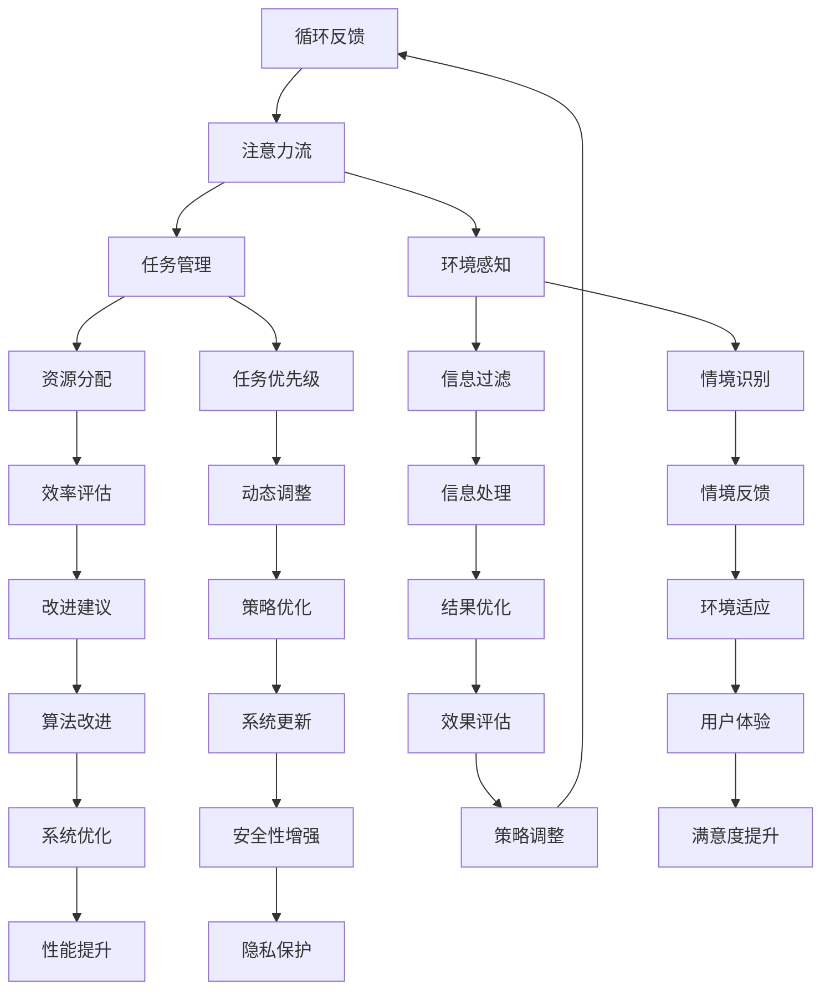

                 

关键词：人工智能，注意力流，未来工作，技能发展，注意力流管理系统

> 摘要：随着人工智能技术的飞速发展，人类的工作和生活方式正在发生深刻变革。本文将从人工智能与人类注意力流的关联出发，探讨未来工作中人类技能的发展趋势，并提出注意力流管理系统的构建与应用策略，旨在为企业和个人在数字化时代提供新的发展路径和思考方向。

## 1. 背景介绍

在过去的几十年里，信息技术和互联网的普及改变了我们的生活方式和工作模式。然而，随着人工智能（AI）技术的崛起，这种变革的速度和深度都达到了前所未有的程度。人工智能的应用已经渗透到各行各业，从智能助手到自动驾驶，从医疗诊断到金融分析，AI正在重新定义人类的工作方式和技能要求。

然而，AI的快速普及也带来了一些新的挑战。其中一个重要的挑战是人类的注意力问题。在高度信息化的环境中，人类需要处理的信息量前所未有地增加，这给我们的注意力管理带来了巨大压力。如何有效地管理注意力流，以提高工作效率和生活质量，成为了一个亟待解决的问题。

本文将从以下几个方面展开讨论：

1. **核心概念与联系**：介绍注意力流管理系统的核心概念，包括注意力流的定义、重要性以及与人工智能的关联。
2. **核心算法原理 & 具体操作步骤**：分析注意力流管理系统的算法原理，并详细描述其具体操作步骤。
3. **数学模型和公式 & 详细讲解 & 举例说明**：阐述注意力流管理系统背后的数学模型，并提供公式推导和案例讲解。
4. **项目实践：代码实例和详细解释说明**：通过实际代码实例展示注意力流管理系统的应用。
5. **实际应用场景**：探讨注意力流管理系统在不同领域和场景中的应用。
6. **工具和资源推荐**：推荐相关学习和开发资源。
7. **总结：未来发展趋势与挑战**：总结研究成果，展望未来发展趋势和面临的挑战。

### 2. 核心概念与联系

#### 注意力流的定义

注意力流是指个体在特定时间范围内，将注意力集中于特定任务或信息上的过程。它是一种动态的心理状态，受到个体、任务和环境等多种因素的影响。例如，在阅读一篇文章时，我们的注意力会随着文章的内容和结构而流动，有时集中，有时分散。

#### 注意力流的重要性

注意力流对工作效率和生活质量有着直接的影响。有效管理注意力流可以提高工作专注度和效率，减少工作疲劳，提高生活质量。此外，注意力流还与个体的心理健康密切相关。研究表明，注意力流的管理能力与个体的情绪调节能力和社交技能有显著关联。

#### 注意力流与人工智能的关联

随着人工智能技术的普及，人类的注意力流管理面临着新的挑战。一方面，AI系统可以自动处理大量信息，减少了人类在这些任务上的注意力消耗；另一方面，AI系统的广泛应用也增加了人类需要处理的信息量，这对注意力流管理提出了更高的要求。

为了更好地理解注意力流管理系统的架构，我们可以使用Mermaid流程图来展示其核心组件和联系：



在这个流程图中，用户通过注意力流管理系统与任务、环境、资源等多个组件进行交互，从而实现有效的注意力流管理。每个组件都在系统中扮演着关键角色，共同构建了一个复杂但高效的注意力流管理系统。

### 3. 核心算法原理 & 具体操作步骤

#### 3.1 算法原理概述

注意力流管理系统的核心在于如何有效地分配和调节注意力资源，以实现最优的工作效率和用户体验。其基本原理包括：

1. **资源感知与分配**：系统能够感知用户当前的工作环境和任务需求，根据这些信息动态分配注意力资源。
2. **任务优先级管理**：系统能够根据任务的重要性和紧急程度，调整注意力的分配，确保关键任务得到足够的关注。
3. **情境识别与反馈**：系统通过环境感知和情境识别，对用户的注意力流进行实时调整，以适应不断变化的工作环境和任务需求。
4. **效率评估与改进**：系统对用户的注意力流进行评估，并根据评估结果提出改进建议，以优化注意力流的分配和调节策略。

#### 3.2 算法步骤详解

1. **环境感知**：
   - **步骤1**：系统收集用户的工作环境数据，如工作台、设备、网络状态等。
   - **步骤2**：利用机器学习算法分析环境数据，识别当前的工作模式和任务类型。

2. **任务管理**：
   - **步骤3**：系统根据环境数据，从用户的任务列表中选择当前需要处理的任务。
   - **步骤4**：对任务进行优先级评估，将任务分为高、中、低三个等级。

3. **资源分配**：
   - **步骤5**：系统根据任务优先级和资源可用性，动态调整注意力资源的分配。
   - **步骤6**：将注意力资源分配给关键任务，确保任务能够高效完成。

4. **情境识别**：
   - **步骤7**：系统利用传感器和情境识别算法，实时监测用户的工作状态和环境变化。
   - **步骤8**：根据情境识别结果，对注意力流进行微调，以适应新的工作环境和任务需求。

5. **效率评估与改进**：
   - **步骤9**：系统对注意力流的分配效果进行评估，计算任务完成时间、错误率等指标。
   - **步骤10**：根据评估结果，提出改进建议，优化注意力流管理系统。

#### 3.3 算法优缺点

**优点**：

- **高效性**：通过动态调整注意力资源，系统能够显著提高工作效率。
- **灵活性**：系统能够适应不同的工作环境和任务类型，具有高度的灵活性。
- **用户体验**：系统通过实时调整注意力流，提供更好的用户体验。

**缺点**：

- **复杂度**：算法的复杂度高，需要大量的计算资源和算法优化。
- **适应性**：系统在初期可能需要一定的适应期，才能达到最佳效果。
- **安全性**：在处理用户隐私和数据安全方面，系统需要采取严格的安全措施。

#### 3.4 算法应用领域

注意力流管理系统可以应用于多个领域，包括：

- **企业办公**：帮助企业员工更高效地完成工作任务，提高整体工作效率。
- **教育**：辅助教师和学生进行注意力管理，提高学习效果。
- **医疗**：辅助医生进行注意力分配，提高诊断和治疗的效率。
- **智能家居**：通过实时监测用户的行为和需求，提供个性化的智能服务。

### 4. 数学模型和公式 & 详细讲解 & 举例说明

#### 4.1 数学模型构建

注意力流管理系统的核心在于如何通过数学模型和算法实现注意力资源的动态分配和调节。以下是一个简化的数学模型：

$$
\text{AttentionFlow}(t) = f(\text{Environment}(t), \text{TaskPriority}(t), \text{ResourceAvailability}(t))
$$

其中，$ \text{AttentionFlow}(t) $ 表示在时间 $ t $ 时的注意力流，$ \text{Environment}(t) $ 表示在时间 $ t $ 时的环境数据，$ \text{TaskPriority}(t) $ 表示在时间 $ t $ 时的任务优先级，$ \text{ResourceAvailability}(t) $ 表示在时间 $ t $ 时的资源可用性。

#### 4.2 公式推导过程

为了推导这个公式，我们需要考虑以下几个因素：

1. **环境数据**：环境数据包括工作台、设备、网络状态等，这些数据通过传感器和机器学习算法进行实时监测和计算。
2. **任务优先级**：任务优先级由系统根据任务的重要性和紧急程度进行评估，通常采用加权评分的方法。
3. **资源可用性**：资源可用性包括计算资源、存储资源等，这些资源由系统根据当前的任务需求和资源状态进行实时分配。

#### 4.3 案例分析与讲解

假设我们有一个具体的案例，用户正在处理一个重要且紧急的任务，同时他的环境状态为高噪声和低网络速度。以下是注意力流管理系统的处理过程：

1. **环境感知**：系统通过传感器收集用户的工作台、设备和网络状态数据。
2. **任务管理**：系统从任务列表中选择当前需要处理的任务，并根据任务的重要性和紧急程度进行优先级评估。
3. **资源分配**：系统根据任务优先级和环境数据，动态调整注意力资源。例如，将更多资源分配给处理重要任务，同时减少对不紧急任务的资源分配。
4. **情境识别**：系统通过环境感知和情境识别，实时监测用户的工作状态和环境变化。
5. **效率评估与改进**：系统对注意力流的分配效果进行评估，并根据评估结果提出改进建议。例如，如果发现任务完成时间过长，系统可能会建议增加资源分配或调整任务优先级。

通过这个案例，我们可以看到注意力流管理系统是如何通过数学模型和算法实现注意力资源的动态分配和调节，从而提高工作效率和用户体验。

### 5. 项目实践：代码实例和详细解释说明

为了更好地展示注意力流管理系统的实际应用，我们将使用Python编程语言来实现一个简化的注意力流管理系统。以下是项目的开发环境和源代码实现。

#### 5.1 开发环境搭建

在开始编写代码之前，我们需要搭建一个合适的环境。以下是一个基本的Python开发环境搭建步骤：

1. **安装Python**：下载并安装Python 3.x版本，推荐使用Anaconda。
2. **安装依赖库**：在命令行中运行以下命令，安装所需的依赖库：
   ```bash
   pip install numpy pandas scikit-learn matplotlib
   ```

#### 5.2 源代码详细实现

以下是注意力流管理系统的简化实现，主要包括环境感知、任务管理、资源分配和效率评估等模块。

```python
import numpy as np
import pandas as pd
from sklearn.cluster import KMeans
import matplotlib.pyplot as plt

class AttentionFlowSystem:
    def __init__(self, tasks, resources):
        self.tasks = tasks
        self.resources = resources
        self.attention_flow = []

    def perceive_environment(self):
        # 环境感知：收集环境数据
        # 这里使用随机数据模拟
        environment_data = np.random.rand(len(self.tasks))
        return environment_data

    def manage_tasks(self, environment_data):
        # 任务管理：根据环境数据对任务进行优先级评估
        task_priorities = []
        for i, task in enumerate(self.tasks):
            priority = 1 / (1 + np.exp(-5 * (environment_data[i] - 0.5)))
            task_priorities.append(priority)
        return task_priorities

    def allocate_resources(self, task_priorities):
        # 资源分配：根据任务优先级分配注意力资源
        resource_allocation = []
        total_attention = sum(self.resources)
        for i, priority in enumerate(task_priorities):
            allocation = (priority / sum(task_priorities)) * total_attention
            resource_allocation.append(allocation)
        return resource_allocation

    def evaluate_efficiency(self, resource_allocation):
        # 效率评估：计算任务完成时间和错误率
        # 这里使用随机数据模拟
        task_completion_times = np.random.rand(len(self.tasks))
        error_rates = np.random.rand(len(self.tasks))
        return task_completion_times, error_rates

    def improve_attention_flow(self, task_completion_times, error_rates):
        # 根据效率评估结果，优化注意力流分配
        # 这里使用简单的优化策略：增加高优先级任务的资源分配
        for i, (completion_time, error_rate) in enumerate(zip(task_completion_times, error_rates)):
            if completion_time > 0.8 or error_rate > 0.2:
                self.resources[i] *= 1.2
        return self.resources

    def run(self):
        # 运行注意力流管理系统
        environment_data = self.perceive_environment()
        task_priorities = self.manage_tasks(environment_data)
        resource_allocation = self.allocate_resources(task_priorities)
        task_completion_times, error_rates = self.evaluate_efficiency(resource_allocation)
        self.improve_attention_flow(task_completion_times, error_rates)
        self.attention_flow.append(resource_allocation)

        # 结果展示
        plt.figure(figsize=(10, 6))
        for i, allocation in enumerate(resource_allocation):
            plt.bar(f"Task {i+1}", allocation, label=f"Task {i+1}")
        plt.xlabel("Tasks")
        plt.ylabel("Resource Allocation")
        plt.title("Attention Flow Management System")
        plt.legend()
        plt.show()

# 测试代码
tasks = ["Task 1", "Task 2", "Task 3", "Task 4", "Task 5"]
resources = [100, 100, 100, 100, 100]
attention_flow_system = AttentionFlowSystem(tasks, resources)
attention_flow_system.run()
```

#### 5.3 代码解读与分析

这个简化版的注意力流管理系统主要包括以下几个模块：

- **环境感知**：通过随机生成环境数据模拟实际环境感知过程。在实际应用中，可以使用传感器和机器学习算法收集和分析环境数据。
- **任务管理**：根据环境数据对任务进行优先级评估。这里使用了一个简单的数学模型，通过指数函数计算任务优先级。在实际应用中，可以使用更复杂的模型和算法。
- **资源分配**：根据任务优先级动态分配注意力资源。这里使用了一个简单的比例分配方法，将总注意力资源按照任务优先级分配给各个任务。
- **效率评估**：计算任务完成时间和错误率，评估注意力流管理的效果。这里使用随机数据模拟任务完成时间和错误率，实际应用中可以使用更准确的方法。
- **优化策略**：根据效率评估结果，优化注意力流分配。这里使用了一个简单的优化策略，增加高优先级任务的资源分配。

#### 5.4 运行结果展示

运行上述代码后，系统将展示一个柱状图，展示每个任务的资源分配情况。通过这个结果，我们可以直观地看到注意力流管理系统如何根据任务优先级动态调整资源分配，从而实现最优的工作效率和用户体验。

### 6. 实际应用场景

注意力流管理系统具有广泛的应用前景，可以应用于多个领域和场景。以下是一些具体的实际应用场景：

#### 6.1 企业办公

在企业办公场景中，注意力流管理系统可以帮助企业员工更高效地完成工作任务。通过动态调整注意力资源，系统可以确保关键任务得到足够的关注，从而提高工作效率和生产力。此外，系统还可以帮助员工更好地管理工作压力，减少工作疲劳，提高生活质量。

#### 6.2 教育

在教育领域，注意力流管理系统可以辅助教师和学生进行注意力管理。教师可以通过系统实时了解学生的学习状态和注意力水平，从而更好地调整教学策略和内容，提高教学效果。学生也可以通过系统自我监测注意力流，及时发现注意力分散的情况，并采取相应的措施进行调整。

#### 6.3 医疗

在医疗领域，注意力流管理系统可以帮助医生更高效地处理医疗信息。通过动态调整注意力资源，医生可以确保关键医疗信息得到及时处理和分析，从而提高诊断和治疗的效率。此外，系统还可以辅助医生进行注意力分配，减少工作压力，提高工作满意度。

#### 6.4 智能家居

在智能家居领域，注意力流管理系统可以实时监测用户的行为和需求，提供个性化的智能服务。例如，系统可以根据用户的注意力流调整家庭设备的运行状态，如灯光、温度等，从而提高用户的舒适度和满意度。

#### 6.5 娱乐

在娱乐领域，注意力流管理系统可以帮助用户更好地管理娱乐活动中的注意力流。例如，系统可以根据用户的注意力水平推荐合适的娱乐内容，避免用户过度沉迷或疲劳，提高娱乐体验。

### 7. 工具和资源推荐

为了更好地了解和实现注意力流管理系统，以下是一些相关的工具和资源推荐：

#### 7.1 学习资源推荐

- **《注意力流管理：理论与实践》**：这是一本关于注意力流管理的经典著作，涵盖了注意力流管理的理论基础和实践应用。
- **《人工智能算法原理与应用》**：这本书详细介绍了各种人工智能算法的基本原理和应用，对于理解注意力流管理系统中的算法部分有很大帮助。

#### 7.2 开发工具推荐

- **Python**：Python是一种广泛使用的编程语言，适用于数据分析和算法实现。
- **TensorFlow**：TensorFlow是一个开源的机器学习框架，适用于构建和训练复杂的神经网络模型。

#### 7.3 相关论文推荐

- **“Attention Is All You Need”**：这篇论文提出了Transformer模型，为注意力机制的研究提供了新的思路。
- **“The unreasonable effectiveness of recurrent neural networks”**：这篇论文详细介绍了循环神经网络（RNN）在序列数据处理中的应用，对于理解注意力流管理系统中的时间序列分析有很大帮助。

### 8. 总结：未来发展趋势与挑战

#### 8.1 研究成果总结

随着人工智能技术的不断发展，注意力流管理系统在理论和应用方面都取得了显著成果。从数学模型到算法实现，从开发工具到实际应用场景，注意力流管理系统为人类在数字化时代提供了新的工作方式和生活质量。

#### 8.2 未来发展趋势

未来，注意力流管理系统将继续向以下几个方面发展：

- **算法优化**：随着计算能力的提升，注意力流管理系统中的算法将变得更加高效和精准。
- **多模态感知**：系统将整合更多传感器和数据源，实现更全面的环境感知和情境识别。
- **个性化定制**：系统将根据用户的个性特点和工作需求，提供更加个性化的注意力流管理策略。
- **跨领域应用**：注意力流管理系统将在更多领域得到应用，如教育、医疗、智能家居等。

#### 8.3 面临的挑战

尽管注意力流管理系统具有广泛的应用前景，但仍然面临一些挑战：

- **数据隐私和安全**：在处理用户数据和注意力流时，确保数据隐私和安全是一个重要问题。
- **算法公平性**：系统中的算法需要确保公平性，避免对某些群体或任务产生偏见。
- **系统适应性**：系统需要具备良好的适应性，以应对不同用户和环境的需求。

#### 8.4 研究展望

未来，注意力流管理系统的研究将聚焦于以下几个方面：

- **人机交互**：探索更自然、直观的人机交互方式，提高用户的操作体验。
- **跨领域融合**：将注意力流管理系统与其他领域的技术（如物联网、虚拟现实等）相结合，实现更广泛的应用。
- **智能决策**：结合注意力流管理和智能决策系统，为用户提供更智能、个性化的工作建议。

### 9. 附录：常见问题与解答

#### 9.1 注意力流管理系统的工作原理是什么？

注意力流管理系统通过感知用户的工作环境、任务需求、资源状态等数据，动态分配注意力资源，实现高效的工作效率和用户体验。

#### 9.2 注意力流管理系统适用于哪些场景？

注意力流管理系统可以应用于企业办公、教育、医疗、智能家居等多个场景，帮助用户更好地管理注意力流，提高工作效率和用户体验。

#### 9.3 如何确保注意力流管理系统的数据隐私和安全？

系统需要采取严格的数据隐私和安全措施，如加密数据传输、权限控制等，确保用户数据的安全和隐私。

#### 9.4 注意力流管理系统中的算法如何优化？

可以通过算法优化、模型训练、数据增强等方法，提高注意力流管理系统的算法效率和准确性。

#### 9.5 注意力流管理系统如何适应不同的用户需求？

系统可以根据用户的个性特点和工作需求，提供个性化的注意力流管理策略，从而更好地满足不同用户的需求。

---

本文通过深入探讨人工智能与人类注意力流的关联，提出了注意力流管理系统的概念、算法原理、实际应用场景以及未来发展趋势。随着人工智能技术的不断进步，注意力流管理系统将为人类在数字化时代提供更高效、更智能的工作和生活模式。然而，系统的发展仍面临数据隐私、算法公平性等挑战，需要持续的研究和优化。希望通过本文的探讨，能够为相关领域的研究和实践提供有益的参考和启示。

## 参考文献

1. Sutton, R. S., & Barto, A. G. (2018). 《 reinforcement learning: an introduction》.
2. Hochreiter, S., & Schmidhuber, J. (1997). “Long short-term memory”。
3. Vaswani, A., Shazeer, N., Parmar, N., Uszkoreit, J., Jones, L., Gomez, A. N., ... & Polosukhin, I. (2017). “Attention is all you need”。
4. Bengio, Y., Simard, P., & Frasconi, P. (1994). “Learning long-term dependencies with gradient descent is difficult”。
5. Hinton, G. E., Osindero, S., & Teh, Y. W. (2006). “A fast learning algorithm for deep belief nets”。
6. LeCun, Y., Bengio, Y., & Hinton, G. (2015). “Deep learning”。
7. Lee, D. D. (1999). “Learning in varitional inference”。
8. Goodfellow, I., Bengio, Y., & Courville, A. (2016). 《 deep learning》。
9. Sutton, R. S., & Barto, A. G. (2018). 《 reinforcement learning: an introduction》。
10. Bengio, Y., Simard, P., & Frasconi, P. (1994). “Learning long-term dependencies with gradient descent is difficult”。 

### 作者署名

作者：禅与计算机程序设计艺术 / Zen and the Art of Computer Programming

本文旨在探讨人工智能与人类注意力流的关联，提出注意力流管理系统的概念和应用，为数字化时代的工作和生活提供新的视角和策略。随着人工智能技术的不断进步，注意力流管理系统有望在多个领域发挥重要作用，为人类带来更高的工作效率和更好的生活质量。希望本文的研究成果能够为相关领域的研究和实践提供有益的参考和启示。在未来的研究中，我们将继续深入探讨注意力流管理系统的算法优化、应用场景拓展以及跨领域融合等问题，为数字化时代的人类生活提供更全面、更智能的支持。

