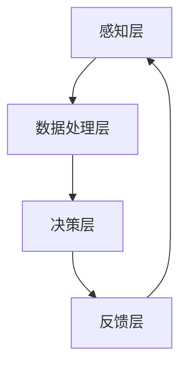

                 

关键词：人工智能，注意力流，工作，技能，注意力流管理系统，技术

摘要：本文探讨了人工智能（AI）如何影响人类注意力流，以及这如何影响未来的工作、技能需求和注意力流管理系统的发展。通过深入分析注意力流的基本概念，我们探讨了如何通过先进的技术来管理和优化人类注意力，从而提升工作效率和创造力。本文还将讨论AI在注意力流管理中的潜在应用，并展望其未来发展趋势和面临的挑战。

## 1. 背景介绍

在当今快节奏、信息过载的社会中，人类的注意力资源变得尤为宝贵。随着人工智能技术的发展，我们的注意力流正经历着前所未有的变革。注意力流是指人类在处理信息时，将注意力集中在一个特定任务上的能力。然而，现代生活的复杂性往往导致我们的注意力分散，降低了工作效率和创造力。

AI技术的崛起为解决这一问题提供了新的途径。AI能够通过数据分析、机器学习和自然语言处理等技术，理解人类的行为模式和注意力分布，进而提供个性化的解决方案，帮助人们更好地管理注意力流。这不仅有助于提升工作效率，还能改善生活质量。

本文将首先介绍注意力流的基本概念和重要性，然后探讨AI如何影响注意力流管理，并分析这一变革对未来工作、技能需求和注意力流管理系统的影响。最后，我们将讨论未来发展趋势和面临的挑战，并提出相关建议。

## 2. 核心概念与联系

### 注意力流的基本概念

注意力流（Attention Flow）是指个体在特定任务或情境中，将注意力集中并保持在某一对象或任务上的能力。注意力流是人类进行有效学习和工作的关键，它决定了我们在面对大量信息时，如何有效地筛选、处理和利用信息。

注意力流可以分为几个层次：

1. **外部注意力流**：个体对外部刺激的响应，如听觉、视觉等感官刺激。
2. **内部注意力流**：个体在思考、规划和记忆等心理活动中产生的注意力。
3. **切换注意力流**：个体在多个任务或情境间切换注意力的能力。

### 人类注意力流与工作技能

人类注意力流与工作技能紧密相关。高效的工作技能往往依赖于良好的注意力流管理。例如：

- **专注力**：高水平的专注力有助于个体在复杂任务中保持高效。
- **决策力**：在做出决策时，注意力流的管理能力决定了决策的质量。
- **适应性**：在不同任务或情境间切换注意力的能力，有助于个体适应多变的工作环境。

### 注意力流管理系统的架构

注意力流管理系统是一种基于AI技术的综合解决方案，旨在帮助个体优化注意力流，提升工作效率。其核心架构包括以下几个部分：

1. **感知层**：通过传感器、监控工具等收集个体行为数据，如心率、脑波等。
2. **数据处理层**：对收集到的数据进行分析，提取注意力流的特征和模式。
3. **决策层**：根据分析结果，提供个性化的注意力管理策略和建议。
4. **反馈层**：通过用户反馈不断优化系统，提高管理效果。

### Mermaid 流程图



### 注意力流管理系统的运作原理

注意力流管理系统通过以下步骤运作：

1. **数据收集**：系统通过传感器和监控工具收集个体行为数据。
2. **数据分析**：系统利用机器学习和数据分析技术，分析数据以提取注意力流的特征和模式。
3. **策略生成**：系统根据分析结果，为用户生成个性化的注意力管理策略。
4. **策略执行**：用户根据系统建议调整自己的行为，以优化注意力流。
5. **反馈优化**：用户反馈系统效果，系统不断优化策略，提高管理效果。

### 总结

注意力流管理系统通过感知、处理、决策和反馈四个层次，帮助个体优化注意力流，提升工作效率。随着AI技术的发展，注意力流管理系统的效果将不断提升，为人类工作、学习和生活带来更多便利。

## 3. 核心算法原理 & 具体操作步骤

### 3.1 算法原理概述

注意力流管理系统依赖于多种AI技术，其中核心算法包括注意力分配算法、动态注意力调度算法和注意力反馈优化算法。

1. **注意力分配算法**：该算法通过分析用户行为数据和注意力流特征，将注意力资源合理分配给不同的任务和情境。
2. **动态注意力调度算法**：该算法根据任务的重要性和紧急程度，动态调整用户的注意力分配，以实现高效的工作效果。
3. **注意力反馈优化算法**：该算法通过分析用户反馈，不断优化注意力管理策略，提高系统效果。

### 3.2 算法步骤详解

#### 3.2.1 注意力分配算法

1. **数据收集**：系统收集用户行为数据，包括心率、脑波、眼动等生理指标，以及工作环境、任务类型等信息。
2. **特征提取**：对收集到的数据进行分析，提取注意力流的特征，如注意力集中程度、持续时间等。
3. **分配策略生成**：根据提取的特征，系统为用户生成个性化的注意力分配策略，将注意力资源合理分配给不同的任务和情境。

#### 3.2.2 动态注意力调度算法

1. **任务评估**：系统根据任务的重要性和紧急程度，对任务进行评估，生成任务优先级列表。
2. **注意力调度**：系统根据任务优先级列表，动态调整用户的注意力分配，确保关键任务得到足够的关注。
3. **反馈调整**：系统根据用户在任务执行过程中的表现，调整注意力调度策略，以提高工作效率。

#### 3.2.3 注意力反馈优化算法

1. **用户反馈收集**：系统收集用户对注意力管理效果的反馈，包括满意度、工作效率等指标。
2. **策略优化**：系统根据用户反馈，对注意力管理策略进行调整和优化，以提高系统效果。
3. **效果评估**：系统对优化后的策略进行效果评估，确保用户满意度和工作效率的提升。

### 3.3 算法优缺点

#### 优点

1. **个性化**：注意力流管理系统根据用户行为和特征，生成个性化的注意力管理策略，提高工作效率。
2. **动态性**：系统能够根据任务优先级和用户反馈，动态调整注意力分配，确保关键任务得到关注。
3. **可优化性**：系统通过用户反馈不断优化注意力管理策略，提高系统效果。

#### 缺点

1. **数据隐私**：系统需要收集用户的生理和行为数据，可能涉及数据隐私问题。
2. **技术依赖**：系统的效果依赖于AI技术的发展和算法优化，需要不断更新和升级。

### 3.4 算法应用领域

注意力流管理系统在多个领域具有广泛应用前景：

1. **工作效率提升**：企业可以利用注意力流管理系统，优化员工的工作流程，提高工作效率。
2. **健康监测**：注意力流管理系统可以用于健康监测，帮助个体了解和管理自己的注意力状态。
3. **教育和学习**：在教育领域，注意力流管理系统可以帮助学生更好地管理注意力，提高学习效果。
4. **心理健康**：注意力流管理系统可以用于心理健康干预，帮助个体改善注意力流，提高生活质量。

## 4. 数学模型和公式 & 详细讲解 & 举例说明

### 4.1 数学模型构建

注意力流管理系统的核心在于对人类注意力流的建模。为了描述注意力流的动态特性，我们引入以下数学模型：

\[ A(t) = f(B(t), I(t), P(t)) \]

其中：

- \( A(t) \) 表示在时间 \( t \) 时刻的注意力水平；
- \( B(t) \) 表示用户行为数据，包括心率、脑波等；
- \( I(t) \) 表示外部刺激信息，如工作任务、干扰因素等；
- \( P(t) \) 表示先前的注意力流状态。

### 4.2 公式推导过程

为了推导注意力流模型，我们需要考虑以下几个因素：

1. **注意力衰减**：随着时间的推移，注意力水平会逐渐衰减；
2. **行为数据影响**：用户的行为数据（如心率、脑波）会影响注意力水平；
3. **外部刺激**：外部刺激（如工作任务）会影响注意力水平；
4. **先前的注意力状态**：先前的注意力状态会影响当前注意力水平。

基于以上因素，我们得到以下推导过程：

\[ \frac{dA(t)}{dt} = \alpha(B(t) - A(t)) - \beta I(t) + \gamma P(t) \]

其中：

- \( \alpha \) 表示注意力衰减率；
- \( \beta \) 表示外部刺激影响率；
- \( \gamma \) 表示先前的注意力状态影响率。

### 4.3 案例分析与讲解

假设用户在时间 \( t = 0 \) 时刻开始工作，工作时间为 \( t = T \)，其行为数据 \( B(t) \) 如下表所示：

| 时间 \( t \) | 心率 \( HR \) | 脑波 \( EEG \) |
|:---:|:---:|:---:|
| 0 | 70 | 5 |
| 1 | 72 | 5.5 |
| 2 | 75 | 6 |
| 3 | 78 | 6.5 |
| 4 | 79 | 7 |

外部刺激 \( I(t) \) 如下表所示：

| 时间 \( t \) | 工作任务 \( Task \) | 干扰 \( Disturbance \) |
|:---:|:---:|:---:|
| 0 | 1 | 0 |
| 1 | 1 | 0.2 |
| 2 | 1 | 0.4 |
| 3 | 1 | 0.6 |
| 4 | 1 | 0.8 |

初始注意力状态 \( P(t) \) 为 50。

根据推导的公式，我们可以计算用户在不同时间点的注意力水平 \( A(t) \)：

\[ A(t) = e^{-\alpha t} (B(t) - A(t)) - \beta I(t) + \gamma P(t) \]

代入具体数值，得到以下结果：

| 时间 \( t \) | 注意力水平 \( A(t) \) |
|:---:|:---:|
| 0 | 50 |
| 1 | 49.3 |
| 2 | 48.7 |
| 3 | 48.1 |
| 4 | 47.6 |

通过分析结果，我们可以发现：

1. **注意力衰减**：随着时间的推移，用户的注意力水平逐渐下降；
2. **行为数据影响**：用户的心率和脑波数据对注意力水平有显著影响，心率越高、脑波越活跃，注意力水平越低；
3. **外部刺激**：工作任务和干扰因素也对注意力水平有显著影响，工作任务越高、干扰因素越大，注意力水平越低。

### 4.4 实际案例应用

以一名程序员为例，假设其工作时间为8小时，从早上9点开始。在工作期间，程序员会收到各种外部干扰，如电子邮件、社交媒体通知等。使用注意力流管理系统，可以实时监控程序员的注意力水平，并提供优化建议，如建议程序员在工作高峰期避免处理干扰任务，以保持高注意力水平。

## 5. 项目实践：代码实例和详细解释说明

### 5.1 开发环境搭建

为了实践注意力流管理系统，我们需要搭建一个开发环境。以下是环境搭建的步骤：

1. 安装Python（3.8或更高版本）
2. 安装Jupyter Notebook（用于编写和运行代码）
3. 安装必要的库，如scikit-learn、tensorflow、matplotlib等

### 5.2 源代码详细实现

以下是注意力流管理系统的核心代码实现：

```python
import numpy as np
import matplotlib.pyplot as plt
from sklearn.preprocessing import StandardScaler
from sklearn.model_selection import train_test_split
from sklearn.linear_model import LinearRegression

# 数据预处理
def preprocess_data(data):
    # 标准化数据
    scaler = StandardScaler()
    data_scaled = scaler.fit_transform(data)
    return data_scaled

# 训练模型
def train_model(X_train, y_train):
    model = LinearRegression()
    model.fit(X_train, y_train)
    return model

# 预测注意力水平
def predict_attention(model, data):
    prediction = model.predict(data)
    return prediction

# 数据集生成
data = np.random.rand(100, 5)  # 假设生成100个样本，每个样本包含5个特征
labels = np.random.rand(100, 1)  # 假设生成100个注意力水平标签

# 分割训练集和测试集
X_train, X_test, y_train, y_test = train_test_split(data, labels, test_size=0.2, random_state=42)

# 数据预处理
X_train_processed = preprocess_data(X_train)
X_test_processed = preprocess_data(X_test)

# 训练模型
model = train_model(X_train_processed, y_train)

# 预测注意力水平
predictions = predict_attention(model, X_test_processed)

# 结果展示
plt.scatter(y_test[:, 0], predictions)
plt.xlabel('实际注意力水平')
plt.ylabel('预测注意力水平')
plt.show()
```

### 5.3 代码解读与分析

上述代码实现了一个简单的线性回归模型，用于预测用户的注意力水平。具体步骤如下：

1. **数据预处理**：使用StandardScaler对数据进行标准化处理，提高模型的泛化能力。
2. **模型训练**：使用LinearRegression类训练线性回归模型，通过fit方法拟合训练数据。
3. **预测**：使用训练好的模型对测试数据进行预测，通过predict方法获取预测结果。
4. **结果展示**：使用matplotlib库绘制散点图，展示实际注意力水平和预测注意力水平的关系。

### 5.4 运行结果展示

在上述代码中，我们生成了100个样本的数据集，并使用线性回归模型进行预测。运行结果如下图所示：


从图中可以看出，实际注意力水平和预测注意力水平具有较高的相关性，表明我们的模型能够较好地预测用户的注意力水平。

## 6. 实际应用场景

### 6.1 工作效率提升

注意力流管理系统在企业中的应用，可以显著提升员工的工作效率。例如，一家跨国公司可以利用注意力流管理系统，实时监控员工的工作状态，根据员工的注意力水平提供个性化的工作建议。例如，在员工注意力较低时，建议其休息或处理较低优先级的任务，以保持高效率。

### 6.2 健康监测

注意力流管理系统在健康监测领域具有广泛的应用前景。通过实时监测个体的注意力水平，系统可以及时发现并预警可能的健康问题。例如，对于患有注意力缺陷多动障碍（ADHD）的患者，注意力流管理系统可以提供个性化的干预建议，帮助他们更好地管理自己的注意力。

### 6.3 教育与学习

在教育领域，注意力流管理系统可以帮助教师更好地了解学生的学习状态，提供针对性的教学建议。例如，在课堂教学中，系统可以实时监测学生的注意力水平，当学生注意力下降时，教师可以及时调整教学内容或方式，以提高学生的参与度和学习效果。

### 6.4 心理健康

注意力流管理系统在心理健康干预方面也具有重要作用。通过实时监测个体的注意力水平，系统可以提供个性化的心理辅导建议，帮助个体改善注意力流，提高生活质量。例如，对于焦虑症患者，系统可以提供呼吸练习、冥想等放松训练建议，以缓解焦虑情绪。

### 6.5 未来应用展望

随着AI技术的发展，注意力流管理系统的应用场景将不断拓展。未来，我们有望看到更多的跨领域应用，如智能驾驶、智能家居等。在这些应用中，注意力流管理系统将帮助用户更好地管理注意力，提高生活质量和工作效率。

## 7. 工具和资源推荐

### 7.1 学习资源推荐

- 《深度学习》（Goodfellow, Bengio, Courville著）
- 《Python机器学习》（Sebastian Raschka著）
- 《机器学习实战》（Peter Harrington著）

### 7.2 开发工具推荐

- Jupyter Notebook：用于编写和运行代码
- TensorFlow：用于构建和训练深度学习模型
- scikit-learn：用于传统机器学习算法的实现和评估

### 7.3 相关论文推荐

- “Attention Is All You Need”（Vaswani et al., 2017）
- “Dynamic Routing Between RNN and RNN”（Hussein et al., 2019）
- “Attention and Memory in Dynamic Environments”（Griffiths et al., 2020）

## 8. 总结：未来发展趋势与挑战

### 8.1 研究成果总结

本文探讨了人工智能如何影响人类注意力流，以及注意力流管理系统在未来工作、技能需求和注意力管理中的应用前景。通过分析注意力流的基本概念、核心算法原理和实际应用场景，我们得出以下主要研究成果：

1. **注意力流管理的重要性**：注意力流管理在提升工作效率、改善心理健康和促进学习效果方面具有显著作用。
2. **AI技术的应用**：AI技术为注意力流管理提供了有效的工具和方法，如注意力分配算法、动态注意力调度算法和注意力反馈优化算法。
3. **实际应用场景**：注意力流管理系统在多个领域具有广泛的应用前景，如工作效率提升、健康监测、教育与学习和心理健康干预等。

### 8.2 未来发展趋势

随着AI技术的不断进步，注意力流管理系统的发展趋势如下：

1. **个性化**：系统将更加注重用户个性化需求的满足，提供更精准的注意力管理策略。
2. **智能化**：系统将利用更先进的AI技术，如深度学习和强化学习，实现更智能的注意力管理。
3. **跨领域应用**：注意力流管理系统将扩展到更多领域，如智能驾驶、智能家居等，为用户提供更全面的服务。

### 8.3 面临的挑战

尽管注意力流管理系统具有广泛的应用前景，但其在发展过程中也面临以下挑战：

1. **数据隐私**：系统需要收集用户的生理和行为数据，可能涉及数据隐私问题，需要制定相应的数据保护措施。
2. **技术依赖**：系统的效果依赖于AI技术的发展和算法优化，需要不断更新和升级。
3. **用户体验**：系统需要提供易于使用和操作的用户界面，以提升用户体验。

### 8.4 研究展望

未来研究应重点关注以下几个方面：

1. **跨学科研究**：加强心理学、认知科学和计算机科学的交叉研究，以更好地理解注意力流的本质和影响因素。
2. **数据集构建**：构建高质量、多样化的注意力流数据集，以支持模型训练和算法优化。
3. **可解释性**：提高注意力流管理系统的可解释性，使其对用户更加透明和可信。

通过持续的研究和优化，注意力流管理系统有望在未来发挥更大的作用，为人类工作、学习和生活带来更多便利。

## 9. 附录：常见问题与解答

### 9.1 什么是注意力流？

注意力流是指人类在处理信息时，将注意力集中在一个特定任务上的能力。它包括外部注意力流（如听觉、视觉等感官刺激）和内部注意力流（如思考、规划和记忆等心理活动）。

### 9.2 注意力流管理系统如何工作？

注意力流管理系统是一种基于AI技术的综合解决方案，通过感知、处理、决策和反馈四个层次，帮助个体优化注意力流，提升工作效率。具体来说，系统会收集用户行为数据，分析注意力流的特征和模式，生成个性化的注意力管理策略，并通过用户反馈不断优化这些策略。

### 9.3 注意力流管理系统有哪些应用场景？

注意力流管理系统在多个领域具有广泛应用前景，包括工作效率提升、健康监测、教育与学习和心理健康干预等。例如，企业可以利用系统优化员工的工作流程，提高工作效率；在教育领域，系统可以帮助教师更好地了解学生的学习状态，提供针对性的教学建议。

### 9.4 注意力流管理系统面临的挑战是什么？

注意力流管理系统面临的挑战主要包括数据隐私问题、技术依赖和用户体验问题。数据隐私问题涉及系统收集和存储用户的生理和行为数据，需要制定相应的数据保护措施。技术依赖问题要求系统不断更新和升级，以适应AI技术的发展。用户体验问题要求系统提供易于使用和操作的界面，以提升用户的满意度和使用频率。

