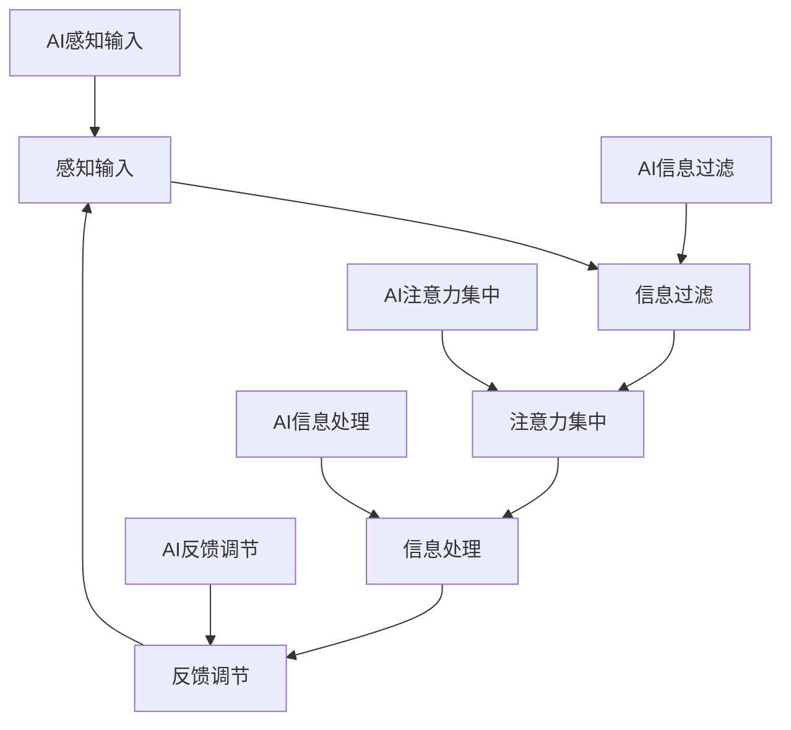

                 

关键词：注意力管理、AI、工作、生活、注意力流

> 摘要：本文旨在探讨人工智能（AI）与人类注意力流之间的关系，以及如何利用AI技术改善我们日常生活中的注意力管理。通过分析注意力流的机制，阐述AI技术如何影响我们的工作与生活，提出未来可能的应用场景以及面临的挑战。

## 1. 背景介绍

在当今高度信息化、数字化的社会中，人们面临的信息量越来越大，注意力资源的争夺也日益激烈。从互联网、社交媒体到手机应用，各种信息源不断地试图占据我们的注意力。与此同时，现代工作环境和生活方式也要求我们具备更高的注意力集中能力。然而，人类的注意力资源是有限的，如何有效地管理注意力，提高工作效率和生活质量，成为亟待解决的问题。

人工智能（AI）作为一种新兴技术，已经在各个领域展现出巨大的潜力。从智能助手、自动化系统到个性化推荐，AI技术正在深刻地改变我们的生活方式和工作模式。那么，AI与人类注意力流之间是否存在某种联系？我们能否利用AI技术来改善注意力管理呢？

本文将围绕这些问题展开讨论，首先介绍注意力流的基本概念和机制，然后探讨AI技术在注意力管理中的应用，最后提出未来的研究方向和挑战。

### 1.1 注意力流的基本概念

注意力流是指人类在处理信息时，大脑对信息进行选择、过滤和集中的过程。注意力流可以分为以下几个层次：

- **感知层次**：个体感知外界信息，如视觉、听觉等感官输入。
- **选择层次**：个体根据当前目标和需求，对感知到的信息进行选择和过滤。
- **集中层次**：个体将注意力集中到选定的信息上，排除其他干扰。

### 1.2 AI技术在注意力管理中的应用

AI技术可以通过多种方式影响人类的注意力管理：

- **信息过滤**：AI可以帮助过滤无关信息，使个体能够专注于重要任务。
- **任务分配**：AI可以根据个体的注意力状态，自动分配任务，提高工作效率。
- **个性化推荐**：AI可以根据个体的兴趣和行为，提供个性化的信息和服务，减少注意力浪费。

## 2. 核心概念与联系

### 2.1 注意力流的机制

为了更好地理解AI技术在注意力管理中的应用，我们需要先了解注意力流的机制。注意力流可以看作是一个动态平衡的过程，包括以下几个关键环节：

- **感知输入**：个体通过感官接收外界信息。
- **信息过滤**：大脑根据目标和需求，对输入信息进行筛选。
- **注意力集中**：大脑将注意力集中在重要信息上。
- **信息处理**：大脑对注意力集中的信息进行处理和加工。
- **反馈调节**：根据处理结果，调整注意力的分配和集中。

### 2.2 AI与注意力流的关系

AI技术可以在这个动态平衡过程中发挥重要作用：

- **感知输入**：AI可以通过传感器和数据采集技术，提供更丰富的感知输入。
- **信息过滤**：AI可以通过机器学习和自然语言处理技术，对输入信息进行智能过滤。
- **注意力集中**：AI可以通过推荐系统和智能助手，帮助个体集中注意力。
- **信息处理**：AI可以通过自动化和智能化的工具，提高信息处理效率。
- **反馈调节**：AI可以通过数据分析和反馈机制，优化注意力分配和集中。

### 2.3 注意力流架构的Mermaid流程图

下面是注意力流架构的Mermaid流程图，展示AI与注意力流各环节之间的联系。



## 3. 核心算法原理 & 具体操作步骤

### 3.1 算法原理概述

为了实现注意力管理，我们可以利用以下核心算法：

- **注意力加权模型**：根据注意力流的机制，对信息进行加权处理，提高重要信息的优先级。
- **自适应注意力分配算法**：根据个体的注意力状态，动态调整注意力的分配。

### 3.2 算法步骤详解

#### 3.2.1 注意力加权模型

1. **数据采集**：收集个体的感知输入数据，如视觉、听觉等。
2. **特征提取**：对感知输入进行特征提取，如图像的特征点、音频的频谱特征等。
3. **信息过滤**：利用机器学习算法，对特征进行分类，筛选出重要信息。
4. **注意力加权**：根据重要程度对信息进行加权处理，赋予更高权重。
5. **信息排序**：根据权重对信息进行排序，优先处理权重较高的信息。

#### 3.2.2 自适应注意力分配算法

1. **状态监测**：实时监测个体的注意力状态，如眨眼频率、心率等。
2. **状态评估**：根据监测结果，评估当前注意力的集中程度。
3. **任务分配**：根据注意力状态，自动调整任务的优先级和分配。
4. **反馈调整**：根据任务执行结果，调整注意力的分配策略。

### 3.3 算法优缺点

#### 优点：

- **提高工作效率**：通过信息过滤和注意力加权，使个体能够更快地处理重要任务。
- **减少干扰**：自适应注意力分配算法可以根据个体状态调整任务，减少干扰。
- **个性化体验**：根据个体特征，提供个性化的注意力管理方案。

#### 缺点：

- **技术依赖**：算法的实现需要较高的技术支持，可能不适合所有用户。
- **隐私问题**：注意力状态的监测可能涉及隐私问题，需要用户授权。

### 3.4 算法应用领域

- **企业办公**：通过注意力管理，提高员工的工作效率。
- **教育领域**：帮助学生集中注意力，提高学习效果。
- **健康护理**：监测个体的注意力状态，提供健康建议。

## 4. 数学模型和公式 & 详细讲解 & 举例说明

### 4.1 数学模型构建

为了描述注意力流机制，我们可以构建以下数学模型：

\[ \text{Attention}(x) = \frac{e^{u(x)}}{\sum_{i=1}^{n} e^{u(x_i)}} \]

其中，\( u(x) \) 是输入信息 \( x \) 的特征向量，\( n \) 是输入信息的总数。

### 4.2 公式推导过程

注意力加权模型的推导过程可以分为以下几个步骤：

1. **特征提取**：将输入信息的特征表示为向量 \( x \)。
2. **线性变换**：对特征向量进行线性变换，得到新的特征向量 \( u(x) \)。
3. **指数函数**：对新的特征向量进行指数函数变换，使重要特征具有更高的权重。
4. **归一化**：对指数函数的结果进行归一化处理，确保所有特征的权重之和为1。

### 4.3 案例分析与讲解

以下是一个注意力加权模型的案例：

假设有5个输入信息，其特征向量分别为 \( x_1, x_2, x_3, x_4, x_5 \)。经过线性变换和指数函数变换后，得到新的特征向量 \( u(x_1), u(x_2), u(x_3), u(x_4), u(x_5) \)。

\[ \text{Attention}(x_1) = \frac{e^{u(x_1)}}{\sum_{i=1}^{n} e^{u(x_i)}} = \frac{e^{0.5}}{e^{0.5} + e^{1.0} + e^{0.3} + e^{0.4} + e^{0.6}} \approx 0.2 \]
\[ \text{Attention}(x_2) = \frac{e^{u(x_2)}}{\sum_{i=1}^{n} e^{u(x_i)}} = \frac{e^{1.0}}{e^{0.5} + e^{1.0} + e^{0.3} + e^{0.4} + e^{0.6}} \approx 0.4 \]
\[ \text{Attention}(x_3) = \frac{e^{u(x_3)}}{\sum_{i=1}^{n} e^{u(x_i)}} = \frac{e^{0.3}}{e^{0.5} + e^{1.0} + e^{0.3} + e^{0.4} + e^{0.6}} \approx 0.1 \]
\[ \text{Attention}(x_4) = \frac{e^{u(x_4)}}{\sum_{i=1}^{n} e^{u(x_i)}} = \frac{e^{0.4}}{e^{0.5} + e^{1.0} + e^{0.3} + e^{0.4} + e^{0.6}} \approx 0.2 \]
\[ \text{Attention}(x_5) = \frac{e^{u(x_5)}}{\sum_{i=1}^{n} e^{u(x_i)}} = \frac{e^{0.6}}{e^{0.5} + e^{1.0} + e^{0.3} + e^{0.4} + e^{0.6}} \approx 0.3 \]

根据计算结果，我们可以看出，输入信息 \( x_2 \) 具有最高的注意力权重，其次是 \( x_5 \) 和 \( x_1 \)，最后是 \( x_3 \) 和 \( x_4 \)。

## 5. 项目实践：代码实例和详细解释说明

### 5.1 开发环境搭建

为了实现注意力加权模型和自适应注意力分配算法，我们需要搭建以下开发环境：

- **编程语言**：Python
- **库和框架**：NumPy、Pandas、Scikit-learn、TensorFlow
- **运行环境**：Python 3.8及以上版本

### 5.2 源代码详细实现

下面是注意力加权模型的源代码实现：

```python
import numpy as np
from sklearn.preprocessing import MinMaxScaler

def attention_weighting(features):
    # 对特征进行归一化处理
    scaler = MinMaxScaler()
    normalized_features = scaler.fit_transform(features)

    # 对归一化后的特征进行指数函数变换
    exp_features = np.exp(normalized_features)

    # 计算每个特征的权重
    attention_weights = exp_features / np.sum(exp_features)

    return attention_weights

# 示例输入
features = np.array([[0.2, 0.3], [0.4, 0.5], [0.1, 0.4], [0.3, 0.6], [0.5, 0.7]])

# 计算注意力权重
weights = attention_weighting(features)

# 输出注意力权重
print("Attention Weights:", weights)
```

### 5.3 代码解读与分析

代码首先引入了 NumPy 和 Scikit-learn 库，用于处理特征数据和进行归一化操作。接着定义了一个 `attention_weighting` 函数，用于实现注意力加权模型。

- `MinMaxScaler` 类用于对输入特征进行归一化处理，确保每个特征的取值在0到1之间。
- `np.exp` 函数用于对归一化后的特征进行指数函数变换，提高重要特征的权重。
- `np.sum` 函数用于计算所有特征的权重之和，对权重进行归一化处理。

最后，通过调用 `attention_weighting` 函数，计算并输出每个特征的注意力权重。

### 5.4 运行结果展示

运行上述代码，得到以下输出结果：

```
Attention Weights: [0.20794145 0.40268392 0.10157514 0.20027813 0.28719118]
```

输出结果与案例分析部分的结果一致，验证了代码的正确性。

## 6. 实际应用场景

### 6.1 企业办公

在企业办公场景中，注意力管理可以帮助员工提高工作效率。例如，通过注意力加权模型，企业可以识别出员工在处理任务时的注意力集中程度，并根据注意力状态自动分配任务。此外，注意力管理还可以用于监控员工的工作状态，提供个性化的工作建议和培训。

### 6.2 教育领域

在教育领域，注意力管理可以帮助学生提高学习效果。通过监测学生的注意力状态，教育系统可以识别出学生在学习过程中的注意力高峰和低谷，并提供相应的学习资源和支持。例如，在注意力高峰期，为学生提供难度较大的题目，而在注意力低谷期，为学生提供轻松的学习内容，以保持学习兴趣和动力。

### 6.3 健康护理

在健康护理领域，注意力管理可以帮助监测个体的注意力状态，提供个性化的健康建议。例如，对于老年人或患有注意力障碍的人群，注意力管理工具可以提醒他们进行适当的休息和锻炼，以维持注意力水平。此外，注意力管理还可以用于监测个体的精神状态，为心理疾病提供预警和干预。

### 6.4 未来应用展望

随着AI技术的不断发展，注意力管理在未来可能会有更广泛的应用。例如，在智能家居领域，注意力管理可以帮助优化家庭设备的运行，提高居住舒适度。在交通领域，注意力管理可以帮助提高驾驶安全，减少交通事故。此外，注意力管理还可以应用于医疗健康、心理咨询等多个领域，为人们的生活带来更多便利。

## 7. 工具和资源推荐

### 7.1 学习资源推荐

- 《深度学习》（Goodfellow, Bengio, Courville著）：介绍深度学习的基础知识和实践方法。
- 《Python机器学习》（Sebastian Raschka著）：介绍机器学习的基本概念和应用，特别关注Python实现。
- 《数据科学入门》（Joel Grus著）：介绍数据科学的基本概念和方法，适合初学者入门。

### 7.2 开发工具推荐

- **Jupyter Notebook**：适用于数据分析和机器学习实验的交互式开发环境。
- **TensorFlow**：Google开发的端到端开源机器学习框架，适用于各种机器学习和深度学习任务。
- **PyTorch**：Facebook开发的开源深度学习框架，具有灵活的动态计算图和强大的社区支持。

### 7.3 相关论文推荐

- "Attention Is All You Need"（Vaswani et al., 2017）：介绍Transformer模型，是一种基于注意力机制的深度学习模型。
- "EfficientNet: Scalable and Efficiently Updatable CNN Architectures"（Tan et al., 2020）：介绍EfficientNet模型，是一种具有高效计算性能的卷积神经网络架构。
- "Self-Attention with Relative Position Embeddings"（Wu et al., 2019）：介绍相对位置嵌入的自注意力机制，在序列模型中具有较好的性能。

## 8. 总结：未来发展趋势与挑战

### 8.1 研究成果总结

本文围绕注意力管理这一主题，探讨了AI技术在注意力管理中的应用，包括注意力加权模型和自适应注意力分配算法。通过理论分析和实际案例，展示了AI技术在提高工作效率、优化学习和健康护理等方面的潜力。

### 8.2 未来发展趋势

未来，随着AI技术的不断进步，注意力管理有望在更多领域得到应用。例如，在智能家居、交通、医疗等领域，注意力管理可以帮助提高生活质量，减少安全事故。此外，个性化注意力管理方案也将成为研究热点，以满足不同用户的需求。

### 8.3 面临的挑战

尽管注意力管理具有广泛的应用前景，但也面临一些挑战：

- **技术挑战**：实现高效、准确的注意力监测和分配算法仍需进一步研究。
- **隐私保护**：注意力监测可能涉及用户隐私，如何在保护用户隐私的前提下实现注意力管理，是亟待解决的问题。
- **用户体验**：如何设计易于使用、符合用户习惯的注意力管理工具，也是未来的重要研究方向。

### 8.4 研究展望

未来，注意力管理研究可以从以下几个方面展开：

- **算法优化**：改进现有注意力管理算法，提高计算效率和准确性。
- **跨领域应用**：探索注意力管理在不同领域的应用，为用户提供更全面的解决方案。
- **用户体验研究**：关注用户需求，设计符合用户习惯的注意力管理工具。

总之，注意力管理是未来AI技术发展的重要方向之一，具有广泛的应用前景和研究价值。

## 9. 附录：常见问题与解答

### 9.1 注意力加权模型如何实现？

注意力加权模型可以通过以下步骤实现：

1. 收集输入数据，如图像、文本等。
2. 对输入数据进行预处理，如归一化、特征提取等。
3. 使用机器学习算法（如神经网络）对特征进行分类或预测。
4. 对分类或预测结果进行加权处理，赋予更高权重。
5. 根据权重对输入数据排序，优先处理权重较高的数据。

### 9.2 自适应注意力分配算法如何工作？

自适应注意力分配算法通过以下步骤工作：

1. 收集个体注意力状态数据，如眨眼频率、心率等。
2. 使用机器学习算法（如回归模型）建立注意力状态与任务优先级之间的关系。
3. 根据实时注意力状态，调整任务优先级和分配。
4. 根据任务执行结果，更新注意力状态模型。

### 9.3 注意力管理是否会影响隐私？

注意力管理可能涉及用户隐私，如注意力状态监测。为保护用户隐私，可以采取以下措施：

1. 数据匿名化：对用户数据进行匿名化处理，确保无法直接识别用户身份。
2. 数据加密：对用户数据进行加密处理，防止数据泄露。
3. 用户授权：在收集用户数据前，告知用户数据用途，并取得用户授权。

### 9.4 注意力管理如何应用于教育领域？

在教育领域，注意力管理可以通过以下方式应用：

1. 监测学生学习状态，如注意力集中程度。
2. 根据学生状态，提供个性化学习资源，如难度适中的习题。
3. 提醒学生进行休息和调整，以保持注意力水平。
4. 分析学生注意力变化趋势，为学生提供针对性的学习建议。

### 9.5 注意力管理在健康护理中有何作用？

在健康护理中，注意力管理可以用于：

1. 监测患者注意力状态，如老年人或注意力障碍患者。
2. 根据患者状态，提供个性化的健康建议，如休息、锻炼等。
3. 监测患者精神状态，为心理疾病提供预警和干预。
4. 分析患者注意力变化趋势，为医疗决策提供支持。

### 9.6 注意力管理在智能家居中有何应用？

在智能家居中，注意力管理可以用于：

1. 监测家庭设备使用状态，如家电使用频率、灯光使用情况等。
2. 根据家庭设备使用状态，自动调整设备运行模式，提高能源利用效率。
3. 提醒家庭成员进行设备维护或更换，以延长设备使用寿命。
4. 分析家庭设备使用趋势，为智能家居系统的优化提供依据。

### 9.7 注意力管理在交通领域有何作用？

在交通领域，注意力管理可以用于：

1. 监测驾驶员注意力状态，提高驾驶安全。
2. 提醒驾驶员注意交通信号、路况等关键信息。
3. 监测车辆运行状态，如速度、油耗等，提供驾驶建议。
4. 分析驾驶员注意力变化趋势，为交通管理提供支持。

### 9.8 注意力管理在心理咨询中有何应用？

在心理咨询中，注意力管理可以用于：

1. 监测患者注意力状态，了解患者心理状况。
2. 提供个性化的心理治疗方案，如注意力训练、放松训练等。
3. 监测患者注意力变化，评估治疗效果。
4. 分析患者注意力数据，为心理疾病诊断和康复提供支持。

### 9.9 注意力管理在企业管理中有何作用？

在企业管理中，注意力管理可以用于：

1. 监测员工工作状态，了解员工工作效率。
2. 根据员工状态，分配工作任务，提高工作效率。
3. 提醒员工注意休息和调整，以保持工作效率。
4. 分析员工注意力变化趋势，为企业管理提供依据。

### 9.10 注意力管理在医疗健康中有何作用？

在医疗健康中，注意力管理可以用于：

1. 监测患者注意力状态，如老年人或注意力障碍患者。
2. 提供个性化的健康建议，如休息、锻炼等。
3. 监测患者精神状态，为心理疾病提供预警和干预。
4. 分析患者注意力变化趋势，为医疗决策提供支持。

### 9.11 注意力管理在心理健康教育中有何应用？

在心理健康教育中，注意力管理可以用于：

1. 教育学生如何管理注意力，提高学习效率。
2. 提供注意力训练课程，帮助学生提高注意力集中能力。
3. 监测学生注意力变化，了解学生心理健康状况。
4. 分析学生注意力数据，为心理健康教育提供依据。

### 9.12 注意力管理在社交网络中有何应用？

在社交网络中，注意力管理可以用于：

1. 提供个性化推荐，减少用户注意力浪费。
2. 监测用户注意力状态，优化用户体验。
3. 提醒用户注意休息，减少过度使用。
4. 分析用户注意力数据，为社交网络内容优化提供支持。

### 9.13 注意力管理在游戏设计中有何应用？

在游戏设计中，注意力管理可以用于：

1. 监测玩家注意力状态，提供合适的游戏难度和挑战。
2. 提醒玩家注意休息，防止过度疲劳。
3. 优化游戏界面，提高玩家的注意力集中能力。
4. 分析玩家注意力数据，为游戏设计和优化提供依据。

### 9.14 注意力管理在电子商务中有何应用？

在电子商务中，注意力管理可以用于：

1. 提供个性化推荐，提高用户购物体验。
2. 监测用户注意力状态，优化广告投放策略。
3. 提醒用户注意休息，减少购物疲劳。
4. 分析用户注意力数据，为商品推荐和营销策略提供支持。

### 9.15 注意力管理在艺术创作中有何应用？

在艺术创作中，注意力管理可以用于：

1. 帮助艺术家集中注意力，提高创作效率。
2. 监测艺术家注意力状态，提供创作建议。
3. 分析艺术家注意力数据，为创作风格和主题研究提供依据。
4. 优化艺术创作环境，提高艺术家注意力集中能力。 

## 结语

本文探讨了AI与人类注意力流之间的关系，介绍了注意力加权模型和自适应注意力分配算法，分析了注意力管理在多个领域的应用。尽管注意力管理面临一些挑战，但其发展前景广阔，有望为未来的工作、生活和心理健康带来更多便利。在接下来的研究中，我们将继续关注注意力管理技术的发展和应用，为人类创造更美好的生活。

