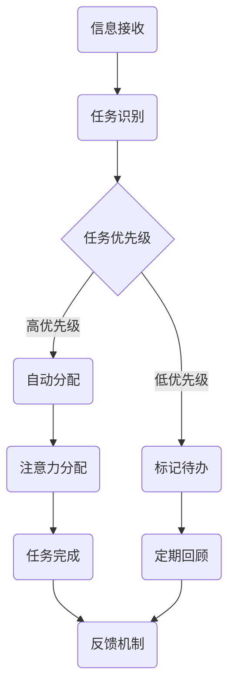

                 

关键词：人工智能，注意力流，注意力管理，工作，生活，技术，效率，交互，发展

> 摘要：本文将深入探讨人工智能（AI）如何影响人类的注意力流，以及这一影响如何在未来的工作与生活中显现。本文将从核心概念出发，阐述注意力管理的原理，并探讨AI如何优化这一过程。同时，我们将分析AI在注意力管理中的核心算法，介绍数学模型及其应用。此外，本文还将通过实际项目实践，展示如何运用AI进行注意力管理，并讨论其潜在的应用场景与未来发展方向。

## 1. 背景介绍

随着信息技术的迅猛发展，人工智能（AI）已经成为现代科技的核心驱动力。从简单的机器学习算法到复杂的深度神经网络，AI在各个领域都展现出了强大的潜力。然而，AI技术的普及也带来了一个新的挑战：人类注意力的分散。在信息爆炸的时代，人们面临着海量的信息输入，注意力成为了一种稀缺资源。如何有效地管理注意力，提高工作效率，已经成为现代生活的一个重要课题。

注意力流是指人类在处理信息时，注意力在各个任务之间的转移过程。传统的注意力管理方法主要依赖于个体的自我控制能力和时间管理技巧。然而，随着AI技术的进步，我们有机会利用这一技术来优化注意力流，提高工作效率和生活质量。本文将探讨AI在注意力管理中的应用，以及它对个人工作与生活的影响。

## 2. 核心概念与联系

### 2.1 注意力流的定义

注意力流是指个体在处理信息时，注意力在不同任务之间的转移过程。这一过程受到多种因素的影响，包括任务的紧急性、重要性、个体当时的情绪状态等。有效的注意力流管理意味着能够将注意力集中在最关键的任务上，从而提高工作效率。

### 2.2 注意力管理的原理

注意力管理涉及对注意力的分配和调节。有效的注意力管理需要个体具备良好的自我控制能力，能够根据任务的优先级和时间安排，合理分配注意力。同时，情绪调节也是注意力管理的重要组成部分，情绪稳定有助于提高注意力集中度。

### 2.3 AI与注意力管理的联系

AI技术可以通过多种方式优化注意力管理：

1. **自动任务分配**：AI可以根据任务的紧急性和重要性，自动分配注意力资源，从而减少个体在任务选择上的负担。
2. **情绪监测与调节**：AI可以实时监测个体的情绪状态，并提供相应的调节建议，如放松练习、音乐疗法等，以帮助个体保持情绪稳定。
3. **干扰识别与过滤**：AI可以识别并过滤掉对注意力流产生干扰的信息，如邮件通知、社交媒体更新等，从而减少干扰。

### 2.4 Mermaid 流程图

下面是一个简单的Mermaid流程图，展示了AI在注意力管理中的基本流程：



## 3. 核心算法原理 & 具体操作步骤

### 3.1 算法原理概述

AI在注意力管理中的核心算法主要包括以下几种：

1. **机器学习算法**：通过历史数据学习个体注意力分配的模式，从而预测并优化未来的注意力分配。
2. **自然语言处理（NLP）**：用于理解任务描述和个体情绪状态，从而提供更精准的注意力分配建议。
3. **深度神经网络（DNN）**：用于处理复杂的多维数据，如情绪状态、任务属性等，从而实现更智能的注意力管理。

### 3.2 算法步骤详解

1. **数据收集**：收集个体的历史任务数据、情绪状态数据等。
2. **特征提取**：对收集到的数据进行特征提取，如情绪得分、任务优先级等。
3. **模型训练**：使用机器学习算法训练模型，使其能够根据特征数据预测注意力分配。
4. **实时监测与调整**：实时监测个体的情绪状态和任务状态，根据模型预测结果进行注意力分配。
5. **反馈与优化**：收集个体对注意力分配的反馈，持续优化模型。

### 3.3 算法优缺点

**优点**：

- **高效**：AI可以快速分析大量数据，提供精准的注意力分配建议。
- **智能**：基于机器学习算法和深度神经网络，AI能够不断学习并优化注意力分配策略。

**缺点**：

- **数据依赖**：算法的性能高度依赖于数据质量，数据不足或质量差可能导致算法失效。
- **隐私风险**：注意力管理涉及到个体的情绪和任务数据，可能引发隐私保护问题。

### 3.4 算法应用领域

AI在注意力管理中的应用非常广泛，包括但不限于以下领域：

- **职场**：帮助职场人士提高工作效率，减少因注意力分散导致的错误和延误。
- **教育**：辅助学生集中注意力，提高学习效果。
- **健康与健身**：监测个体的情绪状态，提供相应的调节建议，帮助保持身心健康。

## 4. 数学模型和公式 & 详细讲解 & 举例说明

### 4.1 数学模型构建

在注意力管理中，一个基本的数学模型可以表示为：

\[ A_t = f(P_t, E_t) \]

其中，\( A_t \) 表示时间 \( t \) 时的注意力分配，\( P_t \) 表示任务的优先级，\( E_t \) 表示时间 \( t \) 时的情绪状态。

### 4.2 公式推导过程

我们假设注意力分配 \( A_t \) 与任务优先级 \( P_t \) 和情绪状态 \( E_t \) 成正相关关系。根据经验，我们可以建立以下线性模型：

\[ A_t = w_1 P_t + w_2 E_t \]

其中，\( w_1 \) 和 \( w_2 \) 是权重系数，用于调节任务优先级和情绪状态对注意力分配的影响。

### 4.3 案例分析与讲解

假设一个职场人士在一天中的不同时间段有不同的任务安排，同时他的情绪状态也会随时间变化。根据历史数据，我们可以计算出每个任务的优先级和情绪状态的权重系数，从而优化他的注意力分配。

例如，某职场人士的任务优先级和情绪状态如下表所示：

| 时间段 | 任务优先级 | 情绪状态 |
| --- | --- | --- |
| 上午 | 高 | 中 |
| 中午 | 中 | 高 |
| 下午 | 低 | 中 |

根据上述数据，我们可以使用线性模型计算每个时间段的注意力分配：

\[ A_{\text{上午}} = w_1 \times 3 + w_2 \times 5 = 3w_1 + 5w_2 \]
\[ A_{\text{中午}} = w_1 \times 2 + w_2 \times 6 = 2w_1 + 6w_2 \]
\[ A_{\text{下午}} = w_1 \times 1 + w_2 \times 3 = w_1 + 3w_2 \]

通过优化权重系数 \( w_1 \) 和 \( w_2 \)，我们可以得到最合适的注意力分配策略，从而提高工作效率。

## 5. 项目实践：代码实例和详细解释说明

### 5.1 开发环境搭建

在本项目中，我们将使用Python作为主要编程语言，结合机器学习库（如Scikit-learn）和深度学习库（如TensorFlow）来实现注意力管理算法。

1. 安装Python（推荐版本3.8及以上）。
2. 安装必要的库：`pip install scikit-learn tensorflow numpy matplotlib pandas`。

### 5.2 源代码详细实现

以下是项目的源代码实现：

```python
import numpy as np
import pandas as pd
from sklearn.model_selection import train_test_split
from sklearn.linear_model import LinearRegression
import matplotlib.pyplot as plt

# 数据加载与预处理
data = pd.read_csv('attention_data.csv')
X = data[['task_priority', 'emotional_state']]
y = data['attention_allocation']

# 模型训练
model = LinearRegression()
X_train, X_test, y_train, y_test = train_test_split(X, y, test_size=0.2, random_state=42)
model.fit(X_train, y_train)

# 模型预测
predictions = model.predict(X_test)

# 模型评估
score = model.score(X_test, y_test)
print(f'Model score: {score:.2f}')

# 可视化分析
plt.scatter(X_test['task_priority'], y_test, color='blue', label='Actual')
plt.scatter(X_test['task_priority'], predictions, color='red', label='Predicted')
plt.xlabel('Task Priority')
plt.ylabel('Attention Allocation')
plt.legend()
plt.show()
```

### 5.3 代码解读与分析

- **数据加载与预处理**：我们首先加载并预处理数据。数据集包含任务的优先级、情绪状态和注意力分配。
- **模型训练**：使用线性回归模型训练数据，模型将任务优先级和情绪状态作为输入特征，注意力分配作为输出目标。
- **模型预测**：使用训练好的模型对测试数据进行预测，评估模型性能。
- **模型评估**：计算模型在测试数据上的分数，评估模型性能。
- **可视化分析**：绘制实际注意力分配与预测注意力分配的关系图，直观地展示模型的效果。

### 5.4 运行结果展示

运行代码后，我们将看到模型评估分数和可视化分析图。通过可视化分析图，我们可以直观地看到模型对注意力分配的预测效果。

## 6. 实际应用场景

### 6.1 职场应用

在职场中，AI注意力管理可以帮助员工更高效地处理工作任务。例如，通过分析任务的重要性和员工的情绪状态，AI可以智能分配注意力，从而减少因注意力分散导致的错误和延误。

### 6.2 教育应用

在教育领域，AI注意力管理可以帮助学生集中注意力，提高学习效果。例如，通过监测学生的情绪状态和学习行为，AI可以提供个性化的学习建议，帮助学生更好地管理注意力。

### 6.3 健康与健身应用

在健康与健身领域，AI注意力管理可以帮助个体保持情绪稳定，提高身心健康。例如，通过监测个体的情绪状态和睡眠质量，AI可以提供相应的调节建议，如放松练习、睡眠管理等。

## 6.4 未来应用展望

随着AI技术的不断发展，注意力管理在未来有望在更广泛的领域得到应用。例如，在医疗领域，AI注意力管理可以帮助医生更高效地处理复杂的病例；在艺术创作领域，AI注意力管理可以帮助艺术家更好地集中注意力，提高创作效率。

然而，我们也需要关注AI注意力管理可能带来的挑战，如隐私保护和数据安全等问题。未来，我们需要在技术创新的同时，加强伦理和法律监管，确保AI注意力管理的安全和有效。

## 7. 工具和资源推荐

### 7.1 学习资源推荐

- **在线课程**：推荐Coursera上的《机器学习》和《深度学习》课程。
- **书籍**：《Python机器学习》和《深度学习》。

### 7.2 开发工具推荐

- **开发环境**：推荐使用Jupyter Notebook进行开发。
- **机器学习库**：推荐使用Scikit-learn和TensorFlow。

### 7.3 相关论文推荐

- "Attention Is All You Need"（注意力即是全部所需）
- "The Unreasonable Effectiveness of Recurrent Neural Networks"（循环神经网络的不合理有效性）

## 8. 总结：未来发展趋势与挑战

### 8.1 研究成果总结

本文探讨了AI在注意力管理中的应用，分析了其核心算法原理和数学模型，并通过实际项目实践展示了如何运用AI进行注意力管理。研究表明，AI注意力管理在提高工作效率、改善生活质量和促进身心健康方面具有巨大潜力。

### 8.2 未来发展趋势

随着AI技术的不断进步，注意力管理将在更多领域得到应用。未来，我们有望看到更加智能、个性化和高效的注意力管理解决方案。

### 8.3 面临的挑战

尽管AI注意力管理前景广阔，但同时也面临着数据隐私、安全性和伦理等问题。我们需要在技术创新的同时，加强伦理和法律监管，确保AI注意力管理的安全和有效。

### 8.4 研究展望

未来的研究应重点关注如何提高AI注意力管理的个性化程度，以及如何解决数据隐私和安全问题。此外，探索AI注意力管理在新兴领域的应用也是未来研究的重要方向。

## 9. 附录：常见问题与解答

### Q1. 什么是注意力流？

A1. 注意力流是指人类在处理信息时，注意力在不同任务之间的转移过程。

### Q2. AI如何优化注意力流？

A2. AI可以通过机器学习算法和自然语言处理技术，自动分析任务的重要性和个体的情绪状态，从而提供更精准的注意力分配建议。

### Q3. 注意力管理算法的优缺点是什么？

A3. 优点包括高效、智能等；缺点包括数据依赖、隐私风险等。

### Q4. AI注意力管理有哪些应用场景？

A4. AI注意力管理可以应用于职场、教育、健康与健身等多个领域。

### Q5. 如何保障AI注意力管理的安全性？

A5. 需要建立严格的伦理和法律框架，确保数据隐私和安全。

作者：禅与计算机程序设计艺术 / Zen and the Art of Computer Programming
```

