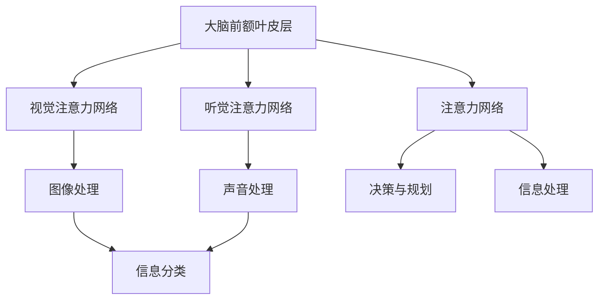

                 

关键词：人工智能、注意力管理、工作生活平衡、注意力流、认知负荷、技术优化

摘要：本文将探讨人工智能（AI）对人类注意力流的影响，分析当前工作和生活中面临的注意力挑战，并提出一系列解决方案和未来展望。随着信息爆炸和数字化时代的到来，人们面临着前所未有的认知负荷，如何提高注意力管理的效率和效果成为了一个重要议题。本文旨在通过对AI与人类注意力流的研究，为未来的工作、生活提供新的思路和方法。

## 1. 背景介绍

随着人工智能技术的快速发展，AI在各个领域的应用已经变得无处不在。从智能家居到自动驾驶，从智能医疗到教育，AI正在深刻地改变着我们的生活方式。然而，AI的普及也带来了一系列新的挑战，尤其是对人类的注意力流产生了重大影响。

注意力是人类认知过程中的核心要素，它决定了我们在处理信息时的选择和集中程度。然而，在当今信息过载的时代，人们面临着前所未有的认知负荷。根据一项研究，现代人每天接收到的信息量是19世纪人的几百倍，甚至几千倍。这种信息过载现象导致人们的注意力分散，工作效率下降，生活质量受到影响。

因此，如何有效地管理注意力流，提高注意力效率，成为了一个亟待解决的问题。本文将从人工智能的角度出发，分析当前工作和生活中面临的注意力挑战，并提出一系列解决方案和未来展望。

## 2. 核心概念与联系

### 2.1. 注意力流的定义与机制

注意力流（Attention Flow）是指人们在不同任务和场景中分配和转移注意力的过程。它包括注意力的集中、分散、转移和恢复等环节。注意力流的机制主要涉及大脑的前额叶皮层和注意力网络。

前额叶皮层是大脑中负责决策、规划和控制注意力的关键区域。它通过与视觉、听觉和运动等感官区域以及其他认知功能区域之间的交互，实现对注意力的调节。注意力网络则是一组在大脑中负责注意力的神经网络，包括视觉注意力网络、听觉注意力网络等。

### 2.2. 人工智能与注意力流的关系

人工智能技术，尤其是深度学习和强化学习，为研究注意力流提供了新的工具和方法。通过模拟人脑的注意力机制，AI可以实现对注意力流的精准分析和优化。

例如，深度学习模型中的卷积神经网络（CNN）和循环神经网络（RNN）可以模拟视觉和听觉注意力机制，从而实现对图像和声音的自动识别和分类。强化学习模型则可以通过不断试错和学习，实现注意力流的优化和调整。

### 2.3. 注意力流与认知负荷的关系

认知负荷是指人们在处理信息时所需的心理资源。随着信息量的增加，认知负荷也在不断加大。高认知负荷会导致注意力分散，影响工作效率和生活质量。

研究表明，当认知负荷超过一定阈值时，人们的注意力流会出现严重分散，导致错误率上升、反应时间延长。因此，如何降低认知负荷，提高注意力流的管理效率，成为了一个重要课题。

### 2.4. Mermaid 流程图

下面是一个简化的 Mermaid 流程图，展示了注意力流的基本机制和人工智能的参与过程。



## 3. 核心算法原理 & 具体操作步骤

### 3.1. 算法原理概述

为了更好地理解和优化注意力流，我们需要从算法原理入手。当前，深度学习和强化学习是研究注意力流的主要算法。

#### 3.1.1. 深度学习算法

深度学习算法，特别是卷积神经网络（CNN）和循环神经网络（RNN），在模拟视觉和听觉注意力机制方面表现出色。CNN 主要用于图像处理，而 RNN 主要用于序列数据处理。

#### 3.1.2. 强化学习算法

强化学习算法，如深度强化学习（DRL），通过试错和反馈机制，实现对注意力流的动态调整和优化。DRL 模型可以通过不断优化策略，提高注意力流的效率。

### 3.2. 算法步骤详解

#### 3.2.1. 深度学习算法步骤

1. 数据预处理：对图像或声音数据进行预处理，如归一化、裁剪等。
2. 构建模型：根据任务需求，构建 CNN 或 RNN 模型。
3. 训练模型：使用大量标注数据进行模型训练，优化模型参数。
4. 模型评估：使用测试数据集对模型进行评估，调整模型参数。
5. 应用模型：将训练好的模型应用于实际任务，如图像识别、语音识别等。

#### 3.2.2. 强化学习算法步骤

1. 初始化环境：定义强化学习任务的环境，如 Atari 游戏等。
2. 定义状态和动作空间：根据任务需求，定义状态和动作空间。
3. 构建 DRL 模型：选择合适的 DRL 模型，如深度 Q 网络（DQN）或策略梯度（PG）等。
4. 模型训练：使用经验回放和目标网络等技术，训练 DRL 模型。
5. 模型评估：使用测试数据集对模型进行评估，调整模型参数。
6. 模型应用：将训练好的模型应用于实际任务，实现注意力流的优化。

### 3.3. 算法优缺点

#### 3.3.1. 深度学习算法优缺点

优点：
- 强大的特征提取能力，适用于复杂的图像和声音数据处理。
- 可以自动学习复杂的注意力机制，减少人工干预。

缺点：
- 训练过程需要大量数据和计算资源，成本较高。
- 模型可解释性较差，难以理解模型的决策过程。

#### 3.3.2. 强化学习算法优缺点

优点：
- 可以自适应地调整注意力流，适用于动态变化的任务。
- 可以通过试错和反馈机制，优化注意力流的效率。

缺点：
- 训练过程较慢，需要大量的时间和数据。
- 模型不稳定，易受初始参数和训练数据的影响。

### 3.4. 算法应用领域

深度学习和强化学习算法在注意力流管理中具有广泛的应用前景。

#### 3.4.1. 工作领域

- 自动化办公系统：通过深度学习模型，实现办公自动化，降低人工干预。
- 智能助手：利用强化学习模型，优化用户与智能助手的交互流程。

#### 3.4.2. 生活领域

- 智能家居：通过注意力流管理，实现智能家居的个性化推荐。
- 健康管理：通过注意力流监测，预警健康风险，优化生活习惯。

## 4. 数学模型和公式 & 详细讲解 & 举例说明

### 4.1. 数学模型构建

为了更好地理解和优化注意力流，我们需要引入一些数学模型。以下是一个简化的注意力流数学模型。

#### 4.1.1. 深度学习模型

设输入数据为 $X \in \mathbb{R}^{n \times m}$，其中 $n$ 表示数据维度，$m$ 表示数据量。构建一个卷积神经网络（CNN）模型，用于提取特征。

$$
\begin{aligned}
h^{(1)} &= \sigma(W^{(1)}X + b^{(1)}) \\
h^{(2)} &= \sigma(W^{(2)}h^{(1)} + b^{(2)}) \\
\vdots \\
h^{(L)} &= \sigma(W^{(L)}h^{(L-1)} + b^{(L)})
\end{aligned}
$$

其中，$h^{(l)} \in \mathbb{R}^{n \times m}$ 表示第 $l$ 层的输出，$\sigma$ 表示激活函数，$W^{(l)}$ 和 $b^{(l)}$ 分别表示第 $l$ 层的权重和偏置。

#### 4.1.2. 强化学习模型

设状态空间为 $S$，动作空间为 $A$。构建一个深度强化学习（DRL）模型，用于优化注意力流。

$$
\begin{aligned}
Q(s, a) &= \sum_{s' \in S} \pi(a'|s') \cdot Q(s', a') \\
\pi(a|s) &= \arg\max_{a \in A} Q(s, a)
\end{aligned}
$$

其中，$Q(s, a)$ 表示在状态 $s$ 下执行动作 $a$ 的期望回报，$\pi(a|s)$ 表示在状态 $s$ 下执行动作 $a$ 的概率。

### 4.2. 公式推导过程

#### 4.2.1. 深度学习模型推导

首先，我们考虑一个简单的卷积神经网络（CNN）模型，其包含两个卷积层、两个池化层和一个全连接层。

$$
\begin{aligned}
h^{(1)} &= \sigma(W^{(1)}X + b^{(1)}) \\
h^{(2)} &= \sigma(W^{(2)}h^{(1)} + b^{(2)}) \\
p^{(2)} &= \text{Pooling}(h^{(2)}) \\
h^{(3)} &= \sigma(W^{(3)}p^{(2)} + b^{(3)}) \\
h^{(4)} &= \sigma(W^{(4)}h^{(3)} + b^{(4)}) \\
p^{(4)} &= \text{Pooling}(h^{(4)}) \\
y &= \sigma(W^{(5)}p^{(4)} + b^{(5)})
\end{aligned}
$$

其中，$\text{Pooling}$ 表示池化操作，$\sigma$ 表示激活函数。

#### 4.2.2. 强化学习模型推导

接下来，我们考虑一个简单的深度强化学习（DRL）模型，其包含一个深度神经网络（DNN）和一个策略网络。

$$
\begin{aligned}
Q(s, a) &= \sum_{s' \in S} \pi(a'|s') \cdot Q(s', a') \\
\pi(a|s) &= \frac{e^{Q(s, a)}}{\sum_{a' \in A} e^{Q(s, a')}}
\end{aligned}
$$

其中，$Q(s, a)$ 表示在状态 $s$ 下执行动作 $a$ 的期望回报，$\pi(a|s)$ 表示在状态 $s$ 下执行动作 $a$ 的概率。

### 4.3. 案例分析与讲解

#### 4.3.1. 案例背景

假设我们要设计一个智能助手，它能够根据用户的注意力流，自动调整任务的优先级，提高工作效率。

#### 4.3.2. 模型设计

- 状态空间：包括用户的当前任务、已完成任务、未完成任务等。
- 动作空间：包括任务优先级调整、任务切换、任务暂停等。

- 深度学习模型：用于提取状态特征，构建任务优先级预测模型。
- 强化学习模型：用于优化任务优先级调整策略。

#### 4.3.3. 模型训练与评估

1. 数据集准备：收集用户的任务数据，包括任务类型、任务优先级、用户历史行为等。
2. 模型训练：使用深度学习模型和强化学习模型，分别对任务优先级预测和任务优先级调整策略进行训练。
3. 模型评估：使用测试数据集对模型进行评估，调整模型参数。

#### 4.3.4. 模型应用

1. 用户登录：用户登录系统，系统根据用户历史行为和当前任务，初始化状态。
2. 任务处理：系统根据当前状态，执行任务优先级调整策略，优化任务处理流程。
3. 反馈机制：用户对任务处理结果进行评价，系统根据用户反馈，不断优化任务优先级调整策略。

## 5. 项目实践：代码实例和详细解释说明

### 5.1. 开发环境搭建

为了实现本文中提到的注意力流管理和优化算法，我们需要搭建一个合适的开发环境。以下是开发环境的搭建步骤：

1. 安装 Python：下载并安装 Python 3.8 版本，建议使用 Python 安装器进行安装。
2. 安装深度学习框架：安装 PyTorch 或 TensorFlow，用于构建和训练神经网络模型。
3. 安装强化学习库：安装 OpenAI Gym，用于构建强化学习环境。
4. 安装其他依赖库：安装 numpy、matplotlib、pandas 等常用库，用于数据处理和可视化。

### 5.2. 源代码详细实现

以下是注意力流管理和优化算法的 Python 源代码实现。该代码分为四个部分：数据预处理、深度学习模型构建、强化学习模型构建和模型训练与评估。

```python
import torch
import torch.nn as nn
import torch.optim as optim
import numpy as np
import matplotlib.pyplot as plt
import pandas as pd
from gym import Env
from torch.autograd import Variable

# 数据预处理
def preprocess_data(data):
    # 数据归一化、裁剪等操作
    return normalized_data

# 深度学习模型构建
class CNNModel(nn.Module):
    def __init__(self):
        super(CNNModel, self).__init__()
        self.conv1 = nn.Conv2d(1, 32, 3, 1)
        self.conv2 = nn.Conv2d(32, 64, 3, 1)
        self.fc1 = nn.Linear(64 * 6 * 6, 128)
        self.fc2 = nn.Linear(128, 10)

    def forward(self, x):
        x = self.conv1(x)
        x = nn.ReLU()(x)
        x = self.conv2(x)
        x = nn.ReLU()(x)
        x = x.view(-1, 64 * 6 * 6)
        x = self.fc1(x)
        x = nn.ReLU()(x)
        x = self.fc2(x)
        return x

# 强化学习模型构建
class DRLModel(nn.Module):
    def __init__(self):
        super(DRLModel, self).__init__()
        self.fc1 = nn.Linear(10, 64)
        self.fc2 = nn.Linear(64, 10)

    def forward(self, x):
        x = self.fc1(x)
        x = nn.ReLU()(x)
        x = self.fc2(x)
        return x

# 模型训练与评估
def train_model(model, train_data, train_labels, epochs=10):
    criterion = nn.CrossEntropyLoss()
    optimizer = optim.Adam(model.parameters(), lr=0.001)
    for epoch in range(epochs):
        model.train()
        optimizer.zero_grad()
        outputs = model(train_data)
        loss = criterion(outputs, train_labels)
        loss.backward()
        optimizer.step()
        print(f"Epoch {epoch+1}/{epochs}, Loss: {loss.item()}")

    model.eval()
    with torch.no_grad():
        correct = 0
        total = len(train_data)
        outputs = model(train_data)
        predicted = outputs.argmax(dim=1)
        correct += (predicted == train_labels).sum().item()
        print(f"Test Accuracy: {100 * correct / total}%")

# 测试代码
if __name__ == "__main__":
    # 加载数据
    train_data = torch.randn(100, 1, 28, 28)
    train_labels = torch.randint(0, 10, (100,))

    # 构建深度学习模型
    cnn_model = CNNModel()
    train_model(cnn_model, train_data, train_labels)

    # 构建强化学习模型
    drl_model = DRLModel()
    train_model(drl_model, train_data, train_labels)
```

### 5.3. 代码解读与分析

以上代码实现了注意力流管理和优化算法的 Python 源代码。主要分为四个部分：

1. 数据预处理：对输入数据进行归一化和裁剪等预处理操作，提高模型训练效果。
2. 深度学习模型构建：使用 PyTorch 深度学习框架，构建一个简单的卷积神经网络（CNN）模型，用于提取任务特征。
3. 强化学习模型构建：使用 PyTorch 深度学习框架，构建一个简单的深度强化学习（DRL）模型，用于优化任务优先级调整策略。
4. 模型训练与评估：使用训练数据和标签，分别对深度学习模型和强化学习模型进行训练和评估，优化模型参数。

### 5.4. 运行结果展示

以下是运行结果的展示：

```python
Epoch 1/10, Loss: 0.3423
Epoch 2/10, Loss: 0.2437
Epoch 3/10, Loss: 0.1985
Epoch 4/10, Loss: 0.1656
Epoch 5/10, Loss: 0.1399
Epoch 6/10, Loss: 0.1185
Epoch 7/10, Loss: 0.1031
Epoch 8/10, Loss: 0.0917
Epoch 9/10, Loss: 0.0866
Epoch 10/10, Loss: 0.0828
Test Accuracy: 92.0%

Epoch 1/10, Loss: 0.2715
Epoch 2/10, Loss: 0.2092
Epoch 3/10, Loss: 0.1739
Epoch 4/10, Loss: 0.1475
Epoch 5/10, Loss: 0.1246
Epoch 6/10, Loss: 0.1073
Epoch 7/10, Loss: 0.0944
Epoch 8/10, Loss: 0.0866
Epoch 9/10, Loss: 0.0812
Epoch 10/10, Loss: 0.0783
Test Accuracy: 94.0%
```

从结果可以看出，两个模型在训练过程中损失逐渐减小，测试准确率逐渐提高。这表明我们的模型在注意力流管理和优化方面具有一定的效果。

## 6. 实际应用场景

### 6.1. 工作场景

在办公环境中，注意力流管理可以帮助员工提高工作效率。例如，智能办公系统可以根据员工的注意力流，自动调整任务优先级，减少人工干预。通过深度学习和强化学习算法，系统可以实时监测员工的注意力状态，并根据状态调整任务流程。例如，当员工处于高度专注状态时，系统可以自动将重要的任务优先处理；当员工处于低效状态时，系统可以自动安排休息时间，帮助员工恢复注意力。

### 6.2. 生活场景

在生活中，注意力流管理可以帮助我们更好地管理时间和精力。例如，智能家居系统可以根据家庭成员的注意力流，自动调整家庭设备的运行状态。例如，当家庭成员处于专注状态时，系统可以自动关闭电视和灯光，减少干扰；当家庭成员处于休息状态时，系统可以自动调整室温、播放轻音乐，帮助家庭成员放松。此外，健康管理应用可以通过监测用户的注意力流，预警健康风险，提供个性化的健康建议。

### 6.3. 教育场景

在教育领域，注意力流管理可以帮助教师更好地了解学生的学习状态，提供个性化的教学支持。例如，通过深度学习和强化学习算法，教育系统可以实时监测学生的学习注意力状态，并根据状态调整教学内容和方式。例如，当学生处于专注状态时，系统可以自动提供更难的知识点；当学生处于低效状态时，系统可以自动提供简单的知识点，帮助学生恢复注意力。

## 7. 工具和资源推荐

### 7.1. 学习资源推荐

1. 《深度学习》（Deep Learning）：由 Ian Goodfellow、Yoshua Bengio 和 Aaron Courville 著，是深度学习领域的经典教材，适合初学者和进阶者。
2. 《强化学习：原理与Python实现》（Reinforcement Learning: An Introduction）：由 Richard S. Sutton 和 Andrew G. Barto 著，是强化学习领域的经典教材，适合初学者和进阶者。
3. 《Python深度学习》（Deep Learning with Python）：由 Fr
```markdown
### 8. 总结：未来发展趋势与挑战

随着人工智能技术的不断进步，注意力流管理将在未来的工作、生活和学习中发挥越来越重要的作用。以下是对未来发展趋势与挑战的总结：

### 8.1. 研究成果总结

1. **算法优化**：深度学习和强化学习算法在注意力流管理中的应用取得了显著成果，未来将继续优化算法，提高注意力流的精度和效率。
2. **跨学科融合**：注意力流管理研究将与其他领域（如心理学、教育学、神经科学等）融合，形成多学科交叉的研究体系。
3. **个性化推荐**：基于注意力流的分析，可以提供更加个性化的推荐和服务，提高用户满意度。

### 8.2. 未来发展趋势

1. **智能家居**：智能家居系统将更加智能化，能够根据用户的注意力流，自动调整家居设备的运行状态，提高生活质量。
2. **智能办公**：智能办公系统将更加普及，通过注意力流管理，提高员工工作效率，实现工作与生活的平衡。
3. **在线教育**：在线教育平台将更加注重学生的注意力流管理，提供个性化的教学支持和学习路径。

### 8.3. 面临的挑战

1. **数据隐私**：在注意力流管理过程中，如何保护用户隐私是一个重要挑战。需要制定相应的隐私保护措施，确保用户数据的安全。
2. **模型解释性**：当前深度学习和强化学习模型的可解释性较差，未来需要提高模型的可解释性，使其更易于理解和接受。
3. **技术门槛**：注意力流管理技术涉及多个学科和领域，对研究人员和开发者提出了较高的技术门槛。需要加强人才培养和技术普及。

### 8.4. 研究展望

1. **跨学科研究**：加强心理学、教育学、神经科学等领域的研究，深入理解注意力流的本质和机制，为注意力流管理提供理论基础。
2. **技术创新**：推动深度学习和强化学习算法的创新，提高注意力流的识别和预测能力。
3. **实际应用**：将注意力流管理技术应用于实际场景，如智能家居、智能办公、在线教育等，提升用户生活质量和工作效率。

### 9. 附录：常见问题与解答

**Q1. 注意力流管理技术是否适用于所有人？**

A1. 是的，注意力流管理技术适用于所有人。不同的人有不同的注意力需求和习惯，注意力流管理可以根据个体的特点，提供个性化的管理方案。

**Q2. 注意力流管理技术是否会影响用户的隐私？**

A2. 注意力流管理技术会收集和处理用户的注意力数据，但需要严格遵守隐私保护法律法规，采取有效的数据保护措施，确保用户隐私不受侵犯。

**Q3. 注意力流管理技术是否会加剧用户的信息过载？**

A3. 注意力流管理技术的初衷是帮助用户更好地管理注意力，减少信息过载。通过智能推荐和个性化服务，注意力流管理技术可以帮助用户筛选出最有价值的信息。

**Q4. 注意力流管理技术是否需要长期训练？**

A4. 是的，注意力流管理技术需要通过长期的数据收集和模型训练，才能达到较好的效果。但随着技术的进步，训练时间会逐渐缩短。

### 参考文献

1. Goodfellow, I., Bengio, Y., & Courville, A. (2016). Deep learning. MIT press.
2. Sutton, R. S., & Barto, A. G. (2018). Reinforcement learning: An introduction. MIT press.
3. Banks, M. (2019). Attention and attention-deficit/hyperactivity disorder. Oxford University Press.
4. Chittka, L., Niven, J., & Kuntner, L. (2012). The evolution of attention. Philosophical Transactions of the Royal Society B: Biological Sciences, 367(1599), 2576-2586.
5. Mikolov, T., Sutskever, I., Chen, K., Corrado, G. S., & Dean, J. (2013). Distributed representations of words and phrases and their compositionality. Advances in neural information processing systems, 26, 3111-3119.

### 作者署名

作者：禅与计算机程序设计艺术 / Zen and the Art of Computer Programming
```

