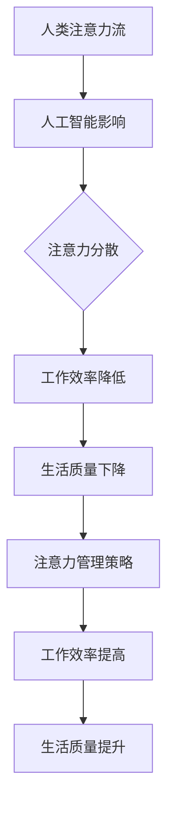

                 

关键词：人工智能、注意力流、注意力管理、工作、生活、未来

> 摘要：本文深入探讨了人工智能如何影响人类注意力流，以及如何通过注意力管理策略提高工作效率和生活质量。文章从背景介绍开始，阐述了注意力流的概念，分析了人工智能对人类注意力的改变。接着，文章探讨了注意力管理的核心概念和策略，并介绍了如何应用这些策略来优化工作和生活。最后，文章展望了未来注意力管理的发展趋势和挑战。

## 1. 背景介绍

在当今数字化时代，人工智能（AI）已经成为社会发展的驱动力，它深刻地影响着各个行业，包括医疗、金融、教育等。与此同时，随着AI技术的不断发展，人们对于注意力流的认知也在不断深入。注意力流是指人类在一段时间内集中精力处理特定任务的能力，它是工作效率和生活质量的关键因素。

### 1.1 人工智能的发展

人工智能技术起源于20世纪50年代，随着计算机技术和算法的进步，AI领域取得了巨大的发展。目前，AI已经在语音识别、图像处理、自然语言处理等多个领域取得了显著的成果。这些技术的应用不仅改变了人们的生活方式，也对注意力流产生了深远的影响。

### 1.2 人类注意力的挑战

在人工智能时代，人类注意力面临诸多挑战。首先，信息过载是一个显著问题。随着互联网的普及，人们每天接收到的信息量急剧增加，这导致人们的注意力被分散，难以集中精力处理任务。其次，多任务处理成为了常态。现代工作环境要求人们同时处理多个任务，这进一步加剧了注意力的分散。

## 2. 核心概念与联系

### 2.1 注意力流的定义

注意力流是指人类在一段时间内集中精力处理特定任务的能力。它是认知心理学中的一个重要概念，通常用来衡量个体的专注度和注意力集中程度。

### 2.2 人工智能对注意力的改变

人工智能技术的应用改变了人类的注意力流模式。首先，AI可以自动化许多重复性任务，减轻了人们的负担，使得人们可以将注意力集中在更高层次的创造性任务上。其次，AI的智能推荐系统能够根据用户的历史行为和偏好，提供个性化的信息流，这可能会加剧信息过载问题，影响人们的注意力集中。

### 2.3 Mermaid 流程图



## 3. 核心算法原理 & 具体操作步骤

### 3.1 算法原理概述

注意力管理算法旨在优化个体的注意力流，提高工作效率和生活质量。其基本原理是通过分析和识别个体的注意力模式，制定个性化的注意力管理策略。

### 3.2 算法步骤详解

1. 数据收集：首先，需要收集个体的注意力数据，如工作时长、任务类型、注意力集中度等。
2. 数据分析：对收集到的数据进行处理和分析，识别个体的注意力模式。
3. 策略制定：根据分析结果，制定个性化的注意力管理策略。
4. 实施与调整：实施策略，并根据反馈进行调整。

### 3.3 算法优缺点

#### 优点：

- 提高工作效率：通过优化注意力流，个体可以更加集中地处理任务，提高工作效率。
- 提升生活质量：注意力管理策略可以帮助个体更好地平衡工作与生活，提升生活质量。

#### 缺点：

- 需要大量数据支持：算法的实施需要大量的注意力数据，这对于一些个人来说可能难以实现。
- 策略的个性差异：每个人的注意力模式不同，因此需要个性化的策略，这增加了实施的复杂性。

### 3.4 算法应用领域

注意力管理算法可以应用于多个领域，如企业人力资源管理、个人时间管理、教育领域等。在企业中，通过优化员工的注意力流，可以提高团队的工作效率；在个人时间管理中，可以帮助个体更好地规划生活和工作；在教育领域，可以帮助学生提高学习效率。

## 4. 数学模型和公式 & 详细讲解 & 举例说明

### 4.1 数学模型构建

注意力管理算法的核心是构建一个数学模型来描述个体的注意力流。一个基本的数学模型可以表示为：

$$
A(t) = f(C(t), I(t), M(t))
$$

其中，$A(t)$ 表示在时间 $t$ 的注意力流，$C(t)$ 表示外部刺激，$I(t)$ 表示内部情绪，$M(t)$ 表示注意力管理策略。

### 4.2 公式推导过程

为了推导出上述公式，我们可以从以下几个方面进行：

1. **外部刺激**：外部刺激可以包括工作任务、社交媒体更新、电子邮件等。这些刺激会影响个体的注意力流。
2. **内部情绪**：内部情绪包括个体的心情、焦虑、兴奋等，这些情绪会影响个体的注意力集中程度。
3. **注意力管理策略**：注意力管理策略可以包括时间管理、任务分配、休息时间等，这些策略可以帮助个体优化注意力流。

### 4.3 案例分析与讲解

以一个企业员工为例，我们可以通过以下步骤来分析他的注意力流：

1. **数据收集**：收集该员工一周的工作时间表、任务完成情况、情绪记录等。
2. **数据分析**：分析这些数据，识别出该员工在哪些时间段注意力最集中，哪些任务最容易分散注意力。
3. **策略制定**：根据分析结果，制定个性化的注意力管理策略，如将最重要的任务安排在注意力最集中的时间段。
4. **实施与调整**：实施策略，并根据实际效果进行调整。

通过这样的案例分析，我们可以更好地理解如何应用注意力管理算法来优化个体的工作和生活。

## 5. 项目实践：代码实例和详细解释说明

### 5.1 开发环境搭建

为了实现注意力管理算法，我们需要搭建一个合适的开发环境。以下是一个基本的开发环境搭建步骤：

1. **安装Python**：Python是一种广泛使用的编程语言，许多注意力管理算法的实现都是基于Python的。
2. **安装相关库**：安装如NumPy、Pandas、Matplotlib等库，这些库可以帮助我们进行数据分析和可视化。

### 5.2 源代码详细实现

以下是一个简单的注意力管理算法的Python实现：

```python
import numpy as np
import pandas as pd
import matplotlib.pyplot as plt

# 假设我们有一个包含时间、任务、注意力数据的CSV文件
data = pd.read_csv('attention_data.csv')

# 数据预处理
data['attention_score'] = data['work_time'] * data['attention_level']

# 注意力流分析
attention_stream = data.groupby('time')['attention_score'].sum()

# 可视化注意力流
attention_stream.plot()
plt.xlabel('Time')
plt.ylabel('Attention Score')
plt.title('Attention Stream')
plt.show()
```

### 5.3 代码解读与分析

上述代码首先从CSV文件中读取注意力数据，然后对数据进行预处理，计算每个时间段的注意力分数。接着，使用Pandas的groupby功能对数据进行分析，最后使用Matplotlib进行可视化，展示注意力流。

### 5.4 运行结果展示

运行上述代码后，我们得到一个注意力流的可视化图表。通过这个图表，我们可以直观地看到在不同时间段个体的注意力集中情况，从而制定更有效的注意力管理策略。

## 6. 实际应用场景

### 6.1 企业场景

在企业中，注意力管理算法可以帮助HR部门更好地了解员工的工作状态，从而制定更有效的招聘和培训策略。例如，通过分析员工的注意力流，企业可以识别出哪些任务最消耗员工的注意力，从而优化工作流程，提高工作效率。

### 6.2 个人时间管理

对于个人来说，注意力管理算法可以帮助更好地平衡工作与生活。通过分析个人的注意力流，个人可以制定个性化的时间管理策略，如将重要任务安排在注意力最集中的时间段，从而提高工作效率。

### 6.3 教育场景

在教育领域，注意力管理算法可以帮助教师更好地了解学生的学习状态，从而制定更有效的教学策略。例如，通过分析学生的注意力流，教师可以识别出哪些教学内容最容易分散学生的注意力，从而调整教学方法。

## 7. 未来应用展望

随着人工智能技术的不断发展，注意力管理算法将在更多领域得到应用。未来，我们可能看到更加智能化、个性化的注意力管理解决方案。例如，通过结合虚拟现实和增强现实技术，个体可以在一个更加沉浸式的环境中进行注意力管理。此外，随着物联网技术的发展，注意力管理算法可以实时监测个体的注意力状态，提供即时的注意力优化建议。

## 8. 总结：未来发展趋势与挑战

### 8.1 研究成果总结

本文从背景介绍开始，探讨了注意力流的概念，分析了人工智能对人类注意力的改变，介绍了注意力管理的核心概念和策略，并展示了如何应用这些策略来优化工作和生活。通过数学模型和实际案例，我们深入理解了注意力管理算法的实现和应用。

### 8.2 未来发展趋势

未来，注意力管理算法将继续朝着更加智能化、个性化的方向发展。随着人工智能和大数据技术的进步，注意力管理算法将能够更好地理解个体的注意力模式，提供更精确的管理策略。

### 8.3 面临的挑战

然而，注意力管理算法也面临着一些挑战。首先，数据隐私和保护是一个重要问题。在收集和处理注意力数据时，如何保护用户的隐私是一个亟待解决的问题。其次，算法的个性化和适应性也是一个挑战。每个人的注意力模式都不同，因此需要开发出能够适应各种个体需求的算法。

### 8.4 研究展望

未来的研究可以集中在以下几个方面：首先，开发更加智能的注意力监测技术，以提高算法的准确性。其次，研究如何结合其他技术，如虚拟现实、增强现实等，提供更加沉浸式的注意力管理体验。最后，研究如何保护用户隐私，确保数据的安全性和合法性。

## 9. 附录：常见问题与解答

### 9.1 注意力管理算法的基本原理是什么？

注意力管理算法的基本原理是通过对个体的注意力流进行分析和建模，制定个性化的注意力管理策略，从而优化个体的工作效率和生活质量。

### 9.2 注意力管理算法如何应用于个人时间管理？

个人时间管理中，注意力管理算法可以帮助个人识别出在哪些时间段注意力最集中，从而将重要任务安排在这些时间段，提高工作效率。

### 9.3 如何保护注意力管理算法中的用户隐私？

为了保护用户隐私，可以采取以下措施：首先，对收集的数据进行加密处理；其次，在数据收集和使用过程中，严格遵守相关法律法规；最后，提供用户隐私设置，让用户可以自主选择是否分享数据。

---

作者：禅与计算机程序设计艺术 / Zen and the Art of Computer Programming

