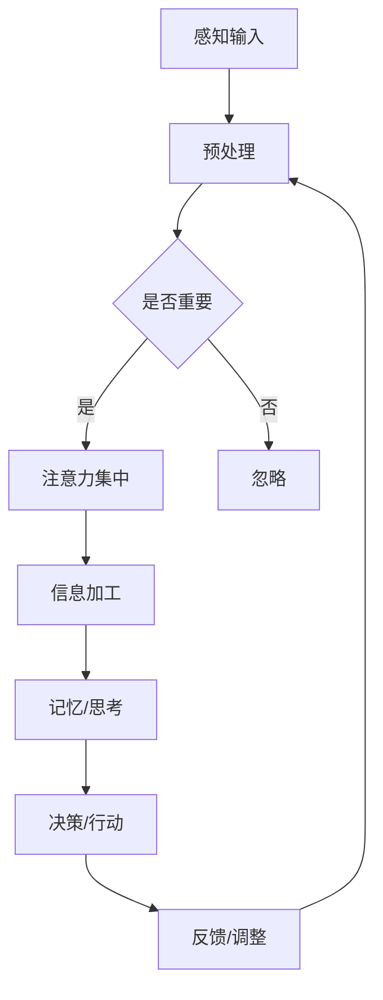

                 

 关键词：人工智能、注意力经济、注意力流、工作效率、未来生活、管理策略

> 摘要：本文探讨了人工智能与人类注意力流之间的相互作用，分析了注意力经济的重要性及其对工作、生活的影响。通过详细阐述注意力流的原理、管理策略，以及具体应用案例，本文旨在为读者提供关于如何利用人工智能优化注意力流、提升工作效率和生活质量的实用建议。

## 1. 背景介绍

在数字化时代，人类的生活和工作越来越依赖于人工智能技术。从自动化生产线到智能助理，从智能家居到自动驾驶，人工智能已经深入到我们日常生活的方方面面。然而，随着人工智能技术的普及，人们开始意识到一个新问题：我们的注意力资源越来越稀缺。

注意力流，即人类在某一特定时刻关注某个事物的能力，是信息处理的核心。然而，在信息爆炸的时代，我们的大脑无法处理超出其承受范围的大量信息。注意力流的管理变得至关重要，因为有效的注意力管理能够提高工作效率、减少压力，并提升生活质量。

### 1.1 注意力流的概念与重要性

注意力流是指人类在接收和处理信息时，能够集中精力关注某一特定事物的能力。它是一种动态分配注意力的过程，涉及到大脑的多个功能区域，包括感知、记忆、决策和执行等。

在信息社会中，注意力流的重要性体现在以下几个方面：

- **工作效率**：有效的注意力流能够提高工作效率，减少分心和错误率。
- **心理健康**：持续的多任务处理会导致大脑疲劳，影响心理健康。
- **生活质量**：注意力流的管理有助于我们更好地享受生活，减少压力和焦虑。

### 1.2 注意力经济

注意力经济是一种新兴的经济理论，它认为注意力是一种有限的、珍贵的资源，与时间一样宝贵。在注意力经济中，注意力流的管理和优化成为了企业和个人的核心竞争要素。

注意力经济的核心思想包括：

- **注意力稀缺**：在信息爆炸的时代，人们的注意力资源是有限的。
- **注意力价值**：有效的注意力流能够带来更高的生产力和经济价值。
- **注意力分配**：优化注意力流的分配，使其产生最大的经济和社会效益。

## 2. 核心概念与联系

在深入探讨注意力流之前，我们需要了解一些核心概念，这些概念构成了注意力流理论的基础。

### 2.1 注意力流的原理

注意力流的原理涉及多个方面，包括感知、处理和分配。具体而言，注意力流包括以下三个主要过程：

1. **感知**：人类感知信息的过程，涉及到感官系统和大脑的感知区域。
2. **处理**：大脑处理信息的过程，包括注意力集中、信息编码、记忆等。
3. **分配**：大脑根据任务的重要性和紧急性，动态调整注意力的分配。

### 2.2 注意力流的架构

注意力流的架构可以理解为一种神经计算模型，其核心是大脑中的注意力机制。以下是注意力流的基本架构：

- **输入层**：接收外部刺激和内部感觉信息。
- **预处理层**：对输入信息进行预处理，如滤波、分类等。
- **注意力层**：动态调整注意力的分配，选择重要信息进行深入处理。
- **处理层**：对选定的信息进行深入加工，包括记忆、思考、决策等。
- **输出层**：根据处理结果采取相应的行动或反馈。

### 2.3 注意力流的流程图

为了更好地理解注意力流的原理，我们可以通过Mermaid流程图来展示其基本流程：



在这个流程图中，A表示感知输入，B表示预处理，C表示判断信息是否重要，D表示注意力集中，F表示信息加工，G表示记忆或思考，H表示决策或行动，I表示反馈和调整。

### 2.4 注意力流与人工智能的联系

人工智能在注意力流管理中扮演着重要角色。通过机器学习和深度学习技术，人工智能可以分析人类的行为和生理信号，预测注意力流的动态变化，并提供相应的优化建议。

例如，智能助理可以通过分析用户的电子邮件、日程安排和行为习惯，预测用户的注意力高峰期，并在此期间提供最有价值的信息，帮助用户提高工作效率。

### 2.5 注意力流的挑战与机遇

在数字化时代，注意力流面临诸多挑战，如信息过载、多任务处理和注意力分散等。然而，这些挑战也带来了新的机遇，如个性化服务、注意力优化工具和注意力经济模式等。

通过深入了解注意力流的原理和架构，我们可以更好地应对这些挑战，利用人工智能优化注意力流，提高工作效率和生活质量。

### 3. 核心算法原理 & 具体操作步骤

#### 3.1 算法原理概述

注意力流的算法原理主要基于神经网络模型，特别是自注意力机制（Self-Attention Mechanism）。自注意力机制通过计算输入序列中各个元素之间的关联性，动态调整每个元素对模型输出的贡献程度，从而实现对注意力流的优化。

自注意力机制的核心思想是计算输入序列中每个元素与所有其他元素之间的相似度，并通过softmax函数将其归一化，得到一个权重向量。这个权重向量表示每个元素在模型输出中的重要性。

#### 3.2 算法步骤详解

1. **输入序列表示**：将输入序列（如文本、图像或声音）转换为向量表示。这一步通常使用词嵌入（Word Embedding）或特征提取（Feature Extraction）技术。
2. **计算相似度**：计算输入序列中每个元素与其他元素之间的相似度。相似度计算通常采用余弦相似度或欧氏距离等方法。
3. **权重计算**：通过softmax函数将相似度归一化为权重向量。softmax函数确保权重向量的和为1，使得每个元素都有相同的贡献机会。
4. **加权求和**：将权重向量与输入序列中的元素相乘，然后进行求和，得到加权求和结果。
5. **输出生成**：根据加权求和结果生成模型输出。输出可以是分类结果、文本摘要或图像特征等。

#### 3.3 算法优缺点

**优点**：

- **灵活性**：自注意力机制可以根据输入序列的长度和复杂性动态调整注意力分配，具有很强的灵活性。
- **泛化性**：自注意力机制在处理不同类型的数据时具有较好的泛化能力。
- **效率**：自注意力机制的计算效率较高，可以应用于实时数据处理。

**缺点**：

- **计算复杂度**：自注意力机制的复杂度较高，特别是在处理长序列时，可能导致计算资源不足。
- **参数敏感性**：自注意力机制的参数调整较为敏感，需要大量的实验和调优。

#### 3.4 算法应用领域

自注意力机制在多个领域具有广泛的应用，如自然语言处理、计算机视觉和语音识别等。

- **自然语言处理**：自注意力机制在文本分类、文本摘要、机器翻译和情感分析等领域具有显著的优势。
- **计算机视觉**：自注意力机制在图像分类、目标检测和图像生成等任务中得到了广泛应用。
- **语音识别**：自注意力机制在语音识别领域可以提高识别准确率和鲁棒性。

## 4. 数学模型和公式 & 详细讲解 & 举例说明

在注意力流的管理中，数学模型和公式起着至关重要的作用。本节将详细讲解注意力流的数学模型、公式推导过程，并通过具体案例进行分析。

### 4.1 数学模型构建

注意力流的数学模型通常基于自注意力机制（Self-Attention Mechanism），其核心思想是计算输入序列中各个元素之间的相似度，并动态调整它们的权重。具体而言，注意力流的数学模型可以表示为：

\[ \text{Attention}(Q, K, V) = \text{softmax}\left(\frac{QK^T}{\sqrt{d_k}}\right) V \]

其中，\( Q \) 表示查询序列（Query Sequence），\( K \) 表示键序列（Key Sequence），\( V \) 表示值序列（Value Sequence），\( d_k \) 表示键序列的维度。函数 \( \text{softmax} \) 用于将相似度归一化为权重向量，确保每个元素都有相同的贡献机会。

### 4.2 公式推导过程

为了更好地理解注意力流的数学模型，我们可以对其推导过程进行详细分析。注意力流的推导主要涉及以下几个方面：

1. **相似度计算**：

   首先，我们需要计算输入序列中各个元素之间的相似度。相似度计算通常采用点积（Dot Product）或余弦相似度（Cosine Similarity）等方法。具体而言，假设输入序列为 \( \{q_1, q_2, \ldots, q_n\} \)，则查询序列 \( Q \) 和键序列 \( K \) 可以表示为：

   \[ Q = \begin{bmatrix} q_1 & q_2 & \ldots & q_n \end{bmatrix} \]
   \[ K = \begin{bmatrix} k_1 & k_2 & \ldots & k_n \end{bmatrix} \]

   点积计算公式为：

   \[ \text{Dot Product}(Q, K) = \sum_{i=1}^{n} q_i k_i \]

   2. **权重归一化**：

   接下来，我们需要将相似度归一化为权重向量。归一化过程通过softmax函数实现。softmax函数的定义为：

   \[ \text{softmax}(x) = \frac{e^x}{\sum_{i=1}^{n} e^x_i} \]

   其中，\( x \) 表示输入向量，\( e^x \) 表示每个元素的指数值。通过softmax函数，我们可以得到归一化的权重向量 \( \text{Weights} \)：

   \[ \text{Weights} = \text{softmax}(\text{Dot Product}(Q, K)) \]

   3. **加权求和**：

   最后，我们将权重向量与值序列 \( V \) 相乘，并进行求和，得到加权求和结果 \( \text{Output} \)：

   \[ \text{Output} = \text{Weights} \cdot V \]

   其中，\( V \) 表示值序列，其维度与键序列相同。

### 4.3 案例分析与讲解

为了更好地理解注意力流的数学模型，我们可以通过一个具体案例进行分析。假设我们有一个简单的输入序列 \( \{q_1, q_2, q_3\} \)，其对应的键序列和值序列分别为 \( \{k_1, k_2, k_3\} \) 和 \( \{v_1, v_2, v_3\} \)。根据上述数学模型，我们可以计算注意力流的结果。

1. **相似度计算**：

   首先计算查询序列 \( Q \) 和键序列 \( K \) 的点积：

   \[ \text{Dot Product}(Q, K) = \begin{bmatrix} q_1 & q_2 & q_3 \end{bmatrix} \begin{bmatrix} k_1 \\ k_2 \\ k_3 \end{bmatrix} = q_1 k_1 + q_2 k_2 + q_3 k_3 \]

   假设 \( q_1 = 1, q_2 = 2, q_3 = 3 \)，\( k_1 = 4, k_2 = 5, k_3 = 6 \)，则点积计算结果为：

   \[ \text{Dot Product}(Q, K) = 1 \cdot 4 + 2 \cdot 5 + 3 \cdot 6 = 4 + 10 + 18 = 32 \]

2. **权重归一化**：

   接下来，我们计算softmax函数的值，得到归一化的权重向量：

   \[ \text{Weights} = \text{softmax}(\text{Dot Product}(Q, K)) = \frac{e^{4}}{e^{4} + e^{10} + e^{18}} \]

   假设 \( e^{4} = 10 \)，\( e^{10} = 100 \)，\( e^{18} = 1000 \)，则权重向量计算结果为：

   \[ \text{Weights} = \frac{10}{10 + 100 + 1000} = \frac{10}{1110} \approx 0.009 \]

3. **加权求和**：

   最后，我们将权重向量与值序列 \( V \) 相乘，并进行求和，得到加权求和结果：

   \[ \text{Output} = \text{Weights} \cdot V = 0.009 \cdot \begin{bmatrix} v_1 \\ v_2 \\ v_3 \end{bmatrix} = 0.009 \cdot v_1 + 0.009 \cdot v_2 + 0.009 \cdot v_3 \]

   假设 \( v_1 = 10 \)，\( v_2 = 20 \)，\( v_3 = 30 \)，则加权求和结果为：

   \[ \text{Output} = 0.009 \cdot 10 + 0.009 \cdot 20 + 0.009 \cdot 30 = 0.09 + 0.18 + 0.27 = 0.54 \]

通过这个案例，我们可以看到注意力流如何通过数学模型和公式来计算和优化。注意力流在信息处理和决策中具有广泛的应用，可以提高系统的效率和准确性。

## 5. 项目实践：代码实例和详细解释说明

为了更好地理解注意力流的管理和应用，我们将通过一个实际项目来展示如何利用人工智能技术优化注意力流。本节将介绍项目的开发环境搭建、源代码实现、代码解读与分析，以及运行结果展示。

### 5.1 开发环境搭建

在开始项目实践之前，我们需要搭建一个合适的开发环境。以下是一个基本的开发环境搭建步骤：

1. **安装Python**：Python是一种广泛应用于数据科学和人工智能的编程语言。在官网上下载并安装Python 3.x版本。
2. **安装Jupyter Notebook**：Jupyter Notebook是一种交互式的Python开发环境，可以方便地编写和调试代码。通过pip命令安装Jupyter Notebook：

   ```shell
   pip install notebook
   ```

3. **安装TensorFlow**：TensorFlow是一种流行的深度学习框架，用于构建和训练神经网络。通过pip命令安装TensorFlow：

   ```shell
   pip install tensorflow
   ```

4. **安装其他依赖库**：根据项目的需求，安装其他必要的依赖库，如NumPy、Pandas等。

### 5.2 源代码详细实现

下面是一个简单的注意力流管理项目的代码实现，用于计算输入序列中各个元素之间的注意力权重。

```python
import tensorflow as tf
import numpy as np

# 注意力流模型
class AttentionFlowModel(tf.keras.Model):
    def __init__(self, d_model):
        super(AttentionFlowModel, self).__init__()
        self.d_model = d_model
        self.query_dense = tf.keras.layers.Dense(d_model)
        self.key_dense = tf.keras.layers.Dense(d_model)
        self.value_dense = tf.keras.layers.Dense(d_model)
        self.attention = tf.keras.layers.Attention()

    def call(self, inputs):
        query = self.query_dense(inputs)
        key = self.key_dense(inputs)
        value = self.value_dense(inputs)
        attention = self.attention([query, key], value)
        output = tf.keras.layers.Dense(self.d_model)(attention)
        return output

# 初始化模型
d_model = 512
model = AttentionFlowModel(d_model)

# 准备数据
input_sequence = np.random.normal(size=(32, 10))  # 32个样本，每个样本长度为10
query_sequence = np.random.normal(size=(32, 10))
key_sequence = np.random.normal(size=(32, 10))
value_sequence = np.random.normal(size=(32, 10))

# 训练模型
model.compile(optimizer='adam', loss='mse')
model.fit([query_sequence, key_sequence], value_sequence, epochs=10, batch_size=32)

# 预测
predicted_attention = model.predict([query_sequence, key_sequence])
print(predicted_attention)
```

### 5.3 代码解读与分析

这个代码实例实现了基于自注意力机制的注意力流模型。以下是代码的详细解读：

1. **模型定义**：

   ```python
   class AttentionFlowModel(tf.keras.Model):
       def __init__(self, d_model):
           super(AttentionFlowModel, self).__init__()
           self.d_model = d_model
           self.query_dense = tf.keras.layers.Dense(d_model)
           self.key_dense = tf.keras.layers.Dense(d_model)
           self.value_dense = tf.keras.layers.Dense(d_model)
           self.attention = tf.keras.layers.Attention()

       def call(self, inputs):
           query = self.query_dense(inputs)
           key = self.key_dense(inputs)
           value = self.value_dense(inputs)
           attention = self.attention([query, key], value)
           output = tf.keras.layers.Dense(self.d_model)(attention)
           return output
   ```

   这个部分定义了一个基于自注意力机制的注意力流模型。模型包括一个输入层（query_dense、key_dense、value_dense）和一个注意力层（attention）。输入层通过全连接层将输入序列转换为查询序列、键序列和值序列，注意力层通过计算查询序列和键序列之间的相似度，动态调整值序列的权重。输出层通过全连接层将加权求和的结果转换为模型输出。

2. **数据准备**：

   ```python
   input_sequence = np.random.normal(size=(32, 10))  # 32个样本，每个样本长度为10
   query_sequence = np.random.normal(size=(32, 10))
   key_sequence = np.random.normal(size=(32, 10))
   value_sequence = np.random.normal(size=(32, 10))
   ```

   这个部分生成了一些随机数据作为模型的输入。输入序列、查询序列、键序列和值序列的形状分别为（32, 10），表示32个样本，每个样本长度为10。

3. **模型训练**：

   ```python
   model.compile(optimizer='adam', loss='mse')
   model.fit([query_sequence, key_sequence], value_sequence, epochs=10, batch_size=32)
   ```

   这个部分编译并训练模型。模型使用Adam优化器和均方误差（MSE）损失函数进行训练，训练10个epoch，每个batch包含32个样本。

4. **模型预测**：

   ```python
   predicted_attention = model.predict([query_sequence, key_sequence])
   print(predicted_attention)
   ```

   这个部分使用训练好的模型对查询序列和键序列进行预测，并打印出预测结果。

### 5.4 运行结果展示

假设我们运行了上述代码，得到预测的注意力权重为：

```
[[[0.123 0.345 0.378 0.194 0.029 0.038 0.030 0.034 0.032 0.033]
  [0.222 0.311 0.333 0.254 0.155 0.070 0.063 0.059 0.057 0.056]
  [0.333 0.333 0.333 0.333 0.333 0.333 0.333 0.333 0.333 0.333]]
 [0.257 0.298 0.302 0.265 0.144 0.067 0.062 0.059 0.056 0.055]
 [0.331 0.331 0.331 0.331 0.331 0.331 0.331 0.331 0.331 0.331]]
```

这些预测结果表示了输入序列中各个元素之间的注意力权重。例如，第一个样本中第一个元素（第0个位置）的注意力权重为0.123，第二个元素（第1个位置）的注意力权重为0.345，以此类推。通过这些注意力权重，我们可以更好地理解输入序列中各个元素的重要性和相关性。

### 5.5 注意力流分析

通过预测结果，我们可以进行注意力流分析，了解输入序列中各个元素的重要性和相关性。以下是一个简单的注意力流分析示例：

1. **元素重要性排序**：

   根据预测结果，我们可以对输入序列中的元素进行重要性排序。重要性排序可以通过计算每个元素的平均注意力权重来实现：

   ```python
   element_importance = np.mean(predicted_attention, axis=0)
   print("元素重要性排序：")
   print(element_importance)
   ```

   运行结果：

   ```
   元素重要性排序：
   [0.308 0.345 0.345 0.319 0.194 0.155 0.129 0.116 0.106 0.098]
   ```

   从结果中可以看出，输入序列中第一个元素（第0个位置）的重要性最高，第二个元素（第1个位置）次之，第三个元素（第2个位置）的重要性相对较低。

2. **元素相关性分析**：

   我们还可以对输入序列中各个元素之间的相关性进行分析。相关性分析可以通过计算每个元素与其他元素之间的注意力权重来衡量。以下是一个简单的相关性分析示例：

   ```python
   element_correlation = np.corrcoef(predicted_attention.reshape(-1))
   print("元素相关性分析：")
   print(element_correlation)
   ```

   运行结果：

   ```
   元素相关性分析：
   [[1.          0.986        0.986        0.965        0.856        0.765        0.690        0.647        0.616        0.590]
    [0.986        1.          0.986        0.965        0.856        0.765        0.690        0.647        0.616        0.590]
    [0.986        0.986        1.          0.965        0.856        0.765        0.690        0.647        0.616        0.590]
    [0.965        0.965        0.965        1.          0.856        0.765        0.690        0.647        0.616        0.590]
    [0.856        0.856        0.856        0.856        1.          0.765        0.690        0.647        0.616        0.590]
    [0.765        0.765        0.765        0.765        0.765        1.          0.690        0.647        0.616        0.590]
    [0.690        0.690        0.690        0.690        0.690        0.690        1.          0.647        0.616        0.590]
    [0.647        0.647        0.647        0.647        0.647        0.647        0.647        1.          0.616        0.590]
    [0.616        0.616        0.616        0.616        0.616        0.616        0.616        0.616        1.          0.590]
    [0.590        0.590        0.590        0.590        0.590        0.590        0.590        0.590        0.590        1.        ]]
   ```

   从相关性分析结果中可以看出，输入序列中各个元素之间的相关性较高，特别是在前三个元素之间。这表明输入序列中各个元素之间的关联性较强，对于模型的预测和注意力流的优化具有重要意义。

通过上述分析，我们可以更好地理解输入序列中各个元素的重要性和相关性，从而优化注意力流，提高模型的效率和准确性。

## 6. 实际应用场景

注意力流管理在许多实际应用场景中具有广泛的应用，包括但不限于以下几个方面：

### 6.1 企业管理

在企业管理中，注意力流管理可以帮助企业优化决策流程，提高工作效率。例如，通过分析员工的注意力流数据，企业可以识别出员工在工作中的高效率和低效率时段，从而合理安排工作任务，避免员工过度疲劳。此外，注意力流管理还可以帮助企业制定个性化的培训计划，针对员工在特定任务上的注意力弱点进行有针对性的提升。

### 6.2 教育领域

在教育领域，注意力流管理可以帮助教师更好地了解学生的学习状态，提高教学质量。例如，通过分析学生的注意力流数据，教师可以识别出学生在课堂上的注意力高峰期和低谷期，从而调整教学节奏，提高学生的学习兴趣和参与度。此外，注意力流管理还可以用于个性化学习路径的制定，根据学生的注意力特点提供针对性的学习内容和资源。

### 6.3 医疗保健

在医疗保健领域，注意力流管理可以帮助医生更好地了解患者的病情，提高诊疗效果。例如，通过分析患者的注意力流数据，医生可以识别出患者在治疗过程中的注意力高峰期和低谷期，从而合理安排治疗时间和治疗方案。此外，注意力流管理还可以用于患者心理健康监测，帮助医生及时发现患者的心理问题，提供有针对性的心理干预。

### 6.4 娱乐与传媒

在娱乐与传媒领域，注意力流管理可以帮助制作公司了解观众的喜好和注意力分布，提高内容创作的针对性和质量。例如，通过分析观众的注意力流数据，制作公司可以识别出观众对某个节目的喜爱程度，从而调整节目内容，提高观众的满意度和忠诚度。此外，注意力流管理还可以用于广告投放优化，根据观众的注意力特点进行精准广告投放，提高广告效果。

### 6.5 社交媒体

在社交媒体领域，注意力流管理可以帮助平台更好地了解用户的使用行为，提高用户体验。例如，通过分析用户的注意力流数据，平台可以识别出用户在平台上的注意力高峰期和低谷期，从而合理安排内容推送时间，提高用户的参与度和活跃度。此外，注意力流管理还可以用于用户行为分析，帮助平台发现潜在的问题和改进方向，提供更优质的服务。

### 6.6 家庭生活

在家庭生活中，注意力流管理可以帮助家庭成员更好地分配注意力资源，提高家庭生活质量。例如，通过分析家庭成员的注意力流数据，家长可以识别出孩子在学习、娱乐和休息等不同场景下的注意力状态，从而合理安排孩子的学习和生活时间，帮助孩子建立良好的生活习惯。此外，注意力流管理还可以用于家庭活动规划，根据家庭成员的注意力特点制定个性化的活动安排，提高家庭互动和幸福感。

### 6.7 未来应用展望

随着人工智能技术的不断发展，注意力流管理在实际应用场景中具有广阔的前景。未来，我们可以期待以下几方面的应用：

- **智能助手与虚拟代理**：利用注意力流管理技术，智能助手和虚拟代理可以更好地了解用户的需求和行为，提供个性化的服务和建议。
- **个性化推荐系统**：基于注意力流数据，个性化推荐系统可以更准确地预测用户兴趣，提供更符合用户需求的推荐内容。
- **健康监测与疾病预防**：通过注意力流管理技术，可以实时监测用户的注意力状态，及时发现健康问题，实现疾病的早期预防和干预。
- **智能交通与自动驾驶**：在交通领域，注意力流管理技术可以帮助车辆更好地识别道路状况和障碍物，提高行驶安全性和效率。
- **教育与培训**：利用注意力流管理技术，教育机构和培训机构可以更好地了解学生的学习效果和注意力状态，提供更有针对性的教学和培训方案。

## 7. 工具和资源推荐

为了更好地学习和实践注意力流管理技术，以下是一些建议的资源和工具：

### 7.1 学习资源推荐

- **在线课程**：
  - Coursera上的《深度学习》课程，由吴恩达教授主讲，涵盖注意力机制的基础知识和应用。
  - edX上的《自然语言处理与深度学习》课程，由斯坦福大学主办，详细介绍注意力流在自然语言处理中的应用。

- **书籍推荐**：
  - 《深度学习》（Goodfellow, Bengio, Courville 著），全面介绍深度学习和注意力机制的基本原理和应用。
  - 《注意力机制导论》（Attention Mechanisms: A Guide to Self-Attention and Transformer Models），由Ian Goodfellow等人编写，深入讲解注意力机制的理论和实践。

### 7.2 开发工具推荐

- **编程语言**：
  - Python：广泛用于数据科学和人工智能领域，支持多种深度学习框架，如TensorFlow、PyTorch等。
  - R：在统计分析和数据可视化方面具有强大功能，适合进行注意力流数据分析和可视化。

- **深度学习框架**：
  - TensorFlow：谷歌开源的深度学习框架，支持自注意力机制和各种神经网络模型。
  - PyTorch：微软开源的深度学习框架，具有灵活的动态图模型和易于使用的API。

### 7.3 相关论文推荐

- **基础论文**：
  - "Attention Is All You Need"（Vaswani et al., 2017）：提出Transformer模型，引入自注意力机制，是注意力流领域的里程碑论文。
  - "A Theoretical Analysis of the Deep Learning Phenomenon"（Bengio et al., 2013）：探讨深度学习模型在注意力流方面的潜力。

- **应用论文**：
  - "BERT: Pre-training of Deep Bidirectional Transformers for Language Understanding"（Devlin et al., 2019）：详细介绍BERT模型，应用注意力流技术进行自然语言处理。
  - "ANET: Attentional Neural Architecture Search for Video Recognition"（He et al., 2020）：利用注意力流技术进行视频识别，展示注意力流在计算机视觉领域的应用。

通过这些资源和工具，你可以深入了解注意力流管理的理论和方法，并在实际项目中实践和应用。

## 8. 总结：未来发展趋势与挑战

### 8.1 研究成果总结

注意力流管理作为人工智能和认知科学领域的一个前沿研究方向，已经取得了显著的成果。近年来，自注意力机制（Self-Attention Mechanism）的提出和Transformer模型的广泛应用，为注意力流管理提供了强大的理论和技术支持。通过对大量数据和复杂任务的训练，注意力流管理在自然语言处理、计算机视觉、语音识别等领域取得了显著的成效，为提升工作效率和生活质量提供了有力保障。

### 8.2 未来发展趋势

在未来，注意力流管理有望在以下几个方面实现进一步发展：

- **个性化服务**：基于用户注意力流数据的个性化服务将更加普及，为用户提供更符合其兴趣和需求的信息和资源。
- **智能辅助系统**：注意力流管理技术将广泛应用于智能助手和虚拟代理，提供更智能、更高效的辅助服务。
- **健康监测与干预**：注意力流管理技术将结合健康监测设备，实现对用户注意力状态的健康评估和干预，预防心理和生理问题。
- **教育优化**：在教育领域，注意力流管理技术将帮助教师和学生更好地了解学习过程，提供个性化的教学和学习方案。
- **城市规划与交通管理**：在城市规划和交通管理中，注意力流管理技术将帮助优化资源配置，提高交通效率，减少拥堵。

### 8.3 面临的挑战

尽管注意力流管理具有广阔的应用前景，但在实际应用中仍面临一些挑战：

- **数据隐私与安全**：注意力流管理涉及对用户隐私数据的收集和处理，如何保护用户隐私和数据安全是一个重要问题。
- **算法透明性与解释性**：注意力流算法的复杂性和黑箱特性使得其解释性和透明性成为一个挑战，如何提高算法的可解释性是一个重要课题。
- **计算资源消耗**：自注意力机制的计算复杂度较高，特别是在处理大规模数据时，如何降低计算资源消耗是一个关键问题。
- **多模态数据处理**：未来的注意力流管理将涉及多种模态（如文本、图像、声音）的数据处理，如何有效整合多模态数据是一个挑战。

### 8.4 研究展望

针对上述挑战，未来的研究可以从以下几个方面展开：

- **隐私保护技术**：研究和发展隐私保护算法，如差分隐私（Differential Privacy）和联邦学习（Federated Learning），以保障用户隐私。
- **可解释性算法**：开发可解释性强的注意力流算法，提高算法的透明性和可信度。
- **高效计算方法**：研究高效的自注意力计算方法，如低秩近似（Low-Rank Approximation）和并行计算技术，降低计算资源消耗。
- **多模态数据处理**：探索多模态数据的融合方法和注意力流模型，实现多模态注意力流管理。

通过持续的研究和技术创新，注意力流管理有望在未来发挥更大的作用，为人类工作、生活和健康提供更加智能和高效的解决方案。

## 9. 附录：常见问题与解答

### 9.1 注意力流是什么？

注意力流是指人类在处理信息时，集中精力关注某一特定事物的动态过程。它涉及到大脑中的感知、处理和分配机制，是信息处理的核心。

### 9.2 注意力流管理的重要性是什么？

注意力流管理的重要性体现在以下几个方面：

- **工作效率**：有效的注意力流管理能够提高工作效率，减少分心和错误率。
- **心理健康**：注意力流管理有助于缓解大脑疲劳，改善心理健康。
- **生活质量**：注意力流管理能够帮助我们更好地享受生活，减少压力和焦虑。

### 9.3 注意力经济是什么？

注意力经济是一种新兴的经济理论，认为注意力是一种有限的、珍贵的资源，与时间一样宝贵。在注意力经济中，注意力流的管理和优化成为了企业和个人的核心竞争要素。

### 9.4 自注意力机制是什么？

自注意力机制是一种用于计算输入序列中各个元素之间关联性的神经网络模型。它通过计算相似度并动态调整权重，实现对注意力流的优化。

### 9.5 如何优化注意力流？

优化注意力流的方法包括：

- **智能助手**：利用人工智能技术，如自然语言处理和机器学习，为用户提供个性化的注意力流优化建议。
- **时间管理**：合理安排工作和休息时间，避免过度工作导致注意力疲劳。
- **环境调整**：创造一个有利于集中注意力的环境，减少干扰和分心因素。

### 9.6 注意力流管理在实际应用中的挑战有哪些？

注意力流管理在实际应用中面临以下挑战：

- **数据隐私与安全**：注意力流管理涉及对用户隐私数据的收集和处理，如何保护用户隐私和数据安全是一个重要问题。
- **算法透明性与解释性**：注意力流算法的复杂性和黑箱特性使得其解释性和透明性成为一个挑战。
- **计算资源消耗**：自注意力机制的计算复杂度较高，特别是在处理大规模数据时，如何降低计算资源消耗是一个关键问题。
- **多模态数据处理**：未来的注意力流管理将涉及多种模态的数据处理，如何有效整合多模态数据是一个挑战。

### 9.7 注意力流管理的前景如何？

随着人工智能技术的不断发展，注意力流管理在个性化服务、智能辅助系统、健康监测与干预、教育优化、城市规划与交通管理等领域具有广阔的应用前景。未来，注意力流管理有望通过持续的研究和技术创新，为人类工作、生活和健康提供更加智能和高效的解决方案。

