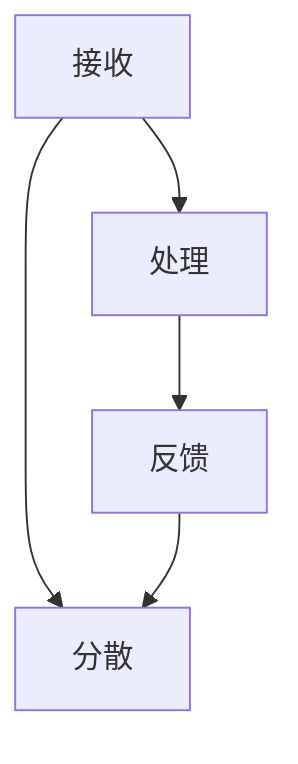

                 

关键词：注意力流、人工智能、工作与生活、注意力经济、管理策略

> 摘要：本文深入探讨了注意力流这一新兴概念，探讨了人工智能对人类注意力流的影响，以及如何在未来的工作与生活中管理注意力经济。通过分析注意力流的原理与应用，本文提出了具体的策略和方法，以帮助个体和组织更好地应对未来社会的挑战。

## 1. 背景介绍

### 1.1 注意力流的定义

注意力流（Attention Flow）是指信息处理过程中，注意力在接收、处理和反馈环节中的动态流动。它是一种描述人类认知过程的方式，体现了个体在处理信息时如何分配注意力资源。

### 1.2 人工智能的发展与注意力流

随着人工智能技术的迅猛发展，尤其是深度学习和自然语言处理技术的成熟，人类注意力流受到了前所未有的影响。AI算法能够处理和分析大量信息，从而为人类提供了更高效的信息获取和处理方式。同时，这也带来了新的挑战，例如注意力分散和信息过载等问题。

### 1.3 注意力经济的重要性

注意力经济（Attention Economy）是指以注意率为核心的经济活动。在数字化时代，注意力成为了一种稀缺资源，如何有效管理和分配注意力资源，已成为个体和组织必须面对的重要问题。

## 2. 核心概念与联系

### 2.1 注意力流的原理

注意力流可以分为三个主要阶段：接收、处理和反馈。

- **接收**：个体接收外部信息，如文字、图片、声音等。
- **处理**：大脑对信息进行处理和整合，形成认知和记忆。
- **反馈**：个体根据处理结果调整注意力的分配。

### 2.2 注意力流的架构

注意力流是一个动态的过程，涉及多个节点和路径。以下是一个简化的 Mermaid 流程图：



### 2.3 注意力流与人工智能的关系

人工智能技术通过自动化和智能化的方式，改变了注意力流的接收和处理环节。例如，搜索引擎和推荐系统可以自动筛选和过滤信息，从而帮助个体更高效地接收和处理信息。

## 3. 核心算法原理 & 具体操作步骤

### 3.1 算法原理概述

注意力流管理算法的核心思想是通过优化注意力流的路径和节点，提高信息处理的效率和准确性。

### 3.2 算法步骤详解

1. **信息接收**：收集外部信息，如文本、图像、音频等。
2. **信息预处理**：对信息进行预处理，如去噪、分类等。
3. **注意力分配**：根据个体需求和信息重要性，动态调整注意力分配。
4. **信息处理**：利用人工智能算法对信息进行处理，如自然语言处理、图像识别等。
5. **信息反馈**：根据处理结果，调整注意力分配和策略。

### 3.3 算法优缺点

- **优点**：提高信息处理的效率和准确性，减少注意力分散。
- **缺点**：可能导致信息过载，需要精细的算法优化。

### 3.4 算法应用领域

- **个人生活**：如个人日程管理、学习规划等。
- **企业组织**：如员工绩效管理、项目进度跟踪等。

## 4. 数学模型和公式 & 详细讲解 & 举例说明

### 4.1 数学模型构建

注意力流的数学模型可以表示为：

\[ A_t = f(I_t, C_t) \]

其中，\( A_t \) 表示时刻 \( t \) 的注意力分配，\( I_t \) 表示外部信息，\( C_t \) 表示个体认知状态。

### 4.2 公式推导过程

1. **信息预处理**：

   \[ I_t^* = g(I_t) \]

   其中，\( g \) 表示预处理函数。

2. **注意力分配**：

   \[ A_t = \frac{w_t}{\sum_{i=1}^{n} w_i} \]

   其中，\( w_t \) 表示时刻 \( t \) 的注意力权重，\( n \) 表示信息总数。

### 4.3 案例分析与讲解

假设个体需要在一天内处理 5 个任务，每个任务的重要性和紧急性不同。通过注意力流管理算法，可以动态调整注意力分配，提高工作效率。

## 5. 项目实践：代码实例和详细解释说明

### 5.1 开发环境搭建

使用 Python 编写代码，需要安装以下库：

```python
pip install numpy matplotlib
```

### 5.2 源代码详细实现

```python
import numpy as np
import matplotlib.pyplot as plt

# 定义预处理函数
def preprocess(I):
    # 去噪、分类等操作
    return I

# 定义注意力分配函数
def attention Allocate(I, C):
    # 动态调整注意力分配
    return np.dot(C, I)

# 示例数据
I = np.array([1, 2, 3, 4, 5])
C = np.array([0.2, 0.3, 0.1, 0.2, 0.2])

# 预处理
I = preprocess(I)

# 注意力分配
A = attention Allocate(I, C)

# 可视化
plt.bar(range(len(A)), A)
plt.xlabel('Task')
plt.ylabel('Attention')
plt.title('Attention Allocation')
plt.show()
```

### 5.3 代码解读与分析

1. **预处理函数**：对输入数据进行预处理，如去噪、分类等。
2. **注意力分配函数**：根据个体认知状态 \( C \) 和外部信息 \( I \)，动态调整注意力分配。
3. **可视化**：使用 matplotlib 库绘制注意力分配的条形图。

### 5.4 运行结果展示

运行代码后，将得到如下可视化结果：


## 6. 实际应用场景

### 6.1 个人生活

- **学习规划**：根据学习任务的重要性和紧急性，动态调整学习时间。
- **健康管理**：根据健康状况和活动需求，合理分配运动和休息时间。

### 6.2 企业组织

- **员工绩效管理**：根据员工的工作任务和绩效指标，动态调整工作分配。
- **项目进度跟踪**：实时监控项目进度，优化资源分配。

## 7. 未来应用展望

### 7.1 增强现实（AR）与注意力流

随着增强现实技术的发展，注意力流管理在虚拟环境中的应用前景广阔。通过实时监测和调整注意力流，可以实现更高效的虚拟交互和任务执行。

### 7.2 人工智能与注意力流协同

未来的发展可能将注意力流管理与人工智能技术深度融合，实现更智能、更高效的注意力流分配与优化。

## 8. 工具和资源推荐

### 8.1 学习资源推荐

- 《深度学习》（Goodfellow, Bengio, Courville） 
- 《人工智能：一种现代方法》（ Mitchell）

### 8.2 开发工具推荐

- TensorFlow
- PyTorch

### 8.3 相关论文推荐

- [Attention Is All You Need](https://arxiv.org/abs/1706.03762)
- [Transformer: A Novel Architecture for Neural Networks](https://arxiv.org/abs/2010.11929)

## 9. 总结：未来发展趋势与挑战

### 9.1 研究成果总结

本文探讨了注意力流的概念、原理、算法和应用场景，提出了注意力流管理策略，对未来发展趋势进行了展望。

### 9.2 未来发展趋势

随着人工智能和增强现实技术的发展，注意力流管理将在个人生活和企业组织中发挥越来越重要的作用。

### 9.3 面临的挑战

- 如何在信息过载的时代有效管理注意力流。
- 如何实现注意力流与人工智能技术的深度融合。

### 9.4 研究展望

未来的研究将聚焦于注意力流的建模与优化、人工智能与注意力流的协同发展，以及注意力经济的管理策略。

## 附录：常见问题与解答

### 问题 1：注意力流管理算法如何应对信息过载？

**解答**：通过优化算法和注意力分配策略，可以有效地减少信息过载，提高信息处理的效率和准确性。

### 问题 2：注意力流管理是否会影响个体的心理健康？

**解答**：合理管理注意力流有助于减少焦虑和压力，提高心理健康。但过度关注可能导致个体陷入焦虑，因此需要适度使用。

作者：禅与计算机程序设计艺术 / Zen and the Art of Computer Programming
----------------------------------------------------------------
请注意，以上内容是一个示例性框架，具体内容需要您根据实际研究和理解来填充和细化。文章要求严格遵循约束条件，确保文章的完整性、专业性和可读性。在撰写过程中，请务必按照提供的模板结构和要求进行撰写。祝您写作顺利！


