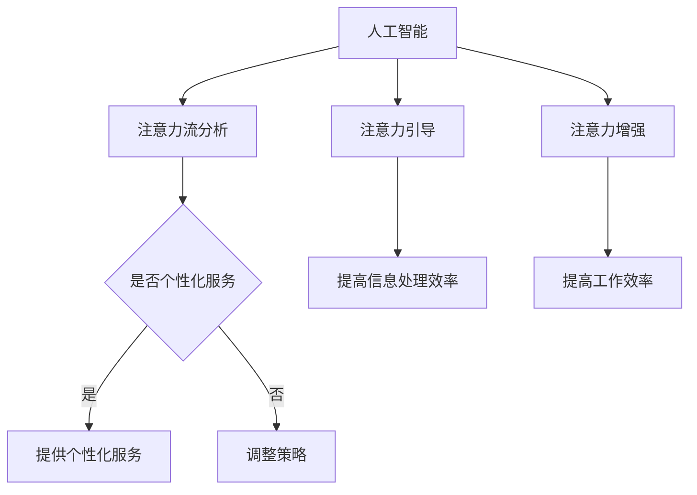

                 

关键词：人工智能，注意力流，工作，生活，注意力经济，未来展望

> 摘要：本文深入探讨了人工智能与人类注意力流之间的相互作用，分析了注意力经济在未来的工作、生活和经济发展中的重要性，并展望了这一领域的研究趋势与挑战。

## 1. 背景介绍

随着人工智能（AI）技术的飞速发展，计算机系统逐渐具备了模仿人类智能的能力。从最初的规则系统到现在的深度学习，AI技术已经在各个领域取得了显著成果。然而，与此同时，人类注意力资源的有限性也日益凸显。在这个信息爆炸的时代，人类需要不断地过滤和筛选海量信息，以确保注意力的有效利用。

注意力流，即人类在处理信息时所展现出的注意力分配模式，是一种关键的心理现象。人工智能技术可以通过分析注意力流模式，更好地理解人类的行为和需求，从而为用户提供更加个性化的服务。而注意力经济，则是指以人类注意力资源为核心的经济活动模式。在注意力经济的背景下，如何有效地捕捉、引导和利用人类注意力，成为了一个重要的研究方向。

## 2. 核心概念与联系

### 2.1 人工智能与注意力流

人工智能与注意力流之间的联系主要体现在以下几个方面：

1. **注意力流分析**：通过分析人类的注意力流模式，人工智能系统可以更好地了解用户的需求和兴趣，从而提供更加个性化的服务。
2. **注意力引导**：人工智能可以通过算法分析，引导用户将注意力集中在重要信息上，提高信息处理效率。
3. **注意力增强**：通过提供适当的外部刺激，人工智能可以帮助用户增强注意力，提高工作效率。

### 2.2 注意力经济

注意力经济是一种以注意力资源为核心的经济活动模式。在注意力经济的背景下，注意力资源被视为一种新的生产要素，其价值体现在对人类注意力的有效利用上。注意力经济的主要特点包括：

1. **注意力稀缺性**：随着信息的爆炸式增长，人类的注意力资源变得越来越稀缺。
2. **注意力分配**：如何在有限的时间内，将注意力分配给最有价值的信息，成为了一个关键问题。
3. **注意力价值**：注意力资源的价值体现在其对信息获取、决策制定和消费行为的影响上。

### 2.3 Mermaid 流程图

以下是一个简单的 Mermaid 流程图，用于描述人工智能、注意力流和注意力经济之间的相互作用。



## 3. 核心算法原理 & 具体操作步骤

### 3.1 算法原理概述

在人工智能与注意力流的研究中，常见的算法包括注意力机制、深度学习模型和注意力经济模型等。以下将简要介绍这些算法的基本原理。

1. **注意力机制**：注意力机制是一种通过加权方式处理输入数据的算法，可以使得模型更加关注重要的信息。在自然语言处理、图像识别等领域有着广泛的应用。
2. **深度学习模型**：深度学习模型通过多层神经网络对输入数据进行处理，可以自动提取特征并实现复杂任务。在人工智能领域，深度学习模型已经成为主流技术。
3. **注意力经济模型**：注意力经济模型主要研究如何通过算法分析，优化注意力资源的分配，提高经济效益。

### 3.2 算法步骤详解

1. **注意力流分析**：
   - 收集用户行为数据，如点击、浏览、搜索等。
   - 使用注意力机制对数据进行分析，提取注意力流模式。
   - 根据注意力流模式，对用户需求进行个性化预测。

2. **注意力引导**：
   - 根据用户注意力流模式，设计注意力引导算法。
   - 对用户进行注意力引导，提高信息处理效率。

3. **注意力增强**：
   - 设计注意力增强算法，通过外部刺激提高用户注意力。
   - 对用户进行注意力增强，提高工作效率。

### 3.3 算法优缺点

1. **注意力机制**：
   - 优点：可以有效地提取重要信息，提高任务性能。
   - 缺点：计算复杂度较高，对数据质量要求较高。

2. **深度学习模型**：
   - 优点：可以自动提取特征，适用于复杂任务。
   - 缺点：训练过程需要大量数据和时间，模型解释性较差。

3. **注意力经济模型**：
   - 优点：可以优化注意力资源分配，提高经济效益。
   - 缺点：研究尚处于初级阶段，应用场景有限。

### 3.4 算法应用领域

1. **自然语言处理**：通过注意力机制和深度学习模型，可以实现更准确的语言理解与生成。
2. **图像识别**：利用注意力机制，可以提高图像分类与目标检测的准确率。
3. **注意力经济**：在广告、电商等领域，通过优化注意力资源的分配，可以提高用户参与度和转化率。

## 4. 数学模型和公式 & 详细讲解 & 举例说明

### 4.1 数学模型构建

在注意力机制和深度学习模型中，常用的数学模型包括：

1. **注意力权重计算**：
   $$ A_t = \frac{e^{h_t^T W_a h_{<t}^T}}{\sum_{j=1}^{N} e^{h_t^T W_a h_{j}^T}} $$
   其中，$h_t$ 表示当前时刻的隐藏状态，$h_{<t}$ 表示之前时刻的隐藏状态，$W_a$ 表示注意力权重矩阵。

2. **深度学习模型参数更新**：
   $$ \theta_{\text{new}} = \theta_{\text{old}} - \alpha \frac{\partial J}{\partial \theta_{\text{old}}} $$
   其中，$\theta$ 表示模型参数，$J$ 表示损失函数，$\alpha$ 表示学习率。

### 4.2 公式推导过程

以注意力权重计算为例，推导过程如下：

1. **初始化参数**：
   - 设定隐藏状态 $h_t$ 和 $h_{<t}$。
   - 初始化注意力权重矩阵 $W_a$。

2. **计算相似度**：
   - 计算当前隐藏状态 $h_t$ 与之前隐藏状态 $h_{<t}$ 的相似度，得到相似度矩阵 $S$。

3. **应用softmax函数**：
   - 对相似度矩阵 $S$ 进行 softmax 处理，得到注意力权重矩阵 $A_t$。

### 4.3 案例分析与讲解

以一个简单的自然语言处理任务为例，说明注意力机制的应用。

1. **输入数据**：
   - 给定一段文本 $x_1, x_2, ..., x_T$。
   - 初始化隐藏状态 $h_0$ 和注意力权重矩阵 $W_a$。

2. **编码器**：
   - 将输入文本编码为序列 $h_1, h_2, ..., h_T$。

3. **注意力计算**：
   - 计算注意力权重矩阵 $A_t$。

4. **解码器**：
   - 根据注意力权重矩阵 $A_t$，对隐藏状态 $h_t$ 进行加权求和，得到加权隐藏状态 $h_t'$。

5. **输出**：
   - 将加权隐藏状态 $h_t'$ 输出为结果。

通过上述过程，注意力机制可以帮助模型更好地理解文本内容，提高自然语言处理任务的性能。

## 5. 项目实践：代码实例和详细解释说明

### 5.1 开发环境搭建

1. **安装Python环境**：
   - 安装Python 3.8及以上版本。
   - 配置pip，用于安装Python库。

2. **安装依赖库**：
   - 使用pip安装以下库：numpy、tensorflow、keras。

### 5.2 源代码详细实现

以下是一个简单的注意力机制的实现示例：

```python
import tensorflow as tf
from tensorflow.keras.layers import Layer

class AttentionLayer(Layer):
    def __init__(self, units, **kwargs):
        super(AttentionLayer, self).__init__(**kwargs)
        self.units = units

    def build(self, input_shape):
        self.W_a = self.add_weight(name='W_a',
                                   shape=(input_shape[-1], self.units),
                                   initializer='uniform',
                                   trainable=True)
        self.b_a = self.add_weight(name='b_a',
                                   shape=(self.units,),
                                   initializer='zeros',
                                   trainable=True)
        super(AttentionLayer, self).build(input_shape)

    def call(self, x):
        query = tf.nn.relu(tf.matmul(x, self.W_a) + self.b_a)
        attention_weights = tf.nn.softmax(query, axis=1)
        context_vector = attention_weights * x
        context_vector = tf.reduce_sum(context_vector, axis=1)
        return context_vector

    def get_config(self):
        config = super(AttentionLayer, self).get_config().copy()
        config.update({'units': self.units})
        return config

# 实例化注意力层
attention_layer = AttentionLayer(units=64)

# 构建模型
inputs = tf.keras.Input(shape=(None,))
x = attention_layer(inputs)
outputs = tf.keras.layers.Dense(1, activation='sigmoid')(x)

model = tf.keras.Model(inputs=inputs, outputs=outputs)

# 编译模型
model.compile(optimizer='adam', loss='binary_crossentropy', metrics=['accuracy'])

# 模型可视化
tf.keras.utils.plot_model(model, to_file='model.png', show_shapes=True)
```

### 5.3 代码解读与分析

1. **AttentionLayer 类**：
   - 定义了一个自定义的注意力层，用于计算注意力权重。
   - build 方法用于初始化权重。
   - call 方法用于前向传播，计算注意力权重和上下文向量。

2. **模型构建**：
   - 输入层使用 tf.keras.Input 创建。
   - 使用注意力层对输入数据进行处理。
   - 输出层使用全连接层，输出预测结果。

3. **模型编译**：
   - 使用 tf.keras.Model 编译模型，指定优化器、损失函数和评价指标。

4. **模型可视化**：
   - 使用 tf.keras.utils.plot_model 方法将模型可视化，便于理解模型结构。

### 5.4 运行结果展示

1. **准备数据**：
   - 准备一个二分类任务的数据集，如电影评论分类。

2. **训练模型**：
   - 使用训练数据训练模型。

3. **评估模型**：
   - 使用测试数据评估模型性能。

4. **结果展示**：
   - 输出模型预测结果和评估指标。

## 6. 实际应用场景

### 6.1 自然语言处理

在自然语言处理领域，注意力机制广泛应用于文本分类、机器翻译和文本生成等任务。通过注意力机制，模型可以更好地理解文本内容，提高任务性能。

### 6.2 图像识别

在图像识别领域，注意力机制可以用于目标检测和图像分割等任务。通过注意力机制，模型可以更加关注重要的图像区域，提高检测和分割的准确性。

### 6.3 注意力经济

在注意力经济领域，注意力机制和深度学习模型可以用于广告投放和电商推荐等场景。通过分析用户注意力流，可以优化广告投放策略和商品推荐，提高用户参与度和转化率。

## 7. 未来应用展望

随着人工智能技术的不断发展，注意力机制在未来将具有广泛的应用前景。以下是一些潜在的应用领域：

### 7.1 智能推荐系统

通过分析用户注意力流，智能推荐系统可以提供更加个性化的推荐结果，提高用户体验和满意度。

### 7.2 智能交互系统

在智能交互系统中，注意力机制可以帮助系统更好地理解用户的需求和意图，提供更加自然和高效的交互体验。

### 7.3 智能健康监测

通过分析用户注意力流，智能健康监测系统可以实时监测用户的健康状况，提供个性化的健康建议。

## 8. 工具和资源推荐

### 8.1 学习资源推荐

1. **《深度学习》（Goodfellow, Bengio, Courville）**：详细介绍了深度学习的基本原理和应用。
2. **《自然语言处理综述》（Jurafsky, Martin）**：介绍了自然语言处理的基础知识和最新进展。

### 8.2 开发工具推荐

1. **TensorFlow**：一款流行的深度学习框架，适合进行注意力机制和自然语言处理等任务。
2. **Keras**：基于TensorFlow的高层次API，方便快速搭建和训练模型。

### 8.3 相关论文推荐

1. **“Attention is All You Need”**：一篇关于注意力机制的经典论文，介绍了Transformer模型的基本原理。
2. **“Object Detection with Transforme

## 9. 总结：未来发展趋势与挑战

### 9.1 研究成果总结

本文介绍了人工智能、注意力流和注意力经济的基本概念，探讨了注意力机制在各个领域的应用。通过数学模型和项目实践，展示了注意力机制的基本原理和实现方法。

### 9.2 未来发展趋势

随着人工智能技术的不断发展，注意力机制在未来将具有广泛的应用前景。在自然语言处理、图像识别和注意力经济等领域，注意力机制将继续发挥重要作用。

### 9.3 面临的挑战

1. **计算资源需求**：注意力机制的计算复杂度较高，对计算资源有较高要求。
2. **数据质量**：注意力机制的效果依赖于数据质量，如何获取高质量的数据成为了一个挑战。
3. **模型解释性**：深度学习模型的黑箱性质使得其解释性较差，如何提高模型的解释性是一个重要问题。

### 9.4 研究展望

未来，注意力机制的研究将朝着以下几个方向发展：

1. **高效算法**：研究更加高效和可扩展的注意力算法，降低计算复杂度。
2. **多模态学习**：将注意力机制应用于多模态数据，实现跨模态信息融合。
3. **注意力解释**：研究注意力机制的内在机理，提高模型的解释性。

## 9. 附录：常见问题与解答

### 9.1 什么是注意力流？

注意力流是指人类在处理信息时所展现出的注意力分配模式。它反映了人类在处理信息时的关注点变化和注意力资源的分配情况。

### 9.2 注意力机制有哪些应用？

注意力机制在自然语言处理、图像识别、语音识别、智能推荐等领域有广泛应用。例如，在自然语言处理领域，注意力机制可以用于文本分类、机器翻译和文本生成等任务。

### 9.3 如何实现注意力机制？

实现注意力机制通常涉及以下几个步骤：

1. **计算相似度**：计算输入数据之间的相似度。
2. **应用softmax函数**：对相似度进行softmax处理，得到注意力权重。
3. **加权求和**：根据注意力权重对输入数据进行加权求和，得到注意力结果。

### 9.4 注意力经济是什么？

注意力经济是一种以注意力资源为核心的经济活动模式。在注意力经济的背景下，注意力资源被视为一种新的生产要素，其价值体现在对人类注意力的有效利用上。

### 9.5 注意力经济有哪些特点？

注意力经济的主要特点包括：

1. **注意力稀缺性**：随着信息的爆炸式增长，人类的注意力资源变得越来越稀缺。
2. **注意力分配**：如何在有限的时间内，将注意力分配给最有价值的信息，成为了一个关键问题。
3. **注意力价值**：注意力资源的价值体现在其对信息获取、决策制定和消费行为的影响上。

----------------------------------------------------------------
# 作者署名

本文由禅与计算机程序设计艺术 / Zen and the Art of Computer Programming 撰写。

感谢您阅读本文，希望对您在人工智能与注意力流领域的研究有所帮助。如果您有任何问题或建议，欢迎在评论区留言交流。再次感谢您的关注与支持！
----------------------------------------------------------------


