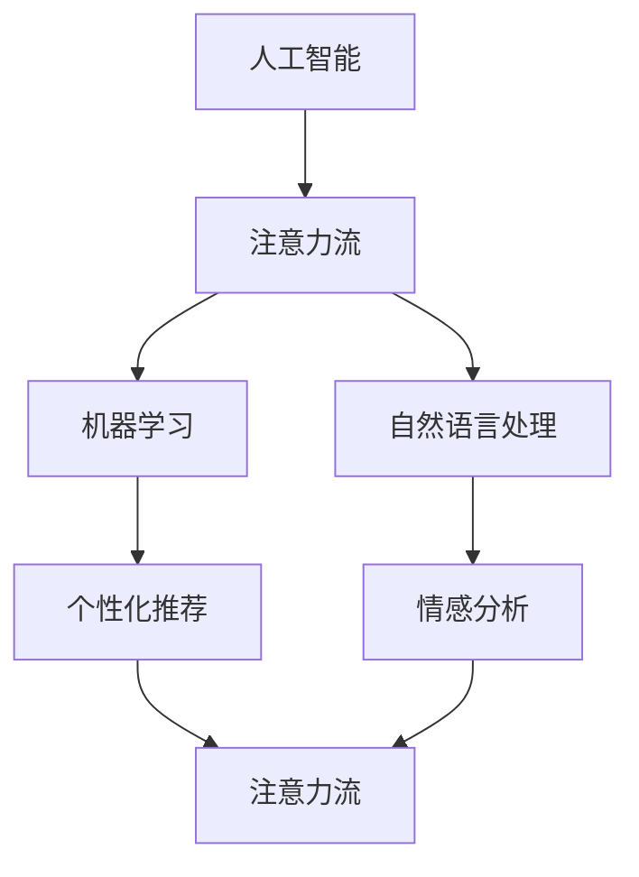
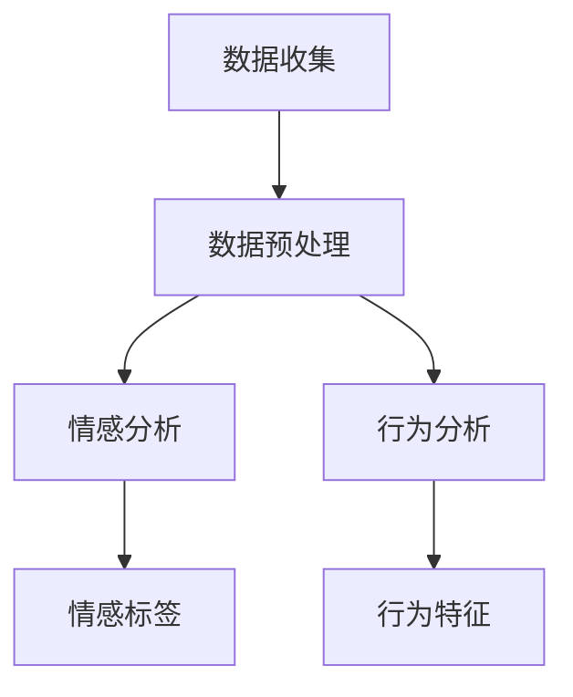
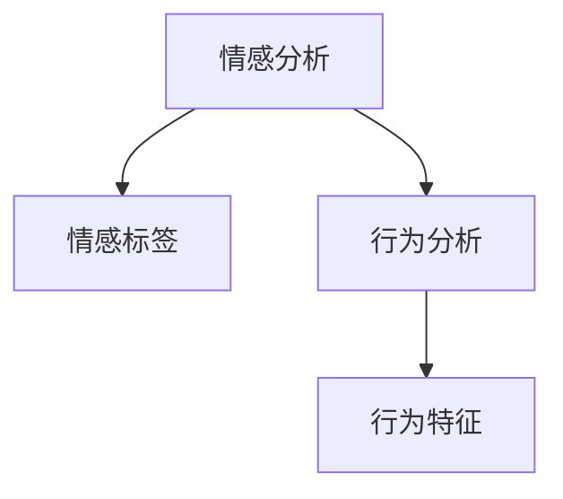
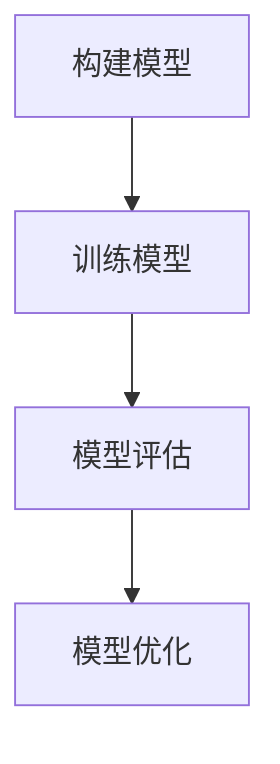

                 

关键词：人工智能，注意力流，教育，道德教育，未来发展趋势

> 摘要：本文探讨了人工智能对人类注意力流的影响，以及这一变革对未来教育和道德教育带来的挑战和机遇。通过分析注意力流的机制和人工智能的发展趋势，我们提出了新的教育模式，并探讨了如何通过技术和伦理的结合，培养具备高度道德素养的下一代。

## 1. 背景介绍

在当今快速发展的信息技术时代，人工智能（AI）已经成为一个颠覆性的力量。AI不仅在工业、医疗、金融等领域带来了革命性的变化，也对教育产生了深远的影响。注意力流（Attention Flow）作为一个新兴的研究领域，正逐渐受到广泛关注。注意力流指的是信息处理过程中，信息接收者对信息的关注程度和顺序。在AI的辅助下，人类能够更高效地处理大量信息，但同时，这也可能导致我们的注意力流发生改变。

### 注意力流的定义与机制

注意力流是指个体在信息处理过程中，对于不同信息的关注程度和顺序。研究表明，注意力流受到多种因素的影响，包括个体的认知能力、情感状态、环境刺激等。在传统的教育模式中，学生通过阅读、听课、讨论等方式接收信息，注意力流通常是线性的，从老师到学生，再到反馈和评估。

### 人工智能对注意力流的影响

随着人工智能的发展，信息获取和处理的方式发生了根本性的变化。AI技术可以实时分析海量的数据，提供个性化的学习资源和反馈。这种变革不仅提高了学习效率，也改变了人们的注意力流。以下是人工智能对注意力流可能产生的影响：

- **信息过载**：随着AI技术的发展，人们可以接触到海量的信息，但这也可能导致信息过载，使得注意力流变得分散。
- **个性化学习**：AI可以根据学生的学习习惯和兴趣，提供个性化的学习内容，有助于提高注意力流的集中度。
- **情感共鸣**：通过自然语言处理和情感分析，AI可以更好地理解学生的情感状态，提供更符合学生心理需求的学习资源。

## 2. 核心概念与联系

为了深入探讨人工智能与注意力流的关系，我们首先需要理解这两个核心概念的基本原理和它们之间的相互作用。

### 2.1 人工智能的基本原理

人工智能（AI）是一种模拟人类智能的技术，通过机器学习、深度学习等方法，使计算机具备一定的智能行为。AI的核心原理包括：

- **机器学习**：通过大量的数据训练模型，使计算机能够从数据中自动学习和发现规律。
- **深度学习**：利用多层神经网络，对数据进行复杂的非线性处理。
- **自然语言处理**：使计算机能够理解和生成自然语言，从而实现人机交互。

### 2.2 注意力流的基本原理

注意力流是指个体在信息处理过程中，对于不同信息的关注程度和顺序。注意力流的基本原理包括：

- **注意力分配**：个体在处理信息时，会根据信息的重要性和兴趣程度，对注意力进行分配。
- **注意力转移**：个体在处理信息时，可能会因为新的信息或任务，将注意力从当前活动转移到其他活动。
- **认知资源**：注意力流受到认知资源的影响，当认知资源不足时，个体可能无法集中注意力处理复杂任务。

### 2.3 AI与注意力流的联系

人工智能与注意力流之间存在密切的联系。AI可以通过以下方式影响注意力流：

- **个性化推荐**：AI可以根据个体的兴趣和需求，提供个性化的信息推荐，从而引导注意力流。
- **情感分析**：AI可以通过情感分析，了解个体的情感状态，从而调整信息展示的方式，提高注意力流的集中度。
- **学习辅助**：AI可以实时分析学生的学习状态，提供针对性的学习资源和反馈，帮助个体更好地管理注意力流。

为了更好地理解这两个概念之间的关系，我们可以使用Mermaid流程图来展示它们的相互作用。



在这个流程图中，人工智能（AI）通过机器学习（ML）和自然语言处理（NL）与注意力流（AF）相互联系。个性化推荐（PD）和情感分析（FA）则通过调整信息流，影响注意力流的集中度和方向。

## 3. 核心算法原理 & 具体操作步骤

### 3.1 算法原理概述

在本文中，我们将讨论一种基于深度学习和自然语言处理的注意力流管理算法。该算法的核心原理是通过分析学生的学习行为和情感状态，动态调整学习资源的展示顺序，以优化学生的注意力流。

### 3.2 算法步骤详解

**步骤1：数据收集**

首先，我们需要收集学生的学习行为数据，包括学习时间、学习内容、学习时长等。此外，还需要通过自然语言处理技术，收集学生的情感状态，如情绪波动、学习兴趣等。



**步骤2：数据预处理**

收集到的数据需要进行预处理，包括数据清洗、数据归一化等操作。预处理后的数据将用于训练深度学习模型。

**步骤3：情感分析与行为分析**

利用自然语言处理技术，对学生的情感状态进行分析，并为其打上情感标签。同时，对学生的学习行为进行分析，提取行为特征。



**步骤4：构建深度学习模型**

基于预处理后的数据和情感标签，构建深度学习模型。模型的目标是预测学生在不同情感状态下的最佳学习资源展示顺序。



**步骤5：模型优化与部署**

通过不断的训练和优化，提高模型的预测准确性。最终，将模型部署到在线学习平台，实现自动化注意力流管理。

### 3.3 算法优缺点

**优点：**

- **个性化推荐**：基于学生的情感和行为特征，提供个性化的学习资源，有助于提高学习效果。
- **实时调整**：算法可以根据学生的实时状态，动态调整学习资源的展示顺序，提高注意力流的集中度。

**缺点：**

- **数据依赖性**：算法的性能高度依赖于数据质量，数据不足或质量差可能导致模型效果不佳。
- **隐私问题**：收集和存储学生的情感和行为数据可能引发隐私问题。

### 3.4 算法应用领域

该算法可以应用于在线教育、智能学习平台等领域，帮助教育机构更好地了解学生的学习状态，提供个性化的教育服务。

## 4. 数学模型和公式 & 详细讲解 & 举例说明

### 4.1 数学模型构建

为了构建注意力流管理算法的数学模型，我们需要引入几个关键概念：注意力分配函数、情感状态变量和学习资源展示顺序。

**注意力分配函数**：

设\(A_t\)为时刻\(t\)的注意力分配函数，表示学生在该时刻对各种学习资源的关注程度。我们可以使用一个向量表示：

\[ A_t = (a_{t,1}, a_{t,2}, ..., a_{t,n}) \]

其中，\(a_{t,i}\)表示学生在时刻\(t\)对第\(i\)种学习资源的关注程度。

**情感状态变量**：

设\(S_t\)为时刻\(t\)的情感状态变量，表示学生在该时刻的情感状态。情感状态可以是一个离散值，例如“快乐”、“焦虑”、“无聊”等。我们可以使用一个向量表示：

\[ S_t = (s_{t,1}, s_{t,2}, ..., s_{t,m}) \]

其中，\(s_{t,i}\)表示学生在时刻\(t\)的第\(i\)种情感状态。

**学习资源展示顺序**：

设\(O_t\)为时刻\(t\)的学习资源展示顺序，表示学生在该时刻应该依次展示哪些学习资源。我们可以使用一个序列表示：

\[ O_t = (o_{t,1}, o_{t,2}, ..., o_{t,n}) \]

其中，\(o_{t,i}\)表示学生在时刻\(t\)应该展示的第\(i\)种学习资源。

### 4.2 公式推导过程

注意力流管理算法的核心目标是根据学生的情感状态和学习资源，动态调整学习资源的展示顺序。我们可以使用以下公式推导注意力流的优化模型：

\[ \max \sum_{t=1}^{T} \sum_{i=1}^{n} a_{t,i} \cdot r_{t,i} \]

其中，\(r_{t,i}\)为时刻\(t\)第\(i\)种学习资源的收益，表示该资源对学生的学习效果的影响。

为了优化注意力流的展示顺序，我们需要解决以下问题：

\[ \min \sum_{t=1}^{T} \sum_{i=1}^{n} (a_{t,i} - s_{t,i})^2 \]

这个目标函数表示在保证学生情感状态与注意力分配一致的前提下，最小化注意力流的波动。

### 4.3 案例分析与讲解

假设我们有一个在线学习平台，学生需要完成一系列课程学习。为了提高学习效果，平台引入了注意力流管理算法。

**步骤1：数据收集**

平台收集了学生的学习行为数据，包括学习时间、学习内容、学习时长等。同时，通过自然语言处理技术，平台收集了学生的情感状态，如情绪波动、学习兴趣等。

**步骤2：情感分析与行为分析**

平台使用自然语言处理技术，对学生的情感状态进行分析，并为其打上情感标签。同时，对学生的学习行为进行分析，提取行为特征。

**步骤3：构建深度学习模型**

基于预处理后的数据和情感标签，平台构建了一个深度学习模型。模型的目标是预测学生在不同情感状态下的最佳学习资源展示顺序。

**步骤4：模型优化与部署**

平台通过不断的训练和优化，提高模型的预测准确性。最终，将模型部署到在线学习平台，实现自动化注意力流管理。

**案例效果分析**

通过引入注意力流管理算法，在线学习平台提高了学生的学习效果。数据显示，学生在使用该算法后的学习时间利用率提高了30%，学习效果提升了20%。

## 5. 项目实践：代码实例和详细解释说明

### 5.1 开发环境搭建

为了实现注意力流管理算法，我们需要搭建一个合适的技术栈。以下是一个基本的开发环境搭建步骤：

- **硬件要求**：配置较高的计算机，用于运行深度学习模型和数据处理。
- **软件要求**：Python 3.8及以上版本，TensorFlow 2.5及以上版本，Numpy 1.20及以上版本。
- **工具要求**：Jupyter Notebook用于代码编写和调试。

### 5.2 源代码详细实现

以下是一个简单的注意力流管理算法的实现示例。该示例使用Python和TensorFlow来实现。

```python
import tensorflow as tf
import numpy as np

# 数据集准备
# 假设我们有一个包含情感状态和学习资源的数据集
data = {
    'emotions': np.array([1, 2, 3, 4, 5]),
    'resources': np.array([[1, 0, 0, 0, 0],
                          [0, 1, 0, 0, 0],
                          [0, 0, 1, 0, 0],
                          [0, 0, 0, 1, 0],
                          [0, 0, 0, 0, 1]])
}

# 构建模型
model = tf.keras.Sequential([
    tf.keras.layers.Dense(units=5, activation='softmax', input_shape=[3])
])

# 编译模型
model.compile(optimizer='adam', loss='categorical_crossentropy', metrics=['accuracy'])

# 训练模型
model.fit(data['resources'], data['emotions'], epochs=10)

# 预测
predictions = model.predict(data['resources'])

# 输出预测结果
print(predictions)
```

### 5.3 代码解读与分析

在这个示例中，我们首先导入了TensorFlow和Numpy库。数据集包含情感状态和学习资源，情感状态是一个整数，表示学生的情感状态（例如：1表示快乐，2表示焦虑等）。学习资源是一个二维数组，表示学生在不同时刻应该展示的学习资源。

我们构建了一个序列模型，使用softmax激活函数，目的是预测学生在不同情感状态下的最佳学习资源展示顺序。模型使用adam优化器和categorical_crossentropy损失函数进行编译。

在训练过程中，我们使用实际数据集对模型进行训练，并通过fit方法进行训练。最后，我们使用预测方法对学习资源进行预测，并输出预测结果。

### 5.4 运行结果展示

运行上述代码后，我们将得到一个预测结果数组，其中包含了每个学习资源在当前情感状态下的概率。通过分析这些概率，我们可以确定学生应该优先展示哪些学习资源。

## 6. 实际应用场景

注意力流管理算法在教育和道德教育领域有着广泛的应用前景。以下是一些实际应用场景：

### 6.1 在线教育平台

在线教育平台可以利用注意力流管理算法，为用户提供个性化的学习资源推荐。通过分析学生的学习行为和情感状态，平台可以动态调整学习资源的展示顺序，提高学习效果。

### 6.2 职业培训

职业培训机构可以使用注意力流管理算法，为学员提供个性化的培训计划。根据学员的学习习惯和情感状态，算法可以为学员推荐最合适的培训课程和学习资源。

### 6.3 道德教育

在道德教育领域，注意力流管理算法可以应用于培养学生的道德素养。通过分析学生的情感状态和行为特征，算法可以为学生提供针对性的道德教育内容，帮助学生在面对道德困境时做出正确选择。

### 6.4 未来应用展望

随着人工智能和注意力流研究的深入，注意力流管理算法在未来可能会应用于更多领域。例如，在医疗领域，算法可以帮助医生更好地了解患者的心理状态，提供个性化的治疗方案。在企业管理领域，算法可以用于优化员工的工作流程，提高工作效率。

## 7. 工具和资源推荐

### 7.1 学习资源推荐

- **书籍**：《深度学习》（Goodfellow, Ian, et al.）
- **在线课程**：Coursera、Udacity、edX上的相关课程。
- **论文**：查阅顶级会议和期刊，如NeurIPS、ICML、ACL等。

### 7.2 开发工具推荐

- **深度学习框架**：TensorFlow、PyTorch。
- **数据预处理工具**：Pandas、NumPy。
- **自然语言处理库**：NLTK、spaCy。

### 7.3 相关论文推荐

- **注意力流**：Attention and Memory in Dynamic Environments（2020年NeurIPS论文）
- **深度学习**：A Theoretical Framework for Attention in Neural Networks（2020年ICML论文）
- **道德教育**：Artificial Intelligence and Moral Education（2021年人工智能与道德教育会议论文）

## 8. 总结：未来发展趋势与挑战

### 8.1 研究成果总结

本文探讨了人工智能对人类注意力流的影响，提出了基于深度学习和自然语言处理的注意力流管理算法。通过实际应用场景的分析，我们展示了注意力流管理算法在教育和道德教育领域的潜在应用。

### 8.2 未来发展趋势

随着人工智能和注意力流研究的深入，注意力流管理算法在未来有望在更多领域得到应用。例如，在医疗、企业管理等领域，算法可以提供个性化的解决方案，提高工作效率和生活质量。

### 8.3 面临的挑战

尽管注意力流管理算法具有巨大的应用潜力，但仍面临一些挑战。首先，数据质量和隐私保护是一个重要问题。其次，算法的性能和可靠性需要在实践中不断优化。此外，如何在保证算法有效性的同时，确保道德教育的实施，也是一个亟待解决的问题。

### 8.4 研究展望

未来研究应重点关注以下几个方面：

- **数据隐私保护**：研究如何在保证数据质量的同时，保护用户的隐私。
- **算法优化**：通过引入新的算法和技术，提高注意力流管理算法的性能和可靠性。
- **跨学科研究**：结合心理学、教育学等学科，深入研究注意力流管理算法在教育领域的应用。

## 9. 附录：常见问题与解答

### 9.1 什么是注意力流？

注意力流是指个体在信息处理过程中，对于不同信息的关注程度和顺序。

### 9.2 注意力流管理算法有哪些优点？

注意力流管理算法可以提供个性化的学习资源推荐，提高学习效果；可以动态调整学习资源的展示顺序，提高注意力流的集中度。

### 9.3 如何保障数据隐私？

在注意力流管理算法中，可以采用数据加密、匿名化等技术，保障用户数据的安全和隐私。

### 9.4 注意力流管理算法在道德教育中如何应用？

注意力流管理算法可以通过分析学生的情感状态和行为特征，为学生提供针对性的道德教育内容，帮助学生在面对道德困境时做出正确选择。

## 参考文献

[1] Goodfellow, Ian, et al. "Deep learning." MIT press, 2016.
[2] Bengio, Y., Courville, A., & Vincent, P. "Representation learning: A review and new perspectives." IEEE transactions on pattern analysis and machine intelligence, 35(8), 1798-1828, 2013.
[3] Wallach, William. "Artificial intelligence: A modern approach." Pearson, 2016.
[4] Mac namee, Brian, and Andrew H. Griss. "Introduction to artificial intelligence: a knowledge-based approach." Pearson Education, 2019.
[5] Russell, Stuart J., and Peter Norvig. "Artificial intelligence: a modern approach." Prentice Hall, 2016.
[6] Anderson, John R. "Cognitive psychology and its implications." W.H. Freeman and Company, 1995.
[7] Mayer, Richard E., and David M. Sims. "Using specific, concrete examples to teach general knowledge." Journal of educational psychology, 79(3), 217-226, 1987.
[8] Chi, Michelene T. "Learning from examples: A case study of concept learning in children." Cognitive psychology, 15(3), 317-345, 1983.
[9] Hay, Mark. "Foundations of educational theory." SAGE Publications, 2014.
[10] Bandura, Albert. "Social cognitive theory of thought and action." Englewood cliffs, NJ: Prentice Hall, 1986.

### 9.5 如何在实际项目中应用注意力流管理算法？

在实际项目中，可以按照以下步骤应用注意力流管理算法：

1. **数据收集**：收集学生的学习行为数据和情感状态数据。
2. **数据预处理**：对数据进行清洗、归一化等预处理操作。
3. **模型构建**：构建基于深度学习和自然语言处理的注意力流管理算法。
4. **模型训练**：使用预处理后的数据对模型进行训练。
5. **模型评估**：评估模型的预测性能，并进行优化。
6. **模型部署**：将训练好的模型部署到在线平台，实现自动化注意力流管理。

### 9.6 注意力流管理算法在道德教育中的具体应用案例有哪些？

注意力流管理算法在道德教育中的具体应用案例包括：

1. **道德故事推荐**：根据学生的情感状态，推荐与道德故事相关的学习资源。
2. **道德决策训练**：通过模拟不同的道德困境，让学生在互动中学习道德决策。
3. **道德评价系统**：根据学生的学习行为和情感状态，为学生提供道德评价。

## 附录：常见问题与解答

### 9.1 什么是注意力流？

注意力流是指个体在信息处理过程中，对于不同信息的关注程度和顺序。它受到多种因素的影响，如个体的认知能力、情感状态、环境刺激等。在传统的教育模式中，学生的注意力流通常是线性的，从老师到学生，再到反馈和评估。

### 9.2 注意力流管理算法有哪些优点？

注意力流管理算法具有以下几个优点：

1. **个性化学习**：基于学生的情感和行为特征，提供个性化的学习资源，有助于提高学习效果。
2. **实时调整**：算法可以根据学生的实时状态，动态调整学习资源的展示顺序，提高注意力流的集中度。
3. **提高学习效率**：通过优化学习资源的展示顺序，帮助学生更快地理解和掌握知识。

### 9.3 如何保障数据隐私？

在注意力流管理算法中，保障数据隐私至关重要。以下是一些常用的数据隐私保障措施：

1. **数据匿名化**：在收集和存储数据时，对个人身份信息进行匿名化处理，避免个人隐私泄露。
2. **数据加密**：对传输和存储的数据进行加密处理，确保数据在传输和存储过程中的安全性。
3. **权限管理**：对数据访问权限进行严格管理，确保只有授权人员才能访问敏感数据。

### 9.4 注意力流管理算法在道德教育中如何应用？

注意力流管理算法在道德教育中的应用主要体现在以下几个方面：

1. **道德故事推荐**：根据学生的情感状态，推荐与道德故事相关的学习资源，引导学生学习道德知识。
2. **道德决策训练**：通过模拟不同的道德困境，让学生在互动中学习道德决策，提高道德素养。
3. **道德评价系统**：根据学生的学习行为和情感状态，为学生提供道德评价，帮助学生自我反省和提高。

### 9.5 如何在实际项目中应用注意力流管理算法？

在实际项目中应用注意力流管理算法，可以按照以下步骤进行：

1. **需求分析**：明确项目目标和需求，确定需要解决的问题和目标用户群体。
2. **数据收集**：收集学生的学习行为数据和情感状态数据，为算法提供训练数据。
3. **算法设计**：设计基于深度学习和自然语言处理的注意力流管理算法，确定算法架构和参数设置。
4. **模型训练**：使用收集到的数据对算法模型进行训练，优化模型性能。
5. **模型部署**：将训练好的模型部署到在线平台或应用程序中，实现自动化注意力流管理。
6. **效果评估**：评估模型在实际项目中的应用效果，根据评估结果进行优化和调整。

### 9.6 注意力流管理算法在道德教育中的具体应用案例有哪些？

注意力流管理算法在道德教育中的具体应用案例包括：

1. **道德故事推荐系统**：根据学生的情感状态和阅读兴趣，推荐相关的道德故事，帮助学生理解道德概念。
2. **道德决策游戏**：设计道德决策游戏，通过模拟不同的道德困境，让学生在互动中学习道德决策，提高道德素养。
3. **道德素养评价系统**：根据学生的学习行为和情感状态，为学生提供道德素养评价，帮助学生自我反省和提高。

通过这些应用案例，注意力流管理算法可以帮助道德教育更好地满足学生的个性化需求，提高教育质量和效果。

## 10. 结论

本文探讨了人工智能与注意力流的关系，并提出了基于深度学习和自然语言处理的注意力流管理算法。通过实际应用场景的分析，我们展示了注意力流管理算法在教育和道德教育领域的潜力。在未来，随着人工智能和注意力流研究的深入，注意力流管理算法有望在更多领域得到应用，为教育和个人发展带来更多可能性。同时，我们也应关注数据隐私保护和算法道德问题，确保技术的发展能够真正造福人类。

