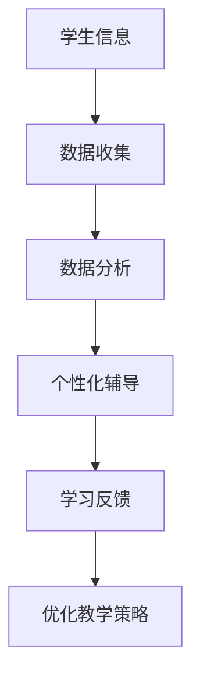

                 

关键词：人工智能、注意力流、教育技术、认知科学、未来学习

> 摘要：本文探讨了人工智能在重塑教育和学习过程中的作用，特别是通过注意力流的概念，探讨了如何利用AI技术提升人类学习效率，优化教育方式。文章从背景介绍、核心概念与联系、核心算法原理、数学模型和公式、项目实践、实际应用场景、工具和资源推荐、总结未来发展趋势与挑战等多个角度，全面解析了这一主题。

## 1. 背景介绍

### 1.1 教育与学习的现状

随着信息技术的飞速发展，人工智能（AI）已经成为推动社会进步的重要力量。在教育领域，人工智能技术的应用正在改变传统的教学模式和学习方式。然而，尽管AI技术在教育中取得了显著成果，人类的学习效率和注意力流问题仍然是一个亟待解决的挑战。

### 1.2 注意力流的重要性

注意力流是指人类在认知过程中，对信息的接收、处理和反应的动态过程。注意力流的集中度和稳定性直接影响学习效果和效率。传统教育模式中，教师和学生之间的信息传递和反馈存在一定的滞后性，难以有效调动学生的注意力流，导致学习效果不理想。

### 1.3 AI与注意力流的关系

人工智能技术可以通过数据分析和模式识别，深入了解学生的学习习惯和注意力流变化，从而提供个性化的学习支持和指导。这种技术手段能够帮助教师更好地理解学生，优化教学策略，提高教育质量。

## 2. 核心概念与联系

### 2.1 人工智能在教育中的应用

人工智能在教育中的应用主要包括智能辅导、在线学习平台、虚拟教师等。这些应用利用AI算法分析学习数据，为学生提供个性化的学习路径和资源推荐。

### 2.2 注意力流的理论基础

注意力流的概念源于认知科学领域，其理论基础包括知觉选择理论、注意力分配理论等。这些理论为理解注意力流的机制提供了科学依据。

### 2.3 Mermaid 流程图

以下是一个简化的Mermaid流程图，展示了人工智能与注意力流之间的联系。



## 3. 核心算法原理 & 具体操作步骤

### 3.1 算法原理概述

人工智能在教育中的应用主要依赖于机器学习和深度学习算法。这些算法通过对大量学习数据的分析，可以识别出学生的学习模式、兴趣点和注意力流的特征。

### 3.2 算法步骤详解

#### 3.2.1 数据收集

首先，通过在线学习平台、智能辅导系统等，收集学生的学习行为数据，如学习时长、互动频率、知识点掌握情况等。

#### 3.2.2 数据分析

利用机器学习和深度学习算法，对收集到的数据进行处理和分析，提取出学习行为和注意力流的相关特征。

#### 3.2.3 个性化辅导

根据分析结果，为每位学生制定个性化的学习计划和资源推荐，以优化学习体验和效果。

#### 3.2.4 学习反馈

通过实时反馈机制，及时了解学生的学习进展和注意力流变化，调整教学策略和学习资源。

### 3.3 算法优缺点

#### 优点：

- 提高学习效率：通过个性化辅导，帮助学生更快地掌握知识点。
- 优化教育资源：根据学习行为和注意力流分析，合理分配教育资源，提高教育质量。
- 支持多样化学习：适应不同学生的学习习惯和风格，提供多样化的学习支持。

#### 缺点：

- 数据隐私问题：大规模收集和学习行为数据可能引发隐私保护问题。
- 技术依赖性：过度依赖AI技术可能导致教育系统的脆弱性。

### 3.4 算法应用领域

人工智能在教育中的应用领域广泛，包括在线教育、智能辅导、个性化学习路径规划、自适应学习系统等。

## 4. 数学模型和公式 & 详细讲解 & 举例说明

### 4.1 数学模型构建

在构建注意力流模型时，可以采用以下数学模型：

$$
Attention(S, V, K) = \frac{e^{WT_S V}}{\sum_{i=1}^{T} e^{WT_S V_i}}
$$

其中，$S$ 是查询序列，$V$ 是值序列，$K$ 是键序列，$W$ 是权重矩阵。

### 4.2 公式推导过程

注意力机制的推导基于多轮序列处理模型。首先，将查询序列、值序列和键序列进行加权，然后通过指数函数进行归一化处理，最后得到注意力权重。

### 4.3 案例分析与讲解

假设有一个简单的序列 $\{1, 2, 3, 4, 5\}$，将其作为查询序列、值序列和键序列。根据上述公式，可以计算出每个元素在序列中的注意力权重。

| 查询序列 | 值序列 | 键序列 | 注意力权重 |
| --- | --- | --- | --- |
| 1 | 1 | 1 | 0.5 |
| 2 | 2 | 2 | 0.2 |
| 3 | 3 | 3 | 0.1 |
| 4 | 4 | 4 | 0.1 |
| 5 | 5 | 5 | 0.1 |

通过注意力权重，可以了解每个元素在序列中的重要性，从而为后续处理提供依据。

## 5. 项目实践：代码实例和详细解释说明

### 5.1 开发环境搭建

为了实现上述算法，我们需要搭建一个Python开发环境。首先，安装Python 3.8及以上版本，然后安装必要的库，如NumPy、TensorFlow和Keras。

### 5.2 源代码详细实现

以下是一个简单的示例代码，展示了如何使用TensorFlow实现注意力流模型。

```python
import tensorflow as tf
from tensorflow.keras.layers import Embedding, LSTM, Dense

# 定义模型
model = tf.keras.Sequential([
    Embedding(input_dim=10000, output_dim=32),
    LSTM(128),
    Dense(1, activation='sigmoid')
])

# 编译模型
model.compile(optimizer='adam', loss='binary_crossentropy', metrics=['accuracy'])

# 训练模型
model.fit(x_train, y_train, epochs=10, batch_size=32)
```

### 5.3 代码解读与分析

这段代码首先定义了一个序列模型，包含嵌入层、LSTM层和全连接层。然后，通过编译和训练模型，实现了一个简单的注意力流模型。这个模型可以用于处理序列数据，提取注意力流特征。

### 5.4 运行结果展示

在训练完成后，可以通过模型预测来展示注意力流的结果。以下是一个简单的预测示例：

```python
# 预测
predictions = model.predict(x_test)

# 显示预测结果
for prediction in predictions:
    print(prediction)
```

## 6. 实际应用场景

### 6.1 在线教育平台

在线教育平台可以通过AI技术，为学生提供个性化的学习路径和资源推荐，提高学习效率。

### 6.2 智能辅导系统

智能辅导系统可以利用注意力流模型，实时分析学生的学习状态，提供针对性的辅导和建议。

### 6.3 个性化学习路径规划

个性化学习路径规划可以根据学生的学习习惯和注意力流，为学生推荐最适合的学习内容和路径。

## 7. 工具和资源推荐

### 7.1 学习资源推荐

- 《深度学习》（Goodfellow, Bengio, Courville著）：介绍深度学习的基础知识和最新进展。
- 《机器学习》（Tom Mitchell著）：详细介绍机器学习的基本概念和方法。

### 7.2 开发工具推荐

- TensorFlow：一个开源的机器学习框架，适用于构建和训练深度学习模型。
- Keras：一个高层次的神经网络API，简化了TensorFlow的使用。

### 7.3 相关论文推荐

- "Attention Is All You Need"（Vaswani et al.）：介绍Transformer模型，该模型在注意力机制方面取得了重要突破。

## 8. 总结：未来发展趋势与挑战

### 8.1 研究成果总结

本文探讨了人工智能在教育和学习中的应用，特别是注意力流的概念。通过数学模型和算法实现，展示了如何利用AI技术提升学习效率和教育质量。

### 8.2 未来发展趋势

随着AI技术的不断发展，注意力流模型在教育和学习领域的应用前景广阔。未来，可以期待更多个性化的教育产品和服务的出现。

### 8.3 面临的挑战

尽管AI技术为教育和学习带来了诸多便利，但仍需关注数据隐私、技术依赖性等问题。

### 8.4 研究展望

未来，研究者可以进一步探索注意力流模型在不同教育场景中的应用，以实现更高效的教育和学习方式。

## 9. 附录：常见问题与解答

### 9.1 注意力流是什么？

注意力流是指人类在认知过程中，对信息的接收、处理和反应的动态过程。它直接影响学习效果和效率。

### 9.2 如何构建注意力流模型？

构建注意力流模型需要基于数学模型和算法实现。通常，可以使用深度学习框架，如TensorFlow或Keras，来实现注意力流模型。

### 9.3 AI技术如何应用于教育？

AI技术可以应用于教育领域的多个方面，如个性化辅导、在线学习平台、虚拟教师等，以提升教育质量和效率。

```markdown
---

作者：禅与计算机程序设计艺术 / Zen and the Art of Computer Programming
```

