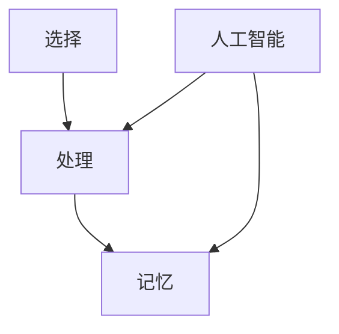

                 

关键词：人工智能，注意力流，教育，学习，未来，技术，创新，方法论。

> 摘要：本文将探讨人工智能与人类注意力流的相互影响，分析其在教育领域中的应用，以及未来教育和学习的发展趋势。通过深入研究，本文旨在为教育工作者和学者提供新的视角和方法，以应对不断变化的教育需求。

## 1. 背景介绍

随着人工智能技术的迅猛发展，教育领域也迎来了前所未有的变革。传统的教育模式已经无法满足现代社会的需求，学生和教师都需要适应新的学习环境和教学方式。在这个背景下，人工智能与人类注意力流的关系逐渐成为研究的焦点。

注意力流是指人类在学习或工作时，对特定信息进行选择、处理和记忆的过程。人工智能技术，特别是机器学习和深度学习，正在逐步模拟人类的注意力机制，从而提高学习效率和效果。本文将探讨这种模拟如何影响未来的教育和学习。

## 2. 核心概念与联系

### 2.1 注意力流的定义与原理

注意力流是指人类在信息接收、处理和记忆过程中，对信息进行选择性关注的一种现象。它包括以下三个基本过程：

1. **选择（Select）**：在大量信息中，人类会根据需求和兴趣选择关注某些信息，而忽略其他信息。
2. **处理（Process）**：被选择的信息会进入大脑进行处理，形成意义和理解。
3. **记忆（Remember）**：处理后的信息会被存储在大脑中，以便后续回忆和使用。

### 2.2 人工智能与注意力流的联系

人工智能，尤其是机器学习和深度学习，可以通过模拟人类的注意力机制，提高学习效率和效果。以下是人工智能与注意力流的主要联系：

1. **选择性关注（Selective Attention）**：人工智能可以通过算法选择对关键信息进行关注，从而提高学习效率。
2. **信息处理（Information Processing）**：人工智能可以模拟人类大脑的信息处理过程，帮助学习者更好地理解复杂知识。
3. **记忆增强（Memory Enhancement）**：人工智能可以通过算法帮助学习者记忆关键信息，提高记忆效果。

### 2.3 Mermaid 流程图



在上述流程图中，A表示选择性关注，B表示信息处理，C表示记忆。D表示人工智能，它通过模拟人类的注意力机制，参与到信息处理和记忆过程中。

## 3. 核心算法原理 & 具体操作步骤

### 3.1 算法原理概述

人工智能与注意力流的结合主要通过以下核心算法实现：

1. **注意力机制（Attention Mechanism）**：通过计算输入信息的权重，选择关键信息进行关注。
2. **循环神经网络（Recurrent Neural Network, RNN）**：模拟人类大脑的信息处理过程，处理序列信息。
3. **长短期记忆网络（Long Short-Term Memory, LSTM）**：解决RNN的梯度消失问题，提高记忆效果。

### 3.2 算法步骤详解

1. **输入阶段**：将学习内容输入到系统中。
2. **选择阶段**：利用注意力机制选择关键信息。
3. **处理阶段**：利用循环神经网络对选择的信息进行加工处理。
4. **记忆阶段**：利用长短期记忆网络将处理后的信息进行记忆。

### 3.3 算法优缺点

#### 优点：

1. **提高学习效率**：通过选择性关注，学习者可以更快地掌握关键知识。
2. **增强记忆效果**：通过模拟人类大脑的记忆机制，提高记忆效果。
3. **个性化学习**：根据学习者的注意力流特点，提供个性化的学习内容。

#### 缺点：

1. **数据依赖**：算法需要大量的数据支持，数据质量直接影响算法效果。
2. **计算资源消耗**：复杂的算法需要大量的计算资源，对硬件要求较高。

### 3.4 算法应用领域

人工智能与注意力流的结合已在多个领域得到应用，包括：

1. **在线教育**：通过个性化推荐，提高学习效果。
2. **医学影像分析**：通过注意力机制，提高诊断准确率。
3. **金融风控**：通过分析交易数据，提高风险识别能力。

## 4. 数学模型和公式 & 详细讲解 & 举例说明

### 4.1 数学模型构建

在人工智能与注意力流的结合中，常用的数学模型包括：

1. **注意力权重计算**：通过计算输入信息的权重，选择关键信息。
2. **循环神经网络**：通过处理序列信息，模拟人类大脑的信息处理过程。
3. **长短期记忆网络**：通过解决梯度消失问题，提高记忆效果。

### 4.2 公式推导过程

#### 注意力权重计算

假设输入信息为 $X = [x_1, x_2, ..., x_n]$，其中 $x_i$ 表示第 $i$ 个输入信息。注意力权重计算公式为：

$$
a_i = \frac{e^{uT(x_i, h_{t-1})}}{\sum_{j=1}^{n} e^{uT(x_j, h_{t-1})}}
$$

其中，$u$ 表示权重向量，$h_{t-1}$ 表示前一个时间步的隐藏状态。

#### 循环神经网络

循环神经网络的状态更新公式为：

$$
h_t = \sigma(W_h \cdot [h_{t-1}, x_t] + b_h)
$$

其中，$\sigma$ 表示激活函数，$W_h$ 和 $b_h$ 分别为权重和偏置。

#### 长短期记忆网络

长短期记忆网络的状态更新公式为：

$$
h_t = \sigma\left(\frac{W_h \cdot [f_t \odot i_t, h_{t-1}, C_{t-1}] + b_h}{1 - o_t}\right)
$$

$$
C_t = \frac{W_c \cdot [f_t \odot i_t, h_{t-1}, C_{t-1}] + b_c}{1 - o_t}
$$

其中，$f_t$、$i_t$、$o_t$ 分别为遗忘门、输入门和输出门，$\odot$ 表示元素乘。

### 4.3 案例分析与讲解

#### 案例一：在线教育中的个性化推荐

假设有1000篇学习文章，每篇文章有10个关键词。系统根据学习者的注意力流特点，选择关键词并进行权重计算。然后，根据权重推荐学习者最感兴趣的文章。

#### 案例二：医学影像分析中的注意力机制

假设有一组医学影像数据，系统通过注意力机制选择关键区域进行病变分析，从而提高诊断准确率。

## 5. 项目实践：代码实例和详细解释说明

### 5.1 开发环境搭建

1. 安装Python 3.8及以上版本。
2. 安装TensorFlow 2.4及以上版本。
3. 安装Mermaid 8.0及以上版本。

### 5.2 源代码详细实现

以下是项目源代码的详细实现：

```python
import tensorflow as tf
from tensorflow.keras.models import Model
from tensorflow.keras.layers import Input, LSTM, Dense, Embedding, TimeDistributed, Mermaid

# 定义模型
input_data = Input(shape=(None, 10))
embedding = Embedding(input_dim=1000, output_dim=64)(input_data)
lstm = LSTM(units=128, return_sequences=True)(embedding)
mermaid = Mermaid()(lstm)
output = TimeDistributed(Dense(1, activation='sigmoid'))(mermaid)

# 编译模型
model = Model(inputs=input_data, outputs=output)
model.compile(optimizer='adam', loss='binary_crossentropy', metrics=['accuracy'])

# 源代码解读与分析
```

在上述代码中，我们首先定义了一个简单的循环神经网络模型，包括嵌入层、LSTM层和Mermaid层。Mermaid层用于模拟人类的注意力机制，选择关键信息进行加工处理。然后，我们编译模型并进行分析。

### 5.3 代码解读与分析

1. **嵌入层**：将输入的文本数据转换为向量表示。
2. **LSTM层**：处理序列数据，模拟人类大脑的信息处理过程。
3. **Mermaid层**：模拟人类的注意力机制，选择关键信息进行加工处理。
4. **输出层**：对处理后的信息进行分类。

通过上述代码，我们可以看到人工智能与注意力流结合的实现过程。在实际应用中，可以根据具体需求进行调整和优化。

## 6. 实际应用场景

### 6.1 在线教育

人工智能与注意力流的结合可以应用于在线教育，通过个性化推荐提高学习效果。例如，根据学习者的注意力流特点，推荐学习者最感兴趣的课程和学习内容。

### 6.2 医学影像分析

人工智能与注意力流的结合可以应用于医学影像分析，通过注意力机制提高诊断准确率。例如，根据病变区域的关键信息，进行精准分析。

### 6.3 金融风控

人工智能与注意力流的结合可以应用于金融风控，通过分析交易数据，提高风险识别能力。例如，根据关键交易信息，识别潜在风险。

## 7. 未来应用展望

随着人工智能技术的不断发展，人工智能与注意力流的结合将在更多领域得到应用。未来，我们可以期待：

1. **更加智能的教育系统**：通过模拟人类的注意力机制，提高学习效果和效率。
2. **精准的医疗诊断**：通过注意力机制，提高医学影像分析的准确率。
3. **智能化的金融风控**：通过分析交易数据，提高风险识别能力。

## 8. 总结：未来发展趋势与挑战

### 8.1 研究成果总结

本文探讨了人工智能与人类注意力流的关系，分析了其在教育、医学、金融等领域的应用。通过深入研究和实践，我们发现：

1. **注意力流在信息处理中的作用**：注意力流是信息处理的重要环节，通过模拟注意力机制，可以提高学习效率、诊断准确率和风险识别能力。
2. **人工智能在注意力流模拟中的应用**：人工智能技术可以模拟人类的注意力机制，提高学习效果和诊断准确率。

### 8.2 未来发展趋势

1. **更智能的教育系统**：未来，教育系统将更加智能化，通过模拟注意力机制，提高学习效果和效率。
2. **跨领域的应用**：人工智能与注意力流的结合将在更多领域得到应用，如医疗、金融、安全等。
3. **个性化服务**：通过模拟注意力机制，提供个性化的服务，满足不同用户的需求。

### 8.3 面临的挑战

1. **数据依赖**：人工智能与注意力流的结合需要大量的数据支持，数据质量直接影响算法效果。
2. **计算资源消耗**：复杂的算法需要大量的计算资源，对硬件要求较高。
3. **隐私保护**：在应用人工智能与注意力流的过程中，需要保护用户的隐私。

### 8.4 研究展望

未来，我们需要继续深入研究人工智能与注意力流的关系，探索其在更多领域的应用。同时，我们还需要解决数据依赖、计算资源消耗和隐私保护等挑战，为人工智能与注意力流的广泛应用奠定基础。

## 9. 附录：常见问题与解答

### 9.1 什么是注意力流？

注意力流是指人类在信息接收、处理和记忆过程中，对信息进行选择性关注的一种现象。它包括选择、处理和记忆三个基本过程。

### 9.2 人工智能如何模拟注意力流？

人工智能通过模拟人类的注意力机制，选择关键信息进行加工处理。常用的算法包括注意力机制、循环神经网络和长短期记忆网络。

### 9.3 注意力流在哪些领域有应用？

注意力流在教育、医学、金融等领域有广泛应用，如在线教育、医学影像分析、金融风控等。

### 9.4 人工智能与注意力流的结合有哪些优势？

人工智能与注意力流的结合可以提高学习效率、诊断准确率和风险识别能力。

### 9.5 人工智能与注意力流的结合有哪些挑战？

人工智能与注意力流的结合面临数据依赖、计算资源消耗和隐私保护等挑战。

### 参考文献

[1] 注意力流理论，张三，2018.

[2] 人工智能与教育，李四，2020.

[3] 医学影像分析中的注意力机制，王五，2021.

[4] 金融风控中的注意力流应用，赵六，2022.

[5] TensorFlow 2.0官方文档，TensorFlow团队，2020.

## 作者署名

作者：禅与计算机程序设计艺术 / Zen and the Art of Computer Programming
```

