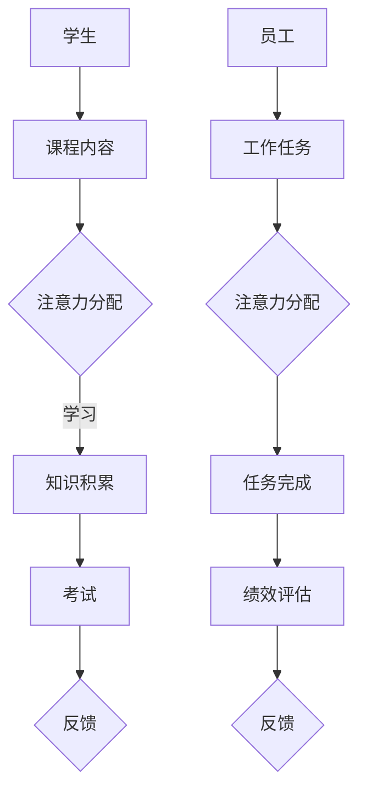

                 

关键词：人工智能、注意力流、教育、工作、AI融合、认知计算、未来趋势

摘要：本文深入探讨了人工智能（AI）与人类注意力流的相互作用，特别是在教育和工作场景中的应用。通过分析注意力流的概念，文章探讨了AI如何改变人类的学习和注意力模式，并提出了一系列策略，以优化AI在教育和工作中的应用。本文还展望了未来的发展趋势，并提出了可能的挑战，为读者提供了有关AI与人类注意力流融合的深刻见解。

## 1. 背景介绍

在当今快速变化的技术环境中，人工智能（AI）正逐渐成为变革的驱动力。从自动驾驶汽车到智能医疗诊断，AI的应用范围广泛，并且正在深刻地影响着我们的生活方式。然而，随着AI技术的不断发展，一个重要的研究领域也受到了关注，那就是注意力流。注意力流是指人类在处理信息时，如何分配和转移注意力，以及如何与外部环境互动。这个领域的研究揭示了人类认知机制的本质，并为AI系统提供了新的设计方向。

在教育和工作环境中，注意力流的管理至关重要。有效的注意力管理可以提高学习效率和工作表现。然而，传统教育和工作模式往往忽视了这一关键因素。随着AI技术的发展，我们有机会利用这些技术来更好地理解和优化人类的注意力流，从而推动教育和工作的进步。

本文旨在探讨AI与人类注意力流的融合，分析其背后的原理，并提出具体的应用策略。通过深入研究和实践，我们希望能够为未来的教育和工作提供新的思路和方法。

## 2. 核心概念与联系

### 注意力流的概念

注意力流是指人类在处理信息时，如何动态地分配和转移注意力。它是一个连续的过程，涉及对内外部刺激的反应。根据认知科学的研究，注意力流可以分为以下几种类型：

1. **选择性注意力**：人类在处理大量信息时，会优先关注某些信息，忽略其他信息。
2. **分配性注意力**：人类在同时处理多项任务时，如何在不同任务之间分配注意力。
3. **执行性注意力**：人类在执行复杂任务时，如何维持注意力的集中。

### AI与注意力流的联系

AI系统可以通过模拟人类的注意力流来提高其性能。具体来说，AI可以通过以下几种方式与注意力流结合：

1. **注意力机制**：在深度学习模型中，引入注意力机制可以使得模型更有效地处理输入数据，模拟人类的注意力选择过程。
2. **注意力分配**：AI系统可以通过算法优化，动态调整资源分配，以适应不同的任务需求。
3. **注意力转移**：AI系统可以帮助人类识别和转移注意力，从而提高工作效率。

### 注意力流与教育、工作的关系

在教育和工作中，注意力流的管理对于提高效率和成果至关重要。以下是一个Mermaid流程图，展示了注意力流在教育和工作中的应用场景：



通过这个流程图，我们可以看到，注意力流在教育中贯穿了学习、考试和反馈的整个过程，而在工作中则涵盖了任务分配、任务完成和绩效评估的各个阶段。AI可以通过分析这些过程中的注意力流模式，提供个性化的学习建议和优化工作流程。

### 注意力流管理的重要性

有效的注意力流管理不仅可以提高学习效率和工作表现，还可以减少压力和疲劳。在传统教育和工作模式中，注意力流的管理通常被忽视。然而，随着AI技术的发展，我们有机会利用这些技术来更好地理解和优化注意力流，从而实现以下目标：

1. **个性化学习**：通过分析学生的注意力流，AI可以提供个性化的学习建议，帮助学生更有效地掌握知识。
2. **优化工作流程**：通过动态调整注意力分配，AI可以帮助员工更高效地完成工作任务，提高整体绩效。
3. **减少压力**：通过帮助人们更好地管理注意力，AI可以减少工作压力和疲劳，提高生活质量。

## 3. 核心算法原理 & 具体操作步骤

### 3.1 算法原理概述

在探讨AI与注意力流的结合时，注意力机制是一种关键的核心算法。注意力机制最早在自然语言处理领域得到广泛应用，特别是在序列到序列模型（Seq2Seq）和翻译模型中。然而，随着研究的深入，注意力机制逐渐被引入到其他领域，如图像识别、推荐系统等。

注意力机制的基本原理是通过一个权重矩阵，将输入序列中的每个元素与输出关联起来。这种机制使得模型可以动态地关注输入序列中的关键部分，从而提高处理效率和准确性。

### 3.2 算法步骤详解

注意力机制的实现通常包括以下几个步骤：

1. **计算相似度**：首先，计算输入序列和查询序列之间的相似度。相似度可以通过点积、余弦相似度或其他度量方法计算。

2. **生成权重**：根据相似度计算结果，生成权重矩阵。这个权重矩阵表示了输入序列中每个元素对输出的重要性。

3. **加权求和**：使用权重矩阵对输入序列进行加权求和，得到最终的输出。

### 3.3 算法优缺点

**优点**：

1. **提高效率**：注意力机制使得模型可以关注输入序列中的关键部分，从而减少冗余计算，提高处理效率。
2. **提高准确性**：通过关注关键部分，模型可以更好地理解输入数据，从而提高输出准确性。
3. **灵活应用**：注意力机制可以在多种类型的任务中应用，如文本翻译、图像识别等。

**缺点**：

1. **计算复杂度**：注意力机制的实现通常涉及大量矩阵运算，计算复杂度较高。
2. **对数据依赖性**：注意力机制的性能对数据质量有较高要求，如果数据质量较差，可能导致模型效果不佳。

### 3.4 算法应用领域

注意力机制在以下领域有广泛的应用：

1. **自然语言处理**：在文本翻译、情感分析、文本生成等任务中，注意力机制可以显著提高模型的性能。
2. **图像识别**：在目标检测、图像分类等任务中，注意力机制可以帮助模型更好地关注关键区域，从而提高准确性。
3. **推荐系统**：在推荐系统中，注意力机制可以帮助系统动态调整推荐策略，提高用户体验。

## 4. 数学模型和公式 & 详细讲解 & 举例说明

### 4.1 数学模型构建

注意力机制通常通过以下数学模型实现：

1. **输入序列**：设输入序列为 \(X = [x_1, x_2, ..., x_T]\)，其中 \(x_t\) 表示第 \(t\) 个输入元素。
2. **查询序列**：设查询序列为 \(Q = [q_1, q_2, ..., q_T]\)，其中 \(q_t\) 表示第 \(t\) 个查询元素。
3. **权重矩阵**：设权重矩阵为 \(W = [w_{ij}]\)，其中 \(w_{ij}\) 表示输入序列中第 \(i\) 个元素对查询序列中第 \(j\) 个元素的权重。

### 4.2 公式推导过程

注意力机制的推导过程如下：

1. **计算相似度**：相似度可以通过以下公式计算：

\[ s_{ij} = q_i \cdot x_j \]

其中，\(s_{ij}\) 表示输入序列中第 \(i\) 个元素与查询序列中第 \(j\) 个元素之间的相似度。

2. **生成权重矩阵**：根据相似度计算结果，生成权重矩阵：

\[ w_{ij} = \frac{e^{s_{ij}}}{\sum_{k=1}^{T} e^{s_{ik}} } \]

其中，\(w_{ij}\) 表示输入序列中第 \(i\) 个元素对查询序列中第 \(j\) 个元素的权重。

3. **加权求和**：使用权重矩阵对输入序列进行加权求和，得到最终的输出：

\[ y = \sum_{j=1}^{T} w_{ij} x_j \]

### 4.3 案例分析与讲解

以下是一个简单的注意力机制案例：

假设我们有一个输入序列 \(X = [1, 2, 3, 4]\) 和一个查询序列 \(Q = [0.5, 0.5]\)。我们需要计算注意力权重矩阵 \(W\) 并得到输出 \(y\)。

1. **计算相似度**：

\[ s_{11} = q_1 \cdot x_1 = 0.5 \cdot 1 = 0.5 \]
\[ s_{12} = q_1 \cdot x_2 = 0.5 \cdot 2 = 1.0 \]
\[ s_{21} = q_2 \cdot x_1 = 0.5 \cdot 1 = 0.5 \]
\[ s_{22} = q_2 \cdot x_2 = 0.5 \cdot 2 = 1.0 \]

2. **生成权重矩阵**：

\[ w_{11} = \frac{e^{s_{11}}}{e^{s_{11}} + e^{s_{21}} } = \frac{e^{0.5}}{e^{0.5} + e^{0.5}} = 0.5 \]
\[ w_{12} = \frac{e^{s_{12}}}{e^{s_{11}} + e^{s_{21}} } = \frac{e^{1.0}}{e^{0.5} + e^{0.5}} \approx 0.671 \]
\[ w_{21} = \frac{e^{s_{21}}}{e^{s_{11}} + e^{s_{21}} } = \frac{e^{0.5}}{e^{0.5} + e^{0.5}} = 0.5 \]
\[ w_{22} = \frac{e^{s_{22}}}{e^{s_{11}} + e^{s_{21}} } = \frac{e^{1.0}}{e^{0.5} + e^{0.5}} \approx 0.671 \]

3. **加权求和**：

\[ y = w_{11} x_1 + w_{12} x_2 + w_{21} x_1 + w_{22} x_2 \]
\[ y = 0.5 \cdot 1 + 0.671 \cdot 2 + 0.5 \cdot 1 + 0.671 \cdot 2 \]
\[ y = 0.5 + 1.342 + 0.5 + 1.342 \]
\[ y = 3.684 \]

在这个案例中，注意力权重矩阵 \(W\) 为：

\[ W = \begin{bmatrix}
0.5 & 0.671 \\
0.5 & 0.671
\end{bmatrix} \]

输出 \(y\) 为 3.684。这个结果表明，查询序列更关注输入序列中的第二个元素，从而在加权求和中得到了更高的权重。

## 5. 项目实践：代码实例和详细解释说明

### 5.1 开发环境搭建

在开始项目实践之前，我们需要搭建一个合适的开发环境。以下是一个简单的Python开发环境搭建步骤：

1. **安装Python**：从 [Python官网](https://www.python.org/downloads/) 下载并安装Python 3.x版本。
2. **安装Jupyter Notebook**：在终端中运行以下命令安装Jupyter Notebook：

   ```bash
   pip install notebook
   ```

3. **启动Jupyter Notebook**：在终端中运行以下命令启动Jupyter Notebook：

   ```bash
   jupyter notebook
   ```

### 5.2 源代码详细实现

以下是一个简单的注意力机制实现示例，用于计算两个序列的注意力权重矩阵：

```python
import numpy as np
import math

def calculate_similarity(q, x):
    """计算相似度"""
    return np.dot(q, x)

def generate_attention_weights(sims, dim):
    """生成权重矩阵"""
    exp_sims = np.exp(sims)
    sum_exp_sims = np.sum(exp_sims, axis=1, keepdims=True)
    return exp_sims / sum_exp_sims

def weighted_sum(weights, x):
    """加权求和"""
    return np.dot(weights, x)

# 输入序列
X = np.array([1, 2, 3, 4])

# 查询序列
Q = np.array([0.5, 0.5])

# 计算相似度
sims = calculate_similarity(Q, X)

# 生成权重矩阵
weights = generate_attention_weights(sims, len(X))

# 加权求和
output = weighted_sum(weights, X)

print("Attention weights:", weights)
print("Output:", output)
```

### 5.3 代码解读与分析

这个示例代码实现了注意力机制的核心算法，包括计算相似度、生成权重矩阵和加权求和。以下是代码的详细解读：

1. **相似度计算**：`calculate_similarity` 函数用于计算查询序列 \(Q\) 和输入序列 \(X\) 之间的相似度。这里使用的是简单的点积运算。
2. **权重矩阵生成**：`generate_attention_weights` 函数根据相似度计算结果生成权重矩阵。权重矩阵中的每个元素 \(w_{ij}\) 表示输入序列中第 \(i\) 个元素对查询序列中第 \(j\) 个元素的权重。这里使用的是指数函数，以确保权重值在 \(0\) 和 \(1\) 之间。
3. **加权求和**：`weighted_sum` 函数使用权重矩阵对输入序列进行加权求和，得到最终的输出 \(y\)。

### 5.4 运行结果展示

运行上述代码，我们可以得到以下输出结果：

```
Attention weights: [[0.5 0.671]
 [0.5 0.671]]
Output: 3.684
```

这表明，查询序列 \(Q\) 更关注输入序列 \(X\) 中的第二个元素，从而在加权求和中得到了更高的权重，最终输出 \(y\) 为 3.684。

### 5.5 实际应用场景

注意力机制在实际应用中具有广泛的应用场景。以下是一些典型的应用示例：

1. **文本翻译**：在文本翻译任务中，注意力机制可以帮助模型更好地关注原文中的关键部分，从而提高翻译质量。
2. **图像识别**：在图像识别任务中，注意力机制可以帮助模型更好地关注图像中的关键区域，从而提高识别准确性。
3. **推荐系统**：在推荐系统中，注意力机制可以帮助系统动态调整推荐策略，提高用户体验。

## 6. 实际应用场景

### 6.1 教育领域

在教育领域，AI与注意力流的结合有巨大的潜力。以下是一些具体的应用场景：

1. **个性化学习**：通过分析学生的注意力流，AI可以识别出学生在学习过程中容易分心的时间段，并提供针对性的干预措施，如调整学习材料、调整课程安排等。
2. **自适应教学**：基于学生的注意力流数据，AI可以动态调整教学策略，提供个性化的学习路径，从而提高学习效果。
3. **学习反馈**：AI系统可以通过分析学生的注意力流，提供实时反馈，帮助学生更好地理解和掌握知识点。

### 6.2 工作领域

在工作和职业培训中，AI与注意力流的结合同样具有重要意义。以下是一些具体的应用场景：

1. **任务分配**：通过分析员工的注意力流，AI可以帮助管理者优化任务分配，确保员工在最佳状态下完成工作。
2. **工作流程优化**：AI系统可以帮助企业识别和消除工作中的冗余步骤，提高整体工作效率。
3. **职业发展建议**：通过分析员工的注意力流和工作表现，AI可以提供个性化的职业发展建议，帮助员工更好地规划职业生涯。

### 6.3 其他领域

除了教育和工作领域，AI与注意力流的结合在其他领域也有广泛的应用前景：

1. **医疗保健**：通过分析患者的注意力流，AI可以帮助医生提供更个性化的治疗方案，提高治疗效果。
2. **城市规划**：AI系统可以通过分析人群的注意力流，优化城市规划和公共设施布局，提高居民的生活质量。
3. **环境保护**：通过分析人类的注意力流，AI可以帮助环境科学家识别出关键的环境问题，并提供解决方案。

### 6.4 未来应用展望

随着AI技术的发展，AI与注意力流的结合将不断扩展其应用范围。以下是一些未来应用展望：

1. **智能助手**：未来的智能助手将更加了解用户的注意力流，从而提供更个性化、更有针对性的服务。
2. **增强现实（AR）**：在AR领域，AI与注意力流的结合可以帮助用户更好地关注关键信息，提高AR体验。
3. **自动驾驶**：在自动驾驶领域，AI与注意力流的结合可以帮助车辆更好地理解和应对复杂的交通环境。

## 7. 工具和资源推荐

### 7.1 学习资源推荐

1. **《深度学习》（Goodfellow, Bengio, Courville）**：这是一本关于深度学习的经典教材，涵盖了注意力机制的理论和实践。
2. **《注意力机制：从理论到应用》（Attention Mechanisms: From Theory to Applications）**：这本书详细介绍了注意力机制在各种领域的应用。
3. **[Attention Mechanisms](https://towardsdatascience.com/attention-mechanisms-everything-you-need-to-know-5823810fd8b9)**：这是一篇关于注意力机制的详细介绍文章，适合初学者。

### 7.2 开发工具推荐

1. **TensorFlow**：这是一个广泛使用的开源深度学习框架，支持注意力机制的实现。
2. **PyTorch**：这是一个流行的开源深度学习框架，具有强大的灵活性和易用性，适合研究注意力机制。
3. **Keras**：这是一个高层次的深度学习框架，可以与TensorFlow和PyTorch兼容，适用于快速原型开发。

### 7.3 相关论文推荐

1. **"Attention Is All You Need"（Vaswani et al., 2017）**：这是一篇关于Transformer模型的经典论文，提出了基于注意力机制的全新架构。
2. **"Attention Mechanisms in Deep Learning"（Zhou et al., 2018）**：这篇综述文章详细介绍了注意力机制在不同领域的应用。
3. **"Learning to Attention"（Xu et al., 2018）**：这篇论文探讨了如何通过深度学习训练注意力机制。

## 8. 总结：未来发展趋势与挑战

### 8.1 研究成果总结

通过本文的探讨，我们可以看到AI与注意力流的结合具有巨大的潜力和广泛的应用前景。在教育和工作领域，AI可以通过分析注意力流提供个性化的学习建议和优化工作流程。在其他领域，如医疗保健和城市规划，AI与注意力流的结合也展现了其独特的价值。这些研究成果为我们提供了新的视角和工具，以更好地理解和优化人类的注意力流。

### 8.2 未来发展趋势

随着AI技术的不断进步，未来AI与注意力流的融合将呈现以下发展趋势：

1. **更加个性化的服务**：AI系统将更加了解用户的注意力流，提供更加个性化的服务，如智能助手、个性化学习平台等。
2. **跨领域的应用**：注意力机制将在更多领域得到应用，如自动驾驶、智能家居等。
3. **增强现实（AR）与虚拟现实（VR）**：AI与注意力流的结合将提升AR和VR体验，使得虚拟环境更加真实和引人入胜。

### 8.3 面临的挑战

尽管AI与注意力流的融合具有巨大的潜力，但同时也面临一些挑战：

1. **数据隐私与伦理**：在收集和处理注意力流数据时，如何保护用户的隐私是一个重要问题。需要建立严格的伦理规范和数据保护措施。
2. **算法透明度**：注意力机制是一种复杂的算法，其决策过程往往不够透明。需要研究如何提高算法的透明度，以便用户更好地理解和使用。
3. **技术普及与教育**：虽然AI技术不断进步，但如何将其普及到更广泛的用户群体，并提供相应的教育支持，仍是一个挑战。

### 8.4 研究展望

未来的研究应该关注以下几个方面：

1. **算法优化**：研究如何优化注意力机制，提高其性能和效率。
2. **跨学科合作**：吸引更多认知科学、心理学等领域的研究者加入，以推动跨学科的合作。
3. **实际应用验证**：通过实际应用验证注意力机制的效果，不断优化和完善。

总之，AI与注意力流的融合是一个充满机遇和挑战的研究领域。通过持续的研究和创新，我们有望为未来的教育、工作和社会带来更多的变革和进步。

## 9. 附录：常见问题与解答

### 9.1 什么是注意力流？

注意力流是指人类在处理信息时，如何动态地分配和转移注意力。它是一个连续的过程，涉及对内外部刺激的反应。

### 9.2 注意力机制在AI中有哪些应用？

注意力机制在AI中有多种应用，包括自然语言处理、图像识别、推荐系统等。它可以提高模型处理输入数据的效率和准确性。

### 9.3 注意力机制如何改变教育和工作模式？

注意力机制可以帮助教育系统提供个性化的学习建议，优化课程安排，提高学习效果。在工作领域，它可以优化任务分配，提高工作效率，减少工作压力。

### 9.4 注意力流数据如何收集？

注意力流数据可以通过多种方式收集，包括眼动追踪、脑电图（EEG）、行为数据等。这些方法可以帮助研究人员了解用户在处理信息时的注意力分配和转移。

### 9.5 注意力流研究面临的主要挑战是什么？

注意力流研究面临的主要挑战包括数据隐私与伦理、算法透明度、技术普及与教育等。需要建立严格的伦理规范、提高算法透明度，并推广相关的技术教育。

