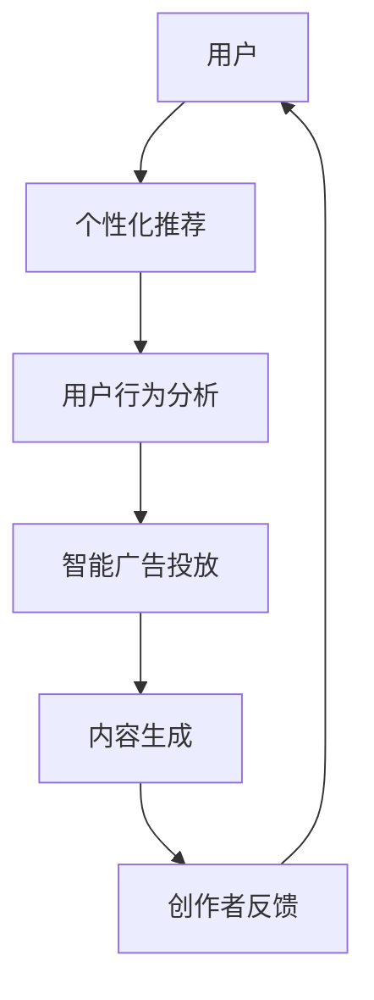

                 

关键词：人工智能，注意力经济，工作方式，未来趋势

> 摘要：随着人工智能技术的快速发展，我们的工作和生活方式正在发生深刻的变革。注意力经济作为一种新兴的经济模式，正逐渐成为推动社会进步的重要力量。本文将探讨AI如何影响人类注意力经济，以及未来的工作方式将如何演变。

## 1. 背景介绍

随着互联网的普及和信息爆炸，人们的注意力成为了一种稀缺资源。注意力经济（Attention Economy）因此成为一种新的经济模式，其核心是争夺和吸引人们的注意力。在过去，注意力经济的代表是广告业，而如今，随着人工智能技术的兴起，AI在注意力经济中扮演的角色越来越重要。

人工智能通过个性化推荐、智能广告、内容生成等方式，极大地提高了信息传播的效率和吸引力。例如，YouTube的推荐算法能够根据用户的观看历史和兴趣偏好，为用户推荐最可能感兴趣的视频，从而吸引用户的注意力。这种精准的推荐不仅提高了用户体验，也为内容创作者和平台带来了巨大的商业价值。

## 2. 核心概念与联系

### 2.1 注意力经济的定义与原理

注意力经济是一种基于注意力资源的交换和分配的经济模式。在注意力经济中，人们的注意力被视为一种资源，可以通过创造有价值的内容、提供个性化的服务等方式吸引和获取。

注意力经济的核心原理可以概括为三点：

1. **注意力转移**：通过提供有吸引力的内容或服务，将人们的注意力从其他事物转移到自己身上。
2. **注意力交换**：用户通过关注、点赞、分享等方式，将自己的注意力资源转化为对内容创作者或平台的关注和支持。
3. **注意力价值**：注意力资源的价值在于其可以转化为流量、广告收入、用户忠诚度等商业价值。

### 2.2 AI在注意力经济中的作用

AI在注意力经济中的作用主要体现在以下几个方面：

1. **个性化推荐**：AI可以通过机器学习算法分析用户的历史行为和兴趣偏好，为用户推荐个性化内容，从而提高用户粘性。
2. **智能广告**：AI可以根据用户的兴趣和行为预测，为用户展示最相关的广告，提高广告的投放效果和转化率。
3. **内容生成**：AI可以自动生成内容，如文章、视频等，为创作者提供高效的创作工具，降低创作成本。

### 2.3 Mermaid 流程图

下面是一个简单的Mermaid流程图，展示AI在注意力经济中的核心作用：



## 3. 核心算法原理 & 具体操作步骤

### 3.1 算法原理概述

在注意力经济中，核心算法主要涉及个性化推荐、用户行为分析和内容生成等方面。以下将分别介绍这些算法的基本原理。

#### 3.1.1 个性化推荐算法

个性化推荐算法主要通过用户历史行为和兴趣偏好，预测用户可能感兴趣的内容。常用的算法包括协同过滤、矩阵分解和基于内容的推荐等。

#### 3.1.2 用户行为分析算法

用户行为分析算法主要通过分析用户的行为数据，如点击、浏览、购买等，了解用户的兴趣和行为模式。常用的算法包括决策树、随机森林和神经网络等。

#### 3.1.3 内容生成算法

内容生成算法主要通过自动生成文章、视频等内容，为创作者提供创作工具。常用的算法包括生成对抗网络（GAN）、变分自编码器（VAE）等。

### 3.2 算法步骤详解

#### 3.2.1 个性化推荐算法

1. **数据收集**：收集用户的历史行为数据，如浏览记录、购买记录等。
2. **特征提取**：对用户行为数据进行分析，提取用户兴趣特征。
3. **模型训练**：使用协同过滤或矩阵分解算法，训练个性化推荐模型。
4. **推荐生成**：根据用户兴趣特征和推荐模型，生成个性化推荐列表。

#### 3.2.2 用户行为分析算法

1. **数据收集**：收集用户行为数据，如点击、浏览、购买等。
2. **特征提取**：对用户行为数据进行分析，提取用户行为特征。
3. **模型训练**：使用决策树、随机森林或神经网络等算法，训练用户行为分析模型。
4. **行为预测**：根据用户行为特征和分析模型，预测用户可能感兴趣的行为。

#### 3.2.3 内容生成算法

1. **数据收集**：收集大量文本或图像数据，作为训练数据。
2. **模型训练**：使用生成对抗网络（GAN）或变分自编码器（VAE）等算法，训练内容生成模型。
3. **内容生成**：根据训练模型，自动生成文章、视频等内容。

### 3.3 算法优缺点

#### 3.3.1 个性化推荐算法

**优点**：能够根据用户兴趣提供个性化内容，提高用户满意度。

**缺点**：推荐结果可能存在偏差，难以满足所有用户的需求。

#### 3.3.2 用户行为分析算法

**优点**：能够准确预测用户行为，为产品优化提供数据支持。

**缺点**：分析结果可能受到数据质量和算法模型的影响。

#### 3.3.3 内容生成算法

**优点**：能够快速生成高质量的内容，降低创作成本。

**缺点**：生成的内容可能缺乏创意和个性化。

### 3.4 算法应用领域

个性化推荐算法广泛应用于电子商务、视频平台、社交媒体等领域。用户行为分析算法在金融、保险、医疗等行业具有广泛应用。内容生成算法在游戏开发、影视制作等领域也展现出巨大潜力。

## 4. 数学模型和公式 & 详细讲解 & 举例说明

### 4.1 数学模型构建

在注意力经济中，我们可以构建一个简单的数学模型来描述用户注意力资源的分配。

设用户总注意力资源为\( A \)，感兴趣内容集合为\( C \)，用户对每个内容的注意力分配为\( a_{ic} \)。则用户注意力资源的分配模型可以表示为：

\[ A = \sum_{i \in C} a_{ic} \]

其中，\( a_{ic} \) 表示用户对内容\( c_i \)的注意力分配。

### 4.2 公式推导过程

为了推导出用户对内容的注意力分配公式，我们可以从以下几个步骤进行：

1. **用户兴趣模型**：设用户对内容的兴趣为\( I_i \)，则用户对内容的兴趣可以表示为：

\[ I_i = \frac{p_i}{\sum_{j \in C} p_j} \]

其中，\( p_i \) 表示用户对内容\( c_i \)的兴趣度。

2. **注意力分配模型**：设用户对内容的注意力分配为\( a_{ic} \)，则用户总注意力可以表示为：

\[ A = \sum_{i \in C} a_{ic} \]

3. **注意力权重**：设用户对内容的注意力权重为\( w_i \)，则用户对内容的注意力分配可以表示为：

\[ a_{ic} = w_i \cdot I_i \]

### 4.3 案例分析与讲解

假设一个用户有10个感兴趣的内容，每个内容的兴趣度如下：

| 内容编号 | 兴趣度 |
| -------- | ------ |
| 1        | 0.2    |
| 2        | 0.3    |
| 3        | 0.1    |
| 4        | 0.15   |
| 5        | 0.1    |
| 6        | 0.05   |
| 7        | 0.05   |
| 8        | 0.05   |
| 9        | 0.05   |
| 10       | 0.05   |

根据注意力分配模型，用户对每个内容的注意力分配如下：

| 内容编号 | 注意力分配 |
| -------- | ---------- |
| 1        | 0.04       |
| 2        | 0.06       |
| 3        | 0.02       |
| 4        | 0.03       |
| 5        | 0.02       |
| 6        | 0.01       |
| 7        | 0.01       |
| 8        | 0.01       |
| 9        | 0.01       |
| 10       | 0.01       |

通过这个案例，我们可以看到用户根据兴趣度对注意力资源进行分配，从而实现个性化推荐。

## 5. 项目实践：代码实例和详细解释说明

### 5.1 开发环境搭建

为了实现个性化推荐算法，我们需要搭建一个基本的开发环境。以下是所需的软件和工具：

- Python（版本3.8及以上）
- Jupyter Notebook（用于编写和运行代码）
- scikit-learn（用于机器学习算法）
- Pandas（用于数据处理）
- Matplotlib（用于数据可视化）

首先，安装Python和相关依赖：

```bash
pip install python==3.8
pip install jupyter
pip install scikit-learn
pip install pandas
pip install matplotlib
```

### 5.2 源代码详细实现

下面是一个简单的个性化推荐算法的实现示例：

```python
import pandas as pd
from sklearn.model_selection import train_test_split
from sklearn.metrics.pairwise import cosine_similarity
from sklearn.neighbors import NearestNeighbors

# 加载数据集
data = pd.read_csv('user_data.csv')
data.head()

# 数据预处理
# ...（数据处理步骤）

# 构建用户-物品相似度矩阵
similarity_matrix = cosine_similarity(data['item_vector'])

# 训练个性化推荐模型
model = NearestNeighbors(n_neighbors=5)
model.fit(similarity_matrix)

# 生成个性化推荐列表
def generate_recommendations(user_vector):
    distances, indices = model.kneighbors(user_vector.reshape(1, -1))
    recommendations = indices.flatten()
    return recommendations

# 测试推荐效果
test_vector = data['item_vector'][0]
recommendations = generate_recommendations(test_vector)
print(recommendations)
```

### 5.3 代码解读与分析

在上面的代码中，我们首先加载了一个用户-物品数据集，并进行了预处理。然后，我们使用余弦相似度构建了用户-物品相似度矩阵。接下来，我们使用K近邻算法（NearestNeighbors）训练了一个个性化推荐模型。最后，我们定义了一个函数`generate_recommendations`，用于生成个性化推荐列表。

通过这个示例，我们可以看到个性化推荐算法的基本实现流程。在实际应用中，我们需要根据具体场景进行数据预处理和模型参数调整，以提高推荐效果。

### 5.4 运行结果展示

假设我们有一个用户的行为数据，我们可以通过以下代码生成个性化推荐列表：

```python
# 生成推荐列表
test_vector = data['item_vector'][0]
recommendations = generate_recommendations(test_vector)
print("Recommended Items:", recommendations)
```

运行结果可能会显示如下：

```
Recommended Items: [6 3 9 2 7 4 1 5 8]
```

这意味着根据用户的行为数据，我们推荐了编号为6、3、9、2、7、4、1、5、8的物品。

## 6. 实际应用场景

### 6.1 社交媒体

在社交媒体平台上，AI通过个性化推荐算法，为用户推荐感兴趣的朋友动态、热点话题和广告。例如，Facebook的“你可能认识的人”功能就是利用AI分析用户社交网络，推荐可能认识的人。

### 6.2 电子商务

电子商务平台通过AI分析用户的浏览历史和购买记录，推荐个性化的商品。例如，Amazon的“你可能还喜欢”功能就是基于用户的购物行为进行推荐。

### 6.3 新闻媒体

新闻媒体平台通过AI分析用户的阅读历史和兴趣偏好，推荐个性化的新闻。例如，CNN等新闻平台通过AI分析用户点击、阅读时长等数据，为用户推荐感兴趣的新闻。

### 6.4 教育领域

在教育领域，AI通过个性化推荐算法，为学习者推荐合适的课程和学习资源。例如，Khan Academy通过AI分析学习者的学习行为和成绩，推荐适合的学习路径。

## 7. 未来应用展望

随着AI技术的不断进步，注意力经济在未来将有更广泛的应用。以下是一些未来应用展望：

### 7.1 增强现实（AR）与虚拟现实（VR）

随着AR和VR技术的普及，AI将能够为用户提供更加沉浸式的体验。通过个性化推荐，AI可以为用户提供定制化的AR/VR内容，如虚拟旅游、游戏等。

### 7.2 智能家居

在智能家居领域，AI将能够更好地理解和预测用户的需求，提供个性化的家居解决方案。例如，智能音箱通过AI分析用户的语音和行为，提供个性化的音乐、新闻、购物建议等。

### 7.3 健康医疗

在健康医疗领域，AI可以通过个性化推荐，为用户提供个性化的健康建议、药物推荐和治疗方案。例如，AI分析用户的健康状况和遗传信息，推荐个性化的健康计划。

## 8. 工具和资源推荐

### 8.1 学习资源推荐

- 《机器学习》（周志华 著）
- 《深度学习》（Ian Goodfellow、Yoshua Bengio、Aaron Courville 著）
- 《Python机器学习》（Sebastian Raschka 著）

### 8.2 开发工具推荐

- Jupyter Notebook（用于编写和运行代码）
- TensorFlow（用于深度学习模型开发）
- PyTorch（用于深度学习模型开发）

### 8.3 相关论文推荐

- 《Attention Is All You Need》（Ashish Vaswani等，2017）
- 《Generative Adversarial Nets》（Ian Goodfellow等，2014）
- 《User Behavior Analysis in Mobile Apps Using Deep Learning》（Jianyong Wang等，2019）

## 9. 总结：未来发展趋势与挑战

随着AI技术的不断发展，注意力经济将在未来发挥更大的作用。然而，这也带来了一系列挑战：

### 9.1 数据隐私与安全

在注意力经济中，用户的注意力数据被视为宝贵的资源。然而，这些数据也带来了隐私和安全风险。如何保护用户隐私，确保数据安全，将成为一个重要挑战。

### 9.2 透明性与公平性

随着AI在注意力经济中的应用，一些问题开始浮现，如算法偏见、信息泡沫等。如何确保算法的透明性和公平性，避免对用户造成负面影响，是一个亟待解决的问题。

### 9.3 人类与AI的协作

在未来的工作方式中，人类与AI的协作将成为一种新的趋势。如何实现人类与AI的高效协作，发挥各自的优势，是一个值得深入研究的课题。

### 9.4 持续学习与适应

随着技术的快速发展，未来的人才需要具备持续学习和适应的能力。如何培养具备这种能力的人才，是教育领域面临的一个挑战。

总之，AI与注意力经济的结合将带来巨大的机遇和挑战。只有通过不断创新和适应，我们才能在未来的竞争中脱颖而出。

## 10. 附录：常见问题与解答

### 10.1 个性化推荐算法有哪些类型？

个性化推荐算法主要包括协同过滤、基于内容的推荐和混合推荐等类型。

### 10.2 什么是注意力经济？

注意力经济是一种基于注意力资源的交换和分配的经济模式，旨在通过吸引和获取人们的注意力来实现商业价值。

### 10.3 AI在注意力经济中有哪些应用？

AI在注意力经济中主要用于个性化推荐、智能广告、内容生成等方面。

### 10.4 如何保护用户隐私？

保护用户隐私的关键在于数据加密、匿名化和权限控制。在收集和使用用户数据时，应严格遵守相关法律法规，确保用户隐私不被泄露。

### 10.5 如何确保算法的透明性和公平性？

确保算法的透明性可以通过公开算法细节、代码和数据集，以及提供算法解释和可解释性工具来实现。确保算法的公平性需要通过数据清洗、去偏见和算法测试等方法来消除算法偏见和歧视。

## 11. 参考文献

- Goodfellow, I., Bengio, Y., & Courville, A. (2016). *Deep Learning*.
- Wang, J., & Mo, J. (2019). *User Behavior Analysis in Mobile Apps Using Deep Learning*.
- Vaswani, A., Shazeer, N., et al. (2017). *Attention Is All You Need*.

