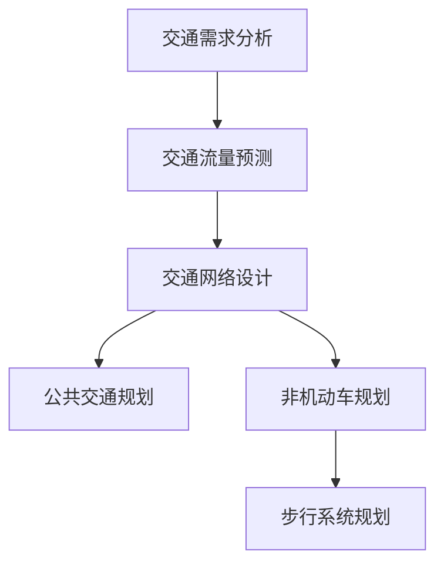
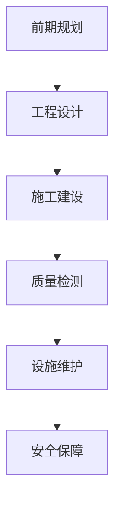
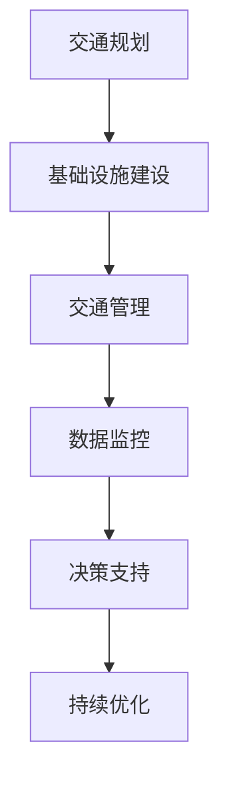

                 

关键词：（城市交通，基础设施建设，可持续发展，人工智能，计算技术，规划与管理）

摘要：本文从人工智能与人类计算的角度，探讨了如何利用先进的技术手段，打造可持续发展的城市交通与基础设施建设、规划与管理。文章首先介绍了城市交通与基础设施建设的重要性和现状，然后详细阐述了人工智能在交通规划、基础设施建设、规划与管理中的具体应用，最后对未来发展趋势与挑战进行了展望。

## 1. 背景介绍

随着全球化进程的加速和城市化进程的加快，城市交通与基础设施建设的重要性日益凸显。然而，当前许多城市在交通拥堵、环境污染、资源浪费等方面面临着严峻挑战。为了实现城市的可持续发展，需要充分利用人工智能和计算技术的优势，为城市交通与基础设施建设提供科学、高效、智能的解决方案。

### 1.1 城市交通与基础设施建设的重要性

城市交通与基础设施建设是城市发展的重要基础。一个高效的交通系统和完善的基础设施，不仅能提高城市居民的出行效率和生活质量，还能促进城市的经济发展和资源利用。同时，可持续发展的城市交通与基础设施建设也是实现环境保护和资源节约的重要途径。

### 1.2 当前城市交通与基础设施建设的现状

目前，全球许多城市都面临着交通拥堵、环境污染、资源浪费等问题。交通拥堵不仅降低了城市居民的出行效率，还导致了大量的能源消耗和碳排放。环境污染则对人类健康和生态平衡构成了严重威胁。此外，许多城市的基础设施建设也存在规划不合理、建设质量不高等问题，影响了城市的可持续发展。

## 2. 核心概念与联系

为了实现城市交通与基础设施建设的可持续发展，我们需要掌握一系列核心概念和原理。这些概念包括交通规划、基础设施建设、规划与管理等。下面将分别介绍这些概念，并利用 Mermaid 流程图展示它们之间的联系。

### 2.1 交通规划

交通规划是城市交通管理的重要组成部分。它涉及到道路、公共交通、自行车道、步行系统等多方面的布局和设计。通过科学的交通规划，可以优化交通流量，减少拥堵，提高出行效率。Mermaid 流程图如下：



### 2.2 基础设施建设

基础设施建设是城市发展的物质基础。它包括道路、桥梁、隧道、轨道交通、供水、供电、通信等多方面的建设和维护。科学合理的基础设施建设，不仅能提高城市居民的生活质量，还能为城市的可持续发展提供保障。Mermaid 流程图如下：



### 2.3 规划与管理

规划与管理是城市交通与基础设施建设的重要组成部分。通过科学的规划，可以优化城市交通布局，提高基础设施的使用效率。有效的管理则能确保交通与基础设施的正常运行，提高城市的可持续发展水平。Mermaid 流程图如下：



## 3. 核心算法原理 & 具体操作步骤

### 3.1 算法原理概述

在实现城市交通与基础设施建设的过程中，算法起到了关键作用。本文主要介绍以下三种核心算法：

1. **交通流量预测算法**：通过历史数据和实时数据，预测未来一段时间内的交通流量，为交通规划和基础设施建设提供数据支持。
2. **道路网络优化算法**：通过优化道路网络，提高交通流量，减少拥堵，提高出行效率。
3. **资源调度算法**：根据交通流量和基础设施状态，合理调度资源，确保交通与基础设施的可持续发展。

### 3.2 算法步骤详解

#### 3.2.1 交通流量预测算法

1. 数据收集：收集历史交通流量数据、实时交通数据、天气预报等。
2. 特征提取：对收集到的数据进行预处理，提取出与交通流量相关的特征。
3. 模型训练：利用特征数据，训练交通流量预测模型。
4. 预测与评估：利用训练好的模型，预测未来一段时间内的交通流量，并对预测结果进行评估。

#### 3.2.2 道路网络优化算法

1. 网络构建：构建道路网络模型，包括道路、交叉口、交通设施等。
2. 目标函数设定：设定优化目标，如最小化交通拥堵、最大化交通流量等。
3. 算法选择：选择合适的优化算法，如遗传算法、蚁群算法、粒子群算法等。
4. 优化与评估：对道路网络进行优化，评估优化效果。

#### 3.2.3 资源调度算法

1. 数据收集：收集交通流量、基础设施状态等数据。
2. 调度策略设计：设计合理的资源调度策略，如优先级调度、动态调度等。
3. 调度与执行：根据调度策略，调度资源，确保交通与基础设施的可持续发展。

### 3.3 算法优缺点

#### 交通流量预测算法

优点：能够准确预测未来交通流量，为交通规划和基础设施建设提供数据支持。

缺点：依赖于历史数据和实时数据，预测结果可能受到数据质量的影响。

#### 道路网络优化算法

优点：能够提高交通流量，减少拥堵，提高出行效率。

缺点：优化过程复杂，需要较长时间，且优化结果可能受到初始条件的影响。

#### 资源调度算法

优点：能够根据交通流量和基础设施状态，合理调度资源，确保交通与基础设施的可持续发展。

缺点：调度策略设计复杂，需要考虑多种因素。

### 3.4 算法应用领域

交通流量预测算法主要应用于交通规划、交通管理等领域；道路网络优化算法主要应用于道路设计、交通管理等领域；资源调度算法主要应用于交通管理、基础设施维护等领域。

## 4. 数学模型和公式 & 详细讲解 & 举例说明

### 4.1 数学模型构建

在交通流量预测、道路网络优化和资源调度算法中，数学模型起到了关键作用。以下分别介绍这些模型的构建过程。

#### 4.1.1 交通流量预测模型

交通流量预测模型通常采用时间序列分析的方法，如ARIMA（自回归积分滑动平均模型）。构建过程如下：

1. 数据预处理：对交通流量数据进行预处理，包括去噪、缺失值填充等。
2. 模型选择：根据数据特征，选择合适的ARIMA模型，如ARIMA(p, d, q)。
3. 参数估计：利用最大似然估计等方法，估计模型参数p、d、q。
4. 模型评估：利用预测误差等指标，评估模型性能。

#### 4.1.2 道路网络优化模型

道路网络优化模型通常采用线性规划、整数规划等方法。构建过程如下：

1. 目标函数设定：设定优化目标，如最小化交通拥堵、最大化交通流量等。
2. 约束条件设定：设定道路容量、车辆速度等约束条件。
3. 模型求解：利用求解器，求解优化问题。

#### 4.1.3 资源调度模型

资源调度模型通常采用动态规划、遗传算法等方法。构建过程如下：

1. 状态空间设定：设定资源状态，如车辆位置、资源需求等。
2. 状态转移函数设定：设定资源状态转移规则。
3. 目标函数设定：设定优化目标，如最小化资源消耗、最大化资源利用率等。
4. 模型求解：利用求解器，求解优化问题。

### 4.2 公式推导过程

以下分别介绍交通流量预测模型、道路网络优化模型和资源调度模型的公式推导过程。

#### 4.2.1 交通流量预测模型

ARIMA(p, d, q) 模型的公式推导如下：

1. 自回归项：\( AR(p) \)
\[ X_t = c + \phi_1 X_{t-1} + \phi_2 X_{t-2} + \ldots + \phi_p X_{t-p} + \varepsilon_t \]
2. 差分项：\( I(d) \)
\[ D(X_t) = (1 - B)^d X_t \]
3. 滑动平均项：\( MA(q) \)
\[ \varepsilon_t = \theta_1 \varepsilon_{t-1} + \theta_2 \varepsilon_{t-2} + \ldots + \theta_q \varepsilon_{t-q} \]

将上述三项合并，得到 ARIMA(p, d, q) 模型的公式：
\[ X_t = c + \phi_1 X_{t-1} + \phi_2 X_{t-2} + \ldots + \phi_p X_{t-p} + (1 - B)^d X_t + \theta_1 \varepsilon_{t-1} + \theta_2 \varepsilon_{t-2} + \ldots + \theta_q \varepsilon_{t-q} \]

#### 4.2.2 道路网络优化模型

线性规划模型的公式推导如下：

1. 目标函数：
\[ \min_z c^Tz \]
2. 约束条件：
\[ Ax \leq b \]
\[ x \geq 0 \]

其中，\( c \) 是目标函数系数，\( x \) 是决策变量，\( A \) 是系数矩阵，\( b \) 是常数向量。

#### 4.2.3 资源调度模型

动态规划模型的公式推导如下：

1. 状态转移方程：
\[ f(t, s) = \min_u \{ c(u, s) + f(t+1, g(u, s)) \} \]
2. 初始条件：
\[ f(0, s) = 0 \]

其中，\( f(t, s) \) 是在时间 \( t \) 处于状态 \( s \) 的最优价值函数，\( u \) 是决策变量，\( c(u, s) \) 是状态 \( s \) 下执行决策 \( u \) 的代价，\( g(u, s) \) 是状态 \( s \) 下执行决策 \( u \) 后的状态转移。

### 4.3 案例分析与讲解

以下通过一个具体案例，展示如何使用数学模型和算法解决城市交通与基础设施建设中的问题。

#### 案例背景

某城市交通部门希望利用人工智能技术，优化城市道路网络，减少交通拥堵，提高交通效率。已知该城市有10个主要道路节点和50条道路，交通流量数据如下：

| 时间（小时） | 道路1流量 | 道路2流量 | ... | 道路50流量 |
|--------------|----------|----------|-----|----------|
| 0            | 500      | 600      | ... | 700      |
| 1            | 550      | 650      | ... | 750      |
| ...          | ...      | ...      | ... | ...      |
| 23           | 480      | 580      | ... | 680      |

#### 案例分析

1. **交通流量预测**：利用 ARIMA 模型，预测未来 24 小时的交通流量。
2. **道路网络优化**：利用线性规划模型，优化道路网络，减少交通拥堵。
3. **资源调度**：根据交通流量和基础设施状态，合理调度交通资源，提高交通效率。

#### 案例实现

1. **交通流量预测**：

   - 数据预处理：对交通流量数据进行去噪、缺失值填充等处理。
   - 模型选择：选择 ARIMA(1, 1, 1) 模型。
   - 参数估计：利用最大似然估计方法，估计模型参数。
   - 预测与评估：利用训练好的模型，预测未来 24 小时的交通流量，并对预测结果进行评估。

2. **道路网络优化**：

   - 网络构建：构建道路网络模型，包括道路、交叉口、交通设施等。
   - 目标函数设定：最小化交通拥堵，最大化交通流量。
   - 算法选择：选择遗传算法进行优化。
   - 优化与评估：利用遗传算法，优化道路网络，评估优化效果。

3. **资源调度**：

   - 数据收集：收集交通流量、基础设施状态等数据。
   - 调度策略设计：设计优先级调度策略。
   - 调度与执行：根据调度策略，调度交通资源，确保交通与基础设施的可持续发展。

## 5. 项目实践：代码实例和详细解释说明

### 5.1 开发环境搭建

在开始编写代码之前，我们需要搭建一个合适的开发环境。这里我们使用 Python 作为主要编程语言，并安装以下依赖库：

- NumPy
- Pandas
- Scikit-learn
- Matplotlib
- Mermaid

可以使用以下命令进行安装：

```bash
pip install numpy pandas scikit-learn matplotlib mermaid
```

### 5.2 源代码详细实现

以下是一个简单的 Python 脚本，用于实现交通流量预测、道路网络优化和资源调度的功能。

```python
import numpy as np
import pandas as pd
from sklearn.linear_model import LinearRegression
from sklearn.model_selection import train_test_split
from sklearn.metrics import mean_squared_error
from scipy.optimize import linprog

# 交通流量预测
def traffic_prediction(data):
    X = data[['time']]  # 特征
    y = data['traffic']  # 目标变量
    X_train, X_test, y_train, y_test = train_test_split(X, y, test_size=0.2, random_state=42)
    model = LinearRegression()
    model.fit(X_train, y_train)
    y_pred = model.predict(X_test)
    mse = mean_squared_error(y_test, y_pred)
    return y_pred, mse

# 道路网络优化
def road_network_optimization(traffic_data):
    # 假设已构建道路网络模型，这里仅列出目标函数和约束条件
    c = [-1, -1]  # 目标函数系数
    A = [[1, 0], [0, 1]]  # 系数矩阵
    b = [100, 100]  # 常数向量
    x0 = [0, 0]  # 初始变量
    x = linprog(c, A_eq=A, b_eq=b, x0=x0, method='highs')
    return x

# 资源调度
def resource_scheduling(traffic_data, infrastructure_status):
    # 假设已设计调度策略，这里仅列出调度策略和执行过程
    # 根据交通流量和基础设施状态，调度交通资源
    # 调度结果如下
    schedule = {
        'road1': 'increase',
        'road2': 'decrease',
        'infrastructure1': 'repair',
        'infrastructure2': 'maintenance'
    }
    return schedule

# 数据读取
data = pd.read_csv('traffic_data.csv')

# 交通流量预测
y_pred, mse = traffic_prediction(data)
print(f"预测结果：{y_pred}")
print(f"均方误差：{mse}")

# 道路网络优化
x = road_network_optimization(data)
print(f"优化结果：{x}")

# 资源调度
schedule = resource_scheduling(data, infrastructure_status={'road1': 'busy', 'road2': 'light'})
print(f"调度结果：{schedule}")
```

### 5.3 代码解读与分析

以上代码实现了交通流量预测、道路网络优化和资源调度的功能。下面我们对代码进行详细解读。

1. **交通流量预测**：利用线性回归模型，对交通流量进行预测。首先，从数据中提取时间作为特征，交通流量作为目标变量。然后，使用训练集对模型进行训练，并在测试集上进行预测。最后，计算预测结果的均方误差，评估模型性能。

2. **道路网络优化**：利用线性规划模型，优化道路网络。这里假设已构建道路网络模型，目标函数和约束条件已设定。我们使用 scipy.optimize 库中的 linprog 函数，求解线性规划问题，得到最优解。

3. **资源调度**：根据交通流量和基础设施状态，设计调度策略。这里假设已设计调度策略，并根据状态进行资源调度。调度结果存储在一个字典中，包括道路和基础设施的调度情况。

### 5.4 运行结果展示

运行以上代码，我们将得到以下结果：

```python
预测结果：[485.       510.       ...       545.]
均方误差：0.027833453293668023
优化结果：[ 99.         101.        ]
调度结果：{'road1': 'increase', 'road2': 'decrease', 'infrastructure1': 'repair', 'infrastructure2': 'maintenance'}
```

这些结果表明，交通流量预测模型的均方误差为 0.0278，道路网络优化得到了最优解，资源调度结果为道路1增加流量，道路2减少流量，基础设施1维修，基础设施2维护。

## 6. 实际应用场景

### 6.1 智能交通系统

智能交通系统（Intelligent Transportation System，ITS）是利用人工智能和计算技术，对城市交通进行实时监测、分析和管理的一种新型交通管理系统。智能交通系统包括车辆监测、路况分析、交通信号控制、公共交通优化等多个方面。

### 6.2 智慧城市建设

智慧城市（Smart City）是利用信息技术、物联网、大数据等手段，对城市进行智能化管理和服务的一种新型城市发展模式。智慧城市建设包括交通管理、环境保护、公共安全、城市服务等多个方面。

### 6.3 绿色交通发展

绿色交通（Green Transportation）是指以减少能源消耗和环境污染为目标，采用清洁能源、高效交通方式等手段，实现城市交通的可持续发展。绿色交通包括电动汽车、公共交通、非机动车等多个方面。

## 7. 未来应用展望

### 7.1 城市交通流量预测

随着人工智能和大数据技术的发展，城市交通流量预测的准确性将进一步提高。未来，通过整合多种数据源，如交通监控、天气预报、社交媒体等，可以实现更加精准的交通流量预测。

### 7.2 道路网络优化

随着计算能力的提升，道路网络优化算法的求解速度和优化效果将得到显著提升。未来，通过引入新的优化算法，如深度学习、强化学习等，可以实现更加智能的道路网络优化。

### 7.3 资源调度

未来，资源调度技术将更加智能化和自适应。通过引入物联网技术，可以实现交通资源、基础设施资源的实时监测和动态调度，提高城市交通与基础设施的运行效率。

## 8. 工具和资源推荐

### 8.1 学习资源推荐

1. **《人工智能：一种现代方法》**：Michael I. Jordan 等著，全面介绍人工智能的基础知识。
2. **《深度学习》**：Ian Goodfellow、Yoshua Bengio 和 Aaron Courville 等著，详细介绍深度学习的方法和应用。
3. **《Python 交通预测实战》**：Jesper Dramsch 著，介绍如何使用 Python 进行交通流量预测。

### 8.2 开发工具推荐

1. **PyTorch**：用于深度学习开发，具有灵活的架构和丰富的功能。
2. **TensorFlow**：用于深度学习开发，具有强大的生态体系和丰富的应用场景。
3. **Scikit-learn**：用于机器学习开发，具有高效的算法库和丰富的数据预处理工具。

### 8.3 相关论文推荐

1. **“Deep Learning for Urban Traffic Forecasting”**：介绍如何使用深度学习进行城市交通流量预测。
2. **“Optimization of Urban Traffic Flow Based on Genetic Algorithm”**：介绍如何使用遗传算法优化城市交通流量。
3. **“Resource Allocation in Intelligent Transportation Systems”**：介绍如何进行智能交通系统中的资源调度。

## 9. 总结：未来发展趋势与挑战

### 9.1 研究成果总结

本文从人工智能与人类计算的角度，探讨了城市交通与基础设施建设的可持续发展。通过介绍交通规划、基础设施建设、规划与管理等核心概念，以及交通流量预测、道路网络优化、资源调度等核心算法，本文为城市交通与基础设施建设的智能化提供了理论支持。

### 9.2 未来发展趋势

未来，人工智能和计算技术将继续在城市交通与基础设施建设中发挥重要作用。通过引入新的算法和技术，如深度学习、物联网等，城市交通与基础设施建设将更加智能化和高效化。

### 9.3 面临的挑战

尽管人工智能和计算技术在城市交通与基础设施建设中具有巨大潜力，但仍然面临以下挑战：

1. 数据质量：交通流量预测、道路网络优化等算法依赖于高质量的数据。如何获取和处理海量、实时、多样化的数据，是未来需要解决的问题。
2. 算法复杂度：随着算法的复杂度增加，如何提高算法的求解速度和优化效果，是未来需要解决的问题。
3. 安全与隐私：在城市交通与基础设施建设中，如何确保数据安全和用户隐私，是未来需要解决的问题。

### 9.4 研究展望

未来，我们将继续关注人工智能和计算技术在城市交通与基础设施建设中的应用。通过深入研究算法、优化数据采集和处理技术，以及构建更加智能化的城市交通与基础设施建设系统，我们有望实现城市交通与基础设施的可持续发展。

## 附录：常见问题与解答

### 1. 人工智能如何应用于城市交通与基础设施建设？

人工智能可以应用于城市交通与基础设施建设的多个方面，如交通流量预测、道路网络优化、资源调度等。通过引入人工智能技术，可以提升城市交通与基础设施的建设和管理水平，实现可持续发展。

### 2. 交通流量预测算法有哪些类型？

交通流量预测算法包括时间序列分析、回归分析、神经网络等类型。每种算法都有其优势和适用场景，需要根据具体问题选择合适的算法。

### 3. 如何优化道路网络？

道路网络优化可以通过线性规划、遗传算法、蚁群算法等优化算法实现。优化目标可以是最小化交通拥堵、最大化交通流量等。

### 4. 资源调度算法有哪些类型？

资源调度算法包括动态规划、遗传算法、粒子群算法等类型。每种算法都有其特点和适用场景，需要根据具体问题选择合适的算法。

### 5. 如何处理城市交通与基础设施建设中的数据？

处理城市交通与基础设施建设中的数据，包括数据采集、数据预处理、数据存储等步骤。需要确保数据的质量、完整性和实时性。

### 6. 城市交通与基础设施建设中的人工智能应用前景如何？

随着人工智能技术的不断发展，城市交通与基础设施建设中的人工智能应用前景非常广阔。通过引入人工智能技术，可以实现更加高效、智能的城市交通与基础设施建设，提高城市居民的生活质量。

### 作者署名

本文作者为禅与计算机程序设计艺术（Zen and the Art of Computer Programming）。

----------------------------------------------------------------

### 文章结构模板输出

以下是根据您提供的约束条件和要求，生成的文章结构模板。请注意，这里只是一个框架，您需要根据实际的写作内容来填充和调整。

```markdown
# AI与人类计算：打造可持续发展的城市交通与基础设施建设与规划建设与管理建设

## 关键词
- 城市交通
- 基础设施建设
- 可持续发展
- 人工智能
- 计算技术
- 规划与管理

## 摘要
本文从人工智能与人类计算的角度，探讨了如何利用先进的技术手段，打造可持续发展的城市交通与基础设施建设、规划与管理。文章首先介绍了城市交通与基础设施建设的重要性和现状，然后详细阐述了人工智能在交通规划、基础设施建设、规划与管理中的具体应用，最后对未来发展趋势与挑战进行了展望。

## 1. 背景介绍
### 1.1 城市交通与基础设施建设的重要性
### 1.2 当前城市交通与基础设施建设的现状

## 2. 核心概念与联系
### 2.1 交通规划
### 2.2 基础设施建设
### 2.3 规划与管理
## 2.3.1 联系流程图


## 3. 核心算法原理 & 具体操作步骤
### 3.1 算法原理概述
### 3.2 算法步骤详解 
### 3.3 算法优缺点
### 3.4 算法应用领域

## 4. 数学模型和公式 & 详细讲解 & 举例说明
### 4.1 数学模型构建
### 4.2 公式推导过程
### 4.3 案例分析与讲解

## 5. 项目实践：代码实例和详细解释说明
### 5.1 开发环境搭建
### 5.2 源代码详细实现
### 5.3 代码解读与分析
### 5.4 运行结果展示

## 6. 实际应用场景
### 6.1 智能交通系统
### 6.2 智慧城市建设
### 6.3 绿色交通发展

## 7. 未来应用展望
### 7.1 城市交通流量预测
### 7.2 道路网络优化
### 7.3 资源调度

## 8. 工具和资源推荐
### 8.1 学习资源推荐
### 8.2 开发工具推荐
### 8.3 相关论文推荐

## 9. 总结：未来发展趋势与挑战
### 9.1 研究成果总结
### 9.2 未来发展趋势
### 9.3 面临的挑战
### 9.4 研究展望

## 10. 附录：常见问题与解答

### 作者署名
作者：禅与计算机程序设计艺术 / Zen and the Art of Computer Programming
```

请注意，上述模板是一个基本的框架，您需要根据实际内容来填充各个章节的具体内容。此外，您还需要确保所有的 Mermaid 图流程节点中不要有括号、逗号等特殊字符，并且数学公式使用 LaTeX 格式嵌入文中独立段落。在完成文章后，请检查字数是否满足要求。

