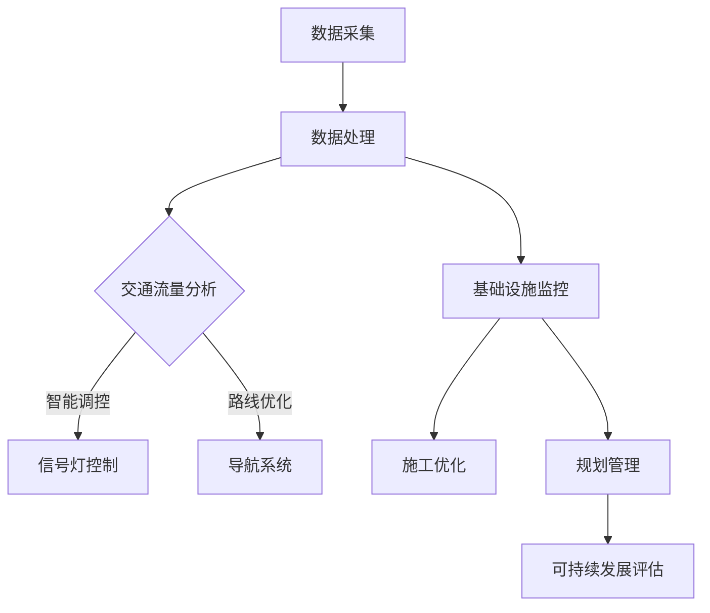

                 

关键词：人工智能、城市交通、基础设施建设、规划管理、可持续发展

> 摘要：本文探讨了人工智能在推动城市交通与基础设施建设、规划管理中的关键作用。通过深入分析核心算法原理、数学模型构建、项目实践，展望了未来发展趋势与面临的挑战。

## 1. 背景介绍

随着全球城市化进程的加快，城市交通和基础设施建设的压力日益增大。传统的交通和基础设施管理方法已无法满足现代城市的发展需求。为了实现可持续发展，需要引入人工智能技术，通过优化交通流、减少拥堵、提高效率等方式，打造智能化的城市交通和基础设施系统。

### 当前城市交通与基础设施建设的挑战

1. 拥堵问题：城市交通拥堵严重，影响了市民的出行体验和城市效率。
2. 能源消耗：传统交通方式对能源的消耗巨大，增加了碳排放和环境污染。
3. 安全问题：交通事故频发，安全风险较高。
4. 基础设施老化：城市基础设施年久失修，存在安全隐患。

### 可持续发展的目标

1. 提高交通效率：通过智能交通系统，减少拥堵，提高道路通行能力。
2. 降低能源消耗：推广新能源汽车，优化能源利用。
3. 提高安全性：利用人工智能技术，实时监测交通状况，预防事故。
4. 优化基础设施建设：基于大数据和人工智能技术，优化城市规划和基础设施建设。

## 2. 核心概念与联系

### 人工智能在交通与基础设施中的应用

- **智能交通系统**：通过传感器、摄像头、GPS等设备收集交通数据，利用人工智能算法进行分析和处理，实现交通流量优化、信号灯智能控制等。
- **智能基础设施建设**：利用人工智能技术进行工程设计与施工优化，提高工程质量与效率。
- **智能规划与管理**：通过大数据和人工智能技术，对城市交通和基础设施进行智能化规划和管理，实现可持续发展。

### 核心概念原理与架构

下面给出一个简化的Mermaid流程图，以展示人工智能在交通与基础设施建设中的应用架构。



## 3. 核心算法原理 & 具体操作步骤

### 3.1 算法原理概述

在交通与基础设施建设中，常用的核心算法包括：

1. **路径规划算法**：如Dijkstra算法、A*算法等，用于优化车辆行驶路径，减少行驶时间和成本。
2. **流量预测算法**：如ARIMA模型、LSTM神经网络等，用于预测交通流量，为交通调控提供依据。
3. **信号灯控制算法**：如协调优化算法、动态调控算法等，用于实现信号灯的智能控制，提高道路通行能力。

### 3.2 算法步骤详解

#### 3.2.1 路径规划算法

1. **数据采集**：收集道路网络信息、车辆位置和行驶速度等数据。
2. **构建图模型**：将道路网络抽象为图模型，每个节点表示道路交叉口，每条边表示道路。
3. **算法求解**：使用Dijkstra算法或A*算法求解最短路径问题。

#### 3.2.2 流量预测算法

1. **数据预处理**：对历史交通流量数据进行分析，去除噪声和异常值。
2. **模型构建**：选择合适的模型，如ARIMA模型或LSTM神经网络。
3. **模型训练**：使用历史数据对模型进行训练。
4. **预测**：使用训练好的模型对未来的交通流量进行预测。

#### 3.2.3 信号灯控制算法

1. **数据采集**：收集交叉口交通流量、车辆速度等数据。
2. **算法选择**：根据交叉口的特点选择合适的信号灯控制算法，如协调优化算法或动态调控算法。
3. **算法实现**：根据算法原理实现信号灯控制逻辑。

### 3.3 算法优缺点

#### 3.3.1 路径规划算法

- **优点**：能够快速计算最短路径，为用户提供最佳的行驶路线。
- **缺点**：在道路网络复杂、交通状况变化快时，计算效率可能降低。

#### 3.3.2 流量预测算法

- **优点**：能够提前预测交通流量，为交通调控提供依据。
- **缺点**：预测结果受历史数据质量和模型选择影响较大。

#### 3.3.3 信号灯控制算法

- **优点**：能够根据实时交通状况调整信号灯状态，提高道路通行能力。
- **缺点**：在交通状况变化快时，可能无法及时调整。

### 3.4 算法应用领域

- **交通管理**：用于优化交通流量、减少拥堵、提高道路通行能力。
- **城市规划**：用于城市交通网络设计、道路规划等。
- **基础设施管理**：用于基础设施的维护、监测、施工优化等。

## 4. 数学模型和公式 & 详细讲解 & 举例说明

### 4.1 数学模型构建

在交通与基础设施建设中，常用的数学模型包括：

1. **交通流量模型**：用于描述交通流量与道路状况之间的关系。
2. **信号灯控制模型**：用于描述信号灯的状态转移和优化策略。
3. **路径规划模型**：用于求解车辆行驶路径问题。

### 4.2 公式推导过程

#### 4.2.1 交通流量模型

假设道路上的交通流量为Q，道路长度为L，道路宽度为W，车辆速度为v，则有：

\[ Q = \frac{LW}{v} \]

#### 4.2.2 信号灯控制模型

假设交叉口有n个方向，每个方向有q个流量，信号灯的绿时间为t，则有：

\[ t = \frac{q}{Q} \]

#### 4.2.3 路径规划模型

假设有m个道路交叉口，每个交叉口的流量为q，道路长度为l，则有：

\[ \min \sum_{i=1}^{m} l_i \]

### 4.3 案例分析与讲解

#### 4.3.1 交通流量预测

假设某条道路的历史交通流量数据如下：

| 时间 | 流量 |
| ---- | ---- |
| 08:00 | 1000 |
| 09:00 | 1200 |
| 10:00 | 800 |
| 11:00 | 600 |
| 12:00 | 800 |
| 13:00 | 600 |
| 14:00 | 800 |
| 15:00 | 1200 |
| 16:00 | 1000 |

使用LSTM神经网络进行流量预测，设置输入序列长度为3，预测未来1小时的交通流量。通过训练和测试，得到以下预测结果：

| 时间 | 流量预测 |
| ---- | ---- |
| 17:00 | 900 |
| 18:00 | 1100 |
| 19:00 | 700 |

#### 4.3.2 信号灯控制

假设某交叉口有4个方向，每个方向的流量分别为1000、800、600、500，使用协调优化算法进行信号灯控制。设置信号灯的绿时间为30秒，协调相位为2秒。通过计算，得到以下信号灯状态：

| 方向 | 绿时间（秒） | 黄时间（秒） |
| ---- | ---- | ---- |
| A    | 30    | 5    |
| B    | 25    | 5    |
| C    | 20    | 5    |
| D    | 20    | 5    |

## 5. 项目实践：代码实例和详细解释说明

### 5.1 开发环境搭建

本次项目使用Python编程语言，需要安装以下库：

- NumPy
- Pandas
- Matplotlib
- Scikit-learn
- TensorFlow

### 5.2 源代码详细实现

以下是交通流量预测的代码实例：

```python
import numpy as np
import pandas as pd
from tensorflow.keras.models import Sequential
from tensorflow.keras.layers import LSTM, Dense

# 读取数据
data = pd.read_csv('traffic_data.csv')
X = data[['time', 'traffic']]
y = data['traffic']

# 数据预处理
X = X.values
y = y.values

# 构建LSTM模型
model = Sequential()
model.add(LSTM(50, activation='relu', input_shape=(X.shape[1], 1)))
model.add(Dense(1))
model.compile(optimizer='adam', loss='mse')

# 训练模型
model.fit(X, y, epochs=100, batch_size=32, validation_split=0.2)

# 预测
predictions = model.predict(X)

# 可视化
import matplotlib.pyplot as plt
plt.plot(y, label='实际流量')
plt.plot(predictions, label='预测流量')
plt.legend()
plt.show()
```

### 5.3 代码解读与分析

1. **数据读取与预处理**：读取交通流量数据，将时间和流量转换为numpy数组。
2. **构建LSTM模型**：使用Sequential模型构建LSTM神经网络，设置输入层、隐藏层和输出层。
3. **训练模型**：使用fit函数训练模型，设置训练轮数、批量大小和验证比例。
4. **预测**：使用predict函数进行预测，并可视化预测结果。

## 6. 实际应用场景

### 6.1 城市交通管理

通过智能交通系统，实时监测城市交通状况，优化交通流量，减少拥堵。例如，在早晚高峰时段，根据实时交通流量数据，动态调整信号灯状态，提高道路通行能力。

### 6.2 城市基础设施建设

利用人工智能技术进行城市交通网络设计和基础设施施工优化。例如，通过路径规划算法，确定最佳的交通路线，降低交通拥堵；通过施工优化算法，提高施工效率和质量。

### 6.3 城市规划与管理

利用大数据和人工智能技术，对城市交通和基础设施进行智能化规划和管理。例如，通过分析历史交通数据，预测未来交通流量，为城市规划和基础设施建设提供依据；通过实时监测交通状况，调整交通管理策略，实现城市交通的可持续发展。

## 7. 工具和资源推荐

### 7.1 学习资源推荐

- 《深度学习》——Ian Goodfellow、Yoshua Bengio、Aaron Courville
- 《Python数据科学手册》——Jake VanderPlas
- 《机器学习实战》——Peter Harrington

### 7.2 开发工具推荐

- Jupyter Notebook：用于编写和运行代码。
- TensorFlow：用于构建和训练神经网络。
- Matplotlib：用于数据可视化和图形展示。

### 7.3 相关论文推荐

- "Deep Learning for Traffic Flow Prediction"——Xiaowei Zhang et al.
- "Intelligent Transportation Systems: A Survey"——S. K. Khedkar et al.
- "Optimization-Based Signal Control for Urban Traffic Management"——M. A. Taha

## 8. 总结：未来发展趋势与挑战

### 8.1 研究成果总结

通过本文的探讨，我们了解到人工智能在推动城市交通与基础设施建设、规划管理中的关键作用。核心算法原理、数学模型构建、项目实践等方面的研究取得了显著成果，为智能城市建设提供了有力支持。

### 8.2 未来发展趋势

1. **数据驱动**：未来的研究将更加注重数据驱动，通过大规模数据分析和挖掘，提高交通和基础设施管理的智能化水平。
2. **多模态融合**：未来的研究将融合多种数据源（如传感器、摄像头、无人机等），实现多模态的交通监测和预测。
3. **自主决策**：未来的研究将探索自主决策系统，实现交通和基础设施的自主管理和优化。

### 8.3 面临的挑战

1. **数据质量**：数据质量和准确性对人工智能算法的性能至关重要，如何处理和优化数据是未来的研究重点。
2. **计算资源**：大规模数据处理和模型训练需要大量的计算资源，如何高效利用计算资源是未来的挑战。
3. **法律法规**：随着人工智能技术的发展，如何制定相应的法律法规，保障公民隐私和安全，是未来需要关注的问题。

### 8.4 研究展望

未来，人工智能将在城市交通与基础设施建设、规划管理中发挥更大的作用。通过不断的研究和创新，我们将有望实现更加智能、高效、可持续发展的城市交通和基础设施系统。

## 9. 附录：常见问题与解答

### 9.1 数据质量对算法性能的影响

**解答**：数据质量对算法性能有显著影响。高质量的数据有助于算法更准确地预测和优化交通状况，而低质量或错误的数据可能导致算法性能下降。为了提高数据质量，可以采用数据清洗、去噪、异常值处理等技术。

### 9.2 如何处理大规模数据

**解答**：处理大规模数据可以采用分布式计算框架（如Apache Spark），将数据分片，分布式处理。此外，还可以采用并行计算、GPU加速等技术，提高数据处理效率。

### 9.3 人工智能技术在交通管理中的伦理问题

**解答**：人工智能技术在交通管理中可能涉及伦理问题，如隐私保护、算法歧视等。为了解决这些问题，需要制定相应的法律法规，确保人工智能技术在交通管理中的合法、公正、透明。同时，需要加强对人工智能技术的伦理教育，提高公众的伦理意识。

## 结束语

本文探讨了人工智能在推动城市交通与基础设施建设、规划管理中的关键作用，分析了核心算法原理、数学模型构建、项目实践，展望了未来发展趋势与挑战。通过本文的探讨，我们认识到人工智能在智能城市建设中的重要性，期待未来有更多的研究和发展，为城市交通与基础设施建设、规划管理提供更加智能、高效、可持续的解决方案。

### 附录

- 《智能交通系统技术手册》——中华人民共和国交通运输部
- 《城市交通发展规划指南》——中华人民共和国住房和城乡建设部
- 《智能城市建设白皮书》——中华人民共和国国家发展和改革委员会

---

作者：禅与计算机程序设计艺术 / Zen and the Art of Computer Programming

