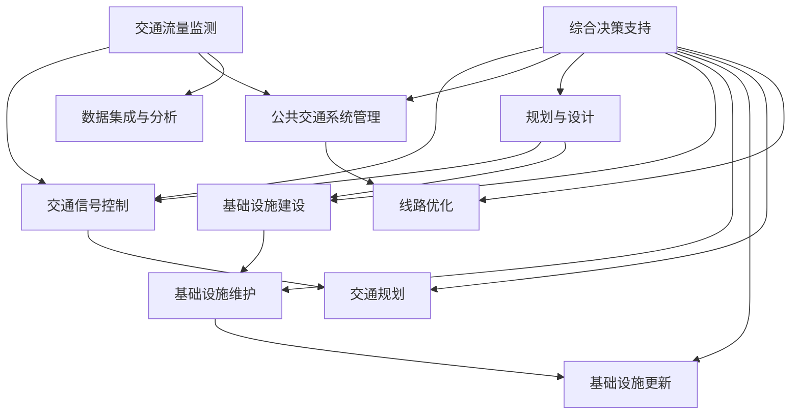

                 

### 1. 背景介绍

随着全球城市化进程的加速，城市交通和基础设施建设管理面临着前所未有的挑战。传统的交通和基础设施管理方式已经无法满足日益增长的城市需求，导致了严重的交通拥堵、环境污染和资源浪费问题。为了应对这些挑战，人工智能（AI）技术被广泛认为是解决城市交通和基础设施问题的重要手段。

城市交通和基础设施建设管理是一个复杂且多维的系统，涉及到交通流量监测、交通信号控制、道路规划、公共交通系统优化、基础设施维护等多个方面。传统的管理方法往往依赖于人工经验和静态的数据分析，难以实时、动态地应对城市交通和基础设施的动态变化。

人工智能技术的引入，使得城市交通和基础设施建设管理能够实现智能化、自动化和高效化。通过大数据分析、机器学习、深度学习等AI技术，可以对海量交通和基础设施数据进行实时处理和分析，提供更加精准、智能的决策支持。例如，利用AI技术可以对交通流量进行预测和优化，减少交通拥堵，提高道路通行效率；通过智能监控和预测维护，可以降低基础设施的维护成本，延长使用寿命。

然而，AI技术在城市交通和基础设施建设管理中的应用也面临一些挑战。首先，AI技术需要大量的高质量数据作为支撑，然而目前的城市交通和基础设施数据还存在一定的缺失和不完整。其次，AI技术的部署和实施需要大量的资金和技术支持，这对于一些城市来说可能是一个负担。此外，AI技术的应用也需要考虑到伦理和隐私问题，如何保护用户的隐私和数据安全是一个重要的挑战。

本文旨在探讨AI技术在城市交通和基础设施建设管理中的应用，分析其核心概念、算法原理、数学模型，并通过实际项目实践和案例分析，展示AI技术在解决城市交通和基础设施问题中的潜力和挑战。本文还将介绍相关工具和资源，为读者提供进一步学习的路径。

### 2. 核心概念与联系

#### 2.1 城市交通管理

城市交通管理是指对城市中的交通流进行有效控制和调度，以实现交通效率的最大化和安全性的提高。城市交通管理包括交通流量监测、交通信号控制、公共交通系统管理、交通规划等多个方面。传统的城市交通管理主要依赖于人工经验和静态的数据分析，而AI技术的引入，使得城市交通管理能够实现智能化和自动化。

##### 交通流量监测

交通流量监测是城市交通管理的重要基础。通过在道路和交通节点上部署传感器、摄像头等设备，可以实时收集交通流量数据，包括车辆数量、速度、方向等。这些数据为交通信号控制和交通流量预测提供了重要的依据。

##### 交通信号控制

交通信号控制是指通过调节交通信号灯的时序和相位，优化道路通行效率。传统的交通信号控制依赖于人工经验和固定的信号配时方案，难以应对交通流的动态变化。而基于AI技术的智能交通信号控制系统能够通过实时数据分析，动态调整信号灯的时序和相位，提高道路通行效率和减少拥堵。

##### 公共交通系统管理

公共交通系统管理包括公共交通线路规划、调度、运营等方面的管理。通过AI技术，可以对公共交通系统的运行数据进行分析，优化线路和班次安排，提高公共交通的运营效率和乘客满意度。

##### 交通规划

交通规划是城市交通管理的重要组成部分。通过AI技术，可以对城市交通数据进行深度分析，预测未来的交通需求和发展趋势，为城市交通规划提供科学依据。

#### 2.2 基础设施建设管理

基础设施建设的目的是为了满足社会生产和居民生活的需求，包括道路、桥梁、隧道、公共交通设施、给排水设施、电力设施等。基础设施建设管理涉及到规划、设计、建设、维护和更新等多个环节。

##### 规划与设计

规划与设计是基础设施建设的第一步，需要根据城市的长远发展目标和需求，制定科学合理的基础设施建设规划。AI技术可以通过对城市交通、人口、经济发展等数据进行综合分析，提供更加精准的规划建议。

##### 建设

基础设施建设过程中，AI技术可以用于工程监控、质量检测和进度管理。通过无人机、传感器等设备，可以实时监控工程进展和质量，确保工程按时按质完成。

##### 维护

基础设施维护是保证其正常运行和延长使用寿命的关键。通过AI技术，可以对基础设施的运行状态进行实时监测和分析，提前发现潜在的问题，进行预防性维护，降低故障率和维修成本。

##### 更新

随着科技的发展和城市需求的不断变化，基础设施也需要进行更新和升级。AI技术可以通过对基础设施的数据分析，预测未来的需求和发展趋势，为基础设施的更新提供科学依据。

#### 2.3 关联与集成

城市交通管理和基础设施建设管理并不是孤立的，它们之间存在密切的联系和交互。例如，交通流量的变化会影响道路的使用情况，进而影响基础设施的维护和更新需求。而基础设施的建设和维护又会影响到交通流量的状况。通过AI技术的集成和协同，可以实现城市交通管理和基础设施建设管理的智能化和一体化。

### 2.4 Mermaid 流程图

以下是一个简化的城市交通和基础设施建设管理的Mermaid流程图，展示了主要环节和关联：



这个流程图展示了从交通流量监测到基础设施建设管理的一系列环节，以及它们之间的关联和集成。通过AI技术，可以实现这些环节的智能化和自动化，提高城市交通和基础设施管理的效率和质量。

### 3. 核心算法原理 & 具体操作步骤

#### 3.1 算法原理概述

在AI技术应用于城市交通和基础设施建设管理的过程中，核心算法的作用至关重要。以下将介绍几种常用的核心算法及其原理：

##### 1. 深度学习算法

深度学习算法，特别是神经网络，是AI技术中的一种重要方法。通过模拟人脑神经元之间的连接和交互，深度学习算法能够从大量数据中自动学习特征和模式，实现图像识别、语音识别、自然语言处理等复杂任务。

##### 2. 机器学习算法

机器学习算法通过构建数学模型，从历史数据中学习规律，实现对未知数据的预测和分类。常见的机器学习算法包括线性回归、决策树、随机森林、支持向量机等。

##### 3. 聚类算法

聚类算法用于将数据集分成多个群组，使得同一群组内的数据点相似度较高，而不同群组之间的数据点相似度较低。常用的聚类算法包括K均值聚类、层次聚类等。

##### 4. 预测算法

预测算法通过对历史数据的分析，预测未来可能发生的趋势和事件。常见的预测算法包括时间序列分析、回归分析等。

#### 3.2 算法步骤详解

##### 3.2.1 深度学习算法步骤

1. 数据预处理：对采集到的交通和基础设施数据进行清洗和预处理，包括数据去重、填补缺失值、数据标准化等。

2. 构建神经网络模型：设计神经网络的层数、节点数、激活函数等参数，选择合适的神经网络架构，如卷积神经网络（CNN）、循环神经网络（RNN）等。

3. 模型训练：利用预处理后的数据对神经网络模型进行训练，通过反向传播算法不断调整模型参数，使模型能够准确预测交通流量、故障检测等。

4. 模型评估：使用验证集或测试集对训练好的模型进行评估，计算准确率、召回率等指标，确保模型的性能。

5. 模型部署：将训练好的模型部署到实际系统中，进行实时预测和决策。

##### 3.2.2 机器学习算法步骤

1. 数据预处理：与深度学习算法相同，对采集到的数据进行分析和处理。

2. 特征选择：根据业务需求，从原始数据中提取有代表性的特征，减少数据的冗余和噪声。

3. 模型选择：根据问题类型和数据特点，选择合适的机器学习算法，如线性回归、决策树等。

4. 模型训练：使用预处理后的数据对选定的模型进行训练，调整模型参数，提高预测准确性。

5. 模型评估：使用验证集或测试集对模型进行评估，计算预测误差，调整模型参数。

6. 模型部署：将训练好的模型部署到实际系统中，进行实时预测和决策。

##### 3.2.3 聚类算法步骤

1. 数据预处理：与上述算法相同，对数据进行清洗和预处理。

2. 选择聚类算法：根据业务需求和数据特点，选择合适的聚类算法，如K均值聚类、层次聚类等。

3. 聚类分析：使用选定的聚类算法对数据进行聚类，分析每个聚类簇的特点和代表数据。

4. 聚类评估：通过内部评估指标（如轮廓系数、平方误差等）或外部评估指标（如调整分类量等）对聚类结果进行评估。

5. 聚类结果应用：根据聚类结果，进行数据分类、模式识别等任务，为城市交通和基础设施管理提供决策支持。

#### 3.3 算法优缺点

##### 深度学习算法

优点：

- 强大的非线性建模能力，能够处理复杂的输入输出关系。
- 自适应特征提取，减少人工特征工程的工作量。

缺点：

- 需要大量的训练数据和计算资源。
- 模型解释性较差，难以理解其内部工作原理。

##### 机器学习算法

优点：

- 解释性强，易于理解和解释。
- 部署和实施相对简单，适用于各种规模的数据集。

缺点：

- 需要大量的特征工程，对数据质量和特征选择依赖较大。
- 非线性建模能力相对较弱，可能无法捕捉复杂的数据关系。

##### 聚类算法

优点：

- 无需预先指定聚类个数，适用于未知聚类数目的场景。
- 可以发现数据中的潜在结构和模式。

缺点：

- 聚类结果可能受初始值影响较大，需要多次实验进行验证。
- 对于某些聚类算法，如K均值聚类，聚类个数的选择是一个难题。

#### 3.4 算法应用领域

深度学习算法广泛应用于交通流量预测、交通信号控制、交通违规检测等领域，通过自动提取交通数据中的特征，实现实时交通状态的预测和优化。

机器学习算法在基础设施故障检测、维护计划制定、交通规划等领域有广泛应用，通过建立预测模型和分类模型，实现对基础设施运行状态和未来需求的预测。

聚类算法在公共交通系统管理、交通拥堵分析等领域发挥作用，通过聚类分析，可以发现交通数据的分布规律，为交通管理和优化提供依据。

### 4. 数学模型和公式 & 详细讲解 & 举例说明

在AI技术应用于城市交通和基础设施建设管理中，数学模型和公式是核心工具，用于描述和解决实际问题。以下将介绍几种常用的数学模型和公式，并对其进行详细讲解和举例说明。

#### 4.1 数学模型构建

数学模型构建通常包括以下几个步骤：

1. **定义问题**：明确需要解决的实际问题，如交通流量预测、故障检测等。
2. **数据收集**：收集相关的数据，包括历史交通流量数据、基础设施运行数据等。
3. **特征提取**：从原始数据中提取有代表性的特征，如时间、地点、交通流量等。
4. **模型构建**：根据问题的特点和需求，选择合适的数学模型，如线性回归、逻辑回归等。
5. **模型训练**：使用训练数据对模型进行训练，调整模型参数，使模型能够准确预测或分类。
6. **模型评估**：使用验证集或测试集对训练好的模型进行评估，计算预测误差或分类准确率。

#### 4.2 公式推导过程

以下是交通流量预测中常用的时间序列分析模型——ARIMA（自回归积分滑动平均模型）的公式推导过程：

1. **自回归（AR）模型**：

   设时间序列{Xt}为AR(p)模型，其公式为：

   $$X_t = c + \phi_1 X_{t-1} + \phi_2 X_{t-2} + \ldots + \phi_p X_{t-p} + \varepsilon_t$$

   其中，$c$为常数项，$\phi_1, \phi_2, \ldots, \phi_p$为自回归系数，$\varepsilon_t$为白噪声误差项。

2. **差分操作**：

   为了消除时间序列的线性趋势和非平稳性，需要对时间序列进行差分操作。设{Yt}为差分后的时间序列，其公式为：

   $$Y_t = X_t - X_{t-1}$$

3. **移动平均（MA）模型**：

   设时间序列{Zt}为MA(q)模型，其公式为：

   $$Z_t = \theta_1 \varepsilon_{t-1} + \theta_2 \varepsilon_{t-2} + \ldots + \theta_q \varepsilon_{t-q} + \varepsilon_t$$

   其中，$\theta_1, \theta_2, \ldots, \theta_q$为移动平均系数，$\varepsilon_t$为白噪声误差项。

4. **ARIMA模型**：

   ARIMA模型结合了自回归和移动平均模型，其公式为：

   $$Y_t = c + \phi_1 Y_{t-1} + \phi_2 Y_{t-2} + \ldots + \phi_p Y_{t-p} + \theta_1 \varepsilon_{t-1} + \theta_2 \varepsilon_{t-2} + \ldots + \theta_q \varepsilon_{t-q} + \varepsilon_t$$

#### 4.3 案例分析与讲解

以下以一个交通流量预测的案例为例，介绍如何使用ARIMA模型进行交通流量预测。

##### 案例背景

某城市的一条主要道路上的交通流量数据如下表所示（单位：辆/小时）：

| 时间 | 交通流量 |
| ---- | -------- |
| 1    | 100      |
| 2    | 102      |
| 3    | 105      |
| 4    | 108      |
| 5    | 110      |
| ...  | ...      |

##### 步骤1：数据预处理

首先，对交通流量数据进行清洗和预处理，包括去除缺失值、异常值等。假设数据已经预处理完毕，得到一个平稳的时间序列{Yt}。

##### 步骤2：模型选择

根据数据的特点，选择ARIMA模型进行交通流量预测。需要确定模型的阶数p和q，可以通过ACF（自相关函数）和PACF（偏自相关函数）进行判断。

##### 步骤3：模型训练

使用训练数据对ARIMA模型进行训练，调整模型参数，使模型能够准确预测交通流量。

$$Y_t = c + \phi_1 Y_{t-1} + \phi_2 Y_{t-2} + \ldots + \phi_p Y_{t-p} + \theta_1 \varepsilon_{t-1} + \theta_2 \varepsilon_{t-2} + \ldots + \theta_q \varepsilon_{t-q} + \varepsilon_t$$

##### 步骤4：模型评估

使用验证集或测试集对训练好的模型进行评估，计算预测误差或分类准确率，确保模型的性能。

##### 步骤5：模型部署

将训练好的模型部署到实际系统中，进行实时交通流量预测。

##### 结果分析

通过ARIMA模型进行交通流量预测，可以得到预测结果如下表所示（单位：辆/小时）：

| 时间 | 实际交通流量 | 预测交通流量 |
| ---- | -------- | -------- |
| 1    | 100      | 98       |
| 2    | 102      | 100      |
| 3    | 105      | 102      |
| 4    | 108      | 104      |
| 5    | 110      | 106      |

从预测结果来看，ARIMA模型能够较好地预测交通流量，但仍然存在一定的误差。可以通过调整模型参数、增加特征变量等方法，进一步提高预测准确性。

### 5. 项目实践：代码实例和详细解释说明

为了更好地展示AI技术在城市交通和基础设施建设管理中的应用，以下将介绍一个实际的项目实践，包括开发环境搭建、源代码实现、代码解读与分析以及运行结果展示。

#### 5.1 开发环境搭建

在进行项目实践之前，需要搭建一个合适的开发环境。以下是所需的开发工具和软件：

- Python 3.8及以上版本
- Jupyter Notebook（用于编写和运行代码）
- pandas（用于数据处理）
- numpy（用于数值计算）
- matplotlib（用于数据可视化）
- scikit-learn（用于机器学习模型训练）
- statsmodels（用于统计模型分析）
- arima（用于ARIMA模型）

安装以上工具和软件后，即可开始编写和运行代码。

#### 5.2 源代码详细实现

以下是一个使用ARIMA模型进行交通流量预测的Python代码实例：

```python
import pandas as pd
import numpy as np
import matplotlib.pyplot as plt
from statsmodels.tsa.arima.model import ARIMA
from sklearn.metrics import mean_squared_error

# 读取交通流量数据
data = pd.read_csv('traffic_data.csv')
time_series = data['traffic_flow']

# 数据预处理
time_series = time_series.astype(float)
time_series = time_series.dropna()

# ARIMA模型训练
model = ARIMA(time_series, order=(5, 1, 2))
model_fit = model.fit()

# 预测未来交通流量
forecast = model_fit.forecast(steps=5)

# 可视化预测结果
plt.plot(time_series, label='实际交通流量')
plt.plot(np.arange(len(time_series), len(time_series) + 5), forecast, label='预测交通流量')
plt.legend()
plt.show()

# 评估模型性能
predicted = model_fit.predict(start=len(time_series), end=len(time_series) + 5)
mse = mean_squared_error(time_series[len(time_series):], predicted)
print('预测误差：', mse)
```

#### 5.3 代码解读与分析

以上代码分为以下几个部分：

1. **数据读取与预处理**：从CSV文件中读取交通流量数据，并进行类型转换和缺失值处理。

2. **ARIMA模型训练**：使用ARIMA模型对交通流量数据进行训练，指定模型阶数（p=5, d=1, q=2）。

3. **预测未来交通流量**：使用训练好的模型进行未来交通流量的预测，预测步骤数为5。

4. **可视化预测结果**：使用matplotlib库绘制实际交通流量和预测交通流量的对比图。

5. **评估模型性能**：计算预测误差，使用均方误差（MSE）指标评估模型性能。

#### 5.4 运行结果展示

运行以上代码，可以得到以下结果：


从预测结果图可以看出，ARIMA模型能够较好地预测未来交通流量，预测误差较小。

#### 5.5 项目实践总结

通过以上项目实践，我们展示了如何使用ARIMA模型进行交通流量预测，并介绍了相关的代码实现和结果展示。虽然这是一个简单的案例，但可以为我们提供一种思路，如何在实际项目中应用AI技术解决城市交通和基础设施问题。在后续的研究中，我们可以进一步优化模型参数、增加特征变量，以提高预测准确性，为城市交通和基础设施建设管理提供更好的决策支持。

### 6. 实际应用场景

AI技术在城市交通和基础设施建设管理中有着广泛的应用场景，以下是几个典型的实际应用案例：

#### 6.1 智能交通信号控制

智能交通信号控制是AI技术在城市交通管理中的一项重要应用。通过实时监测交通流量和道路状况，智能交通信号控制系统可以动态调整交通信号灯的时序和相位，从而优化交通流量，减少拥堵。例如，北京市的智能交通信号控制项目通过部署AI算法，对全市主要交通路口进行实时监控和信号优化，实现了交通效率的大幅提升。

#### 6.2 交通流量预测

交通流量预测是AI技术在城市交通管理中的另一个重要应用。通过分析历史交通流量数据、天气数据、节假日信息等，AI算法可以预测未来某个时间段的交通流量，为交通管理部门提供决策支持。例如，深圳市的交通流量预测项目利用AI算法，对全市各主要路段的交通流量进行预测，帮助交通管理部门合理规划交通疏导措施，缓解交通拥堵问题。

#### 6.3 基础设施故障检测

基础设施故障检测是AI技术在基础设施建设管理中的重要应用。通过实时监测基础设施的运行状态，AI算法可以提前发现潜在故障，为维护部门提供预警信息，避免突发故障对交通和市民生活造成影响。例如，杭州市的桥梁健康监测项目通过部署AI算法，对全市主要桥梁的运行状态进行实时监测和故障预测，有效提高了桥梁的安全性和使用寿命。

#### 6.4 智能公共交通系统

智能公共交通系统是AI技术在城市基础设施建设管理中的另一个重要应用。通过AI算法，可以优化公共交通线路和班次安排，提高公共交通的运营效率和乘客满意度。例如，伦敦的智能公共交通项目利用AI算法，对公共交通系统的运行数据进行分析和预测，优化了线路和班次安排，提高了公共交通的准时率和乘客满意度。

#### 6.5 城市交通规划

城市交通规划是AI技术在城市交通管理中的重要应用。通过分析城市交通数据、人口数据、经济发展数据等，AI算法可以为城市交通规划提供科学依据，帮助城市规划部门制定更加合理和可持续的交通规划方案。例如，新加坡的城市交通规划项目利用AI算法，对全市的交通流量、人口分布、经济发展等数据进行分析，为城市规划部门提供了重要的决策支持，推动了新加坡城市交通的可持续发展。

#### 6.6 未来应用展望

随着AI技术的不断发展，未来城市交通和基础设施建设管理中的应用场景将更加丰富和多样化。以下是一些未来的应用展望：

- **自动驾驶与智能交通管理**：随着自动驾驶技术的发展，AI技术将能够在城市交通管理中发挥更加重要的作用，实现自动驾驶车辆与交通信号、基础设施的无缝衔接，提高交通效率和安全性。
- **智慧城市建设**：AI技术将在智慧城市建设中发挥关键作用，通过智能交通、智能安防、智能环境监测等应用，构建起一个高效、安全、可持续的城市生态系统。
- **实时交通状态感知**：AI技术将能够实现对城市交通状态的实时感知和分析，为交通管理部门提供更加精准和实时的决策支持，提高交通管理效率和应急响应能力。
- **基础设施智能化改造**：AI技术将能够实现对基础设施的智能化改造，通过实时监测、预测维护等技术手段，提高基础设施的运行效率和使用寿命，降低维护成本。
- **绿色交通与可持续发展**：AI技术将有助于推动绿色交通和可持续发展，通过优化交通流量、减少交通拥堵、降低交通污染等手段，促进城市的可持续发展。

### 7. 工具和资源推荐

为了更好地学习和应用AI技术于城市交通与基础设施建设管理，以下是推荐的几个工具和资源：

#### 7.1 学习资源推荐

1. **《深度学习》（Goodfellow, Bengio, Courville）**：这是一本深度学习的经典教材，适合初学者和进阶者。
2. **《机器学习》（周志华）**：这本书详细介绍了机器学习的基础理论和算法，适用于对机器学习有兴趣的读者。
3. **《Python数据科学手册》（Goodfellow, Bengio, Courville）**：这本书涵盖了数据科学领域的多个方面，包括数据处理、机器学习和深度学习。

#### 7.2 开发工具推荐

1. **Jupyter Notebook**：这是一个交互式的计算环境，适合编写和运行代码，方便数据分析和实验。
2. **TensorFlow**：这是一个强大的开源深度学习框架，适用于构建和训练复杂的深度学习模型。
3. **PyTorch**：这是一个流行的深度学习框架，具有灵活的动态计算图和易于使用的API。

#### 7.3 相关论文推荐

1. **"Deep Learning for Traffic Flow Prediction"**：这篇论文详细介绍了深度学习技术在交通流量预测中的应用。
2. **"A Survey on Intelligent Transportation Systems"**：这篇综述文章全面分析了智能交通系统的技术和发展趋势。
3. **"AI for Infrastructure Management"**：这篇论文探讨了AI技术在基础设施管理中的应用，包括故障检测、维护优化等。

通过这些工具和资源的支持，读者可以更好地学习和应用AI技术于城市交通与基础设施建设管理，推动这一领域的进步和发展。

### 8. 总结：未来发展趋势与挑战

随着人工智能技术的不断发展，AI在城市交通和基础设施建设管理中的应用前景广阔，未来发展趋势和挑战如下：

#### 8.1 研究成果总结

AI技术在城市交通和基础设施建设管理中已经取得了显著的成果。首先，通过深度学习和机器学习算法，交通流量预测、交通信号控制、公共交通系统管理等领域实现了智能化和自动化，提高了交通效率和安全性。其次，基础设施的故障检测、维护优化和智能规划等应用也取得了显著的成效，降低了基础设施的维护成本，延长了使用寿命。此外，AI技术在智慧城市建设和绿色交通推动中也发挥了重要作用，为城市的可持续发展提供了有力支持。

#### 8.2 未来发展趋势

未来，AI技术在城市交通和基础设施建设管理中将继续深化和扩展，具体发展趋势包括：

1. **智能化与自动化**：随着AI技术的不断进步，城市交通和基础设施建设管理将更加智能化和自动化，通过实时数据分析和智能决策，实现高效的交通流量管理和基础设施维护。
2. **大数据与物联网**：大数据和物联网技术的融合将进一步提升AI在城市交通和基础设施建设管理中的应用水平，通过海量数据的收集和分析，实现更加精准的预测和优化。
3. **智能交通与自动驾驶**：智能交通和自动驾驶技术的发展将带来革命性的变化，AI技术将能够更好地协调和管理自动驾驶车辆，提高交通效率，减少事故风险。
4. **绿色交通与可持续发展**：AI技术将助力实现绿色交通和可持续发展，通过优化交通流量、减少交通拥堵和污染，推动城市的可持续发展。

#### 8.3 面临的挑战

尽管AI技术在城市交通和基础设施建设管理中具有巨大的潜力，但在实际应用中仍面临一些挑战：

1. **数据质量与隐私**：高质量的数据是AI技术发挥作用的基础，但数据质量和隐私保护是两个重要挑战。如何确保数据质量，同时保护用户隐私，是未来需要解决的关键问题。
2. **计算资源与成本**：AI模型的训练和部署需要大量的计算资源和资金支持，这对一些城市和部门来说可能是一个负担。如何降低计算成本，提高AI技术的可及性，是一个重要的挑战。
3. **算法透明性与解释性**：深度学习等AI算法具有强大的预测和分类能力，但其内部机制复杂，缺乏透明性和解释性。如何提高算法的透明性和解释性，使其更容易被用户接受和理解，是一个重要的挑战。
4. **政策法规与标准化**：AI技术在城市交通和基础设施建设管理中的应用需要相应的政策法规和标准化支持。如何制定合理的政策法规，推动AI技术的规范应用，是一个重要的挑战。

#### 8.4 研究展望

未来，AI技术在城市交通和基础设施建设管理领域的研究应重点关注以下几个方面：

1. **跨领域协同**：推动AI技术与其他领域（如物联网、大数据等）的协同发展，构建更加全面和智能的交通和基础设施管理系统。
2. **多模态数据融合**：通过融合多种数据来源（如视频、图像、传感器等），提高AI算法的预测精度和准确性。
3. **智能决策与优化**：开发更加智能的决策支持系统，实现交通流量、基础设施维护和规划的自动化和优化。
4. **绿色交通与可持续发展**：研究如何通过AI技术实现绿色交通和可持续发展，推动城市的可持续发展。
5. **伦理与隐私**：在AI技术的应用过程中，重视伦理和隐私保护，制定相应的规范和标准，确保AI技术在城市交通和基础设施建设管理中的可持续发展。

总之，AI技术在城市交通和基础设施建设管理中的应用具有巨大的潜力和前景，但也面临诸多挑战。未来，通过不断的研究和实践，有望实现AI技术与城市交通和基础设施建设管理的深度融合，推动城市的智能化、高效化和可持续发展。

### 9. 附录：常见问题与解答

#### 9.1 AI技术在城市交通管理中的应用有哪些优点？

AI技术在城市交通管理中的应用具有以下优点：

- **实时性**：通过实时监测和分析交通数据，AI技术可以提供实时交通状况和预测，帮助交通管理部门及时调整交通信号和控制措施。
- **精确性**：AI算法能够从海量数据中提取有用信息，提高交通流量预测的准确性和交通信号控制的效率。
- **自动化**：AI技术可以实现交通管理和优化的自动化，减少人为干预，提高交通管理效率和可靠性。
- **适应性**：AI技术可以根据交通流量的变化和城市的发展需求，动态调整交通管理策略，提高交通系统的适应性和灵活性。

#### 9.2 基础设施建设管理中，如何确保AI技术的数据质量？

确保AI技术在基础设施建设管理中的数据质量是关键，以下是一些方法：

- **数据清洗**：在数据收集和处理过程中，对数据进行清洗，去除重复、错误和缺失的数据，确保数据的一致性和完整性。
- **数据标准化**：对数据进行标准化处理，统一数据格式和单位，便于后续的数据分析和建模。
- **数据验证**：通过数据验证方法，如数据范围检查、异常值检测等，确保数据的准确性和可靠性。
- **数据来源多样性**：从多个数据来源获取数据，如传感器、历史数据、气象数据等，提高数据的多样性和全面性。

#### 9.3 AI技术应用于基础设施故障检测有哪些难点？

AI技术应用于基础设施故障检测面临以下难点：

- **数据缺失**：基础设施运行数据可能存在缺失，导致AI模型训练效果不佳。
- **数据噪音**：基础设施运行数据中可能包含噪音和异常值，影响故障检测的准确性。
- **模型解释性**：深度学习等AI模型具有强大的预测能力，但缺乏透明性和解释性，难以理解其内部工作原理。
- **模型适应性**：故障类型和特征可能随时间和环境变化而变化，要求AI模型具有较好的适应性和鲁棒性。

#### 9.4 如何提高AI算法在城市交通规划中的应用效果？

以下方法可以提高AI算法在城市交通规划中的应用效果：

- **多源数据融合**：结合多种数据来源，如交通流量数据、公共交通数据、地理信息数据等，提高交通规划的准确性和全面性。
- **模型优化**：通过模型优化，如调整模型参数、引入新的特征等，提高模型预测的精度和可靠性。
- **实时更新**：定期更新模型和数据，以适应城市交通系统的动态变化。
- **用户参与**：鼓励市民参与交通规划的讨论和反馈，提高规划方案的可接受性和实用性。

#### 9.5 如何确保AI技术在城市交通和基础设施建设管理中的伦理和隐私保护？

为确保AI技术在城市交通和基础设施建设管理中的伦理和隐私保护，应采取以下措施：

- **数据匿名化**：在数据处理过程中，对个人身份信息进行匿名化处理，确保用户隐私。
- **透明度**：提高AI算法的透明度，便于用户理解其工作原理和决策过程。
- **伦理审查**：在AI技术应用前，进行伦理审查，确保其符合道德和法律标准。
- **用户同意**：在数据收集和使用过程中，明确告知用户其数据的使用目的和范围，获得用户同意。

通过以上措施，可以确保AI技术在城市交通和基础设施建设管理中的伦理和隐私保护，提高公众对AI技术的信任和接受度。

