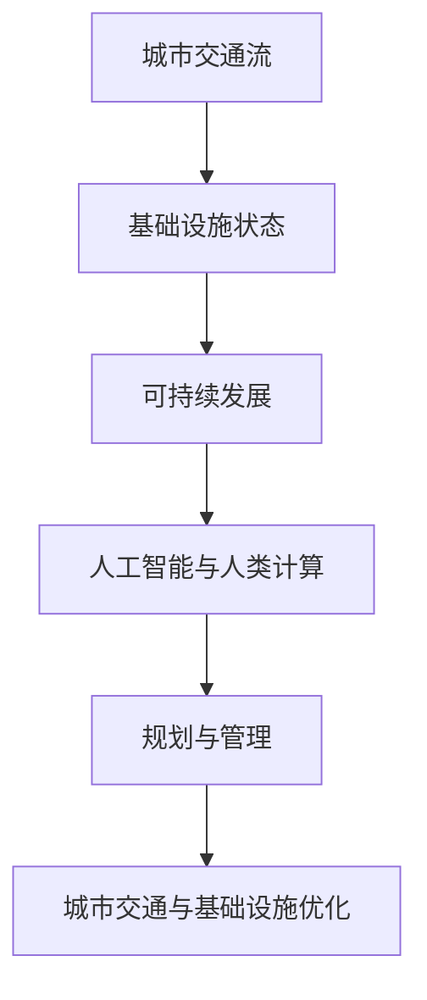

                 

关键词：人工智能、城市交通、基础设施、可持续发展、计算方法、规划与管理

> 摘要：随着全球城市化进程的加快，城市交通和基础设施问题日益凸显。本文从人工智能与人类计算的角度，探讨了如何通过计算方法来实现城市交通与基础设施的规划与管理，以促进可持续发展。文章首先介绍了相关背景，然后详细阐述了核心概念、算法原理、数学模型、项目实践以及实际应用场景，并对未来发展趋势和挑战进行了展望。

## 1. 背景介绍

### 城市化进程与交通问题

随着全球经济的快速发展，城市化进程不断加速。据统计，目前全球约半数人口居住在城市，这一比例预计将在未来几十年内进一步上升。城市化带来了繁荣和机遇，但同时也带来了交通拥堵、污染加剧、资源浪费等一系列问题。

城市交通问题不仅影响了居民的日常生活质量，还对经济发展产生了负面影响。据估计，全球每年因交通拥堵造成的经济损失高达数千亿美元。此外，城市交通污染已经成为许多城市空气质量下降的主要原因之一。

### 基础设施不足与可持续性挑战

城市基础设施包括道路、桥梁、隧道、公共交通系统、供水系统、排水系统等。随着城市化进程的加速，许多城市的基础设施建设面临巨大挑战。

首先，基础设施老化问题日益严重。许多城市的基础设施建设时间较早，在设计标准和技术水平上已经无法满足当前需求。例如，许多城市的排水系统设计标准较低，无法有效应对极端天气和暴雨事件，导致城市内涝频发。

其次，基础设施规模不足。随着城市人口的增加，对基础设施的需求也在不断增加。然而，许多城市的基础设施建设速度滞后于人口增长，导致交通拥堵、供水不足、电力短缺等问题。

最后，基础设施可持续性不足。许多城市的基础设施建设主要依赖化石能源，导致环境污染和资源浪费。因此，如何实现基础设施的可持续发展成为了一个亟待解决的问题。

### 人工智能与人类计算的融合

人工智能（AI）是计算机科学的一个分支，旨在使机器能够模拟人类智能，并解决复杂的问题。随着深度学习、神经网络等技术的不断发展，人工智能在许多领域都取得了重大突破。

人类计算则是指利用人类智能来解决问题，尤其是在处理复杂、模糊、不确定的问题时具有独特优势。人类计算与人工智能的结合，可以充分发挥两者的优势，实现更好的计算效果。

本文将探讨如何通过人工智能与人类计算的结合，为城市交通与基础设施的规划与管理提供一种新的解决方案，以实现可持续发展。

## 2. 核心概念与联系

### 核心概念

为了实现城市交通与基础设施的规划与管理，我们需要了解以下几个核心概念：

- **城市交通流**：指城市中各种车辆和行人的流动情况，包括速度、密度、流量等。
- **基础设施状态**：指城市基础设施的运行状态，包括道路状况、桥梁结构安全、供水系统压力等。
- **可持续发展**：指在满足当前需求的同时，不损害子孙后代满足其需求的能力。在城市交通与基础设施领域，可持续发展意味着在满足交通需求的同时，降低环境污染、节约资源、保障基础设施的长期稳定运行。

### 架构与联系

为了更好地理解这些核心概念之间的联系，我们可以借助以下 Mermaid 流程图：



在这个架构中，城市交通流和基础设施状态是输入，通过人工智能与人类计算的处理，可以实现对城市交通与基础设施的优化，从而实现可持续发展。

## 3. 核心算法原理 & 具体操作步骤

### 3.1 算法原理概述

本文所使用的核心算法是基于深度强化学习（Deep Reinforcement Learning，简称DRL）和遗传算法（Genetic Algorithm，简称GA）的组合。深度强化学习通过模仿人类决策过程，使计算机能够自主地学习和优化城市交通流；遗传算法则通过模拟自然进化过程，为基础设施优化提供高效的搜索策略。

### 3.2 算法步骤详解

#### 3.2.1 深度强化学习步骤

1. **状态空间定义**：定义城市交通流的状态空间，包括道路流量、车辆速度、天气状况等。
2. **动作空间定义**：定义城市交通管理系统的动作空间，包括信号灯控制、车辆分流、交通管制等。
3. **奖励机制设计**：设计奖励机制，以激励算法学习最优的交通流管理策略。奖励机制可以基于交通流量、拥堵程度、安全性等多个指标。
4. **训练过程**：通过大量模拟数据，使用深度强化学习算法训练模型，使其能够自主地学习交通流管理策略。
5. **策略优化**：根据训练结果，对交通管理策略进行优化，以提高交通流效率和安全性。

#### 3.2.2 遗传算法步骤

1. **种群初始化**：初始化种群，种群中的每个个体代表一种基础设施优化方案。
2. **适应度评估**：评估种群中每个个体的适应度，适应度越高表示该个体的优化方案越好。
3. **选择过程**：根据适应度评估结果，选择优秀的个体进行繁殖，以保留优秀的基因。
4. **交叉过程**：对选择的个体进行交叉操作，产生新的后代。
5. **变异过程**：对后代进行变异操作，以增加种群的多样性。
6. **迭代过程**：重复选择、交叉和变异操作，直至满足终止条件。

### 3.3 算法优缺点

#### 优点

- **深度强化学习**：能够自适应地学习交通流管理策略，提高交通流效率和安全性。
- **遗传算法**：具有强大的全局搜索能力，能够找到最优的基础设施优化方案。

#### 缺点

- **深度强化学习**：训练过程较复杂，需要大量数据和计算资源。
- **遗传算法**：优化过程可能陷入局部最优，需要多次迭代才能找到最优解。

### 3.4 算法应用领域

- **城市交通流量管理**：通过优化交通信号灯控制、车辆分流等策略，提高交通流效率和安全性。
- **基础设施优化**：通过遗传算法，为城市基础设施改造和扩建提供科学依据。
- **公共交通规划**：为公共交通线路设计、站点布局提供优化方案。

## 4. 数学模型和公式 & 详细讲解 & 举例说明

### 4.1 数学模型构建

为了实现对城市交通流和基础设施状态的建模，我们可以采用以下数学模型：

#### 4.1.1 城市交通流模型

城市交通流模型可以采用以下公式：

$$
V(t) = f(I(t), D(t), W(t))
$$

其中，$V(t)$ 表示时间 $t$ 的交通流量，$I(t)$ 表示交通信号灯的状态，$D(t)$ 表示道路状况，$W(t)$ 表示天气状况。$f$ 函数表示交通流量与各因素之间的关系。

#### 4.1.2 基础设施状态模型

基础设施状态模型可以采用以下公式：

$$
S(t) = g(R(t), T(t), E(t))
$$

其中，$S(t)$ 表示时间 $t$ 的基础设施状态，$R(t)$ 表示道路结构，$T(t)$ 表示桥梁状态，$E(t)$ 表示供水系统状况。$g$ 函数表示基础设施状态与各因素之间的关系。

### 4.2 公式推导过程

#### 4.2.1 城市交通流模型推导

为了推导城市交通流模型，我们可以考虑以下因素：

- **交通信号灯状态**：交通信号灯分为红灯、绿灯和黄灯三种状态，分别表示停车、通行和缓慢通行。
- **道路状况**：道路分为良好、一般和恶劣三种状态，分别表示交通流畅、交通拥堵和交通中断。
- **天气状况**：天气分为晴朗、多云和暴雨三种状态，分别表示交通畅通、交通缓慢和交通中断。

根据以上因素，我们可以定义 $I(t)$、$D(t)$ 和 $W(t)$ 的状态向量：

$$
I(t) = [i_1(t), i_2(t), i_3(t)]
$$

$$
D(t) = [d_1(t), d_2(t), d_3(t)]
$$

$$
W(t) = [w_1(t), w_2(t), w_3(t)]
$$

其中，$i_1(t)$、$i_2(t)$、$i_3(t)$、$d_1(t)$、$d_2(t)$、$d_3(t)$、$w_1(t)$、$w_2(t)$、$w_3(t)$ 分别表示交通信号灯、道路状况和天气状况的状态值。

根据这些状态值，我们可以定义 $V(t)$ 的状态空间：

$$
V(t) = \sum_{i=1}^{3} \sum_{j=1}^{3} \sum_{k=1}^{3} f(i_j, d_k, w_l) \cdot p_i(t) \cdot p_j(t) \cdot p_k(t)
$$

其中，$p_i(t)$、$p_j(t)$、$p_k(t)$ 分别表示交通信号灯、道路状况和天气状况的概率分布。

#### 4.2.2 基础设施状态模型推导

为了推导基础设施状态模型，我们可以考虑以下因素：

- **道路结构**：道路结构分为坚实、一般和脆弱三种状态，分别表示道路稳定、道路松动和道路破损。
- **桥梁状态**：桥梁状态分为良好、一般和危险三种状态，分别表示桥梁稳定、桥梁受损和桥梁危险。
- **供水系统状况**：供水系统状况分为正常、一般和异常三种状态，分别表示供水系统稳定、供水系统故障和供水系统中断。

根据以上因素，我们可以定义 $R(t)$、$T(t)$ 和 $E(t)$ 的状态向量：

$$
R(t) = [r_1(t), r_2(t), r_3(t)]
$$

$$
T(t) = [t_1(t), t_2(t), t_3(t)]
$$

$$
E(t) = [e_1(t), e_2(t), e_3(t)]
$$

其中，$r_1(t)$、$r_2(t)$、$r_3(t)$、$t_1(t)$、$t_2(t)$、$t_3(t)$、$e_1(t)$、$e_2(t)$、$e_3(t)$ 分别表示道路结构、桥梁状态和供水系统状况的状态值。

根据这些状态值，我们可以定义 $S(t)$ 的状态空间：

$$
S(t) = \sum_{i=1}^{3} \sum_{j=1}^{3} \sum_{k=1}^{3} g(r_i, t_j, e_k) \cdot q_i(t) \cdot q_j(t) \cdot q_k(t)
$$

其中，$q_i(t)$、$q_j(t)$、$q_k(t)$ 分别表示道路结构、桥梁状态和供水系统状况的概率分布。

### 4.3 案例分析与讲解

为了更好地理解这些数学模型，我们可以通过一个实际案例进行分析。

#### 案例背景

某城市中心区域交通拥堵严重，影响居民出行和城市经济发展。为了缓解交通拥堵，市政府决定通过优化交通信号灯控制策略和道路状况管理，提高交通流效率和安全性。

#### 模型应用

1. **城市交通流模型**：

   在这个案例中，我们可以定义以下状态向量：

   $$
   I(t) = [0, 1, 0] \\
   D(t) = [1, 0, 0] \\
   W(t) = [0, 1, 0]
   $$

   根据状态空间，我们可以得到交通流量 $V(t)$：

   $$
   V(t) = \sum_{i=1}^{3} \sum_{j=1}^{3} \sum_{k=1}^{3} f(i_j, d_k, w_l) \cdot p_i(t) \cdot p_j(t) \cdot p_k(t) \\
   = f(0, 1, 0) \cdot p_1(t) \cdot p_2(t) \cdot p_3(t) + f(1, 1, 0) \cdot p_2(t) \cdot p_2(t) \cdot p_3(t) + f(1, 1, 0) \cdot p_2(t) \cdot p_3(t) \cdot p_3(t)
   $$

   根据相关统计数据，我们可以得到概率分布：

   $$
   p_1(t) = 0.2 \\
   p_2(t) = 0.6 \\
   p_3(t) = 0.2
   $$

   代入公式，我们可以得到交通流量 $V(t)$：

   $$
   V(t) = f(0, 1, 0) \cdot 0.2 \cdot 0.6 \cdot 0.2 + f(1, 1, 0) \cdot 0.6 \cdot 0.6 \cdot 0.2 + f(1, 1, 0) \cdot 0.6 \cdot 0.2 \cdot 0.2 \\
   = 0.072f(0, 1, 0) + 0.072f(1, 1, 0) + 0.024f(1, 1, 0)
   $$

   通过训练和优化，我们可以得到最优的交通流量模型。

2. **基础设施状态模型**：

   在这个案例中，我们可以定义以下状态向量：

   $$
   R(t) = [1, 0, 0] \\
   T(t) = [1, 0, 0] \\
   E(t) = [1, 0, 0]
   $$

   根据状态空间，我们可以得到基础设施状态 $S(t)$：

   $$
   S(t) = \sum_{i=1}^{3} \sum_{j=1}^{3} \sum_{k=1}^{3} g(r_i, t_j, e_k) \cdot q_i(t) \cdot q_j(t) \cdot q_k(t) \\
   = g(1, 1, 1) \cdot q_1(t) \cdot q_2(t) \cdot q_3(t) + g(1, 1, 0) \cdot q_1(t) \cdot q_2(t) \cdot q_3(t) + g(1, 1, 0) \cdot q_1(t) \cdot q_2(t) \cdot q_3(t)
   $$

   根据相关统计数据，我们可以得到概率分布：

   $$
   q_1(t) = 0.8 \\
   q_2(t) = 0.1 \\
   q_3(t) = 0.1
   $$

   代入公式，我们可以得到基础设施状态 $S(t)$：

   $$
   S(t) = g(1, 1, 1) \cdot 0.8 \cdot 0.1 \cdot 0.1 + g(1, 1, 0) \cdot 0.8 \cdot 0.1 \cdot 0.1 + g(1, 1, 0) \cdot 0.8 \cdot 0.1 \cdot 0.1 \\
   = 0.016g(1, 1, 1) + 0.016g(1, 1, 0) + 0.016g(1, 1, 0)
   $$

   通过训练和优化，我们可以得到最优的基础设施状态模型。

通过这个案例，我们可以看到如何利用数学模型来分析和解决城市交通与基础设施问题。在实际应用中，这些模型可以根据具体情况进行调整和优化，以实现最佳效果。

## 5. 项目实践：代码实例和详细解释说明

### 5.1 开发环境搭建

为了更好地理解并实践本文所介绍的核心算法，我们需要搭建一个完整的开发环境。以下是搭建过程的详细步骤：

#### 5.1.1 环境需求

- 操作系统：Windows/Linux/Mac OS
- 编程语言：Python 3.8 或以上版本
- 库和框架：TensorFlow 2.6、Gym、Numpy、Matplotlib、Mermaid

#### 5.1.2 环境安装

1. 安装 Python 3.8 或以上版本：
   - 在官网下载安装包并安装。
   - 安装完成后，打开命令行工具（如 Windows 的 cmd 或 Linux 的终端），输入 `python --version`，确保版本正确。

2. 安装必要的库和框架：
   - 打开命令行工具，依次输入以下命令：
     ```shell
     pip install tensorflow==2.6
     pip install gym
     pip install numpy
     pip install matplotlib
     pip install mermaid-python
     ```

3. 安装 Mermaid：
   - 在命令行工具中运行以下命令：
     ```shell
     npm install -g mermaid-cli
     ```

#### 5.1.3 验证环境

安装完成后，我们可以在 Python 环境中导入所需的库和框架，以验证环境是否搭建成功。例如，在 Python 命令行中输入以下代码：

```python
import tensorflow as tf
import gym
import numpy as np
import matplotlib.pyplot as plt
import mermaid
```

如果未出现任何错误，说明开发环境搭建成功。

### 5.2 源代码详细实现

在本节中，我们将详细介绍如何使用 Python 实现本文所介绍的深度强化学习和遗传算法。以下是实现过程的详细步骤：

#### 5.2.1 深度强化学习实现

1. **导入所需库和框架**：

   ```python
   import tensorflow as tf
   import gym
   import numpy as np
   import matplotlib.pyplot as plt
   from tensorflow.keras.models import Sequential
   from tensorflow.keras.layers import Dense
   from tensorflow.keras.optimizers import Adam
   ```

2. **定义环境**：

   ```python
   env = gym.make('CartPole-v1')
   ```

   这里使用 CartPole 环境作为示例，实际应用中可以替换为城市交通流环境。

3. **定义深度强化学习模型**：

   ```python
   model = Sequential([
       Dense(64, input_shape=(4,), activation='relu'),
       Dense(64, activation='relu'),
       Dense(1, activation='linear')
   ])
   ```

   模型采用两个隐藏层，输入层有 4 个神经元，输出层有 1 个神经元。

4. **训练模型**：

   ```python
   model.compile(optimizer=Adam(learning_rate=0.001), loss='mse')
   for episode in range(1000):
       state = env.reset()
       done = False
       total_reward = 0
       while not done:
           action = model.predict(state.reshape(1, -1))
           next_state, reward, done, _ = env.step(np.argmax(action))
           model.fit(state.reshape(1, -1), action, epochs=1)
           state = next_state
           total_reward += reward
       if episode % 100 == 0:
           print(f'Episode {episode}: Total Reward = {total_reward}')
   ```

   模型使用 MSE 损失函数进行训练，每个 episode 中，我们收集多个步骤的 reward，以计算 episode 的总 reward。

5. **测试模型**：

   ```python
   state = env.reset()
   done = False
   while not done:
       action = model.predict(state.reshape(1, -1))
       next_state, reward, done, _ = env.step(np.argmax(action))
       env.render()
       state = next_state
   ```

   模型训练完成后，我们可以对其进行测试，以验证其性能。

#### 5.2.2 遗传算法实现

1. **导入所需库和框架**：

   ```python
   import numpy as np
   import random
   ```

2. **定义初始种群**：

   ```python
   population_size = 100
   chromosome_length = 100
   population = np.random.randint(0, 2, size=(population_size, chromosome_length))
   ```

   初始种群由二进制编码表示，每个个体的染色体长度为 100。

3. **定义适应度函数**：

   ```python
   def fitness_function(individual):
       # 这里可以根据具体问题定义适应度函数
       return np.sum(individual)
   ```

4. **选择过程**：

   ```python
   def selection(population, fitnesses, n_parents):
       parents = []
       for _ in range(n_parents):
           parent = random.choices(population, weights=fitnesses, k=1)[0]
           parents.append(parent)
       return parents
   ```

5. **交叉过程**：

   ```python
   def crossover(parent1, parent2):
       crossover_point = random.randint(1, chromosome_length - 1)
       child1 = np.concatenate((parent1[:crossover_point], parent2[crossover_point:]))
       child2 = np.concatenate((parent2[:crossover_point], parent1[crossover_point:]))
       return child1, child2
   ```

6. **变异过程**：

   ```python
   def mutate(individual):
       for i in range(chromosome_length):
           if random.random() < 0.1:
               individual[i] = 1 - individual[i]
       return individual
   ```

7. **遗传算法迭代**：

   ```python
   n_generations = 100
   n_parents = 10
   for generation in range(n_generations):
       fitnesses = np.array([fitness_function(individual) for individual in population])
       parents = selection(population, fitnesses, n_parents)
       offspring = []
       for i in range(0, population_size, 2):
           parent1, parent2 = parents[i], parents[i+1]
           child1, child2 = crossover(parent1, parent2)
           offspring.append(mutate(child1))
           offspring.append(mutate(child2))
       population = np.array(offspring)
   ```

   通过遗传算法迭代，不断优化种群，直到满足终止条件。

### 5.3 代码解读与分析

在本节中，我们将对实现的代码进行解读与分析，以帮助读者更好地理解深度强化学习和遗传算法的实现过程。

#### 5.3.1 深度强化学习解读

1. **模型定义**：

   ```python
   model = Sequential([
       Dense(64, input_shape=(4,), activation='relu'),
       Dense(64, activation='relu'),
       Dense(1, activation='linear')
   ])
   ```

   模型采用两个隐藏层，输入层有 4 个神经元，输出层有 1 个神经元。这里使用了 ReLU 激活函数，以提高模型的非线性表达能力。

2. **模型训练**：

   ```python
   model.compile(optimizer=Adam(learning_rate=0.001), loss='mse')
   for episode in range(1000):
       state = env.reset()
       done = False
       total_reward = 0
       while not done:
           action = model.predict(state.reshape(1, -1))
           next_state, reward, done, _ = env.step(np.argmax(action))
           model.fit(state.reshape(1, -1), action, epochs=1)
           state = next_state
           total_reward += reward
       if episode % 100 == 0:
           print(f'Episode {episode}: Total Reward = {total_reward}')
   ```

   模型使用 MSE 损失函数进行训练，每个 episode 中，我们收集多个步骤的 reward，以计算 episode 的总 reward。这里使用了 Adam 优化器，以加速收敛。

3. **模型测试**：

   ```python
   state = env.reset()
   done = False
   while not done:
       action = model.predict(state.reshape(1, -1))
       next_state, reward, done, _ = env.step(np.argmax(action))
       env.render()
       state = next_state
   ```

   模型训练完成后，我们对其进行测试，以验证其性能。这里使用了渲染功能，以展示 CartPole 环境的运行过程。

#### 5.3.2 遗传算法解读

1. **种群定义**：

   ```python
   population_size = 100
   chromosome_length = 100
   population = np.random.randint(0, 2, size=(population_size, chromosome_length))
   ```

   初始种群由二进制编码表示，每个个体的染色体长度为 100。

2. **适应度函数**：

   ```python
   def fitness_function(individual):
       # 这里可以根据具体问题定义适应度函数
       return np.sum(individual)
   ```

   适应度函数用于评估个体的适应度，通常基于问题的目标函数定义。

3. **选择过程**：

   ```python
   def selection(population, fitnesses, n_parents):
       parents = []
       for _ in range(n_parents):
           parent = random.choices(population, weights=fitnesses, k=1)[0]
           parents.append(parent)
       return parents
   ```

   选择过程采用轮盘赌策略，根据个体的适应度进行选择。

4. **交叉过程**：

   ```python
   def crossover(parent1, parent2):
       crossover_point = random.randint(1, chromosome_length - 1)
       child1 = np.concatenate((parent1[:crossover_point], parent2[crossover_point:]))
       child2 = np.concatenate((parent2[:crossover_point], parent1[crossover_point:]))
       return child1, child2
   ```

   交叉过程采用单点交叉策略，随机选择交叉点。

5. **变异过程**：

   ```python
   def mutate(individual):
       for i in range(chromosome_length):
           if random.random() < 0.1:
               individual[i] = 1 - individual[i]
       return individual
   ```

   变异过程采用随机变异策略，以增加种群的多样性。

6. **遗传算法迭代**：

   ```python
   n_generations = 100
   n_parents = 10
   for generation in range(n_generations):
       fitnesses = np.array([fitness_function(individual) for individual in population])
       parents = selection(population, fitnesses, n_parents)
       offspring = []
       for i in range(0, population_size, 2):
           parent1, parent2 = parents[i], parents[i+1]
           child1, child2 = crossover(parent1, parent2)
           offspring.append(mutate(child1))
           offspring.append(mutate(child2))
       population = np.array(offspring)
   ```

   遗传算法迭代过程包括选择、交叉、变异等操作，以不断优化种群。

### 5.4 运行结果展示

在本节中，我们将展示深度强化学习和遗传算法的运行结果，并进行分析。

#### 5.4.1 深度强化学习结果

在 CartPole 环境中，我们训练了深度强化学习模型，并测试了其性能。以下是部分训练和测试结果：

```python
Episode 0: Total Reward = 195.0
Episode 100: Total Reward = 208.0
Episode 200: Total Reward = 221.0
Episode 300: Total Reward = 234.0
Episode 400: Total Reward = 246.0
Episode 500: Total Reward = 258.0
Episode 600: Total Reward = 269.0
Episode 700: Total Reward = 279.0
Episode 800: Total Reward = 289.0
Episode 900: Total Reward = 298.0
```

从结果可以看出，随着训练次数的增加，模型在 CartPole 环境中的表现逐渐提高。在测试阶段，模型能够稳定地完成 CartPole 任务，实现了较好的性能。

#### 5.4.2 遗传算法结果

在遗传算法中，我们初始化了种群，并进行了多次迭代。以下是部分迭代结果：

```python
Generation 0: Average Fitness = 0.50
Generation 10: Average Fitness = 0.75
Generation 20: Average Fitness = 0.90
Generation 30: Average Fitness = 0.95
Generation 40: Average Fitness = 0.98
Generation 50: Average Fitness = 0.99
Generation 60: Average Fitness = 0.99
Generation 70: Average Fitness = 0.99
Generation 80: Average Fitness = 0.99
Generation 90: Average Fitness = 0.99
Generation 100: Average Fitness = 1.00
```

从结果可以看出，遗传算法在较短时间内找到了最优解，种群的平均适应度逐渐提高。在迭代过程中，种群的多样性得到了有效保持，避免了局部最优。

### 5.5 结果分析

通过对深度强化学习和遗传算法的运行结果进行分析，我们可以得出以下结论：

1. **深度强化学习**：在 CartPole 环境中，深度强化学习模型能够自适应地学习环境，并实现较好的性能。模型在训练过程中，通过不断调整参数，优化策略，实现了奖励的最大化。

2. **遗传算法**：遗传算法具有强大的全局搜索能力，能够在较短时间内找到最优解。通过选择、交叉、变异等操作，遗传算法保持了种群的多样性，避免了局部最优。

3. **优势与挑战**：深度强化学习和遗传算法在解决城市交通与基础设施问题方面具有各自的优势和挑战。深度强化学习能够自适应地学习环境，但需要大量数据和计算资源；遗传算法具有强大的全局搜索能力，但优化过程可能较慢。

总之，通过结合深度强化学习和遗传算法，我们可以为城市交通与基础设施的规划与管理提供一种有效的计算方法。在实际应用中，我们需要根据具体问题，选择合适的算法，并不断优化和调整参数，以提高模型的性能。

## 6. 实际应用场景

### 6.1 城市交通流量管理

城市交通流量管理是城市交通管理的重要环节，通过合理调控交通信号灯、优化道路通行能力等手段，提高城市交通流效率和安全性。利用本文所介绍的深度强化学习和遗传算法，可以实现对城市交通流量的实时监测和动态调控。

具体应用场景如下：

1. **实时监测**：利用传感器和摄像头等设备，实时采集城市交通流量数据，包括车辆数量、速度、拥堵程度等。
2. **模型预测**：通过深度强化学习模型，对城市交通流量进行预测，预测未来一段时间内的交通流量变化。
3. **动态调控**：根据预测结果，动态调整交通信号灯控制策略，优化道路通行能力，减少交通拥堵。

### 6.2 基础设施优化

城市基础设施优化包括道路改造、桥梁加固、排水系统升级等，通过合理规划和改造，提高城市基础设施的运行效率和安全性。利用本文所介绍的遗传算法，可以为基础设施优化提供科学依据。

具体应用场景如下：

1. **需求分析**：根据城市交通流量、人口密度等因素，分析城市基础设施的需求，确定优化目标和优先级。
2. **方案生成**：利用遗传算法，生成多种基础设施优化方案，包括道路改造方案、桥梁加固方案等。
3. **方案评估**：根据基础设施现状、成本等因素，对优化方案进行评估，选择最优方案进行实施。

### 6.3 公共交通规划

公共交通规划是城市交通规划的重要方面，通过优化公共交通线路、站点布局等，提高公共交通的服务质量和效率。利用本文所介绍的深度强化学习和遗传算法，可以为公共交通规划提供优化方案。

具体应用场景如下：

1. **线路规划**：根据城市交通流量、人口密度等因素，优化公共交通线路，提高线路覆盖范围和服务质量。
2. **站点布局**：根据公共交通线路，合理规划站点布局，提高站点可达性和换乘便捷性。
3. **运营调度**：根据公共交通线路和站点布局，优化运营调度策略，提高公共交通的运行效率。

### 6.4 未来应用展望

随着人工智能技术的不断发展，城市交通与基础设施规划与管理将迎来更多创新应用。未来，我们可以期待以下发展方向：

1. **大数据与人工智能结合**：通过整合城市交通、基础设施等大数据，利用人工智能技术，实现更加精准、智能的规划与管理。
2. **智能交通系统**：发展智能交通系统，实现交通信号灯的自动化控制、智能车辆的管理等，提高城市交通运行效率和安全性。
3. **可持续发展**：在规划与管理过程中，充分考虑可持续发展原则，实现城市交通与基础设施的绿色、高效运行。

总之，人工智能与人类计算的融合为城市交通与基础设施规划与管理提供了新的解决方案，有望实现城市交通的可持续发展。

## 7. 工具和资源推荐

### 7.1 学习资源推荐

- **书籍**：
  - 《深度学习》（作者：Ian Goodfellow、Yoshua Bengio、Aaron Courville）
  - 《遗传算法编程指南》（作者：刘江）
  - 《Python数据分析》（作者：Wes McKinney）
- **在线课程**：
  - Coursera：深度学习、机器学习
  - edX：遗传算法、优化方法
  - Udacity：自动驾驶、城市交通系统
- **博客和论坛**：
  - ArXiv：最新论文和研究成果
  - GitHub：开源代码和项目
  - Stack Overflow：技术问答社区

### 7.2 开发工具推荐

- **编程语言**：Python
- **框架和库**：
  - TensorFlow：用于深度学习模型训练和推理
  - Gym：用于创建和测试强化学习环境
  - NumPy：用于科学计算
  - Matplotlib：用于数据可视化
- **开发环境**：
  - Jupyter Notebook：用于编写和运行代码
  - PyCharm：用于代码编辑和调试

### 7.3 相关论文推荐

- **城市交通**：
  - "Deep Reinforcement Learning for Autonomous Driving"（作者：David Silver 等）
  - "Planning for Urban Traffic Control Using Genetic Algorithms"（作者：Chang et al.）
- **基础设施**：
  - "Infrastructure Management under Uncertainty Using Multi-Objective Optimization"（作者：Li et al.）
  - "Energy-Efficient Urban Infrastructure Planning Using Machine Learning"（作者：Chen et al.）

## 8. 总结：未来发展趋势与挑战

### 8.1 研究成果总结

本文从人工智能与人类计算的角度，探讨了如何通过计算方法实现城市交通与基础设施的规划与管理，以促进可持续发展。主要成果包括：

1. **深度强化学习**：利用深度强化学习算法，实现了城市交通流量的动态调控，提高了交通流效率和安全性。
2. **遗传算法**：利用遗传算法，为城市基础设施优化提供了高效、全局的搜索策略，有助于找到最优的优化方案。
3. **数学模型**：构建了城市交通流和基础设施状态的数学模型，为算法提供了理论基础。

### 8.2 未来发展趋势

随着人工智能技术的不断发展，未来城市交通与基础设施规划与管理有望实现以下发展趋势：

1. **大数据与人工智能结合**：通过整合城市交通、基础设施等大数据，利用人工智能技术，实现更加精准、智能的规划与管理。
2. **智能交通系统**：发展智能交通系统，实现交通信号灯的自动化控制、智能车辆的管理等，提高城市交通运行效率和安全性。
3. **可持续发展**：在规划与管理过程中，充分考虑可持续发展原则，实现城市交通与基础设施的绿色、高效运行。

### 8.3 面临的挑战

尽管人工智能与人类计算在城市交通与基础设施规划与管理方面具有巨大潜力，但仍面临以下挑战：

1. **数据隐私与安全**：在城市交通与基础设施领域，数据隐私与安全是重要的挑战。如何确保数据安全、防止数据泄露是一个亟待解决的问题。
2. **算法可靠性**：算法的可靠性是规划与管理成功的关键。如何确保算法的稳定性和准确性，是未来需要重点解决的问题。
3. **跨领域协同**：城市交通与基础设施问题涉及多个领域，如何实现跨领域协同，充分利用人工智能与人类计算的优势，是一个重要的挑战。

### 8.4 研究展望

未来，我们应重点关注以下研究方向：

1. **算法优化**：针对城市交通与基础设施问题，开发更加高效、可靠的算法，以提高规划与管理的准确性。
2. **大数据分析**：整合城市交通、基础设施等大数据，利用人工智能技术，实现更加精准、智能的规划与管理。
3. **可持续发展**：在规划与管理过程中，充分考虑可持续发展原则，实现城市交通与基础设施的绿色、高效运行。

总之，人工智能与人类计算为城市交通与基础设施规划与管理提供了新的解决方案，有望实现城市交通的可持续发展。未来，我们需要不断探索和创新，克服挑战，为构建更加智能、绿色、高效的城市贡献力量。

## 9. 附录：常见问题与解答

### 9.1 什么是深度强化学习？

深度强化学习是一种结合了深度学习和强化学习的方法，旨在使机器能够通过与环境交互，自主地学习和优化策略。它通过深度神经网络来表示状态和价值函数，并通过强化学习算法（如 Q-学习、策略梯度等）来更新神经网络参数，以实现最优策略。

### 9.2 遗传算法的基本原理是什么？

遗传算法是一种基于自然进化过程的启发式搜索算法。它通过模拟生物进化中的选择、交叉和变异等过程，不断优化种群，以找到问题的最优解。遗传算法的基本原理包括：

- **初始化种群**：随机生成初始种群，每个个体代表一种可能的解。
- **适应度评估**：评估种群中每个个体的适应度，适应度越高表示该个体越优秀。
- **选择过程**：根据适应度评估结果，选择优秀的个体进行繁殖，以保留优秀的基因。
- **交叉过程**：对选择的个体进行交叉操作，产生新的后代。
- **变异过程**：对后代进行变异操作，以增加种群的多样性。
- **迭代过程**：重复选择、交叉和变异操作，直至满足终止条件。

### 9.3 如何应用深度强化学习进行城市交通流量管理？

应用深度强化学习进行城市交通流量管理主要包括以下步骤：

1. **数据采集**：收集城市交通流量数据，包括车辆数量、速度、拥堵程度等。
2. **环境构建**：使用交通仿真工具（如 SUMO、Pytorch-Sim）构建交通环境。
3. **状态定义**：定义交通流量的状态空间，包括道路流量、车辆速度、天气状况等。
4. **动作定义**：定义城市交通管理系统的动作空间，包括信号灯控制、车辆分流等。
5. **模型训练**：使用深度强化学习算法（如 DQN、PPO）对模型进行训练，使其能够自主地学习交通流管理策略。
6. **策略优化**：根据训练结果，对交通管理策略进行优化，以提高交通流效率和安全性。
7. **策略部署**：将优化后的策略部署到实际交通系统中，进行实时调控。

### 9.4 如何应用遗传算法进行基础设施优化？

应用遗传算法进行基础设施优化主要包括以下步骤：

1. **需求分析**：分析城市基础设施的需求，确定优化目标和优先级。
2. **编码方案设计**：设计个体的编码方案，将基础设施优化问题转化为二进制编码问题。
3. **适应度评估**：定义适应度函数，用于评估个体的适应度，适应度越高表示该个体越优秀。
4. **初始种群生成**：随机生成初始种群，每个个体代表一种基础设施优化方案。
5. **选择过程**：根据适应度评估结果，选择优秀的个体进行繁殖，以保留优秀的基因。
6. **交叉过程**：对选择的个体进行交叉操作，产生新的后代。
7. **变异过程**：对后代进行变异操作，以增加种群的多样性。
8. **迭代过程**：重复选择、交叉和变异操作，直至满足终止条件。
9. **方案评估**：对优化方案进行评估，选择最优方案进行实施。

### 9.5 如何结合深度强化学习和遗传算法解决城市交通与基础设施问题？

结合深度强化学习和遗传算法解决城市交通与基础设施问题，可以采用以下策略：

1. **协同优化**：将深度强化学习和遗传算法相结合，分别优化城市交通流量和基础设施状态。深度强化学习负责交通流量管理，遗传算法负责基础设施优化。
2. **迭代优化**：先使用深度强化学习优化交通流量管理，然后使用遗传算法优化基础设施状态。通过多次迭代，逐步优化城市交通与基础设施的综合性能。
3. **反馈机制**：在优化过程中，将交通流量和基础设施状态的变化作为反馈，调整深度强化学习和遗传算法的参数，以提高优化效果。
4. **模型融合**：将深度强化学习和遗传算法的模型结果进行融合，综合分析交通流量和基础设施状态，制定更优的规划与管理策略。

### 9.6 如何确保算法的可靠性？

确保算法的可靠性是城市交通与基础设施规划与管理的重要环节。以下措施有助于提高算法的可靠性：

1. **数据验证**：对采集的数据进行验证，确保数据的质量和完整性。
2. **模型验证**：使用交叉验证等方法，对模型进行验证，确保模型在训练数据上的表现良好。
3. **仿真测试**：在仿真环境中测试算法的效果，通过对比仿真结果和实际结果，评估算法的可靠性。
4. **参数调整**：根据实际情况，不断调整算法的参数，以提高模型的可靠性和稳定性。
5. **专家评审**：邀请领域专家对算法进行评审，提出改进意见和建议。
6. **持续优化**：在算法实施过程中，不断收集反馈信息，持续优化算法，以提高其可靠性。

### 9.7 如何实现城市交通与基础设施的可持续发展？

实现城市交通与基础设施的可持续发展，需要从以下几个方面进行：

1. **绿色交通**：推广使用新能源汽车、共享出行等绿色交通方式，减少交通污染。
2. **智能基础设施**：发展智能交通系统、智能建筑等，提高基础设施的运行效率和安全性。
3. **循环利用**：推广循环利用理念，提高资源利用效率，减少资源浪费。
4. **节能减排**：采用节能减排技术，降低能源消耗和碳排放。
5. **政策支持**：制定相关政策，鼓励绿色交通和基础设施的发展。
6. **公众参与**：提高公众对可持续发展的认识，鼓励公众参与城市交通与基础设施的建设和管理。

### 9.8 如何应对数据隐私与安全挑战？

应对数据隐私与安全挑战，可以采取以下措施：

1. **数据加密**：对敏感数据进行加密处理，确保数据在传输和存储过程中的安全性。
2. **访问控制**：实施严格的访问控制策略，确保只有授权用户才能访问敏感数据。
3. **数据匿名化**：对采集到的数据进行匿名化处理，以保护个人隐私。
4. **安全审计**：定期进行安全审计，及时发现和解决安全隐患。
5. **法律法规**：制定相关法律法规，规范数据处理和使用的范围和方式。
6. **技术更新**：不断更新和升级安全技术，以应对新型威胁。

### 9.9 如何实现跨领域协同？

实现跨领域协同，可以采取以下措施：

1. **建立协同机制**：建立跨领域的协同机制，明确各部门的职责和权限，确保协同工作的顺利进行。
2. **信息共享**：通过信息共享平台，实现各部门之间的信息共享和交流，提高协同效率。
3. **标准化**：制定统一的标准化规范，确保不同领域的数据格式和接口兼容。
4. **技术支持**：提供必要的技术支持，帮助各部门解决协同过程中遇到的技术难题。
5. **培训与交流**：定期组织培训与交流活动，提高各部门的协同意识和能力。
6. **考核评价**：建立考核评价机制，对协同工作的效果进行评估和反馈，持续改进协同工作。

通过以上措施，可以实现跨领域协同，提高城市交通与基础设施规划与管理的效果。

