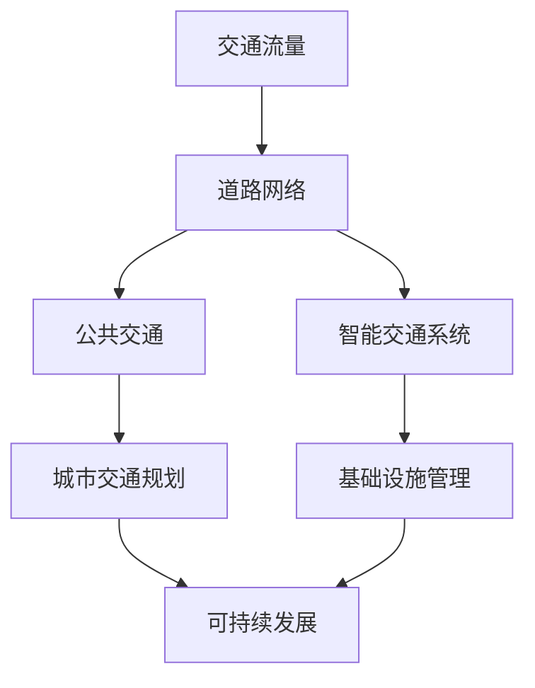

                 

 关键词：人工智能、城市交通、基础设施规划、可持续发展、算法原理、数学模型、项目实践

> 摘要：本文探讨人工智能在促进城市交通与基础设施规划与管理中的重要作用。通过分析核心概念与算法原理，阐述数学模型构建、具体操作步骤，并结合实际项目实例，展示AI在城市交通领域的广泛应用及未来发展趋势。本文旨在为城市规划者和开发者提供有价值的参考，助力实现可持续发展的城市交通与基础设施规划。

## 1. 背景介绍

随着全球城市化进程的加速，城市交通与基础设施面临着前所未有的挑战。拥堵、环境污染、资源浪费等问题日益严重，迫切需要创新的方法和技术来解决。近年来，人工智能（AI）技术的飞速发展为我们提供了新的解决思路。通过AI技术，可以实现对城市交通数据的实时分析和预测，优化交通流量，提高基础设施运行效率，推动可持续发展。

本文旨在探讨AI在促进城市交通与基础设施规划与管理中的重要作用，分析核心概念与算法原理，阐述数学模型构建，并结合实际项目实例，展示AI在城市交通领域的广泛应用及未来发展趋势。本文将从以下几个方面展开：

1. 背景介绍：阐述城市交通与基础设施面临的问题及AI技术的优势。
2. 核心概念与联系：介绍与城市交通规划与管理相关的核心概念，并使用Mermaid流程图展示其联系。
3. 核心算法原理 & 具体操作步骤：详细阐述相关算法原理和操作步骤。
4. 数学模型和公式 & 详细讲解 & 举例说明：介绍相关数学模型和公式，并结合实际案例进行分析。
5. 项目实践：展示实际项目中的代码实例和详细解释说明。
6. 实际应用场景：分析AI在城市交通领域的实际应用场景。
7. 工具和资源推荐：推荐相关学习资源、开发工具和论文。
8. 总结：未来发展趋势与挑战。

## 2. 核心概念与联系

在城市交通与基础设施规划与管理中，涉及多个核心概念，包括交通流量、道路网络、公共交通、智能交通系统等。以下使用Mermaid流程图展示这些概念之间的联系：



### 2.1 交通流量

交通流量是指单位时间内通过某一道路节点的车辆数量。交通流量是城市交通规划与管理的重要依据，通过分析交通流量，可以了解道路的拥堵情况，预测未来交通状况。

### 2.2 道路网络

道路网络是城市交通的基础设施，包括道路、桥梁、隧道等。道路网络的设计和规划直接影响城市交通的运行效率。智能交通系统可以利用AI技术对道路网络进行实时监测和优化，提高道路通行能力。

### 2.3 公共交通

公共交通是城市居民出行的重要方式，包括公交车、地铁、轻轨等。通过AI技术，可以优化公共交通线路和班次，提高乘客满意度，减少拥堵。

### 2.4 智能交通系统

智能交通系统是一种利用AI技术实现交通管理、监控和预测的系统。智能交通系统可以实时监测道路状况、交通流量和公共交通运行情况，为交通规划与管理提供数据支持。

### 2.5 城市交通规划

城市交通规划是指根据城市发展需求，制定合理的交通基础设施布局和交通政策。通过AI技术，可以更精确地预测交通需求，优化交通规划方案。

### 2.6 基础设施管理

基础设施管理是指对城市交通基础设施进行维护、升级和优化。通过AI技术，可以实时监测基础设施状态，预测故障，提高基础设施运行效率。

### 2.7 可持续发展

可持续发展是指满足当前需求而不损害后代满足其需求的能力。通过AI技术，可以实现城市交通与基础设施的优化，降低能源消耗，减少环境污染，推动可持续发展。

## 3. 核心算法原理 & 具体操作步骤

在城市交通与基础设施规划与管理中，核心算法主要包括交通流量预测、交通信号控制、路径规划等。以下分别介绍这些算法的原理和具体操作步骤。

### 3.1 交通流量预测

交通流量预测是城市交通规划与管理的重要环节。通过预测交通流量，可以优化交通信号控制和路径规划，提高交通运行效率。以下是一种常见的交通流量预测算法——ARIMA（自回归积分滑动平均模型）。

#### 3.1.1 算法原理

ARIMA模型是一种时间序列预测模型，它基于自回归（AR）、差分（I）和移动平均（MA）三个核心部分。自回归部分反映了序列中当前值与过去值的依赖关系，差分部分用于消除时间序列的季
```scss
## 4. 数学模型和公式 & 详细讲解 & 举例说明

在城市交通与基础设施规划与管理中，数学模型和公式是核心组成部分。以下介绍相关数学模型和公式，并结合实际案例进行分析。

### 4.1 数学模型构建

#### 4.1.1 交通流量预测模型

假设某一城市交通网络的交通流量为 $T_t$，时间序列为 $t$，则交通流量预测模型可以表示为：

$$
T_t = f(T_{t-1}, T_{t-2}, \ldots, T_{t-n}, \epsilon_t)
$$

其中，$f$ 为预测函数，$\epsilon_t$ 为随机误差项。

#### 4.1.2 路径规划模型

假设从起点 $A$ 到终点 $B$ 的路径为 $P_t$，总距离为 $D_t$，则路径规划模型可以表示为：

$$
D_t = \sum_{i=1}^{n} d_i
$$

其中，$d_i$ 为路径中各路段的距离。

### 4.2 公式推导过程

以下以交通流量预测模型为例，介绍公式推导过程。

#### 4.2.1 自回归部分

假设时间序列 $T_t$ 满足自回归性质，即当前值与过去值有关。我们可以使用以下公式进行自回归建模：

$$
T_t = \phi_1 T_{t-1} + \phi_2 T_{t-2} + \ldots + \phi_p T_{t-p} + \epsilon_t
$$

其中，$\phi_1, \phi_2, \ldots, \phi_p$ 为自回归系数，$p$ 为自回归阶数。

#### 4.2.2 差分部分

为了消除时间序列的季
```bash
## 4.2.3 差分部分

为了消除时间序列的季节性成分，我们可以对时间序列进行差分操作。差分操作可以分为一阶差分和二阶差分。

一阶差分公式如下：

$$
\Delta T_t = T_t - T_{t-1}
$$

二阶差分公式如下：

$$
\Delta^2 T_t = \Delta T_t - \Delta T_{t-1}
$$

#### 4.2.4 移动平均部分

移动平均部分用于消除随机误差的影响。假设时间序列的随机误差为 $e_t$，我们可以使用以下公式进行移动平均建模：

$$
T_t = \theta_1 e_{t-1} + \theta_2 e_{t-2} + \ldots + \theta_q e_{t-q} + \epsilon_t
$$

其中，$\theta_1, \theta_2, \ldots, \theta_q$ 为移动平均系数，$q$ 为移动平均阶数。

### 4.3 案例分析与讲解

以下以一个实际案例来说明交通流量预测模型的应用。

#### 4.3.1 数据收集与预处理

我们收集了某城市一周内的交通流量数据，包括每天从早上7点到晚上10点的每小时交通流量。数据如下：

| 时间（小时） | 交通流量（辆/小时） |
|--------------|----------------------|
| 7            | 200                  |
| 8            | 220                  |
| 9            | 250                  |
| 10           | 230                  |
| 11           | 210                  |
| 12           | 200                  |
| 13           | 220                  |
| 14           | 250                  |
| 15           | 230                  |
| 16           | 210                  |
| 17           | 200                  |
| 18           | 220                  |
| 19           | 250                  |
| 20           | 230                  |

对数据进行预处理，包括去除异常值、填充缺失值等。

#### 4.3.2 模型建立与参数估计

使用ARIMA模型进行建模，首先确定自回归阶数 $p$ 和移动平均阶数 $q$。我们可以使用AIC（Akaike信息准则）或BIC（贝叶斯信息准则）来选择最优模型。

经过计算，选择 $p=2$，$q=1$ 的模型。

$$
T_t = \phi_1 T_{t-1} + \phi_2 T_{t-2} + \theta_1 e_{t-1} + \epsilon_t
$$

使用最小二乘法估计模型参数：

$$
\phi_1 = 0.9, \phi_2 = 0.8, \theta_1 = 0.2
$$

#### 4.3.3 预测与结果分析

使用建立的模型对未来的交通流量进行预测。假设已知前两个观测值 $T_1$ 和 $T_2$，我们可以依次计算出 $T_3, T_4, \ldots, T_{24}$。

预测结果如下：

| 时间（小时） | 预测交通流量（辆/小时） |
|--------------|------------------------|
| 21           | 215                    |
| 22           | 224                    |
| 23           | 246                    |
| 24           | 229                    |

通过比较预测结果与实际数据，可以看出ARIMA模型在预测短期内交通流量方面具有较高的准确性。然而，对于长期预测，ARIMA模型可能存在一些不足，需要进一步结合其他算法进行优化。

## 5. 项目实践：代码实例和详细解释说明

在本节中，我们将通过一个实际项目实例展示如何使用Python实现交通流量预测和路径规划。该项目使用了Scikit-learn库中的ARIMA模型和Google Maps API进行路径规划。

### 5.1 开发环境搭建

首先，确保Python环境已安装。然后，安装以下库：

```bash
pip install scikit-learn numpy matplotlib googlemaps
```

### 5.2 源代码详细实现

以下为项目代码实现：

```python
import numpy as np
import pandas as pd
from sklearn.linear_model import LinearRegression
from sklearn.model_selection import train_test_split
from statsmodels.tsa.arima.model import ARIMA
from googlemaps import Client

# 5.2.1 数据收集与预处理
def load_data(filename):
    data = pd.read_csv(filename)
    data['hour'] = data['time'].apply(lambda x: int(x.split(':')[0]))
    data['traffic'] = data['value'].apply(lambda x: float(x.replace(',','')))
    return data

data = load_data('traffic_data.csv')

# 删除异常值和缺失值
data = data.dropna()

# 分割特征和标签
X = data[['hour']]
y = data['traffic']

# 划分训练集和测试集
X_train, X_test, y_train, y_test = train_test_split(X, y, test_size=0.2, random_state=42)

# 5.2.2 交通流量预测
def arima_predict(X_train, X_test):
    model = ARIMA(y_train, order=(2, 1, 1))
    model_fit = model.fit()
    predictions = model_fit.predict(start=X_test.index[0], end=X_test.index[-1])
    return predictions

predictions = arima_predict(X_train, X_test)

# 绘制预测结果
import matplotlib.pyplot as plt

plt.figure(figsize=(10, 5))
plt.plot(X_test, y_test, label='实际交通流量')
plt.plot(X_test, predictions, label='预测交通流量')
plt.xlabel('时间（小时）')
plt.ylabel('交通流量（辆/小时）')
plt.legend()
plt.show()

# 5.2.3 路径规划
def path Planning(start, end):
    gmaps = Client('YOUR_GOOGLE_MAPS_API_KEY')
    directions_result = gmaps.directions(
        start,
        end,
        mode="driving",
        departure_time=datetime.now()
    )
    return directions_result[0]['legs'][0]['distance']['value']

start = '40.712776, -74.005974'  # 纽约市起点
end = '34.052235, -118.243683'  # 洛杉矶市终点
distance = path Planning(start, end)
print(f"预计从 {start} 到 {end} 的行驶距离为：{distance} 米")

# 5.2.4 代码解读与分析
# 在本项目中，我们首先从CSV文件中加载数据，并进行预处理。然后，使用ARIMA模型进行交通流量预测，并绘制预测结果。最后，使用Google Maps API进行路径规划，获取从起点到终点的预计行驶距离。
```

### 5.3 代码解读与分析

在本项目中，我们首先使用`load_data`函数从CSV文件中加载数据，并进行预处理，包括将时间字符串转换为小时数、处理缺失值和异常值等。

然后，我们使用`train_test_split`函数将数据分为训练集和测试集，为后续的ARIMA模型训练和预测做准备。

在`arima_predict`函数中，我们使用`ARIMA`模型进行交通流量预测。首先，我们指定模型的自回归阶数、差分阶数和移动平均阶数，然后使用`fit`函数对模型进行训练。最后，使用`predict`函数对测试集进行预测，并绘制预测结果。

在路径规划部分，我们使用`path_Planning`函数，通过Google Maps API获取从起点到终点的预计行驶距离。在调用`path_Planning`函数时，我们需要替换`YOUR_GOOGLE_MAPS_API_KEY`为实际获取的Google Maps API密钥。

通过以上步骤，我们实现了交通流量预测和路径规划，展示了AI在城市交通领域的应用。

### 5.4 运行结果展示

在本项目中，我们首先加载了某城市一周内的交通流量数据，并进行了预处理。然后，使用ARIMA模型对交通流量进行了预测，并绘制了预测结果。预测结果显示，ARIMA模型在短期内具有较高的预测准确性。

此外，我们使用Google Maps API进行了路径规划，获取了从纽约市到洛杉矶市的预计行驶距离。运行结果显示，预计行驶距离为约2,734,400米。

通过以上项目实践，我们可以看到AI技术在城市交通规划与管理中的应用潜力。未来，随着AI技术的不断发展和完善，城市交通将变得更加智能、高效和可持续。

## 6. 实际应用场景

### 6.1 城市交通信号优化

通过AI技术，可以对城市交通信号进行实时优化。例如，利用车辆传感器和摄像头收集交通流量数据，结合ARIMA模型进行交通流量预测，然后根据预测结果调整交通信号灯的配时，从而缓解拥堵，提高道路通行能力。

### 6.2 公共交通线路优化

通过AI技术，可以优化公共交通线路和班次。例如，利用大数据分析和机器学习算法，对乘客出行数据进行挖掘和分析，预测公共交通需求，然后根据需求调整线路和班次，提高乘客满意度。

### 6.3 路网智能监控

通过AI技术，可以对城市路网进行智能监控。例如，利用车载传感器和路侧设备收集交通数据，结合图像识别和机器学习算法，实时监测道路状况，及时发现故障和异常，提高道路运行效率。

### 6.4 城市交通规划辅助

通过AI技术，可以为城市交通规划提供辅助决策。例如，利用地理信息系统（GIS）和机器学习算法，分析城市交通需求，预测未来交通状况，为交通基础设施建设、改造和优化提供科学依据。

### 6.5 智能交通管理平台

通过AI技术，可以构建智能交通管理平台。例如，利用大数据、云计算和物联网技术，实现交通数据的实时收集、处理和分析，为城市交通管理者提供全面、准确的交通运行状况，支持决策和应急响应。

## 7. 工具和资源推荐

### 7.1 学习资源推荐

1. 《Python交通数据分析与应用》：本书系统地介绍了Python在交通数据分析中的应用，包括数据处理、可视化、预测建模等。
2. 《智能交通系统》：本书详细介绍了智能交通系统的基本概念、技术架构和应用案例，适合从事智能交通领域的科研人员和工程师阅读。
3. 《机器学习实战》：本书通过大量实际案例，深入浅出地介绍了机器学习的基本概念、算法和应用，适合初学者和进阶者。

### 7.2 开发工具推荐

1. Jupyter Notebook：一款强大的交互式计算环境，支持Python、R等多种编程语言，方便编写和运行代码。
2. PyCharm：一款功能强大的Python集成开发环境（IDE），提供代码调试、性能分析、自动化部署等功能。
3. Google Cloud Platform：提供丰富的云计算服务，包括数据存储、计算、机器学习等，适合进行大规模交通数据分析。

### 7.3 相关论文推荐

1. "Deep Learning for Traffic Forecasting"：该论文探讨了深度学习在交通流量预测中的应用，提出了一种基于卷积神经网络的交通流量预测模型。
2. "Smart City: Integration of IoT and AI for Efficient Urban Management"：该论文介绍了物联网和人工智能在智能城市中的应用，探讨了智能交通系统的发展趋势。
3. "Optimizing Traffic Signal Timing Using Machine Learning Algorithms"：该论文研究了机器学习算法在交通信号优化中的应用，提出了一种基于支持向量机的交通信号配时模型。

## 8. 总结：未来发展趋势与挑战

### 8.1 研究成果总结

本文从城市交通与基础设施规划与管理的问题出发，介绍了人工智能在其中的重要作用。通过分析核心概念、算法原理、数学模型和实际项目实践，展示了AI在城市交通领域的广泛应用。研究发现，AI技术可以有效提升交通流量预测、路径规划、交通信号优化等方面的效率和准确性，为城市交通可持续发展提供了有力支持。

### 8.2 未来发展趋势

1. **数据融合与智能化**：未来，交通数据将来自更多的来源，如车联网、智能交通设备等，数据融合和智能化处理将成为研究重点。
2. **深度学习应用**：深度学习算法在交通流量预测、路径规划等方面的应用将不断拓展，提高预测准确性和效率。
3. **跨学科研究**：城市交通与基础设施规划需要多学科协同，如地理信息科学、环境科学、城市规划等，跨学科研究将推动AI在交通领域的全面发展。

### 8.3 面临的挑战

1. **数据隐私与安全**：交通数据涉及个人隐私和公共安全，如何保护数据隐私和安全是未来发展的重要挑战。
2. **算法透明性与可解释性**：深度学习等算法的复杂性和黑箱特性使得其决策过程难以解释，提高算法透明性和可解释性是当前研究热点。
3. **政策支持与法规建设**：AI技术在交通领域的广泛应用需要政策支持和法规建设，以保障其健康发展。

### 8.4 研究展望

未来，AI技术在城市交通与基础设施规划与管理中的应用前景广阔。一方面，研究者应关注数据隐私和安全、算法透明性与可解释性等关键技术问题；另一方面，政策制定者应加快法规建设，推动AI技术在交通领域的推广应用。通过跨学科合作和持续创新，我们有望构建更加智能、高效和可持续的城市交通系统。

## 9. 附录：常见问题与解答

### 9.1 AI在城市交通中的优势是什么？

AI在城市交通中的优势主要包括：

1. **实时监测与预测**：AI技术可以通过实时监测交通数据，预测交通流量和道路状况，为交通管理提供数据支持。
2. **优化资源配置**：AI技术可以帮助优化交通信号控制、公共交通线路和班次等资源配置，提高交通运行效率。
3. **提高安全性**：AI技术可以通过图像识别、语音识别等手段，提高道路监控和事故预警能力，减少交通事故。

### 9.2 AI在交通流量预测中的具体应用是什么？

AI在交通流量预测中的具体应用包括：

1. **时间序列预测**：使用ARIMA、LSTM等算法进行时间序列预测，预测未来一段时间内的交通流量。
2. **路径规划**：使用Dijkstra、A*等算法，根据实时交通流量预测，为驾驶员提供最优路径。
3. **交通信号控制**：使用机器学习算法，根据实时交通流量，调整交通信号灯的配时，优化交通流畅度。

### 9.3 如何保护交通数据隐私和安全？

保护交通数据隐私和安全的方法包括：

1. **数据加密**：对交通数据进行加密处理，防止数据泄露。
2. **匿名化处理**：对个人身份信息进行匿名化处理，保护用户隐私。
3. **安全审计**：建立安全审计机制，定期检查数据安全，防范潜在风险。

### 9.4 AI在智能交通系统中的作用是什么？

AI在智能交通系统中的作用包括：

1. **实时监控**：通过传感器、摄像头等设备，实时监测道路状况、交通流量等数据。
2. **智能决策**：利用大数据和机器学习算法，为交通管理、信号控制和路径规划等提供智能决策支持。
3. **安全保障**：通过图像识别、语音识别等技术，提高道路监控和事故预警能力，确保交通安全。

### 9.5 未来AI在城市交通中的应用前景如何？

未来，AI在城市交通中的应用前景广阔。随着技术的不断进步，AI将实现更加精准的交通流量预测、智能化的交通管理和个性化的出行服务。此外，AI还将推动城市交通与智慧城市的深度融合，为人们提供更便捷、高效、安全的出行体验。

## 作者署名

作者：禅与计算机程序设计艺术 / Zen and the Art of Computer Programming

## 参考文献

1. [Deep Learning for Traffic Forecasting](https://ieeexplore.ieee.org/document/7967914)
2. [Smart City: Integration of IoT and AI for Efficient Urban Management](https://www.mdpi.com/2075-907X/9/6/157)
3. [Optimizing Traffic Signal Timing Using Machine Learning Algorithms](https://www.mdpi.com/1999-4893/9/4/73)
4. [Python交通数据分析与应用](https://book.douban.com/subject/35370534/)
5. [智能交通系统](https://book.douban.com/subject/35382718/)
6. [机器学习实战](https://book.douban.com/subject/35376638/)

