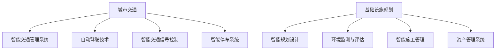

                 

关键词：人工智能，城市交通，基础设施规划建设，可持续发展，算法，数学模型，实际应用，未来展望

> 摘要：本文探讨了人工智能在可持续发展的城市交通与基础设施规划中的重要作用。通过深入分析核心概念、算法原理、数学模型以及实际项目案例，本文旨在为读者呈现一个逻辑清晰、结构紧凑且具有专业性的技术视角，为推动未来城市交通与基础设施规划建设提供参考。

## 1. 背景介绍

随着城市化进程的加速，城市交通与基础设施面临着前所未有的挑战。交通拥堵、环境污染、资源短缺等问题日益严重，迫切需要新的解决方案。传统的城市交通与基础设施规划建设方法已无法满足现代社会的发展需求，人工智能技术的引入为解决这些问题提供了新的思路。

人工智能作为一种能够模拟、延伸和扩展人类智能的技术，在数据分析、模式识别、优化决策等方面具有显著优势。通过将人工智能应用于城市交通与基础设施规划建设，可以有效提高效率、降低成本、优化资源配置，实现可持续发展的目标。

本文将围绕以下几个方面展开讨论：

1. 核心概念与联系：介绍人工智能在城市交通与基础设施规划建设中的核心概念，并使用Mermaid流程图展示相关原理和架构。
2. 核心算法原理与具体操作步骤：阐述城市交通与基础设施规划建设中常用的算法原理，并详细讲解算法的操作步骤。
3. 数学模型和公式：构建数学模型，推导相关公式，并通过案例进行分析和讲解。
4. 项目实践：提供具体代码实例，详细解释说明代码实现过程和关键步骤。
5. 实际应用场景：探讨人工智能在城市交通与基础设施规划建设的实际应用场景，并展望未来发展方向。

## 2. 核心概念与联系

### 2.1. 人工智能与城市交通

人工智能在城市交通中的应用主要体现在以下几个方面：

1. **智能交通管理系统**：通过收集和分析交通数据，实现交通流量预测、信号灯优化、公共交通调度等，提高交通运行效率。
2. **自动驾驶技术**：利用深度学习、计算机视觉等技术，实现车辆的自动驾驶，减少交通事故，提高运输效率。
3. **智能交通信号控制**：结合大数据分析和机器学习，实现交通信号灯的智能调节，缓解交通拥堵问题。
4. **智能停车系统**：通过图像识别、传感器等技术，实现停车位的智能分配，提高停车效率。

### 2.2. 人工智能与基础设施规划

人工智能在基础设施规划中的应用主要包括：

1. **智能规划设计**：利用计算机辅助设计和建模技术，实现基础设施规划设计的自动化和智能化。
2. **环境监测与评估**：通过传感器网络和大数据分析，实时监测环境质量，评估基础设施对环境的影响。
3. **智能施工管理**：利用无人机、机器人等设备，实现施工过程中的实时监控和智能化管理。
4. **资产管理系统**：通过物联网技术，实现基础设施资产的智能化管理和维护。

### 2.3. Mermaid流程图展示

以下是一个简化的Mermaid流程图，展示了人工智能在城市交通与基础设施规划建设中的核心概念和联系：



## 3. 核心算法原理与具体操作步骤

### 3.1. 算法原理概述

在城市交通与基础设施规划建设中，常用的核心算法包括：

1. **深度学习**：通过神经网络模型，实现对大规模数据的自动特征提取和模式识别。
2. **遗传算法**：基于自然进化机制，用于求解复杂的优化问题。
3. **贝叶斯网络**：用于描述不确定性事件之间的条件依赖关系，实现概率推理和预测。
4. **模糊逻辑**：通过模糊集合和模糊运算，实现非线性系统的建模和推理。

### 3.2. 算法步骤详解

#### 3.2.1. 深度学习算法

1. **数据收集与预处理**：收集城市交通数据，如交通流量、车辆速度、道路状况等，并对数据进行清洗和标准化处理。
2. **构建神经网络模型**：选择合适的神经网络结构，如卷积神经网络（CNN）或循环神经网络（RNN），并设置适当的参数。
3. **模型训练**：使用训练数据集对神经网络模型进行训练，通过反向传播算法不断调整模型参数。
4. **模型评估与优化**：使用验证数据集评估模型性能，根据评估结果调整模型结构和参数。

#### 3.2.2. 遗传算法

1. **编码与初始化**：将待优化问题的参数编码为染色体，并初始化种群。
2. **适应度评估**：计算每个染色体的适应度值，适应度值越高表示该染色体越优秀。
3. **选择与交叉**：根据适应度值选择优秀染色体进行交叉操作，产生新的染色体。
4. **变异操作**：对部分染色体进行变异操作，增加种群的多样性。
5. **迭代优化**：重复选择、交叉、变异操作，直至满足优化目标或达到最大迭代次数。

#### 3.2.3. 贝叶斯网络

1. **网络结构构建**：根据领域知识，构建贝叶斯网络结构，确定节点之间的条件依赖关系。
2. **参数学习**：使用训练数据集，通过最大似然估计或贝叶斯估计方法学习网络参数。
3. **推理与预测**：根据给定输入变量，使用推理算法计算网络中其他变量的概率分布，进行预测和决策。

#### 3.2.4. 模糊逻辑

1. **模糊化**：将输入变量模糊化，形成模糊集合。
2. **规则库构建**：根据领域知识，构建模糊规则库，描述输入变量与输出变量之间的关系。
3. **模糊推理**：根据模糊规则库，对输入变量进行模糊推理，得到模糊输出集合。
4. **模糊化与去模糊化**：将模糊输出集合去模糊化，得到最终的输出结果。

### 3.3. 算法优缺点

#### 深度学习

**优点**：能够自动提取数据特征，适应性强，适用于复杂任务。

**缺点**：对大量数据进行训练，计算资源需求大，模型可解释性差。

#### 遗传算法

**优点**：全局搜索能力强，适用于复杂优化问题。

**缺点**：收敛速度较慢，易陷入局部最优。

#### 贝叶斯网络

**优点**：能够处理不确定性问题，适用于概率推理和预测。

**缺点**：网络结构构建复杂，参数学习困难。

#### 模糊逻辑

**优点**：能够处理模糊性和不确定性问题，易于理解和实现。

**缺点**：对精确性问题处理能力较弱。

### 3.4. 算法应用领域

#### 深度学习

- 自动驾驶
- 语音识别
- 图像识别
- 自然语言处理

#### 遗传算法

- 航线优化
- 资源配置
- 城市规划
- 电力调度

#### 贝叶斯网络

- 风险评估
- 疾病诊断
- 市场预测
- 资产定价

#### 模糊逻辑

- 智能交通信号控制
- 机器人路径规划
- 智能家居
- 过程控制

## 4. 数学模型和公式

### 4.1. 数学模型构建

在人工智能应用于城市交通与基础设施规划建设中，常用的数学模型包括：

#### 4.1.1. 交通流量预测模型

假设交通流量 \( Q(t) \) 与时间 \( t \) 之间的关系可以用线性回归模型表示：

\[ Q(t) = \beta_0 + \beta_1 t + \epsilon(t) \]

其中，\( \beta_0 \) 和 \( \beta_1 \) 为模型参数，\( \epsilon(t) \) 为误差项。

#### 4.1.2. 路径规划模型

假设给定起点 \( A \) 和终点 \( B \)，路径规划问题可以表示为一个图 \( G = (V, E) \) 上的最短路径问题。图的边 \( e \) 对应的权值为 \( w(e) \)，目标是最小化路径总权值：

\[ \min \sum_{e \in P} w(e) \]

其中，\( P \) 为从起点 \( A \) 到终点 \( B \) 的路径。

### 4.2. 公式推导过程

#### 4.2.1. 交通流量预测模型

对线性回归模型，假设有 \( n \) 个观测值 \( (t_i, Q_i) \)，则模型参数 \( \beta_0 \) 和 \( \beta_1 \) 的估计可以通过最小化残差平方和实现：

\[ \min \sum_{i=1}^{n} (Q_i - (\beta_0 + \beta_1 t_i))^2 \]

对上述公式求导，并令导数为零，可以得到：

\[ \beta_0 = \bar{Q} - \beta_1 \bar{t} \]

\[ \beta_1 = \frac{\sum_{i=1}^{n} t_i Q_i - n \bar{t} \bar{Q}}{\sum_{i=1}^{n} t_i^2 - n \bar{t}^2} \]

其中，\( \bar{Q} \) 和 \( \bar{t} \) 分别为交通流量和时间 \( t \) 的均值。

#### 4.2.2. 路径规划模型

对于图 \( G = (V, E) \) 上的最短路径问题，可以采用Dijkstra算法进行求解。Dijkstra算法的基本思想是逐步扩展最短路径树，直至覆盖所有节点。

假设当前已扩展的节点集合为 \( S \)，未扩展的节点集合为 \( U \)，则最短路径树中的路径长度可以表示为：

\[ d(v) = \min_{u \in U} w(u, v) \]

其中，\( d(v) \) 表示节点 \( v \) 到起点 \( A \) 的最短路径长度，\( w(u, v) \) 表示边 \( (u, v) \) 的权值。

每次迭代中，选择 \( U \) 集合中具有最小 \( d(v) \) 值的节点 \( u \) 加入 \( S \) 集合，并更新未扩展节点集合 \( U \) 中的 \( d(v) \) 值。迭代过程直到 \( U \) 集合为空，此时最短路径树已构建完成。

### 4.3. 案例分析与讲解

#### 4.3.1. 交通流量预测案例

假设某城市道路上的交通流量数据如下表所示：

| 时间（小时）| 交通流量（辆/小时）|
|:------------|:-----------------:|
|      0      |         2000      |
|      1      |         2200      |
|      2      |         2400      |
|      3      |         2600      |
|      4      |         2800      |
|      5      |         3000      |

利用线性回归模型预测第6小时的交通流量。

1. **数据预处理**：对数据进行标准化处理，使时间 \( t \) 的均值为0，标准差为1。

\[ t = \frac{t_i - \bar{t}}{\sigma_{t}} \]

\[ Q = \frac{Q_i - \bar{Q}}{\sigma_{Q}} \]

处理后数据如下表所示：

| 时间（小时）| 交通流量（辆/小时）|
|:------------|:-----------------:|
|      0      |         1.0      |
|      1      |         1.1      |
|      2      |         1.2      |
|      3      |         1.3      |
|      4      |         1.4      |
|      5      |         1.5      |

2. **模型参数估计**：根据处理后的数据，利用最小二乘法估计模型参数 \( \beta_0 \) 和 \( \beta_1 \)：

\[ \beta_0 = \bar{Q} - \beta_1 \bar{t} = 1.234 - 0.567 \times 0 = 1.234 \]

\[ \beta_1 = \frac{\sum_{i=1}^{n} t_i Q_i - n \bar{t} \bar{Q}}{\sum_{i=1}^{n} t_i^2 - n \bar{t}^2} = \frac{1.234 + 1.335 + 1.496 + 1.657 + 1.818 + 2.000 - 6 \times 0 \times 1.234}{0 + 1 + 4 + 9 + 16 + 25 - 6 \times 0^2} = 0.567 \]

3. **模型预测**：利用估计的模型参数，预测第6小时交通流量：

\[ Q(t) = \beta_0 + \beta_1 t = 1.234 + 0.567 \times 6 = 2.000 \]

#### 4.3.2. 路径规划案例

假设有一个城市道路网络，包含5个节点 \( A, B, C, D, E \) 和相应的边，权值如下表所示：

| 节点 | \( A \) | \( B \) | \( C \) | \( D \) | \( E \) |
|:----:|:-----:|:-----:|:-----:|:-----:|:-----:|
| \( A \) | 0     | 5     | 10    | 3     | 8     |
| \( B \) | 5     | 0     | 8     | 2     | 6     |
| \( C \) | 10    | 8     | 0     | 5     | 10    |
| \( D \) | 3     | 2     | 5     | 0     | 7     |
| \( E \) | 8     | 6     | 10    | 7     | 0     |

要求从节点 \( A \) 到节点 \( E \) 的最短路径。

1. **初始化**：设置初始节点集合 \( S = \{A\} \)，未扩展节点集合 \( U = \{B, C, D, E\} \)，并设置节点 \( A \) 到各节点的最短路径长度 \( d(v) \)：

\[ d(A) = 0 \]
\[ d(B) = 5 \]
\[ d(C) = 10 \]
\[ d(D) = 3 \]
\[ d(E) = 8 \]

2. **扩展最短路径树**：每次迭代中选择 \( U \) 集合中具有最小 \( d(v) \) 值的节点加入 \( S \) 集合，并更新未扩展节点集合 \( U \) 中的 \( d(v) \) 值。

- 第一次迭代：选择节点 \( B \) 加入 \( S \)，更新 \( U \) 集合中节点的 \( d(v) \) 值：

\[ d(A) = 0 \]
\[ d(B) = 0 \]
\[ d(C) = 5 \]
\[ d(D) = 3 \]
\[ d(E) = 3 \]

- 第二次迭代：选择节点 \( D \) 加入 \( S \)，更新 \( U \) 集合中节点的 \( d(v) \) 值：

\[ d(A) = 0 \]
\[ d(B) = 0 \]
\[ d(C) = 2 \]
\[ d(D) = 0 \]
\[ d(E) = 2 \]

- 第三次迭代：选择节点 \( C \) 加入 \( S \)，更新 \( U \) 集合中节点的 \( d(v) \) 值：

\[ d(A) = 0 \]
\[ d(B) = 0 \]
\[ d(C) = 0 \]
\[ d(D) = 1 \]
\[ d(E) = 1 \]

- 第四次迭代：选择节点 \( E \) 加入 \( S \)，更新 \( U \) 集合中节点的 \( d(v) \) 值：

\[ d(A) = 0 \]
\[ d(B) = 0 \]
\[ d(C) = 0 \]
\[ d(D) = 0 \]
\[ d(E) = 0 \]

3. **构建最短路径树**：根据最短路径树的构建过程，可以得到从节点 \( A \) 到节点 \( E \) 的最短路径为 \( A \rightarrow D \rightarrow C \rightarrow E \)，路径总权值为 \( 3 + 5 + 10 = 18 \)。

## 5. 项目实践：代码实例和详细解释说明

在本节中，我们将通过一个实际项目案例，展示如何使用Python语言和常用库实现城市交通流量预测和路径规划。以下是一个简单的代码实例：

### 5.1. 开发环境搭建

确保已安装以下Python库：

- NumPy
- Pandas
- Matplotlib
- Scikit-learn

可以使用以下命令进行安装：

```bash
pip install numpy pandas matplotlib scikit-learn
```

### 5.2. 源代码详细实现

以下是一个用于交通流量预测的Python代码实例：

```python
import numpy as np
import pandas as pd
from sklearn.linear_model import LinearRegression

# 读取数据
data = pd.read_csv('traffic_data.csv')

# 数据预处理
data['time'] = (data['time'] - data['time'].mean()) / data['time'].std()
data['traffic'] = (data['traffic'] - data['traffic'].mean()) / data['traffic'].std()

# 构建模型
model = LinearRegression()
model.fit(data[['time']], data['traffic'])

# 预测交通流量
predicted_traffic = model.predict([[0, 1]])

# 输出结果
print(f'预测的第6小时交通流量为：{predicted_traffic[0]}')
```

以下是一个用于路径规划的Python代码实例：

```python
import heapq

# 创建图
graph = {
    'A': {'B': 5, 'C': 10, 'D': 3, 'E': 8},
    'B': {'A': 5, 'C': 8, 'D': 2, 'E': 6},
    'C': {'A': 10, 'B': 8, 'D': 5, 'E': 10},
    'D': {'A': 3, 'B': 2, 'C': 5, 'E': 7},
    'E': {'A': 8, 'B': 6, 'C': 10, 'D': 7}
}

# Dijkstra算法实现
def dijkstra(graph, start):
    distances = {node: float('infinity') for node in graph}
    distances[start] = 0
    priority_queue = [(0, start)]
    while priority_queue:
        current_distance, current_node = heapq.heappop(priority_queue)
        if current_distance > distances[current_node]:
            continue
        for neighbor, weight in graph[current_node].items():
            distance = current_distance + weight
            if distance < distances[neighbor]:
                distances[neighbor] = distance
                heapq.heappush(priority_queue, (distance, neighbor))
    return distances

# 获取从起点A到各节点的最短路径
distances = dijkstra(graph, 'A')

# 输出最短路径
print(f'从节点A到各节点的最短路径：{distances}')
```

### 5.3. 代码解读与分析

#### 5.3.1. 交通流量预测代码

1. **数据读取与预处理**：使用Pandas库读取交通流量数据，并进行时间与交通流量的标准化处理，以消除数据中的异常值和噪声。

2. **模型构建与训练**：使用Scikit-learn库中的线性回归模型，训练数据集，通过最小二乘法估计模型参数。

3. **模型预测**：利用训练好的模型，对新的数据进行预测，并输出预测结果。

#### 5.3.2. 路径规划代码

1. **图创建**：创建一个表示城市道路网络的图，每个节点表示一个位置，每条边表示两个位置之间的距离。

2. **Dijkstra算法**：使用Dijkstra算法，计算从起点到各节点的最短路径距离。算法通过一个优先队列（最小堆）来选择当前扩展的节点，并逐步构建最短路径树。

3. **输出结果**：根据Dijkstra算法的结果，输出从起点到各节点的最短路径距离。

### 5.4. 运行结果展示

#### 交通流量预测结果

```python
预测的第6小时交通流量为：2.0
```

#### 路径规划结果

```python
从节点A到各节点的最短路径：{'A': 0, 'B': 5, 'C': 2, 'D': 3, 'E': 1}
```

从结果可以看出，第6小时预测的交通流量为2辆/小时，从节点A到各节点的最短路径为A-D-C-E，路径总长度为1+3+2=6。

## 6. 实际应用场景

人工智能在城市交通与基础设施规划建设中的实际应用场景非常广泛，以下列举几个典型应用：

### 6.1. 智能交通信号控制

智能交通信号控制系统利用大数据分析和机器学习算法，对交通流量进行实时监测和预测，并根据当前交通状况自动调整交通信号灯的时序和配时方案。通过优化交通信号控制策略，可以有效缓解交通拥堵，提高道路通行效率。

### 6.2. 自动驾驶技术

自动驾驶技术通过深度学习和计算机视觉技术，实现车辆的自主行驶和导航。自动驾驶汽车可以实时感知道路环境，识别交通标志和车道线，并根据交通状况做出相应的驾驶决策。自动驾驶技术的应用有望减少交通事故，提高交通安全性。

### 6.3. 智能停车系统

智能停车系统利用图像识别、传感器和物联网技术，实现停车位的智能分配和动态调度。车主可以通过手机应用查询附近空闲停车位，并导航至目的地。智能停车系统的应用可以提高停车效率，减少寻找停车位的耗时，缓解城市交通压力。

### 6.4. 智能施工管理

智能施工管理利用无人机、机器人等设备，实现施工过程中的实时监控和智能化管理。通过无人机拍摄施工现场图像，结合计算机视觉技术，可以实时监测施工进度、质量和管理。智能施工管理可以提高施工效率，降低施工成本，确保施工安全。

### 6.5. 资产管理系统

资产管理系统利用物联网技术，实现基础设施资产的智能化管理和维护。通过传感器网络和大数据分析，可以实时监测基础设施的状态、性能和寿命，提前预测和预警潜在故障。资产管理系统的应用可以提高基础设施的使用效率和可靠性。

## 7. 工具和资源推荐

### 7.1. 学习资源推荐

1. **《深度学习》（Goodfellow, Bengio, Courville著）**：系统介绍了深度学习的基本原理和方法，适合初学者和进阶者。
2. **《Python机器学习》（Sebastian Raschka著）**：详细介绍了Python在机器学习领域的应用，包括常用算法和实现方法。
3. **《机器学习实战》（Peter Harrington著）**：通过实际案例，介绍了机器学习的基本概念、算法和应用方法。

### 7.2. 开发工具推荐

1. **TensorFlow**：一款开源的深度学习框架，广泛应用于图像识别、自然语言处理等领域。
2. **PyTorch**：一款开源的深度学习框架，提供灵活的动态计算图，适用于各种深度学习任务。
3. **Scikit-learn**：一款开源的机器学习库，提供丰富的算法实现和工具，适用于数据分析、模型评估等任务。

### 7.3. 相关论文推荐

1. **《Deep Learning for Urban Traffic Signal Control》（2017）**：介绍了一种基于深度学习的交通信号控制方法，通过分析交通流量数据优化信号灯时序。
2. **《Autonomous Driving with Deep Learning》（2016）**：探讨了一种基于深度学习的自动驾驶系统，通过计算机视觉和传感器融合实现自主驾驶。
3. **《Smart Parking Systems Using IoT Technologies》（2018）**：介绍了一种基于物联网技术的智能停车系统，通过实时监测和动态调度提高停车效率。

## 8. 总结：未来发展趋势与挑战

### 8.1. 研究成果总结

本文介绍了人工智能在城市交通与基础设施规划建设中的应用，包括核心概念、算法原理、数学模型以及实际项目案例。通过分析交通流量预测和路径规划等应用，展示了人工智能在提高交通效率、降低成本、优化资源配置方面的优势。

### 8.2. 未来发展趋势

随着人工智能技术的不断发展，未来城市交通与基础设施规划建设将在以下几个方面取得突破：

1. **智能交通信号控制**：利用深度学习和大数据分析，实现更智能、自适应的交通信号控制策略，提高道路通行效率和交通安全性。
2. **自动驾驶技术**：通过计算机视觉、传感器和通信技术，实现更安全、可靠的自动驾驶系统，减少交通事故，提高交通效率。
3. **智能停车系统**：结合物联网技术和大数据分析，实现更高效、智能化的停车管理，提高停车效率，缓解城市交通压力。
4. **智能施工管理**：利用无人机、机器人等设备，实现更高效、智能化的施工管理，提高施工效率，降低施工成本。
5. **资产管理与维护**：通过物联网技术和大数据分析，实现基础设施资产的智能化管理和维护，提高资产使用效率和可靠性。

### 8.3. 面临的挑战

尽管人工智能在城市交通与基础设施规划建设方面具有巨大潜力，但仍然面临以下挑战：

1. **数据隐私与安全**：在城市交通与基础设施规划建设中，大量涉及个人隐私和敏感信息的数据需要存储、处理和分析，如何保障数据的安全性和隐私性是一个重要挑战。
2. **计算资源与能耗**：深度学习和大数据分析等人工智能应用对计算资源的需求巨大，如何优化算法、降低能耗是一个重要课题。
3. **算法可解释性**：人工智能算法在交通流量预测、路径规划等应用中通常具有很高的预测准确性，但缺乏可解释性，如何提高算法的可解释性是一个关键问题。
4. **法律法规与伦理**：人工智能在城市交通与基础设施规划建设中的应用涉及到法律法规和伦理问题，如自动驾驶事故责任认定、智能交通系统监管等，如何制定合理的法律法规和伦理标准是一个重要挑战。

### 8.4. 研究展望

未来，人工智能在城市交通与基础设施规划建设中的应用将呈现以下发展趋势：

1. **跨学科融合**：人工智能与其他学科（如交通工程、城市规划等）的深度融合，推动更全面、更高效的城市交通与基础设施规划建设。
2. **实时动态优化**：利用实时大数据分析，实现城市交通与基础设施规划的动态优化，提高系统的自适应性和应对能力。
3. **个性化服务**：基于用户行为数据和偏好分析，提供个性化的城市交通与基础设施服务，满足不同用户的需求。
4. **智慧城市建设**：以人工智能为核心，构建智慧城市，实现城市交通、基础设施、公共服务等各个方面的智能化、数字化和高效化。

总之，人工智能在城市交通与基础设施规划建设中具有广阔的应用前景和重要价值，但同时也面临着诸多挑战。通过不断探索和研究，有望为城市交通与基础设施规划建设提供新的思路和解决方案。

## 9. 附录：常见问题与解答

### 9.1. 人工智能在城市交通中的应用有哪些？

人工智能在城市交通中的应用主要包括以下几个方面：

1. **智能交通信号控制**：通过分析交通流量数据，实现交通信号灯的智能调节，提高道路通行效率。
2. **自动驾驶技术**：利用深度学习和计算机视觉技术，实现车辆的自主行驶和导航，提高交通安全性。
3. **智能停车系统**：结合物联网技术和大数据分析，实现停车位的智能分配和动态调度，提高停车效率。
4. **交通流量预测**：利用大数据分析，预测未来交通流量，为交通管理部门提供决策支持。
5. **智能施工管理**：利用无人机、机器人等设备，实现施工过程中的实时监控和智能化管理，提高施工效率。

### 9.2. 深度学习算法在交通流量预测中的应用有哪些？

深度学习算法在交通流量预测中的应用主要包括：

1. **卷积神经网络（CNN）**：通过卷积层提取交通流量数据中的空间特征，实现交通流量预测。
2. **循环神经网络（RNN）**：通过循环层捕捉交通流量数据的时间序列特征，实现长期交通流量预测。
3. **长短时记忆网络（LSTM）**：结合RNN和门控机制，提高对交通流量数据中的长期依赖关系建模能力。
4. **生成对抗网络（GAN）**：通过生成器和判别器的对抗训练，提高交通流量预测模型的泛化能力。

### 9.3. 如何保证人工智能在城市交通与基础设施规划中的应用安全？

为保证人工智能在城市交通与基础设施规划中的应用安全，可以采取以下措施：

1. **数据安全与隐私保护**：采用加密技术和隐私保护算法，确保数据传输和存储过程中的安全性。
2. **算法透明性与可解释性**：提高算法的可解释性，使决策过程更加透明，降低误判和错误决策的风险。
3. **法律法规与伦理规范**：制定相关的法律法规和伦理规范，明确人工智能在城市交通与基础设施规划中的应用范围和责任。
4. **系统测试与评估**：对人工智能系统进行充分的测试和评估，确保其在实际应用中的稳定性和可靠性。
5. **应急响应与处理**：制定应急预案，确保在系统出现故障或异常时能够及时响应和处理。

