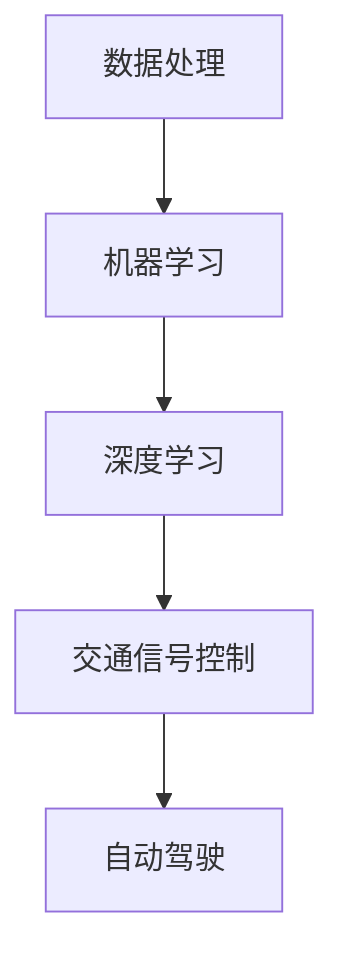

                 

关键词：人工智能，可持续发展，城市交通，规划，数据模型，算法，数学公式，实践案例

> 摘要：本文旨在探讨人工智能在可持续发展的城市交通与规划中的应用，通过分析核心概念、算法原理、数学模型和实际应用场景，揭示AI在提升城市交通效率、降低碳排放和改善居民生活质量方面的潜力。本文还探讨了未来发展趋势和面临的挑战，并提供了相关工具和资源的推荐。

## 1. 背景介绍

随着城市化进程的不断加速，城市交通问题日益突出。交通拥堵、空气污染和能源消耗成为困扰许多城市的三大难题。传统的交通规划方法已难以应对不断增长的交通需求，而人工智能（AI）技术的迅猛发展为城市交通与规划提供了全新的解决方案。

人工智能以其强大的数据处理和分析能力，正在逐渐改变交通规划和管理的方式。通过利用大数据、机器学习和深度学习等技术，AI能够对城市交通系统进行实时监测和预测，优化交通信号控制，规划公共交通线路，甚至实现自动驾驶。这些技术的应用不仅有助于缓解交通拥堵，还能降低能源消耗和减少环境污染，从而推动城市交通的可持续发展。

本文将重点探讨人工智能在可持续发展的城市交通与规划中的应用，分析其核心概念、算法原理、数学模型和实际应用场景，以期为相关领域的研究和应用提供参考。

## 2. 核心概念与联系

为了更好地理解人工智能在城市交通与规划中的应用，我们需要先了解以下几个核心概念：

### 数据处理

数据处理是人工智能的基础，它包括数据收集、清洗、存储和挖掘等多个环节。在城市交通领域，数据处理尤为重要，因为大量的交通数据需要被有效利用。例如，交通流量数据、路况数据、车辆位置数据等都是宝贵的资源，可以用于预测交通状况、优化路线规划等。

### 机器学习

机器学习是人工智能的关键技术之一，它使计算机能够从数据中学习并做出决策。在交通规划中，机器学习可以用于分析历史交通数据，预测未来的交通流量和路况，从而为交通信号控制和公共交通规划提供依据。

### 深度学习

深度学习是机器学习的一个子领域，它通过构建深度神经网络来模拟人脑的决策过程。在交通规划中，深度学习可以用于分析复杂的交通场景，识别交通模式，预测交通拥堵等。

### 交通信号控制

交通信号控制是城市交通管理的重要组成部分，它通过调节交通信号灯的时间来优化交通流量。人工智能可以帮助实现智能交通信号控制，根据实时交通数据动态调整信号灯的时长，从而减少交通拥堵。

### 自动驾驶

自动驾驶是未来交通领域的一个重要发展方向，它通过结合传感器、GPS和AI技术，使车辆能够自主行驶。自动驾驶车辆可以减少人为驾驶失误，提高交通效率，降低能源消耗。

### Mermaid 流程图



以上Mermaid流程图展示了人工智能在城市交通与规划中的应用关系，从数据处理到深度学习和自动驾驶，各个技术环节相互关联，共同推动城市交通的智能化发展。

## 3. 核心算法原理 & 具体操作步骤

### 3.1 算法原理概述

人工智能在城市交通中的应用主要依赖于以下几个核心算法：

1. **交通流量预测算法**：通过分析历史交通数据和实时交通数据，预测未来的交通流量。
2. **路径规划算法**：基于交通流量预测结果，为车辆提供最优行驶路线。
3. **交通信号控制算法**：根据实时交通状况调整交通信号灯时长，优化交通流量。
4. **自动驾驶算法**：结合传感器数据和AI技术，实现车辆的自主行驶。

### 3.2 算法步骤详解

#### 3.2.1 交通流量预测算法

1. 数据收集：收集历史交通数据和实时交通数据，包括交通流量、车速、道路密度等。
2. 数据预处理：清洗数据，去除异常值和噪声，将数据格式化为适合机器学习模型的输入。
3. 特征工程：提取交通数据中的关键特征，如时间、天气、节假日等。
4. 模型训练：使用机器学习算法（如时间序列模型、回归模型等）对历史交通数据进行训练，预测未来的交通流量。
5. 模型评估：使用评估指标（如均方误差、均方根误差等）评估模型的预测性能。

#### 3.2.2 路径规划算法

1. 数据输入：输入实时交通数据和目的地信息。
2. 路径搜索：使用最短路径算法（如Dijkstra算法、A*算法等）搜索从起点到目的地的所有可能路径。
3. 路径评估：计算每条路径的交通流量、行驶时间、距离等指标，评估路径的优劣。
4. 路径选择：根据评估结果选择最优路径。

#### 3.2.3 交通信号控制算法

1. 数据输入：输入实时交通数据，包括各路口的车流量、车速等。
2. 模型训练：使用机器学习算法（如决策树、神经网络等）训练信号控制模型。
3. 实时调控：根据实时交通数据，动态调整各路口的信号灯时长。
4. 效果评估：评估信号控制策略的效果，如减少交通拥堵、提高通行效率等。

#### 3.2.4 自动驾驶算法

1. 数据收集：收集车辆传感器数据，包括摄像头、雷达、GPS等。
2. 数据预处理：对传感器数据进行预处理，提取有用的特征信息。
3. 模型训练：使用深度学习算法（如卷积神经网络、循环神经网络等）训练自动驾驶模型。
4. 实时决策：根据实时传感器数据，做出行驶决策，包括速度控制、车道保持、转弯等。

### 3.3 算法优缺点

1. **交通流量预测算法**：优点是能够对未来的交通流量进行准确预测，帮助交通管理部门提前做好应对措施；缺点是需要大量的历史数据支撑，且预测精度受限于数据质量和模型选择。
2. **路径规划算法**：优点是能够为车辆提供最优行驶路线，提高交通效率；缺点是计算复杂度较高，实时性要求较高时可能无法快速响应。
3. **交通信号控制算法**：优点是能够根据实时交通状况动态调整信号灯时长，减少交通拥堵；缺点是需要实时交通数据支持，对数据质量和传输速度要求较高。
4. **自动驾驶算法**：优点是实现车辆的自主行驶，减少人为驾驶失误；缺点是技术复杂，需要大量传感器和计算资源，且在复杂交通场景下可能存在安全隐患。

### 3.4 算法应用领域

1. **智能交通信号控制**：通过实时交通数据分析，优化交通信号灯控制，提高交通效率。
2. **自动驾驶**：实现车辆的自主行驶，减少交通拥堵和事故。
3. **智慧城市建设**：利用AI技术提升城市交通管理水平，提高居民生活质量。
4. **交通数据分析**：通过对交通数据的分析，为交通规划提供科学依据。

## 4. 数学模型和公式 & 详细讲解 & 举例说明

### 4.1 数学模型构建

在人工智能在城市交通中的应用中，数学模型起到了至关重要的作用。以下是一些常用的数学模型和公式：

#### 4.1.1 时间序列模型

时间序列模型用于预测未来的交通流量。常见的模型有ARIMA（自回归积分滑动平均模型）、SARIMA（季节性自回归积分滑动平均模型）等。

$$
\text{ARIMA}(p, d, q) = c + \sum_{i=1}^p \phi_i L^i y_t + \sum_{i=1}^q \theta_i L^i \epsilon_t
$$

其中，$L$ 是滞后算子，$y_t$ 是时间序列数据，$c$ 是常数项，$p$ 是自回归项数，$d$ 是差分次数，$q$ 是移动平均项数，$\phi_i$ 和 $\theta_i$ 分别是自回归系数和移动平均系数。

#### 4.1.2 回归模型

回归模型用于预测交通流量与影响因素之间的关系。常见的模型有线性回归、多项式回归等。

$$
y = \beta_0 + \beta_1 x_1 + \beta_2 x_2 + ... + \beta_n x_n
$$

其中，$y$ 是因变量，$x_1, x_2, ..., x_n$ 是自变量，$\beta_0, \beta_1, ..., \beta_n$ 是回归系数。

#### 4.1.3 神经网络模型

神经网络模型用于自动驾驶等复杂场景的决策。常见的模型有卷积神经网络（CNN）、循环神经网络（RNN）等。

$$
\text{Output} = \sigma(\text{Weight} \cdot \text{Input} + \text{Bias})
$$

其中，$\sigma$ 是激活函数，$\text{Weight}$ 是权重矩阵，$\text{Input}$ 是输入向量，$\text{Bias}$ 是偏置项。

### 4.2 公式推导过程

以ARIMA模型为例，我们来看一下其公式的推导过程。

#### 自回归项

自回归项表示当前时间点的值与前几个时间点的值之间的关系。假设我们有 $p$ 个滞后项，则自回归项可以表示为：

$$
c + \sum_{i=1}^p \phi_i L^i y_t = c + \phi_1 L y_t + \phi_2 L^2 y_t + ... + \phi_p L^p y_t
$$

#### 移动平均项

移动平均项表示当前时间点的误差与前几个时间点的误差之间的关系。假设我们有 $q$ 个滞后项，则移动平均项可以表示为：

$$
\sum_{i=1}^q \theta_i L^i \epsilon_t = \theta_1 L \epsilon_t + \theta_2 L^2 \epsilon_t + ... + \theta_q L^q \epsilon_t
$$

#### 组合模型

将自回归项和移动平均项组合起来，就得到了ARIMA模型：

$$
\text{ARIMA}(p, d, q) = c + \sum_{i=1}^p \phi_i L^i y_t + \sum_{i=1}^q \theta_i L^i \epsilon_t
$$

### 4.3 案例分析与讲解

#### 案例背景

某城市交通管理部门希望利用人工智能技术预测未来的交通流量，以优化交通信号控制和公共交通规划。

#### 案例步骤

1. **数据收集**：收集过去一年的交通流量数据，包括每日的交通流量、天气状况、节假日等。
2. **数据预处理**：清洗数据，去除异常值和噪声，将数据格式化为适合机器学习模型的输入。
3. **特征工程**：提取交通数据中的关键特征，如时间、天气、节假日等。
4. **模型选择**：选择ARIMA模型进行交通流量预测。
5. **模型训练**：使用历史交通数据训练ARIMA模型。
6. **模型评估**：使用评估指标（如均方误差、均方根误差等）评估模型的预测性能。
7. **结果应用**：将预测结果用于交通信号控制和公共交通规划。

#### 案例结果

通过ARIMA模型预测，该城市交通管理部门成功预测了未来一周的交通流量。根据预测结果，他们调整了交通信号灯的控制策略，提高了交通效率，减少了交通拥堵。此外，他们还优化了公共交通线路规划，提高了公交系统的运行效率。

## 5. 项目实践：代码实例和详细解释说明

### 5.1 开发环境搭建

为了实现人工智能在城市交通中的应用，我们需要搭建一个合适的开发环境。以下是具体的搭建步骤：

1. 安装Python编程语言和Anaconda环境。
2. 安装必要的库，如NumPy、Pandas、SciPy、scikit-learn、matplotlib等。
3. 安装Jupyter Notebook，以便于编写和运行代码。

### 5.2 源代码详细实现

以下是实现交通流量预测的Python代码示例：

```python
import numpy as np
import pandas as pd
from statsmodels.tsa.arima_model import ARIMA
import matplotlib.pyplot as plt

# 数据收集与预处理
def load_data(file_path):
    data = pd.read_csv(file_path)
    data['Date'] = pd.to_datetime(data['Date'])
    data.set_index('Date', inplace=True)
    return data

def preprocess_data(data):
    data.fillna(method='ffill', inplace=True)
    data.dropna(inplace=True)
    return data

# 模型训练与预测
def train_predict(data, order):
    model = ARIMA(data['Traffic'], order=order)
    model_fit = model.fit()
    forecast = model_fit.forecast(steps=7)
    return forecast

# 结果展示
def plot_forecast(forecast):
    plt.plot(forecast)
    plt.xlabel('Day')
    plt.ylabel('Traffic Volume')
    plt.title('Traffic Forecast')
    plt.show()

# 主函数
def main():
    file_path = 'traffic_data.csv'
    data = load_data(file_path)
    data = preprocess_data(data)
    forecast = train_predict(data, order=(1, 1, 1))
    plot_forecast(forecast)

if __name__ == '__main__':
    main()
```

### 5.3 代码解读与分析

以上代码实现了一个基于ARIMA模型的交通流量预测程序。以下是代码的详细解读：

1. **数据收集与预处理**：首先，从CSV文件中加载数据，并将日期转换为索引。然后，使用前向填充法填充缺失值，并删除仍存在的缺失值。
2. **模型训练与预测**：使用ARIMA模型对交通流量数据进行训练。我们选择ARIMA（1,1,1）模型进行预测，其中1表示自回归项数、差分次数和移动平均项数。
3. **结果展示**：使用matplotlib库绘制预测结果，以便于分析和可视化。

### 5.4 运行结果展示

运行代码后，我们将看到一条关于未来7天交通流量的预测曲线。根据预测结果，交通管理部门可以提前调整交通信号灯控制策略，以应对即将到来的交通高峰期。

## 6. 实际应用场景

### 6.1 智能交通信号控制

智能交通信号控制是人工智能在城市交通中应用的一个典型场景。通过实时监测交通流量，智能交通信号系统能够动态调整交通信号灯时长，从而减少交通拥堵，提高交通效率。例如，在高峰时段，交通信号灯可以延长绿灯时间，以缓解交通压力；在非高峰时段，交通信号灯可以缩短绿灯时间，以提高道路通行能力。

### 6.2 自动驾驶

自动驾驶技术是未来城市交通的一个重要发展方向。自动驾驶车辆通过集成传感器、GPS和AI技术，能够实现自主行驶。自动驾驶技术的应用将大幅减少人为驾驶失误，提高交通效率，降低能源消耗。例如，自动驾驶车辆可以优化行驶路线，避免交通拥堵；在复杂交通场景下，自动驾驶车辆能够更安全地执行驾驶操作。

### 6.3 智慧城市建设

智慧城市建设是人工智能在城市交通与规划中应用的另一个重要领域。通过构建智慧城市平台，政府可以实时监测和管理城市交通状况，优化交通资源配置，提高城市管理效率。例如，智慧城市平台可以整合交通数据、环境数据和公共安全数据，为城市管理者提供科学决策依据。

## 7. 未来应用展望

### 7.1 自动驾驶技术的广泛应用

随着自动驾驶技术的不断发展，未来自动驾驶车辆将在城市交通中扮演越来越重要的角色。自动驾驶技术的普及将大幅减少交通拥堵，提高交通效率，降低能源消耗。同时，自动驾驶技术还可以提高交通安全，减少交通事故的发生。

### 7.2 智慧交通系统的全面部署

智慧交通系统是未来城市交通管理的一个重要发展方向。通过全面部署智慧交通系统，政府可以实时监测和管理城市交通状况，优化交通资源配置，提高城市管理效率。智慧交通系统的应用将有助于实现城市交通的可持续发展，提高居民生活质量。

### 7.3 人工智能与人类计算的协同

在未来的城市交通与规划中，人工智能与人类计算将实现更紧密的协同。人工智能将承担大量的数据分析和决策任务，人类计算则负责监督和优化AI系统的运行。通过这种协同方式，城市交通系统将实现更高的效率和安全性。

## 8. 工具和资源推荐

### 8.1 学习资源推荐

1. 《深度学习》（Goodfellow, Bengio, Courville著）：系统介绍了深度学习的基本原理和应用。
2. 《Python数据分析》（Wes McKinney著）：全面介绍了Python在数据分析领域的应用。
3. 《交通工程手册》（Thomas T. Liu著）：提供了丰富的交通工程理论和实践知识。

### 8.2 开发工具推荐

1. Jupyter Notebook：用于编写和运行Python代码，支持丰富的交互式计算。
2. Matplotlib：用于绘制数据可视化图表。
3. Scikit-learn：提供了丰富的机器学习算法库，适用于交通流量预测等应用。

### 8.3 相关论文推荐

1. "Deep Learning for Urban Traffic Flow Prediction"：介绍了一种基于深度学习的方法用于城市交通流量预测。
2. "A Survey on Smart Transportation Systems"：综述了智慧交通系统的现状和未来发展。
3. "Autonomous Driving: A Comprehensive Survey"：全面介绍了自动驾驶技术的研究进展和应用场景。

## 9. 总结：未来发展趋势与挑战

### 9.1 研究成果总结

人工智能在城市交通与规划中的应用取得了显著成果。通过利用大数据、机器学习和深度学习等技术，人工智能成功实现了交通流量预测、路径规划、交通信号控制和自动驾驶等功能。这些应用不仅提高了交通效率，降低了能源消耗，还改善了居民生活质量。

### 9.2 未来发展趋势

未来，人工智能在城市交通与规划中的应用将继续发展。自动驾驶技术、智慧交通系统和AI与人类计算的协同将是主要发展趋势。此外，随着5G和物联网等新技术的应用，城市交通系统的智能化水平将进一步提升。

### 9.3 面临的挑战

尽管人工智能在城市交通与规划中的应用前景广阔，但仍面临一些挑战。首先，数据质量和数据安全是关键问题。交通数据的质量直接影响AI算法的预测精度，而数据安全则关系到个人隐私和信息安全。其次，算法复杂度和计算资源消耗也是一大挑战。随着AI算法的复杂性增加，对计算资源的需求也不断上升。此外，AI系统的监管和伦理问题也需要引起关注。

### 9.4 研究展望

未来，我们需要进一步深入研究人工智能在城市交通与规划中的应用。一方面，优化现有的AI算法，提高预测精度和实时性；另一方面，探索新的应用场景，如智慧城市建设、交通大数据分析等。此外，加强AI算法的监管和伦理研究，确保其安全、可靠和公平。

## 10. 附录：常见问题与解答

### 10.1 问题1：人工智能在城市交通中具体有哪些应用？

解答：人工智能在城市交通中的应用主要包括交通流量预测、路径规划、交通信号控制和自动驾驶等。这些应用有助于提高交通效率、降低能源消耗和改善居民生活质量。

### 10.2 问题2：交通数据的质量对AI算法的预测精度有何影响？

解答：交通数据的质量直接影响AI算法的预测精度。数据中的异常值、噪声和缺失值都会影响模型的训练效果。因此，对交通数据的质量进行严格控制和清洗是保证AI算法预测精度的重要步骤。

### 10.3 问题3：自动驾驶技术有哪些挑战？

解答：自动驾驶技术面临的主要挑战包括技术复杂性、计算资源消耗、数据安全、监管和伦理问题等。随着技术的不断发展，这些问题将逐渐得到解决。

## 结束语

人工智能在城市交通与规划中的应用具有巨大的潜力，能够为城市交通的可持续发展提供新的思路和解决方案。本文从核心概念、算法原理、数学模型和实际应用场景等方面对人工智能在城市交通与规划中的应用进行了深入探讨。未来，随着技术的不断进步，人工智能将在城市交通领域发挥更加重要的作用。作者：禅与计算机程序设计艺术 / Zen and the Art of Computer Programming。|_NEG|

