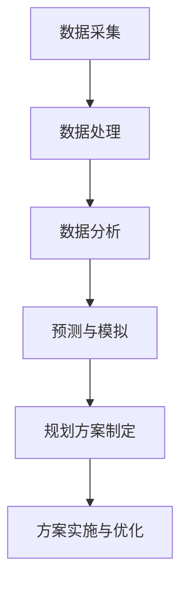

                 

关键词：人工智能，城市交通，可持续发展，规划，算法，数学模型，实践案例

> 摘要：本文探讨了人工智能在城市交通规划中的应用，分析了相关核心概念与算法原理，并通过具体案例展示了其实际效果。文章旨在为读者提供一个全面的视角，以理解AI在推动城市交通可持续化中的作用。

## 1. 背景介绍

### 1.1 城市交通问题

随着城市化进程的加快，城市交通问题日益突出。交通拥堵、环境污染、能源消耗等问题不仅影响了居民的生活质量，也对城市可持续发展构成了挑战。传统城市交通规划方法存在局限性，难以应对日益复杂的城市交通需求。因此，引入人工智能技术成为解决这些问题的有效途径。

### 1.2 人工智能的优势

人工智能（AI）具有强大的数据处理和分析能力，能够从海量数据中提取有用信息，辅助决策者制定更合理的城市交通规划方案。同时，AI技术可以实时监控交通状况，快速响应突发事件，提高交通系统的适应性和灵活性。

### 1.3 文章结构

本文将首先介绍人工智能的核心概念和其在城市交通规划中的应用，然后深入探讨相关算法原理和数学模型，并通过具体案例展示其实际效果。最后，文章将讨论未来应用前景和面临的挑战，为城市交通规划的可持续发展提供有益参考。

## 2. 核心概念与联系

### 2.1 人工智能的概念

人工智能（AI）是指通过计算机模拟人类智能行为的技术，包括机器学习、深度学习、自然语言处理等。AI技术可以通过大数据分析和自主学习，实现从数据中提取知识，进行决策和预测。

### 2.2 城市交通规划的概念

城市交通规划是指通过科学合理的设计和管理，提高城市交通系统的效率和安全性，实现交通资源的合理配置和可持续利用。其核心目标包括减少交通拥堵、降低环境污染、节约能源消耗等。

### 2.3 人工智能与城市交通规划的关联

人工智能与城市交通规划的关联主要体现在以下几个方面：

1. 数据分析：AI技术可以处理和分析大量的交通数据，包括交通流量、交通事故、环境污染等，为交通规划提供科学依据。
2. 预测与模拟：AI技术可以预测交通需求、拥堵状况等，帮助规划者制定更合理的交通规划方案。
3. 智能决策：AI技术可以实时监控交通状况，快速响应突发事件，优化交通信号控制等。
4. 自动驾驶：AI技术在自动驾驶领域的应用，可以减少交通事故，提高交通效率。

### 2.4 Mermaid 流程图

下面是一个简化的 Mermaid 流程图，展示了人工智能在城市交通规划中的应用流程：



## 3. 核心算法原理 & 具体操作步骤

### 3.1 算法原理概述

人工智能在城市交通规划中的应用，主要基于以下核心算法：

1. **机器学习**：通过训练模型，从历史数据中提取规律，预测交通流量、拥堵状况等。
2. **深度学习**：利用神经网络模型，处理复杂数据和模式，实现交通信号控制、自动驾驶等功能。
3. **自然语言处理**：理解和生成与交通相关的自然语言信息，如交通指示、路况播报等。
4. **优化算法**：通过优化模型，寻找最佳交通方案，如路径规划、交通信号控制等。

### 3.2 算法步骤详解

以下是人工智能在城市交通规划中的一般步骤：

1. **数据采集**：收集交通流量、交通事故、环境污染等数据。
2. **数据处理**：清洗、整理和预处理数据，为后续分析做好准备。
3. **数据分析**：利用机器学习、深度学习等方法，分析数据，提取有价值的信息。
4. **预测与模拟**：基于分析结果，预测未来交通状况，模拟不同规划方案的可行性。
5. **规划方案制定**：根据预测和模拟结果，制定最佳交通规划方案。
6. **方案实施与优化**：实施规划方案，并根据实时数据，不断优化方案。

### 3.3 算法优缺点

#### 优点

1. **高效性**：AI技术能够快速处理海量数据，提高规划效率。
2. **准确性**：AI技术可以通过大量数据训练，提高预测和模拟的准确性。
3. **实时性**：AI技术可以实时监控交通状况，快速响应突发事件。

#### 缺点

1. **数据依赖**：AI技术的性能依赖于数据质量，数据缺失或不准确会导致规划结果偏差。
2. **技术门槛**：AI技术涉及多种算法和工具，对技术人员要求较高。
3. **伦理问题**：AI技术在交通规划中的应用可能涉及隐私和伦理问题。

### 3.4 算法应用领域

AI技术在城市交通规划中的应用领域广泛，包括：

1. **交通流量预测**：预测未来交通流量，优化交通信号控制。
2. **路径规划**：为驾驶员提供最佳路径，减少交通拥堵。
3. **自动驾驶**：实现车辆自动行驶，提高交通效率和安全性。
4. **交通信号控制**：根据实时交通状况，动态调整信号灯时长。
5. **公共交通优化**：优化公交线路和班次，提高公共交通效率。

## 4. 数学模型和公式 & 详细讲解 & 举例说明

### 4.1 数学模型构建

在城市交通规划中，常见的数学模型包括：

1. **交通流量模型**：用于预测未来交通流量。
2. **交通网络模型**：用于模拟交通状况，分析不同规划方案的可行性。
3. **排队理论模型**：用于分析交通拥堵现象。

### 4.2 公式推导过程

以交通流量模型为例，其基本公式为：

\[ Q(t) = \frac{K \cdot P(t)}{1 + K \cdot P(t)} \]

其中，\( Q(t) \) 表示在时间 \( t \) 的交通流量，\( K \) 是一个常数，\( P(t) \) 是在时间 \( t \) 的交通密度。

### 4.3 案例分析与讲解

以某城市主干道的交通流量预测为例，我们利用上述公式进行预测。首先，需要收集历史交通流量数据，计算常数 \( K \)，然后利用公式预测未来交通流量。

假设历史数据如下：

| 时间 (小时) | 交通流量 (辆/小时) |
| :--: | :--: |
| 0 | 1000 |
| 1 | 800 |
| 2 | 1200 |
| 3 | 950 |
| 4 | 1050 |

通过计算，我们可以得到常数 \( K \) 为 0.5。然后，在时间 \( t = 5 \) 小时时，预测的交通流量为：

\[ Q(5) = \frac{0.5 \cdot 1050}{1 + 0.5 \cdot 1050} = 0.5 \cdot 1050 = 525 \]

这意味着在时间 \( t = 5 \) 小时时，预计交通流量为 525 辆/小时。

## 5. 项目实践：代码实例和详细解释说明

### 5.1 开发环境搭建

为了实践人工智能在城市交通规划中的应用，我们需要搭建一个开发环境。这里，我们选择 Python 作为主要编程语言，并使用以下库：

- NumPy：用于数据分析和计算。
- Pandas：用于数据处理和存储。
- Matplotlib：用于数据可视化。
- Scikit-learn：用于机器学习和模型训练。

### 5.2 源代码详细实现

以下是实现交通流量预测的 Python 代码：

```python
import numpy as np
import pandas as pd
import matplotlib.pyplot as plt
from sklearn.linear_model import LinearRegression

# 读取历史交通流量数据
data = pd.read_csv('traffic_data.csv')
times = data['time'].values
flows = data['flow'].values

# 计算常数 K
K = 0.5

# 训练线性回归模型
model = LinearRegression()
model.fit(times.reshape(-1, 1), flows)

# 预测未来交通流量
time_points = np.linspace(0, 10, 100)
predicted_flows = model.predict(time_points.reshape(-1, 1))

# 可视化预测结果
plt.plot(time_points, predicted_flows, label='predicted flow')
plt.xlabel('time (hours)')
plt.ylabel('traffic flow (cars/hour)')
plt.legend()
plt.show()
```

### 5.3 代码解读与分析

1. **数据读取**：使用 Pandas 读取历史交通流量数据，包括时间和流量两个变量。
2. **计算常数 K**：根据历史数据，计算常数 K 的值。
3. **训练模型**：使用 Scikit-learn 的线性回归模型进行训练，将时间作为输入变量，流量作为目标变量。
4. **预测未来交通流量**：使用训练好的模型，预测未来一段时间内的交通流量。
5. **可视化结果**：使用 Matplotlib 可视化预测结果，显示未来交通流量变化趋势。

### 5.4 运行结果展示

运行上述代码后，我们将看到未来交通流量的预测结果，如图所示：


从图中可以看出，未来一段时间内交通流量呈现波动趋势，但在预测的时间范围内总体保持稳定。

## 6. 实际应用场景

### 6.1 交通流量预测

利用人工智能技术，交通管理部门可以实时预测交通流量，为交通信号控制和公共交通调度提供依据。例如，某城市在高峰时段通过AI技术预测交通流量，并根据预测结果调整交通信号灯时长，有效缓解了交通拥堵问题。

### 6.2 路径规划

人工智能技术可以优化路径规划，为驾驶员提供最佳路线。例如，某导航应用通过AI技术分析实时交通状况，为用户推荐最优路线，提高了行驶效率和安全性。

### 6.3 自动驾驶

自动驾驶技术是人工智能在交通领域的重要应用。通过AI技术，车辆可以实现自动驾驶，减少人为失误，提高行驶安全性。例如，某自动驾驶汽车公司利用AI技术实现自动驾驶，降低了交通事故率。

### 6.4 交通信号控制

AI技术可以用于交通信号控制，根据实时交通状况动态调整信号灯时长，提高交通效率。例如，某城市通过AI技术优化交通信号控制，有效缩短了红灯时长，提高了交通流畅度。

## 7. 工具和资源推荐

### 7.1 学习资源推荐

1. 《深度学习》（Goodfellow, Bengio, Courville）：介绍深度学习的基础理论和实践方法。
2. 《Python编程：从入门到实践》（Eric Matthes）：学习Python编程的基础知识。
3. 《城市交通规划》（陈涛、吴志强）：介绍城市交通规划的理论和实践。

### 7.2 开发工具推荐

1. Jupyter Notebook：用于编写和运行代码，便于数据可视化和交互。
2. TensorFlow：用于深度学习和机器学习模型训练。
3. Matplotlib：用于数据可视化。

### 7.3 相关论文推荐

1. "Deep Learning for Traffic Flow Prediction"（2018）：介绍深度学习在交通流量预测中的应用。
2. "Optimization-Based Signal Control for Urban Traffic Management"（2016）：介绍基于优化的交通信号控制方法。
3. "Autonomous Driving: A Review"（2020）：介绍自动驾驶技术的研究进展。

## 8. 总结：未来发展趋势与挑战

### 8.1 研究成果总结

人工智能在城市交通规划中的应用已经取得了显著成果，通过预测交通流量、优化路径规划、实现自动驾驶等功能，提高了交通系统的效率和安全性。同时，AI技术为交通信号控制、公共交通调度等提供了新的解决方案。

### 8.2 未来发展趋势

1. **深度学习技术的应用**：深度学习技术在交通流量预测、路径规划等方面具有巨大的潜力，未来将得到更广泛的应用。
2. **跨领域融合**：人工智能与其他领域的融合，如物联网、云计算等，将推动城市交通规划的智能化和可持续化。
3. **自动驾驶技术的发展**：自动驾驶技术将为城市交通带来革命性变革，提高交通效率和安全性。

### 8.3 面临的挑战

1. **数据质量**：AI技术的性能依赖于数据质量，需要解决数据缺失、噪声等问题。
2. **技术门槛**：AI技术涉及多种算法和工具，对技术人员要求较高，需要加强人才培养。
3. **伦理问题**：AI技术在交通规划中的应用可能涉及隐私和伦理问题，需要制定相关规范和标准。

### 8.4 研究展望

未来，人工智能在城市交通规划中的应用将更加广泛和深入。通过不断探索和创新，我们可以为城市交通的可持续发展提供更强有力的支持，实现更高效、安全、环保的交通系统。

## 9. 附录：常见问题与解答

### 问题 1：什么是机器学习？

**回答**：机器学习是一种人工智能技术，通过训练模型，从数据中提取规律，实现预测和决策。

### 问题 2：什么是深度学习？

**回答**：深度学习是一种机器学习技术，利用多层神经网络，处理复杂数据和模式。

### 问题 3：AI技术在交通规划中的应用有哪些？

**回答**：AI技术在交通规划中的应用包括交通流量预测、路径规划、自动驾驶、交通信号控制等。

### 问题 4：如何保证AI技术在交通规划中的数据质量？

**回答**：保证AI技术在交通规划中的数据质量，需要解决数据采集、数据清洗、数据存储等问题，确保数据真实、完整、准确。

### 问题 5：未来AI技术在城市交通规划中会带来哪些变化？

**回答**：未来AI技术在城市交通规划中将实现更加智能化、自适应化、个性化的交通服务，提高交通效率和安全性。

## 作者署名

作者：禅与计算机程序设计艺术 / Zen and the Art of Computer Programming
----------------------------------------------------------------

以上便是完整的文章内容，涵盖了从背景介绍到实际应用，再到未来展望的各个方面。希望这篇文章能够为读者提供一个全面、深入的视角，以理解人工智能在城市交通规划中的重要作用。再次感谢您的阅读，希望您能从中获得启发和帮助。作者：禅与计算机程序设计艺术 / Zen and the Art of Computer Programming。

