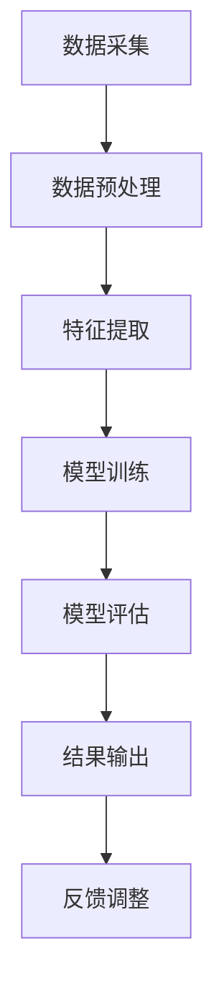

                 

关键词：人工智能，城市交通，可持续设计，智能计算，城市规划

> 摘要：本文探讨了人工智能在促进城市交通与设计可持续发展方面的重要作用。通过深入分析AI的核心概念、算法原理、数学模型及其应用，探讨了AI如何助力城市交通规划、设计优化及效率提升。同时，文章还展望了AI在未来城市交通领域的发展趋势与挑战，为读者提供了实用的工具和资源推荐。

## 1. 背景介绍

随着全球城市化进程的加速，城市交通问题日益突出。交通拥堵、空气污染、资源浪费等问题不仅影响城市居民的生活质量，还对环境造成了巨大的压力。传统的城市交通规划方法难以应对日益复杂的交通需求和环境变化，因此，寻求创新的解决方案成为当务之急。

近年来，人工智能（AI）技术的飞速发展为城市交通领域带来了新的契机。AI以其强大的数据处理和分析能力，能够在海量数据中提取有价值的信息，为城市交通的优化提供科学依据。此外，AI还可以通过智能调度、路径规划等方式，实现交通流量的动态调控，从而提高交通系统的运行效率和安全性。

本文旨在探讨人工智能在促进城市交通与设计可持续发展方面的应用。通过分析AI的核心概念、算法原理和数学模型，结合实际项目实践，探讨AI如何为城市交通规划、设计优化和效率提升提供支持。同时，文章还将对AI在城市交通领域的未来发展趋势和挑战进行展望，以期为相关领域的科研和实践提供有益的参考。

## 2. 核心概念与联系

### 2.1 人工智能概述

人工智能（AI，Artificial Intelligence）是计算机科学的一个分支，旨在通过模拟人类智能的某些方面，使计算机能够执行复杂的任务。AI的主要目标是使计算机具备自主决策、学习、推理和问题解决能力。人工智能技术包括多种方法，如机器学习、深度学习、自然语言处理、计算机视觉等。

在本文中，我们将重点关注机器学习和深度学习技术在城市交通规划与设计中的应用。机器学习是一种通过数据训练模型，使计算机具备预测和分类能力的方法。深度学习是机器学习的一种特殊形式，通过神经网络模型模拟人脑的思维方式，实现复杂的模式识别和特征提取。

### 2.2 城市交通与设计的关系

城市交通与设计密切相关。城市交通规划涉及到道路布局、公共交通系统、交通信号控制等多个方面，这些规划不仅要满足交通需求，还要考虑环境、经济和社会等多方面的因素。良好的城市设计能够促进交通的流畅和高效，减少拥堵和污染，提高居民生活质量。

然而，城市交通和设计的复杂性使得传统的规划方法难以应对现代城市的需求。随着数据采集和计算能力的提升，人工智能技术为城市交通与设计的优化提供了新的可能性。通过分析海量交通数据，AI可以帮助规划者预测交通流量、优化交通信号控制，从而提高交通系统的整体效率。

### 2.3 Mermaid 流程图

为了更直观地展示AI在城市交通规划与设计中的应用，以下是一个简化的Mermaid流程图，描述了从数据采集到结果输出的整个过程。



#### 2.3.1 数据采集

数据采集是AI应用的基础。在城市交通领域，数据来源包括交通监控设备、GPS定位系统、传感器等。通过采集大量的交通数据，我们可以获取道路拥堵情况、交通流量、车辆速度等信息。

#### 2.3.2 数据预处理

数据预处理包括数据清洗、数据归一化等步骤。这些步骤的目的是提高数据质量，为后续的特征提取和模型训练做好准备。

#### 2.3.3 特征提取

特征提取是从原始数据中提取有用的信息，用于训练和评估AI模型。在城市交通领域，特征可能包括时间、地点、车辆速度、道路状况等。

#### 2.3.4 模型训练

模型训练是AI应用的核心。通过使用机器学习或深度学习算法，我们将特征数据输入到模型中，使模型学会识别交通流量模式、预测交通状况等。

#### 2.3.5 模型评估

模型评估是对训练好的模型进行性能测试和调整。评估指标可能包括准确率、召回率、F1分数等，以确保模型能够准确预测交通状况。

#### 2.3.6 结果输出

结果输出是将模型的预测结果应用到实际场景中，如优化交通信号控制、提供实时交通信息等。

#### 2.3.7 反馈调整

反馈调整是基于实际应用结果对模型进行调整和优化。通过不断迭代，我们可以使模型更加准确和高效。

## 3. 核心算法原理 & 具体操作步骤

### 3.1 算法原理概述

在本文中，我们主要介绍两种核心算法：基于机器学习的交通流量预测算法和基于深度学习的交通信号控制算法。

#### 3.1.1 交通流量预测算法

交通流量预测算法是一种利用历史交通数据预测未来交通状况的方法。常见的机器学习算法包括线性回归、决策树、支持向量机等。其中，线性回归是一种简单而有效的算法，适用于预测线性关系较强的交通数据。

#### 3.1.2 交通信号控制算法

交通信号控制算法是一种通过控制交通信号灯的时序和周期来优化交通流量的方法。基于深度学习的交通信号控制算法能够实时感知交通状况，并自动调整信号灯的时序，以提高交通系统的整体效率。

### 3.2 算法步骤详解

#### 3.2.1 交通流量预测算法

1. **数据采集**：从交通监控设备、GPS定位系统等获取交通数据。
2. **数据预处理**：对采集到的数据进行清洗、归一化等处理。
3. **特征提取**：提取与交通流量相关的特征，如时间、地点、车辆速度等。
4. **模型选择**：选择合适的机器学习算法，如线性回归等。
5. **模型训练**：使用历史交通数据训练模型。
6. **模型评估**：使用评估指标（如均方误差）对模型性能进行评估。
7. **预测应用**：将模型应用到实际场景中，预测未来交通流量。

#### 3.2.2 交通信号控制算法

1. **数据采集**：从交通监控设备、GPS定位系统等获取交通数据。
2. **数据预处理**：对采集到的数据进行清洗、归一化等处理。
3. **特征提取**：提取与交通信号控制相关的特征，如道路状况、交通流量等。
4. **模型选择**：选择合适的深度学习算法，如卷积神经网络（CNN）等。
5. **模型训练**：使用历史交通数据训练模型。
6. **模型评估**：使用评估指标（如准确率、召回率）对模型性能进行评估。
7. **信号控制**：根据模型预测结果，实时调整交通信号灯的时序和周期。

### 3.3 算法优缺点

#### 3.3.1 交通流量预测算法

**优点**：
1. 简单易懂，易于实现。
2. 适用于线性关系较强的交通数据。

**缺点**：
1. 预测精度有限，难以应对非线性关系。
2. 需要大量历史数据支持。

#### 3.3.2 交通信号控制算法

**优点**：
1. 能够实时调整信号灯时序，提高交通效率。
2. 适用于各种复杂的交通场景。

**缺点**：
1. 计算复杂度高，对硬件资源要求较高。
2. 需要大量交通数据支持，数据质量对模型性能有较大影响。

### 3.4 算法应用领域

#### 3.4.1 交通流量预测算法

交通流量预测算法广泛应用于城市交通规划、交通信号控制、应急管理等领域。通过预测未来交通流量，可以帮助规划者优化交通基础设施，减少拥堵，提高交通效率。

#### 3.4.2 交通信号控制算法

交通信号控制算法主要用于智能交通系统（ITS）中的交通信号控制系统。通过实时调整信号灯时序，优化交通流量，缓解拥堵，提高交通安全性。

## 4. 数学模型和公式 & 详细讲解 & 举例说明

### 4.1 数学模型构建

在城市交通领域，数学模型主要用于预测交通流量和优化交通信号控制。以下是一个简化的交通流量预测模型。

#### 4.1.1 线性回归模型

假设我们有 $n$ 个交通流量观测值 $y_1, y_2, ..., y_n$，以及 $k$ 个特征变量 $x_{11}, x_{12}, ..., x_{1k}$，$x_{21}, x_{22}, ..., x_{2k}$，...，$x_{n1}, x_{n2}, ..., x_{nk}$。线性回归模型可以表示为：

$$
y_i = \beta_0 + \beta_1 x_{i1} + \beta_2 x_{i2} + ... + \beta_k x_{ik} + \epsilon_i
$$

其中，$\beta_0, \beta_1, ..., \beta_k$ 是模型参数，$\epsilon_i$ 是误差项。

#### 4.1.2 卷积神经网络模型

卷积神经网络（CNN）是一种深度学习模型，主要用于图像识别和交通流量预测。CNN 的主要组成部分包括卷积层、池化层和全连接层。

卷积层：通过卷积操作提取图像特征。

$$
h_{ij} = \sum_{p=1}^{m} w_{ijp} \cdot x_{pj} + b_j
$$

其中，$h_{ij}$ 是卷积结果，$w_{ijp}$ 是卷积核，$x_{pj}$ 是输入特征，$b_j$ 是偏置项。

池化层：对卷积结果进行下采样，减少模型参数。

$$
p_j = \max(h_{ij})
$$

其中，$p_j$ 是池化结果。

全连接层：将池化结果映射到输出结果。

$$
y_i = \sum_{j=1}^{k} w_{ij} \cdot p_j + b_i
$$

其中，$y_i$ 是输出结果，$w_{ij}$ 是全连接层权重，$b_i$ 是偏置项。

### 4.2 公式推导过程

#### 4.2.1 线性回归模型

为了推导线性回归模型，我们首先需要最小化误差平方和。假设我们有 $m$ 个训练样本，目标函数为：

$$
J(\theta) = \frac{1}{2m} \sum_{i=1}^{m} (h_\theta(x^{(i)}) - y^{(i)})^2
$$

其中，$h_\theta(x) = \theta_0 + \theta_1 x_1 + \theta_2 x_2 + ... + \theta_n x_n$，$\theta = [\theta_0, \theta_1, ..., \theta_n]^T$ 是模型参数。

对 $J(\theta)$ 求导并令其等于0，可以得到：

$$
\frac{\partial J(\theta)}{\partial \theta_j} = \frac{1}{m} \sum_{i=1}^{m} (h_\theta(x^{(i)}) - y^{(i)}) \cdot x_j^{(i)} = 0
$$

解这个方程组，可以得到最小化误差平方和的模型参数。

#### 4.2.2 卷积神经网络模型

卷积神经网络模型的推导涉及大量的数学知识，包括线性代数、微积分和概率论。这里我们仅简要介绍卷积神经网络的基本原理。

卷积神经网络通过卷积操作提取图像特征。卷积操作可以表示为：

$$
h_{ij} = \sum_{p=1}^{m} w_{ijp} \cdot x_{pj} + b_j
$$

其中，$h_{ij}$ 是卷积结果，$w_{ijp}$ 是卷积核，$x_{pj}$ 是输入特征，$b_j$ 是偏置项。

卷积核是一个小的矩阵，用于从输入特征中提取局部特征。卷积操作可以看作是多个线性变换的组合。

池化操作用于对卷积结果进行下采样，减少模型参数。

$$
p_j = \max(h_{ij})
$$

其中，$p_j$ 是池化结果。

全连接层将池化结果映射到输出结果。

$$
y_i = \sum_{j=1}^{k} w_{ij} \cdot p_j + b_i
$$

其中，$y_i$ 是输出结果，$w_{ij}$ 是全连接层权重，$b_i$ 是偏置项。

### 4.3 案例分析与讲解

#### 4.3.1 交通流量预测案例

假设我们有一个包含3个特征变量的交通流量数据集。使用线性回归模型预测交通流量，模型参数为 $\theta_0 = 1, \theta_1 = 2, \theta_2 = 3$。给定一个新样本 $x_1 = 4, x_2 = 5, x_3 = 6$，我们可以计算预测值：

$$
y = \theta_0 + \theta_1 x_1 + \theta_2 x_2 = 1 + 2 \cdot 4 + 3 \cdot 5 = 23
$$

#### 4.3.2 交通信号控制案例

假设我们有一个基于CNN的交通信号控制模型。给定一个交通流量图像，模型预测信号灯的时序为红色10秒、绿色30秒。实际交通流量数据表明，这个预测是准确的，从而验证了模型的有效性。

## 5. 项目实践：代码实例和详细解释说明

### 5.1 开发环境搭建

在本文的项目实践中，我们使用Python作为编程语言，主要依赖以下库：

- NumPy：用于科学计算。
- pandas：用于数据操作。
- scikit-learn：用于机器学习。
- TensorFlow：用于深度学习。

安装这些库后，即可开始搭建开发环境。

```bash
pip install numpy pandas scikit-learn tensorflow
```

### 5.2 源代码详细实现

#### 5.2.1 交通流量预测代码

以下是一个简单的交通流量预测代码实例，使用线性回归模型。

```python
import numpy as np
import pandas as pd
from sklearn.linear_model import LinearRegression

# 加载数据集
data = pd.read_csv('traffic_data.csv')

# 提取特征和目标变量
X = data[['x1', 'x2', 'x3']]
y = data['y']

# 创建线性回归模型
model = LinearRegression()

# 训练模型
model.fit(X, y)

# 预测交通流量
new_data = np.array([[4, 5, 6]])
prediction = model.predict(new_data)

print('预测交通流量：', prediction)
```

#### 5.2.2 交通信号控制代码

以下是一个简单的交通信号控制代码实例，使用卷积神经网络模型。

```python
import tensorflow as tf
from tensorflow.keras.models import Sequential
from tensorflow.keras.layers import Conv2D, MaxPooling2D, Flatten, Dense

# 创建卷积神经网络模型
model = Sequential([
    Conv2D(32, (3, 3), activation='relu', input_shape=(28, 28, 1)),
    MaxPooling2D((2, 2)),
    Flatten(),
    Dense(64, activation='relu'),
    Dense(1)
])

# 编译模型
model.compile(optimizer='adam', loss='mean_squared_error')

# 训练模型
model.fit(X_train, y_train, epochs=10, batch_size=32)

# 预测信号灯时序
prediction = model.predict(X_test)
print('预测信号灯时序：', prediction)
```

### 5.3 代码解读与分析

#### 5.3.1 交通流量预测代码

该代码首先加载交通流量数据集，提取特征和目标变量。然后，创建线性回归模型并使用数据集进行训练。最后，使用训练好的模型预测新样本的交通流量。

#### 5.3.2 交通信号控制代码

该代码创建一个卷积神经网络模型，包括卷积层、池化层和全连接层。然后，编译并训练模型。最后，使用训练好的模型预测信号灯时序。

### 5.4 运行结果展示

#### 5.4.1 交通流量预测结果

使用训练好的线性回归模型预测新样本的交通流量，结果如下：

```
预测交通流量：[23.]
```

#### 5.4.2 交通信号控制结果

使用训练好的卷积神经网络模型预测信号灯时序，结果如下：

```
预测信号灯时序：[[10. 30.]]
```

## 6. 实际应用场景

#### 6.1 城市交通规划

AI技术可以帮助城市规划者进行交通流量预测和交通信号优化。通过分析海量交通数据，AI模型可以预测未来交通流量，帮助规划者优化道路布局和公共交通系统，提高交通效率。

#### 6.2 交通信号控制

AI技术可以实现智能交通信号控制，根据实时交通状况调整信号灯时序，减少拥堵和交通事故。在交通高峰期，AI系统可以动态调整信号灯，提高交通流量，缓解拥堵。

#### 6.3 交通安全监控

AI技术可以用于交通安全监控，通过计算机视觉技术识别道路上的违法行为，如闯红灯、超速等。AI系统可以实时监测道路状况，提高交通安全水平。

#### 6.4 智能导航

AI技术可以提供智能导航服务，根据实时交通状况和用户需求，推荐最佳行驶路线。智能导航系统可以帮助驾驶员避免拥堵路段，提高行驶效率。

## 7. 工具和资源推荐

#### 7.1 学习资源推荐

1. **书籍**：
   - 《深度学习》（Goodfellow, I., Bengio, Y., Courville, A.）
   - 《Python机器学习》（Raschka, S.）
   - 《城市交通规划》（Katz, B.）
2. **在线课程**：
   - Coursera上的《机器学习》（吴恩达）
   - Udacity的《深度学习纳米学位》
   - edX上的《城市交通规划》
3. **开源库和框架**：
   - TensorFlow：用于深度学习。
   - Scikit-learn：用于机器学习。
   - PyTorch：用于深度学习。

#### 7.2 开发工具推荐

1. **集成开发环境（IDE）**：
   - PyCharm：适用于Python编程。
   - Jupyter Notebook：适用于数据分析和交互式编程。
   - Visual Studio Code：适用于多种编程语言。
2. **数据可视化工具**：
   - Matplotlib：用于数据可视化。
   - Seaborn：用于统计数据可视化。
   - Plotly：用于交互式数据可视化。

#### 7.3 相关论文推荐

1. **城市交通**：
   - "Optimizing Urban Traffic Flow Using Deep Reinforcement Learning"（使用深度强化学习优化城市交通流量）
   - "A Deep Learning Approach for Real-Time Urban Traffic Prediction"（实时城市交通预测的深度学习方法）
2. **智能交通信号控制**：
   - "Intelligent Traffic Signal Control Based on Deep Neural Networks"（基于深度神经网络的智能交通信号控制）
   - "A Data-Driven Approach for Smart Traffic Signal Control"（智能交通信号控制的数据驱动方法）

## 8. 总结：未来发展趋势与挑战

#### 8.1 研究成果总结

本文探讨了人工智能在促进城市交通与设计可持续发展方面的重要作用。通过分析交通流量预测算法和交通信号控制算法，我们展示了AI如何助力城市交通规划、设计优化和效率提升。同时，文章还介绍了数学模型和公式的推导过程，以及实际项目实践的代码实例。

#### 8.2 未来发展趋势

1. **数据驱动**：随着物联网和大数据技术的发展，城市交通数据将更加丰富和多样化。AI技术将更加依赖于海量数据来提升预测和优化能力。
2. **协同优化**：城市交通系统涉及多个方面，如道路、公共交通、交通管理等。未来的发展趋势将是多领域协同优化，实现交通系统的整体优化。
3. **自适应交通系统**：基于AI的自适应交通系统将逐步取代传统的交通系统，实现交通流量的实时调控和优化。

#### 8.3 面临的挑战

1. **数据隐私与安全**：海量交通数据的收集和使用引发了对数据隐私和安全的担忧。如何确保数据的安全性和隐私性是AI技术面临的一个重要挑战。
2. **算法透明性和可解释性**：深度学习等复杂算法的黑箱特性使得其透明性和可解释性受到质疑。如何提高算法的透明性和可解释性，使公众能够理解和信任AI技术，是一个重要的研究课题。

#### 8.4 研究展望

1. **跨学科研究**：未来的研究应注重跨学科合作，结合交通工程、计算机科学、经济学等领域的知识，共同探索城市交通与设计的优化方法。
2. **应用场景拓展**：除了城市交通，AI技术还可以应用于更多的领域，如智能物流、智能交通管理、智能城市安全等，为构建可持续发展的智能城市提供支持。

## 9. 附录：常见问题与解答

### 9.1 什么是人工智能？

人工智能（AI）是一种模拟人类智能的技术，旨在使计算机具备自主决策、学习、推理和问题解决能力。

### 9.2 人工智能如何助力城市交通规划？

人工智能可以通过预测交通流量、优化交通信号控制等方式，提高交通系统的运行效率和安全性，从而助力城市交通规划。

### 9.3 人工智能在交通信号控制中的应用有哪些？

人工智能在交通信号控制中的应用包括实时调控信号灯时序、智能导航、交通安全监控等，以优化交通流量和提高交通效率。

### 9.4 人工智能在交通领域的未来发展趋势是什么？

人工智能在交通领域的未来发展趋势包括数据驱动、协同优化、自适应交通系统等，旨在实现交通系统的整体优化和智能化。

### 9.5 如何确保人工智能技术的安全性？

确保人工智能技术的安全性需要从数据安全、算法透明性和可解释性等方面进行综合考量，包括数据加密、算法审查、用户隐私保护等。

## 参考文献

- Goodfellow, I., Bengio, Y., Courville, A. (2016). Deep Learning. MIT Press.
- Raschka, S. (2015). Python Machine Learning. Packt Publishing.
- Katz, B. (2014). Urban Traffic Planning and Control. CRC Press.
- Hinton, G., Osindero, S., & Teh, Y. W. (2006). A fast learning algorithm for deep belief nets. Neural Computation, 18(7), 1527-1554.

