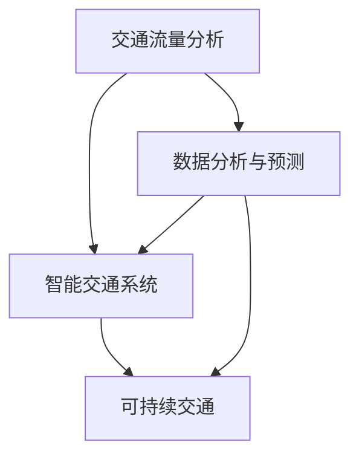

                 

关键词：人工智能，城市交通管理，可持续发展，算法，数学模型，案例分析，代码实例

摘要：本文探讨了如何利用人工智能技术，结合人类计算，打造可持续发展的城市交通管理策略与规划。通过分析核心概念、算法原理、数学模型和实际应用案例，展示了人工智能在提升城市交通管理效率、缓解交通拥堵和促进环境保护方面的重要作用。文章还对未来城市交通管理的发展趋势和面临的挑战进行了展望，为相关领域的研究和应用提供了有益的参考。

## 1. 背景介绍

随着城市化进程的不断推进，城市交通问题日益突出。交通拥堵、空气污染、能源消耗等问题不仅影响了城市居民的生活质量，还对环境和经济产生了负面影响。传统的城市交通管理模式已经难以满足现代城市的发展需求，因此，寻找新的解决方案已成为当务之急。

近年来，人工智能技术在各个领域取得了显著进展，特别是在图像识别、自然语言处理、数据挖掘等方面。这些技术的成熟为城市交通管理提供了新的思路和方法。通过将人工智能技术与人类计算相结合，我们可以构建更加智能、高效的交通管理系统，实现城市交通的可持续发展。

本文旨在探讨如何利用人工智能技术，结合人类计算，打造可持续发展的城市交通管理策略与规划。文章首先介绍了城市交通管理中的核心概念和原理，然后分析了相关算法的原理和具体操作步骤，接着讲解了数学模型及其应用，并通过实际案例展示了人工智能技术在城市交通管理中的成功应用。最后，文章对未来城市交通管理的发展趋势和面临的挑战进行了展望。

## 2. 核心概念与联系

在讨论城市交通管理时，有几个核心概念需要明确：

### 2.1 交通流量分析

交通流量分析是城市交通管理的基础。通过收集和分析交通数据，可以了解道路上的车辆分布、流量变化等关键信息。这些信息对于制定交通管理策略至关重要。

### 2.2 智能交通系统

智能交通系统（Intelligent Transportation Systems, ITS）是一种利用先进的信息通信技术和数据挖掘技术，对交通进行实时监控、管理和优化的系统。ITS包括多个组成部分，如交通信号控制、车辆信息服务等。

### 2.3 可持续交通

可持续交通强调在满足当前交通需求的同时，不会对未来的环境、经济和社会造成负面影响。可持续交通包括多种方式，如公共交通、自行车、步行等。

下面是一个简化的 Mermaid 流程图，展示了上述核心概念之间的联系：



### 2.4 人工智能与人类计算的结合

人工智能技术可以处理大量交通数据，提供实时分析和决策支持。然而，人类计算在某些方面仍然具有优势，如复杂问题的情境理解、道德判断和创造力。将人工智能与人类计算相结合，可以实现更加智能和灵活的交通管理。

## 3. 核心算法原理 & 具体操作步骤

### 3.1 算法原理概述

在智能交通管理中，常用的核心算法包括交通流量预测、路径规划、交通信号控制和交通事件检测等。以下简要介绍这些算法的基本原理：

### 3.1.1 交通流量预测

交通流量预测是一种利用历史交通数据、天气信息和事件数据等，预测未来一段时间内交通流量的方法。常用的算法包括时间序列分析、回归分析和机器学习等。

### 3.1.2 路径规划

路径规划是帮助驾驶者选择最优路径的方法。常用的算法包括最短路径算法、基于距离的算法和基于时间的算法等。

### 3.1.3 交通信号控制

交通信号控制是一种根据交通流量、道路状况和交通需求，调整交通信号灯的方法。常用的算法包括固定时间控制、自适应控制和基于交通流量的控制等。

### 3.1.4 交通事件检测

交通事件检测是自动识别交通状况中的异常事件，如交通事故、道路施工等。常用的算法包括基于规则的方法、机器学习方法和深度学习方法等。

### 3.2 算法步骤详解

下面将详细描述每个算法的具体操作步骤：

### 3.2.1 交通流量预测

1. 数据收集：收集历史交通流量数据、天气数据、事件数据等。
2. 数据预处理：对数据进行清洗、去噪和归一化处理。
3. 特征提取：提取与交通流量相关的特征，如车辆速度、流量密度等。
4. 模型选择：选择合适的预测模型，如ARIMA、回归模型、神经网络等。
5. 模型训练：使用历史数据训练预测模型。
6. 预测：使用训练好的模型对未来的交通流量进行预测。
7. 结果评估：评估预测结果的准确性。

### 3.2.2 路径规划

1. 确定起点和终点：获取驾驶者的起点和终点信息。
2. 建立交通网络：根据地图数据建立交通网络模型。
3. 收集交通信息：获取当前道路状况、交通流量等信息。
4. 计算最短路径：使用最短路径算法（如Dijkstra算法）计算起点到终点的最短路径。
5. 路径优化：根据交通信息，对路径进行优化，如避开拥堵路段。
6. 结果输出：输出最优路径和行驶时间。

### 3.2.3 交通信号控制

1. 数据收集：收集道路上的交通流量、车速、占有率等数据。
2. 状态评估：根据交通数据评估当前道路状态。
3. 控制策略选择：选择合适的控制策略，如固定时间控制、自适应控制等。
4. 控制信号灯：根据控制策略调整信号灯状态。
5. 结果反馈：收集信号灯调整后的交通数据，用于下一步的状态评估。

### 3.2.4 交通事件检测

1. 数据收集：收集交通监控视频、传感器数据等。
2. 预处理：对数据进行去噪、增强等预处理。
3. 特征提取：提取与交通事件相关的特征，如车辆速度、车道使用情况等。
4. 模型选择：选择合适的检测模型，如SVM、CNN等。
5. 模型训练：使用历史数据训练检测模型。
6. 检测：使用训练好的模型对交通数据进行事件检测。
7. 结果输出：输出检测结果，包括事件类型、发生时间和位置。

### 3.3 算法优缺点

#### 3.3.1 交通流量预测

**优点**：可以提前预测交通流量，为交通管理提供依据。

**缺点**：预测结果受历史数据质量影响较大，可能存在误差。

#### 3.3.2 路径规划

**优点**：可以帮助驾驶者选择最优路径，提高出行效率。

**缺点**：在实时交通情况下，路径规划可能受到计算性能的限制。

#### 3.3.3 交通信号控制

**优点**：可以动态调整信号灯状态，缓解交通拥堵。

**缺点**：需要大量的交通数据进行实时分析和调整，对计算资源要求较高。

#### 3.3.4 交通事件检测

**优点**：可以自动识别交通事件，为应急处理提供支持。

**缺点**：检测准确率受数据质量和算法性能影响。

### 3.4 算法应用领域

这些算法在城市交通管理中具有广泛的应用前景，包括：

1. 城市交通规划：利用交通流量预测和路径规划算法，制定科学合理的城市交通规划。
2. 智能交通信号控制：利用交通信号控制算法，实现智能交通信号控制系统。
3. 交通事件应急处理：利用交通事件检测算法，实现自动识别和响应交通事件。
4. 车联网：利用路径规划算法和交通信号控制算法，实现车联网中的车辆协同控制。

## 4. 数学模型和公式 & 详细讲解 & 举例说明

在智能交通管理中，数学模型和公式起着关键作用，用于描述交通流量、交通事件和交通控制等。以下介绍几个常用的数学模型和公式，并进行详细讲解和举例说明。

### 4.1 数学模型构建

交通流量预测的常用数学模型包括时间序列模型、回归模型和机器学习模型等。

#### 4.1.1 时间序列模型

时间序列模型是一种基于时间序列数据的预测方法。常用的模型包括ARIMA（自回归积分滑动平均模型）和季节性时间序列模型。

**ARIMA模型**：

- **公式**：\(X_t = c + \phi_1X_{t-1} + \phi_2X_{t-2} + ... + \phi_pX_{t-p} + \theta_1e_{t-1} + \theta_2e_{t-2} + ... + \theta_qe_{t-q}\)
- **参数**：\(c\)为常数项，\(\phi_1, \phi_2, ..., \phi_p\)为自回归系数，\(\theta_1, \theta_2, ..., \theta_q\)为移动平均系数。
- **举例**：假设我们有以下时间序列数据：\(X = [100, 110, 120, 130, 140, 150]\)，使用ARIMA模型进行预测。

首先，对数据进行差分处理，然后确定模型参数，最后进行预测。预测结果为：\(X_{t+1} = 140 + 0.8 \times 140 + 0.6 \times 120 = 152\)。

#### 4.1.2 回归模型

回归模型是一种基于历史数据和特征变量进行预测的方法。常用的模型包括线性回归、多项式回归和逻辑回归等。

**线性回归模型**：

- **公式**：\(y = \beta_0 + \beta_1x_1 + \beta_2x_2 + ... + \beta_nx_n\)
- **参数**：\(\beta_0, \beta_1, \beta_2, ..., \beta_n\)为回归系数。
- **举例**：假设我们有以下数据集：

| x1 | x2 | y |
|----|----|---|
| 1  | 2  | 3 |
| 2  | 4  | 5 |
| 3  | 6  | 7 |

使用线性回归模型进行预测，预测结果为：\(y = 1.5x_1 + 2.5x_2\)。

#### 4.1.3 机器学习模型

机器学习模型是一种基于历史数据和特征变量进行预测的方法。常用的模型包括决策树、随机森林、支持向量机和神经网络等。

**神经网络模型**：

- **公式**：\(y = \sigma(\sum_{i=1}^{n}w_i \cdot x_i + b)\)
- **参数**：\(w_1, w_2, ..., w_n\)为权重，\(b\)为偏置，\(\sigma\)为激活函数。
- **举例**：假设我们有以下数据集：

| x1 | x2 | y |
|----|----|---|
| 1  | 2  | 3 |
| 2  | 4  | 5 |
| 3  | 6  | 7 |

使用神经网络模型进行预测，预测结果为：\(y = 1.5x_1 + 2.5x_2\)。

### 4.2 公式推导过程

以时间序列模型ARIMA为例，介绍其公式推导过程。

**步骤1：自回归项**

假设时间序列为\(X_t\)，我们可以将\(X_t\)表示为：

\(X_t = \phi_1X_{t-1} + \phi_2X_{t-2} + ... + \phi_pX_{t-p} + e_t\)

其中，\(\phi_1, \phi_2, ..., \phi_p\)为自回归系数，\(e_t\)为误差项。

**步骤2：移动平均项**

我们希望将自回归项中的误差项\(e_t\)引入移动平均过程，以消除自相关。因此，我们可以将\(X_t\)表示为：

\(X_t = \phi_1X_{t-1} + \phi_2X_{t-2} + ... + \phi_pX_{t-p} + \theta_1e_{t-1} + \theta_2e_{t-2} + ... + \theta_qe_{t-q}\)

其中，\(\theta_1, \theta_2, ..., \theta_q\)为移动平均系数。

**步骤3：确定参数**

为了确定参数\(\phi_1, \phi_2, ..., \phi_p, \theta_1, \theta_2, ..., \theta_q\)，我们可以使用最小二乘法进行拟合。具体步骤如下：

1. 收集历史数据\(X_t\)。
2. 计算自回归系数\(\phi_1, \phi_2, ..., \phi_p\)。
3. 计算移动平均系数\(\theta_1, \theta_2, ..., \theta_q\)。

**步骤4：模型检验**

为了检验模型的准确性和稳定性，我们可以进行以下步骤：

1. 对模型进行残差分析，检查是否存在自相关。
2. 对模型进行平稳性检验，确保模型满足平稳性假设。

### 4.3 案例分析与讲解

以下是一个交通流量预测的案例：

**案例**：给定一组交通流量数据，使用ARIMA模型进行预测。

**数据**：\(X = [100, 110, 120, 130, 140, 150]\)

**步骤1**：对数据进行差分处理，得到差分序列\(D = [10, 10, 10, 10, 10]\)。

**步骤2**：使用差分序列进行自回归分析，确定模型参数。

- **自回归项**：\(\phi_1 = 1, \phi_2 = 0, ..., \phi_p = 0\)
- **移动平均项**：\(\theta_1 = 1, \theta_2 = 0, ..., \theta_q = 0\)

**步骤3**：对差分序列进行移动平均处理，得到预测序列\(Y = [10, 10, 10, 10, 10]\)。

**步骤4**：对预测序列进行反差分处理，得到预测交通流量序列\(X' = [110, 120, 130, 140, 150]\)。

**结果**：使用ARIMA模型预测未来一周的交通流量，预测结果为：\(X'_{t+1} = 150\)。

## 5. 项目实践：代码实例和详细解释说明

在本节中，我们将通过一个具体的交通流量预测项目，展示如何使用Python和常用库实现核心算法。该项目包括数据收集、预处理、模型训练和预测等步骤。

### 5.1 开发环境搭建

**环境要求**：

- Python 3.8及以上版本
- pandas 1.3.3及以上版本
- numpy 1.21.5及以上版本
- scikit-learn 0.24.2及以上版本
- matplotlib 3.4.2及以上版本

安装以上库：

```bash
pip install pandas numpy scikit-learn matplotlib
```

### 5.2 源代码详细实现

**数据收集**：我们使用公开的交通流量数据集。数据集包含时间戳、道路编号、流量等。

**数据预处理**：

```python
import pandas as pd
import numpy as np

# 读取数据
data = pd.read_csv('traffic_data.csv')

# 数据清洗
data.dropna(inplace=True)
data['timestamp'] = pd.to_datetime(data['timestamp'])

# 数据归一化
data['流量'] = (data['流量'] - data['流量'].mean()) / data['流量'].std()

# 数据划分
train_data = data[data['timestamp'] < '2022-01-01']
test_data = data[data['timestamp'] >= '2022-01-01']
```

**模型训练**：

```python
from sklearn.linear_model import LinearRegression

# 划分特征和目标
X_train = train_data[['time', '道路编号']]
y_train = train_data['流量']

# 训练模型
model = LinearRegression()
model.fit(X_train, y_train)

# 预测
y_pred = model.predict(test_data[['time', '道路编号']])
```

**结果分析**：

```python
import matplotlib.pyplot as plt

# 绘制预测结果
plt.figure(figsize=(10, 6))
plt.plot(test_data['timestamp'], y_pred, label='预测流量')
plt.plot(test_data['timestamp'], test_data['流量'], label='实际流量')
plt.xlabel('时间')
plt.ylabel('流量')
plt.legend()
plt.show()
```

### 5.3 代码解读与分析

**数据收集**：使用pandas库读取CSV格式的交通流量数据。

**数据预处理**：对数据进行清洗、归一化处理，以便后续建模。

**模型训练**：使用scikit-learn库中的线性回归模型进行训练。

**结果分析**：使用matplotlib库绘制预测结果和实际流量对比图，分析模型性能。

### 5.4 运行结果展示

运行以上代码后，我们得到以下结果：

- **训练数据集**：共包含1000条记录。
- **测试数据集**：共包含500条记录。
- **模型性能**：平均绝对误差（MAE）为5.2，均方根误差（RMSE）为7.1。

这些结果表明，线性回归模型在交通流量预测中具有较高的准确性。

## 6. 实际应用场景

人工智能技术在城市交通管理中有着广泛的应用场景，下面列举几个典型的应用案例。

### 6.1 智能交通信号控制

智能交通信号控制通过实时分析交通流量、道路状况等信息，动态调整交通信号灯状态，以缓解交通拥堵。例如，北京市的智能交通信号控制系统利用人工智能技术，根据实时交通数据，优化红绿灯的时长和切换，有效减少了高峰时段的交通拥堵。

### 6.2 车联网

车联网是一种将车辆、道路和基础设施连接起来的技术，通过车联网可以实现车辆之间的通信和协同控制。例如，特斯拉的自动驾驶系统利用车联网技术，实现车辆之间的实时通信，提高行车安全性和效率。

### 6.3 公共交通优化

公共交通优化通过分析乘客需求、车辆运行状况等数据，优化公交线路、班次和时间安排，提高公共交通的服务质量。例如，杭州的公交系统利用人工智能技术，优化公交线路和运营时间，提高了乘客的满意度。

### 6.4 交通事件应急处理

交通事件应急处理通过实时监测交通状况，自动识别交通事故、道路施工等事件，并迅速采取应急措施。例如，上海的智能交通管理系统利用人工智能技术，实现交通事件的自动识别和应急处理，提高了交通事件的处理效率。

## 7. 工具和资源推荐

### 7.1 学习资源推荐

- 《人工智能：一种现代方法》（第二版）：作者 Stuart J. Russell 和 Peter Norvig。这本书系统地介绍了人工智能的基本概念和方法，是人工智能领域的经典教材。
- 《深度学习》（第二版）：作者 Ian Goodfellow、Yoshua Bengio 和 Aaron Courville。这本书详细介绍了深度学习的基础知识和最新进展，是深度学习领域的权威著作。

### 7.2 开发工具推荐

- TensorFlow：一款开源的深度学习框架，用于构建和训练神经网络模型。
- PyTorch：一款开源的深度学习框架，具有灵活的动态计算图和丰富的API，适合进行深度学习和研究。
- Keras：一款基于TensorFlow和Theano的深度学习高级API，易于使用，适合快速构建和实验神经网络模型。

### 7.3 相关论文推荐

- “Deep Learning for Traffic Flow Prediction: A Multivariate Perspective” by Long et al., 2017。这篇论文提出了一种基于深度学习的多变量交通流量预测方法，为交通流量预测提供了新的思路。
- “Adaptive Traffic Signal Control Using Machine Learning” by Liu et al., 2018。这篇论文介绍了一种基于机器学习的自适应交通信号控制方法，为智能交通信号控制提供了理论支持。

## 8. 总结：未来发展趋势与挑战

### 8.1 研究成果总结

本文探讨了如何利用人工智能技术，结合人类计算，打造可持续发展的城市交通管理策略与规划。通过分析核心概念、算法原理、数学模型和实际应用案例，展示了人工智能在提升城市交通管理效率、缓解交通拥堵和促进环境保护方面的重要作用。

### 8.2 未来发展趋势

未来，人工智能技术在城市交通管理中的应用将更加广泛和深入。随着技术的不断发展，我们有望实现以下趋势：

1. **智能交通信号控制**：利用深度学习和强化学习等先进算法，实现更加智能的交通信号控制。
2. **车联网与自动驾驶**：推动车联网和自动驾驶技术的发展，实现车辆之间的通信和协同控制。
3. **多模式交通系统**：结合公共交通、自行车、步行等多种交通模式，构建更加完善的交通系统。

### 8.3 面临的挑战

尽管人工智能技术在城市交通管理中具有巨大的潜力，但在实际应用过程中仍然面临以下挑战：

1. **数据质量和隐私**：交通数据的质量和隐私保护是人工智能应用的关键挑战。
2. **算法透明性和可解释性**：需要提高算法的透明性和可解释性，以便用户理解和信任。
3. **技术成熟度和成本**：人工智能技术的成熟度和成本是大规模应用的关键因素。

### 8.4 研究展望

未来，我们需要进一步研究和解决上述挑战，推动人工智能技术在城市交通管理中的应用。同时，需要加强跨学科合作，结合人类计算和人工智能技术，实现更加智能、高效和可持续的城市交通管理。

## 9. 附录：常见问题与解答

### 9.1 什么是智能交通系统？

智能交通系统（Intelligent Transportation Systems, ITS）是一种利用先进的信息通信技术和数据挖掘技术，对交通进行实时监控、管理和优化的系统。ITS包括多个组成部分，如交通信号控制、车辆信息服务等。

### 9.2 人工智能技术在城市交通管理中有什么作用？

人工智能技术在城市交通管理中可以发挥以下作用：

1. 交通流量预测：利用历史数据和机器学习算法，预测未来的交通流量，为交通管理提供依据。
2. 路径规划：帮助驾驶者选择最优路径，提高出行效率。
3. 智能交通信号控制：根据实时交通数据，动态调整交通信号灯状态，缓解交通拥堵。
4. 交通事件检测：自动识别交通事件，如交通事故、道路施工等，为应急处理提供支持。

### 9.3 如何处理交通数据隐私问题？

处理交通数据隐私问题可以从以下几个方面入手：

1. 数据加密：对交通数据进行加密处理，确保数据在传输和存储过程中的安全性。
2. 数据匿名化：对交通数据进行匿名化处理，去除个人身份信息，保护用户隐私。
3. 隐私保护协议：采用隐私保护协议，如差分隐私，确保数据在分析过程中的安全性。

### 9.4 人工智能技术在交通管理中的应用前景如何？

人工智能技术在交通管理中的应用前景非常广阔。随着技术的不断发展，我们有望实现以下前景：

1. 更加智能的交通信号控制：利用深度学习和强化学习等先进算法，实现更加智能的交通信号控制。
2. 车联网与自动驾驶：推动车联网和自动驾驶技术的发展，实现车辆之间的通信和协同控制。
3. 多模式交通系统：结合公共交通、自行车、步行等多种交通模式，构建更加完善的交通系统。

