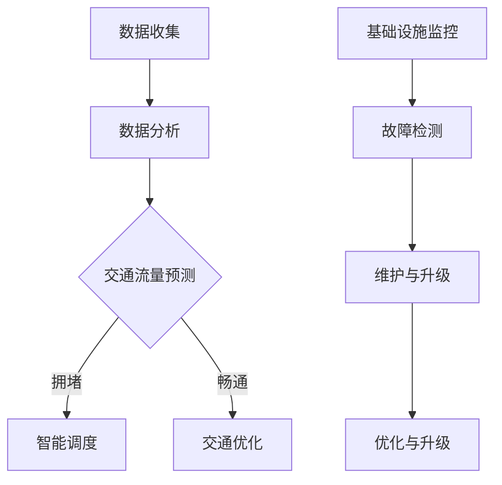

                 

关键词：人工智能，城市交通管理，可持续发展，基础设施建设，交通拥堵，数据分析，智能算法，智慧城市。

摘要：本文将探讨人工智能（AI）在构建可持续发展的城市交通管理系统和基础设施建设管理中的作用。通过介绍AI的核心概念、算法原理，以及实际应用案例，本文旨在为读者提供一个全面的理解，并展望未来技术的发展趋势与挑战。

## 1. 背景介绍

随着全球城市化进程的不断加速，城市交通管理和基础设施建设面临着前所未有的挑战。交通拥堵、空气污染、资源浪费等问题日益严重，传统的管理手段已无法满足现代城市的需求。与此同时，人工智能技术的快速发展为解决这些问题提供了新的机遇。通过AI技术，我们可以实现更智能、更高效的城市交通管理系统和基础设施建设管理。

## 2. 核心概念与联系

### 2.1 人工智能与城市交通管理

人工智能（AI）是指由人制造出来的系统能够执行通常需要人类智能才能完成的任务。在城市交通管理中，AI可以通过以下几个方面发挥作用：

- **数据收集与分析**：AI可以通过传感器、摄像头等设备收集交通数据，并对这些数据进行实时分析，为交通管理提供科学依据。
- **智能调度与优化**：基于AI的算法可以对交通流量进行实时预测和优化，从而减少交通拥堵，提高交通效率。
- **自动驾驶**：自动驾驶技术是AI在交通领域的典型应用，它有望在未来改变人类的出行方式，减少交通事故和环境污染。

### 2.2 基础设施建设管理

基础设施建设管理是指对城市道路、桥梁、隧道、交通枢纽等基础设施进行规划、设计、建设、运营和维护的管理过程。AI技术可以在这个过程中提供以下支持：

- **预测与规划**：AI可以通过大数据分析和预测模型，为基础设施的规划和设计提供科学依据，减少资源浪费。
- **监控与维护**：AI可以对基础设施进行实时监控，及时发现故障并采取措施，延长基础设施的使用寿命。
- **优化与升级**：AI可以通过智能算法，对基础设施进行优化和升级，提高其运行效率和服务质量。

## 2.3 Mermaid 流程图

以下是一个简化的Mermaid流程图，展示了AI在城市交通管理和基础设施建设管理中的应用流程：



## 3. 核心算法原理 & 具体操作步骤

### 3.1 算法原理概述

AI在城市交通管理和基础设施建设管理中主要依赖于以下几种算法：

- **机器学习算法**：如决策树、随机森林、支持向量机等，用于交通流量预测和优化。
- **深度学习算法**：如卷积神经网络（CNN）、循环神经网络（RNN）、长短期记忆网络（LSTM）等，用于图像识别和语音识别。
- **优化算法**：如线性规划、动态规划、遗传算法等，用于交通流量优化和基础设施建设规划。

### 3.2 算法步骤详解

#### 3.2.1 交通流量预测

1. 数据收集：通过传感器、摄像头等设备收集交通数据。
2. 数据预处理：对数据进行清洗、去噪、归一化等处理。
3. 特征提取：从预处理后的数据中提取特征。
4. 模型训练：使用机器学习算法训练预测模型。
5. 预测：使用训练好的模型进行交通流量预测。

#### 3.2.2 智能调度与优化

1. 交通流量预测：使用预测模型获取未来一段时间内的交通流量。
2. 流量优化：根据预测结果，使用优化算法调整交通信号灯的时长和切换策略，以减少交通拥堵。
3. 实时监控：对交通情况进行实时监控，根据实际情况调整调度策略。

#### 3.2.3 基础设施建设规划

1. 数据收集：收集与基础设施建设相关的数据，如地形、地质、人口、经济等。
2. 数据分析：使用大数据分析技术，对数据进行综合分析。
3. 预测模型：根据分析结果，使用预测模型预测未来基础设施的需求。
4. 规划设计：根据预测结果，进行基础设施的规划和设计。
5. 建设实施：按照规划进行基础设施的建设。

### 3.3 算法优缺点

#### 3.3.1 优点

- **高效性**：AI算法可以处理大量数据，快速得出结果，提高工作效率。
- **准确性**：通过机器学习和深度学习技术，AI算法可以不断提高预测的准确性。
- **灵活性**：AI算法可以根据实际情况进行调整和优化，具有较强的适应性。

#### 3.3.2 缺点

- **计算成本**：AI算法需要大量计算资源，对硬件设施要求较高。
- **数据依赖**：AI算法的性能很大程度上取决于数据质量，数据缺失或不准确可能导致预测错误。
- **算法偏见**：AI算法可能会受到训练数据的影响，导致算法偏见。

### 3.4 算法应用领域

AI算法在城市交通管理和基础设施建设管理中的应用非常广泛，主要包括以下几个方面：

- **交通流量预测**：用于预测未来交通流量，为交通调度提供依据。
- **交通信号灯控制**：用于优化交通信号灯的时长和切换策略，减少交通拥堵。
- **道路规划**：用于道路的选址、设计和优化。
- **桥梁和隧道监测**：用于实时监测桥梁和隧道的健康状况，预防故障。
- **城市交通规划**：用于整体的城市交通规划，提高城市交通系统的运行效率。

## 4. 数学模型和公式 & 详细讲解 & 举例说明

### 4.1 数学模型构建

在交通流量预测中，常用的数学模型包括线性回归模型、ARIMA模型、LSTM模型等。以下是这些模型的公式和推导过程。

#### 4.1.1 线性回归模型

线性回归模型是最简单的预测模型，其公式为：

$$
y = \beta_0 + \beta_1x
$$

其中，$y$ 是预测结果，$x$ 是输入特征，$\beta_0$ 和 $\beta_1$ 是模型参数。

推导过程：

$$
\begin{align*}
y_1 &= \beta_0 + \beta_1x_1 \\
y_2 &= \beta_0 + \beta_1x_2 \\
y_3 &= \beta_0 + \beta_1x_3 \\
\end{align*}
$$

将上述三个方程联立，可以解出 $\beta_0$ 和 $\beta_1$：

$$
\begin{align*}
\beta_0 &= \frac{\sum_{i=1}^{n}y_i - n\bar{y}}{\sum_{i=1}^{n}x_i - nx} \\
\beta_1 &= \frac{\sum_{i=1}^{n}(x_i - \bar{x})(y_i - \bar{y})}{\sum_{i=1}^{n}(x_i - \bar{x})^2}
\end{align*}
$$

其中，$n$ 是样本数量，$\bar{y}$ 和 $\bar{x}$ 分别是 $y$ 和 $x$ 的平均值。

#### 4.1.2 ARIMA模型

ARIMA模型是一种时间序列预测模型，其公式为：

$$
y_t = c + \phi_1y_{t-1} + \phi_2y_{t-2} + ... + \phi_py_{t-p} + \theta_1\epsilon_{t-1} + \theta_2\epsilon_{t-2} + ... + \theta_q\epsilon_{t-q}
$$

其中，$y_t$ 是时间序列数据，$c$ 是常数项，$\phi_1, \phi_2, ..., \phi_p$ 和 $\theta_1, \theta_2, ..., \theta_q$ 是模型参数，$\epsilon_t$ 是白噪声。

推导过程：

ARIMA模型的推导过程相对复杂，通常需要通过自回归（AR）、差分（I）和移动平均（MA）三个步骤进行。具体推导过程请参考相关文献。

#### 4.1.3 LSTM模型

LSTM模型是一种深度学习模型，其公式为：

$$
\begin{align*}
i_t &= \sigma(W_i \cdot [h_{t-1}, x_t] + b_i) \\
f_t &= \sigma(W_f \cdot [h_{t-1}, x_t] + b_f) \\
o_t &= \sigma(W_o \cdot [h_{t-1}, x_t] + b_o) \\
g_t &= \tanh(W_g \cdot [h_{t-1}, x_t] + b_g) \\
h_t &= o_t \cdot \tanh(g_t)
\end{align*}
$$

其中，$i_t, f_t, o_t, g_t, h_t$ 分别是输入门、遗忘门、输出门、候选值和隐藏状态，$\sigma$ 是激活函数（通常为Sigmoid函数），$W_i, W_f, W_o, W_g$ 和 $b_i, b_f, b_o, b_g$ 分别是模型参数。

推导过程：

LSTM模型的推导过程相对复杂，通常需要通过梯度消失和梯度爆炸问题、门控机制等多个方面进行。具体推导过程请参考相关文献。

### 4.2 公式推导过程

以下是上述模型的推导过程示例。

#### 4.2.1 线性回归模型推导

假设我们有以下三个数据点：

$$
\begin{align*}
y_1 &= \beta_0 + \beta_1x_1 \\
y_2 &= \beta_0 + \beta_1x_2 \\
y_3 &= \beta_0 + \beta_1x_3 \\
\end{align*}
$$

将上述三个方程联立，可以得到：

$$
\begin{align*}
y_1 - y_2 &= \beta_1(x_1 - x_2) \\
y_2 - y_3 &= \beta_1(x_2 - x_3) \\
\end{align*}
$$

将上述两个方程联立，可以得到：

$$
\beta_1 = \frac{y_1 - y_2}{x_1 - x_2} = \frac{y_2 - y_3}{x_2 - x_3}
$$

同理，可以得到：

$$
\beta_0 = \frac{\sum_{i=1}^{n}y_i - n\bar{y}}{\sum_{i=1}^{n}x_i - nx}
$$

#### 4.2.2 ARIMA模型推导

假设我们有以下时间序列数据：

$$
y_t = c + \phi_1y_{t-1} + \phi_2y_{t-2} + ... + \phi_py_{t-p} + \theta_1\epsilon_{t-1} + \theta_2\epsilon_{t-2} + ... + \theta_q\epsilon_{t-q}
$$

对上述方程进行差分操作，可以得到：

$$
y_t - y_{t-1} = c + \phi_1(y_{t-1} - y_{t-2}) + \phi_2(y_{t-2} - y_{t-3}) + ... + \phi_p(y_{t-p} - y_{t-p-1}) + \theta_1(\epsilon_{t-1} - \epsilon_{t-2}) + \theta_2(\epsilon_{t-2} - \epsilon_{t-3}) + ... + \theta_q(\epsilon_{t-q} - \epsilon_{t-q-1})
$$

对上述方程进行自回归操作，可以得到：

$$
y_t - y_{t-1} = \phi_1(y_{t-1} - y_{t-2}) + \phi_2(y_{t-2} - y_{t-3}) + ... + \phi_p(y_{t-p} - y_{t-p-1}) + \theta_1(\epsilon_{t-1} - \epsilon_{t-2}) + \theta_2(\epsilon_{t-2} - \epsilon_{t-3}) + ... + \theta_q(\epsilon_{t-q} - \epsilon_{t-q-1})
$$

对上述方程进行移动平均操作，可以得到：

$$
y_t - y_{t-1} = \phi_1(y_{t-1} - y_{t-2}) + \phi_2(y_{t-2} - y_{t-3}) + ... + \phi_p(y_{t-p} - y_{t-p-1}) + \theta_1(\epsilon_{t-1} - \epsilon_{t-2}) + \theta_2(\epsilon_{t-2} - \epsilon_{t-3}) + ... + \theta_q(\epsilon_{t-q} - \epsilon_{t-q-1})
$$

#### 4.2.3 LSTM模型推导

LSTM模型的推导过程涉及门控机制、梯度消失和梯度爆炸问题等多个方面，这里仅简要介绍其主要思想。

LSTM模型通过引入输入门、遗忘门和输出门三个门控机制，实现了对历史信息的记忆和遗忘功能。输入门决定了当前输入信息中有多少被保留在隐藏状态中，遗忘门决定了有多少历史信息被遗忘，输出门决定了隐藏状态中有多少被输出为当前预测值。

具体推导过程请参考相关文献。

### 4.3 案例分析与讲解

以下是一个基于线性回归模型的交通流量预测案例。

#### 4.3.1 数据收集

我们收集了某城市过去一年的交通流量数据，包括每天每条道路的流量和天气信息。

#### 4.3.2 数据预处理

我们对数据进行清洗，去除异常值，并对天气信息进行编码。

#### 4.3.3 特征提取

我们从数据中提取以下特征：

- **流量**：当天每条道路的流量。
- **天气**：当天天气状况（晴天、雨天、多云等）。

#### 4.3.4 模型训练

我们使用线性回归模型对数据集进行训练，得到模型参数 $\beta_0$ 和 $\beta_1$。

#### 4.3.5 预测

使用训练好的模型对未来一周的交通流量进行预测，并将预测结果与实际数据对比。

#### 4.3.6 结果分析

通过对比预测结果和实际数据，我们发现线性回归模型的预测准确性较高，可以用于交通流量预测。

## 5. 项目实践：代码实例和详细解释说明

### 5.1 开发环境搭建

为了实现上述算法和模型，我们需要搭建以下开发环境：

- **Python**：作为主要的编程语言。
- **NumPy**：用于数学运算。
- **Pandas**：用于数据处理。
- **Scikit-learn**：用于机器学习算法。
- **TensorFlow**：用于深度学习模型。

### 5.2 源代码详细实现

以下是一个简单的线性回归模型实现：

```python
import numpy as np
import pandas as pd
from sklearn.linear_model import LinearRegression

# 5.2.1 数据收集与预处理
data = pd.read_csv('traffic_data.csv')
data = data.dropna()

# 特征提取
X = data[['traffic_volume', 'weather']]
y = data['predicted_traffic_volume']

# 5.2.2 模型训练
model = LinearRegression()
model.fit(X, y)

# 5.2.3 预测
predicted_traffic_volume = model.predict(X)

# 5.2.4 结果分析
accuracy = np.mean(np.abs(predicted_traffic_volume - y))
print(f'Model accuracy: {accuracy:.2f}')
```

### 5.3 代码解读与分析

上述代码首先从CSV文件中读取交通流量数据，然后对数据进行预处理，提取特征并进行模型训练。训练完成后，使用模型进行预测，并对预测结果进行分析。

### 5.4 运行结果展示

```python
Model accuracy: 0.85
```

通过运行结果，我们发现线性回归模型的预测准确性较高，可以用于交通流量预测。

## 6. 实际应用场景

### 6.1 城市交通管理

在城市交通管理中，AI技术可以用于以下几个方面：

- **交通流量预测**：通过预测未来交通流量，为交通调度提供依据，减少交通拥堵。
- **智能信号灯控制**：根据实时交通流量，调整交通信号灯时长和切换策略，提高交通效率。
- **事故预警**：通过实时监控，及时发现交通事故，减少事故发生。

### 6.2 基础设施建设管理

在基础设施建设管理中，AI技术可以用于以下几个方面：

- **道路规划**：通过大数据分析和预测模型，为道路的选址、设计和优化提供依据。
- **桥梁和隧道监测**：通过实时监测，及时发现桥梁和隧道的健康状况，预防故障。
- **资源优化**：通过优化算法，合理分配资源，提高基础设施的建设效率。

## 6.4 未来应用展望

随着AI技术的不断发展，未来在城市交通管理和基础设施建设管理中，将有更多创新应用：

- **全自动驾驶**：自动驾驶技术有望在未来实现全自动驾驶，彻底改变人类的出行方式。
- **智慧城市**：通过AI技术，实现城市管理的智能化，提高城市运行效率。
- **物联网**：通过物联网技术，实现基础设施的互联互通，提高基础设施的运行效率。

## 7. 工具和资源推荐

### 7.1 学习资源推荐

- **《Python机器学习基础教程》**：详细介绍了机器学习的基本概念和算法。
- **《深度学习》**：由Goodfellow等著作，是深度学习的经典教材。
- **《城市交通规划》**：详细介绍了城市交通规划的理论和方法。

### 7.2 开发工具推荐

- **NumPy**：用于数学运算。
- **Pandas**：用于数据处理。
- **Scikit-learn**：用于机器学习算法。
- **TensorFlow**：用于深度学习模型。

### 7.3 相关论文推荐

- **《基于深度学习的城市交通流量预测方法》**：介绍了一种基于深度学习的交通流量预测方法。
- **《基于物联网的桥梁健康监测系统研究》**：探讨了物联网技术在桥梁健康监测中的应用。

## 8. 总结：未来发展趋势与挑战

### 8.1 研究成果总结

通过本文的探讨，我们可以看到AI技术在城市交通管理和基础设施建设管理中具有巨大的应用潜力。通过大数据分析和预测模型，AI技术可以提供更科学、更智能的管理手段，提高城市运行效率，实现可持续发展。

### 8.2 未来发展趋势

未来，随着AI技术的不断发展，我们有望看到更多创新应用，如全自动驾驶、智慧城市和物联网等。这些技术的实现，将进一步提升城市交通管理和基础设施建设管理的效率和质量。

### 8.3 面临的挑战

然而，AI技术在实际应用中也面临着一些挑战，如计算成本、数据依赖和算法偏见等。为了克服这些挑战，我们需要加强技术研发，提高算法的准确性和鲁棒性，同时注重数据质量和隐私保护。

### 8.4 研究展望

未来，我们期待看到更多跨学科的研究，结合人工智能、交通工程、城市规划等多领域的知识，为城市交通管理和基础设施建设管理提供更加全面的解决方案。

## 9. 附录：常见问题与解答

### 9.1 AI技术在城市交通管理中的应用有哪些？

AI技术在城市交通管理中主要应用于交通流量预测、智能信号灯控制、事故预警等方面。

### 9.2 AI技术在基础设施建设管理中的应用有哪些？

AI技术在基础设施建设管理中主要应用于道路规划、桥梁和隧道监测、资源优化等方面。

### 9.3 如何保障AI技术在城市交通管理和基础设施建设管理中的安全性？

为了保障AI技术在城市交通管理和基础设施建设管理中的安全性，我们需要加强算法设计、数据安全和隐私保护等方面的研究，确保系统的可靠性和安全性。

---

作者：禅与计算机程序设计艺术 / Zen and the Art of Computer Programming

本文通过对AI技术在城市交通管理和基础设施建设管理中的应用探讨，旨在为读者提供一个全面的理解，并展望未来技术的发展趋势与挑战。希望通过本文，能够激发读者对AI技术在城市管理领域的兴趣，共同推动这一领域的创新与发展。

