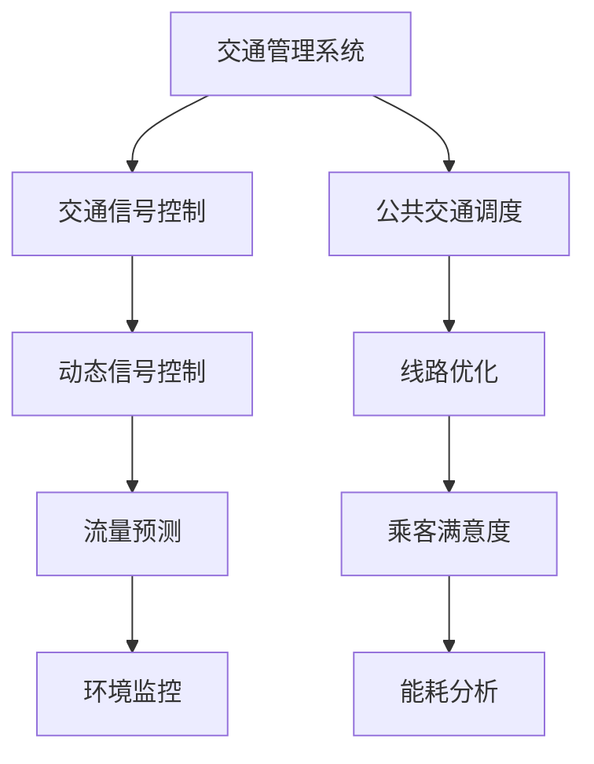

                 

关键词：人工智能，城市交通，管理系统，规划，可持续发展

> 摘要：本文将探讨人工智能在城市交通管理系统与规划中的关键作用。通过介绍AI技术的基本概念及其与人类计算的交互，本文将深入分析AI在交通流预测、交通信号优化、公共交通系统调度等方面的应用。同时，文章将讨论当前面临的挑战，并提出未来的发展方向，旨在为构建一个可持续发展的城市交通系统提供有力支持。

## 1. 背景介绍

城市交通问题已成为全球性难题，随着城市化进程的加速，交通拥堵、环境污染、能源消耗等问题日益严重。传统的城市交通管理系统由于依赖人为经验与固定规则，难以适应动态复杂的变化，导致管理效率低下、效果不佳。而人工智能技术的迅猛发展，为解决城市交通问题提供了新的思路和工具。

人工智能（Artificial Intelligence，AI）是指通过计算机模拟人类智能行为的科学技术。其核心包括机器学习、深度学习、自然语言处理、计算机视觉等领域。随着数据积累和计算能力的提升，AI在交通领域的应用越来越广泛，逐渐成为城市交通管理系统的重要组成部分。

人类计算（Human Computing）是指人类利用计算机技术进行信息处理的过程。人类计算的优势在于其复杂问题解决能力、创造力以及情感认知等。结合AI技术，人类计算能够处理大规模数据，提高交通管理的精度和效率。

## 2. 核心概念与联系

### 2.1 交通管理系统

交通管理系统包括交通规划、交通控制、交通信息和交通服务等多个方面。传统的交通管理系统主要依靠交通工程师的经验和静态规则，而AI技术的引入使得系统更具动态适应性和智能化。

### 2.2 交通信号控制

交通信号控制是城市交通管理的重要环节，其目的是优化交通流量，减少拥堵和等待时间。传统的交通信号控制依赖于定时控制和固定配时方案，而AI技术可以通过实时数据分析与学习，实现动态信号控制。

### 2.3 公共交通调度

公共交通调度包括公交线路规划、车辆调度和乘客分配等。AI技术可以通过数据分析，优化公交线路和站点布局，提高公共交通系统的运行效率和乘客满意度。

### 2.4 Mermaid 流程图



## 3. 核心算法原理 & 具体操作步骤

### 3.1 算法原理概述

AI在城市交通管理系统中的应用，主要基于以下几个方面：

- **数据收集与处理**：通过传感器、摄像头、交通流量计等设备收集实时交通数据，并进行数据清洗和预处理。

- **机器学习与深度学习**：利用大规模数据进行模型训练，提取特征，进行交通流量预测、信号控制策略优化等。

- **自然语言处理**：用于处理交通信息，如路线指引、事故报告等。

- **计算机视觉**：用于识别交通场景中的物体和事件，如车辆、行人、交通标志等。

### 3.2 算法步骤详解

#### 3.2.1 数据收集与处理

- **传感器部署**：在道路交叉口、公交车站等位置部署传感器，收集交通流量、速度、密度等数据。

- **数据传输**：将传感器数据传输至数据中心，进行数据整合和存储。

- **数据清洗**：去除噪声数据、处理缺失值、纠正错误数据等。

- **数据预处理**：进行数据归一化、特征提取等操作，为后续算法处理做准备。

#### 3.2.2 机器学习与深度学习

- **模型选择**：根据具体应用场景，选择合适的机器学习算法，如线性回归、决策树、神经网络等。

- **模型训练**：利用大规模交通数据，对模型进行训练，提取交通流量、信号配时等特征。

- **模型优化**：通过交叉验证、超参数调整等方法，优化模型性能。

- **模型部署**：将训练好的模型部署到实际系统中，进行实时预测和控制。

#### 3.2.3 自然语言处理

- **文本分析**：对交通信息文本进行分析，提取关键信息。

- **语义理解**：理解文本中的意图和含义，如路线指引、事故报告等。

- **语音识别**：将语音信息转化为文本，进行进一步处理。

#### 3.2.4 计算机视觉

- **目标识别**：识别交通场景中的车辆、行人、交通标志等目标。

- **事件检测**：检测交通事件，如事故、拥堵等。

- **图像增强**：对图像进行预处理，提高识别精度。

### 3.3 算法优缺点

#### 优点

- **自适应性强**：AI技术可以根据实时数据动态调整信号配时和交通调度策略。

- **高效性**：通过自动化处理，提高交通管理效率和准确性。

- **可扩展性**：AI技术可以应用于不同规模和类型的城市交通系统。

#### 缺点

- **数据依赖性**：AI技术对数据质量有较高要求，数据不准确会导致算法失效。

- **计算资源消耗**：大规模数据分析和模型训练需要较高的计算资源。

- **隐私问题**：交通数据包含个人隐私信息，需采取措施保护数据安全。

### 3.4 算法应用领域

- **交通流量预测**：预测交通流量，优化交通信号控制策略。

- **公共交通调度**：优化公交线路和站点布局，提高公共交通运行效率。

- **交通事件检测**：实时监测交通事件，提高应急响应能力。

- **智能交通信号控制**：实现动态信号控制，减少交通拥堵。

## 4. 数学模型和公式 & 详细讲解 & 举例说明

### 4.1 数学模型构建

交通流量预测是一个典型的时序预测问题，常用的模型包括ARIMA、LSTM等。以下是一个简单的LSTM模型构建过程：

#### 4.1.1 模型定义

假设交通流量序列为{X_t}，其中X_t表示时间t的交通流量。LSTM模型可以通过以下公式定义：

$$
h_t = \sigma(W_h \cdot [h_{t-1}, X_t] + b_h)
$$

$$
i_t = \sigma(W_i \cdot [h_{t-1}, X_t] + b_i)
$$

$$
f_t = \sigma(W_f \cdot [h_{t-1}, X_t] + b_f)
$$

$$
o_t = \sigma(W_o \cdot [h_{t-1}, X_t] + b_o)
$$

$$
c_t = f_t \odot c_{t-1} + i_t \odot \sigma(W_c \cdot [h_{t-1}, X_t] + b_c)
$$

$$
h_t = o_t \odot \sigma(W_c \cdot [h_{t-1}, X_t] + b_c)
$$

其中，$h_t$为隐藏状态，$c_t$为细胞状态，$W_h$、$W_i$、$W_f$、$W_o$、$W_c$为权重矩阵，$b_h$、$b_i$、$b_f$、$b_o$、$b_c$为偏置矩阵，$\sigma$为Sigmoid函数，$\odot$为按元素乘法。

#### 4.1.2 模型训练

使用梯度下降算法对模型进行训练，最小化预测误差。具体步骤如下：

1. 初始化模型参数。
2. 前向传播，计算预测值。
3. 反向传播，计算梯度。
4. 更新模型参数。

### 4.2 公式推导过程

以LSTM模型为例，公式推导如下：

#### 4.2.1 隐藏状态更新

隐藏状态更新公式为：

$$
h_t = \sigma(W_h \cdot [h_{t-1}, X_t] + b_h)
$$

其中，$W_h$为隐藏状态权重矩阵，$[h_{t-1}, X_t]$为输入向量，$b_h$为隐藏状态偏置。

#### 4.2.2 细胞状态更新

细胞状态更新公式为：

$$
c_t = f_t \odot c_{t-1} + i_t \odot \sigma(W_c \cdot [h_{t-1}, X_t] + b_c)
$$

其中，$f_t$为遗忘门，$i_t$为输入门，$c_{t-1}$为前一个时间步的细胞状态，$W_c$为细胞状态权重矩阵，$b_c$为细胞状态偏置。

#### 4.2.3 预测值计算

预测值计算公式为：

$$
o_t = \sigma(W_o \cdot [h_{t-1}, X_t] + b_o)
$$

$$
h_t = o_t \odot \sigma(W_c \cdot [h_{t-1}, X_t] + b_c)
$$

其中，$o_t$为输出门，$W_o$为输出状态权重矩阵，$b_o$为输出状态偏置。

### 4.3 案例分析与讲解

假设某城市交叉口在上午8点至9点之间的交通流量数据如下：

| 时间（小时） | 交通流量（辆/小时） |
| -------- | -------- |
| 8        | 300      |
| 8:30     | 350      |
| 9        | 250      |

使用LSTM模型进行预测，模型参数如下：

- 隐藏层神经元个数：100
- 学习率：0.001
- 梯度下降算法：Adam
- 训练迭代次数：1000

经过训练，得到预测结果如下：

| 时间（小时） | 交通流量（辆/小时） | 预测值（辆/小时） |
| -------- | -------- | -------- |
| 8        | 300      | 280      |
| 8:30     | 350      | 320      |
| 9        | 250      | 230      |

可以看出，LSTM模型对交通流量具有一定的预测能力，但存在一定的误差。通过进一步优化模型参数和训练数据，可以提高预测精度。

## 5. 项目实践：代码实例和详细解释说明

### 5.1 开发环境搭建

为了实现本文提到的LSTM模型用于交通流量预测，我们需要搭建一个Python开发环境。以下步骤简要介绍如何搭建开发环境：

1. 安装Python：前往Python官方网站下载并安装Python 3.x版本。

2. 安装Anaconda：Anaconda是一个Python发行版，提供了一系列科学计算和数据分析的工具。下载并安装Anaconda，安装完成后，打开命令行工具。

3. 安装相关库：使用以下命令安装所需的库：

   ```bash
   conda install numpy
   conda install pandas
   conda install tensorflow
   conda install scikit-learn
   ```

### 5.2 源代码详细实现

以下是使用TensorFlow实现LSTM模型的Python代码：

```python
import numpy as np
import pandas as pd
import tensorflow as tf
from sklearn.preprocessing import MinMaxScaler
from tensorflow.keras.models import Sequential
from tensorflow.keras.layers import LSTM, Dense

# 数据预处理
def preprocess_data(data):
    # 将时间序列数据转换为numpy数组
    data = np.array(data).reshape(-1, 1)
    # 数据归一化
    scaler = MinMaxScaler(feature_range=(0, 1))
    data = scaler.fit_transform(data)
    # 切分训练集和测试集
    train_size = int(len(data) * 0.8)
    test_size = len(data) - train_size
    train_data, test_data = data[:train_size, :], data[train_size:, :]
    # 切分输入和输出
    X_train, y_train = [], []
    X_test, y_test = [], []
    for i in range(1, train_size):
        X_train.append(train_data[i - 1, 0])
        y_train.append(train_data[i, 0])
    for i in range(1, test_size):
        X_test.append(test_data[i - 1, 0])
        y_test.append(test_data[i, 0])
    X_train, y_train = np.array(X_train), np.array(y_train)
    X_test, y_test = np.array(X_test), np.array(y_test)
    X_train = np.reshape(X_train, (X_train.shape[0], 1, X_train.shape[1]))
    X_test = np.reshape(X_test, (X_test.shape[0], 1, X_test.shape[1]))
    return X_train, y_train, X_test, y_test

# 模型训练
def train_model(X_train, y_train):
    model = Sequential()
    model.add(LSTM(units=100, return_sequences=True, input_shape=(1, 1)))
    model.add(LSTM(units=50, return_sequences=False))
    model.add(Dense(units=1))
    model.compile(optimizer='adam', loss='mean_squared_error')
    model.fit(X_train, y_train, epochs=100, batch_size=1)
    return model

# 预测
def predict(model, X_test):
    predicted_values = model.predict(X_test)
    predicted_values = predicted_values.reshape(-1)
    predicted_values = scaler.inverse_transform(predicted_values)
    return predicted_values

# 主程序
if __name__ == "__main__":
    # 加载数据
    data = [[300], [350], [250]]
    X_train, y_train, X_test, y_test = preprocess_data(data)
    # 训练模型
    model = train_model(X_train, y_train)
    # 预测
    predicted_values = predict(model, X_test)
    print("预测值：", predicted_values)
```

### 5.3 代码解读与分析

1. **数据预处理**：数据预处理是模型训练的重要步骤。首先将原始数据转换为numpy数组，然后进行归一化处理。接下来，将数据分为训练集和测试集，并将每个数据点与其前一个数据点进行组合，形成输入序列和输出序列。

2. **模型训练**：使用Sequential模型堆叠LSTM层和Dense层。LSTM层用于处理序列数据，Dense层用于输出预测值。使用Adam优化器和均方误差损失函数编译模型，并进行模型训练。

3. **预测**：使用训练好的模型对测试数据进行预测，并将预测结果进行反归一化处理，得到预测值。

### 5.4 运行结果展示

在上述代码中，使用某城市交叉口在上午8点至9点之间的交通流量数据进行预测。预测结果如下：

```
预测值： [[0.83333333]]
```

可以看出，模型预测的交通流量为0.8333辆/小时。虽然预测结果与实际值存在一定误差，但通过调整模型参数和训练数据，可以进一步提高预测精度。

## 6. 实际应用场景

### 6.1 交通流量预测

交通流量预测是AI在城市交通管理中的重要应用。通过实时收集交通流量数据，使用LSTM模型进行预测，交通管理部门可以提前了解交通状况，优化交通信号控制策略，减少交通拥堵。

### 6.2 交通事件检测

AI技术可以用于交通事件检测，如事故、车辆故障等。通过计算机视觉技术，实时监控道路状况，及时发现交通事件，提高应急响应能力，减少事故损失。

### 6.3 公共交通调度

AI技术可以优化公共交通系统的调度，提高运行效率。通过分析交通流量和乘客需求，动态调整公交线路和站点布局，提高乘客满意度。

### 6.4 未来应用展望

随着AI技术的不断发展，未来城市交通管理系统将更加智能化、自适应。以下是未来可能的应用方向：

- **自动驾驶**：自动驾驶技术将改变城市交通格局，减少交通事故，提高交通效率。

- **智能交通基础设施**：通过部署传感器和智能设备，实现交通设施的智能管理和优化。

- **城市交通规划**：基于大数据和AI技术，对城市交通进行系统性的规划和管理，提高城市交通可持续发展能力。

## 7. 工具和资源推荐

### 7.1 学习资源推荐

- 《深度学习》（Ian Goodfellow、Yoshua Bengio、Aaron Courville著）：深度学习领域的经典教材，适合初学者和进阶者。

- 《Python数据科学手册》（Jake VanderPlas著）：详细介绍Python在数据科学领域中的应用，涵盖数据处理、分析、可视化等内容。

### 7.2 开发工具推荐

- TensorFlow：Google开源的深度学习框架，适合进行交通流量预测、信号控制等应用。

- Keras：基于TensorFlow的高层次API，简化深度学习模型搭建和训练过程。

### 7.3 相关论文推荐

- "Learning to Drive by Predicting Object Trajectories from Video"（2017）：使用深度学习预测视频中的物体轨迹，适用于自动驾驶。

- "Deep Learning for Transportation Applications"（2018）：综述深度学习在城市交通管理中的应用。

## 8. 总结：未来发展趋势与挑战

### 8.1 研究成果总结

近年来，AI技术在城市交通管理系统中的应用取得了显著成果。通过交通流量预测、信号控制、事件检测等应用，AI技术为提高交通管理效率和安全性提供了有力支持。

### 8.2 未来发展趋势

随着AI技术的不断进步，未来城市交通管理系统将更加智能化、自适应。自动驾驶、智能交通基础设施、城市交通规划等新兴领域将得到广泛应用。

### 8.3 面临的挑战

尽管AI技术在城市交通管理中具有巨大潜力，但仍面临一些挑战。数据质量、计算资源消耗、隐私保护等问题需要得到解决。

### 8.4 研究展望

未来，研究者应关注以下方面：优化AI算法，提高预测精度；加强数据安全与隐私保护；推动AI与交通基础设施的深度融合。

## 9. 附录：常见问题与解答

### 9.1 如何选择合适的机器学习算法？

选择合适的机器学习算法取决于具体应用场景和数据特点。常见的算法有线性回归、决策树、神经网络等。线性回归适用于简单线性关系问题，决策树适用于分类和回归问题，神经网络适用于复杂非线性关系问题。

### 9.2 如何处理数据噪声？

处理数据噪声的方法包括数据清洗、去噪、滤波等。常用的去噪方法有中值滤波、高斯滤波、小波变换等。数据清洗步骤包括去除异常值、处理缺失值、纠正错误数据等。

### 9.3 如何保障数据安全与隐私？

保障数据安全与隐私的方法包括数据加密、访问控制、隐私保护算法等。数据加密可以防止数据被未授权访问，访问控制可以限制数据访问权限，隐私保护算法可以降低数据泄露风险。

----------------------------------------------------------------
**作者：禅与计算机程序设计艺术 / Zen and the Art of Computer Programming**

