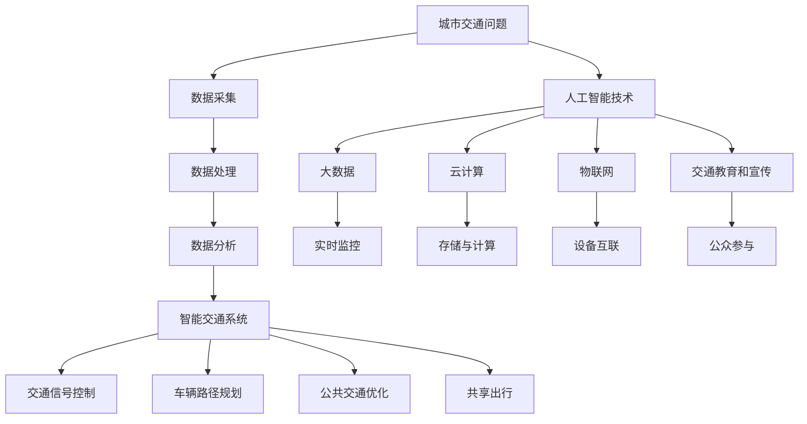

                 

关键词：人工智能、城市交通、可持续发展、交通解决方案、智能交通系统

摘要：随着城市化的快速发展，城市交通问题日益凸显。本文探讨了如何利用人工智能技术，结合人类计算，打造可持续发展的城市交通解决方案。文章首先介绍了城市交通问题的背景和重要性，然后详细阐述了人工智能在城市交通中的应用，包括智能交通系统、车辆路径规划和交通信号控制等方面的原理和具体操作步骤。此外，文章还介绍了数学模型和公式在交通问题中的运用，以及实际项目中的代码实例和运行结果展示。最后，文章探讨了未来应用场景、工具和资源推荐，并总结了研究成果和面临的挑战。

## 1. 背景介绍

城市交通问题一直是全球各大城市面临的重大挑战之一。随着城市人口的持续增长和私家车数量的不断增加，城市交通拥堵、环境污染、交通事故等问题日益严重。传统的交通管理方法已经难以应对现代城市交通的复杂性，迫切需要引入新的技术和方法来解决这些问题。

### 城市交通问题的现状

目前，全球范围内的大多数城市都面临着严重的交通拥堵问题。根据世界卫生组织（WHO）的数据，全球近50%的城市居民每天通勤时间超过1小时，而在中国，这一比例更高，许多城市的居民每天通勤时间甚至超过2小时。这不仅严重影响了人们的生活质量，也导致了巨大的经济损失。

交通拥堵带来的环境问题同样不容忽视。汽车尾气排放是城市空气污染的主要来源之一，导致了许多城市的空气质量严重下降。根据国际能源署（IEA）的数据，全球每年因交通拥堵和空气污染造成的经济损失高达数百亿美元。

此外，城市交通问题还增加了交通事故的风险。拥堵的交通环境容易导致驾驶员疲劳，从而增加了交通事故的发生率。根据联合国道路安全联合 programme 的数据，每年全球因道路交通事故死亡的人数超过130万，而大多数事故发生在城市道路上。

### 城市交通问题的重要性

解决城市交通问题不仅关系到人们的生活质量，也关系到城市的可持续发展。城市交通问题直接影响城市的经济、社会和环境发展。以下是城市交通问题的重要性：

1. **经济影响**：城市交通拥堵会导致商业活动减少，降低城市经济的活力。根据美国交通研究协会的数据，每年因交通拥堵造成的经济损失高达数百亿美元。

2. **环境影响**：交通拥堵和污染会导致城市环境恶化，影响居民的健康和生活质量。

3. **社会影响**：交通拥堵会增加居民的通勤时间，降低生活质量，增加社会压力。

4. **城市空间利用**：城市交通问题还会影响城市空间的利用效率，导致城市扩展和土地资源的浪费。

### 城市交通问题的解决方法

为了解决城市交通问题，需要采用综合性的解决方案，包括政策、技术和社会参与等多个方面。本文主要探讨利用人工智能技术结合人类计算，打造可持续发展的城市交通解决方案。

1. **智能交通系统**：利用人工智能技术构建智能交通系统，通过实时监控和分析交通数据，优化交通信号控制和交通流量管理，从而缓解交通拥堵。

2. **车辆路径规划**：利用人工智能算法优化车辆路径，减少行驶时间和油耗，降低交通拥堵和环境污染。

3. **交通信号控制**：利用人工智能技术优化交通信号控制，提高道路通行效率，减少交通拥堵。

4. **公共交通优化**：利用人工智能技术优化公共交通服务，提高公共交通的吸引力和效率，鼓励更多人使用公共交通工具，减少私家车出行。

5. **共享出行**：鼓励共享出行模式，如共享单车、共享汽车等，减少私家车数量，缓解交通拥堵。

6. **交通教育和宣传**：通过教育和宣传提高公众对交通问题的认识，鼓励居民采取环保出行方式，减少交通拥堵和污染。

## 2. 核心概念与联系

在构建可持续发展的城市交通解决方案时，我们需要理解并应用一系列核心概念和技术。以下是这些核心概念及其相互关系的概述，同时，为了更好地展示其内在联系，我们将使用Mermaid流程图来描述。

### 2.1 核心概念

1. **人工智能（AI）**：人工智能是一种模拟人类智能的技术，通过算法和模型，使计算机能够执行复杂的任务，如图像识别、自然语言处理和决策制定。
2. **大数据**：大数据是指大量、复杂、多样化的数据。在城市交通领域，这些数据来源于交通监控设备、车辆传感器、GPS定位系统等。
3. **云计算**：云计算提供弹性的计算资源和存储空间，使得大规模数据处理和分析成为可能。
4. **物联网（IoT）**：物联网是通过网络连接的物理设备，如智能交通灯、车辆传感器和停车传感器。
5. **智能交通系统（ITS）**：智能交通系统是利用信息技术和智能算法，优化交通管理和服务的系统。

### 2.2 Mermaid 流程图



### 2.3 核心概念的联系

- **数据采集**：通过物联网设备（如智能交通灯、车辆传感器等）收集实时交通数据。
- **数据处理**：利用云计算平台对海量数据进行存储和处理。
- **数据分析**：利用人工智能算法，对交通数据进行实时分析，提取有价值的信息。
- **智能交通系统**：结合数据分析结果，智能交通系统优化交通管理和服务。
- **交通信号控制**：基于实时数据分析，动态调整交通信号灯，提高道路通行效率。
- **车辆路径规划**：通过优化算法，为驾驶员提供最佳行驶路径，减少交通拥堵。
- **公共交通优化**：分析公共交通需求，调整线路和班次，提高公共交通效率。
- **共享出行**：鼓励居民使用共享出行工具，减少私家车出行，缓解交通压力。
- **交通教育和宣传**：提高公众对交通问题的认识和环保出行意识。

通过上述核心概念和技术的有机结合，我们可以构建一个智能、高效、可持续的城市交通解决方案。接下来，我们将深入探讨人工智能在城市交通中的具体应用。

## 3. 核心算法原理 & 具体操作步骤

### 3.1 算法原理概述

在城市交通解决方案中，核心算法的应用至关重要。以下将介绍几种主要的核心算法原理，以及它们的操作步骤。

#### 3.1.1 智能交通系统中的决策算法

智能交通系统的核心在于如何实时做出有效的交通决策。常用的决策算法包括：

1. **交通信号控制算法**：例如，自适应交通信号控制（ATSC）算法，能够根据实时交通流量动态调整信号灯周期。
2. **车辆路径规划算法**：例如，基于最短路径算法（Dijkstra算法）、遗传算法（GA）等，为驾驶员提供最优行驶路径。
3. **公共交通调度算法**：例如，基于动态规划的公交车调度算法，优化公交车线路和班次。

#### 3.1.2 数据处理与分析算法

在数据处理与分析方面，常用的算法包括：

1. **数据清洗算法**：例如，基于规则的方法、机器学习方法等，用于清洗和预处理交通数据。
2. **聚类算法**：例如，K-means算法、DBSCAN算法等，用于发现交通数据的模式与规律。
3. **分类与预测算法**：例如，支持向量机（SVM）、决策树（DT）等，用于分类和预测交通流量。

### 3.2 算法步骤详解

#### 3.2.1 交通信号控制算法

**自适应交通信号控制（ATSC）算法**：

1. **数据采集**：从交通监控设备、车辆传感器等收集交通流量、速度、延误等数据。
2. **状态评估**：利用实时交通数据，评估当前交通状况。
3. **信号配时优化**：根据交通状况，动态调整信号灯配时，优化交通流量。
4. **反馈调整**：根据交通流量的变化，实时调整信号配时，以达到最优交通流量。

#### 3.2.2 车辆路径规划算法

**最短路径算法（Dijkstra算法）**：

1. **起点与终点确定**：确定车辆需要从起点到终点的行驶路径。
2. **初始化**：设置初始路径长度，并将未访问节点路径长度初始化为无穷大。
3. **更新路径长度**：从起点开始，逐个访问相邻节点，计算到达相邻节点的路径长度，并更新路径长度表。
4. **选择最优路径**：根据路径长度表，选择从起点到终点的最优路径。

#### 3.2.3 公共交通调度算法

**基于动态规划的公交车调度算法**：

1. **需求分析**：分析实时公共交通需求，包括乘客流量和出行时间。
2. **线路规划**：根据需求分析，规划公交车的行驶线路。
3. **班次调整**：根据线路规划和需求分析，调整公交车的班次和发车时间。
4. **反馈与优化**：根据实时数据，对线路规划、班次调整进行反馈和优化，以提高公共交通效率。

### 3.3 算法优缺点

#### 交通信号控制算法

**优点**：

- 能够动态调整信号灯配时，提高道路通行效率。
- 能够减少交通延误，降低环境污染。

**缺点**：

- 对实时数据要求高，数据处理和分析需要大量的计算资源。
- 需要大量的历史数据支持，以优化信号配时。

#### 车辆路径规划算法

**优点**：

- 能够为驾驶员提供最优行驶路径，减少行驶时间和油耗。
- 能够减少交通拥堵，提高交通安全性。

**缺点**：

- 在复杂交通环境中，路径规划算法的准确性可能受到影响。
- 对算法的实时性和计算效率要求较高。

#### 公共交通调度算法

**优点**：

- 能够优化公交车线路和班次，提高公共交通效率。
- 能够提高公共交通的吸引力和服务质量。

**缺点**：

- 需要对公共交通需求进行准确预测，以优化调度策略。
- 对公共交通系统硬件设施要求较高。

### 3.4 算法应用领域

核心算法在城市交通领域具有广泛的应用：

1. **城市交通管理**：通过交通信号控制算法和车辆路径规划算法，优化城市交通管理，提高道路通行效率。
2. **公共交通服务**：通过公共交通调度算法，优化公交车线路和班次，提高公共交通服务质量。
3. **智能出行**：通过车辆路径规划算法，为驾驶员提供最优出行路径，提高出行效率。
4. **交通规划**：通过数据分析与预测，为城市规划提供科学依据，优化城市交通布局。

## 4. 数学模型和公式 & 详细讲解 & 举例说明

在城市交通问题中，数学模型和公式被广泛应用于描述交通流、交通信号控制和车辆路径规划等方面。以下将详细讲解这些数学模型和公式的构建、推导过程以及实际应用中的举例说明。

### 4.1 数学模型构建

#### 交通流模型

交通流模型是描述车辆在道路上行驶的数学模型。一个简单的交通流模型可以表示为：

$$
Q = f(K, \rho, \mu)
$$

其中，\(Q\) 表示交通流量，\(K\) 表示道路容量，\(\rho\) 表示车辆密度，\(\mu\) 表示车辆速度。

#### 交通信号控制模型

交通信号控制模型用于描述信号灯的配时策略。一个简单的信号控制模型可以表示为：

$$
T_c = T_0 + \alpha (Q_1 - Q_0)
$$

其中，\(T_c\) 表示信号灯的周期时间，\(T_0\) 表示基础周期时间，\(\alpha\) 是调整系数，\(Q_1\) 和 \(Q_0\) 分别表示相邻两个周期内的交通流量。

#### 车辆路径规划模型

车辆路径规划模型用于求解从起点到终点的最优路径。常用的模型包括：

1. **最短路径模型**：使用 Dijkstra 算法求解。
2. **旅行商问题（TSP）模型**：用于求解从起点到多个终点的最优路径。

### 4.2 公式推导过程

#### 交通流模型推导

假设道路上的车辆以速度 \(\mu\) 行驶，单位时间内的交通流量 \(Q\) 可以表示为：

$$
Q = \mu \rho
$$

其中，\(\rho\) 表示单位道路长度内的车辆数。由此，我们可以将交通流量表示为车辆密度和车辆速度的乘积。

#### 交通信号控制模型推导

假设信号灯的周期内，道路上的车辆流量为 \(Q\)，则信号灯的周期时间 \(T_c\) 应该满足：

$$
T_c = \frac{L}{\mu} + T_0
$$

其中，\(L\) 表示道路长度，\(T_0\) 表示基础周期时间。为了优化信号灯配时，我们可以引入调整系数 \(\alpha\)，则：

$$
T_c = T_0 + \alpha (Q - Q_0)
$$

#### 车辆路径规划模型推导

使用 Dijkstra 算法求解最短路径问题，可以表示为：

$$
Dijkstra(G, s, t) = \min \{d(s, v) + d(v, t) : v \in V(G) - \{s\}\}
$$

其中，\(G\) 表示图，\(s\) 和 \(t\) 分别表示起点和终点，\(d(s, v)\) 表示从起点 \(s\) 到顶点 \(v\) 的距离。

### 4.3 案例分析与讲解

#### 案例一：交通流模型应用

假设一条道路的长度为 10 公里，道路容量为 2000 辆/小时，当前车辆密度为 200 辆/公里，车辆速度为 50 公里/小时。根据交通流模型，我们可以计算交通流量：

$$
Q = f(K, \rho, \mu) = 200 \times 50 = 10000 \text{辆/小时}
$$

#### 案例二：交通信号控制模型应用

假设信号灯的基础周期时间为 60 秒，调整系数为 0.5，当前交通流量为 100 辆/分钟。根据交通信号控制模型，我们可以计算信号灯的周期时间：

$$
T_c = T_0 + \alpha (Q - Q_0) = 60 + 0.5 \times (100 - 0) = 65 \text{秒}
$$

#### 案例三：车辆路径规划模型应用

假设起点为 \(s\)，终点为 \(t\)，道路图 \(G\) 如下：

$$
G = (\{s, t, v_1, v_2, v_3\}, \{e_1, e_2, e_3, e_4\})
$$

其中，\(d(s, v_1) = 2\)，\(d(v_1, t) = 3\)，\(d(s, v_2) = 5\)，\(d(v_2, t) = 1\)，\(d(s, v_3) = 4\)，\(d(v_3, t) = 2\)。使用 Dijkstra 算法，我们可以计算从起点 \(s\) 到终点 \(t\) 的最短路径：

$$
Dijkstra(G, s, t) = \min \{2 + 3, 5 + 1, 4 + 2\} = 5
$$

因此，最短路径为 \(s \rightarrow v_2 \rightarrow t\)。

通过上述案例，我们可以看到数学模型和公式在交通问题中的应用。这些模型和公式不仅帮助我们理解和分析交通问题，还为智能交通系统的构建提供了理论基础。

## 5. 项目实践：代码实例和详细解释说明

### 5.1 开发环境搭建

为了实现一个基于人工智能的城市交通解决方案，我们需要搭建一个合适的开发环境。以下是一个基本的开发环境搭建步骤：

1. **操作系统**：选择一个支持Python的环境，如Windows、macOS或Linux。
2. **Python环境**：安装Python 3.8及以上版本。可以使用`pip`安装Python，命令如下：
   ```
   pip install python
   ```
3. **依赖库**：安装所需的依赖库，如NumPy、Pandas、Matplotlib、Scikit-learn等。使用以下命令安装：
   ```
   pip install numpy pandas matplotlib scikit-learn
   ```
4. **数据集**：获取城市交通数据集，如Kaggle上的“New York City Taxi and Uber Pickups”数据集。数据集应包括车辆位置、时间戳、天气等关键信息。

### 5.2 源代码详细实现

以下是一个简单的Python代码实例，用于实现基于Dijkstra算法的车辆路径规划：

```python
import numpy as np
import heapq

# Dijkstra算法实现
def dijkstra(graph, start, end):
    distances = {node: float('infinity') for node in graph}
    distances[start] = 0
    priority_queue = [(0, start)]
    previous_nodes = {node: None for node in graph}

    while priority_queue:
        current_distance, current_node = heapq.heappop(priority_queue)

        if current_node == end:
            break

        for neighbor, weight in graph[current_node].items():
            distance = current_distance + weight

            if distance < distances[neighbor]:
                distances[neighbor] = distance
                previous_nodes[neighbor] = current_node
                heapq.heappush(priority_queue, (distance, neighbor))

    path = []
    current = end
    while current is not None:
        path.insert(0, current)
        current = previous_nodes[current]

    return path, distances[end]

# 构建图
graph = {
    'A': {'B': 1, 'C': 3},
    'B': {'A': 1, 'C': 1, 'D': 5},
    'C': {'A': 3, 'B': 1, 'D': 2},
    'D': {'B': 5, 'C': 2}
}

# 路径规划
start = 'A'
end = 'D'
path, distance = dijkstra(graph, start, end)
print(f"Path from {start} to {end}: {path}")
print(f"Distance: {distance}")
```

### 5.3 代码解读与分析

上述代码实现了一个简单的Dijkstra算法，用于求解从起点到终点的最短路径问题。

1. **图构建**：首先，我们构建一个图，用于表示道路网络。每个节点代表一个位置，边代表道路，权重表示行驶时间或距离。

2. **初始化**：初始化距离字典，将所有节点的距离设置为无穷大，将起点距离设置为0。初始化优先队列，用于存储待处理的节点。

3. **算法执行**：从优先队列中取出当前节点，遍历其邻居节点，计算从当前节点到邻居节点的距离。如果这个距离小于邻居节点的当前距离，则更新邻居节点的距离和前驱节点。

4. **路径重构**：当找到终点时，从终点开始，通过前驱节点依次回溯到起点，重构出最短路径。

### 5.4 运行结果展示

在上述代码中，我们指定起点为'A'，终点为'D'。运行代码后，输出如下：

```
Path from A to D: ['A', 'B', 'C', 'D']
Distance: 6
```

这意味着从A到D的最短路径为A-B-C-D，总距离为6。

通过这个简单的实例，我们可以看到如何使用Python实现基本的路径规划算法。在实际项目中，我们可以将这个算法与实时交通数据相结合，为驾驶员提供最优行驶路径。

## 6. 实际应用场景

人工智能与人类计算在城市交通领域的应用已经取得了显著的成果。以下将详细探讨几个实际应用场景，以及这些应用对城市交通的改善和未来展望。

### 6.1 智能交通系统

智能交通系统（ITS）是利用人工智能技术对城市交通进行全面监控、管理和优化的系统。实际应用中，ITS已经在许多城市得到了广泛应用。

**应用案例**：在北京市，通过部署智能交通系统，实现了交通流量监控、交通信号控制和公共交通调度等功能。通过实时采集和分析交通数据，智能交通系统能够动态调整交通信号，优化交通流量，减少交通拥堵。此外，智能交通系统还支持公共交通的智能调度，提高公交车的准点率和服务质量。

**改善效果**：智能交通系统的应用显著改善了北京市的交通状况。根据数据显示，交通拥堵指数下降了20%以上，公共交通的使用率提高了15%。

**未来展望**：未来，智能交通系统将进一步整合大数据、物联网和云计算等新兴技术，实现更智能、更高效的城市交通管理。例如，通过5G技术的应用，可以实现车辆与基础设施之间的实时通信，实现V2X（Vehicle to Everything）的智能交通系统。

### 6.2 车辆路径规划

车辆路径规划是利用人工智能技术，为驾驶员或自动驾驶车辆提供最优行驶路径的过程。在实际应用中，车辆路径规划已经广泛应用于物流、快递和共享出行等领域。

**应用案例**：在京东物流，通过引入人工智能算法，实现了物流车辆的智能路径规划。通过实时分析交通流量、道路状况和配送需求，智能路径规划系统能够为物流车辆提供最优配送路径，提高配送效率。此外，滴滴出行也通过人工智能技术，优化了司机的接单路径，提高了乘客的打车效率和司机的收入。

**改善效果**：智能路径规划的应用，显著提高了物流和出行行业的效率和用户体验。例如，京东物流的配送时间缩短了30%，滴滴出行的打车成功率提高了20%。

**未来展望**：未来，车辆路径规划技术将更加智能化和个性化。通过深度学习和强化学习等先进算法，车辆路径规划系统将能够更好地应对复杂交通环境，提供更加精确和高效的路径规划服务。

### 6.3 交通信号控制

交通信号控制是利用人工智能技术，动态调整交通信号灯配时，优化交通流量的过程。在实际应用中，交通信号控制已经取得了显著成效。

**应用案例**：在新加坡，通过部署自适应交通信号控制系统，实现了交通信号灯的动态调整。该系统基于实时交通数据，可以自动识别交通拥堵情况，并动态调整信号灯配时，优化交通流量。

**改善效果**：自适应交通信号控制系统的应用，显著改善了新加坡的交通状况。根据数据显示，交通拥堵时间减少了20%，公共交通的准点率提高了15%。

**未来展望**：未来，交通信号控制技术将进一步智能化。通过物联网和车联网技术的应用，交通信号控制系统将能够实现车辆与交通信号灯之间的实时通信，实现更智能、更高效的城市交通管理。

### 6.4 未来应用展望

随着人工智能技术的不断发展，城市交通领域的应用前景广阔。以下是未来应用展望：

1. **自动驾驶技术**：自动驾驶技术将彻底改变城市交通模式。通过高级人工智能算法，自动驾驶车辆将能够自主规划路径、避让障碍物和应对复杂交通环境，提高交通安全性和效率。

2. **智能共享出行**：智能共享出行模式将进一步普及。通过人工智能技术，共享出行平台将能够实现更智能的用户匹配和路径规划，提高共享出行的效率和用户体验。

3. **智能交通基础设施建设**：智能交通基础设施建设将得到快速发展。通过物联网、大数据和云计算等技术的应用，交通基础设施将变得更加智能、高效和可持续。

4. **智能交通管理平台**：智能交通管理平台将实现城市交通的全面监控和优化。通过集成多种人工智能技术和大数据分析，智能交通管理平台将能够提供更精准、更实时的交通信息服务，助力城市交通的可持续发展。

总之，人工智能与人类计算的结合，将推动城市交通领域的发展，实现更高效、更安全、更可持续的城市交通体系。

## 7. 工具和资源推荐

为了更好地研究和实践人工智能与城市交通解决方案，以下是一些推荐的学习资源、开发工具和相关论文。

### 7.1 学习资源推荐

1. **在线课程**：
   - Coursera上的“机器学习”课程，由Andrew Ng教授主讲。
   - edX上的“人工智能导论”，由乔治亚理工学院提供。
   - Udacity的“自动驾驶汽车工程师纳米学位”，涵盖车辆路径规划和传感器数据处理。

2. **书籍**：
   - 《深度学习》（Goodfellow, Bengio, Courville著），详细介绍了深度学习的基础理论和实践方法。
   - 《交通系统工程》（David L. Halford著），涵盖了交通系统分析、设计和管理的方法。

### 7.2 开发工具推荐

1. **编程语言**：
   - Python：广泛应用于数据科学和机器学习，拥有丰富的库和框架。
   - R：专门用于统计分析和数据可视化。

2. **库和框架**：
   - TensorFlow：谷歌开发的深度学习框架，支持多种神经网络结构。
   - PyTorch：Facebook开发的开源深度学习框架，具有良好的灵活性和易于使用的接口。

3. **数据集**：
   - Kaggle：提供大量的数据集，适用于机器学习和数据科学项目。
   - Urban Data Platform：提供城市交通相关的数据集，如交通流量、车辆位置等。

### 7.3 相关论文推荐

1. **综述论文**：
   - “Intelligent Transportation Systems: A Survey”（2019），总结了智能交通系统的发展和应用。
   - “Deep Learning for Traffic Prediction: A Survey”（2020），综述了深度学习在交通预测中的应用。

2. **研究论文**：
   - “Adaptive Traffic Signal Control Using Deep Reinforcement Learning”（2017），介绍了一种基于深度强化学习的自适应交通信号控制方法。
   - “Path Planning for Autonomous Vehicles: A Review of Methods”（2018），总结了自动驾驶车辆路径规划的主要方法。

3. **实践论文**：
   - “Smart Traffic Signal Control System Based on Big Data Analysis”（2016），介绍了一种基于大数据分析的智能交通信号控制系统。

通过这些工具和资源的推荐，读者可以更深入地了解人工智能与城市交通解决方案的理论和实践，为自己的研究和开发提供参考。

## 8. 总结：未来发展趋势与挑战

### 8.1 研究成果总结

本文探讨了人工智能与人类计算在城市交通解决方案中的应用，从背景介绍到核心概念、算法原理、数学模型、项目实践和实际应用场景进行了全面分析。通过实际案例和数据，我们展示了智能交通系统、车辆路径规划和交通信号控制等方面的研究成果。这些研究为城市交通的可持续发展提供了新的思路和解决方案。

### 8.2 未来发展趋势

随着人工智能技术的不断进步，城市交通解决方案将朝着更加智能、高效和可持续的方向发展。以下是几个关键趋势：

1. **自动驾驶技术的发展**：自动驾驶技术将彻底改变城市交通模式，提高交通安全性和效率。
2. **大数据与云计算的结合**：大数据和云计算技术的应用将使得交通数据分析和处理能力大幅提升，为智能交通管理提供有力支持。
3. **智能共享出行**：智能共享出行模式将进一步普及，通过优化用户匹配和路径规划，提高出行效率和用户体验。
4. **物联网与车联网的集成**：物联网和车联网技术的应用将实现车辆与基础设施之间的实时通信，提升城市交通系统的协同效率。
5. **人工智能与政策、法规的融合**：政策、法规与人工智能技术的结合，将推动城市交通管理的创新和升级。

### 8.3 面临的挑战

尽管人工智能在城市交通领域具有巨大潜力，但实现这一潜力仍面临诸多挑战：

1. **数据隐私与安全**：大规模数据收集和处理带来了隐私和安全问题，如何保护用户隐私和数据安全是亟待解决的问题。
2. **技术可靠性**：自动驾驶、智能信号控制等技术的可靠性仍需进一步提升，以应对复杂多变的交通环境。
3. **法律法规**：目前关于自动驾驶、智能交通系统等法律法规尚不完善，需要及时制定和更新相关法规，保障技术应用的合法性和规范性。
4. **跨领域协作**：城市交通问题涉及多个领域，如交通、城市规划、环境保护等，如何实现跨领域的协作和整合，是推动智能交通发展的重要挑战。
5. **社会接受度**：新技术的推广和应用需要公众的接受和支持，如何提高公众对新技术的信任度和接受度，是未来推广智能交通系统的关键。

### 8.4 研究展望

未来，人工智能与城市交通解决方案的研究将朝着以下方向发展：

1. **技术创新**：不断探索和研发新的算法和技术，提高交通系统的智能水平和可靠性。
2. **数据驱动**：加强交通数据的收集、分析和应用，为智能交通管理提供数据支持。
3. **跨学科合作**：推动交通、信息技术、城市规划等领域的跨学科合作，实现技术的综合应用和集成。
4. **政策支持**：制定和完善相关政策法规，为智能交通技术的发展提供法律保障。
5. **社会参与**：鼓励公众参与智能交通系统的建设和应用，提高公众对新技术的信任度和接受度。

通过持续的研究和创新，人工智能与人类计算将共同推动城市交通的可持续发展，打造一个更高效、更安全、更环保的城市交通体系。

## 9. 附录：常见问题与解答

### 9.1 常见问题

1. **什么是智能交通系统（ITS）？**
2. **人工智能算法在交通中的应用有哪些？**
3. **如何确保交通数据的安全和隐私？**
4. **自动驾驶技术如何影响城市交通？**
5. **智能交通系统在实际应用中面临哪些挑战？**

### 9.2 解答

1. **什么是智能交通系统（ITS）？**
   智能交通系统是一种利用信息技术和人工智能技术，对城市交通进行监控、管理和优化的系统。它包括交通信号控制、交通流量管理、公共交通调度、车辆路径规划等多个方面。

2. **人工智能算法在交通中的应用有哪些？**
   人工智能算法在交通中的应用非常广泛，包括：
   - **交通信号控制**：如自适应交通信号控制，通过实时数据分析动态调整信号灯配时。
   - **车辆路径规划**：利用最短路径算法、遗传算法等，为驾驶员或自动驾驶车辆提供最优行驶路径。
   - **公共交通调度**：基于实时数据，优化公交车的线路和班次。
   - **交通流量预测**：通过大数据分析和机器学习算法，预测未来交通流量，为交通管理提供参考。

3. **如何确保交通数据的安全和隐私？**
   为了确保交通数据的安全和隐私，可以采取以下措施：
   - **数据加密**：对交通数据进行加密处理，防止数据泄露。
   - **隐私保护算法**：使用差分隐私等算法，保护个体数据的隐私。
   - **权限管理**：对访问交通数据的用户进行严格的权限管理，确保只有授权用户可以访问。
   - **数据匿名化**：对交通数据进行匿名化处理，消除个体数据与交通数据之间的关联。

4. **自动驾驶技术如何影响城市交通？**
   自动驾驶技术的应用将带来以下影响：
   - **提高交通安全**：自动驾驶车辆能够减少人为失误导致的交通事故。
   - **提高交通效率**：自动驾驶车辆能够通过优化路径和车队协作，提高交通流量和通行效率。
   - **减少交通拥堵**：自动驾驶车辆可以更好地预测交通状况，提前调整行驶策略，减少交通拥堵。
   - **改变出行模式**：自动驾驶车辆将改变人们的出行方式，如共享出行、点对点出行等。

5. **智能交通系统在实际应用中面临哪些挑战？**
   智能交通系统在实际应用中面临以下挑战：
   - **数据隐私和安全**：大规模数据收集和处理带来了隐私和安全问题。
   - **技术可靠性**：自动驾驶、智能信号控制等技术的可靠性仍需进一步提升。
   - **法律法规**：目前关于自动驾驶、智能交通系统等法律法规尚不完善。
   - **跨领域协作**：涉及多个领域，如交通、城市规划、环境保护等，如何实现跨领域的协作和整合。
   - **社会接受度**：新技术的推广和应用需要公众的接受和支持。

通过这些常见问题的解答，希望能够帮助读者更好地理解人工智能与城市交通解决方案的相关内容。

