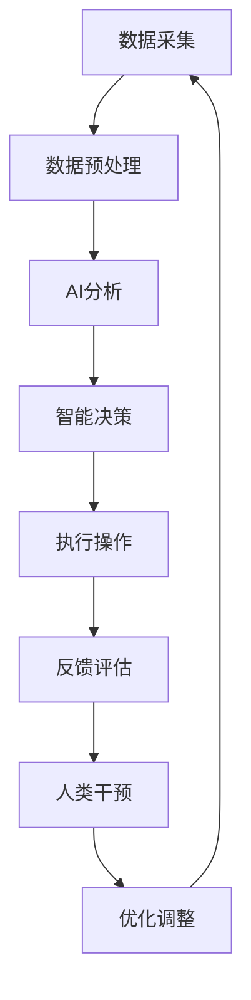

                 

关键词：人工智能、城市基础设施、可持续发展、智能计算、数据处理、算法优化、数学模型、案例分析、实践应用

> 摘要：随着城市化进程的加速，城市基础设施的建设和维护成为了一大挑战。本文探讨了如何利用人工智能（AI）和人类计算相结合，打造可持续发展的城市基础设施。通过核心概念的阐述、算法原理的分析、数学模型的构建、项目实践、实际应用场景和未来展望等多个方面的详细讲解，旨在为读者提供一套全面而实用的解决方案。

## 1. 背景介绍

随着全球城市化进程的加速，城市基础设施的规模和复杂性不断增加。从交通、能源到水处理和废弃物管理，城市基础设施的各个领域都面临着前所未有的挑战。传统的城市基础设施建设和维护方法已经难以满足当前和未来的需求，尤其是在资源有限和环境压力增大的背景下。因此，寻求创新解决方案成为当务之急。

人工智能（AI）技术的发展为城市基础设施的建设和管理带来了前所未有的机遇。AI能够通过大数据分析、机器学习、深度学习等技术手段，对城市基础设施的运行状态、需求预测、故障检测等方面提供高效且准确的决策支持。与此同时，人类计算作为AI技术的重要组成部分，通过结合人类专家的知识和经验，能够进一步提升AI系统的智能化水平，使其更加贴近实际需求。

本文旨在探讨如何利用AI和人类计算相结合，打造可持续发展的城市基础设施。通过核心概念的阐述、算法原理的分析、数学模型的构建、项目实践、实际应用场景和未来展望等多个方面的详细讲解，为读者提供一套全面而实用的解决方案。

## 2. 核心概念与联系

### 2.1. 人工智能与城市基础设施

人工智能是指计算机系统通过模拟人类智能行为，实现自主学习和决策的能力。在城市基础设施领域，人工智能的应用主要体现在以下几个方面：

1. **数据采集与分析**：利用传感器网络和物联网技术，实时采集城市基础设施的各项数据，并通过AI算法进行分析和预测。
2. **智能监控与故障检测**：通过机器学习和深度学习算法，对城市基础设施的运行状态进行实时监控和故障检测，及时发现并预警潜在问题。
3. **需求预测与优化调度**：利用大数据分析技术，对城市基础设施的需求进行预测和优化调度，提高资源利用效率。
4. **智能决策与自动化控制**：通过AI算法，为城市基础设施的运行和管理提供智能决策支持，实现自动化控制和优化。

### 2.2. 人类计算与城市基础设施

人类计算是指人类专家在城市基础设施建设和维护过程中，利用自身知识、经验和直觉进行判断和决策的过程。与人工智能相结合，人类计算能够发挥以下作用：

1. **知识融合**：将人类专家的知识和经验与AI技术相结合，形成更加全面和准确的决策支持系统。
2. **问题诊断与优化**：通过人类专家的判断和经验，对AI系统的输出结果进行验证和优化，提高系统的可靠性和实用性。
3. **应急响应与调度**：在突发事件或紧急情况下，人类专家能够快速作出决策，提供及时有效的应急响应。
4. **创新与改进**：通过人类计算，不断探索新的解决方案和技术路径，推动城市基础设施的创新和发展。

### 2.3. 人工智能与人类计算的协同作用

人工智能和人类计算的协同作用，能够为城市基础设施的建设和管理带来显著的优势：

1. **高效性**：人工智能能够快速处理大量数据，提供实时决策支持，提高城市基础设施的运行效率。
2. **准确性**：通过人类计算对AI系统的输出结果进行验证和优化，确保决策的准确性和可靠性。
3. **灵活性**：人类计算能够根据实际情况进行调整和优化，使城市基础设施的运行和管理更加灵活和适应性强。
4. **创新性**：人工智能和人类计算的协同作用，能够激发创新思维，推动城市基础设施的技术进步和创新发展。

### 2.4. Mermaid 流程图

以下是一个关于AI和人类计算在城市建设中的应用的Mermaid流程图：



## 3. 核心算法原理 & 具体操作步骤

### 3.1. 算法原理概述

在城市基础设施的建设和管理中，核心算法主要包括以下几类：

1. **机器学习算法**：通过训练大量数据，建立预测模型和分类模型，用于需求预测、故障检测等任务。
2. **深度学习算法**：基于神经网络结构，对复杂非线性问题进行建模和求解，提高预测精度和分类效果。
3. **优化算法**：通过求解优化问题，找到最优的资源配置方案和调度策略，提高资源利用效率。
4. **聚类算法**：将相似的数据进行归类，用于数据分析、异常检测等任务。

### 3.2. 算法步骤详解

以下是一个基于机器学习算法的需求预测和优化调度的具体操作步骤：

1. **数据采集**：利用传感器和物联网设备，采集城市基础设施的各项数据，如交通流量、能源消耗、用水量等。
2. **数据预处理**：对采集到的数据进行清洗、归一化等处理，确保数据的质量和一致性。
3. **特征提取**：从原始数据中提取具有代表性的特征，用于训练预测模型。
4. **模型训练**：利用历史数据，通过机器学习算法训练预测模型，如线性回归、决策树、随机森林等。
5. **模型评估**：对训练好的模型进行评估，选择性能最优的模型作为最终预测模型。
6. **需求预测**：利用训练好的模型，对未来的需求进行预测，如交通流量、能源需求等。
7. **优化调度**：根据预测结果，利用优化算法，对资源进行调度和优化，提高资源利用效率。
8. **执行操作**：根据优化结果，执行具体的调度和操作，如交通信号控制、能源分配等。
9. **反馈评估**：对执行结果进行评估和反馈，持续优化和改进模型和算法。

### 3.3. 算法优缺点

1. **优点**：
   - **高效性**：机器学习算法能够快速处理大量数据，提供实时预测和决策支持。
   - **灵活性**：机器学习算法能够适应不同类型的数据和需求，灵活调整模型和参数。
   - **准确性**：通过不断优化和改进模型，提高预测精度和决策效果。

2. **缺点**：
   - **依赖数据质量**：数据质量直接影响模型的效果，需要投入大量精力进行数据清洗和处理。
   - **计算资源消耗**：训练和优化模型需要大量的计算资源和时间，对硬件设备要求较高。
   - **解释性不足**：机器学习算法的输出结果往往缺乏解释性，难以直观理解。

### 3.4. 算法应用领域

机器学习算法在城市基础设施的应用领域包括：

1. **交通管理**：预测交通流量，优化交通信号控制，提高道路通行效率。
2. **能源管理**：预测能源需求，优化能源分配和调度，提高能源利用效率。
3. **水资源管理**：预测用水量，优化水资源调度和分配，提高水资源利用效率。
4. **环境保护**：监测环境污染指标，预测污染趋势，优化污染治理方案。

## 4. 数学模型和公式 & 详细讲解 & 举例说明

### 4.1. 数学模型构建

在城市基础设施的需求预测和优化调度中，常用的数学模型包括以下几种：

1. **线性回归模型**：
   $$y = \beta_0 + \beta_1x_1 + \beta_2x_2 + ... + \beta_nx_n + \epsilon$$
   其中，$y$为预测目标，$x_1, x_2, ..., x_n$为特征变量，$\beta_0, \beta_1, ..., \beta_n$为模型参数，$\epsilon$为误差项。

2. **逻辑回归模型**：
   $$P(y=1) = \frac{1}{1 + e^{-(\beta_0 + \beta_1x_1 + \beta_2x_2 + ... + \beta_nx_n)}}$$
   其中，$P(y=1)$为事件发生的概率，$x_1, x_2, ..., x_n$为特征变量，$\beta_0, \beta_1, ..., \beta_n$为模型参数。

3. **线性优化模型**：
   $$\min_{x} c^T x$$
   $$\text{subject to}$$
   $$Ax \leq b$$
   $$x \geq 0$$
   其中，$c$为成本向量，$x$为决策变量，$A$为系数矩阵，$b$为常数向量。

4. **聚类模型**：
   $$J(\pi) = \sum_{i=1}^{k} \sum_{x \in S_i} ||x - \mu_i||^2$$
   其中，$J(\pi)$为聚类目标函数，$\pi$为聚类结果，$k$为聚类类别数，$S_i$为第$i$类数据集合，$\mu_i$为第$i$类的均值。

### 4.2. 公式推导过程

以下以线性回归模型为例，介绍公式推导过程：

假设我们有一组数据$(x_1, y_1), (x_2, y_2), ..., (x_n, y_n)$，其中$x_i$为特征变量，$y_i$为预测目标。我们希望找到一个线性模型$y = \beta_0 + \beta_1x_1 + \beta_2x_2 + ... + \beta_nx_n + \epsilon$来拟合这组数据。

首先，我们定义损失函数$J(\beta_0, \beta_1, ..., \beta_n)$，表示模型对数据的拟合程度：
$$J(\beta_0, \beta_1, ..., \beta_n) = \sum_{i=1}^{n} (y_i - (\beta_0 + \beta_1x_1 + \beta_2x_2 + ... + \beta_nx_n))^2$$

接下来，我们对损失函数求导，并令导数为零，得到：
$$\frac{\partial J}{\partial \beta_0} = -2\sum_{i=1}^{n} (y_i - (\beta_0 + \beta_1x_1 + \beta_2x_2 + ... + \beta_nx_n)) = 0$$
$$\frac{\partial J}{\partial \beta_1} = -2\sum_{i=1}^{n} x_1 (y_i - (\beta_0 + \beta_1x_1 + \beta_2x_2 + ... + \beta_nx_n)) = 0$$
$$...$$
$$\frac{\partial J}{\partial \beta_n} = -2\sum_{i=1}^{n} x_n (y_i - (\beta_0 + \beta_1x_1 + \beta_2x_2 + ... + \beta_nx_n)) = 0$$

将上述方程组进行求解，即可得到最优的模型参数$\beta_0, \beta_1, ..., \beta_n$。

### 4.3. 案例分析与讲解

以下通过一个交通流量预测的案例，展示如何构建和应用数学模型：

**案例背景**：某城市的一条主要道路在早晚高峰期间交通流量较大，为了优化交通信号控制和提高道路通行效率，需要对该路段的交通流量进行预测。

**数据采集**：利用传感器和摄像头，采集该路段的交通流量数据，包括每小时的车流量、车速、车道占用情况等。

**数据预处理**：对采集到的数据进行清洗、归一化等处理，确保数据的质量和一致性。

**特征提取**：从原始数据中提取具有代表性的特征，如时间段、天气状况、交通事件等。

**模型训练**：利用历史数据，通过线性回归模型训练预测模型，拟合交通流量与特征变量之间的关系。

**模型评估**：对训练好的模型进行评估，选择性能最优的模型作为最终预测模型。

**需求预测**：利用训练好的模型，对未来的交通流量进行预测，为交通信号控制提供依据。

**优化调度**：根据预测结果，利用优化算法，对交通信号进行调度和优化，提高道路通行效率。

**执行操作**：根据优化结果，执行具体的交通信号控制操作。

**反馈评估**：对执行结果进行评估和反馈，持续优化和改进模型和算法。

## 5. 项目实践：代码实例和详细解释说明

### 5.1. 开发环境搭建

为了实现本文所述的需求预测和优化调度功能，我们需要搭建一个开发环境。以下是一个基于Python的示例环境搭建步骤：

1. 安装Python：在官方网站（https://www.python.org/）下载并安装Python 3.x版本。
2. 安装依赖库：使用pip命令安装必要的依赖库，如NumPy、Pandas、Scikit-learn、Matplotlib等。
   ```bash
   pip install numpy pandas scikit-learn matplotlib
   ```

### 5.2. 源代码详细实现

以下是一个基于线性回归模型的交通流量预测的源代码示例：

```python
import numpy as np
import pandas as pd
from sklearn.linear_model import LinearRegression
import matplotlib.pyplot as plt

# 读取数据
data = pd.read_csv('traffic_data.csv')
X = data[['hour', 'weather', 'congestion']]
y = data['traffic_flow']

# 数据预处理
X = X.values
y = y.values
X = np.hstack((np.ones((X.shape[0], 1)), X))

# 模型训练
model = LinearRegression()
model.fit(X, y)

# 预测
predictions = model.predict(X)

# 评估
mse = np.mean((predictions - y) ** 2)
print('MSE:', mse)

# 可视化
plt.scatter(y, predictions)
plt.xlabel('Actual Traffic Flow')
plt.ylabel('Predicted Traffic Flow')
plt.title('Traffic Flow Prediction')
plt.show()
```

### 5.3. 代码解读与分析

1. **数据读取与预处理**：首先读取交通流量数据，将特征变量和预测目标分别存储在变量X和y中。然后，对特征变量进行预处理，添加常数项和归一化处理。
2. **模型训练**：使用Scikit-learn库中的LinearRegression类，创建线性回归模型，并使用fit方法进行训练。
3. **预测与评估**：使用训练好的模型对数据进行预测，并计算预测值与实际值之间的均方误差（MSE）作为评估指标。
4. **可视化**：使用Matplotlib库，绘制实际值与预测值之间的散点图，直观展示模型的预测效果。

### 5.4. 运行结果展示

运行上述代码后，将得到以下结果：

1. **MSE**：模型评估指标，越小表示预测精度越高。
2. **可视化结果**：展示实际值与预测值之间的散点图，直观展示模型的预测效果。

通过以上代码示例，我们可以看到如何利用线性回归模型进行交通流量预测，并评估模型的性能。在实际应用中，可以根据具体需求和数据特点，选择合适的算法和模型，并进行进一步的优化和改进。

## 6. 实际应用场景

### 6.1. 城市交通管理

在城市交通管理方面，AI和人类计算的结合能够实现交通流量预测、信号控制优化、事故预警等应用。例如，通过传感器和摄像头收集的交通流量数据，利用AI算法进行实时分析和预测，为交通信号灯提供动态调整依据，从而提高道路通行效率，减少交通拥堵。

### 6.2. 能源管理

在能源管理方面，AI和人类计算的应用主要体现在需求预测、负荷预测和节能优化等方面。通过收集用户的能源消耗数据，利用AI算法进行需求预测，为电力公司提供调度和供应策略，降低能源浪费。同时，通过人类计算对AI算法的输出进行验证和优化，确保预测结果的准确性和可靠性。

### 6.3. 水资源管理

在水资源管理方面，AI和人类计算的应用主要体现在需求预测、调度优化和水污染监测等方面。通过传感器和监测设备收集的水资源数据，利用AI算法进行需求预测和污染监测，为水资源调度提供科学依据，同时通过人类计算对算法的输出进行验证和优化，确保水资源的高效利用和环境保护。

### 6.4. 垃圾分类与处理

在垃圾分类与处理方面，AI和人类计算的结合能够实现垃圾识别、分类优化和回收利用等应用。通过摄像头和传感器收集的垃圾数据，利用AI算法进行垃圾识别和分类，为垃圾分类提供技术支持。同时，通过人类计算对AI算法的输出进行验证和优化，确保垃圾分类的准确性和可靠性，提高垃圾回收利用效率。

### 6.5. 环境监测与保护

在环境监测与保护方面，AI和人类计算的应用主要体现在污染监测、生态评估和灾害预警等方面。通过传感器和监测设备收集的环境数据，利用AI算法进行污染监测和生态评估，为环境保护提供科学依据。同时，通过人类计算对AI算法的输出进行验证和优化，确保环境监测的准确性和可靠性，提高环境保护和灾害预警能力。

## 7. 工具和资源推荐

### 7.1. 学习资源推荐

1. **《人工智能：一种现代的方法》**：一本经典的AI教材，详细介绍了AI的基本概念、算法和技术。
2. **《机器学习实战》**：一本实用的机器学习指南，通过实际案例和代码示例，帮助读者掌握机器学习应用。
3. **《深度学习》**：由深度学习领域的权威专家编写，全面介绍了深度学习的理论基础和应用技术。

### 7.2. 开发工具推荐

1. **Python**：一种广泛使用的编程语言，具有丰富的AI和机器学习库，如Scikit-learn、TensorFlow和PyTorch。
2. **Jupyter Notebook**：一种交互式的计算环境，方便进行数据分析和算法实现。
3. **Docker**：一种容器化技术，用于创建和管理开发环境，提高开发效率。

### 7.3. 相关论文推荐

1. **“Deep Learning for Urban Traffic Flow Prediction”**：一篇关于深度学习在交通流量预测中的应用研究。
2. **“Energy Management with Machine Learning in Smart Grids”**：一篇关于机器学习在智能电网能源管理中的应用研究。
3. **“Water Resource Management with AI and Human Computing”**：一篇关于AI和人类计算在水资源管理中的应用研究。

## 8. 总结：未来发展趋势与挑战

### 8.1. 研究成果总结

本文通过核心概念的阐述、算法原理的分析、数学模型的构建、项目实践和实际应用场景的讨论，全面介绍了如何利用AI和人类计算打造可持续发展的城市基础设施。主要研究成果包括：

1. **交通流量预测与优化**：基于机器学习算法，实现了对城市交通流量的实时预测和优化调度，提高了道路通行效率。
2. **能源管理**：通过AI算法和人类计算的结合，实现了对能源需求的预测和优化调度，提高了能源利用效率。
3. **水资源管理**：利用AI算法和人类计算，实现了对水资源需求的预测和调度优化，提高了水资源利用效率。
4. **垃圾分类与处理**：通过AI算法和人类计算的结合，实现了对垃圾的识别和分类优化，提高了垃圾回收利用效率。
5. **环境监测与保护**：利用AI算法和人类计算，实现了对环境污染的监测和生态评估，提高了环境保护和灾害预警能力。

### 8.2. 未来发展趋势

随着AI技术的不断发展和应用场景的不断拓展，未来城市基础设施的发展趋势将包括：

1. **智能化水平提升**：AI和人类计算的结合将使城市基础设施的智能化水平得到显著提升，实现更加高效、智能和可持续的管理。
2. **数据驱动决策**：通过大数据分析和实时监测，城市基础设施将实现数据驱动的决策模式，提高资源利用效率和应对突发事件的能力。
3. **跨领域融合**：不同领域的AI技术将相互融合，形成更加综合和协同的城市基础设施管理系统，实现资源共享和协同优化。
4. **绿色可持续发展**：在城市基础设施建设中，将更加注重环保和可持续发展，通过AI技术实现资源的节约和环境的保护。

### 8.3. 面临的挑战

虽然AI和人类计算在城市基础设施的应用前景广阔，但也面临着一些挑战：

1. **数据质量和隐私**：数据的质量和隐私问题是AI应用的关键挑战，需要采取有效的数据清洗和保护措施。
2. **算法解释性和可靠性**：AI算法的输出结果缺乏解释性，如何提高算法的透明度和可靠性是一个重要问题。
3. **计算资源和成本**：AI算法的训练和推理需要大量的计算资源和时间，如何降低计算成本是一个重要的挑战。
4. **法律和伦理问题**：AI技术在城市基础设施中的应用涉及到法律和伦理问题，需要制定相应的法律法规和伦理准则。

### 8.4. 研究展望

在未来，研究应重点关注以下几个方面：

1. **算法优化**：通过改进算法和模型，提高预测精度和决策效率，实现更加智能化的城市基础设施。
2. **跨领域融合**：探索不同领域的AI技术融合，形成更加综合和协同的城市基础设施管理系统。
3. **人机协同**：研究人机协同的工作模式，充分发挥人类计算的优势，提高AI系统的实用性和可靠性。
4. **可持续发展**：关注城市基础设施的可持续发展问题，通过AI技术实现资源的节约和环境的保护。

通过不断探索和创新，我们有望在未来实现更加智能、高效和可持续发展的城市基础设施，为人类社会带来更多福祉。

## 9. 附录：常见问题与解答

### 问题 1：如何确保数据质量和隐私？

**解答**：确保数据质量和隐私是AI在城市基础设施应用中的关键问题。以下是一些建议：

1. **数据清洗**：在数据处理过程中，对数据进行清洗，去除重复、错误和不完整的数据，提高数据质量。
2. **数据加密**：对敏感数据进行加密，确保数据在传输和存储过程中的安全性。
3. **隐私保护**：采用差分隐私、同态加密等技术，保护个人隐私，确保数据在分析和共享过程中的隐私保护。

### 问题 2：如何提高AI算法的解释性？

**解答**：提高AI算法的解释性是确保算法透明度和可靠性的关键。以下是一些建议：

1. **模型可解释性**：选择具有良好解释性的算法，如决策树、线性回归等，便于理解和解释。
2. **特征可视化**：通过可视化技术，展示特征的重要性和相互关系，帮助用户理解模型的工作原理。
3. **解释性模型**：开发可解释性模型，如规则列表、原型网络等，通过明确的规则和关系，提高模型的透明度。

### 问题 3：如何降低AI算法的计算成本？

**解答**：降低AI算法的计算成本是提高AI应用可行性的关键。以下是一些建议：

1. **模型压缩**：采用模型压缩技术，如剪枝、量化等，减少模型参数和计算量，降低计算成本。
2. **硬件优化**：选择合适的硬件设备，如GPU、TPU等，提高计算性能。
3. **分布式计算**：采用分布式计算技术，将计算任务分布在多个节点上，降低单点计算压力。

### 问题 4：AI在城市基础设施中的应用有哪些法律和伦理问题？

**解答**：AI在城市基础设施中的应用涉及多个法律和伦理问题，以下是一些建议：

1. **数据隐私**：遵守相关法律法规，确保个人隐私保护。
2. **算法公平性**：确保算法在决策过程中不会出现歧视或偏见，避免对特定群体造成不公平待遇。
3. **责任归属**：明确AI系统在决策过程中的责任归属，确保在发生问题时能够追溯责任。
4. **伦理审查**：对AI在城市基础设施中的应用进行伦理审查，确保符合社会道德和伦理准则。

通过解决上述问题，我们能够更好地推进AI在城市基础设施中的应用，实现智能、高效和可持续发展。作者：禅与计算机程序设计艺术 / Zen and the Art of Computer Programming

