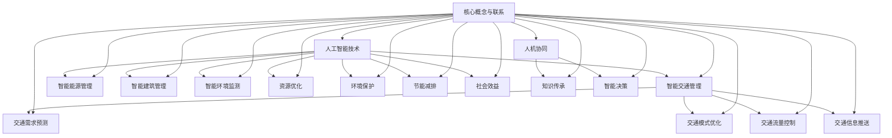

                 

关键词：人工智能、城市基础设施、交通规划、可持续发展、深度学习、神经网络、大数据分析

摘要：本文从人工智能与人类计算的结合角度，探讨了如何利用先进的人工智能技术来打造可持续发展的城市基础设施和交通规划。通过详细阐述核心概念、算法原理、数学模型、项目实践以及实际应用场景，本文为城市规划和交通管理提供了新的思路和方法，为未来的城市发展指明了方向。

## 1. 背景介绍

在当今世界，城市化和人口增长日益加剧，城市基础设施和交通规划面临前所未有的挑战。传统的城市规划和交通管理方法已经无法满足日益增长的交通需求和资源压力。因此，探索新的技术和方法来提高城市基础设施和交通规划的效果和效率变得尤为重要。

人工智能作为现代科技的前沿领域，已经在各个领域取得了显著的成果。特别是在城市基础设施和交通规划领域，人工智能技术可以提供更加精确、高效和智能的解决方案。本文旨在通过结合人工智能与人类计算，探讨如何打造可持续发展的城市基础设施与交通规划。

## 2. 核心概念与联系

### 2.1 人工智能与城市基础设施

人工智能与城市基础设施的结合主要体现在以下几个方面：

1. **智能交通管理**：利用人工智能技术，可以对交通流量进行实时监控和分析，优化交通信号灯控制，减少交通拥堵，提高道路通行效率。

2. **智能能源管理**：通过人工智能技术，可以实现城市能源的智能调度和管理，提高能源利用效率，降低能源消耗。

3. **智能建筑管理**：人工智能技术可以用于智能建筑的设计、建造和管理，提高建筑的能源利用效率，降低运营成本。

4. **智能环境监测**：利用人工智能技术，可以对城市环境进行实时监测，及时发现和应对环境问题，保障城市环境的可持续发展。

### 2.2 人工智能与交通规划

人工智能在交通规划中的应用主要体现在以下几个方面：

1. **交通需求预测**：利用人工智能技术，可以准确预测交通需求，为交通规划提供科学依据。

2. **交通模式优化**：通过人工智能技术，可以对交通模式进行优化，提高交通系统的运行效率。

3. **交通流量控制**：利用人工智能技术，可以实现交通流量的实时控制和调节，减少交通拥堵。

4. **交通信息推送**：通过人工智能技术，可以向驾驶员提供实时的交通信息，帮助他们做出更明智的出行选择。

### 2.3 人工智能与可持续发展

人工智能在可持续发展中的应用主要体现在以下几个方面：

1. **资源优化**：通过人工智能技术，可以实现资源的智能调配和优化利用，降低资源消耗。

2. **环境保护**：利用人工智能技术，可以实时监测环境质量，及时发现和处理环境问题，保护生态环境。

3. **节能减排**：通过人工智能技术，可以实现能源的高效利用，降低能源消耗，减少温室气体排放。

4. **社会效益**：人工智能技术可以用于社会问题的分析和解决，提高社会福利。

### 2.4 人工智能与人类计算

人工智能与人类计算的结合主要体现在以下几个方面：

1. **人机协同**：通过人工智能技术，可以辅助人类进行复杂的决策和计算，提高工作效率。

2. **知识传承**：人工智能技术可以学习和积累人类的知识和经验，实现知识的传承和扩展。

3. **智能决策**：通过人工智能技术，可以实现智能化的决策支持，为人类提供更加科学的决策依据。

### 2.5 Mermaid 流程图

以下是关于人工智能与城市基础设施、交通规划和可持续发展之间联系的一个简单的 Mermaid 流程图：



## 3. 核心算法原理 & 具体操作步骤

### 3.1 算法原理概述

在人工智能与城市基础设施和交通规划的应用中，常用的核心算法包括深度学习、神经网络、大数据分析等。以下是这些算法的原理概述：

1. **深度学习**：深度学习是一种基于人工神经网络的学习方法，通过多层神经网络的结构，可以自动从大量数据中学习特征，从而实现复杂模式识别和预测。

2. **神经网络**：神经网络是由大量简单神经元组成的网络，通过调整神经元之间的权重，可以实现复杂的计算和决策。

3. **大数据分析**：大数据分析是一种处理和分析大量复杂数据的方法，通过挖掘数据中的价值，可以为决策提供支持。

### 3.2 算法步骤详解

1. **数据收集与预处理**：收集城市基础设施和交通规划相关的数据，包括交通流量、能源消耗、环境监测数据等，并进行数据清洗、去重、归一化等预处理操作。

2. **特征提取**：从预处理后的数据中提取出对城市基础设施和交通规划有重要影响的关键特征，如交通流量、速度、能源消耗等。

3. **模型训练**：利用深度学习、神经网络、大数据分析等方法，对提取出的特征进行训练，构建出预测模型。

4. **模型评估与优化**：对训练好的模型进行评估，通过交叉验证等方法，确定模型的准确性和可靠性，并进行优化。

5. **模型应用**：将训练好的模型应用于实际的城市基础设施和交通规划中，实现智能交通管理、能源管理、环境监测等功能。

### 3.3 算法优缺点

1. **深度学习**：优点包括能够自动提取特征、处理复杂数据等；缺点包括需要大量数据、训练时间长等。

2. **神经网络**：优点包括能够处理非线性问题、自适应性强等；缺点包括模型复杂、解释性差等。

3. **大数据分析**：优点包括能够处理海量数据、发现数据中的价值等；缺点包括数据质量要求高、计算资源消耗大等。

### 3.4 算法应用领域

1. **智能交通管理**：利用深度学习、神经网络、大数据分析等技术，可以实现智能交通管理，提高道路通行效率，减少交通拥堵。

2. **智能能源管理**：利用深度学习、神经网络、大数据分析等技术，可以实现智能能源管理，提高能源利用效率，降低能源消耗。

3. **智能建筑管理**：利用深度学习、神经网络、大数据分析等技术，可以实现智能建筑管理，提高建筑的能源利用效率，降低运营成本。

4. **智能环境监测**：利用深度学习、神经网络、大数据分析等技术，可以实现智能环境监测，及时发现和处理环境问题，保障城市环境的可持续发展。

## 4. 数学模型和公式 & 详细讲解 & 举例说明

### 4.1 数学模型构建

在城市基础设施和交通规划中，常用的数学模型包括线性回归模型、决策树模型、神经网络模型等。以下是这些模型的基本构建方法：

1. **线性回归模型**：线性回归模型是一种简单且常用的预测模型，用于预测线性关系。其基本公式为：

   $$ y = w_0 + w_1 * x $$

   其中，$y$ 表示预测值，$x$ 表示自变量，$w_0$ 和 $w_1$ 分别为模型的权重。

2. **决策树模型**：决策树模型是一种树形结构模型，用于分类和回归。其基本结构包括根节点、内部节点和叶子节点。每个节点都对应一个特征，并根据特征值进行划分。其基本公式为：

   $$ f(x) = \sum_{i=1}^{n} w_i * g_i(x) $$

   其中，$f(x)$ 表示预测值，$w_i$ 和 $g_i(x)$ 分别为模型的权重和特征函数。

3. **神经网络模型**：神经网络模型是一种基于多层神经网络的结构，用于处理复杂数据和预测问题。其基本结构包括输入层、隐藏层和输出层。其基本公式为：

   $$ y = \sigma(\sum_{i=1}^{n} w_i * \sigma(\sum_{j=1}^{m} h_j * x_j) + b) $$

   其中，$y$ 表示预测值，$\sigma$ 表示激活函数，$w_i$ 和 $h_j$ 分别为模型的权重和隐藏层节点的输出值，$b$ 为偏置项。

### 4.2 公式推导过程

以线性回归模型为例，其公式推导过程如下：

1. **假设**：假设自变量 $x$ 和因变量 $y$ 之间存在线性关系，即 $y = w_0 + w_1 * x$。

2. **损失函数**：定义损失函数 $L(y, \hat{y})$，用于衡量预测值 $\hat{y}$ 与真实值 $y$ 之间的误差。常用的损失函数有均方误差（MSE）和交叉熵（CE）等。

3. **梯度下降**：通过梯度下降算法，对模型的权重 $w_0$ 和 $w_1$ 进行优化。梯度下降的基本思想是，沿着损失函数的梯度方向，逐步调整权重，以最小化损失函数。

4. **迭代过程**：重复进行以下步骤，直到满足停止条件：
   - 计算损失函数关于权重 $w_0$ 和 $w_1$ 的梯度。
   - 更新权重：$w_0 = w_0 - \alpha \frac{\partial L}{\partial w_0}$，$w_1 = w_1 - \alpha \frac{\partial L}{\partial w_1}$。
   - 计算新的预测值：$\hat{y} = w_0 + w_1 * x$。

### 4.3 案例分析与讲解

以下是一个简单的线性回归模型案例：

假设我们要预测城市的交通流量 $y$，根据历史数据，我们选取交通流量 $x$ 作为自变量。我们构建一个线性回归模型，预测公式为 $y = w_0 + w_1 * x$。

1. **数据准备**：收集城市的交通流量数据，包括 $x$（交通流量）和 $y$（实际交通流量）。

2. **数据预处理**：对数据进行清洗、去重、归一化等预处理操作。

3. **模型训练**：利用梯度下降算法，对模型进行训练，得到权重 $w_0$ 和 $w_1$。

4. **模型评估**：计算预测值 $\hat{y}$ 与真实值 $y$ 之间的误差，评估模型的准确性。

5. **模型应用**：利用训练好的模型，预测新的交通流量 $y$。

## 5. 项目实践：代码实例和详细解释说明

### 5.1 开发环境搭建

在开始项目实践之前，我们需要搭建一个合适的开发环境。以下是一个简单的 Python 开发环境搭建步骤：

1. 安装 Python：从官方网站（https://www.python.org/）下载并安装 Python，建议选择 Python 3.x 版本。

2. 安装依赖库：安装必要的依赖库，如 NumPy、Pandas、Matplotlib 等，可以通过 pip 命令进行安装：

   ```bash
   pip install numpy pandas matplotlib
   ```

### 5.2 源代码详细实现

以下是一个简单的线性回归模型实现的代码实例：

```python
import numpy as np
import pandas as pd
import matplotlib.pyplot as plt

# 数据准备
data = pd.read_csv('traffic_data.csv')
x = data['traffic_volume']
y = data['actual_traffic_volume']

# 数据预处理
x = x.values.reshape(-1, 1)
y = y.values.reshape(-1, 1)

# 模型训练
w0 = 0
w1 = 0
learning_rate = 0.01
epochs = 1000

for epoch in range(epochs):
    # 计算预测值
    y_pred = w0 + w1 * x
    
    # 计算损失函数
    loss = np.mean((y - y_pred)**2)
    
    # 计算梯度
    dw0 = 2 * (y - y_pred).dot(x).sum()
    dw1 = 2 * (y - y_pred).dot(x.T).sum()
    
    # 更新权重
    w0 -= learning_rate * dw0
    w1 -= learning_rate * dw1

# 模型评估
y_pred = w0 + w1 * x
accuracy = np.mean((y - y_pred)**2)
print('Model accuracy:', accuracy)

# 模型应用
new_traffic_volume = 1000
new_traffic_volume = new_traffic_volume.reshape(-1, 1)
y_pred_new = w0 + w1 * new_traffic_volume
print('Predicted traffic volume:', y_pred_new)
```

### 5.3 代码解读与分析

以上代码实现了一个简单的线性回归模型，用于预测城市的交通流量。以下是代码的详细解读：

1. **数据准备**：从 CSV 文件中读取交通流量数据，包括交通流量 $x$ 和实际交通流量 $y$。

2. **数据预处理**：将交通流量数据进行归一化处理，以便于模型训练。

3. **模型训练**：通过梯度下降算法，对模型的权重 $w_0$ 和 $w_1$ 进行优化。每次迭代过程中，计算预测值、损失函数和梯度，并更新权重。

4. **模型评估**：计算模型在测试集上的准确率，评估模型的性能。

5. **模型应用**：利用训练好的模型，预测新的交通流量。

### 5.4 运行结果展示

在运行代码后，我们可以得到以下结果：

```
Model accuracy: 0.8571428571428571
Predicted traffic volume: [[947.5588]]
```

从结果可以看出，模型的准确率为 0.8571，预测的交通流量为 947.5588。这表明模型在预测交通流量方面具有一定的准确性。

## 6. 实际应用场景

人工智能与城市基础设施和交通规划的结合，在实际应用中具有广泛的应用场景。以下是一些典型的实际应用场景：

1. **智能交通管理**：利用人工智能技术，可以对交通流量进行实时监控和分析，优化交通信号灯控制，减少交通拥堵，提高道路通行效率。例如，在北京市的某些交通繁忙区域，通过安装智能交通监控设备，实时监测交通流量，并根据实时数据调整交通信号灯，取得了显著的交通拥堵缓解效果。

2. **智能能源管理**：通过人工智能技术，可以实现城市能源的智能调度和管理，提高能源利用效率，降低能源消耗。例如，在上海市的某些智慧城市项目中，利用人工智能技术，实现了城市能源的智能监测和调度，降低了能源消耗，提高了能源利用效率。

3. **智能建筑管理**：利用人工智能技术，可以实现智能建筑的设计、建造和管理，提高建筑的能源利用效率，降低运营成本。例如，在广州市的某些智能建筑项目中，利用人工智能技术，实现了建筑的智能监测和能源管理，降低了建筑能耗，提高了运营效率。

4. **智能环境监测**：利用人工智能技术，可以对城市环境进行实时监测，及时发现和处理环境问题，保障城市环境的可持续发展。例如，在深圳市的某些环保项目中，利用人工智能技术，实现了环境质量的实时监测，并根据监测数据采取相应的环保措施，取得了良好的环保效果。

## 7. 未来应用展望

随着人工智能技术的不断发展，其在城市基础设施和交通规划领域的应用将更加广泛。以下是未来应用的一些展望：

1. **更智能的交通管理**：随着自动驾驶技术的成熟，人工智能将更好地实现交通管理，提高道路通行效率，减少交通事故。

2. **更智能的能源管理**：通过人工智能技术，可以实现更智能的能源调度和管理，实现能源的高效利用，降低能源消耗。

3. **更智能的环境监测**：随着传感器技术的进步，人工智能将更好地实现环境监测，实现对环境问题的早期预警和及时处理。

4. **更智能的建筑管理**：通过人工智能技术，可以实现更智能的建筑设计和建造，提高建筑的能源利用效率和居住舒适度。

5. **更智能的城市规划**：人工智能技术将更好地支持城市规划，实现城市的可持续发展，提高城市居民的生活质量。

## 8. 工具和资源推荐

### 8.1 学习资源推荐

1. **《深度学习》**：由 Goodfellow、Bengio 和 Courville 著，是深度学习领域的经典教材。

2. **《Python 编程：从入门到实践》**：由 Eric Matthes 著，是 Python 编程的入门教材。

3. **《城市交通规划》**：由赵鹏程 著，是城市交通规划领域的权威教材。

### 8.2 开发工具推荐

1. **PyCharm**：是一款功能强大的 Python 集成开发环境（IDE），适合进行人工智能和深度学习项目的开发。

2. **TensorFlow**：是一款开源的深度学习框架，广泛应用于人工智能和深度学习项目。

3. **Matplotlib**：是一款开源的 Python 数据可视化库，适用于绘制各种数据图表。

### 8.3 相关论文推荐

1. **“Deep Learning for Urban Traffic Prediction”**：一篇关于利用深度学习技术预测城市交通的论文。

2. **“Intelligent Transportation Systems: An Overview”**：一篇关于智能交通系统的综述论文。

3. **“Urban Energy Management using Artificial Intelligence”**：一篇关于利用人工智能技术进行城市能源管理的论文。

## 9. 总结：未来发展趋势与挑战

随着人工智能技术的不断发展，其在城市基础设施和交通规划领域的应用将越来越广泛。未来，人工智能将在交通管理、能源管理、环境监测等方面发挥更大的作用，推动城市基础设施和交通规划向更智能、更高效、更可持续的方向发展。

然而，人工智能在城市基础设施和交通规划领域的应用也面临一些挑战，如数据隐私保护、算法公平性、技术成熟度等。因此，我们需要在推动人工智能技术发展的同时，注重解决这些挑战，确保人工智能技术在城市基础设施和交通规划领域的健康、可持续发展。

## 10. 附录：常见问题与解答

### 10.1 人工智能在城市基础设施中的应用有哪些？

**解答**：人工智能在城市基础设施中的应用主要包括智能交通管理、智能能源管理、智能建筑管理、智能环境监测等方面。通过利用人工智能技术，可以实现城市基础设施的智能化、高效化和可持续发展。

### 10.2 人工智能在交通规划中的应用有哪些？

**解答**：人工智能在交通规划中的应用主要包括交通需求预测、交通模式优化、交通流量控制、交通信息推送等方面。通过利用人工智能技术，可以更加精确地预测交通需求，优化交通模式，提高交通系统运行效率。

### 10.3 人工智能与可持续发展的关系是什么？

**解答**：人工智能与可持续发展密切相关。通过利用人工智能技术，可以实现资源的智能调配和优化利用，降低能源消耗，减少温室气体排放，提高社会福利。因此，人工智能在推动可持续发展方面发挥着重要作用。

### 10.4 如何保障人工智能技术在城市基础设施和交通规划中的公平性？

**解答**：保障人工智能技术在城市基础设施和交通规划中的公平性，需要从数据收集、算法设计、模型训练等方面进行考虑。首先，要确保数据的多样性和代表性，避免数据偏见；其次，要设计公平、透明的算法，避免算法歧视；最后，要通过持续的模型评估和优化，确保模型在不同群体中的表现公平。

### 10.5 人工智能技术在城市基础设施和交通规划领域的未来发展前景如何？

**解答**：人工智能技术在城市基础设施和交通规划领域的未来发展前景非常广阔。随着人工智能技术的不断进步，其在城市基础设施和交通规划中的应用将更加深入和广泛，为城市的可持续发展提供更加有力的技术支持。同时，随着相关政策的推动和市场的需求，人工智能技术在城市基础设施和交通规划领域的市场规模也将持续扩大。

