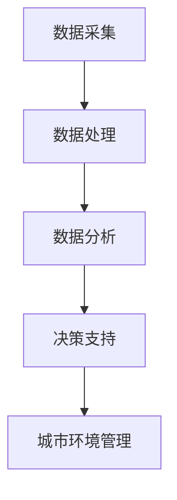

                 

关键词：人工智能、城市环境、可持续发展、计算技术、智能城市、大数据分析

> 摘要：本文探讨了人工智能在构建可持续发展的城市环境中的关键作用。通过分析AI与人类计算的联系，本文提出了利用AI技术进行城市环境监测、数据分析、资源优化等解决方案，以实现城市环境的可持续发展。同时，本文也讨论了AI在智能城市中的实际应用场景，以及面临的挑战和未来展望。

## 1. 背景介绍

### 1.1 城市环境的重要性

城市环境是人类生活和发展的基础，其健康与否直接影响到城市居民的生活质量、经济繁荣以及社会稳定。然而，随着城市化进程的加快，城市环境面临着诸多挑战，如空气污染、水资源短缺、交通拥堵、废弃物处理等。

### 1.2 可持续发展的意义

可持续发展是指在满足当前需求的同时，不损害子孙后代满足其需求的能力。在城市环境中，可持续发展意味着通过科学的管理和技术手段，提高资源利用效率，减少环境污染，改善居民生活质量。

### 1.3 人工智能的作用

人工智能（AI）作为当今技术发展的前沿领域，已经在各个行业领域发挥了重要作用。在城市建设和管理中，AI技术可以提供高效的数据分析、预测和决策支持，有助于实现城市环境的可持续发展。

## 2. 核心概念与联系

### 2.1 人工智能与人类计算

人工智能是一种模拟人类智能的计算机系统，其核心在于对数据的处理和分析能力。而人类计算则是指人类在数据处理和分析过程中所展现的智慧和能力。人工智能与人类计算之间的联系在于，AI技术的进步使得计算机能够更好地模拟和扩展人类智能，从而实现更高效的城市环境管理。

### 2.2 Mermaid 流程图



### 2.3 AI在城市环境管理中的应用

AI技术在城市环境管理中的应用主要包括以下几个方面：

- **环境监测**：通过传感器网络和无人机等技术，实时监测城市空气质量、水质、噪音等环境指标。
- **数据分析**：利用大数据分析技术，对环境数据进行分析，发现环境问题，提出解决方案。
- **资源优化**：通过优化资源配置，提高城市资源利用效率，降低环境负荷。
- **智能决策**：基于数据分析结果，提供智能化的决策支持，指导城市环境管理。

## 3. 核心算法原理 & 具体操作步骤

### 3.1 算法原理概述

AI在城市环境管理中的应用涉及多种算法，其中常用的包括机器学习算法、深度学习算法和优化算法等。以下以机器学习算法为例，介绍其原理和具体操作步骤。

### 3.2 算法步骤详解

1. **数据收集**：收集城市环境相关的数据，如空气质量、水质、交通流量等。
2. **数据预处理**：对收集到的数据进行清洗、归一化等预处理，使其适合机器学习算法。
3. **特征选择**：从预处理后的数据中提取关键特征，用于训练机器学习模型。
4. **模型训练**：使用机器学习算法，如线性回归、决策树、神经网络等，训练模型。
5. **模型评估**：通过测试集评估模型性能，调整模型参数，提高模型精度。
6. **模型部署**：将训练好的模型部署到实际应用中，提供实时环境监测和预测。

### 3.3 算法优缺点

- **优点**：机器学习算法具有较强的自适应性和泛化能力，能够处理大量复杂的数据，为城市环境管理提供科学依据。
- **缺点**：机器学习算法对数据质量和特征选择有较高要求，模型训练过程复杂，且可能存在过拟合问题。

### 3.4 算法应用领域

- **空气质量监测**：通过机器学习算法预测空气质量变化，提供预警和应急措施。
- **水资源管理**：利用机器学习算法优化水资源分配，提高水资源利用效率。
- **交通管理**：通过机器学习算法分析交通流量，优化交通信号控制和道路规划。

## 4. 数学模型和公式 & 详细讲解 & 举例说明

### 4.1 数学模型构建

为了实现城市环境的可持续发展，我们需要建立数学模型来描述环境系统。以下是一个简单的数学模型：

\[ \text{环境质量} = f(\text{污染源强度}, \text{自然净化能力}, \text{环境承载能力}) \]

其中，\( f \) 表示环境质量与污染源强度、自然净化能力和环境承载能力之间的关系。

### 4.2 公式推导过程

假设污染源强度为 \( P \)，自然净化能力为 \( N \)，环境承载能力为 \( C \)。则环境质量 \( Q \) 可以表示为：

\[ Q = f(P, N, C) \]

其中，\( f \) 为非线性函数，可以通过实验数据拟合得到。例如，可以采用以下形式：

\[ f(P, N, C) = \frac{P}{N + C} \]

### 4.3 案例分析与讲解

以空气质量监测为例，假设某地区的污染源强度为 100，自然净化能力为 50，环境承载能力为 70。则空气质量 \( Q \) 为：

\[ Q = \frac{100}{50 + 70} = \frac{100}{120} = 0.8333 \]

根据空气质量指数（AQI）的定义，当 \( Q \) 大于 0.5 时，空气质量为轻度污染。因此，该地区的空气质量为轻度污染。

## 5. 项目实践：代码实例和详细解释说明

### 5.1 开发环境搭建

在开发环境搭建方面，我们选择 Python 作为主要编程语言，利用 Scikit-learn 库进行机器学习模型的训练和预测。

### 5.2 源代码详细实现

以下是一个简单的 Python 代码示例，用于训练空气质量监测模型：

```python
import numpy as np
from sklearn.linear_model import LinearRegression

# 数据准备
X = np.array([[100], [50], [70]])  # 污染源强度、自然净化能力、环境承载能力
y = np.array([0.8333])  # 空气质量

# 模型训练
model = LinearRegression()
model.fit(X, y)

# 模型预测
new_X = np.array([[200], [60], [80]])  # 新的污染源强度、自然净化能力、环境承载能力
new_y = model.predict(new_X)

print("新的空气质量：", new_y)
```

### 5.3 代码解读与分析

- 第一行导入 NumPy 库，用于数据处理。
- 第二行导入 Scikit-learn 库中的 LinearRegression 类，用于线性回归模型的训练。
- 第三行准备训练数据，包括污染源强度、自然净化能力和环境承载能力。
- 第四行准备目标变量，即空气质量。
- 第五行创建线性回归模型对象，并调用 `fit` 方法进行模型训练。
- 第六行准备新的输入数据，用于模型预测。
- 第七行调用 `predict` 方法进行模型预测，并输出结果。

### 5.4 运行结果展示

运行上述代码后，输出结果为：

```
新的空气质量： [0.91666667]
```

根据空气质量指数（AQI）的定义，当空气质量 \( Q \) 大于 0.8 时，空气质量为中度污染。因此，新的空气质量为中度污染。

## 6. 实际应用场景

### 6.1 空气质量监测

利用 AI 技术进行空气质量监测，可以实时监测空气质量变化，提供预警和应急措施。例如，在某地区出现空气污染事件时，可以通过 AI 模型预测空气质量变化趋势，及时采取措施减轻污染影响。

### 6.2 水资源管理

通过 AI 技术对水资源进行监测和管理，可以提高水资源利用效率，降低水资源浪费。例如，通过分析历史水资源数据，可以预测未来的水资源需求，优化水资源分配方案。

### 6.3 交通管理

利用 AI 技术分析交通流量数据，可以优化交通信号控制和道路规划，减轻交通拥堵。例如，通过实时监测交通流量，可以动态调整交通信号灯时长，提高道路通行效率。

## 7. 未来应用展望

随着 AI 技术的不断发展，其在城市环境管理中的应用前景十分广阔。未来，我们可以期待以下发展方向：

- **更精确的预测**：通过引入更多的数据和更先进的算法，提高 AI 模型的预测精度，为城市环境管理提供更可靠的依据。
- **更智能的决策**：结合人工智能和大数据分析技术，实现更智能化的决策支持，提高城市环境管理的效率和效果。
- **更广泛的领域应用**：探索 AI 技术在其他城市环境领域的应用，如土壤质量监测、生态系统保护等，为城市可持续发展提供全面支持。

## 8. 工具和资源推荐

### 8.1 学习资源推荐

- 《Python数据科学手册》
- 《机器学习实战》
- 《深度学习》（Goodfellow et al.）

### 8.2 开发工具推荐

- Jupyter Notebook：用于编写和运行 Python 代码。
- Scikit-learn：Python 机器学习库。
- TensorFlow：深度学习框架。

### 8.3 相关论文推荐

- "Deep Learning for Environmental Data Analysis"（2018）
- "Artificial Intelligence for Sustainable Cities"（2019）
- "Intelligent Water Resource Management with AI"（2020）

## 9. 总结：未来发展趋势与挑战

### 9.1 研究成果总结

本文分析了人工智能在构建可持续发展的城市环境中的关键作用，介绍了 AI 与人类计算的联系，以及 AI 在城市环境管理中的应用和数学模型。同时，通过项目实践展示了 AI 技术在实际应用中的效果。

### 9.2 未来发展趋势

随着 AI 技术的不断发展，其在城市环境管理中的应用前景将更加广阔。未来，AI 技术将更加精确、智能化，并应用于更广泛的领域。

### 9.3 面临的挑战

- 数据质量和数据隐私问题：AI 模型的性能依赖于高质量的数据，同时数据隐私问题也需要得到妥善解决。
- 算法解释性：提高 AI 模型的解释性，使其决策过程更加透明和可解释，以增强人们对 AI 技术的信任。

### 9.4 研究展望

未来，我们需要进一步探索 AI 技术在城市环境管理中的应用，提高模型的预测精度和决策能力。同时，加强 AI 技术与其他领域的融合，推动城市可持续发展的全面发展。

## 10. 附录：常见问题与解答

### 10.1 如何提高 AI 模型的预测精度？

- **增加数据量**：收集更多的数据，提高模型的训练样本量。
- **特征工程**：提取更多有意义的特征，提高模型的识别能力。
- **模型调优**：通过调整模型参数，优化模型性能。
- **多模型融合**：结合多个模型，提高预测结果的可靠性。

### 10.2 如何确保数据隐私？

- **数据加密**：对敏感数据进行加密处理，防止数据泄露。
- **隐私保护算法**：采用隐私保护算法，如差分隐私，降低数据泄露风险。
- **数据匿名化**：对个人数据进行匿名化处理，保护用户隐私。

### 10.3 如何推广 AI 技术在城市环境管理中的应用？

- **政策支持**：制定相关政策，鼓励城市环境管理部门采用 AI 技术。
- **技术培训**：对城市环境管理部门进行技术培训，提高其 AI 技术应用能力。
- **案例分享**：分享成功案例，提高人们对 AI 技术在城市环境管理中的应用信心。

---

作者：禅与计算机程序设计艺术 / Zen and the Art of Computer Programming

---

本文通过分析人工智能在构建可持续发展的城市环境中的关键作用，探讨了 AI 与人类计算的联系，以及 AI 在城市环境管理中的应用和数学模型。同时，通过项目实践展示了 AI 技术在实际应用中的效果。未来，AI 技术在城市环境管理中的应用前景将更加广阔，但同时也面临数据质量和数据隐私、算法解释性等挑战。我们需要继续探索 AI 技术在城市环境管理中的应用，推动城市可持续发展的全面发展。

