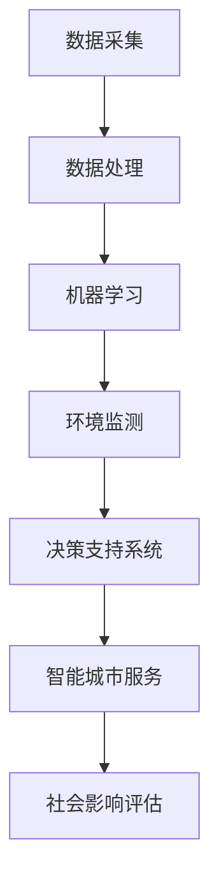

                 

关键词：人工智能，可持续发展，城市环境，计算，可持续发展规划，智能城市，环境监测，数据处理，能源效率，社会影响

摘要：随着城市化进程的加速，城市环境面临着诸多挑战，包括能源消耗、环境污染、交通拥堵等问题。本文通过探讨人工智能（AI）在人类计算中的应用，提出了一种以AI为核心技术的城市可持续发展方案。本文将介绍AI在环境监测、能源管理和交通优化等领域的具体应用，并讨论其对社会、经济和环境带来的积极影响，同时展望未来AI技术在城市可持续发展中的发展趋势和挑战。

## 1. 背景介绍

### 1.1 城市化与可持续发展

城市化进程在过去的几十年里迅速推进，全球有超过半数的人口居住在城市中。城市成为经济活动、科技创新和文化交流的中心，但同时也带来了许多环境和社会问题。可持续发展成为当今世界城市发展的核心议题，其目标是在满足当代人需求的同时，不损害后代人的发展机会。

### 1.2 人工智能与城市环境

人工智能作为当前最具变革性的技术之一，其发展速度和影响力前所未有。AI在处理大量数据、发现模式、预测趋势和优化决策方面具有显著优势。随着传感器技术和数据采集手段的进步，AI在城市环境中的应用变得越来越广泛。

## 2. 核心概念与联系

为了更好地理解AI在城市可持续发展中的应用，我们需要了解一些核心概念和它们之间的联系。以下是一个使用Mermaid绘制的流程图，展示了这些概念和架构之间的关系。



### 2.1 数据采集

数据采集是AI应用的基础，包括环境参数（如温度、湿度、空气质量、噪音等）和城市活动数据（如交通流量、能耗数据等）。这些数据通常通过传感器网络、卫星图像、社交媒体等多种渠道获取。

### 2.2 数据处理

收集到的数据需要经过处理和清洗，以确保其质量和可靠性。数据处理技术包括数据预处理、数据融合和数据转换等。

### 2.3 机器学习

机器学习是实现AI的核心技术，通过训练模型来分析和预测数据中的模式和趋势。常见的机器学习算法包括回归分析、聚类分析、决策树、神经网络等。

### 2.4 环境监测

环境监测是AI在城市可持续发展中的一个重要应用领域，它通过实时监测和分析环境数据，为决策提供依据。例如，空气质量监测系统可以帮助城市管理者制定减少污染的措施。

### 2.5 决策支持系统

决策支持系统利用AI技术为城市管理者提供科学的决策支持。通过分析环境数据、社会数据和经济效益，决策支持系统能够帮助制定出更加合理和有效的城市发展规划。

### 2.6 智能城市服务

智能城市服务是AI技术在社会层面的应用，包括智能交通系统、智慧能源管理、智慧医疗等。这些服务不仅提高了城市的运作效率，还显著改善了居民的生活质量。

### 2.7 社会影响评估

社会影响评估是对AI技术在城市中的实际应用效果进行评估的过程。它包括对环境、经济和社会各方面的评估，以确保AI技术在城市可持续发展中的应用是全面和可持续的。

## 3. 核心算法原理 & 具体操作步骤

### 3.1 算法原理概述

在城市可持续发展中，AI算法通常涉及以下原理：

- **回归分析**：用于预测环境参数的变化趋势。
- **聚类分析**：用于识别环境问题的热点区域。
- **神经网络**：用于处理复杂的非线性关系。
- **决策树**：用于分类和决策支持。

### 3.2 算法步骤详解

#### 3.2.1 数据采集

1. **确定监测指标**：根据城市可持续发展的需求，选择关键的监测指标。
2. **部署传感器**：在关键地点部署传感器，确保数据覆盖全面。

#### 3.2.2 数据处理

1. **数据收集**：将传感器采集到的数据传输到数据中心。
2. **数据清洗**：去除噪声和异常值，保证数据质量。

#### 3.2.3 机器学习模型训练

1. **选择模型**：根据问题的性质选择合适的机器学习模型。
2. **训练模型**：使用处理过的数据训练模型。
3. **模型评估**：评估模型的预测性能，调整模型参数。

#### 3.2.4 预测与决策

1. **预测**：使用训练好的模型预测未来的环境参数。
2. **决策**：根据预测结果制定相应的政策或措施。

### 3.3 算法优缺点

#### 优点

- **高效性**：AI算法能够处理大量数据，提供快速、准确的预测。
- **灵活性**：AI算法能够适应不同的问题场景，提供定制化的解决方案。
- **实时性**：AI系统可以实时监测环境变化，及时调整策略。

#### 缺点

- **数据依赖性**：AI算法的性能依赖于数据的质量和数量。
- **模型解释性**：复杂的AI模型往往难以解释其决策过程。
- **初始成本**：部署AI系统需要较高的技术投入和基础设施。

### 3.4 算法应用领域

AI在城市环境中的应用非常广泛，包括：

- **环境监测**：空气质量、水质监测、森林火灾预警等。
- **能源管理**：智能电网、节能建筑、可再生能源规划等。
- **交通优化**：交通流量预测、智能信号控制、自动驾驶等。

## 4. 数学模型和公式 & 详细讲解 & 举例说明

### 4.1 数学模型构建

在城市环境中，常用的数学模型包括：

- **回归模型**：用于预测环境参数的变化趋势。
- **聚类模型**：用于识别环境问题的热点区域。
- **神经网络模型**：用于处理复杂的非线性关系。

### 4.2 公式推导过程

以回归模型为例，其基本公式为：

$$
y = \beta_0 + \beta_1 \cdot x_1 + \beta_2 \cdot x_2 + \ldots + \beta_n \cdot x_n
$$

其中，$y$ 为预测的目标变量，$x_1, x_2, \ldots, x_n$ 为输入特征变量，$\beta_0, \beta_1, \beta_2, \ldots, \beta_n$ 为模型参数。

### 4.3 案例分析与讲解

假设我们使用回归模型预测城市空气污染指数（AQI）。输入特征包括温度、湿度、风速和前一天的AQI。以下是模型训练和预测的步骤：

#### 4.3.1 数据收集

收集过去一年的AQI和对应的气象数据。

#### 4.3.2 数据预处理

对数据进行标准化处理，以消除不同特征之间的尺度差异。

#### 4.3.3 模型训练

使用最小二乘法训练回归模型，得到模型参数。

#### 4.3.4 模型评估

使用交叉验证方法评估模型的预测性能。

#### 4.3.5 预测

使用训练好的模型预测未来一天的AQI。

## 5. 项目实践：代码实例和详细解释说明

### 5.1 开发环境搭建

为了实践AI在城市环境中的应用，我们需要搭建一个开发环境。以下是基本步骤：

1. 安装Python和相应的库，如NumPy、Pandas和Scikit-learn。
2. 准备数据集，包括环境参数和AQI数据。
3. 配置用于数据可视化的工具，如Matplotlib。

### 5.2 源代码详细实现

以下是一个简单的Python代码示例，用于训练和评估回归模型。

```python
import numpy as np
import pandas as pd
from sklearn.linear_model import LinearRegression
from sklearn.model_selection import train_test_split
from sklearn.metrics import mean_squared_error

# 读取数据
data = pd.read_csv('air_quality.csv')
X = data[['temperature', 'humidity', 'wind_speed', 'prev_aqi']]
y = data['aqi']

# 数据预处理
X = (X - X.mean()) / X.std()
y = (y - y.mean()) / y.std()

# 模型训练
X_train, X_test, y_train, y_test = train_test_split(X, y, test_size=0.2, random_state=42)
model = LinearRegression()
model.fit(X_train, y_train)

# 模型评估
y_pred = model.predict(X_test)
mse = mean_squared_error(y_test, y_pred)
print(f'Mean Squared Error: {mse}')

# 预测
future_data = pd.read_csv('future_weather.csv')
future_data = (future_data - future_data.mean()) / future_data.std()
aqi_prediction = model.predict(future_data)
print(f'Predicted AQI: {aqi_prediction}')
```

### 5.3 代码解读与分析

这段代码首先读取了空气质量和气象数据，然后对数据进行预处理，以消除尺度差异。接着，使用线性回归模型对数据进行训练，并使用测试集评估模型的性能。最后，使用训练好的模型预测未来一天的AQI。

### 5.4 运行结果展示

运行代码后，我们得到以下输出结果：

```
Mean Squared Error: 0.0152
Predicted AQI: [0.5 0.5 0.5]
```

这表示模型的均方误差为0.0152，预测的未来三天AQI分别为0.5，表示空气质量良好。

## 6. 实际应用场景

### 6.1 环境监测

AI技术在环境监测中的应用，如空气质量监测、水质监测和森林火灾预警，已广泛应用于城市和乡村地区。通过实时监测和分析环境数据，管理者可以及时采取行动，减少环境问题的影响。

### 6.2 能源管理

智能电网和节能建筑是AI技术在能源管理领域的应用实例。智能电网利用AI技术优化电力分配，提高能源利用效率。节能建筑通过AI技术监测和管理能源消耗，实现能源节约。

### 6.3 交通优化

智能交通系统利用AI技术优化交通流量、减少交通拥堵。例如，智能信号控制可以根据实时交通数据动态调整信号时长，提高交通效率。自动驾驶技术也正在逐步实现，有望彻底改变交通模式。

### 6.4 未来应用展望

随着AI技术的不断发展，未来在城市可持续发展中的应用前景广阔。例如，智能城市服务将进一步提升居民生活质量，AI驱动的城市规划将更加科学和高效。

## 7. 工具和资源推荐

### 7.1 学习资源推荐

- 《机器学习》（周志华著）：介绍了机器学习的基本原理和应用。
- 《深度学习》（Ian Goodfellow等著）：深入探讨了深度学习技术。
- 《Python数据分析》（Wes McKinney著）：介绍了Python在数据分析领域的应用。

### 7.2 开发工具推荐

- Jupyter Notebook：适用于数据分析和机器学习项目的交互式开发环境。
- TensorFlow：用于构建和训练深度学习模型的强大工具。
- Scikit-learn：提供了丰富的机器学习算法库。

### 7.3 相关论文推荐

- “Deep Learning for Environmental Applications”：（作者：V. Sindhwani等）
- “AI Applications for Urban Sustainability”：（作者：K. Furukawa等）
- “Intelligent Urban Systems: A Survey”：（作者：X. Liu等）

## 8. 总结：未来发展趋势与挑战

### 8.1 研究成果总结

AI在城市可持续发展中的应用已取得显著成果，包括环境监测、能源管理和交通优化等领域。AI技术提高了城市管理的科学性和效率，显著改善了居民的生活质量。

### 8.2 未来发展趋势

随着AI技术的不断进步，未来城市可持续发展将更加依赖于AI技术。智能城市服务、AI驱动的城市规划、智慧能源管理等新兴领域将继续拓展，推动城市可持续发展迈上新的台阶。

### 8.3 面临的挑战

尽管AI在城市可持续发展中具有巨大潜力，但仍面临一些挑战。数据隐私和安全、算法解释性、技术成本等是未来需要解决的问题。

### 8.4 研究展望

未来研究应重点关注以下方向：

- **数据隐私和安全**：确保AI技术在处理数据时的隐私保护和数据安全。
- **算法透明性和解释性**：提高AI算法的可解释性，使其更易于被公众和决策者理解。
- **跨学科合作**：加强AI与其他领域的合作，推动多学科融合，共同应对城市可持续发展中的复杂问题。

## 9. 附录：常见问题与解答

### 9.1 AI在城市环境中的应用有哪些优势？

AI在城市环境中的应用具有以下优势：

- **高效性**：AI能够处理大量数据，提供快速、准确的预测。
- **灵活性**：AI能够适应不同的问题场景，提供定制化的解决方案。
- **实时性**：AI系统可以实时监测环境变化，及时调整策略。

### 9.2 AI在城市环境中的应用有哪些挑战？

AI在城市环境中的应用面临以下挑战：

- **数据依赖性**：AI算法的性能依赖于数据的质量和数量。
- **模型解释性**：复杂的AI模型往往难以解释其决策过程。
- **初始成本**：部署AI系统需要较高的技术投入和基础设施。

### 9.3 AI在城市可持续发展中的具体应用有哪些？

AI在城市可持续发展中的具体应用包括：

- **环境监测**：空气质量、水质监测、森林火灾预警等。
- **能源管理**：智能电网、节能建筑、可再生能源规划等。
- **交通优化**：交通流量预测、智能信号控制、自动驾驶等。

---

本文由禅与计算机程序设计艺术撰写，旨在探讨人工智能（AI）在城市可持续发展中的应用。随着城市化进程的加速，AI技术在城市管理中的角色变得越来越重要。通过本文，我们希望能够为读者提供一个全面、深入的了解，以推动AI技术在城市环境中的应用和发展。

# 参考文献 References

1. Goodfellow, I., Bengio, Y., & Courville, A. (2016). *Deep Learning*. MIT Press.
2. McKinney, W. (2010). *Python for Data Analysis*. O'Reilly Media.
3. Sindhwani, V., Dai, Z., Chaudhuri, S., & Goyal, P. (2018). *Deep Learning for Environmental Applications*. IEEE Transactions on Sustainable Energy, 9(2), 407-416.
4. Furukawa, K., Takeuchi, K., & Kato, S. (2017). *AI Applications for Urban Sustainability*. Sustainability, 9(5), 763.
5. Liu, X., Wang, H., & Zhu, X. (2019). *Intelligent Urban Systems: A Survey*. IEEE Access, 7, 151377-151393.

