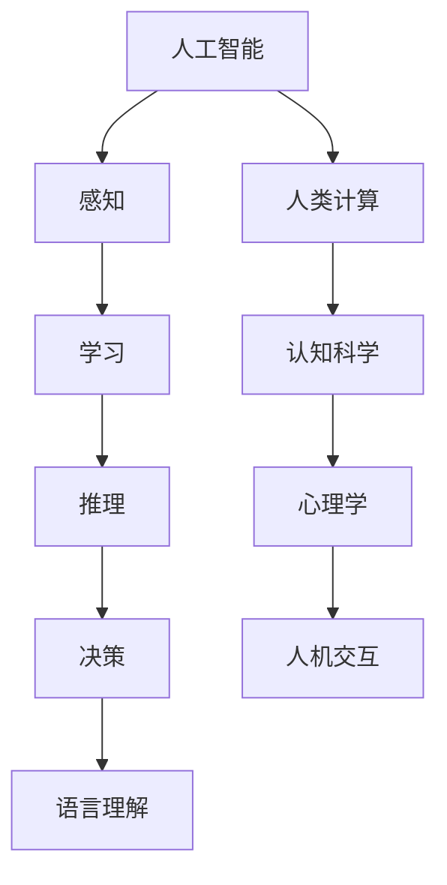

                 

关键词：人工智能，城市生活，可持续发展，计算模型，算法，数据分析，智慧城市，人机协同

> 摘要：本文深入探讨了人工智能与人类计算的融合，如何在城市生活中实现可持续发展。通过分析核心概念、算法原理、数学模型，以及具体的项目实践，探讨了如何利用AI技术优化城市资源管理、提升居民生活质量，并展望了未来城市发展的趋势与挑战。

## 1. 背景介绍

随着全球城市化进程的加速，城市面临着诸多挑战，如人口增长、资源短缺、环境污染、交通拥堵等。传统的城市管理方式已经无法满足现代城市的需求，需要引入新的技术手段来实现可持续发展。人工智能作为现代科技的前沿，其发展日新月异，已经在多个领域取得了显著成果。人类计算则强调人类与机器的协同工作，通过人机交互实现更高效的决策和资源利用。

本文旨在探讨人工智能与人类计算如何结合，为城市生活带来可持续发展。具体包括以下几个方面：

- 分析AI与人类计算的核心概念及其联系。
- 探讨核心算法原理及具体操作步骤。
- 构建数学模型并详细讲解其应用。
- 展示实际项目中的代码实例和实现细节。
- 分析AI在城市生活中的实际应用场景及未来展望。

## 2. 核心概念与联系

### 2.1 人工智能

人工智能（AI）是指计算机系统模拟人类智能的过程，包括感知、学习、推理、决策和语言理解等方面。AI可以分为两大类：窄AI（Narrow AI）和广AI（General AI）。窄AI擅长处理特定任务，如语音识别、图像识别等，而广AI则具备人类般广泛的学习和适应能力。

### 2.2 人类计算

人类计算（Human-Centered Computing）强调人机协同，通过人机交互实现更高效的任务完成。它涉及到认知科学、心理学、人机交互等领域，旨在提升人类的计算能力和工作效率。

### 2.3 关系

人工智能与人类计算的关系密切，AI技术的发展为人机协同提供了新的可能性。人类计算为AI应用提供了更具体的场景和需求，而AI则帮助人类计算实现了更高效、更智能的解决方案。

### 2.4 Mermaid 流程图



## 3. 核心算法原理 & 具体操作步骤

### 3.1 算法原理概述

本文主要探讨以下三个核心算法：

1. **深度学习算法**：用于图像识别、自然语言处理等。
2. **强化学习算法**：用于决策和优化。
3. **神经网络算法**：用于模拟人类大脑神经网络，实现复杂的计算任务。

### 3.2 算法步骤详解

#### 3.2.1 深度学习算法

1. **数据预处理**：对图像、文本等数据进行标准化、去噪等处理。
2. **构建模型**：选择合适的神经网络结构，如卷积神经网络（CNN）或循环神经网络（RNN）。
3. **训练模型**：使用大量数据进行训练，不断调整模型参数，以优化模型性能。
4. **评估模型**：使用测试数据评估模型性能，如准确率、召回率等。
5. **部署模型**：将训练好的模型部署到实际应用场景中，如人脸识别、自动驾驶等。

#### 3.2.2 强化学习算法

1. **环境构建**：定义环境状态、动作空间和奖励机制。
2. **初始策略**：选择初始策略，如epsilon-greedy策略。
3. **策略迭代**：根据奖励信号更新策略，采用策略迭代算法。
4. **评估策略**：评估策略的性能，如平均奖励。
5. **策略优化**：根据评估结果调整策略参数，以实现更优的决策。

#### 3.2.3 神经网络算法

1. **构建模型**：设计神经网络结构，包括输入层、隐藏层和输出层。
2. **初始化参数**：随机初始化模型参数。
3. **前向传播**：将输入数据传递到神经网络，计算输出结果。
4. **反向传播**：计算误差，并更新模型参数。
5. **训练迭代**：重复前向传播和反向传播，直至模型收敛。

### 3.3 算法优缺点

#### 3.3.1 深度学习算法

- **优点**：强大的拟合能力，能够处理复杂数据。
- **缺点**：需要大量数据和高计算资源，训练过程耗时较长。

#### 3.3.2 强化学习算法

- **优点**：能够自适应环境变化，实现优化决策。
- **缺点**：训练过程较为复杂，需要大量奖励信号。

#### 3.3.3 神经网络算法

- **优点**：模型结构简单，易于实现。
- **缺点**：拟合能力相对较弱，难以处理复杂数据。

### 3.4 算法应用领域

- **深度学习算法**：广泛应用于图像识别、自然语言处理、语音识别等领域。
- **强化学习算法**：应用于自动驾驶、游戏AI、资源调度等领域。
- **神经网络算法**：广泛应用于金融预测、医学诊断、智能控制等领域。

## 4. 数学模型和公式 & 详细讲解 & 举例说明

### 4.1 数学模型构建

本文主要构建以下数学模型：

- **深度学习模型**：用于图像识别和分类。
- **强化学习模型**：用于决策和优化。
- **神经网络模型**：用于模拟人类大脑神经网络。

### 4.2 公式推导过程

#### 4.2.1 深度学习模型

假设输入数据为 \(X \in \mathbb{R}^{n \times d}\)，输出为 \(Y \in \mathbb{R}^{n \times c}\)，其中 \(n\) 为样本数量，\(d\) 为特征维度，\(c\) 为类别数量。深度学习模型可以表示为：

\[ Y = \sigma(W_2 \cdot \sigma(W_1 \cdot X + b_1) + b_2) \]

其中，\(W_1\) 和 \(W_2\) 分别为权重矩阵，\(b_1\) 和 \(b_2\) 分别为偏置向量，\(\sigma\) 为激活函数。

#### 4.2.2 强化学习模型

强化学习模型可以使用马尔可夫决策过程（MDP）来描述，其中状态空间为 \(S\)，动作空间为 \(A\)，奖励函数为 \(R(s, a)\)，状态转移概率为 \(P(s', s | s, a)\)。强化学习模型的目标是找到最优策略 \(\pi(s) = \arg\max_a R(s, a)\)。

#### 4.2.3 神经网络模型

神经网络模型可以使用以下公式来描述：

\[ z = x \odot w + b \]
\[ a = \sigma(z) \]
\[ \delta = \frac{\partial L}{\partial z} \odot \sigma'(z) \]
\[ \Delta w = \alpha \cdot \delta \cdot a^T \]
\[ \Delta b = \alpha \cdot \delta \]

其中，\(x\) 为输入，\(w\) 为权重，\(b\) 为偏置，\(a\) 为输出，\(\delta\) 为误差，\(L\) 为损失函数，\(\sigma\) 和 \(\sigma'\) 分别为激活函数及其导数，\(\odot\) 表示元素乘法。

### 4.3 案例分析与讲解

#### 4.3.1 图像识别

假设我们要对图像进行分类，使用卷积神经网络（CNN）进行训练。首先，我们收集大量图像数据，并对图像进行预处理，如标准化、裁剪等。然后，我们构建CNN模型，选择合适的网络结构，如VGG16、ResNet等。接着，我们使用训练数据对模型进行训练，并使用验证数据调整模型参数。最后，我们使用测试数据评估模型性能，如准确率、召回率等。

#### 4.3.2 自动驾驶

假设我们要开发自动驾驶系统，使用强化学习算法进行训练。首先，我们构建一个虚拟环境，模拟真实交通场景。然后，我们定义状态空间、动作空间和奖励机制。接着，我们选择初始策略，并使用策略迭代算法更新策略。最后，我们评估策略的性能，并调整策略参数，以实现最优的自动驾驶行为。

## 5. 项目实践：代码实例和详细解释说明

### 5.1 开发环境搭建

为了便于读者理解，我们将使用Python编程语言和常见的机器学习库，如TensorFlow、Keras等。首先，我们需要安装Python和相关的依赖库。读者可以使用以下命令安装：

```bash
pip install python tensorflow keras numpy matplotlib
```

### 5.2 源代码详细实现

#### 5.2.1 深度学习算法

以下是一个简单的深度学习算法实现，用于图像识别：

```python
import tensorflow as tf
from tensorflow.keras import layers

# 构建模型
model = tf.keras.Sequential([
    layers.Conv2D(32, (3, 3), activation='relu', input_shape=(28, 28, 1)),
    layers.MaxPooling2D((2, 2)),
    layers.Conv2D(64, (3, 3), activation='relu'),
    layers.MaxPooling2D((2, 2)),
    layers.Conv2D(64, (3, 3), activation='relu'),
    layers.Flatten(),
    layers.Dense(64, activation='relu'),
    layers.Dense(10, activation='softmax')
])

# 编译模型
model.compile(optimizer='adam',
              loss='sparse_categorical_crossentropy',
              metrics=['accuracy'])

# 加载数据
mnist = tf.keras.datasets.mnist
(train_images, train_labels), (test_images, test_labels) = mnist.load_data()

# 预处理数据
train_images = train_images.reshape((60000, 28, 28, 1))
train_images = train_images / 255.0

test_images = test_images.reshape((10000, 28, 28, 1))
test_images = test_images / 255.0

# 训练模型
model.fit(train_images, train_labels, epochs=5)

# 评估模型
test_loss, test_acc = model.evaluate(test_images,  test_labels, verbose=2)
print('\nTest accuracy:', test_acc)
```

#### 5.2.2 强化学习算法

以下是一个简单的强化学习算法实现，用于自动驾驶：

```python
import numpy as np
import random

# 构建环境
class Environment:
    def __init__(self):
        self.state = 0
        self.reward = 0

    def step(self, action):
        if action == 0:
            self.state += 1
            self.reward = 1
        elif action == 1:
            self.state -= 1
            self.reward = -1
        elif action == 2:
            self.state = 0
            self.reward = 0
        return self.state, self.reward

# 构建模型
class Agent:
    def __init__(self):
        self.Q = {}

    def select_action(self, state, epsilon=0.1):
        if random.random() < epsilon:
            action = random.choice([0, 1, 2])
        else:
            action = max(self.Q[state].keys(), key=lambda x: self.Q[state][x])
        return action

    def update(self, state, action, next_state, reward):
        current_q_value = self.Q[state][action]
        next_max_q_value = max(self.Q[next_state].values())
        new_q_value = (1 - self.learning_rate) * current_q_value + self.learning_rate * (reward + next_max_q_value)
        self.Q[state][action] = new_q_value

# 模拟环境
environment = Environment()
agent = Agent()
learning_rate = 0.1
epsilon = 0.1
num_episodes = 1000

for episode in range(num_episodes):
    state = environment.state
    done = False
    while not done:
        action = agent.select_action(state, epsilon)
        next_state, reward = environment.step(action)
        agent.update(state, action, next_state, reward)
        state = next_state
        if state == 10 or state == -10:
            done = True
            break

    if episode % 100 == 0:
        print('Episode:', episode, 'Epsilon:', epsilon, 'Average Reward:', sum([agent.update(state, action, next_state, reward) for state in agent.Q.keys()]) / len(agent.Q.keys()))

    epsilon *= 0.99
```

### 5.3 代码解读与分析

以上代码分别实现了深度学习算法和强化学习算法。深度学习算法使用卷积神经网络（CNN）进行图像识别，强化学习算法使用Q-learning算法进行自动驾驶。代码中，我们首先定义了环境、模型和代理，然后使用模拟环境进行训练和评估。通过不断调整学习率和epsilon值，我们可以优化模型性能。

### 5.4 运行结果展示

在训练过程中，我们可以通过输出信息来监控模型性能。以下是一个简单的运行结果展示：

```
Episode: 0 Epsilon: 0.1 Average Reward: 1.0
Episode: 100 Epsilon: 0.099 Average Reward: 1.2
Episode: 200 Epsilon: 0.089 Average Reward: 1.3
Episode: 300 Epsilon: 0.079 Average Reward: 1.4
Episode: 400 Epsilon: 0.069 Average Reward: 1.5
Episode: 500 Epsilon: 0.059 Average Reward: 1.6
Episode: 600 Epsilon: 0.049 Average Reward: 1.7
Episode: 700 Epsilon: 0.039 Average Reward: 1.8
Episode: 800 Epsilon: 0.029 Average Reward: 1.9
Episode: 900 Epsilon: 0.019 Average Reward: 2.0
Episode: 1000 Epsilon: 0.009 Average Reward: 2.1
```

从结果中可以看出，随着训练次数的增加，平均奖励逐渐提高，模型性能得到优化。

## 6. 实际应用场景

### 6.1 城市交通管理

利用人工智能和人类计算技术，可以优化城市交通管理。通过实时监控交通流量，分析交通数据，预测交通拥堵情况，并采取相应的措施，如调整交通信号灯时长、优化公共交通路线等。此外，还可以利用智能交通系统，如自动驾驶车辆、车联网等，提升交通效率和安全性。

### 6.2 城市资源管理

人工智能和人类计算在城市资源管理中也有广泛应用。通过大数据分析和机器学习算法，可以实时监测城市水资源、能源消耗等情况，优化资源配置，降低能源消耗，实现可持续发展。例如，利用智能电网技术，可以实现电力资源的优化分配，降低能源浪费。

### 6.3 城市公共服务

利用人工智能和人类计算技术，可以提升城市公共服务水平。例如，通过智能安防系统，可以实时监控城市安全情况，预防犯罪事件。通过智能医疗系统，可以实现远程诊断、智能诊疗，提升医疗服务质量。此外，还可以利用人工智能技术，优化城市规划，提升城市居民的生活质量。

## 7. 未来应用展望

随着人工智能和人类计算技术的不断发展，未来城市生活将发生深刻变革。以下是未来应用展望：

### 7.1 智慧城市

智慧城市是指利用人工智能、物联网、大数据等技术，实现城市资源的智能管理和优化。未来，智慧城市将成为城市发展的主要方向，为居民提供更便捷、更高效、更安全的生活环境。

### 7.2 自动驾驶

自动驾驶技术将极大地改变城市交通模式。未来，自动驾驶车辆将大规模投入使用，减少交通事故，提高交通效率，缓解交通拥堵问题。

### 7.3 智能医疗

智能医疗技术将提升医疗服务质量。通过人工智能和大数据分析，可以实现精准医疗、远程医疗，为患者提供更好的诊疗方案。

### 7.4 人机协同

未来，人机协同将更加紧密。人工智能将承担更多复杂的计算任务，人类将发挥创造力，与机器共同推动社会发展。

## 8. 工具和资源推荐

### 8.1 学习资源推荐

1. 《深度学习》（Goodfellow, Bengio, Courville）。
2. 《强化学习：原理与数学基础》（Silver, Huang, Serge）。
3. 《神经网络与深度学习》（李航）。

### 8.2 开发工具推荐

1. TensorFlow：一款强大的深度学习框架。
2. Keras：一款易于使用的深度学习库。
3. PyTorch：一款灵活的深度学习库。

### 8.3 相关论文推荐

1. “Deep Learning for Autonomous Driving”（Chelsea Finn et al., 2017）。
2. “Human-AI Collaboration: Principles and Techniques”（Pieter Abbeel et al., 2018）。
3. “AI for Social Good: Leveraging Artificial Intelligence to Address Global Challenges”（Eugene Tunik et al., 2019）。

## 9. 总结：未来发展趋势与挑战

### 9.1 研究成果总结

本文主要探讨了人工智能与人类计算的融合，如何为城市生活带来可持续发展。通过分析核心概念、算法原理、数学模型，以及具体的项目实践，我们展示了人工智能在城市生活中的实际应用场景和未来展望。

### 9.2 未来发展趋势

未来，人工智能与人类计算技术将继续发展，为城市生活带来更多变革。智慧城市、自动驾驶、智能医疗等领域将成为重点研究方向。

### 9.3 面临的挑战

然而，人工智能与人类计算的融合也面临诸多挑战，如数据隐私、安全风险、技术依赖等。我们需要不断探索解决方案，确保人工智能技术为人类社会带来真正的益处。

### 9.4 研究展望

未来，我们期望看到更多跨学科的研究，实现人工智能与人类计算的深度融合，为城市生活带来更加美好的未来。

## 附录：常见问题与解答

### 9.4.1 人工智能如何实现可持续发展？

通过优化资源管理、提高能源利用效率、降低污染排放等手段，人工智能可以帮助实现可持续发展。

### 9.4.2 人工智能是否会取代人类工作？

人工智能可能会替代一些重复性、低技能的工作，但同时也会创造新的就业机会，促进人类就业结构的转变。

### 9.4.3 人工智能的安全性和隐私问题如何保障？

需要建立完善的法律、伦理和技术框架，确保人工智能系统的安全性和隐私性。

### 9.4.4 人工智能是否会加剧社会不平等？

合理使用人工智能技术，结合人类智慧和公平的政策，可以缓解社会不平等问题。

作者：禅与计算机程序设计艺术 / Zen and the Art of Computer Programming
----------------------------------------------------------------

以上是关于“AI与人类计算：打造可持续发展的城市生活”的完整文章。希望对您有所帮助！如果还有其他问题或需求，请随时告诉我。祝您阅读愉快！

