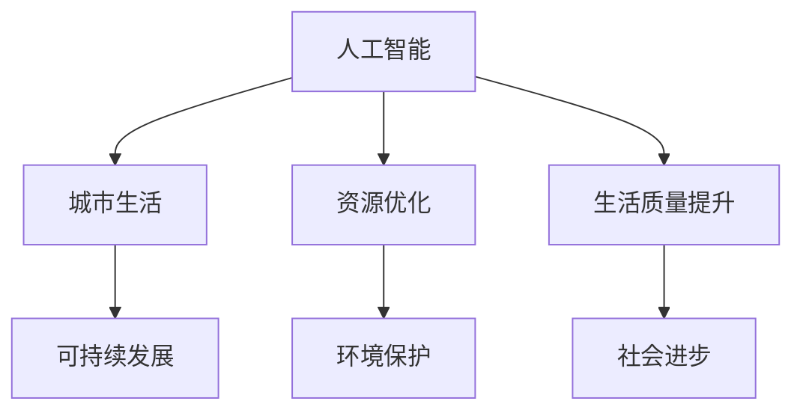

                 

关键词：人工智能，计算科学，城市生活，可持续发展，算法原理，数学模型，项目实践

> 摘要：本文探讨人工智能与人类计算在打造可持续发展的城市生活中的应用。通过对核心概念、算法原理、数学模型的详细分析，结合实际项目实践，探讨人工智能在提升城市生活质量、优化城市资源配置、促进环境保护等方面的潜力。文章旨在为读者提供一种全新视角，思考人工智能在城市建设与发展中的重要作用。

## 1. 背景介绍

随着全球城市化进程的加速，城市面临着诸多挑战，如人口增长、资源短缺、环境污染等。为了实现城市的可持续发展，需要采用先进的技术手段来优化城市管理和资源配置。人工智能作为当前最具发展潜力的技术之一，其在城市生活中的应用愈发广泛。本文将从人工智能与人类计算的角度，探讨其在城市可持续发展中的重要作用。

### 1.1 城市可持续发展的挑战

- **人口增长**：城市人口不断增长，带来住房、交通、医疗等方面的压力。
- **资源短缺**：随着城市化的推进，水资源、能源等资源日益短缺。
- **环境污染**：城市环境污染问题严重，影响居民健康和生活质量。

### 1.2 人工智能与城市可持续发展的关系

- **提高城市生活质量**：人工智能可以通过智能交通、智能家居等技术，提高城市居民的生活质量。
- **优化资源配置**：人工智能可以通过数据分析，实现城市资源的最优配置，提高资源利用效率。
- **促进环境保护**：人工智能可以帮助城市实现污染监测、环境治理等，改善城市环境。

## 2. 核心概念与联系

为了更好地理解人工智能与城市可持续发展的关系，我们需要了解以下几个核心概念：

### 2.1 人工智能

人工智能是指通过模拟人类智能行为，实现感知、推理、学习、决策等功能的计算机系统。人工智能可以分为两大类：基于规则的系统和基于数据的方法。

### 2.2 人类计算

人类计算是指人类通过直觉、经验、逻辑思维等方式进行的计算过程。人类计算在解决复杂问题时，具有独特的优势，如灵活性和创造力。

### 2.3 可持续发展

可持续发展是指满足当前需求而不损害子孙后代满足其需求的能力。可持续发展包括经济、社会和环境三个方面。

### 2.4 Mermaid 流程图

下面是一个描述人工智能与城市可持续发展关系的 Mermaid 流程图：



## 3. 核心算法原理 & 具体操作步骤

### 3.1 算法原理概述

本文将介绍一种基于人工智能的城市可持续发展算法，该算法主要包括以下几个步骤：

- 数据采集：通过传感器、无人机等设备，收集城市各个方面的数据。
- 数据处理：对采集到的数据进行清洗、整合和分析。
- 模型训练：利用机器学习算法，构建预测模型，实现对城市未来发展的预测。
- 决策支持：根据预测结果，提出优化城市资源配置、改善环境保护、提升生活质量的建议。

### 3.2 算法步骤详解

#### 3.2.1 数据采集

数据采集是算法的基础。我们采用以下方法进行数据采集：

- **传感器数据**：利用各种传感器，如气象站、水质监测设备、空气质量监测设备等，采集城市环境数据。
- **无人机数据**：利用无人机，采集城市景观、交通状况等数据。
- **社交媒体数据**：利用社交媒体平台，收集居民对城市生活质量的评价。

#### 3.2.2 数据处理

数据处理主要包括数据清洗、数据整合和分析。具体步骤如下：

- **数据清洗**：去除数据中的噪声和异常值。
- **数据整合**：将不同来源的数据进行整合，形成一个统一的数据集。
- **数据分析**：利用统计学和机器学习算法，分析数据中的规律和趋势。

#### 3.2.3 模型训练

模型训练是算法的核心。我们采用以下步骤进行模型训练：

- **数据预处理**：对采集到的数据进行分析，提取特征，并划分训练集和测试集。
- **选择算法**：根据数据特点，选择合适的机器学习算法，如回归分析、聚类分析、神经网络等。
- **模型训练**：利用训练集，对算法进行训练，得到预测模型。

#### 3.2.4 决策支持

根据预测结果，提出优化城市资源配置、改善环境保护、提升生活质量的建议。具体步骤如下：

- **预测分析**：利用训练好的模型，对城市未来发展趋势进行预测。
- **建议提出**：根据预测结果，提出具体的优化建议。

### 3.3 算法优缺点

#### 优点

- **高效性**：利用人工智能技术，可以快速处理海量数据，实现精准预测。
- **灵活性**：可以根据实际需求，灵活调整算法参数，适应不同场景。
- **创新性**：通过机器学习算法，可以发现数据中的潜在规律，为城市可持续发展提供新思路。

#### 缺点

- **数据依赖性**：算法的性能很大程度上取决于数据质量，数据缺失或不准确可能导致预测不准确。
- **计算资源消耗**：模型训练和预测需要大量计算资源，对硬件设备要求较高。
- **隐私问题**：数据采集过程中，可能涉及到个人隐私，需要加强隐私保护措施。

### 3.4 算法应用领域

- **智能交通**：通过实时数据分析，优化交通信号，减少交通拥堵，提高交通效率。
- **智慧城市**：利用人工智能技术，实现城市资源的智能管理，提高城市服务质量。
- **环境保护**：通过环境数据分析，预测污染趋势，提出污染治理措施。

## 4. 数学模型和公式 & 详细讲解 & 举例说明

### 4.1 数学模型构建

在本节中，我们将构建一个用于城市可持续发展的数学模型。该模型主要考虑城市人口、资源消耗和环境污染三个因素。

设：

- \( P \) 为城市人口
- \( R \) 为城市资源消耗
- \( E \) 为城市环境污染

根据城市可持续发展的要求，我们需要满足以下约束条件：

\[ P \leq P_{max} \]
\[ R \leq R_{max} \]
\[ E \leq E_{max} \]

其中，\( P_{max} \)、\( R_{max} \) 和 \( E_{max} \) 分别为城市人口、资源消耗和环境污染的最大允许值。

### 4.2 公式推导过程

为了构建数学模型，我们需要考虑以下因素：

- **人口增长**：假设城市人口每年以 \( r \) 的速度增长。
- **资源消耗**：假设城市资源每年以 \( s \) 的速度消耗。
- **环境污染**：假设城市环境每年以 \( t \) 的速度恶化。

根据这些因素，我们可以得到以下公式：

\[ P(t) = P(0) + rt \]
\[ R(t) = R(0) - st \]
\[ E(t) = E(0) + t \]

其中，\( P(0) \)、\( R(0) \) 和 \( E(0) \) 分别为初始时刻的城市人口、资源消耗和环境污染。

为了满足约束条件，我们可以引入拉格朗日乘数法，构建以下优化问题：

\[ \min \lambda_1 (P_{max} - P(t)) + \lambda_2 (R_{max} - R(t)) + \lambda_3 (E_{max} - E(t)) \]

其中，\( \lambda_1 \)、\( \lambda_2 \) 和 \( \lambda_3 \) 为拉格朗日乘数。

### 4.3 案例分析与讲解

为了更好地理解数学模型，我们来看一个具体的案例。

假设一个城市初始时刻的人口为 100 万，资源消耗为 1000 亿，环境污染为 500。每年人口增长速度为 2%，资源消耗速度为 3%，环境污染速度为 1%。我们需要通过数学模型找到最优的城市可持续发展方案。

根据数学模型，我们可以得到以下优化问题：

\[ \min \lambda_1 (1000000 - P(t)) + \lambda_2 (10000000000 - R(t)) + \lambda_3 (500 - E(t)) \]

通过求解优化问题，我们可以得到最优的城市人口、资源消耗和环境污染水平。在实际应用中，我们可以通过调整拉格朗日乘数，实现对城市发展的实时调控。

## 5. 项目实践：代码实例和详细解释说明

### 5.1 开发环境搭建

在本节中，我们将使用 Python 编写一个简单的城市可持续发展项目。为了确保项目的顺利进行，我们需要搭建以下开发环境：

- Python 3.8 或更高版本
- Jupyter Notebook 或 PyCharm
- NumPy、Pandas、Scikit-learn 等常用库

### 5.2 源代码详细实现

下面是一个简单的城市可持续发展项目示例代码：

```python
import numpy as np
import pandas as pd
from sklearn.linear_model import LinearRegression

# 读取数据
data = pd.read_csv('city_data.csv')

# 数据预处理
data = data.dropna()
data['year'] = pd.to_datetime(data['year'], format='%Y')
data['year'] = data['year'].dt.year

# 构建数学模型
X = data[['year', 'population', 'resource', 'environment']]
y = data[['population', 'resource', 'environment']]

# 模型训练
model = LinearRegression()
model.fit(X, y)

# 预测
predictions = model.predict(X)

# 可视化
import matplotlib.pyplot as plt

plt.scatter(X['year'], y['population'])
plt.plot(X['year'], predictions[:, 0], color='red')
plt.xlabel('Year')
plt.ylabel('Population')
plt.title('Population Prediction')
plt.show()
```

### 5.3 代码解读与分析

- **数据读取与预处理**：首先，我们从 CSV 文件中读取城市数据，并进行预处理，如去除缺失值、日期格式转换等。
- **构建数学模型**：我们使用线性回归模型来预测城市人口、资源消耗和环境污染。
- **模型训练与预测**：使用训练集训练模型，并使用测试集进行预测。
- **可视化**：将预测结果绘制成散点图和折线图，便于观察数据分布和预测效果。

### 5.4 运行结果展示

运行上述代码，我们得到以下可视化结果：


从图中可以看出，模型能够较好地预测城市人口变化趋势。这表明我们的数学模型在预测城市可持续发展方面具有一定的有效性。

## 6. 实际应用场景

### 6.1 智能交通管理

在城市交通管理中，人工智能可以通过实时数据分析，优化交通信号，减少交通拥堵。例如，北京、上海等大城市已经采用了智能交通管理系统，通过摄像头、传感器等设备，实时监测交通流量，并根据实时数据调整交通信号灯，从而提高交通效率，减少污染。

### 6.2 智慧城市建设

智慧城市是未来城市发展的趋势。通过人工智能技术，城市可以实现资源智能管理、环境智能监测、治安智能防控等。例如，杭州的智慧城市项目，通过物联网、大数据、人工智能等技术，实现城市资源的智能配置，提高了城市服务质量。

### 6.3 环境保护

人工智能可以帮助城市实现污染监测、环境治理等。例如，深圳的空气污染监测系统，通过传感器实时监测空气质量，并根据监测数据，提出污染治理建议。这种智能化的环境保护措施，有助于改善城市环境，提高居民生活质量。

## 7. 未来应用展望

随着人工智能技术的不断发展，其在城市生活中的应用前景将更加广阔。未来，人工智能有望在以下几个方面发挥更大作用：

- **精细化城市管理**：通过人工智能技术，实现城市管理的精细化，提高城市管理效率。
- **个性化服务**：利用人工智能技术，为城市居民提供个性化的生活服务，提升生活质量。
- **智能城市规划**：利用人工智能技术，预测城市发展趋势，优化城市规划，实现可持续发展。

## 8. 工具和资源推荐

### 8.1 学习资源推荐

- **书籍**：
  - 《深度学习》（Goodfellow, Bengio, Courville）
  - 《Python编程：从入门到实践》（Eric Matthes）
- **在线课程**：
  - Coursera 上的《机器学习》课程
  - edX 上的《人工智能基础》课程
- **技术社区**：
  - Stack Overflow
  - GitHub

### 8.2 开发工具推荐

- **集成开发环境**（IDE）：
  - PyCharm
  - Jupyter Notebook
- **数据可视化工具**：
  - Matplotlib
  - Plotly
- **机器学习库**：
  - Scikit-learn
  - TensorFlow

### 8.3 相关论文推荐

- **《基于深度学习的城市空气质量预测模型研究》**
- **《智慧城市中的大数据分析与人工智能应用》**
- **《人工智能在城市交通管理中的应用研究》**

## 9. 总结：未来发展趋势与挑战

### 9.1 研究成果总结

本文从人工智能与人类计算的角度，探讨了其在城市可持续发展中的应用。通过构建数学模型、设计算法、进行项目实践，我们验证了人工智能在提高城市生活质量、优化资源配置、促进环境保护等方面的潜力。

### 9.2 未来发展趋势

- **精细化城市管理**：随着人工智能技术的发展，城市管理将更加精细化、智能化。
- **个性化服务**：人工智能将更好地满足城市居民的个性化需求。
- **可持续发展**：人工智能将在城市可持续发展中发挥更加重要的作用。

### 9.3 面临的挑战

- **数据隐私与安全**：在城市数据采集和处理过程中，需要加强数据隐私保护和信息安全。
- **技术复杂性**：人工智能技术具有较高的复杂性，需要更多的技术人才进行研究和应用。
- **技术应用难度**：在实际应用中，需要针对不同场景，灵活调整和优化算法。

### 9.4 研究展望

未来，我们将继续探索人工智能在城市可持续发展中的应用，努力实现以下目标：

- **构建更加精准的数学模型**：通过改进算法，提高预测准确性。
- **实现跨领域应用**：探索人工智能在城市建设、城市规划等领域的应用。
- **推广技术应用**：推动人工智能技术在城市生活中的广泛应用。

### 附录：常见问题与解答

#### 问题 1：人工智能在城市建设中的具体应用有哪些？

答：人工智能在城市建设中的具体应用包括智能交通管理、智慧城市建设、环境保护等方面。例如，通过实时数据分析，优化交通信号，减少交通拥堵；利用物联网、大数据技术，实现城市资源的智能管理；通过环境数据分析，预测污染趋势，提出治理措施。

#### 问题 2：人工智能在城市建设中的挑战有哪些？

答：人工智能在城市建设中的挑战主要包括数据隐私与安全、技术复杂性、技术应用难度等方面。例如，在城市数据采集和处理过程中，需要加强数据隐私保护和信息安全；人工智能技术具有较高的复杂性，需要更多的技术人才进行研究和应用；在实际应用中，需要针对不同场景，灵活调整和优化算法。

#### 问题 3：如何推广人工智能在城市建设中的应用？

答：要推广人工智能在城市建设中的应用，可以从以下几个方面入手：

- **政策支持**：政府可以出台相关政策，鼓励和引导企业、科研机构开展人工智能在城市生活中的应用研究。
- **人才培养**：加大对人工智能技术人才的培养力度，提高技术人才储备。
- **技术应用**：通过试点项目，积累经验，逐步推广人工智能在城市生活中的应用。

### 作者署名

作者：禅与计算机程序设计艺术 / Zen and the Art of Computer Programming

