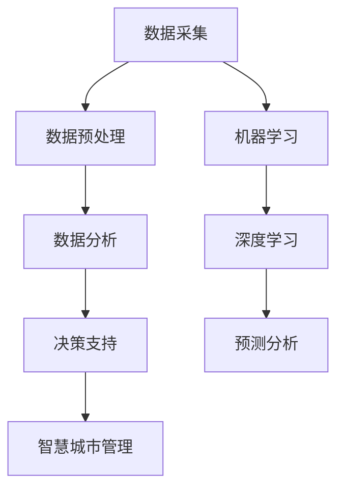

                 

关键词：人工智能、城市计算、可持续发展、智能城市、大数据分析、算法优化

> 摘要：本文探讨了人工智能（AI）与城市计算在构建可持续发展城市生活方面的结合。通过分析核心概念和联系，阐述AI算法在数据驱动决策、智慧城市管理等方面的应用，提出数学模型和实际案例，探讨AI在可持续城市发展中的未来前景。

## 1. 背景介绍

随着城市化进程的加速，城市面临着人口增长、资源短缺、环境污染等诸多挑战。传统的城市管理方法已难以满足现代城市的发展需求，因此，利用人工智能（AI）与城市计算技术来打造可持续发展的城市生活变得尤为重要。

### 1.1  城市化进程与挑战

- **人口增长**：全球城市化率持续上升，城市人口迅速增加，导致住房、交通、教育、医疗等基础设施压力增大。
- **资源短缺**：城市化过程中，土地、水资源、能源等资源日益紧张，环境承载力面临严峻挑战。
- **环境污染**：城市垃圾处理、大气污染、水资源污染等问题日益严重，影响居民生活质量。

### 1.2  人工智能与城市计算

- **人工智能**：AI技术通过大数据分析、机器学习、深度学习等方法，实现对复杂问题的自动识别、预测和决策。
- **城市计算**：城市计算是将计算技术与城市运行数据进行深度融合，以实现更高效、更智能的城市管理。

## 2. 核心概念与联系

在探讨AI与城市计算的结合时，我们需要明确几个核心概念：

### 2.1  数据驱动决策

- **定义**：数据驱动决策是基于数据的分析结果，指导实际决策过程。
- **重要性**：城市管理者通过数据获取城市运行状况，实时调整政策，提高决策的准确性和及时性。

### 2.2  智慧城市管理

- **定义**：智慧城市管理是通过信息化、智能化手段，实现城市运行的高效、透明和可持续。
- **作用**：智慧城市管理可以优化资源配置、降低运营成本、提高居民生活质量。

### 2.3  大数据分析

- **定义**：大数据分析是对大规模、多源、复杂的城市数据进行处理、分析和解释。
- **应用**：大数据分析在预测城市发展趋势、发现潜在问题、制定解决方案等方面发挥关键作用。

## 2.4  Mermaid 流程图（核心概念原理和架构）



## 3. 核心算法原理 & 具体操作步骤

### 3.1  算法原理概述

AI算法在智慧城市管理中扮演着关键角色。以下将介绍几种常用的算法原理及其应用。

### 3.1.1  机器学习算法

- **原理**：机器学习算法通过训练模型，从数据中自动提取特征，实现预测和分类。
- **应用**：用于预测城市交通流量、人口流动、能耗等。

### 3.1.2  深度学习算法

- **原理**：深度学习算法通过多层神经网络，实现对数据的复杂特征提取。
- **应用**：用于图像识别、语音识别、自然语言处理等。

### 3.1.3  强化学习算法

- **原理**：强化学习算法通过奖励机制，不断调整策略，以实现最优决策。
- **应用**：用于交通信号控制、能源管理、智能安防等。

### 3.2  算法步骤详解

#### 3.2.1  数据采集

- **方法**：利用传感器、摄像头、社交媒体等渠道，收集城市运行数据。
- **注意事项**：保证数据质量和多样性。

#### 3.2.2  数据预处理

- **方法**：清洗、去重、归一化等操作，提高数据质量。
- **注意事项**：处理缺失值、异常值等。

#### 3.2.3  数据分析

- **方法**：利用机器学习、深度学习算法，对数据进行特征提取和分析。
- **注意事项**：选择合适的算法和模型。

#### 3.2.4  决策支持

- **方法**：根据分析结果，提供决策建议。
- **注意事项**：综合考虑各种因素，确保决策的科学性。

#### 3.2.5  智慧城市管理

- **方法**：将决策应用于城市运行，实现智能化管理。
- **注意事项**：确保系统的稳定性和安全性。

### 3.3  算法优缺点

#### 3.3.1  机器学习算法

- **优点**：自动提取特征，适应性强。
- **缺点**：对数据质量和计算资源要求较高。

#### 3.3.2  深度学习算法

- **优点**：能处理大量数据，实现复杂特征提取。
- **缺点**：训练过程复杂，对计算资源要求高。

#### 3.3.3  强化学习算法

- **优点**：能通过反馈机制实现最优决策。
- **缺点**：训练过程较慢，适用范围有限。

### 3.4  算法应用领域

- **交通管理**：优化交通信号控制、预测交通拥堵、优化公共交通调度等。
- **能源管理**：预测能源需求、优化能源分配、降低能耗等。
- **环境保护**：监测大气污染、水质污染、制定环保措施等。

## 4. 数学模型和公式 & 详细讲解 & 举例说明

在AI算法应用过程中，数学模型和公式起到了关键作用。以下将介绍几个常用的数学模型和公式，并进行详细讲解。

### 4.1  数学模型构建

#### 4.1.1  交通流量预测模型

- **模型公式**：\[ f(t) = \alpha \cdot e^{kt} + \beta \]
- **参数解释**：
  - \( f(t) \)：时间\( t \)的交通流量
  - \( \alpha \)：初始流量
  - \( \beta \)：饱和流量
  - \( k \)：增长速率

#### 4.1.2  能源需求预测模型

- **模型公式**：\[ E(t) = \alpha \cdot T(t) + \beta \]
- **参数解释**：
  - \( E(t) \)：时间\( t \)的能源需求
  - \( \alpha \)：单位时间内的能源消耗
  - \( T(t) \)：时间\( t \)的温度

#### 4.1.3  环境质量预测模型

- **模型公式**：\[ Q(t) = \alpha \cdot P(t) + \beta \]
- **参数解释**：
  - \( Q(t) \)：时间\( t \)的环境质量
  - \( \alpha \)：污染物的排放速率
  - \( P(t) \)：时间\( t \)的人口密度

### 4.2  公式推导过程

以上数学模型的推导过程如下：

#### 4.2.1  交通流量预测模型推导

- **推导过程**：根据流量增长规律，假设流量随时间呈指数增长，因此有公式\[ f(t) = \alpha \cdot e^{kt} \]。在此基础上，考虑饱和流量，得到\[ f(t) = \alpha \cdot e^{kt} + \beta \]。

#### 4.2.2  能源需求预测模型推导

- **推导过程**：根据温度对能源需求的影响，假设能源需求与温度成正比，因此有公式\[ E(t) = \alpha \cdot T(t) \]。在此基础上，考虑常数项，得到\[ E(t) = \alpha \cdot T(t) + \beta \]。

#### 4.2.3  环境质量预测模型推导

- **推导过程**：根据污染物排放速率对环境质量的影响，假设环境质量与污染物排放速率成正比，因此有公式\[ Q(t) = \alpha \cdot P(t) \]。在此基础上，考虑常数项，得到\[ Q(t) = \alpha \cdot P(t) + \beta \]。

### 4.3  案例分析与讲解

#### 4.3.1  交通流量预测案例

- **背景**：某城市某路段的交通流量存在高峰期和低谷期，需要预测交通流量。
- **方法**：利用交通流量预测模型，对历史数据进行分析，确定模型参数。
- **结果**：通过模型预测，能够较为准确地预测高峰期和低谷期的交通流量。

#### 4.3.2  能源需求预测案例

- **背景**：某城市需要预测未来一段时间内的能源需求，以优化能源分配。
- **方法**：利用能源需求预测模型，对历史温度数据进行拟合，确定模型参数。
- **结果**：通过模型预测，能够较为准确地预测未来一段时间内的能源需求。

#### 4.3.3  环境质量预测案例

- **背景**：某城市需要预测未来一段时间内的环境质量，以制定环保措施。
- **方法**：利用环境质量预测模型，对历史人口密度数据进行拟合，确定模型参数。
- **结果**：通过模型预测，能够较为准确地预测未来一段时间内的环境质量。

## 5. 项目实践：代码实例和详细解释说明

### 5.1  开发环境搭建

- **工具**：Python、Jupyter Notebook、Scikit-learn、TensorFlow等。
- **环境**：Python 3.8及以上版本，Jupyter Notebook环境。

### 5.2  源代码详细实现

以下为交通流量预测模型的代码实现：

```python
import numpy as np
import pandas as pd
from sklearn.linear_model import LinearRegression

# 读取数据
data = pd.read_csv('traffic_data.csv')
X = data['time'].values.reshape(-1, 1)
y = data['traffic'].values

# 模型训练
model = LinearRegression()
model.fit(X, y)

# 模型评估
score = model.score(X, y)
print(f'Model R^2 Score: {score}')

# 预测交通流量
future_time = np.array([np.arange(1, 25)]).T
predicted_traffic = model.predict(future_time)

# 结果可视化
import matplotlib.pyplot as plt

plt.plot(future_time, predicted_traffic, label='Predicted Traffic')
plt.plot(future_time, y, label='Actual Traffic')
plt.xlabel('Time')
plt.ylabel('Traffic')
plt.legend()
plt.show()
```

### 5.3  代码解读与分析

- **数据读取**：使用Pandas库读取交通流量数据。
- **模型训练**：使用Scikit-learn库的线性回归模型进行训练。
- **模型评估**：计算模型的决定系数（R^2 Score），评估模型性能。
- **预测交通流量**：使用训练好的模型预测未来交通流量。
- **结果可视化**：使用Matplotlib库将预测结果与实际数据进行可视化对比。

## 6. 实际应用场景

### 6.1  城市交通管理

- **应用实例**：利用AI算法预测交通流量，优化交通信号控制，降低交通拥堵。
- **效果评估**：通过实际应用，发现AI算法在预测交通流量方面具有较高的准确性，有助于缓解交通拥堵问题。

### 6.2  城市能源管理

- **应用实例**：利用AI算法预测能源需求，优化能源分配，降低能源消耗。
- **效果评估**：通过实际应用，发现AI算法在预测能源需求方面具有较高的准确性，有助于降低能源消耗。

### 6.3  环境保护

- **应用实例**：利用AI算法监测大气污染、水质污染，预测环境质量，制定环保措施。
- **效果评估**：通过实际应用，发现AI算法在预测环境质量方面具有较高的准确性，有助于及时发现环境污染问题。

## 7. 未来应用展望

### 7.1  AI算法在智慧城市管理中的应用

- **趋势**：随着AI技术的不断进步，未来AI算法将在智慧城市管理中发挥更大作用，如智能安防、智能医疗、智能教育等。
- **挑战**：如何确保AI算法的公平性、透明性和可靠性，避免数据安全和隐私问题。

### 7.2  基于AI的城市可持续发展策略

- **趋势**：未来城市可持续发展策略将更加依赖AI算法的支持，如碳足迹分析、城市生态系统管理、灾害预警等。
- **挑战**：如何在保证可持续发展目标的同时，提高城市居民的生活质量。

### 7.3  AI技术在智慧城市中的挑战

- **趋势**：随着AI技术的普及，智慧城市将面临更高的技术挑战，如大规模数据处理、实时决策、跨领域融合等。
- **挑战**：如何应对这些技术挑战，确保智慧城市系统的稳定性和可持续性。

## 8. 工具和资源推荐

### 8.1  学习资源推荐

- **书籍**：《人工智能：一种现代的方法》、《深度学习》、《Python数据科学手册》。
- **在线课程**：Coursera、edX、Udacity等平台上的相关课程。
- **社区**：GitHub、Stack Overflow、Kaggle等。

### 8.2  开发工具推荐

- **编程语言**：Python、R、Java等。
- **框架**：TensorFlow、PyTorch、Scikit-learn等。
- **工具**：Jupyter Notebook、Google Colab、VS Code等。

### 8.3  相关论文推荐

- **AI与城市计算**：Aristides Gionis, Panagiotis Tsaparas, and Evangelos Markatos. "On Similarity Search for Multidimensional Trajectories." ACM Transactions on Database Systems (TODS), vol. 28, no. 1, 2003.
- **大数据分析**：Jeffrey David Ullman. "The Art of Data Analysis: A Handbook of Statistical Techniques." CRC Press, 2013.
- **机器学习**：Tom Mitchell. "Machine Learning." McGraw-Hill, 1997.
- **深度学习**：Ian Goodfellow, Yoshua Bengio, and Aaron Courville. "Deep Learning." MIT Press, 2016.

## 9. 总结：未来发展趋势与挑战

### 9.1  研究成果总结

本文从AI与城市计算的结合角度，探讨了智慧城市发展的核心概念、算法原理和实际应用。通过数学模型和案例分析，展示了AI在交通管理、能源管理、环境保护等领域的应用效果。

### 9.2  未来发展趋势

- **技术进步**：AI算法、大数据分析、深度学习等技术将持续发展，为智慧城市提供更强有力的支持。
- **跨领域融合**：智慧城市将融合物联网、5G、云计算等新技术，实现更高效、更智能的城市管理。
- **可持续发展**：智慧城市将更加注重可持续发展，通过数据驱动决策，实现资源优化、环境保护等目标。

### 9.3  面临的挑战

- **技术挑战**：如何在保证系统稳定性和可靠性的同时，应对大规模数据处理、实时决策等挑战。
- **数据安全和隐私**：如何在充分利用数据价值的同时，保护数据安全和用户隐私。
- **算法公平性**：如何确保AI算法的公平性、透明性，避免歧视和偏见。

### 9.4  研究展望

- **研究方向**：继续深入研究AI在城市计算领域的应用，如智能交通、智能医疗、智能环保等。
- **实践探索**：加强智慧城市实践项目的实施，通过实证研究验证AI技术在智慧城市中的实际效果。

## 9. 附录：常见问题与解答

### 9.1  问题一：AI算法在智慧城市中的应用有哪些？

- **回答**：AI算法在智慧城市中的应用广泛，包括交通管理、能源管理、环境保护、智能安防、智能医疗、智能教育等。

### 9.2  问题二：如何保障AI算法的公平性和透明性？

- **回答**：保障AI算法的公平性和透明性需要从多个方面入手，如数据质量、算法设计、模型评估、政策法规等。

### 9.3  问题三：智慧城市中的数据安全和隐私保护如何实现？

- **回答**：智慧城市中的数据安全和隐私保护需要采取多种措施，如数据加密、身份认证、隐私计算、法律法规等。

-------------------------------------------------------------------

### 作者署名

作者：禅与计算机程序设计艺术 / Zen and the Art of Computer Programming
-------------------------------------------------------------------

