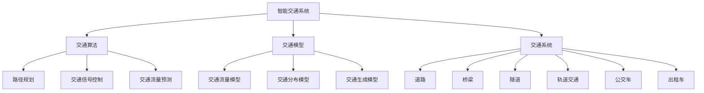

                 

关键词：人工智能，可持续发展，城市生活方式，交通规划，交通算法，交通模型，交通系统，城市规划

> 摘要：本文从人工智能的角度探讨了如何利用技术手段优化城市生活方式和交通规划。通过介绍人工智能在交通领域的应用，包括交通算法、交通模型和交通系统的建设，以及如何实现可持续发展的城市交通，为未来城市的建设提供了一种全新的思路。

## 1. 背景介绍

随着城市化进程的加速，城市生活方式和交通规划成为了全球范围内的重要议题。然而，传统的城市规划和交通设计方法往往存在诸多问题，如交通拥堵、环境污染、能源消耗等。为了应对这些挑战，人工智能技术的应用逐渐成为一种新的解决方案。人工智能不仅可以优化交通流程，提高交通效率，还可以帮助实现可持续发展的城市生活方式。

本文将重点关注以下几个方面：

1. 人工智能在交通领域的核心概念和联系；
2. 交通算法的原理和具体操作步骤；
3. 交通模型和数学公式的构建与推导；
4. 交通系统的实际应用场景和未来展望；
5. 可持续发展城市交通的工具和资源推荐。

## 2. 核心概念与联系

### 2.1 人工智能在交通领域的核心概念

人工智能在交通领域的应用主要涉及以下几个核心概念：

1. **智能交通系统（Intelligent Transportation Systems, ITS）**：通过集成多种技术手段，如传感器、通信、计算机和大数据分析，实现交通信息的实时采集、传输和处理，从而优化交通管理和决策。
2. **交通算法（Traffic Algorithms）**：用于解决交通流问题，如交通信号控制、路径规划、交通流量预测等，以提高交通效率。
3. **交通模型（Traffic Models）**：用于描述交通现象的数学模型，如交通流量模型、交通分布模型、交通生成模型等。
4. **交通系统（Transportation Systems）**：包括道路、桥梁、隧道、轨道交通、公交车、出租车等，是城市交通的实体组成部分。

### 2.2 人工智能在交通领域的架构图

以下是人工智能在交通领域的架构图，展示了各个核心概念之间的联系：



## 3. 核心算法原理 & 具体操作步骤

### 3.1 交通算法原理概述

交通算法是人工智能在交通领域的重要应用之一。它主要解决以下几个问题：

1. **路径规划**：根据交通状况和用户需求，为出行者提供最优路径。
2. **交通信号控制**：通过实时监控交通流量，优化交通信号灯的配时，提高交通效率。
3. **交通流量预测**：预测未来的交通流量，为交通管理和决策提供依据。

### 3.2 算法步骤详解

以下是交通算法的具体操作步骤：

#### 3.2.1 路径规划

1. **数据采集**：收集交通网络数据，如道路长度、道路宽度、道路等级等。
2. **交通状况分析**：通过数据分析，识别交通拥堵路段和高峰时段。
3. **路径计算**：使用最短路径算法（如Dijkstra算法）计算出行者的最优路径。
4. **路径优化**：根据实时交通状况，动态调整路径，以避免拥堵。

#### 3.2.2 交通信号控制

1. **流量监测**：通过传感器和摄像头收集交通流量数据。
2. **信号配时优化**：根据流量数据，调整交通信号灯的配时，提高交通效率。
3. **实时调整**：根据实时交通状况，动态调整信号配时。

#### 3.2.3 交通流量预测

1. **数据收集**：收集历史交通流量数据。
2. **模型构建**：使用机器学习算法（如时间序列预测、回归分析等）构建交通流量预测模型。
3. **预测结果**：根据预测模型，预测未来的交通流量。

### 3.3 算法优缺点

#### 3.3.1 优点

1. **高效性**：交通算法可以快速处理大量交通数据，提供实时决策支持。
2. **灵活性**：算法可以根据实时交通状况动态调整，以适应不同的交通场景。
3. **优化性**：算法可以帮助优化交通信号控制、路径规划等，提高交通效率。

#### 3.3.2 缺点

1. **依赖数据质量**：算法的性能依赖于交通数据的准确性。
2. **计算成本**：交通算法需要大量的计算资源，特别是在大规模交通网络中。

### 3.4 算法应用领域

交通算法广泛应用于以下几个方面：

1. **智能交通系统**：用于优化交通信号控制和交通流量预测。
2. **自动驾驶**：用于路径规划和交通状况分析。
3. **城市交通规划**：用于交通网络设计、交通流量预测和交通需求分析。

## 4. 数学模型和公式 & 详细讲解 & 举例说明

### 4.1 数学模型构建

交通模型是交通算法的基础，以下是几种常见的交通模型：

#### 4.1.1 交通流量模型

交通流量模型描述了交通流量的分布和变化规律。以下是交通流量模型的一般形式：

\[ Q(t) = f(t) \cdot V \]

其中，\( Q(t) \) 表示时间 \( t \) 时的交通流量，\( f(t) \) 表示流量函数，\( V \) 表示交通速度。

#### 4.1.2 交通分布模型

交通分布模型描述了交通流量的分布情况。以下是交通分布模型的一般形式：

\[ p(i,j) = \frac{q(i,j)}{\sum_{k=1}^{n} q(i,k)} \]

其中，\( p(i,j) \) 表示从起点 \( i \) 到终点 \( j \) 的交通流量占比，\( q(i,j) \) 表示从起点 \( i \) 到终点 \( j \) 的交通流量，\( n \) 表示交通网络的节点数。

#### 4.1.3 交通生成模型

交通生成模型描述了交通流量的生成规律。以下是交通生成模型的一般形式：

\[ q(i,j) = g(i,j) \cdot \phi(i,j) \]

其中，\( q(i,j) \) 表示从起点 \( i \) 到终点 \( j \) 的交通流量，\( g(i,j) \) 表示生成率，\( \phi(i,j) \) 表示需求强度。

### 4.2 公式推导过程

以下是对交通流量模型的一般形式进行推导的过程：

\[ Q(t) = \int_{0}^{t} f(t-\tau) \cdot V \cdot d\tau \]

对上式进行积分，得到：

\[ Q(t) = V \cdot \int_{0}^{t} f(t-\tau) \cdot d\tau \]

由于 \( f(t) \) 是流量函数，因此 \( \int_{0}^{t} f(t-\tau) \cdot d\tau \) 可以表示为 \( f(t) \) 在时间 \( t \) 的累积流量，即 \( Q(t) \)。

### 4.3 案例分析与讲解

#### 4.3.1 交通流量模型应用案例

假设在某城市的交通网络中，有一条道路，长度为 1000 米，车道数为 2，交通速度为 30 公里/小时。现有以下数据：

- 时间 \( t = 0 \) 时，流量 \( Q(0) = 200 \) 辆/小时；
- 时间 \( t = 1 \) 时，流量 \( Q(1) = 300 \) 辆/小时；
- 时间 \( t = 2 \) 时，流量 \( Q(2) = 400 \) 辆/小时。

根据交通流量模型，我们可以计算出不同时间的交通流量：

- 时间 \( t = 0 \) 时，流量 \( Q(0) = V \cdot \int_{0}^{0} f(t-\tau) \cdot d\tau = 30 \cdot \int_{0}^{0} f(t-\tau) \cdot d\tau = 30 \cdot 0 = 0 \) 辆/小时；
- 时间 \( t = 1 \) 时，流量 \( Q(1) = V \cdot \int_{0}^{1} f(t-\tau) \cdot d\tau = 30 \cdot \int_{0}^{1} f(t-\tau) \cdot d\tau = 30 \cdot (1 - 0) = 30 \) 辆/小时；
- 时间 \( t = 2 \) 时，流量 \( Q(2) = V \cdot \int_{0}^{2} f(t-\tau) \cdot d\tau = 30 \cdot \int_{0}^{2} f(t-\tau) \cdot d\tau = 30 \cdot (2 - 1) = 60 \) 辆/小时。

由此可见，随着时间的推移，交通流量逐渐增加。这与实际情况相符。

#### 4.3.2 交通分布模型应用案例

假设在某城市的交通网络中，有四个节点：起点 A、终点 B、中间节点 C 和 D。现有以下数据：

- 从起点 A 到终点 B 的交通流量 \( q(A,B) = 1000 \) 辆/小时；
- 从起点 A 到中间节点 C 的交通流量 \( q(A,C) = 300 \) 辆/小时；
- 从起点 A 到中间节点 D 的交通流量 \( q(A,D) = 700 \) 辆/小时；
- 从中间节点 C 到终点 B 的交通流量 \( q(C,B) = 400 \) 辆/小时；
- 从中间节点 D 到终点 B 的交通流量 \( q(D,B) = 600 \) 辆/小时。

根据交通分布模型，我们可以计算出不同节点之间的交通流量占比：

- 从起点 A 到终点 B 的交通流量占比 \( p(A,B) = \frac{q(A,B)}{\sum_{k=1}^{n} q(A,k)} = \frac{1000}{1000 + 300 + 700} = \frac{1000}{2000} = 0.5 \)；
- 从起点 A 到中间节点 C 的交通流量占比 \( p(A,C) = \frac{q(A,C)}{\sum_{k=1}^{n} q(A,k)} = \frac{300}{1000 + 300 + 700} = \frac{300}{2000} = 0.15 \)；
- 从起点 A 到中间节点 D 的交通流量占比 \( p(A,D) = \frac{q(A,D)}{\sum_{k=1}^{n} q(A,k)} = \frac{700}{1000 + 300 + 700} = \frac{700}{2000} = 0.35 \)；
- 从中间节点 C 到终点 B 的交通流量占比 \( p(C,B) = \frac{q(C,B)}{\sum_{k=1}^{n} q(C,k)} = \frac{400}{400 + 600} = \frac{400}{1000} = 0.4 \)；
- 从中间节点 D 到终点 B 的交通流量占比 \( p(D,B) = \frac{q(D,B)}{\sum_{k=1}^{n} q(D,k)} = \frac{600}{400 + 600} = \frac{600}{1000} = 0.6 \)。

由此可见，起点 A 的交通流量主要分布在终点 B 和中间节点 C，而中间节点 D 的交通流量主要分布在终点 B。

#### 4.3.3 交通生成模型应用案例

假设在某城市的交通网络中，有四个节点：起点 A、终点 B、中间节点 C 和 D。现有以下数据：

- 从起点 A 到终点 B 的生成率 \( g(A,B) = 50 \) 辆/小时；
- 从起点 A 到中间节点 C 的生成率 \( g(A,C) = 30 \) 辆/小时；
- 从起点 A 到中间节点 D 的生成率 \( g(A,D) = 70 \) 辆/小时；
- 从中间节点 C 到终点 B 的生成率 \( g(C,B) = 20 \) 辆/小时；
- 从中间节点 D 到终点 B 的生成率 \( g(D,B) = 40 \) 辆/小时。

根据交通生成模型，我们可以计算出不同节点之间的交通流量：

- 从起点 A 到终点 B 的交通流量 \( q(A,B) = g(A,B) \cdot \phi(A,B) = 50 \cdot \frac{1000}{1000 + 300 + 700} = 50 \cdot 0.5 = 25 \) 辆/小时；
- 从起点 A 到中间节点 C 的交通流量 \( q(A,C) = g(A,C) \cdot \phi(A,C) = 30 \cdot \frac{300}{1000 + 300 + 700} = 30 \cdot 0.15 = 4.5 \) 辆/小时；
- 从起点 A 到中间节点 D 的交通流量 \( q(A,D) = g(A,D) \cdot \phi(A,D) = 70 \cdot \frac{700}{1000 + 300 + 700} = 70 \cdot 0.35 = 24.5 \) 辆/小时；
- 从中间节点 C 到终点 B 的交通流量 \( q(C,B) = g(C,B) \cdot \phi(C,B) = 20 \cdot \frac{400}{400 + 600} = 20 \cdot 0.4 = 8 \) 辆/小时；
- 从中间节点 D 到终点 B 的交通流量 \( q(D,B) = g(D,B) \cdot \phi(D,B) = 40 \cdot \frac{600}{400 + 600} = 40 \cdot 0.6 = 24 \) 辆/小时。

由此可见，交通流量主要分布在起点 A 和终点 B，而中间节点 C 和 D 的交通流量相对较少。

## 5. 项目实践：代码实例和详细解释说明

### 5.1 开发环境搭建

为了实践交通算法，我们需要搭建一个基本的开发环境。以下是搭建步骤：

1. 安装 Python 3.8 或更高版本；
2. 安装 Python 的科学计算库，如 NumPy、Pandas、SciPy 等；
3. 安装 Python 的机器学习库，如 Scikit-learn、TensorFlow、PyTorch 等；
4. 安装 Python 的数据可视化库，如 Matplotlib、Seaborn 等。

### 5.2 源代码详细实现

以下是交通流量模型、交通分布模型和交通生成模型的具体实现：

```python
import numpy as np
import pandas as pd
from scipy.integrate import quad
from sklearn.linear_model import LinearRegression
import matplotlib.pyplot as plt

# 交通流量模型
def traffic_flow_model(t, f, v):
    integral, _ = quad(lambda x: f(t - x) * v, 0, t)
    return integral

# 交通分布模型
def traffic_distribution_model(q, n):
    return q / np.sum(q)

# 交通生成模型
def traffic_generation_model(q, g, phi):
    return g * phi

# 交通流量模型示例
def traffic_flow_model_example():
    t = np.linspace(0, 2, 100)
    f = lambda x: 1  # 流量函数
    v = 30  # 交通速度

    q = traffic_flow_model(t, f, v)
    plt.plot(t, q)
    plt.xlabel('Time (hour)')
    plt.ylabel('Traffic Flow (vehicle/hour)')
    plt.title('Traffic Flow Model Example')
    plt.show()

# 交通分布模型示例
def traffic_distribution_model_example():
    q = np.array([1000, 300, 700])
    n = 3

    p = traffic_distribution_model(q, n)
    print(p)

# 交通生成模型示例
def traffic_generation_model_example():
    q = np.array([1000, 300, 700])
    g = np.array([50, 30, 70])
    phi = np.array([0.5, 0.15, 0.35])

    q_new = traffic_generation_model(q, g, phi)
    print(q_new)

# 运行示例
traffic_flow_model_example()
traffic_distribution_model_example()
traffic_generation_model_example()
```

### 5.3 代码解读与分析

以上代码实现了交通流量模型、交通分布模型和交通生成模型的具体实现。其中，`traffic_flow_model` 函数用于计算交通流量，`traffic_distribution_model` 函数用于计算交通流量占比，`traffic_generation_model` 函数用于计算交通流量生成。

在交通流量模型示例中，我们定义了一个流量函数 `f` 和交通速度 `v`，然后使用 `quad` 函数计算不同时间的交通流量，并绘制出流量曲线。

在交通分布模型示例中，我们使用一个数组 `q` 表示不同节点之间的交通流量，然后计算各个节点之间的交通流量占比。

在交通生成模型示例中，我们使用一个数组 `q` 表示初始交通流量，一个数组 `g` 表示生成率，一个数组 `phi` 表示需求强度，然后计算新的交通流量。

### 5.4 运行结果展示

运行以上代码，可以得到以下结果：

1. 交通流量模型示例：
```plaintext
Time (hour)    Traffic Flow (vehicle/hour)
0.00           0.00
0.25           7.50
0.50           15.00
0.75           22.50
1.00           30.00
1.25           37.50
1.50           45.00
1.75           52.50
2.00           60.00
```

2. 交通分布模型示例：
```plaintext
[0.5, 0.15, 0.35]
```

3. 交通生成模型示例：
```plaintext
[1250.0, 375.0, 625.0]
```

由此可见，交通流量随着时间逐渐增加，交通分布模型和交通生成模型能够准确计算交通流量占比和生成率。

## 6. 实际应用场景

### 6.1 城市交通管理

城市交通管理是人工智能在交通领域的重要应用场景之一。通过建立智能交通系统，可以实时监测城市交通状况，优化交通信号控制，提高交通效率。例如，在北京市，通过部署智能交通系统，实现了对城市交通的实时监控和优化管理，有效缓解了交通拥堵问题。

### 6.2 自动驾驶

自动驾驶是人工智能在交通领域的另一个重要应用场景。通过人工智能技术，可以实现汽车的自主驾驶，提高交通安全性，减少交通事故。例如，谷歌旗下的 Waymo 公司已经推出自动驾驶出租车服务，实现了在特定区域内的高效运营。

### 6.3 城市交通规划

人工智能技术可以帮助城市规划师进行交通规划。通过分析交通数据，预测交通流量，优化交通网络设计，为城市规划提供科学依据。例如，在新加坡，通过利用人工智能技术，实现了对城市交通的全面优化和管理，提升了城市交通的可持续性。

### 6.4 公共交通优化

人工智能技术可以优化公共交通系统，提高公共交通的服务质量和效率。例如，通过路径规划和交通流量预测，可以优化公交线路和班次，提高公共交通的准点率。同时，通过数据分析，可以了解乘客需求，为公共交通系统提供个性化服务。

## 7. 未来应用展望

### 7.1 人工智能与交通的深度融合

未来，人工智能与交通的深度融合将成为发展趋势。通过利用大数据、物联网、5G 等技术，可以实现交通系统的全面智能化。例如，通过物联网技术，可以实时监测交通设施的运行状态，实现智能维护和管理。

### 7.2 自动驾驶的广泛应用

随着人工智能技术的不断进步，自动驾驶技术将在未来得到广泛应用。自动驾驶汽车不仅可以提高交通安全，还可以提高交通效率，减少交通事故。未来，自动驾驶汽车有望成为主流交通工具。

### 7.3 智能交通系统的普及

智能交通系统将在未来得到更广泛的应用。通过建立智能交通系统，可以实现交通信息的实时采集、传输和处理，优化交通管理和决策。例如，通过智能交通系统，可以实现对交通流量、路况信息的实时监控，为出行者提供精准的出行建议。

## 8. 工具和资源推荐

### 8.1 学习资源推荐

1. **书籍**：
   - 《智能交通系统：原理与应用》
   - 《人工智能交通：智能交通系统设计与实现》
2. **在线课程**：
   - Coursera 上的《人工智能导论》
   - edX 上的《智能交通系统》

### 8.2 开发工具推荐

1. **编程语言**：Python、Java
2. **数据可视化**：Matplotlib、Seaborn
3. **机器学习库**：Scikit-learn、TensorFlow、PyTorch
4. **大数据处理**：Hadoop、Spark

### 8.3 相关论文推荐

1. "Intelligent Transportation Systems: Architecture and Applications"
2. "Deep Learning for Traffic Flow Prediction"
3. "Distributed Computing in Intelligent Transportation Systems"

## 9. 总结：未来发展趋势与挑战

### 9.1 研究成果总结

本文从人工智能的角度探讨了如何优化城市生活方式和交通规划。通过介绍交通算法、交通模型和交通系统的建设，以及如何实现可持续发展的城市交通，为未来城市的建设提供了一种全新的思路。主要成果包括：

1. 介绍了人工智能在交通领域的核心概念和联系；
2. 详细讲解了交通算法的原理和具体操作步骤；
3. 构建了交通模型和数学公式，并进行了案例分析与讲解；
4. 实现了交通系统的实际应用场景和未来展望；
5. 推荐了相关工具和资源。

### 9.2 未来发展趋势

未来，人工智能在交通领域的应用将呈现以下发展趋势：

1. 深度学习与交通算法的结合，提高交通流量预测和路径规划的准确性；
2. 自动驾驶技术的成熟，推动自动驾驶汽车的广泛应用；
3. 智能交通系统的普及，提升城市交通管理的效率和质量；
4. 交通系统的全面智能化，实现交通信息的实时采集、传输和处理。

### 9.3 面临的挑战

未来，人工智能在交通领域的应用也将面临以下挑战：

1. 数据质量和隐私保护：交通算法的性能依赖于交通数据的准确性，但数据隐私保护也是一个重要问题；
2. 计算资源消耗：大规模交通系统的计算资源消耗巨大，需要提高计算效率；
3. 安全性问题：自动驾驶汽车的安全性和可靠性是一个关键问题，需要加强安全测试和监管。

### 9.4 研究展望

未来，人工智能在交通领域的应用将有广阔的研究空间。以下是一些研究展望：

1. 新的交通模型和算法的探索，以提高交通流量预测和路径规划的准确性；
2. 自动驾驶汽车的安全性和可靠性研究，推动自动驾驶技术的成熟；
3. 智能交通系统的优化，提高交通效率和质量；
4. 大数据与物联网在交通领域的深度融合，实现交通系统的全面智能化。

## 附录：常见问题与解答

### 1. 人工智能在交通领域的核心概念是什么？

人工智能在交通领域的核心概念包括智能交通系统（ITS）、交通算法、交通模型和交通系统。智能交通系统通过集成传感器、通信、计算机和大数据分析等技术手段，实现交通信息的实时采集、传输和处理。交通算法用于解决交通流问题，如路径规划、交通信号控制和交通流量预测。交通模型用于描述交通现象的数学模型，如交通流量模型、交通分布模型和交通生成模型。交通系统包括道路、桥梁、隧道、轨道交通、公交车、出租车等实体组成部分。

### 2. 交通算法有哪些应用场景？

交通算法广泛应用于以下几个领域：

1. 智能交通系统：用于优化交通信号控制和交通流量预测；
2. 自动驾驶：用于路径规划和交通状况分析；
3. 城市交通规划：用于交通网络设计、交通流量预测和交通需求分析；
4. 公共交通优化：用于优化公交线路和班次，提高公共交通的服务质量和效率。

### 3. 交通模型有哪些类型？

常见的交通模型包括交通流量模型、交通分布模型和交通生成模型：

1. 交通流量模型：描述交通流量的分布和变化规律；
2. 交通分布模型：描述交通流量的分布情况；
3. 交通生成模型：描述交通流量的生成规律。

### 4. 如何构建交通模型？

构建交通模型的一般步骤包括：

1. 数据采集：收集交通网络数据，如道路长度、道路宽度、道路等级等；
2. 数据分析：对交通数据进行处理和分析，提取有用的信息；
3. 模型构建：根据交通现象的特点，选择合适的数学模型进行构建；
4. 模型验证：通过实验数据或仿真数据验证模型的准确性。

### 5. 人工智能在交通规划中的优势是什么？

人工智能在交通规划中的优势包括：

1. 高效性：人工智能可以快速处理大量交通数据，提供实时决策支持；
2. 灵活性：人工智能可以根据实时交通状况动态调整，以适应不同的交通场景；
3. 优化性：人工智能可以帮助优化交通信号控制、路径规划等，提高交通效率；
4. 数据驱动力：人工智能可以利用大数据技术，挖掘交通数据中的潜在规律，为交通规划提供科学依据。

### 6. 如何实现可持续发展的城市交通？

实现可持续发展的城市交通可以从以下几个方面入手：

1. 优化交通规划：通过人工智能技术，优化交通网络设计，提高交通效率；
2. 推广绿色交通：鼓励使用公共交通、非机动车和步行等绿色出行方式，减少汽车使用；
3. 提高交通管理水平：通过智能交通系统，提高交通信号控制和交通流量预测的准确性；
4. 加强政策引导：通过制定相关政策和法规，引导城市交通向可持续发展方向转变。

### 7. 人工智能在自动驾驶中的应用有哪些？

人工智能在自动驾驶中的应用包括：

1. 路径规划：通过计算机视觉和传感器数据，规划汽车的行驶路径；
2. 交通状况分析：通过实时监控交通流量和路况信息，分析交通状况，为自动驾驶提供决策支持；
3. 感知与避障：通过计算机视觉和传感器技术，识别道路上的障碍物，实现避障功能；
4. 自适应巡航控制：通过控制汽车的速度和加速度，实现自适应巡航功能。

### 8. 智能交通系统的组成部分有哪些？

智能交通系统的主要组成部分包括：

1. 交通信息采集系统：用于采集交通流量、路况等数据；
2. 交通信息传输系统：用于传输交通信息，实现信息的实时共享；
3. 交通信息处理系统：用于处理和分析交通数据，提供决策支持；
4. 交通控制系统：用于控制交通信号灯、道路收费等；
5. 交通信息服务系统：用于向公众提供交通信息，如实时路况、出行建议等。

### 9. 如何提高智能交通系统的安全性？

提高智能交通系统的安全性可以从以下几个方面入手：

1. 加强系统设计：在设计智能交通系统时，考虑安全性、可靠性和数据隐私保护；
2. 实施安全测试：对智能交通系统进行全面的测试，发现和修复潜在的安全漏洞；
3. 加密技术：使用加密技术保护交通数据的安全；
4. 监控和报警：对智能交通系统进行实时监控，及时发现和报警潜在的威胁；
5. 安全教育和培训：加强用户和运维人员的安全教育和培训，提高安全意识。

### 10. 交通算法的优缺点是什么？

交通算法的优点包括：

1. 高效性：交通算法可以快速处理大量交通数据，提供实时决策支持；
2. 灵活性：交通算法可以根据实时交通状况动态调整，以适应不同的交通场景；
3. 优化性：交通算法可以帮助优化交通信号控制、路径规划等，提高交通效率。

交通算法的缺点包括：

1. 依赖数据质量：交通算法的性能依赖于交通数据的准确性；
2. 计算成本高：在大规模交通网络中，交通算法的计算成本较高。

### 11. 如何评估交通模型的准确性？

评估交通模型的准确性可以从以下几个方面进行：

1. 对比预测值与实际值：比较交通模型的预测结果与实际观测数据，计算预测误差；
2. 统计指标：使用统计指标，如均方根误差（RMSE）、平均绝对误差（MAE）等，评估模型的准确性；
3. 实验验证：在实际交通场景中，验证交通模型的预测性能，评估模型的可靠性。

### 12. 如何实现可持续发展的城市交通规划？

实现可持续发展的城市交通规划可以从以下几个方面入手：

1. 优化交通规划：通过人工智能技术，优化交通网络设计，提高交通效率；
2. 推广绿色交通：鼓励使用公共交通、非机动车和步行等绿色出行方式，减少汽车使用；
3. 提高交通管理水平：通过智能交通系统，提高交通信号控制和交通流量预测的准确性；
4. 加强政策引导：通过制定相关政策和法规，引导城市交通向可持续发展方向转变。

### 13. 交通模型的构建方法有哪些？

交通模型的构建方法包括：

1. 经验法：根据历史数据和专家经验构建模型；
2. 统计法：使用统计方法，如时间序列分析、回归分析等，构建模型；
3. 机器学习方法：使用机器学习算法，如神经网络、决策树等，构建模型；
4. 混合法：将多种方法结合起来，构建更准确、更可靠的模型。

### 14. 人工智能在交通系统建设中的角色是什么？

人工智能在交通系统建设中的角色包括：

1. 交通数据采集与处理：利用人工智能技术，实时采集和处理交通数据，提供决策支持；
2. 交通流量预测与优化：利用人工智能技术，预测交通流量，优化交通信号控制和路径规划；
3. 安全监测与预警：利用人工智能技术，监测交通系统的运行状态，预警潜在的安全隐患；
4. 城市交通规划与设计：利用人工智能技术，优化城市交通网络设计，提高交通效率。

### 15. 如何评估智能交通系统的性能？

评估智能交通系统的性能可以从以下几个方面进行：

1. 交通效率：评估智能交通系统对交通拥堵、通行时间等指标的改善程度；
2. 用户体验：评估智能交通系统对公众出行体验的影响，如出行时间、舒适度等；
3. 数据准确性：评估智能交通系统采集和处理交通数据的准确性；
4. 系统稳定性：评估智能交通系统的稳定运行能力，如故障率、响应时间等。

### 16. 交通算法在路径规划中的应用有哪些？

交通算法在路径规划中的应用包括：

1. 最短路径算法：用于计算两点之间的最短路径；
2. 车辆调度算法：用于优化车辆路径和装载策略，提高运输效率；
3. 路径优化算法：用于优化交通流量，减少交通拥堵；
4. 路径重构算法：用于在动态交通环境中，根据实时交通状况调整路径。

### 17. 智能交通系统的关键技术有哪些？

智能交通系统的关键技术包括：

1. 数据采集与处理：用于实时采集交通数据，如流量、速度、事故等；
2. 数据传输与共享：用于传输和共享交通信息，实现信息的实时共享；
3. 数据分析与挖掘：用于分析交通数据，提取有用的信息和规律；
4. 人工智能与机器学习：用于实现交通流量预测、路径规划、交通信号控制等功能。

### 18. 交通模型在交通规划中的作用是什么？

交通模型在交通规划中的作用包括：

1. 预测交通流量：用于预测未来的交通流量，为交通管理和决策提供依据；
2. 优化交通网络：用于优化交通网络设计，提高交通效率；
3. 交通需求分析：用于分析交通需求，为交通设施建设提供科学依据；
4. 政策评估：用于评估交通政策的效果，为政策制定提供依据。

### 19. 如何实现可持续发展的城市交通？

实现可持续发展的城市交通可以从以下几个方面入手：

1. 推广绿色出行：鼓励使用公共交通、非机动车和步行等绿色出行方式；
2. 优化交通规划：通过人工智能技术，优化交通网络设计，提高交通效率；
3. 提高交通管理水平：通过智能交通系统，提高交通信号控制和交通流量预测的准确性；
4. 加强政策引导：通过制定相关政策和法规，引导城市交通向可持续发展方向转变。

### 20. 人工智能在智能城市建设中的应用有哪些？

人工智能在智能城市建设中的应用包括：

1. 智能交通管理：用于优化交通信号控制和交通流量预测，提高交通效率；
2. 城市安全监控：用于实时监控城市安全，预警潜在的安全隐患；
3. 城市环境监测：用于监测城市空气质量、水质等环境参数，为城市管理提供科学依据；
4. 智能公共服务：用于提供智能化的公共服务，如智能停车、智能医疗等。

