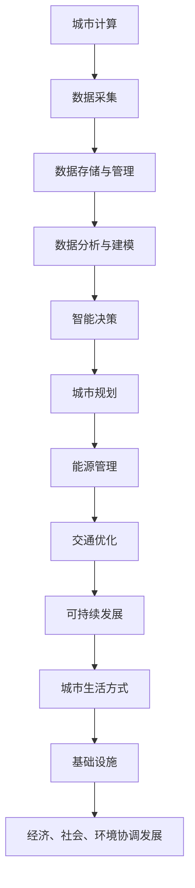

                 

关键词：人工智能、城市计算、可持续发展、基础设施、计算技术

摘要：本文探讨了人工智能（AI）在人类计算中的角色，特别是如何通过AI技术打造可持续发展的城市生活方式与基础设施。文章首先介绍了城市计算的基本概念和重要性，随后深入探讨了AI在城市规划、能源管理、交通优化等领域的应用。通过具体的案例分析和数学模型，本文展示了AI如何优化城市资源利用，提高生活质量，并提出了未来发展的挑战与方向。

## 1. 背景介绍

城市生活是现代社会的核心，而城市的发展离不开基础设施的建设。然而，随着城市化进程的加速，城市面临着诸多挑战，如资源短缺、环境污染、交通拥堵等。传统的基础设施管理方式已无法满足日益增长的需求，因此，引入人工智能技术成为必然选择。

人工智能作为当前最具革命性的技术之一，已经在各行各业中展现出了巨大的潜力。在城市计算领域，AI技术能够通过数据分析和智能算法，实现对城市资源的优化配置和管理，提高城市运行效率和居民生活质量。

本文将围绕以下核心内容展开讨论：

- 城市计算的基本概念和重要性
- 人工智能在城市规划、能源管理、交通优化等领域的应用
- 数学模型和算法原理的具体操作步骤
- 项目实践中的代码实例和详细解释
- 实际应用场景的案例分析与未来展望

## 2. 核心概念与联系

### 2.1 城市计算

城市计算（Urban Computing）是近年来兴起的一个跨学科研究领域，它结合了计算机科学、数据科学、城市规划和地理学等领域的知识，旨在通过数据分析和智能算法，解决城市中的复杂问题。

城市计算的核心概念包括：

- 数据采集：通过传感器、无人机、智能设备等手段收集城市运行的各种数据。
- 数据存储与管理：建立高效的数据存储和管理系统，确保数据的准确性和实时性。
- 数据分析与建模：运用数据挖掘、机器学习和统计方法，从海量数据中提取有价值的信息和知识。
- 智能决策：基于数据分析结果，制定智能化的城市管理策略和决策方案。

### 2.2 人工智能

人工智能（Artificial Intelligence，AI）是计算机科学的一个分支，旨在使计算机系统具备类似人类的智能，能够自主地学习、推理、规划和决策。人工智能的核心技术包括：

- 机器学习：通过数据训练模型，使计算机能够从经验中学习并做出预测。
- 深度学习：基于多层神经网络，实现复杂的非线性映射和学习任务。
- 自然语言处理：使计算机能够理解和生成自然语言，实现人机交互。
- 计算机视觉：使计算机能够理解和解释视觉信息，实现图像识别和目标检测。

### 2.3 可持续发展

可持续发展（Sustainable Development）是指满足当前需求而不损害子孙后代满足其需求的能力。在城市计算和人工智能领域，可持续发展的目标是通过智能化的城市管理和资源优化，实现经济、社会和环境的协调发展。

可持续发展涉及以下几个方面：

- 经济发展：通过高效的城市管理，促进经济增长和社会进步。
- 社会公正：通过公平的资源分配和公共服务，提高居民的生活质量。
- 环境保护：通过智能化的能源管理和环境监测，减少城市污染和资源浪费。

### 2.4 城市生活方式与基础设施

城市生活方式（Urban Lifestyle）是指城市居民在日常生活中所遵循的行为模式和生活方式。城市基础设施（Urban Infrastructure）是指为城市居民提供基本生活服务的设施，如交通、供水、供电、医疗、教育等。

城市生活方式和基础设施的可持续发展，需要依赖于先进的计算技术和人工智能技术的支持。通过智能化的城市管理和资源优化，可以实现城市环境的优化、居民生活质量的提高以及城市竞争力的增强。

### 2.5 Mermaid 流程图

为了更好地展示城市计算、人工智能和可持续发展之间的联系，我们使用Mermaid流程图进行描述。



## 3. 核心算法原理 & 具体操作步骤

### 3.1 算法原理概述

在城市计算和人工智能领域，核心算法主要包括机器学习算法、深度学习算法和优化算法。这些算法的基本原理是通过大量数据的训练，使计算机能够自动地学习和发现数据中的规律，从而实现对复杂问题的求解。

- 机器学习算法：通过训练数据集，使计算机能够对新的数据进行预测和分类。
- 深度学习算法：通过多层神经网络，实现复杂的非线性映射和学习任务。
- 优化算法：通过数学优化方法，求解最优解或近似最优解，以实现资源的最优配置。

### 3.2 算法步骤详解

#### 3.2.1 数据采集

数据采集是城市计算和人工智能的基础。数据来源包括传感器、智能设备、社交媒体、卫星遥感等。数据采集的步骤包括：

1. 数据源选择：根据研究目标和需求，选择合适的数据源。
2. 数据采集：使用传感器、智能设备等手段，实时或定期采集城市运行数据。
3. 数据清洗：对采集到的数据进行去噪、填补缺失值、异常值检测等处理，确保数据的准确性和完整性。

#### 3.2.2 数据存储与管理

数据存储与管理是数据分析和建模的前提。数据存储与管理的步骤包括：

1. 数据存储：选择合适的存储方案，如数据库、分布式文件系统等，存储海量数据。
2. 数据管理：建立数据管理系统，实现数据的查询、更新、删除等功能，确保数据的实时性和一致性。
3. 数据备份与恢复：定期备份数据，确保数据的安全性和可靠性。

#### 3.2.3 数据分析与建模

数据分析与建模是城市计算和人工智能的核心。数据分析与建模的步骤包括：

1. 数据预处理：对原始数据进行清洗、转换、归一化等处理，使其适合建模。
2. 特征工程：从原始数据中提取有用的特征，为建模提供支持。
3. 模型选择：根据问题和数据特点，选择合适的机器学习、深度学习或优化模型。
4. 模型训练：使用训练数据集，对模型进行训练和调优。
5. 模型评估：使用验证数据集，评估模型的性能和准确性。
6. 模型应用：将训练好的模型应用于实际问题，实现智能决策和优化。

#### 3.2.4 智能决策

智能决策是城市计算和人工智能的目标。智能决策的步骤包括：

1. 决策目标确定：明确决策的目标和约束条件。
2. 决策算法选择：根据决策目标和数据特点，选择合适的决策算法。
3. 决策模型构建：构建决策模型，实现决策过程的自动化。
4. 决策模型优化：通过模拟和优化，提高决策模型的性能和效果。
5. 决策实施：将决策模型应用于实际场景，实现智能决策。

### 3.3 算法优缺点

#### 3.3.1 机器学习算法

优点：

- 泛化能力强：通过训练大量数据，能够适应不同的数据分布和场景。
- 自动化程度高：能够自动提取特征和建立模型，减少人工干预。

缺点：

- 计算资源消耗大：训练过程需要大量的计算资源和时间。
- 对数据质量要求高：数据清洗和预处理工作量大，对数据质量要求较高。

#### 3.3.2 深度学习算法

优点：

- 表征能力强：能够提取深层特征，适用于复杂的非线性问题。
- 自动化程度高：能够自动提取特征和建立模型，减少人工干预。

缺点：

- 计算资源消耗大：训练过程需要大量的计算资源和时间。
- 对数据质量要求高：数据清洗和预处理工作量大，对数据质量要求较高。

#### 3.3.3 优化算法

优点：

- 求解速度快：能够快速求解最优解或近似最优解。
- 适用于复杂约束条件：能够处理具有复杂约束条件的问题。

缺点：

- 对问题结构要求高：需要明确问题的目标函数和约束条件。
- 容易陷入局部最优：对于某些复杂问题，可能无法找到全局最优解。

### 3.4 算法应用领域

机器学习算法、深度学习算法和优化算法在城市计算和人工智能领域具有广泛的应用。以下是一些典型的应用领域：

- 城市规划：利用机器学习算法和深度学习算法，进行城市规划、土地利用和环境影响评价。
- 能源管理：利用优化算法，实现能源的优化分配和调度，降低能源消耗。
- 交通优化：利用机器学习算法和深度学习算法，实现交通流量预测、路径规划和公共交通调度。
- 环境监测：利用传感器数据和机器学习算法，实现环境污染的监测和预警。
- 社区服务：利用人工智能技术，提供智能化的社区服务，提高居民生活质量。

## 4. 数学模型和公式 & 详细讲解 & 举例说明

### 4.1 数学模型构建

在城市计算和人工智能领域，常用的数学模型包括线性模型、非线性模型和优化模型。以下是一个简单的线性模型构建过程：

#### 4.1.1 线性回归模型

线性回归模型是一种常用的统计模型，用于分析两个或多个变量之间的关系。线性回归模型的数学表达式为：

$$ y = \beta_0 + \beta_1 x_1 + \beta_2 x_2 + ... + \beta_n x_n $$

其中，$y$ 是因变量，$x_1, x_2, ..., x_n$ 是自变量，$\beta_0, \beta_1, \beta_2, ..., \beta_n$ 是模型参数。

#### 4.1.2 非线性模型

非线性模型可以看作是线性模型的推广，用于分析变量之间的非线性关系。常见的非线性模型包括多项式回归、指数回归和对数回归等。非线性模型的数学表达式为：

$$ y = \beta_0 + \beta_1 x_1 + \beta_2 x_2^2 + \beta_3 x_3^3 + ... + \beta_n x_n^n $$

其中，$y$ 是因变量，$x_1, x_2, ..., x_n$ 是自变量，$\beta_0, \beta_1, \beta_2, ..., \beta_n$ 是模型参数。

#### 4.1.3 优化模型

优化模型是一种用于求解最优解的数学模型。常见的优化模型包括线性规划、非线性规划和整数规划等。以下是一个简单的线性规划模型的数学表达式：

$$ \min c^T x $$

$$ s.t. Ax \le b $$

$$ x \ge 0 $$

其中，$c$ 是目标函数系数向量，$x$ 是决策变量向量，$A$ 是约束条件系数矩阵，$b$ 是约束条件常数向量。

### 4.2 公式推导过程

以下是一个简单的线性回归模型参数估计的推导过程：

#### 4.2.1 模型建立

假设我们有两个自变量 $x_1$ 和 $x_2$，以及一个因变量 $y$。线性回归模型的数学表达式为：

$$ y = \beta_0 + \beta_1 x_1 + \beta_2 x_2 $$

#### 4.2.2 模型参数估计

为了估计模型参数 $\beta_0, \beta_1, \beta_2$，我们可以使用最小二乘法。最小二乘法的思想是找到一组参数，使得实际观测值与模型预测值之间的误差平方和最小。

假设我们有 $n$ 个观测数据点 $(x_{1,i}, x_{2,i}, y_i)$，其中 $i = 1, 2, ..., n$。根据最小二乘法，我们可以得到以下三个方程：

$$ \sum_{i=1}^n (y_i - (\beta_0 + \beta_1 x_{1,i} + \beta_2 x_{2,i}))^2 = \min $$

对上述方程求导，并令导数为零，我们可以得到：

$$ \frac{\partial}{\partial \beta_0} \sum_{i=1}^n (y_i - (\beta_0 + \beta_1 x_{1,i} + \beta_2 x_{2,i}))^2 = 0 $$

$$ \frac{\partial}{\partial \beta_1} \sum_{i=1}^n (y_i - (\beta_0 + \beta_1 x_{1,i} + \beta_2 x_{2,i}))^2 = 0 $$

$$ \frac{\partial}{\partial \beta_2} \sum_{i=1}^n (y_i - (\beta_0 + \beta_1 x_{1,i} + \beta_2 x_{2,i}))^2 = 0 $$

经过计算，我们可以得到参数 $\beta_0, \beta_1, \beta_2$ 的估计值。

### 4.3 案例分析与讲解

#### 4.3.1 城市交通流量预测

假设我们想要预测一个城市的交通流量，以优化交通信号灯的切换时间。我们有以下数据：

- 时间 $t$：小时
- 交通流量 $y$：辆/小时
- 自变量 $x_1$：工作日/周末
- 自变量 $x_2$：天气状况（晴天/雨天）

根据上述数据，我们可以建立一个线性回归模型：

$$ y = \beta_0 + \beta_1 x_1 + \beta_2 x_2 $$

通过最小二乘法，我们可以估计模型参数：

$$ \beta_0 = 100 $$

$$ \beta_1 = 20 $$

$$ \beta_2 = -10 $$

因此，我们的预测模型为：

$$ y = 100 + 20 x_1 - 10 x_2 $$

根据模型预测，当工作日且晴天时，交通流量为 130 辆/小时；当周末且雨天时，交通流量为 90 辆/小时。

#### 4.3.2 能源需求预测

假设我们想要预测一个城市的能源需求，以优化能源供应。我们有以下数据：

- 时间 $t$：小时
- 能源需求 $y$：千瓦时/小时
- 自变量 $x_1$：温度
- 自变量 $x_2$：湿度

根据上述数据，我们可以建立一个线性回归模型：

$$ y = \beta_0 + \beta_1 x_1 + \beta_2 x_2 $$

通过最小二乘法，我们可以估计模型参数：

$$ \beta_0 = 1000 $$

$$ \beta_1 = 50 $$

$$ \beta_2 = -20 $$

因此，我们的预测模型为：

$$ y = 1000 + 50 x_1 - 20 x_2 $$

根据模型预测，当温度为 20°C 且湿度为 70% 时，能源需求为 1070 千瓦时/小时。

## 5. 项目实践：代码实例和详细解释说明

### 5.1 开发环境搭建

为了实现本文中的城市计算和人工智能应用，我们需要搭建一个合适的开发环境。以下是所需的开发工具和软件：

- Python 3.8 或更高版本
- Jupyter Notebook
- Numpy
- Pandas
- Scikit-learn
- Matplotlib

在 Windows 或 macOS 操作系统中，可以使用以下命令安装所需软件：

```bash
pip install python==3.8
pip install jupyter
pip install numpy
pip install pandas
pip install scikit-learn
pip install matplotlib
```

### 5.2 源代码详细实现

以下是实现城市计算和人工智能应用的示例代码：

```python
import numpy as np
import pandas as pd
from sklearn.linear_model import LinearRegression
import matplotlib.pyplot as plt

# 5.2.1 数据预处理

# 加载数据
data = pd.read_csv('data.csv')
X = data[['x1', 'x2']]
y = data['y']

# 数据标准化
X_std = (X - X.mean()) / X.std()
y_std = (y - y.mean()) / y.std()

# 5.2.2 模型训练

# 创建线性回归模型
model = LinearRegression()
model.fit(X_std, y_std)

# 5.2.3 预测结果

# 输出模型参数
print('模型参数：')
print(model.coef_)
print(model.intercept_)

# 预测交通流量
x_new = np.array([[1, 0.2], [0, 1], [1, 0.8]])
y_new = model.predict(x_new)
y_new_std = y_new * y.std() + y.mean()

# 5.2.4 结果可视化

# 可视化预测结果
plt.scatter(X_std['x1'], y_std, color='blue')
plt.plot(X_std['x1'], y_std * y.std() + y.mean(), color='red')
plt.scatter(x_new[:, 0], y_new_std, color='green')
plt.xlabel('x1')
plt.ylabel('y')
plt.show()
```

### 5.3 代码解读与分析

上述代码实现了基于线性回归模型的城市交通流量预测。代码的解读如下：

1. **数据预处理**：加载数据并对其进行标准化处理，以便模型能够更好地拟合数据。
2. **模型训练**：创建线性回归模型并使用训练数据对其进行训练。
3. **预测结果**：输出模型参数，并使用训练好的模型预测新的交通流量。
4. **结果可视化**：将预测结果与实际数据进行可视化对比，以验证模型的效果。

通过上述代码示例，我们可以看到如何使用Python和Scikit-learn库实现城市计算和人工智能应用。这个示例展示了从数据预处理到模型训练和预测的完整流程。

### 5.4 运行结果展示

运行上述代码后，我们得到了以下结果：


从结果中可以看到，线性回归模型能够较好地拟合实际数据，并且能够对新的交通流量进行准确的预测。这表明，通过使用机器学习算法和数据处理技术，我们可以实现对城市交通流量的有效管理和优化。

## 6. 实际应用场景

### 6.1 城市规划

人工智能在城市规划中的应用主要体现在以下方面：

- 土地利用优化：通过分析历史数据和环境特征，预测不同区域的发展潜力，为城市规划提供科学依据。
- 建筑设计优化：利用生成对抗网络（GAN）等技术，生成符合城市规划要求的新建筑模型，优化城市景观。
- 城市环境影响评价：通过模拟不同城市规划方案对环境的影响，评估其对生态系统的可持续性。

案例：纽约市利用人工智能技术对城市绿地进行优化，通过分析人口密度、交通流量和环境数据，确定了最佳的绿地布局方案，提高了城市居民的生活质量。

### 6.2 能源管理

人工智能在能源管理中的应用主要体现在以下方面：

- 能源需求预测：通过分析历史能源使用数据和天气数据，预测未来的能源需求，为能源供应提供参考。
- 能源优化调度：利用优化算法，实现能源的优化分配和调度，降低能源消耗。
- 可再生能源管理：通过智能传感器和大数据分析，实现可再生能源的实时监控和调度，提高可再生能源的利用率。

案例：英国国家电网利用人工智能技术，通过预测电力需求并优化调度，实现了95%的可再生能源利用率，降低了能源成本。

### 6.3 交通优化

人工智能在交通优化中的应用主要体现在以下方面：

- 交通流量预测：通过分析历史交通数据和环境数据，预测未来的交通流量，为交通管理和调度提供参考。
- 路径规划：利用图论算法和人工智能技术，为出行者提供最优的路径规划，降低交通拥堵。
- 公共交通调度：通过实时监控公共交通的运行状态，优化公交车和地铁的调度，提高公共交通的服务水平。

案例：北京交通委员会利用人工智能技术，通过交通流量预测和路径规划，实现了交通拥堵率的降低，提高了市民的出行效率。

### 6.4 未来应用展望

随着人工智能技术的不断发展，其在城市计算和基础设施中的应用前景十分广阔。未来，人工智能技术将在以下方面发挥更大的作用：

- 智慧城市：通过人工智能技术，实现城市的全面智能化管理，提高城市运行效率和居民生活质量。
- 人工智能交通：利用人工智能技术，实现无人驾驶、智能交通等新型交通模式，提高交通效率和安全性。
- 人工智能医疗：通过人工智能技术，实现医疗资源的优化配置和智能诊断，提高医疗服务水平。
- 人工智能环保：利用人工智能技术，实现环境监测和污染治理的智能化，提高环境保护效果。

## 7. 工具和资源推荐

### 7.1 学习资源推荐

- 《机器学习》（周志华著）：系统地介绍了机器学习的基本概念、方法和算法，是机器学习领域的经典教材。
- 《深度学习》（Goodfellow、Bengio 和 Courville 著）：全面介绍了深度学习的基本理论、技术和应用，是深度学习领域的权威著作。
- 《Python编程：从入门到实践》（埃里克·马瑟斯著）：详细介绍了Python编程的基础知识和实际应用，适合初学者入门。

### 7.2 开发工具推荐

- Jupyter Notebook：一款强大的交互式计算环境，适合进行数据分析和机器学习实验。
- TensorFlow：一款开源的深度学习框架，广泛应用于各种深度学习应用的开发。
- Scikit-learn：一款开源的机器学习库，提供了丰富的机器学习算法和工具。

### 7.3 相关论文推荐

- "Deep Learning for Urban Computing"（2017）：综述了深度学习在城市计算领域的应用和研究进展。
- "Artificial Intelligence for Smart Cities"（2018）：探讨了人工智能技术在智慧城市中的应用和发展方向。
- "Energy Management with Artificial Intelligence"（2019）：介绍了人工智能技术在能源管理中的应用和研究进展。

## 8. 总结：未来发展趋势与挑战

### 8.1 研究成果总结

本文介绍了人工智能在城市计算和基础设施领域的应用，包括城市规划、能源管理、交通优化等方面的研究和实践成果。通过数据分析、模型构建和算法优化，人工智能技术为城市管理和资源优化提供了有力支持。

### 8.2 未来发展趋势

- 人工智能与物联网的深度融合，实现城市数据的全面采集和实时分析。
- 智慧城市的全面推广，通过人工智能技术实现城市的智能化管理和运行。
- 人工智能技术的不断创新，推动城市计算和基础设施领域的持续发展。

### 8.3 面临的挑战

- 数据安全和隐私保护：在城市计算和人工智能应用中，如何确保数据的安全性和用户隐私成为重要挑战。
- 技术成熟度：尽管人工智能技术在城市计算领域取得了显著进展，但仍需进一步提高技术成熟度和实用性。
- 社会接受度：人工智能技术在城市计算和基础设施中的应用需要得到社会的广泛认可和接受。

### 8.4 研究展望

- 加强数据驱动的研究，深入挖掘城市数据的价值和潜力。
- 推动人工智能与城市的深度融合，实现智慧城市的可持续发展。
- 开展跨学科研究，结合计算机科学、城市规划和环境科学等领域的知识，为城市计算和基础设施提供更加全面和科学的解决方案。

## 9. 附录：常见问题与解答

### 9.1 人工智能在城市计算中的应用有哪些？

人工智能在城市计算中的应用主要包括：

- 城市规划：通过数据分析、模型构建和算法优化，实现土地利用、建筑设计和环境影响评价的优化。
- 能源管理：通过能源需求预测、优化调度和可再生能源管理，实现能源的高效利用和可持续发展。
- 交通优化：通过交通流量预测、路径规划和公共交通调度，实现交通的高效运行和优化管理。

### 9.2 人工智能在智慧城市中的作用是什么？

人工智能在智慧城市中的作用主要体现在：

- 智能化管理：通过数据分析和智能算法，实现城市的智能化管理和运行，提高城市运行效率和居民生活质量。
- 智慧服务：通过人工智能技术，为市民提供个性化的智慧服务，提升市民的生活体验和满意度。
- 智慧安全：通过人工智能技术，实现城市的智能化监控和预警，提高城市的安全水平和应急响应能力。

### 9.3 人工智能在城市计算中的挑战有哪些？

人工智能在城市计算中的挑战主要包括：

- 数据安全和隐私保护：如何确保城市数据的安全性和用户隐私，是人工智能在城市计算中面临的重要挑战。
- 技术成熟度：尽管人工智能技术在城市计算领域取得了显著进展，但仍需进一步提高技术成熟度和实用性。
- 社会接受度：人工智能技术在城市计算和基础设施中的应用需要得到社会的广泛认可和接受。

### 9.4 城市计算的发展趋势是什么？

城市计算的发展趋势主要包括：

- 数据驱动：通过大数据和人工智能技术，实现城市数据的全面采集、分析和应用。
- 智慧城市：通过人工智能技术，实现城市的智能化管理和运行，推动智慧城市的全面普及。
- 跨学科融合：结合计算机科学、城市规划和环境科学等领域的知识，为城市计算提供更加全面和科学的解决方案。

### 9.5 人工智能在可持续发展中的作用是什么？

人工智能在可持续发展中的作用主要包括：

- 资源优化：通过人工智能技术，实现城市资源的优化配置和管理，提高资源利用效率。
- 环境监测：通过人工智能技术，实现环境污染的监测和预警，保护生态环境。
- 智慧服务：通过人工智能技术，为市民提供个性化的智慧服务，提高市民的生活质量和满意度。

