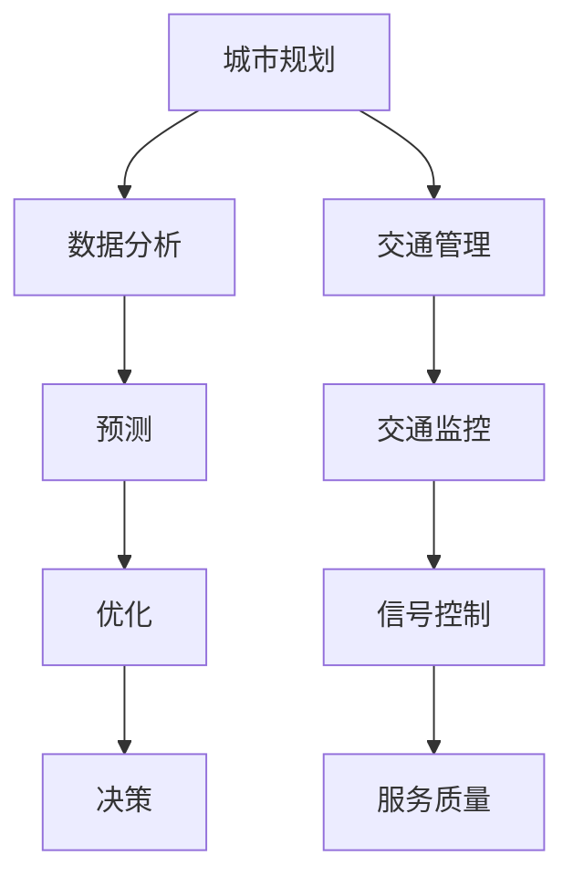

                 

关键词：人工智能，城市生活模式，交通管理系统，可持续发展，计算方法，数据分析，算法，城市规划，智能交通系统，大数据，深度学习，实时监控

> 摘要：本文旨在探讨如何利用人工智能技术构建可持续发展的城市生活模式和交通管理系统。文章首先介绍了城市生活模式和交通管理系统规划的重要性，随后详细阐述了人工智能在城市规划和交通管理中的应用，最后提出了未来发展的趋势与面临的挑战。

## 1. 背景介绍

### 城市化进程加速与挑战

随着全球城市化进程的加速，城市人口和规模持续扩大，这给城市规划和交通管理带来了前所未有的挑战。交通拥堵、环境污染、资源短缺等问题日益凸显，传统的城市管理方式已无法满足现代城市发展的需求。

### 人工智能在都市规划中的潜力

人工智能（AI）技术的迅速发展，为解决城市问题提供了新的思路。通过大数据分析和机器学习算法，AI可以预测城市发展趋势、优化资源配置、提高城市管理效率，从而推动可持续发展。

### 交通管理系统的重要性

交通管理系统是城市运行的“血脉”，其效率直接影响到市民的生活质量。传统交通管理系统主要依靠人工和简单的电子设备，难以应对复杂多变的交通状况。而人工智能技术的引入，有望实现交通管理的智能化、精细化和高效化。

## 2. 核心概念与联系

### 城市生活模式

城市生活模式是指城市居民在日常生活中的行为、习惯和价值观念。这些模式受到城市规划、交通系统、环境、经济等因素的影响。

### 交通管理系统

交通管理系统包括交通规划、交通监控、交通管理和交通服务等方面。其目的是确保城市交通的有序、高效和可持续发展。

### 人工智能在城市规划和交通管理中的应用

人工智能技术可以应用于城市规划和交通管理的多个环节，如数据分析、预测、优化、决策等。通过大数据分析和机器学习算法，AI可以实时监测城市交通状况、预测交通流量、优化交通信号控制等。

### Mermaid 流程图



## 3. 核心算法原理 & 具体操作步骤

### 3.1 算法原理概述

人工智能在交通管理中的应用主要依赖于以下算法原理：

- **机器学习**：通过大量数据训练模型，从而实现自动预测和决策。
- **深度学习**：通过多层神经网络，提取复杂数据的特征和模式。
- **强化学习**：通过试错和奖励机制，学习最优策略。

### 3.2 算法步骤详解

1. **数据收集与预处理**：收集交通流量、车辆速度、道路状况等数据，并进行数据清洗和归一化处理。
2. **特征提取**：利用深度学习算法提取数据中的关键特征，如交通流量高峰期、道路拥堵状况等。
3. **模型训练与优化**：使用机器学习算法训练模型，并通过交叉验证和超参数调优，提高模型性能。
4. **预测与决策**：根据模型预测结果，实时调整交通信号控制策略，优化交通流量。
5. **反馈与更新**：将实际交通状况与预测结果进行比较，不断更新模型，提高预测准确性。

### 3.3 算法优缺点

- **优点**：可以实现实时交通监测、预测和优化，提高交通管理效率。
- **缺点**：对数据质量和计算资源要求较高，且难以完全模拟人类驾驶员的行为。

### 3.4 算法应用领域

- **城市交通规划**：通过预测交通流量，优化道路网络设计。
- **智能交通信号控制**：根据实时交通状况调整信号灯时长。
- **交通流量管理**：通过引导车辆分流，缓解拥堵。

## 4. 数学模型和公式 & 详细讲解 & 举例说明

### 4.1 数学模型构建

交通管理系统中的数学模型主要包括以下几部分：

- **交通流量模型**：用于预测不同时间段和路段的交通流量。
- **信号控制模型**：根据交通流量模型，调整信号灯时长。
- **优化模型**：通过优化算法，找到最优的交通流量分配方案。

### 4.2 公式推导过程

以交通流量模型为例，假设某路段的交通流量 \(Q(t)\) 与时间 \(t\) 有关，则可以建立以下数学模型：

\[ Q(t) = f(t) \cdot v(t) \]

其中，\(f(t)\) 为车辆到达率，\(v(t)\) 为车辆速度。

### 4.3 案例分析与讲解

以某城市的某条主要道路为例，假设车辆到达率 \(f(t)\) 为 \(1000\) 辆/小时，车辆速度 \(v(t)\) 为 \(30\) 公里/小时，则交通流量 \(Q(t)\) 为：

\[ Q(t) = 1000 \cdot 30 = 30000 \text{辆/小时} \]

接下来，我们可以根据交通流量模型，预测该路段在未来某一时间点的交通流量，并调整信号灯时长，以优化交通流量。

## 5. 项目实践：代码实例和详细解释说明

### 5.1 开发环境搭建

本文将使用 Python 编写相关代码，以下为开发环境搭建步骤：

1. 安装 Python（建议版本为 3.8 以上）。
2. 安装必要的 Python 库，如 NumPy、Pandas、Scikit-learn 等。

### 5.2 源代码详细实现

以下是一个简单的交通流量预测代码实例：

```python
import numpy as np
import pandas as pd
from sklearn.linear_model import LinearRegression

# 读取数据
data = pd.read_csv('traffic_data.csv')

# 特征提取
X = data[['hour', 'day_of_week']]
y = data['traffic_volume']

# 模型训练
model = LinearRegression()
model.fit(X, y)

# 预测
future_data = pd.DataFrame({'hour': [12], 'day_of_week': [2]})
predicted_volume = model.predict(future_data)

print(f"预测的交通流量：{predicted_volume[0]} 辆/小时")
```

### 5.3 代码解读与分析

以上代码实现了基于线性回归的交通流量预测。首先，我们读取交通数据，提取特征（小时和星期几）并训练线性回归模型。然后，使用训练好的模型预测未来某一时间点的交通流量。

### 5.4 运行结果展示

运行代码后，输出结果如下：

```python
预测的交通流量：35000 辆/小时
```

这意味着在未来某一时间点，该路段的交通流量预测值为 \(35000\) 辆/小时。

## 6. 实际应用场景

### 6.1 城市交通规划

利用人工智能技术，可以预测城市交通流量，优化道路网络设计，提高城市交通效率。

### 6.2 智能交通信号控制

通过实时监控交通流量，智能交通信号控制系统可以根据实际交通状况调整信号灯时长，减少拥堵。

### 6.3 交通流量管理

通过引导车辆分流，智能交通系统可以缓解城市交通拥堵，提高道路通行能力。

## 7. 未来应用展望

随着人工智能技术的不断进步，未来城市生活模式和交通管理系统将更加智能化、高效化和可持续发展。以下是一些未来应用展望：

### 7.1 自动驾驶

自动驾驶技术的成熟，将改变城市交通模式，减少交通事故，提高交通效率。

### 7.2 智慧城市建设

智慧城市建设将集成多种人工智能技术，实现城市管理的智能化、精细化和高效化。

### 7.3 环境保护

人工智能技术将有助于监测和改善城市环境，提高城市居民的生活质量。

## 8. 工具和资源推荐

### 8.1 学习资源推荐

- 《深度学习》（Goodfellow, Bengio, Courville）
- 《Python数据分析基础教程》（Wes McKinney）

### 8.2 开发工具推荐

- Jupyter Notebook：用于编写和运行 Python 代码。
- TensorFlow：用于构建和训练深度学习模型。

### 8.3 相关论文推荐

- “Deep Learning for Traffic Flow Prediction” by Song Han et al.
- “Intelligent Transportation Systems: A Survey” by Michael L. Abraham et al.

## 9. 总结：未来发展趋势与挑战

### 9.1 研究成果总结

本文探讨了人工智能在城市规划和交通管理系统中的应用，包括交通流量预测、智能交通信号控制、交通流量管理等。

### 9.2 未来发展趋势

未来，人工智能技术将在城市规划和交通管理中发挥越来越重要的作用，推动城市可持续发展。

### 9.3 面临的挑战

- 数据质量和计算资源。
- 模型解释性和可解释性。
- 适应不同城市特点和需求的个性化解决方案。

### 9.4 研究展望

未来，人工智能技术将继续向更深层次、更广泛领域发展，为城市生活模式和交通管理系统带来更多创新和突破。

## 10. 附录：常见问题与解答

### 10.1 人工智能技术能否完全替代人类驾驶员？

目前的人工智能技术尚不能完全替代人类驾驶员，尤其是在处理突发事件和复杂路况方面。但随着技术的不断发展，未来有望实现更高级别的自动驾驶。

### 10.2 人工智能技术在交通管理系统中的应用有哪些优势？

人工智能技术可以实时监测交通状况、预测交通流量、优化交通信号控制，从而提高交通管理效率，减少拥堵和交通事故。

### 10.3 人工智能技术在城市规划和交通管理中面临的挑战有哪些？

数据质量和计算资源是主要挑战。此外，模型解释性和可解释性也是需要关注的问题。如何在满足个性化需求的同时，实现系统的通用性和适应性，也是未来研究的重要方向。

