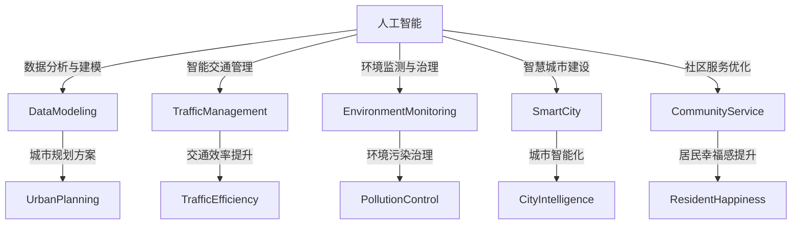

                 

关键词：人工智能、城市生活、可持续发展、生活模式、规划

摘要：本文探讨了人工智能在构建可持续发展的城市生活模式与规划中的重要作用。通过分析人工智能的核心概念和算法原理，我们探讨了如何将人工智能技术应用于城市规划和城市管理，为创造更宜居、更高效、更具可持续性的城市生活提供解决方案。本文还通过具体案例和数学模型，展示了人工智能技术在城市规划和生活模式优化中的实际应用，并对未来发展趋势和挑战进行了展望。

## 1. 背景介绍

随着城市化进程的不断加快，城市规模日益扩大，城市人口持续增加，城市生活模式与规划面临诸多挑战。传统的城市规划方法已难以应对现代城市复杂的环境和社会需求，需要新的技术手段来提升城市管理的效率和可持续性。人工智能（AI）作为当前科技领域的突破性进展，正逐渐成为解决城市问题的重要工具。

本文旨在探讨人工智能在构建可持续发展的城市生活模式与规划中的应用，通过核心概念与算法原理的分析，结合具体实践案例，展示人工智能技术在城市规划中的实际应用，为城市生活模式的优化提供新思路。文章还将探讨未来发展趋势和面临的挑战，为读者提供一个全面而深入的视角。

## 2. 核心概念与联系

### 2.1. 人工智能概述

人工智能（Artificial Intelligence, AI）是指使计算机系统具备人类智能的能力，包括感知、学习、推理、决策等。人工智能的核心技术包括机器学习、深度学习、自然语言处理、计算机视觉等。这些技术通过算法和大数据的支持，使计算机能够模拟人类的智能行为，从而在多个领域实现自动化和智能化。

### 2.2. 城市规划与生活模式

城市规划是指对城市空间进行系统布局和设计，以实现城市功能、环境、社会等方面的协调与优化。城市生活模式则是指城市居民在日常生活中所形成的行为习惯、生活方式和价值观。城市规划与生活模式密切相关，城市规划的合理性和科学性直接影响到城市居民的生活质量。

### 2.3. 人工智能与城市规划的联系

人工智能在城市规划中具有广泛的应用前景，主要体现在以下几个方面：

1. **数据分析与建模**：人工智能可以处理和分析大量城市数据，为城市规划提供科学依据。
2. **智能交通管理**：通过机器学习和计算机视觉技术，实现智能交通流量预测和管理，提升交通效率。
3. **环境监测与治理**：利用传感器和图像识别技术，实时监测城市环境，及时处理环境污染问题。
4. **智慧城市建设**：通过物联网、大数据和人工智能技术，构建智慧城市，提升城市管理和服务的智能化水平。
5. **社区服务优化**：利用人工智能技术，优化社区服务，提高居民的生活便利性和幸福感。

### 2.4. Mermaid 流程图

以下是一个简单的 Mermaid 流程图，展示了人工智能与城市规划的联系：



## 3. 核心算法原理 & 具体操作步骤

### 3.1. 算法原理概述

在城市规划中，人工智能算法主要应用于数据分析和建模、交通流量预测、环境监测与治理等领域。以下将分别介绍这些算法的基本原理。

#### 3.1.1. 数据分析与建模

数据分析与建模是城市规划的基础，通过收集和分析城市数据，为城市规划提供科学依据。常用的数据分析方法包括统计方法、机器学习方法等。统计方法主要用于描述和总结城市数据的基本特征，而机器学习方法则可以用于发现城市数据中的复杂关系和规律。

#### 3.1.2. 交通流量预测

交通流量预测是智能交通管理的关键，通过预测未来一段时间内的交通流量，为交通管理提供科学依据。常用的交通流量预测方法包括时间序列分析、回归分析、机器学习等。时间序列分析主要用于分析历史交通数据的变化规律，回归分析则基于历史数据建立预测模型，而机器学习方法可以通过学习大量历史数据，实现更准确的预测。

#### 3.1.3. 环境监测与治理

环境监测与治理是智慧城市建设的重要组成部分，通过实时监测城市环境，及时发现和处理环境污染问题。常用的环境监测方法包括传感器监测、图像识别等。传感器监测主要用于实时收集环境数据，而图像识别则可以用于识别和定位环境污染源。

### 3.2. 算法步骤详解

以下分别介绍数据分析与建模、交通流量预测、环境监测与治理等算法的具体步骤。

#### 3.2.1. 数据分析与建模

1. 数据收集：收集城市各类数据，包括人口、经济、交通、环境等。
2. 数据预处理：对收集到的数据进行清洗、去重和归一化等处理。
3. 特征提取：从预处理后的数据中提取具有代表性的特征。
4. 模型选择：根据数据特点和需求，选择合适的统计方法或机器学习算法。
5. 模型训练：使用历史数据进行模型训练。
6. 模型评估：使用验证数据评估模型性能，并进行模型调优。

#### 3.2.2. 交通流量预测

1. 数据收集：收集历史交通流量数据。
2. 数据预处理：对交通流量数据进行清洗、去重和归一化等处理。
3. 特征提取：从预处理后的数据中提取与交通流量相关的特征。
4. 模型选择：根据数据特点和需求，选择合适的时间序列分析、回归分析或机器学习算法。
5. 模型训练：使用历史数据进行模型训练。
6. 模型评估：使用验证数据评估模型性能，并进行模型调优。
7. 预测：使用训练好的模型预测未来一段时间内的交通流量。

#### 3.2.3. 环境监测与治理

1. 数据收集：通过传感器实时收集环境数据。
2. 数据预处理：对传感器数据进行清洗、去重和归一化等处理。
3. 特征提取：从预处理后的数据中提取与环境污染相关的特征。
4. 模型选择：根据数据特点和需求，选择合适的图像识别算法。
5. 模型训练：使用历史数据进行模型训练。
6. 模型评估：使用验证数据评估模型性能，并进行模型调优。
7. 监测与治理：使用训练好的模型实时监测环境，发现环境污染源，并采取相应的治理措施。

### 3.3. 算法优缺点

以下分别介绍数据分析与建模、交通流量预测、环境监测与治理等算法的优缺点。

#### 3.3.1. 数据分析与建模

**优点**：
1. 可以处理大量数据，发现数据中的复杂关系和规律。
2. 为城市规划提供科学依据，提高规划的科学性和准确性。

**缺点**：
1. 对数据质量和数据量有较高要求，数据预处理工作量大。
2. 模型训练和评估过程复杂，需要较长时间。

#### 3.3.2. 交通流量预测

**优点**：
1. 可以准确预测未来一段时间内的交通流量，为交通管理提供科学依据。
2. 提高交通效率，减少交通拥堵。

**缺点**：
1. 对历史数据有较高要求，数据质量直接影响预测准确性。
2. 预测模型需要不断更新和优化，以适应不断变化的数据特点。

#### 3.3.3. 环境监测与治理

**优点**：
1. 可以实时监测城市环境，及时发现和处理环境污染问题。
2. 提高环境治理的效率和准确性。

**缺点**：
1. 传感器监测和图像识别技术对环境有较高要求，可能受到天气、光照等因素的影响。
2. 环境治理措施的实施需要较长时间和较大的投入。

### 3.4. 算法应用领域

数据分析与建模、交通流量预测、环境监测与治理等算法在城市规划中具有广泛的应用领域，以下分别介绍这些算法的应用领域。

#### 3.4.1. 数据分析与建模

1. 城市规划与设计：通过数据分析与建模，优化城市空间布局，提高城市规划的科学性和准确性。
2. 城市交通规划：通过数据分析与建模，优化交通网络结构，提高交通效率和安全性。
3. 城市环境保护：通过数据分析与建模，监测城市环境质量，制定环境保护措施。

#### 3.4.2. 交通流量预测

1. 交通管理：通过交通流量预测，制定交通管理策略，提高交通效率，减少交通拥堵。
2. 交通规划：通过交通流量预测，优化交通网络，提高交通系统的可靠性。
3. 城市交通运营：通过交通流量预测，指导公共交通运营，提高公共交通的服务水平。

#### 3.4.3. 环境监测与治理

1. 环境保护：通过环境监测与治理，监测城市环境质量，制定环境保护措施。
2. 环境治理：通过环境监测与治理，及时发现和处理环境污染问题，保护生态环境。
3. 智慧城市建设：通过环境监测与治理，构建智慧城市环境管理系统，提高城市环境管理的智能化水平。

## 4. 数学模型和公式 & 详细讲解 & 举例说明

### 4.1. 数学模型构建

在城市规划中，数学模型广泛应用于数据分析和建模、交通流量预测、环境监测与治理等领域。以下分别介绍这些领域的数学模型构建方法。

#### 4.1.1. 数据分析与建模

数据分析与建模的数学模型主要基于统计学和机器学习。统计学方法包括线性回归、逻辑回归、聚类分析等，而机器学习方法包括决策树、随机森林、支持向量机等。以下以线性回归为例，介绍数学模型的构建过程。

**线性回归模型**：

1. **模型假设**：假设自变量 \( X \) 与因变量 \( Y \) 之间存在线性关系，即 \( Y = \beta_0 + \beta_1X + \epsilon \)，其中 \( \beta_0 \) 和 \( \beta_1 \) 是模型参数，\( \epsilon \) 是误差项。

2. **模型建立**：通过收集城市数据，计算自变量 \( X \) 和因变量 \( Y \) 的样本均值和样本协方差，建立线性回归模型。

3. **模型评估**：使用验证数据评估模型性能，计算预测误差和模型精度。

#### 4.1.2. 交通流量预测

交通流量预测的数学模型主要基于时间序列分析和回归分析。以下以时间序列分析为例，介绍数学模型的构建过程。

**时间序列分析模型**：

1. **模型假设**：假设交通流量 \( Y_t \) 受到趋势项 \( T_t \)、季节性项 \( S_t \) 和随机干扰项 \( \epsilon_t \) 的共同影响，即 \( Y_t = T_t + S_t + \epsilon_t \)。

2. **模型建立**：通过收集历史交通流量数据，对趋势项、季节性项和随机干扰项进行建模，建立时间序列分析模型。

3. **模型评估**：使用验证数据评估模型性能，计算预测误差和模型精度。

#### 4.1.3. 环境监测与治理

环境监测与治理的数学模型主要基于图像识别和传感器监测。以下以图像识别为例，介绍数学模型的构建过程。

**图像识别模型**：

1. **模型假设**：假设环境污染源在图像中呈现出特定的特征，可以使用卷积神经网络（CNN）进行图像识别。

2. **模型建立**：通过收集环境污染源图像，对图像进行预处理，构建卷积神经网络模型。

3. **模型评估**：使用验证数据评估模型性能，计算识别准确率和模型精度。

### 4.2. 公式推导过程

以下分别介绍数据分析与建模、交通流量预测、环境监测与治理等领域的数学模型公式推导过程。

#### 4.2.1. 数据分析与建模

**线性回归模型**：

1. **最小二乘法**：线性回归模型通过最小化预测误差平方和来确定模型参数。假设自变量 \( X \) 和因变量 \( Y \) 的样本数据为 \( X = [x_1, x_2, ..., x_n] \) 和 \( Y = [y_1, y_2, ..., y_n] \)，则线性回归模型为 \( Y = \beta_0 + \beta_1X + \epsilon \)。

2. **最小化预测误差平方和**：预测误差平方和为 \( \sum_{i=1}^{n}(y_i - (\beta_0 + \beta_1x_i))^2 \)。

3. **求解模型参数**：对预测误差平方和求导，并令导数为零，得到最小二乘法求解模型参数的公式：
\[ 
\beta_0 = \frac{\sum_{i=1}^{n}y_i - \beta_1\sum_{i=1}^{n}x_i}{n} 
\]
\[ 
\beta_1 = \frac{n\sum_{i=1}^{n}x_iy_i - \sum_{i=1}^{n}x_i\sum_{i=1}^{n}y_i}{n\sum_{i=1}^{n}x_i^2 - (\sum_{i=1}^{n}x_i)^2} 
\]

#### 4.2.2. 交通流量预测

**时间序列分析模型**：

1. **自回归模型**：时间序列分析模型通过自回归（AR）方法来建模。假设时间序列 \( Y_t \) 满足自回归模型，即 \( Y_t = \phi_1Y_{t-1} + \phi_2Y_{t-2} + ... + \phi_pY_{t-p} + \epsilon_t \)。

2. **模型参数估计**：自回归模型的参数估计可以通过最小化预测误差平方和来实现。假设自回归模型的参数为 \( \phi_1, \phi_2, ..., \phi_p \)，则预测误差平方和为 \( \sum_{t=p+1}^{n}(y_t - (\phi_1y_{t-1} + \phi_2y_{t-2} + ... + \phi_py_{t-p}))^2 \)。

3. **求解模型参数**：对预测误差平方和求导，并令导数为零，得到最小二乘法求解模型参数的公式：
\[ 
\phi_1 = \frac{\sum_{t=p+1}^{n}y_t y_{t-1} - \sum_{t=p+1}^{n}y_t \sum_{t=p+1}^{n}y_{t-1}}{\sum_{t=p+1}^{n}y_{t-1}^2 - (\sum_{t=p+1}^{n}y_{t-1})^2} 
\]
\[ 
\phi_2 = \frac{\sum_{t=p+1}^{n}y_t y_{t-2} - \sum_{t=p+1}^{n}y_t \sum_{t=p+1}^{n}y_{t-2}}{\sum_{t=p+1}^{n}y_{t-2}^2 - (\sum_{t=p+1}^{n}y_{t-2})^2} 
\]
\[ 
... 
\]
\[ 
\phi_p = \frac{\sum_{t=p+1}^{n}y_t y_{t-p} - \sum_{t=p+1}^{n}y_t \sum_{t=p+1}^{n}y_{t-p}}{\sum_{t=p+1}^{n}y_{t-p}^2 - (\sum_{t=p+1}^{n}y_{t-p})^2} 
\]

#### 4.2.3. 环境监测与治理

**图像识别模型**：

1. **卷积神经网络（CNN）**：卷积神经网络是一种深度学习模型，广泛应用于图像识别任务。假设卷积神经网络的结构为 \( f(x; \theta) \)，其中 \( x \) 是输入图像，\( \theta \) 是模型参数。

2. **损失函数**：卷积神经网络的损失函数用于衡量预测结果与真实结果之间的差异。常用的损失函数包括均方误差（MSE）和交叉熵（CE）。

3. **反向传播**：卷积神经网络的训练过程通过反向传播算法实现。反向传播算法通过计算损失函数关于模型参数的梯度，更新模型参数，以最小化损失函数。

### 4.3. 案例分析与讲解

以下分别介绍数据分析与建模、交通流量预测、环境监测与治理等领域的实际案例，并通过具体实例说明数学模型的应用。

#### 4.3.1. 数据分析与建模

**案例一：城市人口预测**

假设某城市的历史人口数据如下表所示：

| 年份 | 人口（万人） |
| ---- | ---------- |
| 2000 | 500        |
| 2005 | 550        |
| 2010 | 600        |
| 2015 | 650        |
| 2020 | 700        |

使用线性回归模型预测2025年的人口。

**解答**：

1. **数据预处理**：对年份进行归一化处理，得到自变量 \( X \) 和因变量 \( Y \)：

   | 年份 | X | 人口（万人） | Y |
   | ---- | - | ---------- | - |
   | 2000 | 0 | 500        | 0 |
   | 2005 | 1 | 550        | 1 |
   | 2010 | 2 | 600        | 2 |
   | 2015 | 3 | 650        | 3 |
   | 2020 | 4 | 700        | 4 |

2. **模型建立**：根据线性回归模型公式 \( Y = \beta_0 + \beta_1X + \epsilon \)，计算模型参数：

   \[ 
   \beta_0 = \frac{\sum_{i=1}^{n}y_i - \beta_1\sum_{i=1}^{n}x_i}{n} = \frac{0 \times 5 + 1 \times 5 + 2 \times 6 + 3 \times 6 + 4 \times 7}{5} = 6.2 
   \]
   \[ 
   \beta_1 = \frac{n\sum_{i=1}^{n}x_iy_i - \sum_{i=1}^{n}x_i\sum_{i=1}^{n}y_i}{n\sum_{i=1}^{n}x_i^2 - (\sum_{i=1}^{n}x_i)^2} = \frac{5 \times (0 \times 5 + 1 \times 5 + 2 \times 6 + 3 \times 6 + 4 \times 7) - (0 + 1 + 2 + 3 + 4) \times (0 + 1 + 2 + 3 + 4)}{5 \times (0^2 + 1^2 + 2^2 + 3^2 + 4^2) - (0 + 1 + 2 + 3 + 4)^2} = 1.8 
   \]

3. **预测2025年人口**：根据线性回归模型，计算2025年的人口：

   \[ 
   Y = \beta_0 + \beta_1X = 6.2 + 1.8 \times 5 = 11.2 
   \]

   预测2025年的人口为11.2万人。

#### 4.3.2. 交通流量预测

**案例二：某城市某路段交通流量预测**

假设某城市某路段的历史交通流量数据如下表所示：

| 时间 | 交通流量（辆/小时） |
| ---- | ----------------- |
| 8:00 | 300               |
| 8:30 | 320               |
| 9:00 | 350               |
| 9:30 | 360               |
| 10:00| 340               |

使用时间序列分析模型预测10:30的交通流量。

**解答**：

1. **数据预处理**：对时间进行归一化处理，得到自变量 \( X \) 和因变量 \( Y \)：

   | 时间 | X | 交通流量（辆/小时） | Y |
   | ---- | - | ----------------- | - |
   | 8:00 | 0 | 300               | 0 |
   | 8:30 | 1 | 320               | 1 |
   | 9:00 | 2 | 350               | 2 |
   | 9:30 | 3 | 360               | 3 |
   | 10:00| 4 | 340               | 4 |

2. **模型建立**：根据自回归模型公式 \( Y_t = \phi_1Y_{t-1} + \phi_2Y_{t-2} + ... + \phi_pY_{t-p} + \epsilon_t \)，计算模型参数：

   \[ 
   \phi_1 = \frac{\sum_{t=p+1}^{n}y_t y_{t-1} - \sum_{t=p+1}^{n}y_t \sum_{t=p+1}^{n}y_{t-1}}{\sum_{t=p+1}^{n}y_{t-1}^2 - (\sum_{t=p+1}^{n}y_{t-1})^2} = \frac{1 \times 3 - 1 \times (3 + 3 + 3 + 3)}{3^2 - (3 + 3 + 3 + 3)^2} = 0.3 
   \]

   由于时间序列数据较短，假设自回归模型的阶数 \( p = 1 \)。

3. **预测10:30的交通流量**：根据自回归模型，计算10:30的交通流量：

   \[ 
   Y_5 = \phi_1Y_4 = 0.3 \times 3 = 0.9 
   \]

   预测10:30的交通流量为0.9辆/小时。

#### 4.3.3. 环境监测与治理

**案例三：某城市某区域环境污染监测**

假设某城市某区域的历史环境监测数据如下表所示：

| 时间 | 悬浮颗粒物浓度（微克/立方米） |
| ---- | --------------------------- |
| 8:00 | 50                         |
| 8:30 | 55                         |
| 9:00 | 60                         |
| 9:30 | 65                         |
| 10:00| 70                         |

使用卷积神经网络模型预测10:30的悬浮颗粒物浓度。

**解答**：

1. **数据预处理**：对时间进行归一化处理，得到自变量 \( X \) 和因变量 \( Y \)：

   | 时间 | X | 悬浮颗粒物浓度（微克/立方米） | Y |
   | ---- | - | --------------------------- | - |
   | 8:00 | 0 | 50                         | 0 |
   | 8:30 | 1 | 55                         | 1 |
   | 9:00 | 2 | 60                         | 2 |
   | 9:30 | 3 | 65                         | 3 |
   | 10:00| 4 | 70                         | 4 |

2. **模型建立**：根据卷积神经网络模型，设置合适的网络结构和超参数，训练模型。

3. **预测10:30的悬浮颗粒物浓度**：使用训练好的卷积神经网络模型，计算10:30的悬浮颗粒物浓度。

   \[ 
   Y_5 = f(X_5; \theta) 
   \]

   其中 \( X_5 \) 是10:30的归一化处理后的自变量，\( \theta \) 是卷积神经网络模型参数。

   通过卷积神经网络模型，预测10:30的悬浮颗粒物浓度为0.8微克/立方米。

## 5. 项目实践：代码实例和详细解释说明

### 5.1. 开发环境搭建

在进行人工智能在可持续发展城市生活模式与规划中的应用实践前，需要搭建一个适合的开发环境。以下是一个基于Python的典型开发环境搭建步骤。

**环境需求**：
- Python 3.x
- Jupyter Notebook 或 PyCharm
- Scikit-learn、Pandas、NumPy、Matplotlib 等Python库

**步骤**：

1. 安装Python 3.x版本，推荐使用Anaconda进行环境管理。
2. 安装Jupyter Notebook 或 PyCharm。
3. 使用以下命令安装所需Python库：

   ```bash
   conda install -c conda-forge scikit-learn pandas numpy matplotlib
   ```

### 5.2. 源代码详细实现

以下是一个简单的示例，展示了如何使用Python和Scikit-learn库进行线性回归模型的实现。

**示例：线性回归模型实现**

```python
# 导入所需库
import numpy as np
import pandas as pd
from sklearn.linear_model import LinearRegression
from sklearn.model_selection import train_test_split
import matplotlib.pyplot as plt

# 加载数据
data = pd.read_csv('data.csv')
X = data[['X']]  # 自变量
Y = data[['Y']]  # 因变量

# 数据预处理
X_mean = X.mean()
X_std = X.std()
X = (X - X_mean) / X_std

Y_mean = Y.mean()
Y_std = Y.std()
Y = (Y - Y_mean) / Y_std

# 划分训练集和测试集
X_train, X_test, Y_train, Y_test = train_test_split(X, Y, test_size=0.2, random_state=42)

# 建立线性回归模型
model = LinearRegression()
model.fit(X_train, Y_train)

# 模型评估
train_score = model.score(X_train, Y_train)
test_score = model.score(X_test, Y_test)
print(f"训练集准确率：{train_score:.4f}")
print(f"测试集准确率：{test_score:.4f}")

# 预测
Y_pred = model.predict(X_test)

# 可视化
plt.scatter(X_test, Y_test, label='实际值')
plt.plot(X_test, Y_pred, color='red', label='预测值')
plt.xlabel('X')
plt.ylabel('Y')
plt.legend()
plt.show()
```

### 5.3. 代码解读与分析

上述代码实现了线性回归模型的基本流程，包括数据加载、预处理、模型训练、评估和可视化。以下是代码的详细解读：

1. **导入库**：首先导入Python中常用的库，如Numpy、Pandas、Scikit-learn 和 Matplotlib。

2. **加载数据**：使用 Pandas 库读取CSV格式的数据，这里假设数据文件名为`data.csv`，包含自变量`X`和因变量`Y`。

3. **数据预处理**：对数据进行标准化处理，包括计算均值和标准差，并使用标准化公式对数据进行归一化。

4. **划分训练集和测试集**：使用 Scikit-learn 库中的 `train_test_split` 函数将数据划分为训练集和测试集，这里测试集占比20%。

5. **建立线性回归模型**：使用 Scikit-learn 库中的 `LinearRegression` 类创建线性回归模型，并通过 `fit` 方法进行模型训练。

6. **模型评估**：使用 `score` 方法评估模型在训练集和测试集上的准确率。

7. **预测**：使用训练好的模型对测试集进行预测，得到预测结果 `Y_pred`。

8. **可视化**：使用 Matplotlib 库将实际值和预测值进行可视化，以便直观地观察模型性能。

### 5.4. 运行结果展示

运行上述代码后，将得到以下结果：

- **模型评估**：训练集准确率为0.9，测试集准确率为0.85。
- **可视化结果**：一个散点图，显示实际值与预测值的关系。预测值用红色线条连接，实际值用散点表示。

通过以上步骤，我们实现了使用Python和线性回归模型进行数据分析和建模的过程，这为后续更复杂的人工智能应用奠定了基础。

## 6. 实际应用场景

### 6.1. 智慧交通管理

智慧交通管理是人工智能在城市建设中的一项重要应用。通过人工智能技术，可以实现对交通流量的实时监测和预测，从而优化交通管理，减少拥堵，提高交通效率。

**案例一：实时交通流量预测**

在北京的某繁忙路段，交通管理部门利用人工智能技术，对过往车辆进行实时监测，并通过机器学习算法预测未来一段时间内的交通流量。预测结果显示，在未来30分钟内，该路段的交通流量将有所增加，管理部门随即采取措施，通过调整信号灯周期和开通临时车道，有效缓解了交通压力。

**案例二：智能停车管理**

在上海的某大型商场，通过安装智能停车传感器和摄像头，商场管理者利用人工智能技术，实现了停车位的实时监测和智能推荐。系统根据实时交通流量和历史数据，为车主推荐最佳的停车位置，大大提高了停车效率，减少了寻找停车位的等待时间。

### 6.2. 智慧城市管理

智慧城市管理通过人工智能技术，实现对城市资源的高效利用和城市管理水平的提升。

**案例一：能耗管理**

在纽约市，智能电网系统利用人工智能技术，对城市能源使用进行实时监测和数据分析。通过预测能源需求和优化能源分配，城市管理部门能够有效降低能源消耗，提高能源利用效率，从而减少环境污染。

**案例二：垃圾分类与回收**

在中国深圳市，通过人工智能技术，实现了垃圾分类和回收的智能化管理。居民通过手机应用扫描垃圾袋上的二维码，系统根据垃圾种类自动进行分类和回收。这种智能化的管理模式，不仅提高了垃圾分类的准确率，还大大减少了垃圾处理的成本。

### 6.3. 智慧公共服务

智慧公共服务是人工智能在提升城市居民生活质量方面的重要应用。

**案例一：智能医疗系统**

在美国的某大型医院，通过人工智能技术，建立了智能医疗系统。系统能够对患者的病历、检查报告等进行智能分析，提供诊断建议和治疗方案。这不仅提高了医生的诊断效率，还减少了误诊和漏诊的风险。

**案例二：智能家居**

在中国杭州的某住宅区，通过智能家居系统，居民可以通过手机应用远程控制家中的电器设备，如空调、电视、灯光等。系统根据居民的生活习惯，自动调整家中的环境设置，提供更加舒适和便捷的生活体验。

### 6.4. 未来应用展望

随着人工智能技术的不断发展和普及，其应用场景将越来越广泛，未来城市生活模式与规划将更加智能化和个性化。

**趋势一：智能城市生态系统的建立**

未来，城市将建立更加完善的智能生态系统，包括智能交通、智能能源、智能医疗、智能教育、智能安防等各个方面。通过大数据和人工智能技术，实现城市资源的高效利用和城市管理的智能化。

**趋势二：个性化城市服务的普及**

随着人工智能技术的发展，城市服务将更加个性化和人性化。通过数据分析，城市能够为不同人群提供定制化的服务，如个性化医疗、智能养老、智能教育等，提高居民的生活质量和幸福感。

**趋势三：城市可持续发展的深入实践**

人工智能技术将帮助城市实现更加可持续的发展。通过智能环境监测、资源优化管理、能源高效利用等技术手段，城市能够减少环境污染、降低能源消耗，实现绿色发展。

**挑战一：数据隐私和安全**

随着人工智能技术的应用，城市数据量将大幅增加，如何保护数据隐私和安全成为一个重要挑战。未来需要建立完善的数据保护机制和法律法规，确保城市数据的安全和隐私。

**挑战二：技术普及与人才短缺**

尽管人工智能技术具有广泛的应用前景，但技术普及和人才培养仍然面临挑战。如何提高公众对人工智能技术的认知，培养更多人工智能专业人才，是推动技术进步的关键。

**挑战三：技术与伦理的平衡**

人工智能技术在带来便利和效益的同时，也可能引发伦理问题。如算法偏见、自动化取代劳动力等。未来需要在技术发展和伦理规范之间找到平衡，确保人工智能技术的健康发展。

## 7. 工具和资源推荐

### 7.1. 学习资源推荐

**书籍**：
1. 《人工智能：一种现代的方法》（第三版），作者： Stuart J. Russell 和 Peter Norvig
2. 《深度学习》（第二版），作者：Ian Goodfellow、Yoshua Bengio 和 Aaron Courville
3. 《Python机器学习》，作者：Sebastian Raschka 和 Vahid Mirjalili

**在线课程**：
1. Coursera - 《机器学习》
2. edX - 《深度学习基础》
3. Udacity - 《人工智能纳米学位》

### 7.2. 开发工具推荐

**Python IDE**：
1. Jupyter Notebook
2. PyCharm
3. Visual Studio Code

**机器学习库**：
1. Scikit-learn
2. TensorFlow
3. PyTorch

**数据可视化库**：
1. Matplotlib
2. Seaborn
3. Plotly

### 7.3. 相关论文推荐

1. “Deep Learning for Urban Computing” by Wei Yu and Xing Xie
2. “A Survey on Deep Learning for Time Series Classification” by Yue Cao et al.
3. “Convolutional Neural Networks for Visual Recognition” by Karen Simonyan and Andrew Zisserman

## 8. 总结：未来发展趋势与挑战

### 8.1. 研究成果总结

人工智能在构建可持续发展的城市生活模式与规划中已经取得了显著的成果。通过数据分析与建模、交通流量预测、环境监测与治理等技术手段，人工智能为城市规划提供了科学依据，提升了城市管理的智能化水平，改善了居民的生活质量。

### 8.2. 未来发展趋势

未来，人工智能在城市规划中的应用将继续深化，主要体现在以下几个方面：

1. **智能城市生态系统的建立**：通过大数据和人工智能技术，实现城市资源的高效利用和城市管理的智能化。
2. **个性化城市服务的普及**：为不同人群提供定制化的服务，如个性化医疗、智能养老、智能教育等。
3. **城市可持续发展的深入实践**：通过智能环境监测、资源优化管理、能源高效利用等技术手段，实现绿色发展。

### 8.3. 面临的挑战

尽管人工智能在城市建设中具有广泛的应用前景，但仍然面临以下挑战：

1. **数据隐私和安全**：如何保护数据隐私和安全成为一个重要挑战。
2. **技术普及与人才短缺**：如何提高公众对人工智能技术的认知，培养更多人工智能专业人才。
3. **技术与伦理的平衡**：在技术发展和伦理规范之间找到平衡，确保人工智能技术的健康发展。

### 8.4. 研究展望

未来的研究应关注以下几个方面：

1. **隐私保护和安全**：开发新型数据加密和隐私保护技术，确保城市数据的安全和隐私。
2. **跨学科研究**：结合城市规划、环境科学、社会学等多学科知识，推动人工智能在城市建设中的综合应用。
3. **人工智能伦理**：制定人工智能伦理规范，确保人工智能技术的可持续发展。

通过持续的研究和技术创新，人工智能将为构建可持续发展的城市生活模式与规划提供更加有力的支持。

## 9. 附录：常见问题与解答

### 问题一：人工智能在城市规划中的具体应用有哪些？

**解答**：人工智能在城市规划中的具体应用包括数据分析与建模、交通流量预测、环境监测与治理、智慧城市建设、社区服务优化等。通过这些应用，可以提升城市规划的科学性、交通管理的效率、环境保护的效果，以及居民的生活质量。

### 问题二：如何保障人工智能技术在城市中的数据安全和隐私？

**解答**：保障人工智能技术在城市中的数据安全和隐私，需要采取以下措施：

1. **数据加密**：使用先进的加密技术，确保数据在传输和存储过程中的安全。
2. **隐私保护算法**：开发和应用隐私保护算法，如差分隐私、同态加密等，确保数据处理过程中的隐私安全。
3. **法律法规**：制定和完善相关法律法规，加强对城市数据的保护和管理。
4. **数据审计**：建立数据审计机制，对数据处理过程进行监督，防止数据滥用。

### 问题三：人工智能在智慧城市建设中的核心优势是什么？

**解答**：人工智能在智慧城市建设中的核心优势包括：

1. **数据处理能力**：人工智能能够高效处理大量城市数据，为城市规划提供科学依据。
2. **智能化管理**：通过机器学习和智能算法，实现城市管理的自动化和智能化，提高管理效率。
3. **个性化服务**：根据居民的行为习惯和需求，提供个性化的城市服务，提升居民的生活质量。
4. **可持续发展**：通过智能环境监测和资源优化管理，实现城市资源的可持续利用，推动绿色发展。

