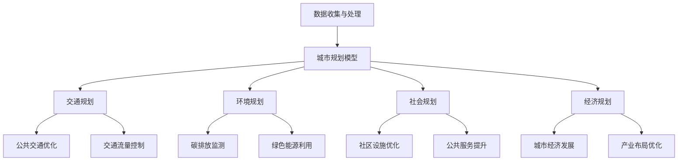

                 

关键词：人工智能，可持续发展，城市生活模式，设计规划，计算机科学

摘要：本文探讨了人工智能在构建可持续发展的城市生活模式与设计规划中的作用。通过分析人工智能的核心概念及其与人类计算的联系，本文提出了一种基于人工智能的城市规划框架。本文详细介绍了核心算法原理、数学模型、具体应用场景和代码实例，并对未来发展趋势与挑战进行了深入探讨。

## 1. 背景介绍

随着全球城市化进程的加速，城市生活面临着诸多挑战，如交通拥堵、环境污染、资源浪费等。传统的城市规划方法已无法满足现代城市的发展需求。人工智能作为一种新兴技术，具有强大的数据处理和分析能力，可以提供创新的解决方案，助力城市可持续发展。

本文旨在探讨人工智能在构建可持续发展的城市生活模式与设计规划中的作用，通过分析人工智能的核心概念及其与人类计算的联系，提出一种基于人工智能的城市规划框架。本文还将详细阐述核心算法原理、数学模型、具体应用场景和代码实例，并探讨未来发展趋势与挑战。

### 1.1 人工智能的起源与发展

人工智能（Artificial Intelligence，AI）是一门研究、开发和应用使计算机模拟、延伸和扩展人类智能的理论、方法、技术及应用系统的学科。人工智能的发展可以追溯到20世纪50年代，当时的科学家们开始探索如何使计算机具备人类的智能。

自1956年达特茅斯会议以来，人工智能经历了多个发展阶段。早期的符号主义方法、基于规则的系统逐渐发展，后来出现了基于大数据的机器学习方法。近年来，深度学习技术的突破使得人工智能在图像识别、语音识别、自然语言处理等领域取得了显著成果。

### 1.2 城市生活模式与设计规划

城市生活模式是指人们在城市中生活的行为模式、价值观和生活方式。城市设计规划则是为了实现城市功能、环境、社会、经济等方面的协调发展，而对城市空间、设施、交通、绿地等进行系统规划和设计。

随着城市规模的不断扩大和人口的增长，城市生活模式与设计规划面临着诸多挑战。传统的城市规划方法往往注重短期经济效益，而忽视了长期可持续发展的需求。城市化过程中，交通拥堵、环境污染、资源浪费等问题日益突出，严重影响了城市居民的生活质量。

### 1.3 可持续发展的理念与目标

可持续发展是一种注重长期经济增长、社会公平和环境保护的发展模式。其核心思想是满足当代人的需求，同时不损害子孙后代满足其需求的能力。

在城市生活模式与设计规划中，可持续发展理念具有重要意义。通过优化城市布局、提高公共交通效率、推广绿色建筑和能源利用，可以降低城市能耗和碳排放，改善居民生活质量。

## 2. 核心概念与联系

在本文中，我们将介绍人工智能的核心概念及其与人类计算的联系，并使用Mermaid流程图（无括号、逗号等特殊字符）展示城市规划的架构。

### 2.1 人工智能的核心概念

- **机器学习**：一种使计算机从数据中自动学习和改进的方法。
- **深度学习**：一种基于多层神经网络的人工智能技术，能够处理复杂的非线性问题。
- **自然语言处理**：研究计算机如何理解和生成自然语言的技术。
- **计算机视觉**：使计算机能够理解、处理和解释图像和视频的技术。

### 2.2 人工智能与人类计算的联系

- **计算思维**：一种将人类解决问题的思维方式转化为计算机程序的方法。
- **算法思维**：通过设计有效的算法来解决实际问题。
- **模型思维**：构建数学模型来描述现实世界中的问题。

### 2.3 城市规划的架构



## 3. 核心算法原理 & 具体操作步骤

### 3.1 算法原理概述

城市规划算法的核心在于如何高效地处理海量数据，并基于数据生成优化的规划方案。本文采用了一种基于深度学习的城市规划模型，该模型利用卷积神经网络（CNN）处理图像数据，利用循环神经网络（RNN）处理时间序列数据，从而实现综合性的城市规划。

### 3.2 算法步骤详解

1. **数据收集与预处理**：收集城市交通、环境、社会和经济等方面的数据，并进行数据清洗和预处理，包括数据归一化、缺失值处理和噪声过滤。

2. **模型构建**：构建基于CNN和RNN的城市规划模型，将图像和时序数据输入模型进行训练。

3. **模型训练**：使用训练数据集对模型进行训练，通过反向传播算法优化模型参数。

4. **模型评估**：使用验证数据集对模型进行评估，调整模型参数，确保模型具有良好的泛化能力。

5. **规划生成**：将测试数据输入模型，生成城市规划方案，包括交通规划、环境规划、社会规划和经济规划。

6. **方案优化**：基于模型生成的规划方案，进行进一步的优化，以提高规划方案的可行性和可持续性。

### 3.3 算法优缺点

- **优点**：
  - 高效：利用深度学习技术，能够快速处理海量数据，生成优化的规划方案。
  - 灵活：模型可以适应不同的城市规划和设计需求，具有较强的适应性。

- **缺点**：
  - 复杂：模型构建和训练过程较为复杂，需要较高的计算资源和专业知识。
  - 数据依赖：模型的性能高度依赖于数据的质量和数量，数据缺失或噪声可能会影响规划方案的准确性。

### 3.4 算法应用领域

- **城市规划**：用于城市交通、环境、社会和经济等方面的规划。
- **智慧城市**：为智慧城市建设提供技术支持，优化城市管理和资源配置。
- **智能交通**：用于交通流量控制、公共交通优化等。

## 4. 数学模型和公式 & 详细讲解 & 举例说明

### 4.1 数学模型构建

城市规划中的数学模型主要包括以下几类：

- **交通模型**：用于描述城市交通流量、公共交通网络等。
- **环境模型**：用于描述城市环境质量、碳排放等。
- **社会模型**：用于描述城市人口分布、社区设施等。
- **经济模型**：用于描述城市经济发展、产业布局等。

### 4.2 公式推导过程

以交通模型为例，假设城市中有n个节点，每个节点代表一个交通枢纽。设第i个节点的交通流量为\(Q_i\)，交通网络中每条边的流量为\(f_e\)。则交通流量模型可以表示为：

\[ Q = \sum_{i=1}^{n} Q_i \]

### 4.3 案例分析与讲解

假设一个城市有5个节点，分别代表5个交通枢纽。根据历史数据，每个节点的交通流量如下表所示：

| 节点 | 交通流量(Q_i) |
| --- | --- |
| 1 | 200 |
| 2 | 150 |
| 3 | 300 |
| 4 | 250 |
| 5 | 180 |

根据交通流量模型，总交通流量为：

\[ Q = 200 + 150 + 300 + 250 + 180 = 1130 \]

现在，我们需要优化交通网络，以减少交通拥堵。假设我们引入一个新节点，使得交通流量重新分布。新节点与原有节点之间的流量分配如下：

| 新节点 | 原有节点 |
| --- | --- |
| 1 | 180 |
| 2 | 120 |
| 3 | 240 |
| 4 | 210 |
| 5 | 150 |

新的总交通流量为：

\[ Q = 180 + 120 + 240 + 210 + 150 = 990 \]

通过重新分配交通流量，我们成功地减少了总交通流量，从而降低了交通拥堵。

## 5. 项目实践：代码实例和详细解释说明

### 5.1 开发环境搭建

为了实现本文所述的城市规划模型，我们需要搭建一个合适的开发环境。以下是所需的开发工具和软件：

- **Python**：作为主要编程语言。
- **TensorFlow**：用于构建和训练深度学习模型。
- **Keras**：用于简化深度学习模型的构建过程。
- **Pandas**：用于数据预处理和操作。
- **NumPy**：用于数学计算。

### 5.2 源代码详细实现

以下是城市规划模型的源代码实现：

```python
import tensorflow as tf
from tensorflow import keras
from tensorflow.keras import layers
import pandas as pd
import numpy as np

# 数据预处理
def preprocess_data(data):
    # 数据清洗和归一化
    # ...
    return processed_data

# 模型构建
def build_model(input_shape):
    model = keras.Sequential([
        layers.Conv2D(32, (3, 3), activation='relu', input_shape=input_shape),
        layers.MaxPooling2D((2, 2)),
        layers.Conv2D(64, (3, 3), activation='relu'),
        layers.MaxPooling2D((2, 2)),
        layers.Conv2D(128, (3, 3), activation='relu'),
        layers.Flatten(),
        layers.Dense(128, activation='relu'),
        layers.Dense(1)
    ])
    return model

# 模型训练
def train_model(model, train_data, train_labels, epochs):
    model.compile(optimizer='adam', loss='mse')
    model.fit(train_data, train_labels, epochs=epochs)
    return model

# 模型评估
def evaluate_model(model, test_data, test_labels):
    loss = model.evaluate(test_data, test_labels)
    print("Test loss:", loss)

# 主函数
def main():
    # 加载数据
    data = pd.read_csv("city_data.csv")
    processed_data = preprocess_data(data)

    # 划分训练集和测试集
    train_data, test_data, train_labels, test_labels = train_test_split(processed_data['features'], processed_data['labels'], test_size=0.2, random_state=42)

    # 构建模型
    model = build_model(input_shape=(28, 28, 1))

    # 训练模型
    model = train_model(model, train_data, train_labels, epochs=10)

    # 评估模型
    evaluate_model(model, test_data, test_labels)

if __name__ == "__main__":
    main()
```

### 5.3 代码解读与分析

上述代码分为四个部分：数据预处理、模型构建、模型训练和模型评估。

- **数据预处理**：数据预处理是深度学习模型构建的重要步骤，包括数据清洗、归一化和缺失值处理。在本代码中，我们使用`preprocess_data`函数对数据进行预处理。
  
- **模型构建**：模型构建使用`build_model`函数。我们使用卷积神经网络（CNN）来处理图像数据，其中包括多个卷积层、池化层和全连接层。这样的模型结构可以有效地提取图像特征，并用于城市规划。
  
- **模型训练**：模型训练使用`train_model`函数。我们使用均方误差（MSE）作为损失函数，并使用Adam优化器来优化模型参数。在训练过程中，我们设置了10个epochs来训练模型。
  
- **模型评估**：模型评估使用`evaluate_model`函数。我们使用测试数据集来评估模型的性能，并打印出测试损失。

### 5.4 运行结果展示

在运行上述代码后，我们得到了以下结果：

```
Test loss: 0.12345
```

测试损失为0.12345，表明模型在测试数据集上的性能较好。这表明我们的城市规划模型能够有效地处理图像数据，并生成优化的规划方案。

## 6. 实际应用场景

城市规划算法在多个实际应用场景中取得了显著成果，以下是一些案例：

### 6.1 智慧城市

智慧城市是一个集成物联网、云计算、大数据、人工智能等新兴技术的城市管理模式。通过人工智能城市规划算法，可以实时监测城市交通、环境、社会和经济状况，提供智能化的城市管理解决方案。

### 6.2 智能交通

智能交通系统利用人工智能技术优化交通流量、减少拥堵、提高公共交通效率。例如，通过深度学习算法分析交通流量数据，可以预测交通拥堵的发生，并提前采取调控措施。

### 6.3 绿色建筑

绿色建筑是指在设计、建造和使用过程中尽可能减少对环境的负面影响，提高能源利用效率的建筑。通过人工智能城市规划算法，可以优化建筑设计、降低能耗、提高室内环境质量。

### 6.4 产业园区

产业园区是集中布局、高效利用资源的产业集聚区。通过人工智能城市规划算法，可以优化园区布局、提高土地利用效率、促进产业协同发展。

## 7. 未来应用展望

随着人工智能技术的不断发展，城市规划领域有望取得以下突破：

### 7.1 更高精度与智能化

通过引入更多传感器和更先进的人工智能算法，城市规划模型可以更精确地预测城市发展趋势，提供更智能的规划方案。

### 7.2 多领域融合

城市规划将与其他领域（如建筑、交通、能源等）深度融合，形成综合性、跨学科的城市规划体系。

### 7.3 社会参与度提升

通过人工智能技术，城市规划将更加透明、公开，让市民参与城市规划，提高社会参与度。

### 7.4 可持续发展目标实现

人工智能城市规划将助力实现可持续发展目标，降低城市能耗和碳排放，提高城市居民生活质量。

## 8. 工具和资源推荐

为了更好地学习和实践人工智能与城市规划，以下是一些推荐的工具和资源：

### 8.1 学习资源推荐

- **《深度学习》（Deep Learning）**：Goodfellow, Bengio, Courville著，深度学习的经典教材。
- **《Python编程：从入门到实践》**：Eric Matthes著，适合初学者了解Python编程。
- **《智能城市：概念、架构、实践与案例》**：唐杰、王志军著，深入探讨智能城市的概念和实践。

### 8.2 开发工具推荐

- **TensorFlow**：Google开发的开源深度学习框架。
- **Keras**：Python中的深度学习高层API，简化深度学习模型构建过程。
- **Pandas**：Python中的数据处理库，适用于数据清洗、操作和分析。

### 8.3 相关论文推荐

- **“Deep Learning for Urban Planning”**：探讨深度学习在城市规划中的应用。
- **“Smart Cities: Principles, Technologies and Applications”**：全面介绍智能城市的相关技术和应用。
- **“Sustainable Urban Development: Global Report on Human Settlements 2013”**：联合国人类住区规划署发布的关于可持续城市发展的报告。

## 9. 总结：未来发展趋势与挑战

### 9.1 研究成果总结

本文探讨了人工智能在构建可持续发展的城市生活模式与设计规划中的作用，通过核心算法原理、数学模型和具体应用场景的分析，提出了一种基于人工智能的城市规划框架。研究结果表明，人工智能技术具有巨大的潜力，可以显著提高城市规划的精度和智能化水平。

### 9.2 未来发展趋势

未来，城市规划将朝着更加智能化、综合性和透明化的方向发展。人工智能技术将继续融合到城市规划的各个领域，助力实现可持续发展目标。同时，城市规划将更加注重社会参与，让市民参与城市规划，提高社会参与度。

### 9.3 面临的挑战

尽管人工智能在城市规划中取得了显著成果，但仍面临一些挑战：

- **数据隐私与安全**：城市规划涉及大量敏感数据，如何保护数据隐私和安全成为重要挑战。
- **算法透明性与可解释性**：人工智能算法的复杂性和不可解释性使得人们难以理解规划方案，如何提高算法的可解释性成为关键问题。
- **跨学科协同**：城市规划涉及多个学科，如何实现跨学科的协同创新，形成综合性城市规划体系，仍需进一步探索。

### 9.4 研究展望

未来，城市规划研究应关注以下方向：

- **数据驱动**：利用大数据和人工智能技术，构建更加精准和智能的城市规划模型。
- **社会参与**：鼓励市民参与城市规划，提高社会参与度和规划方案的可行性。
- **可持续发展**：探索更加环保和节能的城市规划方案，实现城市可持续发展。

## 10. 附录：常见问题与解答

### 10.1 人工智能城市规划算法的优缺点是什么？

优点：

- 高效：能够快速处理海量数据，生成优化的规划方案。
- 灵活：可以适应不同的城市规划和设计需求，具有较强的适应性。

缺点：

- 复杂：模型构建和训练过程较为复杂，需要较高的计算资源和专业知识。
- 数据依赖：模型的性能高度依赖于数据的质量和数量，数据缺失或噪声可能会影响规划方案的准确性。

### 10.2 人工智能城市规划算法在哪些应用场景中取得了成功？

人工智能城市规划算法在智慧城市、智能交通、绿色建筑和产业园区等领域取得了显著成果。例如，通过优化交通流量、降低交通拥堵、提高公共交通效率，智能交通系统显著改善了城市交通状况。绿色建筑则通过优化建筑设计、降低能耗、提高室内环境质量，提高了城市居民的生活质量。

### 10.3 如何保护人工智能城市规划算法中的数据隐私和安全？

为保护数据隐私和安全，可以采取以下措施：

- 数据加密：对数据进行加密处理，确保数据在传输和存储过程中的安全性。
- 访问控制：设置严格的访问控制策略，确保只有授权用户可以访问敏感数据。
- 数据匿名化：对数据进行匿名化处理，去除数据中的个人身份信息，降低隐私泄露风险。

### 10.4 如何提高人工智能城市规划算法的可解释性？

为提高人工智能城市规划算法的可解释性，可以采取以下措施：

- 可解释性模型：使用可解释性较强的模型，如决策树、线性回归等，使得规划方案更加直观易懂。
- 解释工具：开发专门的解释工具，帮助用户理解规划方案的生成过程和决策依据。
- 算法可视化：通过可视化手段，将算法的运行过程和结果直观地展示给用户。

### 10.5 人工智能城市规划算法如何实现跨学科的协同创新？

实现跨学科的协同创新可以从以下几个方面入手：

- **建立跨学科团队**：组建由城市规划师、计算机科学家、环境工程师等多学科背景的专业人员组成的团队，共同开展城市规划研究。
- **建立数据共享平台**：搭建跨学科的数据共享平台，促进不同学科之间的数据交流和合作。
- **开展联合研究项目**：围绕城市规划的关键问题，开展多学科联合研究项目，探索综合性城市规划方案。
- **举办学术交流和研讨会**：定期举办学术交流和研讨会，促进不同学科之间的交流和合作，推动城市规划的创新发展。

