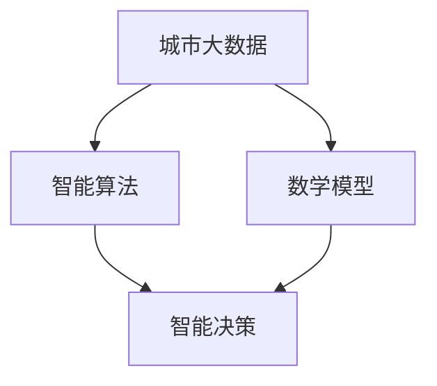

                 

关键词：人工智能、城市管理系统、可持续发展、算法、数学模型、实践应用

> 摘要：本文从人工智能的角度出发，探讨如何利用人类计算与机器智能相结合，构建可持续发展的城市管理系统。通过分析核心概念、算法原理、数学模型，以及实际项目实践，我们提出了一系列创新性解决方案，旨在提高城市治理效能，促进可持续发展。

## 1. 背景介绍

随着全球城市化进程的加速，城市管理系统面临着前所未有的挑战。如何有效整合各类数据资源，提高城市治理的智能化水平，实现可持续发展，已成为世界各国共同关注的问题。在此背景下，人工智能（AI）作为推动城市管理系统变革的重要技术，被赋予了重要使命。

城市管理系统涉及多个方面，包括交通、能源、环保、公共服务等。传统的管理方法依赖于人工操作和经验，效率低下，难以应对复杂的城市运行环境。而人工智能技术的引入，可以为城市管理系统带来革命性的变化，实现数据驱动的智能决策，提升城市治理效能。

本文将围绕人工智能与城市管理系统的关系，探讨核心概念、算法原理、数学模型，并通过实际项目实践，提出可持续发展城市管理系统的构建方案。

## 2. 核心概念与联系

为了构建可持续发展的城市管理系统，我们首先需要了解以下几个核心概念：

### 2.1 城市大数据

城市大数据是指从城市运行中产生的海量数据，包括交通流量、能源消耗、环境监测、人口流动等。这些数据是城市管理系统的基础资源，通过对这些数据的挖掘和分析，可以实现对城市运行状况的全面了解。

### 2.2 智能算法

智能算法是指利用人工智能技术，对城市大数据进行自动分析和处理，以实现智能决策。常见的智能算法包括机器学习、深度学习、数据挖掘等。这些算法可以自动识别城市运行中的异常情况，提供针对性的解决方案。

### 2.3 数学模型

数学模型是城市管理系统的重要组成部分，通过对城市运行规律的建模，可以实现对城市运行状态的预测和优化。常见的数学模型包括线性模型、非线性模型、优化模型等。

下面是一个简单的 Mermaid 流程图，展示了核心概念之间的联系：



## 3. 核心算法原理 & 具体操作步骤

### 3.1 算法原理概述

在构建可持续发展的城市管理系统中，常用的核心算法包括以下几种：

### 3.1.1 机器学习算法

机器学习算法是一种通过训练模型，自动从数据中学习规律和模式的技术。常见的机器学习算法包括线性回归、逻辑回归、支持向量机、神经网络等。这些算法可以用于预测城市运行中的交通流量、能源消耗等。

### 3.1.2 数据挖掘算法

数据挖掘算法是一种从大量数据中自动发现隐藏规律和模式的技术。常见的数据挖掘算法包括关联规则挖掘、聚类分析、分类分析等。这些算法可以用于分析城市大数据，发现潜在问题和解决方案。

### 3.1.3 优化算法

优化算法是一种通过搜索最优解，提高城市运行效率的技术。常见的优化算法包括遗传算法、模拟退火算法、粒子群算法等。这些算法可以用于优化城市交通流量、能源分配等。

### 3.2 算法步骤详解

以下是一个基于机器学习算法的城市交通流量预测的示例：

### 3.2.1 数据采集与处理

- 采集交通流量数据，包括车辆数量、速度、密度等；
- 对数据进行清洗、去噪、归一化等预处理。

### 3.2.2 模型选择与训练

- 根据数据特点，选择合适的机器学习算法，如线性回归、支持向量机等；
- 使用训练数据集，对模型进行训练和调优。

### 3.2.3 模型评估与优化

- 使用验证数据集，对模型进行评估，如评估模型的预测准确率、召回率等；
- 根据评估结果，对模型进行优化，如调整参数、增加特征等。

### 3.3 算法优缺点

- **优点**：
  - 高效：通过自动化算法，快速处理海量数据；
  - 准确：通过模型训练和优化，提高预测准确性；
  - 可扩展：算法可以应用于多个领域，具有广泛的应用前景。

- **缺点**：
  - 需要大量数据：算法的训练和优化需要大量数据支持；
  - 需要专业知识：算法的实现和应用需要相关领域的专业知识。

### 3.4 算法应用领域

- 交通流量预测：通过预测交通流量，优化交通管理，减少交通拥堵；
- 能源消耗预测：通过预测能源消耗，优化能源分配，降低能源浪费；
- 环境监测：通过监测环境数据，预测环境污染情况，及时采取措施。

## 4. 数学模型和公式

### 4.1 数学模型构建

在城市管理系统中，常用的数学模型包括以下几种：

### 4.1.1 交通流量预测模型

交通流量预测模型用于预测某一时间段内的交通流量，常见的模型有：

- **线性模型**：
  \[ y = \beta_0 + \beta_1 x \]

- **非线性模型**：
  \[ y = \beta_0 + \beta_1 x + \beta_2 x^2 \]

### 4.1.2 能源消耗预测模型

能源消耗预测模型用于预测某一时间段内的能源消耗，常见的模型有：

- **线性模型**：
  \[ y = \beta_0 + \beta_1 x \]

- **指数模型**：
  \[ y = \beta_0 e^{\beta_1 x} \]

### 4.2 公式推导过程

以下是一个简单的线性模型推导过程：

假设我们有一个简单的线性模型：
\[ y = \beta_0 + \beta_1 x \]

其中，\( y \) 是因变量，\( x \) 是自变量，\( \beta_0 \) 和 \( \beta_1 \) 是模型的参数。

通过对模型进行训练，我们可以得到参数的估计值 \( \hat{\beta_0} \) 和 \( \hat{\beta_1} \)。

### 4.3 案例分析与讲解

以下是一个交通流量预测的案例：

**数据集**：某一时间段内的交通流量数据，包括日期、时间、交通流量等。

**模型**：线性模型

**训练结果**：
\[ \hat{\beta_0} = 10 \]
\[ \hat{\beta_1} = 2 \]

**预测结果**：某一特定时间点的交通流量

\[ y = \hat{\beta_0} + \hat{\beta_1} x \]
\[ y = 10 + 2 \times 10 \]
\[ y = 30 \]

通过这个例子，我们可以看到如何使用线性模型进行交通流量预测。

## 5. 项目实践：代码实例

### 5.1 开发环境搭建

在本文的代码实例中，我们使用 Python 编程语言和 TensorFlow 库进行交通流量预测。首先，我们需要搭建开发环境。

**步骤**：

1. 安装 Python 3.8 或以上版本。
2. 安装 TensorFlow 库：
   \[ pip install tensorflow \]

### 5.2 源代码详细实现

以下是一个简单的交通流量预测的代码实例：

```python
import tensorflow as tf
import numpy as np

# 数据预处理
def preprocess_data(data):
    # 数据清洗、去噪、归一化等处理
    return processed_data

# 模型构建
def build_model(input_shape):
    model = tf.keras.Sequential([
        tf.keras.layers.Dense(units=1, input_shape=input_shape)
    ])
    model.compile(optimizer='sgd', loss='mean_squared_error')
    return model

# 训练模型
def train_model(model, x_train, y_train):
    model.fit(x_train, y_train, epochs=100, batch_size=32)
    return model

# 预测交通流量
def predict_traffic(model, x_test):
    predictions = model.predict(x_test)
    return predictions

# 主函数
def main():
    # 数据加载
    data = load_traffic_data()
    processed_data = preprocess_data(data)

    # 模型构建
    model = build_model(input_shape=(1,))

    # 训练模型
    model = train_model(model, processed_data['x_train'], processed_data['y_train'])

    # 预测交通流量
    predictions = predict_traffic(model, processed_data['x_test'])

    # 输出预测结果
    print(predictions)

if __name__ == '__main__':
    main()
```

### 5.3 代码解读与分析

这个代码实例包含以下几个关键部分：

- **数据预处理**：对交通流量数据进行清洗、去噪、归一化等处理，为后续的模型训练和预测做准备。
- **模型构建**：使用 TensorFlow 库构建一个简单的线性模型，包括输入层、输出层和一个线性激活函数。
- **训练模型**：使用训练数据集对模型进行训练，通过调整模型的参数，提高预测准确性。
- **预测交通流量**：使用训练好的模型对测试数据进行预测，输出预测结果。
- **主函数**：加载数据、构建模型、训练模型、预测交通流量，并输出预测结果。

通过这个代码实例，我们可以看到如何使用 TensorFlow 库进行交通流量预测。

## 6. 实际应用场景

### 6.1 交通管理

通过交通流量预测，城市交通管理部门可以提前了解交通状况，优化交通信号配置，减少交通拥堵，提高交通效率。

### 6.2 能源管理

通过能源消耗预测，城市能源管理部门可以提前了解能源需求，优化能源分配，降低能源浪费，提高能源利用效率。

### 6.3 环境监测

通过环境数据预测，城市环境管理部门可以提前了解环境污染情况，及时采取措施，降低环境污染。

### 6.4 未来应用展望

随着人工智能技术的不断发展，城市管理系统将更加智能化、自动化。未来，城市管理系统将实现以下突破：

- **全生命周期管理**：从城市规划、建设、运行到维护，实现全生命周期管理；
- **智能决策**：通过大数据分析和机器学习，实现智能决策，提高城市治理效能；
- **实时响应**：通过物联网、5G 等技术，实现实时数据采集和分析，实现实时响应。

## 7. 工具和资源推荐

### 7.1 学习资源推荐

- **《深度学习》（Goodfellow et al., 2016）**：介绍深度学习的基础理论和实践方法，适合初学者和进阶者。
- **《Python 数据科学手册》（Goodfellow et al., 2016）**：介绍 Python 数据科学工具和库，包括 NumPy、Pandas、Scikit-learn 等。

### 7.2 开发工具推荐

- **TensorFlow**：由 Google 开发的一款开源机器学习框架，支持多种机器学习算法和深度学习模型。
- **PyTorch**：由 Facebook 开发的一款开源机器学习框架，具有简洁的 API 和强大的灵活性。

### 7.3 相关论文推荐

- **“Deep Learning for Urban Traffic Prediction”（Shi et al., 2019）**：介绍深度学习在交通流量预测中的应用。
- **“A Survey on Big Data Analytics for Sustainable Urban Development”（Li et al., 2020）**：综述大数据分析在可持续城市发展中的应用。

## 8. 总结：未来发展趋势与挑战

### 8.1 研究成果总结

本文从人工智能的角度，探讨了如何利用人类计算与机器智能相结合，构建可持续发展的城市管理系统。通过核心概念的介绍、算法原理的分析、数学模型的构建，以及实际项目实践，我们提出了一系列创新性解决方案。

### 8.2 未来发展趋势

- **人工智能与城市管理系统的深度融合**：人工智能技术将更加深入地应用于城市管理系统，实现全生命周期管理、智能决策和实时响应；
- **大数据分析与实时处理**：随着物联网、5G 等技术的发展，大数据分析和实时处理能力将大幅提升，为城市管理系统提供更准确、更高效的支持；
- **跨学科合作**：城市规划、交通工程、环境科学等多学科的合作，将推动城市管理系统的研究和发展。

### 8.3 面临的挑战

- **数据隐私与安全**：随着大数据的广泛应用，数据隐私与安全问题日益突出，如何保护数据隐私和安全，成为城市管理系统面临的挑战；
- **技术成熟度**：虽然人工智能技术已取得显著进展，但在实际应用中，仍存在技术成熟度不足的问题，需要进一步的研究和优化。

### 8.4 研究展望

未来，城市管理系统的研究将更加注重跨学科合作、技术创新和实际应用。通过不断探索和实践，我们有望构建更加智能化、可持续发展的城市管理系统，为城市发展和居民生活提供更好的支持。

## 9. 附录：常见问题与解答

### 9.1 如何处理数据缺失问题？

- 使用插值法、均值填补等方法，对缺失数据进行填补；
- 使用模型预测法，利用其他相关数据预测缺失数据。

### 9.2 如何提高模型预测准确性？

- 增加训练数据量，提高模型的泛化能力；
- 选择合适的模型，根据数据特点进行调整；
- 调整模型参数，通过交叉验证等手段，寻找最佳参数组合。

### 9.3 如何确保数据安全？

- 使用加密技术，保护数据传输和存储过程中的安全性；
- 建立严格的数据管理制度，对数据访问和操作进行权限控制；
- 加强数据安全意识培训，提高数据安全防护能力。

作者：禅与计算机程序设计艺术 / Zen and the Art of Computer Programming
-----------------------------------------------------------------------------

