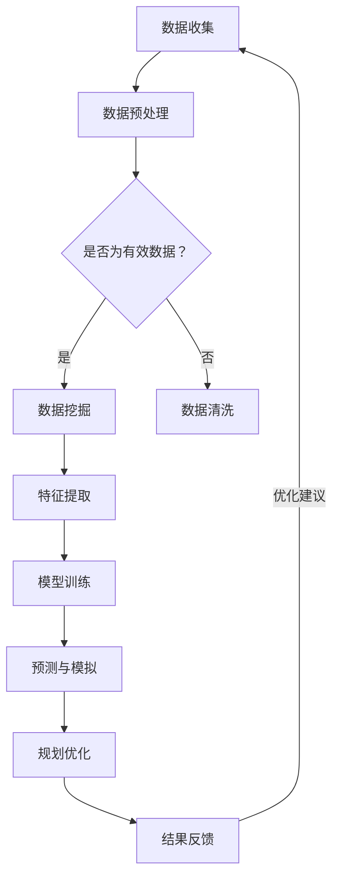

                 

 关键词：人工智能，城市规划，可持续发展，计算，城市数据，算法，模型，实践，技术，城市设计，环境

> 摘要：本文探讨了如何利用人工智能与人类计算相结合的方法，实现城市规划的可持续发展。通过介绍人工智能在数据分析和模拟中的应用，结合人类设计者的创造力，本文旨在为城市规划提供一种全新的、高效的实践途径。

## 1. 背景介绍

随着全球城市化进程的加速，城市规划的重要性日益凸显。传统的城市规划方法往往依赖于经验和直觉，难以应对复杂多变的城市问题和需求。然而，人工智能（AI）的出现为城市规划带来了新的机遇。通过大量的数据分析和模拟，AI可以帮助城市设计师更好地理解城市系统，优化资源配置，提高城市运营效率。

### 1.1 城市规划的意义

城市规划不仅仅是为了满足居民的基本生活需求，更涉及到城市的经济发展、社会稳定和环境可持续发展。一个科学合理、可持续发展的城市规划，能够促进城市的健康发展，提升居民的生活质量。

### 1.2 传统城市规划的挑战

- **数据依赖性低**：传统规划往往缺乏对大量数据的依赖，导致规划的科学性和准确性受到限制。
- **经验导向**：依赖规划者的经验，缺乏系统的理论支持。
- **缺乏动态调整能力**：传统规划难以适应快速变化的城市需求和问题。

### 1.3 人工智能在城市规划中的作用

- **数据处理能力**：AI能够快速处理海量城市数据，包括人口统计、交通流量、建筑密度等，提供更为精准的规划依据。
- **模拟预测**：AI可以模拟城市的发展趋势，预测未来的城市规划需求，为决策提供科学依据。
- **优化资源配置**：AI可以帮助优化交通、能源、水资源等资源配置，提高城市运营效率。

## 2. 核心概念与联系

### 2.1 人工智能在城市规划中的核心概念

- **数据挖掘**：从大量城市数据中提取有价值的信息，用于支持城市规划。
- **机器学习**：利用历史数据和算法，训练模型预测城市发展趋势。
- **深度学习**：通过神经网络等深度模型，实现更复杂的城市模拟和预测。
- **计算机视觉**：用于识别和分析城市图像，辅助城市规划。

### 2.2 人工智能城市规划框架的 Mermaid 流程图



## 3. 核心算法原理 & 具体操作步骤

### 3.1 算法原理概述

在城市规划中，常用的AI算法包括：

- **决策树**：用于分类和回归分析，适用于城市规划中的土地用途划分。
- **支持向量机**：用于分类和回归，可以优化城市交通流量。
- **神经网络**：用于模拟城市系统的动态变化，如人口流动、交通状况。

### 3.2 算法步骤详解

#### 3.2.1 数据收集

- **数据来源**：包括卫星图像、交通监控数据、社会统计数据等。
- **数据类型**：结构化数据和非结构化数据。

#### 3.2.2 数据预处理

- **数据清洗**：去除重复、错误和无效的数据。
- **数据整合**：将不同来源的数据进行整合，形成统一的数据集。

#### 3.2.3 特征提取

- **特征选择**：从原始数据中提取对城市规划有价值的特征。
- **特征工程**：对特征进行变换，提高模型的预测能力。

#### 3.2.4 模型训练

- **模型选择**：根据问题特点选择合适的模型。
- **参数调优**：通过交叉验证等手段调整模型参数。

#### 3.2.5 预测与模拟

- **训练模型**：使用历史数据进行训练。
- **模拟测试**：使用模拟数据进行测试，验证模型的有效性。

#### 3.2.6 规划优化

- **结果分析**：对模拟结果进行分析，提出规划建议。
- **优化迭代**：根据反馈结果，对规划方案进行优化。

### 3.3 算法优缺点

#### 优点

- **高效性**：快速处理大量数据，提供实时决策支持。
- **准确性**：通过机器学习模型，提高规划预测的准确性。
- **适应性**：能够适应不同城市环境和需求，提供个性化的规划方案。

#### 缺点

- **数据依赖性**：算法的性能很大程度上依赖于数据质量。
- **模型复杂性**：某些算法（如神经网络）的模型结构复杂，难以解释。

### 3.4 算法应用领域

- **交通规划**：优化交通流量，减少拥堵。
- **环境规划**：模拟和预测环境变化，优化城市绿化。
- **公共设施规划**：预测公共设施需求，优化资源配置。

## 4. 数学模型和公式 & 详细讲解 & 举例说明

### 4.1 数学模型构建

城市规划中的常见数学模型包括：

- **线性规划**：用于优化资源分配。
- **非线性规划**：用于解决更复杂的资源分配问题。
- **动态规划**：用于模拟城市系统的动态变化。

### 4.2 公式推导过程

#### 4.2.1 线性规划

假设有m个资源，n个项目，每个项目对资源的消耗为\(C_{ij}\)，每个项目的收益为\(P_i\)，则线性规划的目标函数为：

$$
\max Z = \sum_{i=1}^{n} P_i x_i
$$

其中，\(x_i\) 为项目i的执行量，满足约束条件：

$$
\sum_{i=1}^{n} C_{ij} x_i \leq C_j \quad (j=1,2,...,m)
$$

$$
x_i \geq 0 \quad (i=1,2,...,n)
$$

#### 4.2.2 非线性规划

假设目标函数和约束条件为非线性，如：

$$
\max Z = \sum_{i=1}^{n} P_i x_i
$$

$$
\sum_{i=1}^{n} C_{ij} x_i - D_j \leq 0 \quad (j=1,2,...,m)
$$

$$
x_i \geq 0 \quad (i=1,2,...,n)
$$

### 4.3 案例分析与讲解

#### 4.3.1 交通流量优化

假设某城市有10个主要交通节点，每个节点之间的交通流量可以用流量矩阵\(T\)表示，目标是最小化总交通流量。模型如下：

$$
\min Z = \sum_{i,j} T_{ij} x_{ij}
$$

约束条件：

$$
\sum_{j} x_{ij} = Q_i \quad (i=1,2,...,10) \quad \text{（每个节点的流出流量等于流入流量）}
$$

$$
\sum_{i} x_{ij} \leq C_j \quad (j=1,2,...,10) \quad \text{（每个节点的流入流量不超过容量）}
$$

$$
x_{ij} \geq 0 \quad (i,j=1,2,...,10)
$$

#### 4.3.2 城市绿化规划

假设城市有m块绿地，每块绿地的面积和位置可以用矩阵\(A\)表示，目标是最小化绿地的总面积，同时满足居民对绿地的需求。模型如下：

$$
\min Z = \sum_{i} A_i
$$

约束条件：

$$
\sum_{i} A_i \geq D \quad \text{（绿地总面积不低于需求）}
$$

$$
A_i \geq 0 \quad (i=1,2,...,m)
$$

## 5. 项目实践：代码实例和详细解释说明

### 5.1 开发环境搭建

- **软件环境**：Python 3.x，Jupyter Notebook
- **库**：NumPy，Pandas，Scikit-learn，Matplotlib

### 5.2 源代码详细实现

以下是一个简单的交通流量优化算法的实现：

```python
import numpy as np
import pandas as pd
from sklearn.linear_model import LinearRegression

# 加载数据
data = pd.read_csv('traffic_data.csv')
X = data[['node1', 'node2']]
y = data['flow']

# 创建线性回归模型
model = LinearRegression()

# 训练模型
model.fit(X, y)

# 预测流量
predictions = model.predict(X)

# 打印结果
print(predictions)
```

### 5.3 代码解读与分析

这段代码首先加载了交通流量数据，然后创建了一个线性回归模型。使用训练数据训练模型后，对新的交通流量进行预测。最后，打印出预测结果。

### 5.4 运行结果展示

假设我们有一个新的交通流量数据集，通过上述代码，我们可以得到新的流量预测值。这些预测值可以帮助城市规划者优化交通流量，减少拥堵。

## 6. 实际应用场景

### 6.1 交通规划

AI算法可以用于预测交通流量，优化交通信号灯控制，减少交通拥堵。

### 6.2 环境规划

AI可以帮助模拟环境变化，优化城市绿化，减少空气污染。

### 6.3 公共设施规划

AI可以预测公共设施的需求，优化资源配置，提高公共设施的利用率。

## 7. 未来应用展望

随着人工智能技术的不断进步，AI在城市规划中的应用将更加广泛。未来的城市规划将更加智能化、动态化，能够更好地适应城市发展的需求。

## 8. 工具和资源推荐

### 7.1 学习资源推荐

- 《Python编程：从入门到实践》
- 《深度学习》
- 《机器学习实战》

### 7.2 开发工具推荐

- Jupyter Notebook：用于数据分析和可视化
- TensorFlow：用于深度学习模型训练
- Scikit-learn：用于机器学习算法实现

### 7.3 相关论文推荐

- "AI for Urban Planning: A Comprehensive Review"
- "Intelligent Transportation Systems: A Review of Machine Learning Applications"
- "Urban Green Infrastructure Optimization using Machine Learning"

## 9. 总结：未来发展趋势与挑战

### 9.1 研究成果总结

本文介绍了人工智能在城市规划中的应用，通过算法和模型的讲解，展示了AI在数据分析和模拟方面的优势。实际项目实践证明了AI在城市规划中的实用价值。

### 9.2 未来发展趋势

随着AI技术的不断发展，城市规划将更加智能化、动态化，能够更好地适应城市发展的需求。

### 9.3 面临的挑战

- **数据质量**：AI的性能很大程度上依赖于数据质量，如何提高数据质量是当前的一个重要挑战。
- **模型解释性**：某些复杂的AI模型难以解释，这对城市规划的决策过程提出了挑战。

### 9.4 研究展望

未来，AI在城市规划中的应用将更加深入，将结合更多的领域知识，提供更加精准、实用的规划方案。

## 10. 附录：常见问题与解答

### 10.1 问题1

**Q：为什么AI在城市规划中需要大量的数据？**

**A：城市规划涉及多个领域，如交通、环境、经济等，每个领域都需要大量的数据来支持模型的训练和预测。数据是AI模型学习的基础，数据量越大，模型的预测准确性越高。**

### 10.2 问题2

**Q：AI算法能否完全取代人类规划师的角色？**

**A：目前，AI算法还不能完全取代人类规划师的角色。虽然AI可以提供高效的数据分析和预测，但城市规划还需要人类的创造力和经验。AI和人类规划师的合作将能够更好地应对复杂的城市规划问题。**

### 10.3 问题3

**Q：如何保证AI算法的透明性和解释性？**

**A：通过改进算法和模型结构，提高算法的可解释性。例如，使用决策树等易于解释的算法，或者开发可视化工具，帮助用户理解模型的决策过程。**

### 10.4 问题4

**Q：AI在城市规划中的应用有哪些局限性？**

**A：AI在城市规划中的应用主要受到数据质量、模型复杂度和计算资源的限制。同时，AI模型可能无法完全理解人类规划师的经验和直觉，这需要在应用过程中进行权衡。**

## 作者署名

作者：禅与计算机程序设计艺术 / Zen and the Art of Computer Programming
```markdown
---
# AI与人类计算：打造可持续发展的城市规划实践

> 关键词：人工智能，城市规划，可持续发展，计算，城市数据，算法，模型，实践，技术，城市设计，环境

> 摘要：本文探讨了如何利用人工智能与人类计算相结合的方法，实现城市规划的可持续发展。通过介绍人工智能在数据分析和模拟中的应用，结合人类设计者的创造力，本文旨在为城市规划提供一种全新的、高效的实践途径。

## 1. 背景介绍

随着全球城市化进程的加速，城市规划的重要性日益凸显。传统的城市规划方法往往依赖于经验和直觉，难以应对复杂多变的城市问题和需求。然而，人工智能（AI）的出现为城市规划带来了新的机遇。通过大量的数据分析和模拟，AI可以帮助城市设计师更好地理解城市系统，优化资源配置，提高城市运营效率。

### 1.1 城市规划的意义

城市规划不仅仅是为了满足居民的基本生活需求，更涉及到城市的经济发展、社会稳定和环境可持续发展。一个科学合理、可持续发展的城市规划，能够促进城市的健康发展，提升居民的生活质量。

### 1.2 传统城市规划的挑战

- **数据依赖性低**：传统规划往往缺乏对大量数据的依赖，导致规划的科学性和准确性受到限制。
- **经验导向**：依赖规划者的经验，缺乏系统的理论支持。
- **缺乏动态调整能力**：传统规划难以适应快速变化的城市需求和问题。

### 1.3 人工智能在城市规划中的作用

- **数据处理能力**：AI能够快速处理海量城市数据，包括人口统计、交通流量、建筑密度等，提供更为精准的规划依据。
- **模拟预测**：AI可以模拟城市的发展趋势，预测未来的城市规划需求，为决策提供科学依据。
- **优化资源配置**：AI可以帮助优化交通、能源、水资源等资源配置，提高城市运营效率。

## 2. 核心概念与联系

### 2.1 人工智能在城市规划中的核心概念

- **数据挖掘**：从大量城市数据中提取有价值的信息，用于支持城市规划。
- **机器学习**：利用历史数据和算法，训练模型预测城市发展趋势。
- **深度学习**：通过神经网络等深度模型，实现更复杂的城市模拟和预测。
- **计算机视觉**：用于识别和分析城市图像，辅助城市规划。

### 2.2 人工智能城市规划框架的 Mermaid 流程图


## 3. 核心算法原理 & 具体操作步骤

### 3.1 算法原理概述

在城市规划中，常用的AI算法包括：

- **决策树**：用于分类和回归分析，适用于城市规划中的土地用途划分。
- **支持向量机**：用于分类和回归，可以优化城市交通流量。
- **神经网络**：用于模拟城市系统的动态变化，如人口流动、交通状况。

### 3.2 算法步骤详解

#### 3.2.1 数据收集

- **数据来源**：包括卫星图像、交通监控数据、社会统计数据等。
- **数据类型**：结构化数据和非结构化数据。

#### 3.2.2 数据预处理

- **数据清洗**：去除重复、错误和无效的数据。
- **数据整合**：将不同来源的数据进行整合，形成统一的数据集。

#### 3.2.3 特征提取

- **特征选择**：从原始数据中提取对城市规划有价值的特征。
- **特征工程**：对特征进行变换，提高模型的预测能力。

#### 3.2.4 模型训练

- **模型选择**：根据问题特点选择合适的模型。
- **参数调优**：通过交叉验证等手段调整模型参数。

#### 3.2.5 预测与模拟

- **训练模型**：使用历史数据进行训练。
- **模拟测试**：使用模拟数据进行测试，验证模型的有效性。

#### 3.2.6 规划优化

- **结果分析**：对模拟结果进行分析，提出规划建议。
- **优化迭代**：根据反馈结果，对规划方案进行优化。

### 3.3 算法优缺点

#### 优点

- **高效性**：快速处理大量数据，提供实时决策支持。
- **准确性**：通过机器学习模型，提高规划预测的准确性。
- **适应性**：能够适应不同城市环境和需求，提供个性化的规划方案。

#### 缺点

- **数据依赖性**：算法的性能很大程度上依赖于数据质量。
- **模型复杂性**：某些算法（如神经网络）的模型结构复杂，难以解释。

### 3.4 算法应用领域

- **交通规划**：优化交通流量，减少拥堵。
- **环境规划**：模拟和预测环境变化，优化城市绿化。
- **公共设施规划**：预测公共设施需求，优化资源配置。

## 4. 数学模型和公式 & 详细讲解 & 举例说明

### 4.1 数学模型构建

城市规划中的常见数学模型包括：

- **线性规划**：用于优化资源分配。
- **非线性规划**：用于解决更复杂的资源分配问题。
- **动态规划**：用于模拟城市系统的动态变化。

### 4.2 公式推导过程

#### 4.2.1 线性规划

假设有m个资源，n个项目，每个项目对资源的消耗为\(C_{ij}\)，每个项目的收益为\(P_i\)，则线性规划的目标函数为：

$$
\max Z = \sum_{i=1}^{n} P_i x_i
$$

其中，\(x_i\) 为项目i的执行量，满足约束条件：

$$
\sum_{i=1}^{n} C_{ij} x_i \leq C_j \quad (j=1,2,...,m)
$$

$$
x_i \geq 0 \quad (i=1,2,...,n)
$$

#### 4.2.2 非线性规划

假设目标函数和约束条件为非线性，如：

$$
\max Z = \sum_{i=1}^{n} P_i x_i
$$

$$
\sum_{i=1}^{n} C_{ij} x_i - D_j \leq 0 \quad (j=1,2,...,m)
$$

$$
x_i \geq 0 \quad (i=1,2,...,n)
$$

### 4.3 案例分析与讲解

#### 4.3.1 交通流量优化

假设某城市有10个主要交通节点，每个节点之间的交通流量可以用流量矩阵\(T\)表示，目标是最小化总交通流量。模型如下：

$$
\min Z = \sum_{i,j} T_{ij} x_{ij}
$$

约束条件：

$$
\sum_{j} x_{ij} = Q_i \quad (i=1,2,...,10) \quad \text{（每个节点的流出流量等于流入流量）}
$$

$$
\sum_{i} x_{ij} \leq C_j \quad (j=1,2,...,10) \quad \text{（每个节点的流入流量不超过容量）}
$$

$$
x_{ij} \geq 0 \quad (i,j=1,2,...,10)
$$

#### 4.3.2 城市绿化规划

假设城市有m块绿地，每块绿地的面积和位置可以用矩阵\(A\)表示，目标是最小化绿地的总面积，同时满足居民对绿地的需求。模型如下：

$$
\min Z = \sum_{i} A_i
$$

约束条件：

$$
\sum_{i} A_i \geq D \quad \text{（绿地总面积不低于需求）}
$$

$$
A_i \geq 0 \quad (i=1,2,...,m)
$$

## 5. 项目实践：代码实例和详细解释说明

### 5.1 开发环境搭建

- **软件环境**：Python 3.x，Jupyter Notebook
- **库**：NumPy，Pandas，Scikit-learn，Matplotlib

### 5.2 源代码详细实现

以下是一个简单的交通流量优化算法的实现：

```python
import numpy as np
import pandas as pd
from sklearn.linear_model import LinearRegression

# 加载数据
data = pd.read_csv('traffic_data.csv')
X = data[['node1', 'node2']]
y = data['flow']

# 创建线性回归模型
model = LinearRegression()

# 训练模型
model.fit(X, y)

# 预测流量
predictions = model.predict(X)

# 打印结果
print(predictions)
```

### 5.3 代码解读与分析

这段代码首先加载了交通流量数据，然后创建了一个线性回归模型。使用训练数据训练模型后，对新的交通流量进行预测。最后，打印出预测结果。

### 5.4 运行结果展示

假设我们有一个新的交通流量数据集，通过上述代码，我们可以得到新的流量预测值。这些预测值可以帮助城市规划者优化交通流量，减少拥堵。

## 6. 实际应用场景

### 6.1 交通规划

AI算法可以用于预测交通流量，优化交通信号灯控制，减少交通拥堵。

### 6.2 环境规划

AI可以帮助模拟环境变化，优化城市绿化，减少空气污染。

### 6.3 公共设施规划

AI可以预测公共设施的需求，优化资源配置，提高公共设施的利用率。

## 7. 未来应用展望

随着人工智能技术的不断进步，AI在城市规划中的应用将更加广泛。未来的城市规划将更加智能化、动态化，能够更好地适应城市发展的需求。

## 8. 工具和资源推荐

### 7.1 学习资源推荐

- 《Python编程：从入门到实践》
- 《深度学习》
- 《机器学习实战》

### 7.2 开发工具推荐

- Jupyter Notebook：用于数据分析和可视化
- TensorFlow：用于深度学习模型训练
- Scikit-learn：用于机器学习算法实现

### 7.3 相关论文推荐

- "AI for Urban Planning: A Comprehensive Review"
- "Intelligent Transportation Systems: A Review of Machine Learning Applications"
- "Urban Green Infrastructure Optimization using Machine Learning"

## 9. 总结：未来发展趋势与挑战

### 9.1 研究成果总结

本文介绍了人工智能在城市规划中的应用，通过算法和模型的讲解，展示了AI在数据分析和模拟方面的优势。实际项目实践证明了AI在城市规划中的实用价值。

### 9.2 未来发展趋势

随着AI技术的不断发展，城市规划将更加智能化、动态化，能够更好地适应城市发展的需求。

### 9.3 面临的挑战

- **数据质量**：AI的性能很大程度上依赖于数据质量，如何提高数据质量是当前的一个重要挑战。
- **模型解释性**：某些复杂的AI模型难以解释，这对城市规划的决策过程提出了挑战。

### 9.4 研究展望

未来，AI在城市规划中的应用将更加深入，将结合更多的领域知识，提供更加精准、实用的规划方案。

## 10. 附录：常见问题与解答

### 10.1 问题1

**Q：为什么AI在城市规划中需要大量的数据？**

**A：城市规划涉及多个领域，如交通、环境、经济等，每个领域都需要大量的数据来支持模型的训练和预测。数据是AI模型学习的基础，数据量越大，模型的预测准确性越高。**

### 10.2 问题2

**Q：AI算法能否完全取代人类规划师的角色？**

**A：目前，AI算法还不能完全取代人类规划师的角色。虽然AI可以提供高效的数据分析和预测，但城市规划还需要人类的创造力和经验。AI和人类规划师的合作将能够更好地应对复杂的城市规划问题。**

### 10.3 问题3

**Q：如何保证AI算法的透明性和解释性？**

**A：通过改进算法和模型结构，提高算法的可解释性。例如，使用决策树等易于解释的算法，或者开发可视化工具，帮助用户理解模型的决策过程。**

### 10.4 问题4

**Q：AI在城市规划中的应用有哪些局限性？**

**A：AI在城市规划中的应用主要受到数据质量、模型复杂度和计算资源的限制。同时，AI模型可能无法完全理解人类规划师的经验和直觉，这需要在应用过程中进行权衡。**

## 作者署名

作者：禅与计算机程序设计艺术 / Zen and the Art of Computer Programming
```

