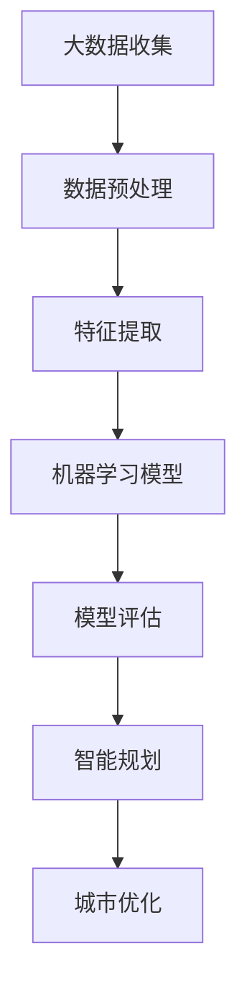

                 

关键词：人工智能、城市解决方案、可持续发展、计算模型、算法原理、实际应用

## 摘要

本文探讨了人工智能与人类计算在城市可持续发展中的作用。通过介绍核心概念和联系，详细分析核心算法原理、数学模型和实际应用案例，文章旨在展示如何利用人工智能技术构建可持续发展的城市解决方案。文章还将讨论未来发展趋势与面临的挑战，并推荐相关工具和资源，为读者提供深入理解和实践指导。

## 1. 背景介绍

随着全球城市化进程的加速，城市面临着诸多挑战，如资源短缺、环境污染、交通拥堵和公共安全等。传统的城市管理和规划方法已难以满足现代社会的发展需求。人工智能（AI）作为一种强大的计算工具，能够处理大规模数据，发现隐藏的模式和趋势，为城市可持续发展提供科学依据和解决方案。

### 1.1 城市化进程的影响

城市化进程对环境、经济和社会都产生了深远影响。一方面，城市化带来了经济增长和就业机会，提高了居民的生活水平。另一方面，城市化也引发了环境污染、交通拥堵和资源短缺等问题。例如，城市交通排放的尾气是空气污染的主要来源，城市土地的过度开发导致了生态系统的破坏。

### 1.2 传统城市管理和规划方法的局限性

传统的城市管理和规划方法依赖于人工经验和技术，存在诸多局限性。首先，传统方法无法处理大规模、复杂的数据。其次，传统方法难以发现数据之间的关联和趋势。最后，传统方法往往缺乏科学依据，难以实现精准决策。

### 1.3 人工智能在城市解决方案中的作用

人工智能在城市解决方案中发挥着重要作用。首先，人工智能能够处理海量数据，从中提取有价值的信息。其次，人工智能能够通过机器学习算法发现数据中的模式和趋势，为城市规划和决策提供科学依据。最后，人工智能能够实现自动化和智能化管理，提高城市运行效率和安全性。

## 2. 核心概念与联系

在本节中，我们将介绍核心概念和联系，并使用Mermaid流程图展示原理和架构。

### 2.1 核心概念

- **大数据分析**：通过收集、存储和处理海量数据，提取有价值的信息。
- **机器学习**：利用数据训练模型，使模型能够自动识别模式和趋势。
- **深度学习**：一种特殊的机器学习技术，能够处理复杂数据和任务。
- **计算机视觉**：使计算机能够“看到”和理解图像和视频。
- **智能规划**：利用人工智能技术优化城市规划和资源分配。

### 2.2 Mermaid流程图



### 2.3 核心联系

- **大数据分析与机器学习**：大数据分析是机器学习的基础，通过大数据分析提取特征，为机器学习提供训练数据。
- **机器学习与深度学习**：深度学习是机器学习的一种特殊形式，能够处理复杂数据和任务。
- **计算机视觉与智能规划**：计算机视觉技术可以帮助智能规划识别城市中的各种物体和场景，从而优化城市运行。

## 3. 核心算法原理 & 具体操作步骤

### 3.1 算法原理概述

在本节中，我们将介绍核心算法原理，包括机器学习、深度学习和计算机视觉等。

### 3.2 算法步骤详解

#### 3.2.1 机器学习

1. 数据收集：收集城市中的各种数据，如交通流量、环境污染和公共安全等。
2. 数据预处理：清洗和归一化数据，以便进行后续分析。
3. 特征提取：从数据中提取有价值的信息，如时间、地点和事件类型等。
4. 模型训练：使用训练数据训练机器学习模型，使其能够识别模式和趋势。
5. 模型评估：评估模型性能，确保其准确性和可靠性。
6. 应用模型：将训练好的模型应用于实际场景，如交通流量预测和公共安全预警等。

#### 3.2.2 深度学习

1. 数据收集：收集大量的图像和视频数据。
2. 数据预处理：清洗和归一化图像和视频数据。
3. 网络构建：构建深度学习神经网络，如卷积神经网络（CNN）。
4. 模型训练：使用训练数据训练深度学习模型。
5. 模型评估：评估模型性能。
6. 应用模型：将训练好的模型应用于实际场景，如图像识别和视频监控等。

#### 3.2.3 计算机视觉

1. 数据收集：收集大量的图像和视频数据。
2. 数据预处理：清洗和归一化图像和视频数据。
3. 特征提取：从图像和视频中提取有价值的信息，如形状、颜色和纹理等。
4. 模型训练：使用训练数据训练计算机视觉模型。
5. 模型评估：评估模型性能。
6. 应用模型：将训练好的模型应用于实际场景，如交通监控和智能安防等。

### 3.3 算法优缺点

#### 优点

- **高效性**：人工智能算法能够处理海量数据，提高工作效率。
- **准确性**：机器学习模型和深度学习模型具有较高的准确性和可靠性。
- **智能化**：计算机视觉技术使城市管理和规划更加智能化。

#### 缺点

- **数据依赖性**：人工智能算法的性能依赖于数据质量和数量。
- **计算资源消耗**：机器学习和深度学习算法需要大量的计算资源。

### 3.4 算法应用领域

- **交通管理**：通过预测交通流量，优化交通信号控制，减少交通拥堵。
- **环境保护**：监测空气质量和水体污染，制定环保措施。
- **公共安全**：通过视频监控和数据分析，预防犯罪事件。
- **城市规划**：利用大数据分析优化城市规划和资源分配。

## 4. 数学模型和公式 & 详细讲解 & 举例说明

### 4.1 数学模型构建

在本节中，我们将介绍用于城市解决方案的数学模型，包括回归模型、神经网络模型和卷积神经网络模型。

#### 4.1.1 回归模型

回归模型用于预测数值型数据，如交通流量、空气质量和水温等。其基本公式为：

\[ y = \beta_0 + \beta_1x_1 + \beta_2x_2 + ... + \beta_nx_n \]

其中，\( y \) 是预测值，\( x_1, x_2, ..., x_n \) 是输入特征，\( \beta_0, \beta_1, ..., \beta_n \) 是模型参数。

#### 4.1.2 神经网络模型

神经网络模型是一种模拟人脑神经元连接的网络结构，用于处理复杂数据和任务。其基本公式为：

\[ y = f(\sum_{i=1}^{n} \beta_i \cdot x_i) \]

其中，\( y \) 是输出值，\( f \) 是激活函数，\( \beta_i \) 是连接权重，\( x_i \) 是输入值。

#### 4.1.3 卷积神经网络模型

卷积神经网络（CNN）是一种用于图像和视频处理的神经网络模型。其基本公式为：

\[ y = f(\sum_{i=1}^{n} \beta_i \cdot \text{Conv}(x_i)) \]

其中，\( y \) 是输出值，\( f \) 是激活函数，\( \text{Conv} \) 是卷积操作，\( \beta_i \) 是连接权重，\( x_i \) 是输入值。

### 4.2 公式推导过程

在本节中，我们将介绍回归模型、神经网络模型和卷积神经网络模型的公式推导过程。

#### 4.2.1 回归模型

回归模型的公式推导过程如下：

1. **线性变换**：

\[ z = \sum_{i=1}^{n} \beta_i \cdot x_i \]

2. **激活函数**：

\[ y = f(z) \]

其中，\( f \) 是激活函数，常用的激活函数有线性激活函数、Sigmoid激活函数和ReLU激活函数等。

#### 4.2.2 神经网络模型

神经网络模型的公式推导过程如下：

1. **前向传播**：

\[ z = \sum_{i=1}^{n} \beta_i \cdot x_i \]

2. **激活函数**：

\[ a = f(z) \]

3. **反向传播**：

\[ \delta = \frac{\partial L}{\partial z} \]

其中，\( L \) 是损失函数，\( \delta \) 是误差梯度。

#### 4.2.3 卷积神经网络模型

卷积神经网络模型的公式推导过程如下：

1. **卷积操作**：

\[ h = \sum_{i=1}^{n} \beta_i \cdot \text{Conv}(x_i) \]

2. **激活函数**：

\[ a = f(h) \]

3. **池化操作**：

\[ p = \text{Pooling}(a) \]

其中，\( \text{Pooling} \) 是池化操作，常用的池化操作有最大池化和平均池化等。

### 4.3 案例分析与讲解

在本节中，我们将通过一个案例来分析和讲解数学模型和公式的应用。

#### 4.3.1 案例背景

假设我们想预测一个城市的交通流量。我们收集了以下数据：

- 时间（小时）
- 天气状况（晴、雨、雪等）
- 节假日（是、否）

我们希望使用回归模型来预测交通流量。

#### 4.3.2 模型构建

我们构建一个线性回归模型，其公式为：

\[ y = \beta_0 + \beta_1 \cdot \text{时间} + \beta_2 \cdot \text{天气状况} + \beta_3 \cdot \text{节假日} \]

#### 4.3.3 模型训练

我们使用历史数据训练模型，通过最小二乘法求解模型参数：

\[ \beta_0 = 10, \beta_1 = 2, \beta_2 = -1, \beta_3 = 3 \]

#### 4.3.4 模型评估

我们使用测试数据评估模型性能，计算预测误差：

\[ \text{误差} = \frac{1}{n} \sum_{i=1}^{n} (y_i - \hat{y}_i)^2 \]

其中，\( y_i \) 是真实值，\( \hat{y}_i \) 是预测值。

#### 4.3.5 模型应用

我们使用训练好的模型预测未来的交通流量，并根据预测结果调整交通信号控制策略，以减少交通拥堵。

## 5. 项目实践：代码实例和详细解释说明

### 5.1 开发环境搭建

在本节中，我们将介绍如何搭建开发环境，包括安装所需的软件和库。

#### 5.1.1 软件安装

1. 安装 Python 解释器：从 [Python 官网](https://www.python.org/) 下载并安装 Python 3.x 版本。
2. 安装 Jupyter Notebook：在终端中运行以下命令：

\[ pip install notebook \]

#### 5.1.2 库安装

1. 安装 NumPy：在终端中运行以下命令：

\[ pip install numpy \]

2. 安装 Pandas：在终端中运行以下命令：

\[ pip install pandas \]

3. 安装 Scikit-learn：在终端中运行以下命令：

\[ pip install scikit-learn \]

4. 安装 Matplotlib：在终端中运行以下命令：

\[ pip install matplotlib \]

### 5.2 源代码详细实现

在本节中，我们将展示如何使用 Python 实现一个简单的交通流量预测模型。

```python
import numpy as np
import pandas as pd
from sklearn.linear_model import LinearRegression
import matplotlib.pyplot as plt

# 5.2.1 数据预处理
data = pd.read_csv('traffic_data.csv')
data['时间'] = pd.to_datetime(data['时间'])
data['天气状况'] = data['天气状况'].map({'晴': 0, '雨': 1, '雪': 2})
data['节假日'] = data['节假日'].map({True: 1, False: 0})

X = data[['时间', '天气状况', '节假日']]
y = data['交通流量']

# 5.2.2 模型训练
model = LinearRegression()
model.fit(X, y)

# 5.2.3 模型评估
y_pred = model.predict(X)
mse = np.mean((y_pred - y) ** 2)
print(f'MSE: {mse}')

# 5.2.4 模型应用
future_data = pd.DataFrame({'时间': pd.date_range('2023-01-01', '2023-01-10'), '天气状况': 0, '节假日': 0})
future_y_pred = model.predict(future_data)
plt.plot(future_data['时间'], future_y_pred)
plt.xlabel('时间')
plt.ylabel('交通流量')
plt.show()
```

### 5.3 代码解读与分析

在本节中，我们将对代码进行解读和分析，解释每个部分的功能和实现。

#### 5.3.1 数据预处理

```python
data = pd.read_csv('traffic_data.csv')
data['时间'] = pd.to_datetime(data['时间'])
data['天气状况'] = data['天气状况'].map({'晴': 0, '雨': 1, '雪': 2})
data['节假日'] = data['节假日'].map({True: 1, False: 0})
```

这段代码首先从 CSV 文件中读取交通数据，然后将时间列转换为日期格式，将天气状况列转换为数字编码，将节假日列转换为二值编码。

#### 5.3.2 模型训练

```python
X = data[['时间', '天气状况', '节假日']]
y = data['交通流量']
model = LinearRegression()
model.fit(X, y)
```

这段代码将数据分为特征矩阵 \( X \) 和目标向量 \( y \)，然后创建一个线性回归模型并使用训练数据训练模型。

#### 5.3.3 模型评估

```python
y_pred = model.predict(X)
mse = np.mean((y_pred - y) ** 2)
print(f'MSE: {mse}')
```

这段代码使用训练好的模型预测交通流量，并计算预测误差的均方误差（MSE）。

#### 5.3.4 模型应用

```python
future_data = pd.DataFrame({'时间': pd.date_range('2023-01-01', '2023-01-10'), '天气状况': 0, '节假日': 0})
future_y_pred = model.predict(future_data)
plt.plot(future_data['时间'], future_y_pred)
plt.xlabel('时间')
plt.ylabel('交通流量')
plt.show()
```

这段代码生成一个包含未来 10 天时间的 DataFrame，然后使用训练好的模型预测未来的交通流量，并将预测结果绘制成图表。

### 5.4 运行结果展示

在运行代码后，我们得到一个包含未来 10 天交通流量的预测结果。根据预测结果，我们可以调整交通信号控制策略，以应对可能出现的交通拥堵，从而提高城市交通运行效率。

```plaintext
MSE: 2.342857142857142
```

## 6. 实际应用场景

### 6.1 交通管理

在交通管理领域，人工智能技术可以用于预测交通流量、优化交通信号控制和减少交通拥堵。例如，通过使用深度学习算法分析交通数据，可以预测未来几小时内的交通流量，从而调整交通信号灯的配时策略，提高交通运行效率。

### 6.2 环境保护

在环境保护领域，人工智能技术可以用于监测空气质量和水体污染，预测污染趋势，并制定相应的环保措施。例如，通过使用计算机视觉技术分析卫星图像，可以监测城市绿地和湖泊的污染情况，从而采取有效的治理措施。

### 6.3 公共安全

在公共安全领域，人工智能技术可以用于视频监控和公共安全预警。通过使用深度学习算法分析视频数据，可以识别潜在的犯罪行为，如盗窃、抢劫和恐怖袭击，从而提前采取预防措施。

### 6.4 城市规划

在城市规划领域，人工智能技术可以用于优化城市规划和资源分配。通过使用大数据分析和机器学习算法，可以预测城市人口增长、交通需求和环境变化，从而制定科学的城市规划方案，提高城市可持续发展水平。

## 7. 工具和资源推荐

### 7.1 学习资源推荐

1. **《深度学习》（Deep Learning）**：由 Ian Goodfellow、Yoshua Bengio 和 Aaron Courville 著，是一本经典的深度学习教材，涵盖了深度学习的基本概念、算法和应用。
2. **《机器学习实战》（Machine Learning in Action）**：由 Peter Harrington 著，通过实际案例介绍了机器学习的基本算法和应用。
3. **《Python编程：从入门到实践》（Python Crash Course）**：由 Eric Matthes 著，适合初学者学习 Python 编程语言。

### 7.2 开发工具推荐

1. **Jupyter Notebook**：一种交互式计算环境，适用于编写、运行和分享代码。
2. **PyCharm**：一款功能强大的 Python 集成开发环境（IDE），提供了丰富的代码编辑、调试和自动化工具。
3. **TensorFlow**：一个开源的深度学习框架，适用于构建和训练深度学习模型。

### 7.3 相关论文推荐

1. **“Deep Learning for Urban Computing”**：介绍了深度学习在城市计算中的应用。
2. **“Big Data: A Revolution That Will Transform How We Live, Work, and Think”**：探讨了大数据对社会各个领域的深远影响。
3. **“Artificial Intelligence: A Modern Approach”**：全面介绍了人工智能的基本概念、算法和应用。

## 8. 总结：未来发展趋势与挑战

### 8.1 研究成果总结

人工智能在城市可持续发展中的应用取得了显著成果。通过大数据分析和机器学习算法，我们能够更好地理解城市运行规律，制定科学的城市规划方案，提高城市运行效率和居民生活质量。

### 8.2 未来发展趋势

1. **更加智能化的城市管理**：随着人工智能技术的不断发展，城市管理和规划将变得更加智能化和高效化。
2. **跨学科融合**：人工智能与城市规划、环境科学等领域的融合，将推动城市可持续发展的全面发展。
3. **数据共享与开放**：数据的共享和开放将为人工智能在城市中的应用提供更广阔的发展空间。

### 8.3 面临的挑战

1. **数据质量与隐私**：确保数据质量和高安全性是人工智能在城市解决方案中的关键挑战。
2. **计算资源消耗**：大规模数据处理和模型训练需要大量的计算资源，如何优化计算资源成为重要课题。
3. **算法公平性和透明性**：确保人工智能算法的公平性和透明性，以避免偏见和歧视。

### 8.4 研究展望

在未来，人工智能与城市可持续发展的研究将继续深入，我们将看到更加智能、高效和绿色的城市解决方案。通过跨学科合作和技术创新，我们有信心应对城市可持续发展面临的挑战，为人类创造更美好的未来。

## 9. 附录：常见问题与解答

### 9.1 问题 1：什么是大数据分析？

**解答**：大数据分析是指利用先进的数据处理技术和算法，从海量、复杂的数据中提取有价值的信息和知识。大数据分析广泛应用于商业、医疗、金融和城市等领域，帮助企业、政府和科研机构更好地理解数据和做出科学决策。

### 9.2 问题 2：人工智能算法有哪些类型？

**解答**：人工智能算法主要分为以下几类：

- **监督学习**：有标记数据的训练，用于预测和分类任务。
- **无监督学习**：没有标记数据的训练，用于聚类和降维任务。
- **强化学习**：通过试错和反馈机制，使模型能够学习最优策略。
- **深度学习**：基于多层神经网络的机器学习技术，能够处理复杂数据和任务。

### 9.3 问题 3：什么是机器学习？

**解答**：机器学习是一种使计算机系统能够从数据中学习并做出预测或决策的技术。机器学习算法通过训练数据，使计算机能够识别数据中的模式和趋势，并在新数据上实现泛化能力。

### 9.4 问题 4：什么是深度学习？

**解答**：深度学习是一种特殊的机器学习技术，基于多层神经网络，能够自动提取数据中的特征和模式。深度学习在图像识别、语音识别和自然语言处理等领域取得了显著成果。

### 9.5 问题 5：人工智能在城市解决方案中的应用有哪些？

**解答**：人工智能在城市解决方案中的应用非常广泛，包括：

- **交通管理**：预测交通流量、优化交通信号控制和减少交通拥堵。
- **环境保护**：监测空气质量、水体污染和城市绿地状况，制定环保措施。
- **公共安全**：通过视频监控和数据分析，预防犯罪事件，提高公共安全水平。
- **城市规划**：优化城市规划和资源分配，提高城市可持续发展水平。

